# Protos Vision Reacquisition: Open Questions, Research, and Tentative Proposals

> **TENTATIVE, NON-AUTHORITATIVE AGENT SYNTHESIS.** Psyche review is required. Accepted material must be decomposed and deliberately ported into authoritative design logs, owning `ARCHITECTURE.md` files, READMEs, or standards.

Date: 2026-07-31

Scope: a first-principles map of the unresolved Protos language-design space after the 2026-07-31 psyche correction, supplemented by research and executable experiments. This report does not authorize implementation and does not make its proposals authoritative by recording them.

Companion: [the first-principles reacquisition report](/home/li/primary/reports/protosVisionReacquisition/1-Design-psyche-vision-from-first-principles.md).

## 0. How to read this report

The psyche asked for thought objects: concrete examples, counterexamples, diagrams, and alternatives that can make the vision clearer through interaction. This report supplies those objects while preserving the difference between what is ruled, what is merely required in some form, what exists, and what an agent proposes.

### Authority and evidence legend

| Mark | Meaning |
|:--|:--|
| **[PV] Psyche-verbatim / psyche-ruled** | A direct psyche statement or a ruling already preserved in an authoritative design log. |
| **[PT] Psyche thought** | A possibility explicitly raised as a thought or question, not a decision. |
| **[SR] Surviving requirement** | A direct requirement recovered by the authority reconciliation. Its mechanism or spelling may remain open. |
| **[E] Evidence** | A source, implementation fact, primary technical reference, or repeatable experiment. |
| **[I] Inference** | An agent conclusion drawn from evidence. It may be wrong. |
| **[P] Tentative proposal** | A design offered for falsification and psyche review. It is not recovered vision. |
| **[U] Unknown** | The available authority and evidence do not settle the answer. |
| **[X] Eliminated candidate** | A possibility contradicted by a surviving ruling, first principle, or decisive counterexample. |

Authority is not a vote count. Ten reports repeating an agent inference do not outrank one clear psyche correction. Current code is evidence that a mechanism can exist; it is not evidence that the mechanism belongs in the desired system.

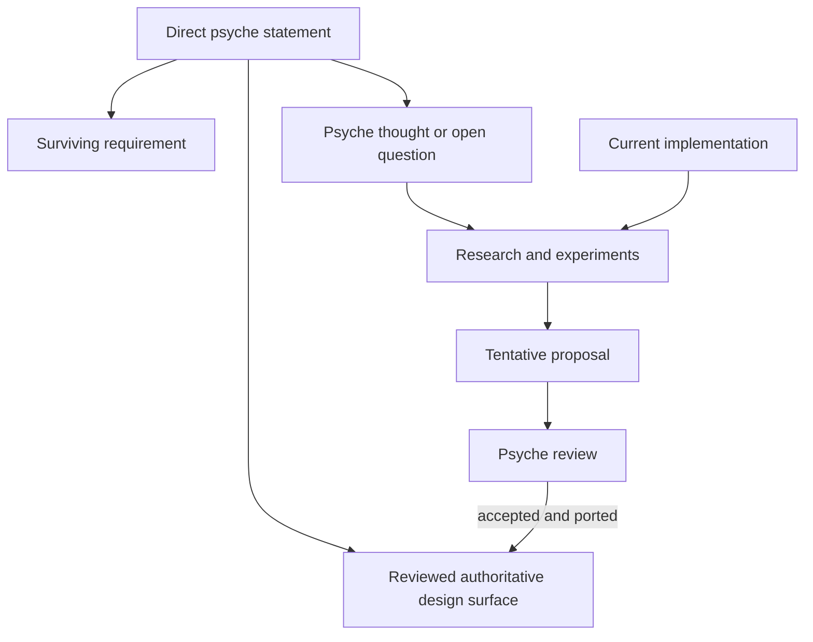

ASCII fallback:

```text
Direct psyche statement
  +-> reviewed authoritative design surface
  +-> surviving requirement
  +-> psyche thought or open question -> research -> tentative proposal
Current implementation ---------------------> research
Tentative proposal -> psyche review -> accepted and deliberately ported
```

**Visual 1 — authority flow.** Reports and implementations can feed review; they do not promote themselves into authority.

## 1. Executive result

The strongest live synthesis is a deliberately layered system:

```text
known language and root association
    -> source-bounded raw structural discovery
    -> unique position-local surface-form ownership
    -> name allocation and reference resolution
    -> capability elaboration and semantic judgments
    -> sealed Nomos value in a total Lift(Logos schema)
    -> typed evaluation with explicit configuration and effects
    -> hole-free, population-checked Logos
    -> optional nominal Rust reification
    -> Rust TextualForm and rustc today
    -> possible LLVM lowering in the long term
```

This stack preserves the attractive center of the vision:

- **[PV]** Ethos is the eventual everyday authored language.
- **[PV]** An Ethos source is a pre-known typed root structure.
- **[PV]** Meaning comes from typed position plus local structural form, not punctuation in isolation.
- **[PV]** Dotos, currently still named NOTA in much code, is foundational typed positional data.
- **[PV]** Nomos transforms encoded form to encoded form and must have the same textual/encoded form as Ethos and Logos so it can round-trip. **[U]** The exact meaning of “same” is unresolved; treating it as one common mechanism is **[I]**, not part of the ruling.
- **[PV]** A Nomos-side value has the shape of the corresponding Logos-side value but is not the same thing because the Nomos value can contain typed escape holes.
- **[SR]** Universal static disjointness and conservative refusal survive. **[I/P]** This research proposes scoping its formal proof to surface-form ownership within one typed position; that interpretation remains pending review.
- **[SR]** Recursive transformation, targeted positional insertion, whole-population analysis, plural Logos output, the `All` whole-tree wildcard, and eventual LLVM direction survive. Their exact syntax and mechanisms remain open.
- **[PV]** The preceding slices identified by the psyche as misguided deserve no presumption of correctness merely because they are implemented.

The central research correction is that three forms of correctness must remain distinct:

```text
surface uniqueness
    is not reference validity
    is not capability coherence
    is not semantic well-formedness
    is not evaluation termination
    is not output identity stability
```

Trying to make one grammar table or one Rust phase type prove all of those would recreate the rigidity the structural approach is meant to escape.

The strongest tentative architecture is therefore:

```text
canonical schema-indexed encoded arena
+ mechanically total recursive phase lift
+ typed position-indexed computation holes
+ separate name and semantic judgment layer
+ explicit effect, configuration, cardinality, and termination indices
+ private CheckedLogos boundary
+ optional generated or phase-generic Rust views
```

It remains a hypothesis. The 25-test suite in section 16 is designed to break it.

## 2. New Claude-session authority ledger

The requested new session is:

[Claude session `0f9d1436-0f9a-4cb0-9c08-60027d8cbc6e`](/home/li/.claude/projects/-home-li-primary/0f9d1436-0f9a-4cb0-9c08-60027d8cbc6e.jsonl).

The following ledger separates direct psyche material from assistant interpretation. Line links point to the exact local JSONL records.

| Transcript record | Grade | What it establishes | What it does not establish |
|:--|:--|:--|:--|
| [line 178](/home/li/.claude/projects/-home-li-primary/0f9d1436-0f9a-4cb0-9c08-60027d8cbc6e.jsonl:178) | **[PV]** | Nomos must have the same textual/encoded form as Ethos and Logos so it can round-trip; this is identified as the hardest part. | It does not settle whether “same” means a common mechanism, structural isomorphism, literal representation equality, or another relationship. |
| [line 212](/home/li/.claude/projects/-home-li-primary/0f9d1436-0f9a-4cb0-9c08-60027d8cbc6e.jsonl:212) | **[PV]** | The Nomos-to-Logos boundary contains two types: a Nomos type with the same shape as a corresponding Logos type, yet not the same thing; transformation must generate the latter from the former. | It does not choose a Rust representation or say whether generated types, a generic arena, or phase parameters are canonical. |
| [line 232](/home/li/.claude/projects/-home-li-primary/0f9d1436-0f9a-4cb0-9c08-60027d8cbc6e.jsonl:232) | **[PV]** | The direct answer to what makes the Nomos-side type different is: **escape holes**. | It does not settle which positions admit holes, which hole terms exist, or where hole freedom is proven. |
| [line 273](/home/li/.claude/projects/-home-li-primary/0f9d1436-0f9a-4cb0-9c08-60027d8cbc6e.jsonl:273) | **[PV response]** | When asked to choose compile-time, validation-time, or hybrid enforcement for phase safety, the psyche answered `explain`. No option was selected. | The location and mechanism of the “no holes remain” guarantee are unanswered. |
| [line 277](/home/li/.claude/projects/-home-li-primary/0f9d1436-0f9a-4cb0-9c08-60027d8cbc6e.jsonl:277) | **[PV/PT]** | The psyche directly challenges a `visibility` position classified as fixed and asks whether complete Nomos flexibility requires evaluation there. This doubt is authoritative evidence against inheriting `Fixed` uncritically. | It is a question that opens the design space, not a ruling that every position must be escapable. |
| [line 285, direct vision and values](/home/li/.claude/projects/-home-li-primary/0f9d1436-0f9a-4cb0-9c08-60027d8cbc6e.jsonl:285) | **[PV]** | The preceding slices called misguided must be doubted; Ethos is a perfectly strictly typed language; type specificity is a strength to build upon; and interaction with concrete thought objects is how psyche vision becomes clearer and produces the right questions. | These values do not by themselves choose a program-root, configuration, evaluator, or adapter architecture. |
| [line 285, design possibilities](/home/li/.claude/projects/-home-li-primary/0f9d1436-0f9a-4cb0-9c08-60027d8cbc6e.jsonl:285) | **[PT]** | The psyche raises typed Dotos positions, multiple Ethos program kinds, program-wide configuration, derived defaults, conditions, a transformation-time runtime, whole-program Ethos, and Rust interop adapters as thought objects. | The speaker explicitly calls this material thought, not decision; none of these mechanisms is ruled. |
| [line 346](/home/li/.claude/projects/-home-li-primary/0f9d1436-0f9a-4cb0-9c08-60027d8cbc6e.jsonl:346) | **[PV]** | `Dotos` is accepted as the replacement name for NOTA, slated to land with the new Protos-engine train. | It does not authorize a standalone rename now. |

The source session’s commissioned [macro-time research report](/home/li/primary/reports/MacroTimeEvaluationPriorArt-2026-07-31.md:49) asserted that expansion-time evaluation was universal in advanced macro systems, and Claude [repeated that claim at line 376](/home/li/.claude/projects/-home-li-primary/0f9d1436-0f9a-4cb0-9c08-60027d8cbc6e.jsonl:376). A subsequent independent research pass corrected it: R7RS `syntax-rules` is an advanced hygienic transcription system without arbitrary expansion procedures. The corrected conclusion is narrower:

> **[E/I]** Many powerful macro, staging, and configuration systems perform computation before runtime, but general arbitrary evaluator execution is not universal and is not implied by structural transcription.

### Three unresolved readings of “same textual/encoded form”

The phrase can be read in at least three ways:

1. **Common-mechanism reading:** each language has one or more TextualForms and an EncodedForm mediated through common Protos machinery.
2. **Structural-isomorphism reading:** their textual/encoded relationships share a shape or derived correspondence without using literally equal representations.
3. **Literal-equality reading:** the languages share an actual grammar, archive layout, or representation type.

**[U]** Line 178 does not choose among these readings. **[I]** The diagram below explores the common-mechanism reading because it composes with the wider Protos evidence; it must not be read as a recovered ruling. The languages’ distinct roles are evidence against casually assuming literal equality, but do not settle what the psyche meant by “same.”

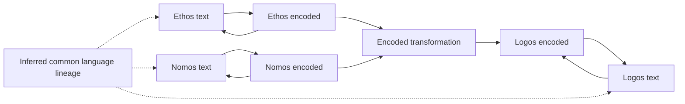

ASCII fallback:

```text
Language lineage, separately inferred:
  +-> Ethos text <-> Ethos encoded ----+
  +-> Nomos text <-> Nomos encoded ----+-> encoded transformation -> Logos encoded
  +-> Logos text <-> Logos encoded <----+

Transformation inputs are Ethos encoded AND Nomos encoded.
Nomos is an encoded language input, not an annotation on an Ethos arrow.
```

**[I] Visual 2 — one possible common-mechanism reading.** The horizontal arrows are language-specific round trips. The transformation arrow connects encoded values; the picture does not settle structural isomorphism versus literal representation equality.

## 3. First principles and their design consequences

### 3.1 Known root before local meaning

The reader knows the source language and root type before interpreting the document body. At each recursive step it also knows the expected position. The outer local structure selects one of the forms admitted there, and the selected form establishes the expected types of its children.

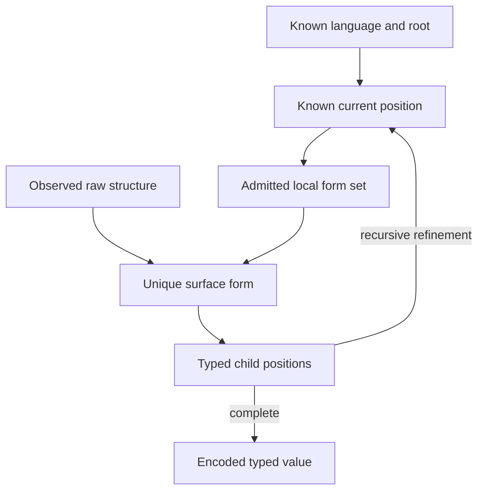

ASCII fallback:

```text
known language/root -> known position -> admitted local forms
observed raw structure ---------------------> unique form
unique form -> typed child positions -> repeat at each child
                                \-> complete encoded typed value
```

**Visual 3 — structural refinement.** The delimiter tree supplies facts. The position supplies semantic expectation. Neither is sufficient alone.

Consequences:

- A dotted square block cannot globally mean “enum declaration.”
- The same raw dotted spine may be a declaration application in one position and a qualified reference in another.
- Field names repeated in every value are redundant when the product position already identifies the field.
- The source must not be content-sniffed to guess its root.
- Raw discovery should preserve factual boundaries and grouping without choosing declaration, reference, path, or application semantics.

### 3.2 Dotos and Ethos are related, not identical

Dotos knows the complete recursive type of a value and fills it positionally. Ethos knows the root and current position, but a position may admit several realized structural forms. Choosing a form reveals further child positions.

```text
Dotos
  known type -> fixed child type -> fixed grandchild type -> values

Ethos
  known root -> position -> one allowed form -> typed children -> repeat
```

This remains strict typing. An unresolved Ethos block may have a real transitional type: the statically bounded set of forms it can still become.

### 3.3 Compactness is a consequence of shared knowledge

Consider an invented Dotos product:

```text
# Expected type is BuildConfiguration
{ Release Linux X86_64 }
```

The source need not repeat:

```text
{
  mode: Release,
  operating_system: Linux,
  architecture: X86_64
}
```

The omission is not weak typing. The three positions are already known. This compactness should be preserved when Dotos values appear inside typed Ethos positions.

### 3.4 Extensibility must be data-driven

The point of structural parsing is not merely a novel parser. It is to stop syntax from freezing behind one entangled grammar implementation. A new local form should ideally be declarative data interpreted by one evaluator. If every extension adds a Rust callback whose behavior only that callback understands, the monolithic parser has merely been distributed.

### 3.5 Encoded transformation and reuse

Nomos must operate on typed encoded identities and values rather than source spellings. The hoped-for correctness gain is multiplicative:

```text
one structural decoder law
  reused by many language roots

one phase-lift law
  reused by every Logos type

one reference resolver
  reused by constructors and transformers

one checked Logos boundary
  reused by every backend
```

Reuse matters because every independent reimplementation is another opportunity for two representations to drift.

### 3.6 Ethos root-role candidate matrix

The [current six-role root](/git/github.com/LiGoldragon/core-ethos/src/whole.rs:572) is evidence that a positional root can be built, but the psyche explicitly described it as old design that must not be followed blindly. The known-root principle is **[PV]**; the following field set is not.

| Historical role | Direct psyche support | Current implementation evidence | Candidate disposition | Still unknown |
|:--|:--|:--|:--|:--|
| `Imports` | **[PV]** Imports are not named as a required root field in the controlling correction. | **[E]** First role in the current root; only an empty delimiter is accepted. | **[P]** Possible root role or package-envelope concern; no corrected witness. | Whether it exists, its type, order, delimiter, and cardinality. |
| `Input` | **[PT]** Typed variables and program-wide configuration are raised as thoughts, not as this exact role. | **[E]** Second current role; accepts only empty content. | **[P]** Candidate typed `Dotos<Environment>` or external environment association, not necessarily a root slot. | Whether input is authored, external, plural, defaulted, or absent. |
| `Output` | **[SR]** Plural Logos output is required for transformations, but that does not establish an Ethos root `Output` field. | **[E]** Third current role; accepts only empty content. | **[P]** Could describe program products, entry points, or nothing at the root. | Whether it exists and whether it concerns Ethos, Nomos signatures, or deployment. |
| `Types` | **[PV]** The psyche repeatedly reasons from type-declaration positions and a whole-program Ethos horizon, but does not rule this field name or location. | **[E]** Fourth current role and the only role accepting declarations. | **[P]** Strong subject for a corrected micro-root, without preserving current syntax by default. | Exact declaration forms, multiplicity, ordering, and interaction with other declarations. |
| `Generics` | No direct ruling establishing a root field. | **[E]** Fifth current role; accepts only empty content. | **[P]** More likely a typed feature within declarations than a universal root section, but untested. | Whether generics exist in Logos/Ethos and where their declarations live. |
| `Impls` | **[PT]** Whole-program expressiveness implies behavior/relationships, not this exact section. | **[E]** Sixth current role; accepts only empty content. | **[P]** Could be a root collection, a declaration alternative, or derived Logos output. | Ownership, ordering, target types, and whether authoring is direct or transformed. |

Across all six rows, the exact root order, outer delimiters, per-role delimiters, optionality, repetition, and cardinality are **[U]**. Even if every concept survives, the old six-field product need not.

### 3.7 Position-local structural-form candidate matrix

The controlling correction directly enumerates outer shapes as examples of structural possibilities. It does not assign them global meanings. Every example below is explicitly invented to expose acceptance and rejection behavior.

| Raw outer form mentioned by psyche | **[P]** Possible local reading | **[P] INVENTED accepted example** | **[P] INVENTED negative example** |
|:--|:--|:--|:--|
| dotted prefix plus square block | A named declaration or application whose payload is a sequence at one expected position | `Color.[Red Green Blue]` at a position admitting a named variant sequence | The same text at `Visibility`; refuse rather than globally infer “enum.” |
| dotted prefix plus brace block | A named product or transformer-shaped body at one expected position | `Point.{Integer Integer}` at a position admitting a named product body | The same text at `ImportReference`; refuse if braces are not admitted there. |
| dotted prefix plus parenthesis block | A named unary/application form whose child has a position-specific type | `Public.(Config visibility)` at a position admitting a visibility-producing application | The same text at a scalar Dotos integer position; do not execute or guess. |
| plain square block | A sequence value, form choice, or delegated language payload depending on position | `[Red Green]` at a position expecting a sequence of variants | `[Red Green]` at a position expecting exactly one type reference; arity/shape refusal. |
| plain brace block | A positional product whose child types come from the expected product | `{ Release Linux X86_64 }` at `Dotos<BuildConfiguration>` | The same block at a position expecting `Visibility`; no content sniffing. |
| plain parenthesis block | A grouped application, scalar wrapper, or product admitted locally | `(Config target)` at a position whose table admits that application form | The same group at a position admitting only a bare encoded reference. |
| dotted symbol or dotted spine | A path, declaration plus head application, projection, or recursively refined remainder | `DomainScope.ScopeOf.Domain` at a candidate type-declaration application position | The same spine at a position expecting a Boolean atom; refuse without global dot semantics. |
| bare symbol | A scalar atom, constructor, declaration word, or reference according to the position’s name effect | `Public` at a position expecting `Visibility` | `Public` at a position expecting a declared type identity when no such reference resolves. |

Negative examples are load-bearing. Position-local syntax is not a license for permissive reinterpretation: when the current expected position admits no matching form, decoding refuses.

## 4. Requirements that survive, with mechanisms still open

The first report accidentally left several direct requirements inside its unknown list. Authority reconciliation corrects that here.

| Surviving requirement | Fixed by authority | Still open |
|:--|:--|:--|
| Static disjointness | **[SR]** Universal static disjointness and conservative refusal survive as psyche ruling. | **[I/P]** Scoping the formal law to alternatives within one typed position, and proving it through regular-tree-language intersection, are research interpretations pending review. The descriptor language and treatment of non-surface semantic distinctions remain open. |
| Recursive transformer invocation | Nomos must support recursive transformation. | Authored spelling, whether it appears as `Invoke`, `Fold`, derived traversal, or several typed forms; termination discipline. |
| Targeted positional insertion | A transformation must be able to insert into a specific sequence position. | Whether the authored term is `InsertAt`, an anchor-based sequence program, a general collection operation, or something else. |
| Whole-population analysis | A transformer may need the complete Ethos population rather than one declaration. | Query model, staging, dependency tracking, caching, and visibility boundaries. |
| Plural Logos outputs | A transformation may produce multiple Logos objects. | Typed cardinality, roles, stable identity, mutual references, and transactionality. |
| `All` behavior in ScopeOf | Root `All` is a whole-tree wildcard. | Other matching relations, operand symmetry, and the corrected generic ScopeOf model. |
| Long-term LLVM direction | The long-term direction includes compiling to assembly through LLVM. | Whether Logos lowers directly to LLVM, through another IR, or continues through Rust for some time; when this matters to near-term Logos design. |

Representative authority surfaces include the [static-disjointness record](/home/li/primary/reports/logos/textual-form-vision-design-v2.md:53), [recursion and insertion briefing](/home/li/primary/reports/NomosRecursionBriefing-2026-07-30.md:77), [whole-tree `All` ruling](/home/li/primary/design/Nomos/allMatchesAllScopeOf-2026-07-31.md:9), and [long-term LLVM statement](/git/github.com/LiGoldragon/protos-engine/design/ProtosEngine/PsycheVisionReacquisition-2026-07-29.md:196). These requirements must be re-seated under the corrected root model; they must not be discarded with the mistaken slices.

### 4.1 Current stack as evidence, not destination

The current implementation contains substantial reusable prior art:


ASCII fallback:

```text
source text
  -> raw discovery
  -> structural-codec typed positions
  -> EncodedForm plus NameTree
  -> current Template(X)
  -> native Nomos evaluator
  -> current WholeLogos
  -> Rust TextualForm
  -> rustc and behavior witness
```

**Visual 4 — the implemented stack.** Every box is evidence that a mechanism can work. No box is exempt from re-derivation under the corrected vision.

- [`raw-discovery`](/git/github.com/LiGoldragon/raw-discovery/ARCHITECTURE.md:3) performs source-bounded boundary discovery and deliberately knows no language-level declaration or type meaning.
- [`structural-codec`](/git/github.com/LiGoldragon/structural-codec/ARCHITECTURE.md:8) owns typed positions, ordered products/sequences, local rule coproducts, seal-time disjointness, and a shared expected-type evaluator.
- [current `core-ethos` root construction](/git/github.com/LiGoldragon/core-ethos/src/whole.rs:572) is a six-role ordered product, but only the types role currently accepts content. That is implementation fact, not recovered root vision.
- [current position-local Ethos rules](/git/github.com/LiGoldragon/core-ethos/src/whole.rs:718) show that local constructor tables are practical.
- [current Template(X) derivation](/git/github.com/LiGoldragon/core-nomos/src/template_language.rs:391) computes landing forms from several grammar roots. Its categories and coverage are doubt-flagged even if parts of the technique survive.
- [current Nomos architecture](/git/github.com/LiGoldragon/core-nomos/ARCHITECTURE.md:121) has `Realize`, `Invoke`, `Splice`, `InsertAt`, internal recursive judgments, whole-source preflight, full encoded-ID chains, and a native stringless evaluator. The same architecture marks its authored surface as delegated assent rather than psyche conviction.
- [current Logos architecture](/git/github.com/LiGoldragon/core-logos/ARCHITECTURE.md:8) distinguishes a narrow production `WholeLogos` from a broader legacy Rust-shaped graph containing off-model string-bearing machinery.
- [Protos architecture](/git/github.com/LiGoldragon/protos/ARCHITECTURE.md:51) already supplies a neutral encoded population, typed Capsules, and association-owner-based multiple textual representations.
- `/git/github.com/LiGoldragon/language-engine-witness` provides the current full emit, compile, and execute behavior boundary.

Useful existing witnesses include position-local dotted declaration/reference behavior in [`whole_six_slot.rs`](/git/github.com/LiGoldragon/core-ethos/tests/whole_six_slot.rs:386), locally alternating literal and computed landing forms in [`downstream_authoring.rs`](/git/github.com/LiGoldragon/structural-codec/tests/downstream_authoring.rs:1192), overlap refusal in the [same structural-codec test suite](/git/github.com/LiGoldragon/structural-codec/tests/downstream_authoring.rs:1888), Template(X) derivation over multiple roots in [`template_language.rs`](/git/github.com/LiGoldragon/core-nomos/tests/template_language.rs:117), and recursion/insertion examples in [`textual_nomos.rs`](/git/github.com/LiGoldragon/core-nomos/tests/textual_nomos.rs:96).

### 4.2 Reusable prior art versus accidental constraint

**[I/P] Untested hypothesis:** the “reusable” column below is a research disposition, not a validated separation. No corrected end-to-end micro-root yet combines a reviewed root/form table, the proposed phase boundary, semantic checking, and round-trip behavior. Existing tests exercise mechanisms under the preceding slice model and therefore cannot validate survival by themselves.

| **[I/P] Hypothesized reusable mechanism** | Why it might align | Accidental constraint to avoid inheriting |
|:--|:--|:--|
| Source-bounded untyped discovery | Separates factual bounds from meaning | Old global/right-recursive dot semantics |
| Typed position roles | Makes position semantically real | The present six roles and their order |
| Grammar data plus one evaluator | Supports local extension without parser forks | Opaque callbacks or per-form evaluator branches |
| Seal-time disjointness | **[I]** May preserve the ruled static refusal while separating surface ownership from later judgments | Asking it to prove all later semantic relationships |
| Complete encoded-ID chains | Supports rename stability and stringless references | Legacy flat identifiers elsewhere |
| Declaration/reference separation | Declarations allocate; references resolve | Allowing head dispatch to change roles retroactively |
| Derived Template(X) direction | Attempts to avoid handwritten twins | Treating current `Fixed` and landing categories as vision |
| Whole-source preflight | Foundation for population-level checks | Current graph laws as the final recursion/effect model |
| Immutable content plus NameTree projection | Supports reproducibility and rename | Assuming it settles generated identity ontology |
| Compile-and-run witness | Reuses rustc and tests behavior | Limiting Logos permanently to the current Rust vocabulary |

## 5. Domain C research: a structural schema algebra

### 5.1 Raw structure

**[P]** The raw reader should produce only source facts:

```text
RawShape =
    Atom
  | Delimited(delimiter, children)
  | DottedSpine(parts)
```

**[P]** `DottedSpine` preserves segment order without deciding associativity or meaning. Explicit delimiters preserve authored grouping.

```text
# INVENTED RAW METANOTATION, NOT CANONICAL SYNTAX
A.B.C

raw fact:
  DottedSpine [A, B, C]

possible typed readings:
  Path [A, B, C]
  Declare A then Apply B to C
  Apply A to Apply B to C
  Reference A then project B then project C
```

The old right-recursive NOTA block representation is useful historical evidence, not semantic authority for all Protos languages.

There are at least three live structural representations:

| **[P] Alternative** | How recursive remainder receives an expected type | Grouping and printing consequence |
|:--|:--|:--|
| Neutral flat spine | The current position receives the whole spine; its selected form assigns typed roles to all segments. | Canonical printer may join the flat path with dots only if one flat encoded value is intended. |
| Head plus recursively typed remainder | The current position consumes a head, then assigns an exact child position/type to the unconsumed remainder before recursion. | Printer follows the encoded recursive tree; ungrouped dots are legal only where the local table proves one reading. |
| Explicit grouped application tree | Authored delimiters select nested child blocks, each entered with the selected form’s expected child type. | Printer retains or canonically reconstructs grouping such as `A.(B.C)` versus `(A.B).C`. |

For the recursive alternative, “re-enter structural decoding” cannot mean parsing the tail without context. An invented typed trace makes the requirement visible:

```text
# INVENTED TYPED TRACE, NOT CANONICAL SYNTAX
source: DomainScope.ScopeOf.Domain

TypeDeclarationPosition
  consumes DomainScope as DeclareName
  assigns remainder ScopeOf.Domain : ApplicableTerm<Logos.TypeDeclaration>

ApplicableTerm<Logos.TypeDeclaration>
  consumes ScopeOf as Reference<HeadProducing<Logos.TypeDeclaration>>
  resolves the head capability
  assigns remainder Domain : InputTypeOf<resolved ScopeOf capability>

InputTypeOf<ScopeOf>
  consumes Domain as Reference<DomainTreeType>
```

Every recursive remainder therefore needs an expected type or a statically bounded transitional type. If the head does not establish one, decoding must refuse rather than guess.

Grouping/printing alternatives remain **[U]**:

- keep a flat semantic spine and print `A.B.C` canonically;
- encode nested application and require explicit grouping whenever associativity matters;
- allow ungrouped text only where the position table proves all possible folds equivalent;
- preserve original grouping in a nonsemantic source envelope while printing one canonical semantic form.

Position-specific rejection examples:

```text
# ALL EXAMPLES INVENTED; NONE IS CANONICAL

VisibilityPosition reading A.B.C
  -> refuse: no DottedSpine form admitted

ImportPathPosition reading A.(B.C)
  -> refuse if explicit application grouping is not an ImportPath form

TypeDeclarationPosition reading DomainScope.UnknownHead.Domain
  -> refuse after UnknownHead fails Reference<ApplicableHead>

TypeDeclarationPosition reading DomainScope.ScopeOf.UnknownDomain
  -> refuse after the typed remainder fails Reference<DomainTreeType>

Dotos<Integer> reading A.B.C
  -> refuse in the delegated scalar codec; do not fall back to Ethos path syntax
```

### 5.2 Minimal typed description algebra

**[P]** A small closed descriptor language could be:

```text
TypeDescription =
    Scalar(type_identity, atom_codec)
  | Product(type_identity, positions)
  | Sum(type_identity, forms)
  | Sequence(type_identity, element_position)
  | Reference(type_identity)
  | Delegate(language_identity, expected_type_identity)

PositionDescription =
    stable_role_identity
    expected_type
    cardinality
    name_effect
    admitted_forms

NameEffect =
    None
  | Declare(symbol_kind)
  | Reference(resolution_query)

FormDescription =
    stable_form_identity
    regular_surface_pattern
    realized_type
    typed_child_refinement
```

**[P]** A candidate restriction is that `regular_surface_pattern` and `typed_child_refinement` are values in a closed algebra interpreted by shared code, not arbitrary parser callbacks.

### 5.3 Tentative formalization of the ruled disjointness requirement

**[SR]** Universal static disjointness and conservative refusal survive. **[I/P]** The following formulation scopes the proof to competing surface forms within one already-known typed position; neither that scope nor the automata model is itself a recovered psyche ruling:

```text
For one sealed position P and every two distinct surface forms A and B:

    Language(P, A) intersect Language(P, B) = empty
```

**[E/I]** For regular tree patterns, intersection emptiness is decidable. **[P]** If Protos form descriptions stay in that class, the formulation gives this local guarantee:

```text
one raw subtree -> at most one surface-form owner
```

**[I]** That proposed proof would not establish that references resolve or that children satisfy semantic relations.

#### Counterexample: top-down form selection cannot encode every relation

Tree-automata theory supplies a decisive witness:

```text
T = { f(a, b), f(b, a) }
```

A deterministic top-down automaton cannot choose a root transition for `f` that coordinates both children without also admitting `f(a,a)` or `f(b,b)`.

Unsound schema modeling:

```text
Form Left  = f(PositionA, PositionB)
Form Right = f(PositionB, PositionA)
```

Sound layered modeling:

```text
one surface form = f(Symbol, Symbol)

later typed judgment accepts:
  (a, b)
  (b, a)

and rejects:
  (a, a)
  (b, b)
```

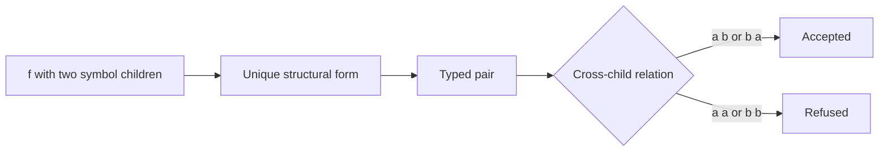

ASCII fallback:

```text
raw f(symbol, symbol) -> one structural form -> typed pair
                                                |
                                                +-> (a,b) or (b,a): accept
                                                \-> (a,a) or (b,b): refuse
```

**[I] Visual 5 — proposed separation of disjointness and semantics.** Static disjointness survives as a requirement; this picture’s within-position surface ownership and later semantic validation are research interpretation.

#### Counterexample: catch-all forms close extension points

```text
SpecificFutureForm = Head.[...]
CatchAllExtension  = any dotted block
```

These overlap necessarily. **[I/P]** Under the within-one-position formalization of the surviving universal disjointness ruling, a catch-all consumes that position’s future extension space. The currently compatible candidate choices are:

- forbid catch-alls;
- reserve disjoint identity or namespace partitions;
- use one generic surface form and dispatch semantically.

XSD-style specificity is useful research precedent and a counterfactual fallback only. Adopting it would weaken the controlling rule and therefore requires an explicit new psyche reversal; it is not a live option under current authority.

Ordered PEG choice is a poor default because package/import order silently changes meaning. A generalized parse forest with later disambiguation remains theoretically possible, but sacrifices much of the desired simplicity and invertible-printing story.

### 5.4 Position-local reuse of punctuation

**[P] Invented example:**

```text
# At TypeDeclaration position
DomainScope.ScopeOf.Domain

# At ImportReference position
DomainScope.ScopeOf.Domain
```

**[P]** Under the neutral-spine proposal, both begin as:

```text
DottedSpine [DomainScope, ScopeOf, Domain]
```

The declaration position may refine it as:

```text
DeclareName DomainScope
ApplyHead   ScopeOf
Argument    Domain
```

The import position may refine it as:

```text
QualifiedReference [DomainScope, ScopeOf, Domain]
```

**[I/P]** The byte shape can be reused while its typed meaning remains position-local. At any position whose form table does not admit the spine, decoding refuses; reuse does not imply universal acceptance.

## 6. Constructor versus transformer: one structural application

An earlier question asked how a type-declaration position distinguishes ordinary type construction from Nomos transformation. The research suggests that syntax should not try to make the distinction if the raw forms are identical.

**[P] One structural form:**

```text
ApplicationSurface =
  DottedSpine [
    DeclareName
    Reference<ApplicableHead>
    Argument
  ]
```

After the head reference resolves, a pinned capability catalog selects the semantic operation:

```text
AppliedDeclaration =
    DirectConstruction {
      declared_identity
      head_identity
      argument
      selected_capability_identity
    }
  | TransformationRequest {
      declared_identity
      head_identity
      argument
      selected_capability_identity
    }
```

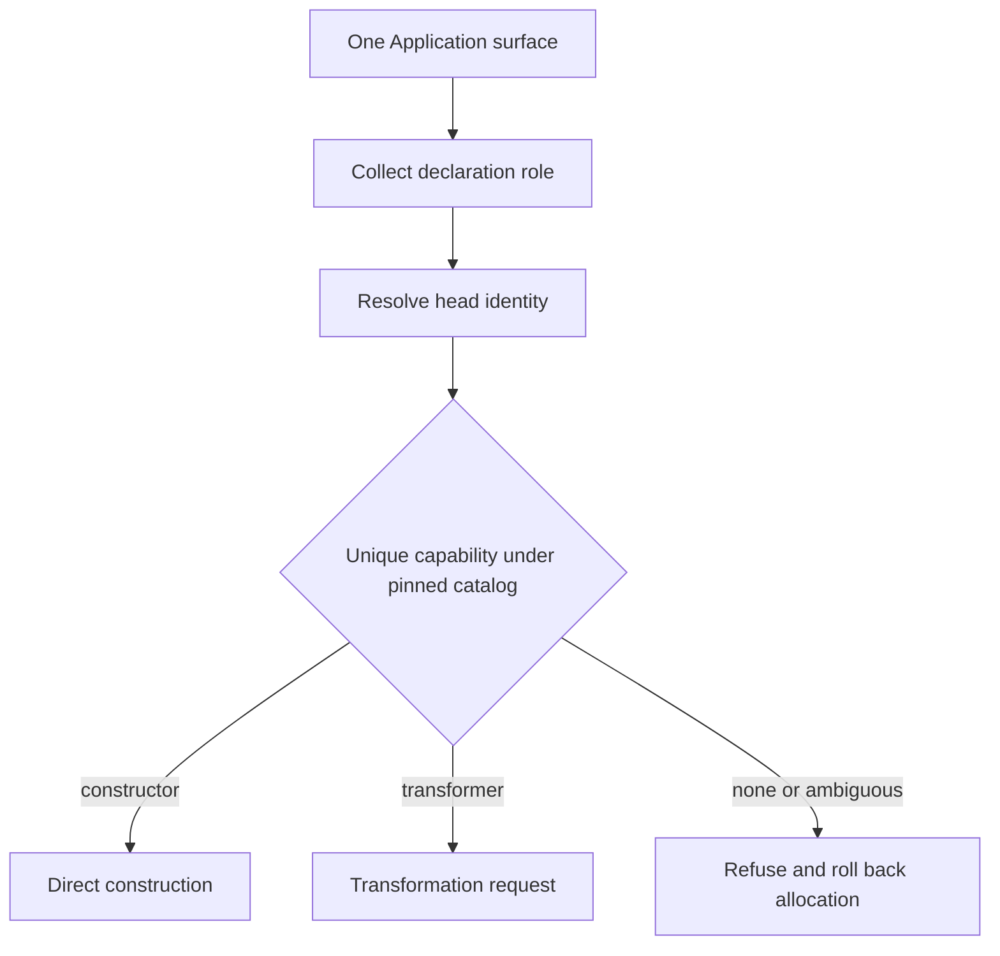

ASCII fallback:

```text
one Application surface
  -> collect fixed declaration/reference roles
  -> resolve head identity
  -> select one capability from pinned catalog
       +-> constructor capability -> direct construction
       +-> transformer capability -> transformation request
       \-> none or ambiguous      -> refuse and roll back allocation
```

**Visual 6 — structural ownership before capability meaning.** Capability lookup elaborates an already uniquely decoded form. It does not compete as another parser.

**[P] If the one-surface capability proposal is chosen, its candidate laws are:**

- The surface form fixes declaration and reference roles before capability lookup.
- References never allocate.
- Failure rolls back tentative declaration allocation.
- Built-in and authored heads use the same identity mechanism.
- Capability composition is pinned by Capsule/package context.
- Two applicable capabilities for the same head, input, result, and position refuse unless a reviewed coherence rule establishes one winner.
- The encoded result records which capability was selected.

**[I/P]** This is analogous to Rust coherence at the semantic-dispatch layer. Under the proposal it would not add a second surface form, so it could preserve the ruled disjointness obligation.

### 6.1 Cross-package `Invoke` remains unresolved

[Decision 7 in the Nomos train addendum](/home/li/primary/reports/NomosTrainAddendum-2026-07-30.md:176) records a **not-understood-by-psyche lean**, not a ruling: v1 packages would be self-contained and an `Invoke` targeting a transformer in another package would refuse at seal time. The design of cross-package invocation was deferred.

The generic application/capability model must not silently turn that temporary self-contained-package lean into ontology. Open questions include:

- whether a transformer reference can resolve through imported Capsule/package identity;
- whether resolution occurs at package seal, link, or deployment composition;
- how package version and capability implementation identity enter caching;
- which visibility and ownership laws prevent an import from changing a previously coherent invocation;
- whether cross-package invocation cycles are forbidden by the package graph or handled by a declared termination profile.

Until reviewed, self-contained refusal is implementation evidence and a train-scoping choice. Cross-package `Invoke` support is **[U]**.

## 7. Domain A research: proposed total phase lifting

### 7.1 A tentative formalization of the problem

**[P]** One candidate formalization maps each Logos type `T` to a recursively lifted Nomos counterpart capable of carrying computations that resolve to `T` values. **[I/P]** Making the two carriers nominally or phase-distinct would prevent a partially evaluated value from accidentally crossing a Logos API. The psyche ruled same shape, distinct types, and escape holes; he did not rule universal `T` mapping, recursive `Lift`, nominal phase encoding, or API-level enforcement. [Line 273](/home/li/.claude/projects/-home-li-primary/0f9d1436-0f9a-4cb0-9c08-60027d8cbc6e.jsonl:273) left compile-time versus validation-time versus hybrid enforcement unanswered.

**[I]** A handwritten pair is one possible representation, but appears fragile:

```rust
struct LogosEnumeration {
    visibility: Visibility,
    name: Identifier,
    variants: Vec<Variant>,
}

struct NomosEnumeration {
    visibility: Escapable<Visibility>,
    name: Escapable<Identifier>,
    variants: SequenceProgram<Variant>,
}
```

Every Logos change would have to be repeated correctly. With dozens of mirrored types, the risk of drift is high. This makes handwritten twins disfavored agent-side, not forbidden by psyche ruling.

### 7.2 Recursive lift equation

**[P]** Let `R(S)` be the realized Logos value type of schema `S` and `p` the expected position:

```text
Lift_p(S) =
    Literal(LiteralLift_p(S))
  | Compute(Expression<p, R(S), allowed_effects(p)>)
```

Then recursively:

```text
LiteralLift_p(Scalar K) =
    R(Scalar K)

LiteralLift_p(Reference K) =
    position-specific declaration or reference literal

LiteralLift_p(Product [p_i:S_i]) =
    Product [Lift_p_i(S_i)]

LiteralLift_p(Sum [C_j:S_j]) =
    one constructor C_j with lifted payload

LiteralLift_p(Sequence S) =
    SequenceProgram [
        Element Lift_element(S)
      | Splice Expression<sequence-position, Vec<R(S)>>
      | Insert typed-anchor Expression<sequence-position, Vec<R(S)>>
    ]
```

**[P]** In this recursive-lift proposal, two independent doors are needed to cover both whole-node and local computation:

- The outer `Literal | Compute` door lets a computation choose an entire subtree, sum constructor, or collection.
- Recursive lifting inside `Literal` lets a mostly literal subtree contain local holes, computed elements, or splices.

**[I]** Within this model, wrapping only leaves cannot compute constructor choice or a whole sequence, while wrapping only whole nodes cannot splice a sequence or compute one nested child.

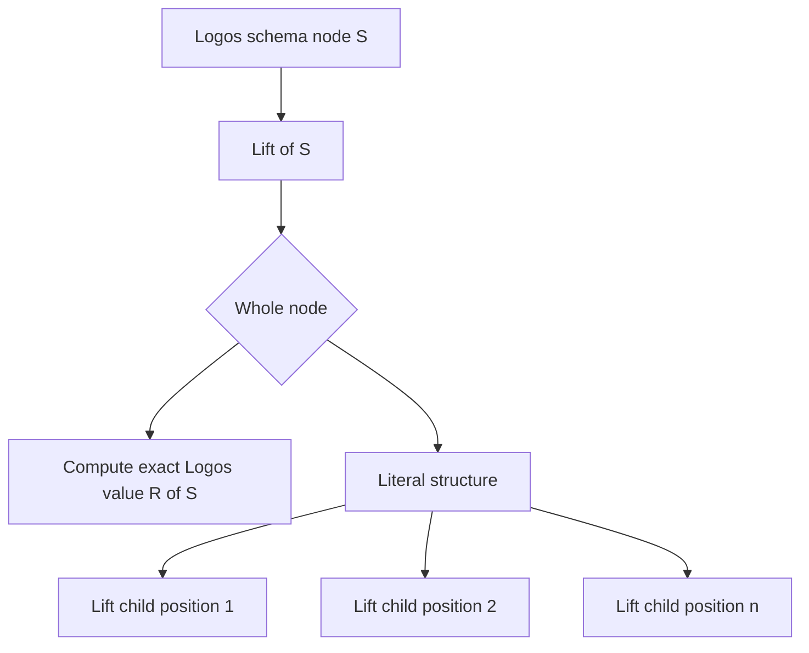

ASCII fallback:

```text
Logos schema node S -> proposed Lift(S)
                         +-> compute the whole realized value R(S)
                         \-> literal structure
                               +-> Lift(child position 1)
                               +-> Lift(child position 2)
                               \-> Lift(child position n)
```

**Visual 7 — total recursive lift.** Whole-node computation and recursively local computation coexist.

Whether every position is enabled for computation is **[U]**. The architecture can make every position mechanically capable. A reviewed schema could still forbid computation at a position for a principled reason. The old `Fixed` classification has no authority merely because it exists.

### 7.3 Rust experiment

**[E]** An isolated stable-Rust experiment used a phase family:

```rust
trait Phase {
    type At<Position, Literal, Output>;
}

enum Logos {}
enum Nomos {}

impl Phase for Logos {
    type At<Position, Literal, Output> = Output;
}

impl Phase for Nomos {
    type At<Position, Literal, Output> =
        Slot<Position, Literal, Output>;
}
```

Representative phase-generic structure:

```rust
struct Declaration<P: Phase> {
    header: P::At<
        HeaderPosition,
        Header<P>,
        Header<Logos>,
    >,
    body: P::At<
        BodyPosition,
        Body<P>,
        Body<Logos>,
    >,
}
```

The witness compiled and ran on stable `rustc 1.96.0`. It exercised root/product/sum computation, visibility, names, nested values, whole sequences, computed elements, splice, indexed insertion, and lowering to `Declaration<Logos>`. Its positive output was:

```text
phase-family: all position classes lowered without surviving holes
```

A negative compile witness tried to pass `Declaration<Nomos>` where `Declaration<Logos>` was required and received:

```text
error[E0308]: expected `Declaration<Logos>`,
              found `Declaration<Nomos>`
```

Direct higher-kinded constructor application failed:

```rust
struct Apply<Constructor, Value> {
    value: Constructor<Value>,
}
```

```text
error[E0109]: type arguments are not allowed on type parameter `Constructor`
```

This establishes a useful boundary: stable Rust can encode phase families using generic associated types, but it cannot automatically map an arbitrary algebraic data type into its recursive lifted counterpart. The structure must come from schema data, a deliberately phase-generic definition, or generation.

Durable experiment bundle and commands: [phase-lift README](/home/li/primary/reports/protosVisionReacquisition/experiments/phase-lift/README.md).

- [phase-family success witness](/home/li/primary/reports/protosVisionReacquisition/experiments/phase-lift/phase_family.rs)
- [Nomos-to-Logos negative compile witness](/home/li/primary/reports/protosVisionReacquisition/experiments/phase-lift/no_hole_failure.rs)
- [higher-kinded-constructor negative compile witness](/home/li/primary/reports/protosVisionReacquisition/experiments/phase-lift/hkt_failure.rs)
- [schema/seal/evaluation/check separation witness](/home/li/primary/reports/protosVisionReacquisition/experiments/phase-lift/schema_hybrid.rs)

### 7.4 rkyv experiment

**[E]** With `rkyv 0.8.17`:

- the generic-associated-type phase projection archived and passed bytecheck;
- the researcher observed a recursive heterogeneous `Expr<T>` derive-bound overflow during exploration, but the original failing artifact was not retained and that failure is therefore historical observation rather than a repeatable witness;
- documented `#[rkyv(omit_bounds)]` plus explicit serializer, deserializer, and bytecheck bounds compiled and archived successfully.

Durable sources:

- [rkyv phase-family archive witness](/home/li/primary/reports/protosVisionReacquisition/experiments/phase-lift/rkyv-phase/src/main.rs)
- [rkyv recursive typed-expression witness](/home/li/primary/reports/protosVisionReacquisition/experiments/phase-lift/rkyv-phase/src/bin/typed_expr.rs)
- [exactly pinned manifest](/home/li/primary/reports/protosVisionReacquisition/experiments/phase-lift/rkyv-phase/Cargo.toml)

The retained corrected witness makes the successful bound formulation repeatable. It does not independently reproduce the discarded intermediate failure. This keeps archive feasibility live but does not prove semantic reference validity, termination, configuration completeness, or absence of residual holes. Bytecheck proves that bytes satisfy the archive representation, not that the archived program is valid Logos.

### 7.5 Candidate implementations

| Candidate | Strength | Main failure mode | Status |
|:--|:--|:--|:--|
| Handwritten Nomos twin per Logos type | Straightforward Rust types | Duplicated structure and high drift risk | **[I] Disfavored, not eliminated** |
| Phase-generic Rust definitions only | Strong compile-time phase distinction and ergonomic matching | Runtime language extension requires Rust edits; arbitrary recursive lift is not automatic | Live as a view/API |
| Generated concrete mirrors from schema | Strong nominal types; schema remains source of structure | Generation churn, compiler cycle, and diagnostics complexity | Live as projection |
| Generic schema-indexed arena only | Most extensible and closest to code-as-data | Most correctness moves to seal/evaluation/check boundaries; weaker ergonomic Rust API | Live as canonical encoding |
| Existing `TemplateValue` substrate | Demonstrates a generic runtime representation | Explicitly doubt-flagged; old categories may freeze wrong assumptions | Evidence only |
| Hybrid arena plus checked lowering plus optional Rust views | Separates extensible representation from strong checked APIs | More stages and witnesses to specify | Strongest **[P]** |

The hybrid does not “save” current `TemplateValue` by naming it canonical. It re-derives the needed properties from first principles, then asks whether any old mechanism happens to satisfy them.

## 8. The no-holes boundary and semantic checking

**[E/I]** `decode succeeded` or `rkyv bytecheck passed` cannot alone establish semantic Logos validity: a shape-correct reference may still point to no declaration, a well-typed computation may still cycle, and a hole-free tree may still violate population invariants. How Protos composes the additional proofs remains open.

**[P] Staged carriers:**

```text
RawNomos<S>
    -> structural seal
SealedNomos<S>
    -> evaluate typed expressions and configuration
UncheckedResolved<S>
    -> names, references, relations, capabilities, output graph
CheckedLogos<S>
    -> private total reification
Nominal Logos Rust view
```


ASCII fallback:

```text
Raw Nomos
  -[surface and shape check]-> Sealed Nomos
  -[evaluate holes]----------> Unchecked resolved value
  -[semantic judgments]------> Checked Logos
  -[candidate private reify]-> Nominal Rust view
```

**Visual 8 — each boundary proves only its own obligations.** There is no single magical “typechecked” step.

**[P] Candidate allocation of proof obligations:**

| Boundary | Can guarantee in this candidate | Cannot guarantee alone |
|:--|:--|:--|
| Rust compile time | Nomos and Logos phase types cannot be accidentally interchanged | Dynamic references resolve; config terminates |
| Structural seal | One local form owns the bytes; product/sum/sequence shape; expected result type | Later-produced identity exists; cross-field relation holds |
| Evaluation | Holes execute; sequences normalize; explicit config is resolved | Reference and whole-population validity without semantic checking |
| Checked lowering | No dangling/wrong-kind references, residual holes, or invalid output graph under declared laws | Behavior outside the Logos model |
| Backend compile/run | The current Rust projection compiles and exhibits tested behavior | Intent never represented in Logos |

**[P] One candidate API shape is:**

```rust
fn reify<T>(
    checked: CheckedLogos<T>,
    witness: TypeWitness<T>,
) -> T;
```

**[P]** Under that API proposal, no public `T::from_raw(Value)` would bypass the checked wrapper. Another reviewed design may enforce the same no-hole obligation differently.

## 9. Domain B research: typed evaluation and configuration

### 9.1 Proposal: distinguish computation sorts

**[I]** The earlier candidate `Expression<T>` appears too coarse because several kinds of term differ materially:

- a value expression computes one value;
- a constraint refines or relates values and is not merely Boolean syntax;
- a transformation consumes and emits typed program objects;
- an effectful foreign operation has reproducibility consequences;
- a plural declaration output has identity and cardinality obligations;
- a term at one phase cannot necessarily observe bindings from another.

**[P]** Either keep several related algebras:

```text
ValueExpr<A, Effects>
Constraint<A>
Transform<Input, Output, Effects, Termination>
```

or index one term more fully:

```text
Term<
  Phase,
  Sort,
  ValueType,
  Effects,
  Cardinality
>
```

**[P]** Either representation could still share constructors such as typed references, matching, conditionals, and application without assuming that every computation has the same semantics.

### 9.2 Proposal: configuration as an explicit input

**[PT]** Program-wide configuration and transformation-time evaluation were raised as thought objects. **[P]** If pursued, represent configuration as an explicit typed input rather than an invisible evaluator global:

```text
Transformer<Input, Environment, Output>

EnvironmentRequirement {
  target.TargetTriple
  optimize.Boolean
  diagnostics.DiagnosticsPolicy
}
```

Conceptually:

```text
(EthosPopulation, TypedEnvironment)
    -> Nomos evaluation
    -> Checked LogosPopulation
```

**[P]** In this candidate, an environment reference carries a complete encoded identity and expected type rather than performing a string lookup.

Invented base syntax:

```text
Configuration.[
    target.(Required Target)
    optimize.(Default Boolean false)
    label.(Optional Text)
]

# At a position expecting Target
Config.target
```

Invented rich syntax, if a sigil view is desirable:

```text
$config.target
```

**[P]** Both would encode the same typed reference if both were accepted TextualForms.

### 9.3 Absence, defaulting, and conflict are distinct values

**[P]**

```text
SettingSpec<A> =
    Required
  | Optional
  | Default(ValueExpr<A>)
  | Constrained(SettingSpec<A>, Constraint<A>)

InputBinding<A> =
    Unset
  | Supplied(A)
```

Resolution:

```text
Required   + Unset       -> missing-input refusal
Optional   + Unset       -> None<A>
Default(e) + Unset       -> evaluate e
any        + Supplied(v) -> validate and use v
```

**[P]** Initial precedence to test:

```text
explicit value > default
same-tier conflicts refuse
no source-order last-writer-wins
```

**[P]** Typed origin tiers could be added only if a real layering use case requires them.

### 9.4 Competing configuration models

| Model | Strength | Cost | Tentative disposition |
|:--|:--|:--|:--|
| Strict typed DAG | Early cycle errors, simple traces, parallelism, caching | Cannot express meaningful cyclic inference | **[P]** Strong baseline if an evaluator is needed |
| Nix lazy fixed point | Cross-option defaults and overrides; powerful open recursion | Demand-sensitive cycles and difficult diagnostics | **[P]** Add only for a demonstrated use case |
| CUE constraint lattice | Order-independent unification; some meaningful cycles | Requires a genuine solver and incomplete-value semantics | **[P]** Separate possible future region |
| Dhall total normalization | Strong typing, canonical forms, termination | No general recursive derivation | **[E/I]** Useful safety ceiling |
| Starlark-style bounded imperative | Deterministic/hermetic by default; no recursion or unbounded loops | Dynamic typing; host embedding can weaken guarantees | **[E/I]** Prior art for resource policy |

**[P]** If Protos demonstrates sufficient need for a distinct transformation-time evaluator, first semantics to test are:

1. Package/import graph is acyclic.
2. Ordinary configuration/default graph is acyclic.
3. Structural recursion uses a schema-derived fold/traversal.
4. General transformer cycles refuse or require an explicit deterministic budget.
5. Constraint fixed points appear only in explicitly typed constraint regions after a real witness demands them.

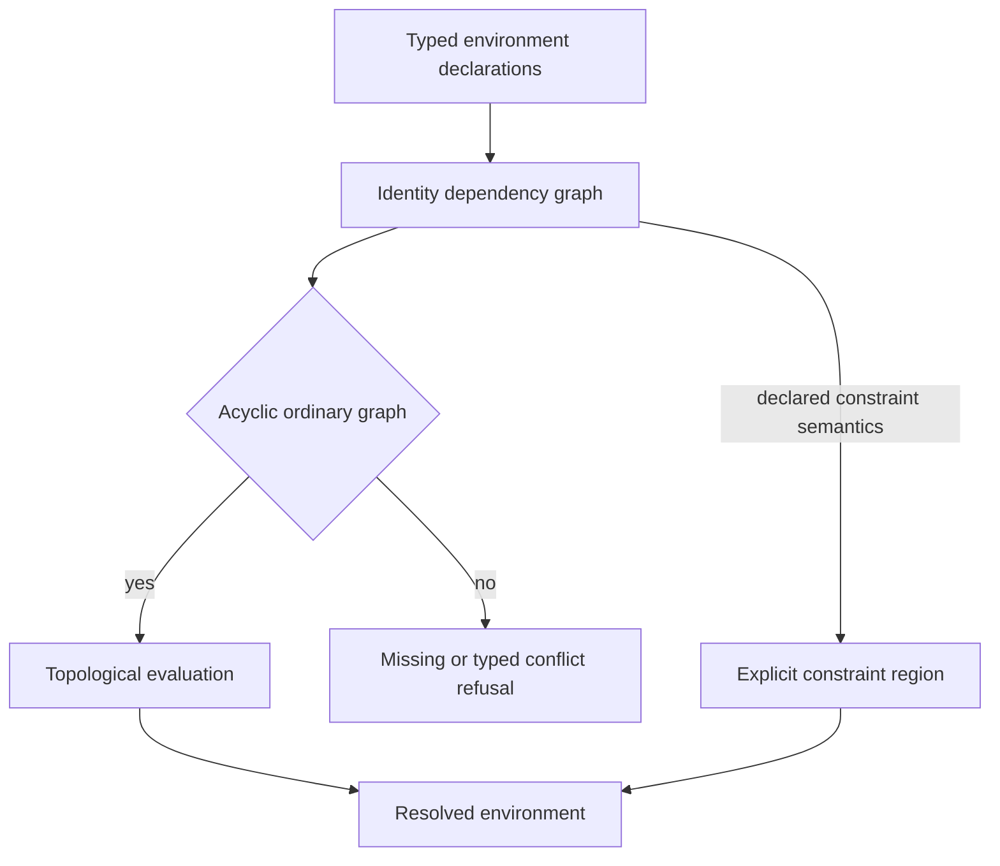

ASCII fallback:

```text
typed environment declarations -> identity dependency graph
                                      +-> acyclic -> topological evaluation -> resolved environment
                                      +-> cycle   -> typed refusal
                                      \-> explicitly declared constraint region
                                                      -> fixed-point solver -> resolved environment
```

**Visual 9 — simple systems first.** Ordinary defaults remain a typed DAG; fixed-point inference is a separate, explicit capability.

### 9.5 Research correction: macro evaluation is not universal

The first macro-time report said every advanced macro system performs expansion-time evaluation. That overstates the evidence.

- R7RS `syntax-rules` provides hygienic pattern/template transcription without arbitrary Scheme procedures at expansion time.
- R6RS distinguishes `syntax-rules` from procedural `syntax-case`.
- MetaML stages typed code but is not intrinsically a compiler macro evaluator.
- [Scala 3 staging](https://docs.scala-lang.org/scala3/reference/metaprogramming/staging.html) distinguishes compile-time macro execution from runtime staging.
- GHC quotation can exist without enabling top-level splices.

The design must therefore distinguish:

```text
structural transcription
typed evaluator execution
stage transition
```

Nomos may need all three. None entails the others.

## 10. Recursion, staging, whole-population access, and effects

### 10.1 Ordinary invocation and structural recursion are different

Recursive transformation is a surviving requirement. That does not decide that every call is recursive or that an authored self-`Invoke` is the correct syntax.

**[P] Invented structural base notation:**

```text
# INVENTED, NOT CANONICAL
Invoke.(TransformerReference input)
```

This means transformer composition. It proves nothing about termination.

**[P] Invented structural-recursion notation:**

```text
# INVENTED, NOT CANONICAL
Fold.(subject algebra seed)
```

This could mean that recursive calls are generated only for structurally smaller children of a finite encoded value. A schema-derived traversal could offer the same semantics without an authored `Fold` word. The exact surface remains **[U]**.

A plain catamorphic fold is not universally sufficient. Some transformations need:

- an original child plus its transformed result;
- inherited ancestor information;
- sibling context;
- a global index;
- zero, one, or many outputs per input;
- references among generated outputs.

Those cases point toward paramorphisms, attribute-style traversals, explicit population queries, or several typed traversal capabilities. They do not justify one unrestricted recursive evaluator by default.

### 10.2 Termination is part of the transformer type

**[P]** Every transformation can declare a termination profile:

```text
Termination =
    StructuralTotal
  | AcyclicTotal
  | BudgetedPartial
  | ForeignBudgeted
```

Interpretation:

- `StructuralTotal`: recursion is generated from the input schema and receives only smaller children.
- `AcyclicTotal`: dependencies are explicitly graph-checked before evaluation.
- `BudgetedPartial`: general computation may fail after a deterministic semantic budget.
- `ForeignBudgeted`: a capability crosses the pure evaluator boundary and is constrained by an explicit observation and resource contract.

Budgets should count semantic events rather than wall-clock time:

```text
reductions
transformer invocations
emitted nodes or bytes
maximum traversal depth
query cardinality
package count
```

Wall time varies with hardware and scheduling, so it is a poor reproducibility boundary.

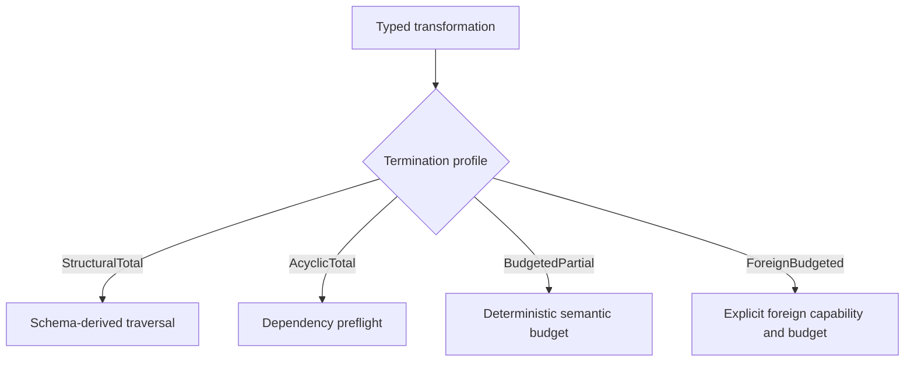

ASCII fallback:

```text
typed transformation -> declared termination profile
  StructuralTotal -> schema-derived traversal
  AcyclicTotal    -> dependency preflight
  BudgetedPartial -> deterministic semantic budget
  ForeignBudgeted -> explicit foreign capability plus budget
```

**Visual 10 — termination is declared, not guessed.** The authored recursion spelling can remain open while its safety classes become explicit.

### 10.3 Proposal: explicit whole-population access

**[SR]** Whole-population analysis is required. **[I/P]** Ambient untracked access would obstruct dependency reasoning, so one candidate has transformers declare typed read capabilities:

```text
Transform<
    Population<EthosRoot>,
    Population<LogosRoot>,
    Effects = { ReadPopulation<QueryType> },
    Termination = StructuralTotal
>
```

**[I/P]** In a cached implementation, a negative query is still a dependency. If a transformer asks “are there any declarations with capability `C`?” and the answer is empty, one candidate cache depends on the membership digest of the queried index; otherwise adding the first match could leave a stale empty result.

**[P] Evaluation cache key:**

```text
hash(
  evaluator_semantics_identity,
  transformer_or_expression_identity,
  input_content_identities,
  configuration_dependency_digest,
  population_query_membership_digests,
  package_and_link_identities,
  capability_implementation_identities,
  resource_policy_identity
)
```

**[P]** Under this cache proposal, unordered dependency sets are canonically sorted by encoded identity and opaque effects are not cached.

### 10.4 Proposal: foreign and backend capabilities

**[PT]** The psyche raised Rust interop adapters as a thought object. **[P]** One possible design lets whole-program Ethos avoid reproducing every Rust surface feature through an explicit typed adapter boundary:

```text
Foreign<Capability, Input, Output>
```

**[P]** Examples include a library adapter that accepts an encoded callable object where a Rust library expects a closure, or an adapter that translates a named product into a library’s tuple-shaped ABI. Under this proposal the foreign capability receives and returns typed encoded values; it does not inject source strings.

**[P]** A deterministic mode could refuse clock, randomness, network, ambient environment variables, and ambient filesystem reads unless supplied as explicit snapshot values. Its cache identity would include the capability implementation and every observation. This policy is agent proposal, not recovered vision or requirement.

### 10.5 Hygiene, phases, and persistent identity

Macro-system prior art agrees that identity is richer than spelling:

- Racket syntax objects carry scope information that varies by phase.
- R6RS hygienic expansion gives introduced bindings fresh effective identities.
- Template Haskell distinguishes capture-resistant `newName` from deliberately capturable `mkName`.

Protos already has stronger identity aspirations than token macro systems, so a candidate ontology should distinguish at least:

```text
SemanticTypeIdentity
NomosObjectIdentity
LogosObjectIdentity
PhaseOrCapsuleIdentity
CapabilityIdentity
OutputAddress
ContentIdentity
NameTreeSpellingProjection
```

A Nomos computation can reference the semantic Logos type it promises to produce without making the Nomos object and eventual Logos object identical. Likewise, two helpers may have equal content without being the same semantic declaration.

Rust [`TypeId`](https://doc.rust-lang.org/std/any/struct.TypeId.html) is unsuitable for persistent identity: the official API documents that its hash and ordering vary between Rust releases, so it is not a stable cross-release archive contract.

**[P] Invented Capsule envelope metanotation:**

```text
# INVENTED ENVELOPE DESCRIPTION, NOT CANONICAL SYNTAX
Capsule {
  language_identity = Nomos
  schema_identity = Lift(LogosSchemaVersion)
  schema_fingerprint
  root_object_identity
  archive_bytes
}
```

Whether phase identity belongs only in the Capsule association, in every object identity, or in both remains **[U]**.

## 11. Multiple TextualForms over one EncodedForm

**[P]** If multiple TextualForms share one semantic encoded value, one candidate model gives each form its own codec:

```text
decode_F : Text_F x PinnedNameTree -> Encoded<T>
encode_F : Encoded<T> x PinnedNameTree -> CanonicalText_F
```

**[P] Candidate laws under that model:**

```text
value round trip:
  decode_F(encode_F(v)) = v

canonicalization:
  encode_F(decode_F(text)) = canonicalize_F(text)

cross-form convergence:
  decode_F(text_F) = decode_G(text_G)
  when both texts represent the same encoded value

name projection:
  changing spelling projection may change text,
  but not encoded identity or semantic content
```

**[I/P]** Exact source round-trip would not generally be the semantic law:

```text
encode_F(decode_F(text)) = text
```

Whitespace, comments, aliases, and abbreviations can all make this equality false while semantic round-trip remains perfect. **[P]** Source preservation, if wanted, could live in an auxiliary envelope rather than semantic content identity.

### 11.1 Encoded operations versus unsettled textual views

The operation and its spelling are separate design objects. Existing implementation and historical reports show several operations, while the controlling correction mentions `$`, a dollar/at splice marker, and a possible new recursion symbol without ruling exact glyphs.

| Encoded operation or requirement | Status | Historical/current textual evidence | Unresolved textual alternatives |
|:--|:--|:--|:--|
| Produce one exact value of the expected position type | **[E/I]** Existing `Realize`; exact final algebra open | `$name`; `Realize.name`; structural keyword forms | `$name`, `$(name)`, `Realize.(Input name)`, or another view |
| Produce/splice a sequence | **[E/I]** Existing `Splice`; sequence computation open | Psyche recalls dollar plus at-sign but explicitly says “I believe”; current reports use `$@` and `Splice` | `$@items`, `@$items`, `Splice.(Input items)`, or another glyph order |
| Invoke a transformer | **[E/SR]** Invocation exists; cross-package and authored surface open | Historical `@T`-style invocation evidence and current `Invoke` keyword forms | `@Transformer value`, `Invoke.(Transformer value)`, application syntax with no dedicated glyph |
| Recur structurally or invoke recursively | **[SR]** Recursive transformation required; mechanism/surface open | Current self-`Invoke` plus internal `RecursiveInvoke`; psyche suggested that another symbol might mark recursion | self-`Invoke`, explicit `Fold`, derived traversal, or an unruled marker such as invented `^` |
| Insert at a targeted sequence position | **[SR]** Capability required; operation model open | Current `InsertAt` keyword evidence | `InsertAt.(anchor values)`, keyed anchors, relative insertion, or no special surface term |

No row rules a textual form. In particular, `$@` and `@$` are competing spellings; `@T` must not be assumed canonical invocation; a recursive glyph remains only a possibility; and keyword forms can be total structural fallbacks without becoming the preferred authored view.

**[P] Invented alternative-view bundle:**

```text
# ALL SPELLINGS INVENTED FOR COMPARISON; NONE IS CANONICAL

one-value hole:
  $source
  $(source)
  Realize.(Input source)

sequence splice:
  $@variants
  @$variants
  Splice.(Input variants)

transformer invocation:
  @ScopeOf source
  Invoke.(ScopeOf source)
  Apply.(ScopeOf source)

recursive traversal:
  ^children
  Fold.(children body)
  Invoke.(self child)
```

Possible encodings remain distinct from those views:

```text
# INVENTED ENCODED-OPERATION METANOTATION
ValueHole<PositionType>(InputReference)
SequenceHole<ElementType>(InputReference)
Invoke<SourceType, OutputType>(TransformerReference, Input)
StructuralTraversal<NodeType, OutputType>(Subject, Algebra)
TargetedInsertion<ElementType>(Anchor, SequenceExpression)
```

**[P] Invented Nomos pair:**

```text
# INVENTED structural base TextualForm
Evaluate.(Input source)

# INVENTED rich TextualForm
$source
```

Both could encode:

```text
Evaluate {
  input_reference = encoded_source_identity
}
```

**[P] Invented splice pair:**

```text
# INVENTED structural base TextualForm
Splice.(Input variants)

# INVENTED rich TextualForm
$@variants
```

**[P]** Under the proposed multi-form model, a structural base form could be total over every encoded Nomos value. A rich form that cannot print every value would be a partial view unless it retains a generic fallback. MLIR’s generic operation syntax plus custom assembly syntax is useful prior art.

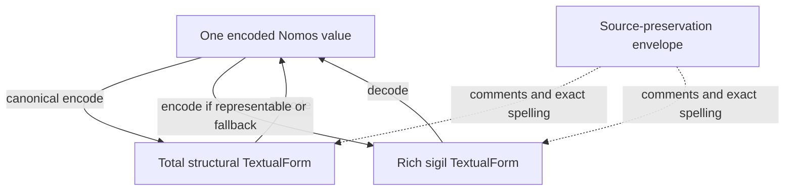

ASCII fallback:

```text
total structural text --decode--> one encoded Nomos value
total structural text <--encode-- one encoded Nomos value
rich sigil text --------decode--> one encoded Nomos value
rich sigil text <---encode/fallback when representable--- encoded value
source envelope keeps comments and exact spelling outside semantic identity
```

**Visual 11 — semantic convergence, not textual identity.** Rich punctuation is a view over typed encoded terms, not a separate evaluator primitive.

## 12. Program kinds and typed Dotos embedding

The psyche raised multiple Ethos program types and Dotos-typed positions as **[PT]**, not decisions. The root-known principle permits them cleanly.

### 12.1 Three root-selection designs

| Design | Preserves known-root principle? | Tradeoff |
|:--|:--|:--|
| External association `(program-kind identity, TextualForm identity) -> root type` | Yes, directly | A naked text file is not self-identifying. |
| Fixed bootstrap envelope whose first typed position selects the body root | Yes; the root is the bootstrap type | Requires one small stable bootstrap grammar. |
| Universal sum root containing every program kind | Technically | Every new kind changes the universal root; poor independent extension. |

**[P]** Use external association for governed Capsule/package artifacts and optionally a fixed bootstrap envelope for standalone text. Content sniffing is **[X]** because the root would not be known before interpretation.

**[P] Invented association notation:**

```text
# INVENTED, NOT CANONICAL
association
  capsule_kind BuildProgram
  textual_form CompactEthos
  root BuildProgramRoot
```

**[P] Invented bootstrap type metanotation:**

```text
# INVENTED TYPE DESCRIPTION, NOT AUTHORED SYNTAX
BootstrapDocument =
  Product [
    ProgramKindIdentity
    Body<root-selected-by-first-position>
  ]
```

The body remains raw and source-bounded until the first position resolves the root association.

### 12.2 A typed Dotos position

**[P] Invented root description:**

```text
# INVENTED TYPE DESCRIPTION, NOT CANONICAL ETHOS
BuildProgramRoot =
  Product [
    Imports
    Delegate<Dotos, BuildConfiguration>
    Declarations
  ]
```

At the second position, a compact Dotos value needs no repeated dynamic type tag because the position expects `BuildConfiguration`:

```text
# INVENTED Dotos VALUE AT A BuildConfiguration POSITION
{ Release Linux X86_64 }
```

A genuinely heterogeneous position such as `Delegate<Dotos, AnyKnownType>` does need an encoded type identity, analogous to [Protocol Buffers `Any`](https://protobuf.dev/reference/protobuf/google.protobuf/#any), which carries a type URL alongside serialized bytes. Otherwise the decoder would have to guess from content.

If `Dotos<T>` overlaps an Ethos surface form in the same position, the live repairs are:

- make the position exclusively Dotos;
- give the delegate a disjoint structural cue;
- make one common surface form that later realizes a typed sum.

**[I/P]** Under the within-one-position formalization, independently registered overlapping delegates would contradict the surviving disjointness requirement.

### 12.3 Dotos authority nuance

**[PV]** `Dotos` is the accepted future name. **[PV]** The rename is slated with the new Protos-engine train, not authorized as standalone churn. Until it lands, code and older reports legitimately use `NOTA`. **[I/P]** This report adopts “Dotos (currently NOTA)” as a provenance-friendly writing convention; the psyche did not rule that exact interim phrasing.

## 13. Plural output and generated identity

Plural Logos output is a surviving requirement. A plain vector is insufficient because it loses heterogeneous roles and stable keys.

**[P] Output algebra:**

```text
OutputShape =
    None
  | ExactlyOne(type)
  | FixedProduct(output_roles)
  | Optional(type)
  | KeyedSequence(key_type, element_type)
```

**[P] Invented ScopeOf output declaration:**

```text
# INVENTED TRANSFORMER SIGNATURE, NOT CANONICAL NOMOS
ScopeOf outputs
  PrimaryScopeType  ExactlyOne<Logos.TypeDeclaration>
  HelperScopeType   KeyedSequence<SourceTypeIdentity, Logos.TypeDeclaration>
  ConversionImpl    KeyedSequence<SourceEdgeIdentity, Logos.ImplDeclaration>
  ContainmentImpl   KeyedSequence<SourceTypeIdentity, Logos.ImplDeclaration>
```

Each result gets a structural address:

```text
OutputAddress =
  InvocationIdentity
  / OutputRoleIdentity
  / SourceKeyIdentity?
  / TransformerLocalKeyIdentity?
```

Desirable properties:

- traversal order does not affect identity;
- source spelling changes do not affect identity;
- duplicate keys refuse atomically;
- `map` preserves the source key;
- `filter` yields zero or one value at the existing key;
- `flatMap` must provide another stable local key rather than an ordinal;
- Rust names are later NameTree projections, never the identity itself.

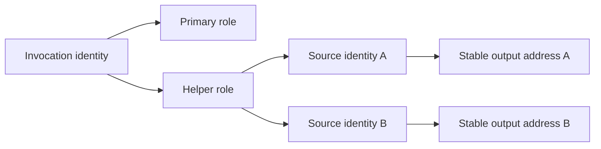

ASCII fallback:

```text
invocation identity
  +-> primary output role
  \-> helper output role
        +-> source identity A -> stable output address A
        \-> source identity B -> stable output address B
```

**Visual 12 — plural outputs are addressed structurally.** They do not depend on visitation order or invented helper spellings.

### 13.1 Four identity models remain live

| Model | Benefit | Conflict or risk |
|:--|:--|:--|
| Anonymous local structural address | No durable global allocation | Insufficient if every Logos declaration requires universal identity. |
| Translator allocation request keyed by output address | Preserves translator as allocation authority | It is unsettled whether an unauthored structural key is a word the translator may receive. |
| Deterministically derived generated ID | Stable without mutable allocation | Must not masquerade as translator-issued `coreID`; may require a distinct identity kind. |
| Content identity | Reuses byte-identical outputs | Collapses distinct conceptual roles and complicates cyclic graph hashing. |

Five things must not be conflated:

```text
semantic declaration identity
content identity
transformation occurrence identity
local output address
displayed helper name
```

Open identity questions include whether a helper persists across content changes, source movement, transformer-version changes, and duplicate invocations over the same source.

## 14. ScopeOf as a falsifying worked example

**[I/P]** ScopeOf should be used to falsify generic mechanisms rather than define special language machinery. The standing work order is target semantics first, minimal Ethos second, Nomos transformation third.

### 14.1 First: competing trait-based Rust and Logos targets

The legacy implementation supplies evidence, not destination: dozens of mirrored scope enums, `From<Domain>` conversions, inherent `contains_scope` methods, a root `contains_domain`, and consumer-side matching helpers. At least three target families deserve review.

**[E] Legacy-shaped Rust target:**

```rust
// HISTORICAL SHAPE, ABBREVIATED; NOT A PROPOSAL
impl DomainScope {
    fn contains_scope(&self, candidate: &DomainScope) -> bool;
    fn contains_domain(&self, domain: &Domain) -> bool;
}

impl From<Domain> for DomainScope;
```

**[P] Candidate trait-separated Rust target:**

```rust
// INVENTED RUST SIGNATURES FOR REVIEW
trait ScopeContainment<Rhs> {
    fn contains(&self, candidate: &Rhs) -> bool;
}

trait ScopeOverlap<Rhs> {
    fn overlaps(&self, other: &Rhs) -> bool;
}

trait ScopeMatching<Domain> {
    fn matches_domain(&self, domain: &Domain) -> bool;
}

impl ScopeContainment<DomainScope> for DomainScope;
impl ScopeMatching<Domain> for DomainScope;
impl From<Domain> for DomainScope;
```

**[P] Candidate Logos-semantic target:**

```text
# INVENTED LOGOS METANOTATION, NOT CANONICAL SYNTAX
GeneratedScopeFamily<SourceDomainType> {
  ScopeTypeTree
  DomainToScopeConversion
  ContainmentRelation<ScopeType, ScopeType>
  OverlapRelation<ScopeType, ScopeType>
  MatchRelation<ScopeType, DomainType>
}
```

The third option makes relation kinds semantic Logos objects and lets the Rust backend choose traits, inherent methods, borrowing, and names. Competing decisions remain: whether containment and matching are distinct, whether overlap is symmetric, who owns trait declarations, whether conversions are total, and which relations Logos must represent rather than derive in a backend.

#### Containment truth table

Containment is directionally `container.contains(candidate)`. The psyche ruled that root `All` is a whole-tree wildcard, but did not explicitly attach that statement to this exact API.

| Case | Candidate result | Authority/status |
|:--|:--:|:--|
| `contains_scope(All, X)` | `true` | **[I]** Natural application of the ruled wildcard; exact API attachment needs review. |
| `contains_scope(X, All)` | **[U]** | Operand symmetry is not ruled; containment is normally asymmetric. |
| `contains_scope(X, X)` | **[U]** | Reflexivity is plausible and historical, not established by the `All` ruling. |
| `contains_scope(parent, descendant)` | **[U]** | Tree direction and whether descendants count as contained require an exact target. |
| `contains_scope(sibling_a, sibling_b)` | **[U]** | Likely false under tree containment, but unruled. |

#### Scope-overlap or scope-matching truth table

Overlap could be symmetric, while a filtering-style `matches_scope(filter, value)` could be directional. These must not be collapsed.

| Case | Candidate result | Authority/status |
|:--|:--:|:--|
| `overlaps(All, X)` | `true` | **[I]** Expected if the ruled wildcard participates in overlap. |
| `overlaps(X, All)` | `true` only if symmetric | **[U]** Operand symmetry is not ruled. |
| `matches_scope(All, X)` | `true` | **[I]** Expected for `All` as a filter wildcard. |
| `matches_scope(X, All)` | **[U]** | Depends on whether the second operand is a value, filter, or equally ranked scope. |
| ancestor versus descendant | **[U]** | Could overlap, contain, or fail depending on the desired relation. |

#### Scope-to-domain matching truth table

This relation crosses types, so `Scope::All` and a possible `Domain::All` must not be conflated.

| Case | Candidate result | Authority/status |
|:--|:--:|:--|
| `matches_domain(Scope::All, Domain::X)` | `true` | **[I]** Direct-looking application of the ruled scope wildcard; exact signature still open. |
| `matches_domain(Scope::X, Domain::All)` | **[U]** | A domain enum’s `All` atom may be ordinary source data rather than a wildcard operand. |
| exact corresponding scope/domain paths | **[U]** | Historical behavior supports true, but the corrected target has not been ruled. |
| ancestor scope versus descendant domain | **[U]** | Depends on whether matching includes subtree containment. |
| unrelated scope/domain branches | **[U]** | Likely false, but requires the reviewed tree relation. |

The only fixed semantic in these tables is that root scope `All` means whole-tree wildcard. Relation names, direction, reflexivity, symmetry, domain-side `All`, and descendant behavior remain open.

### 14.2 Second: competing minimal Ethos sources

The minimum semantic information appears to be a new declaration identity, a source domain/type identity, and selection of the ScopeOf transformation capability. Whether all three require authored atoms depends on the expected position and resolved head.

**[E] Historical three-atom surface:**

```text
# HISTORICAL EVIDENCE; NOT RE-RULED
DomainScope.ScopeOf.Domain
```

**[P] Explicit structural application alternative:**

```text
# INVENTED, NOT CANONICAL
DomainScope.(ScopeOf Domain)
```

**[P] Head-first declaration alternative:**

```text
# INVENTED, NOT CANONICAL
ScopeOf.(DomainScope Domain)
```

**[P] Position-supplied capability alternative:**

```text
# INVENTED, NOT CANONICAL
DomainScope.Domain

# Only conceivable at a position whose type already fixes ScopeOf capability.
```

The last form is maximally compact but may hide too much: if more than one capability can produce the expected declaration type, coherence fails. The historical three-atom form is explicit but may encode a globally special keyword if `ScopeOf` does not resolve through ordinary identity/capability machinery.

### 14.3 Third: Nomos implications

Only after target relations and minimal Ethos information are chosen can the Nomos transformation be designed. A generic candidate needs:

- a typed source-domain reference;
- whole-population or whole-tree access;
- structurally bounded recursion or another reviewed recursion mechanism;
- injection of the ruled `All` wildcard at the correct scope roots;
- zero/one/many typed output roles;
- stable helper and relation identities;
- construction of conversion, containment, overlap, and match semantics actually selected in the target;
- atomic refusal before any partial identity allocation.

**[P] Invented positional interpretation of the historical surface:**

```text
# INVENTED READING OF HISTORICAL TEXT; NOT CANONICAL
DomainScope.ScopeOf.Domain

at TypeDeclaration:
  DomainScope = declaration identity
  ScopeOf     = resolved head with transformer capability
  Domain      = input type identity required by that capability
```

**[P] Invented generic output plan:**

```text
# INVENTED OUTPUT PLAN
PrimaryScopeType:
  key = invocation identity

HelperScopeType:
  one per source enum or type node
  key = source node encoded identity

ConversionImpl:
  one per source edge
  key = ordered pair of source encoded identities

ContainmentOrMatchImpl:
  one per reviewed target relation and source node
  key = relation identity plus source node encoded identity
```

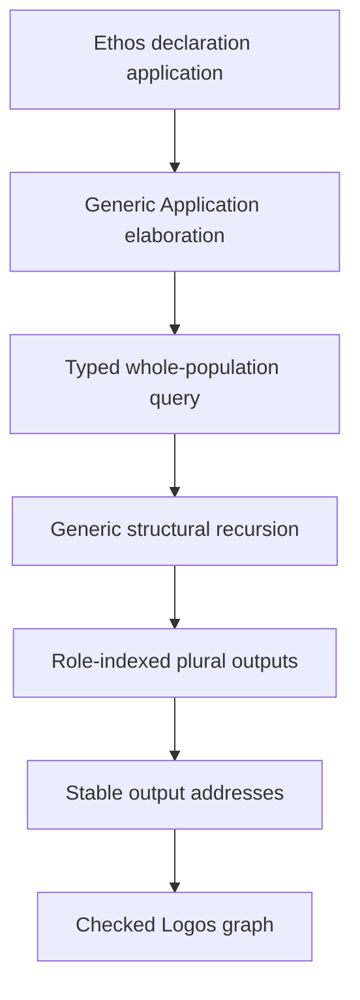

ASCII fallback:

```text
Ethos declaration application
  -> generic Application elaboration
  -> typed whole-population query
  -> generic structural recursion
  -> role-indexed plural outputs
  -> stable output addresses
  -> checked Logos graph
```

**Visual 13 — ScopeOf may use every generic mechanism, but may own none.** A ScopeOf-specific parser or hidden renderer-only declaration is evidence against the design.

**[P]** ScopeOf would falsify the candidate generic architecture if it requires any of these:

- a ScopeOf-only raw parser branch;
- global dot semantics;
- helper lookup by derived strings;
- traversal-order-based identity;
- partial identity allocation after failure;
- an untyped bag of outputs;
- types or references that exist only in emitted Rust and not in Logos;
- a special evaluator primitive that no other transformation can reuse.

## 15. Alternatives, tradeoffs, and current disposition

### 15.1 Eliminated possibilities

The following are eliminated as candidate foundations, not necessarily deleted from current code:

| Candidate | Why eliminated |
|:--|:--|
| One global meaning for `X.[...]`, `X.{...}`, `X.(...)`, or dot | Contradicts position-local meaning. |
| Content sniffing to choose an Ethos root | Contradicts root-known-before-interpretation. |
| Raw right-associative dot tree as universal semantic truth | Prematurely decides a position-local question. |
| Current `TemplateValue` as authority because it exists | Contradicted by the psyche’s instruction to doubt the preceding misguided slices rather than trust implemented substrate by provenance. |
| A tiny schema algebra as the entire correctness system | Cannot prove references, cross-child relations, effects, termination, or output identity. |
| Separate overlapping parser forms for constructor and transformer application | Conflicts with disjointness when the surface language is the same. |
| Ordered import precedence as silent ambiguity resolution | Makes package order semantic and fragile. |
| Catch-all structural form plus unlimited future specifics | The languages overlap necessarily. |
| One undifferentiated `Expression<T>` for values, constraints, transformations, and effects | Collapses materially different semantics. |
| Compile-time-only proof of hole freedom for all dynamic archives | Encoded input and runtime-linked identities still require checked boundaries. |
| Validation with no nominal `CheckedLogos` carrier | Allows accidental bypass after validation. |
| Exact source-text round-trip as universal law | Comments, whitespace, aliases, and abbreviations require canonicalization or an auxiliary envelope. |
| “Expansion-time evaluation is universal” as a premise | Falsified by advanced hygienic transcription systems without arbitrary evaluator execution. |
| `Vec<Declaration>` as the complete plural-output model | Erases roles, heterogeneous cardinality, and stable keys. |
| Helper spelling or traversal ordinal as semantic identity | Renames and traversal scheduling would change identity. |
| ScopeOf-specific language or evaluator machinery | Reverses the desired relationship between example and architecture. |

### 15.2 Live candidates

The following remain possible and should be judged by experiments rather than adoption momentum:

- handwritten Nomos/Logos twins remain possible but are **[I]** disfavored because they duplicate structure and carry high drift risk;
- a closed regular tree-pattern algebra with seal-time intersection proofs;
- universal static disjointness survives as **[SR]**; scoping its formal proof to surface ownership within one typed position remains **[I/P]**;
- a neutral raw dotted spine and typed local folding;
- one generic application surface with coherent capability elaboration;
- an external program-kind association plus optional fixed bootstrap envelope;
- typed `Delegate<Dotos,T>` positions;
- a total schema-derived phase lift;
- generic encoded arena as canonical representation;
- phase-generic or generated Rust types as checked views;
- a private `CheckedLogos` boundary;
- strict typed-DAG configuration as the default;
- explicit constraint regions only where inference needs them;
- separate structural-total and budgeted-partial transformation profiles;
- a total structural TextualForm plus richer sibling forms;
- role-indexed and source-keyed plural outputs;
- anonymous local generated addresses or translator-mediated durable allocation;
- Rust projection today with a backend-neutral checked Logos boundary for possible LLVM lowering later.

### 15.3 Decision matrix

| Design pressure | Arena only | Phase-generic Rust only | Hybrid |
|:--|:--:|:--:|:--:|
| Runtime extension without compiler rebuild | Strong | Weak | Strong |
| Rust exhaustiveness and ergonomic matching | Weak | Strong | Strong after reification |
| One schema as structure authority | Strong | Medium | Strong |
| Compile-time Nomos/Logos separation | Medium | Strong | Strong at APIs plus checked runtime boundary |
| Archive flexibility | Strong | Medium | Strong |
| Implementation simplicity | Medium | Medium | Lowest initially |
| Long-term reuse across backends | Strong | Medium | Strong |

**[I]** The hybrid has the best fit, but only if the checked transitions remain small, total, and mechanically generated from schema. Otherwise it becomes an over-layered system with correctness scattered across adapters.

## 16. Complete 25-test falsification suite

These are not acceptance tests for an already chosen design. They are attempts to expose where the candidate system lies about its generality or correctness.

1. **Root association and position-local reuse.** Mechanism-neutral obligation: a source presented under the wrong language/root/TextualForm association refuses before its body is semantically decoded, while byte-identical local structure may realize different values at two valid known positions. Candidate experiment: define two tiny roots with distinct first positions, feed each the other root’s text, vary root arity/order/cardinality, then feed one dotted subtree to two admitted positions and verify that only their typed tables change the result.

2. **Dotted remainder typing and grouping.** Mechanism-neutral obligation: every recursive dotted remainder is interpreted with an expected or transitional type, never context-free guessing; wrong arity/order/cardinality and wrong-position forms refuse. Candidate experiment: preserve invented `A.B.C` as a neutral spine, have path and application positions assign different expected types to `B.C`, compare flat and explicit grouped forms, and require canonical printing to preserve the selected encoded grouping.

3. **Cross-child relation.** Express `{f(a,b), f(b,a)}` through one surface form plus a semantic relation. The system must reject `f(a,a)` without pretending the two accepted pairs are disjoint top-down forms.

4. **Grammar-only extension.** Mechanism-neutral obligation: a form expressible in the accepted structural description language is added as data rather than a bespoke parser branch. Candidate experiment: under the proposed closed regular descriptor algebra, add one local form, verify raw-discovery/shared-evaluator source hashes remain unchanged, and label failure as evidence that the proposed algebra is incomplete rather than making the hash check itself a design requirement.

5. **Ambiguity mutation.** Add a form that overlaps an existing form at the same position and require seal refusal with an intersection witness. Add that same form at a different position and require success.

6. **Catch-all pressure.** Mechanism-neutral obligation: preserve the surviving universal static-disjointness ruling rather than silently choosing by import order. Candidate experiment: under the **[I/P]** within-one-position formalization, install a wildcard form and then a specific form inside its language; require refusal or merge both meanings into one structural form with later typed elaboration. Specificity is not accepted without an explicit new psyche reversal.

7. **Phase-correspondence and old-landing revalidation.** Mechanism-neutral obligation: once the exact Nomos/Logos correspondence is reviewed, changing a Logos output shape cannot silently leave its Nomos counterpart stale. Candidate experiment: add a constructor and position to a toy Logos schema, compare a recursive-`Lift` derivation with current Template(X), computed landing types, and `Fixed`/`ValueOrFuture`/`Nested`/`Sequence` categories; each old mechanism must either derive the new case, refuse loudly, or be rejected as non-surviving evidence.

8. **Every-position matrix.** For a toy Logos grammar, exercise computation at root, product, sum choice, whole subtree, scalar, name, visibility, whole sequence, sequence element, splice, and targeted insertion positions. Any intentionally noncomputable position must cite a reviewed schema constraint, not an old implementation category.

9. **Phase no-crossing.** Mechanism-neutral obligation: an unresolved Nomos value cannot be consumed as valid Logos. Candidate-specific experiment: for the phase-generic Rust proposal, compile the durable `no_hole_failure.rs` witness and require a static `Declaration<Nomos>` versus `Declaration<Logos>` mismatch; validation-time or hybrid candidates must demonstrate an equivalent non-bypass property by their own mechanism.

10. **Semantic no-hole boundary.** Mechanism-neutral obligation: no residual computation or unchecked semantic reference crosses the Logos boundary. Candidate-specific experiment: for the proposed staged/hybrid carrier, construct a structurally valid dynamic Nomos archive, evaluate it, and prove only a private `CheckedLogos` result reaches reification; another design may satisfy the obligation without that carrier name or stage split.

11. **Dangling-reference separation.** Admit a shape-valid, type-correct reference through structural seal, then reject it during semantic checking because the referenced declaration is absent. This proves the stages are honest about their obligations.

12. **Unambiguous constructor/transformer application.** Mechanism-neutral obligation: at a known position, ordinary construction and transformer use are statically unambiguous without a global punctuation meaning. Candidate-specific experiment: decode both through the proposed single `ApplicationSurface`, then use resolved head capabilities to select semantics without adding a competing parser form; a different disjoint surface design may satisfy the obligation if psyche review chooses it.

13. **Capability coherence.** Install two applicable capabilities for the same resolved head, input, expected result, and position. Link/seal must refuse unless an explicit non-syntactic ownership or coherence law yields exactly one selection.

14. **Transactional allocation.** Cause application elaboration to fail after tentative declaration discovery. The NameTree/identity store must show that no allocation committed.

15. **Multi-form isomorphism.** Encode one Nomos term through the total structural form and a rich sigil form. Both must produce byte-identical semantic EncodedForm, and each must render its own canonical text.

16. **Rich-form incompleteness.** Construct an encoded Nomos term that the rich syntax cannot abbreviate. The rich codec must either use a generic fallback or report its partial domain explicitly; it must not lose information.

17. **Configuration graph.** Evaluate required, optional, defaulted, constrained, and explicitly supplied values. Reorder declarations and require identical results; missing inputs, wrong types, same-tier conflicts, and cycles must produce typed traces.

18. **Conditional branches.** Typecheck both branches against one result type. Test whether unavailable references in an untaken branch are rejected or tolerated according to the eventual reviewed staging law; the behavior must not be accidental evaluator laziness.

19. **Structural versus general recursion.** A structurally decreasing traversal must terminate without a general budget. Same-node self recursion, mutual cycles, and accidental expansion must refuse or exhaust a deterministic semantic budget with a reproducible trace.

20. **Whole-population negative dependency.** Mechanism-neutral obligation: a whole-population result cannot remain stale when a relevant previously absent declaration appears. Candidate-specific experiment: cache a no-match query under the proposed dependency model, add the first match, and verify invalidation through an index-membership digest; recomputation or another sound dependency representation may satisfy the same obligation.

21. **Stringlessness and rename invariance.** Rename every NameTree display spelling. Transformation decisions, bindings, selected capability identities, output addresses, and appropriate content identities must remain unchanged. Runtime traps and static scans must show no spelling operation during transformation.

22. **Plural-output stability.** Mechanism-neutral obligation: plural outputs and their internal references remain stable under irrelevant traversal/scheduling changes, and duplicates refuse atomically. Candidate-specific experiment: exercise proposed role-indexed keyed addresses for zero, one, fixed heterogeneous, and keyed plural outputs while reordering siblings and parallelizing traversal; other reviewed identity models must provide an equivalent stability witness.

23. **Generated-reference closure.** Create references among generated helpers before any Rust name exists. All helpers and references must be present and valid in Checked Logos; no declaration may exist only in the renderer.

24. **ScopeOf as stress witness.** Mechanism-neutral obligation: after its target truth tables are reviewed, ScopeOf produces exactly that typed Logos behavior, including whole-tree `All`, without spelling manipulation or hidden renderer-only declarations. Candidate-specific experiment: implement it using the proposed common application, whole-population query, recursion, keyed-output, identity, and checked-lowering mechanisms; a ScopeOf-only evaluator branch falsifies this generic candidate, not an already ruled architecture.

25. **Backend correctness reuse.** Mechanism-neutral obligation: accepted Logos preserves its reviewed semantics through the current Rust backend, while Protos rejects invalid structures whenever it already has sufficient type information. Candidate-specific experiment: emit, compile, and execute each fixture and pass the same proposed checked carrier to a mock non-Rust backend boundary; another carrier may satisfy backend neutrality without `CheckedLogos` or this mock shape.

## 17. Complete unresolved inventory

This inventory contains only core vision/design questions. Adjacent train and process items remain separate in section 19. Requirements whose existence is ruled are phrased as mechanism questions rather than falsely returned to “whether.”

Compact trace keys:

- **FP-R** — known root and position-local structural meaning.
- **FP-T** — perfect strict typing and type specificity as a strength.
- **FP-E** — encoded-to-encoded transformation without spelling manipulation.
- **FP-X** — extensibility through reusable, simple mechanisms rather than a frozen parser.
- **FP-I** — encoded identity is distinct from displayed name.
- **FP-P** — same-shaped but distinct Nomos/Logos values because of escape holes.
- **FP-O** — Logos must be hole-free and semantically valid before backend projection.
- **FP-B** — whole-program Ethos horizon, Rust today, and long-term backend latitude.
- **C** — the controlling structural correction in [Codex line 2488](/home/li/.codex/sessions/2026/07/30/rollout-2026-07-30T11-12-27-019fb24b-ea61-7440-88d3-9679e407131a.jsonl:2488).
- **L178/L212/L232/L273/L277/L285** — exact new-Claude ledger entries in section 2.
- **SR** — surviving reconciled requirement in section 4.

### 17.1 Representation, root, and local form

| # | Unresolved question | First-principle trace | Psyche-material trace |
|--:|:--|:--|:--|
| 1 | What exactly does “same textual/encoded form” mean: common machinery, structural isomorphism, literal representation equality, or something else? | FP-T, FP-E | L178 rules the phrase and round-trip, not its interpretation. |
| 2 | Which Ethos program root types exist? | FP-R, FP-T | C rules a known root struct; L285 raises multiple program kinds only as thought. |
| 3 | How is a root selected: Capsule association, bootstrap envelope, or another typed mechanism? | FP-R | C requires the root known before local interpretation; no selector is ruled. |
| 4 | Which historical roles `Imports/Input/Output/Types/Generics/Impls`, if any, survive? | FP-R, FP-X | C says the old design must not be followed blindly. |
| 5 | What is the exact order of every surviving root position? | FP-R, FP-T | C rules positional structure but gives no corrected order. |
| 6 | What outer and per-position delimiters does each root use? | FP-R | C enumerates possible shapes without assigning root delimiters. |
| 7 | What optionality, repetition, and cardinality does each root position have? | FP-T | Type specificity is ruled as a strength at L285; cardinalities are unstated. |
| 8 | Which realized forms are admitted at each root position? | FP-R, FP-T | C rules position-local possibilities but supplies no complete table. |
| 9 | Which realized forms are admitted at each recursively selected child position? | FP-R, FP-T | C describes recursive structural interpretation but no recursive table. |
| 10 | Which positions delegate to fixed `Dotos<T>`, and is heterogeneous `Dotos<Any>` needed? | FP-R, FP-T | L285 raises Dotos-typed positions as thought; Dotos rename alone does not settle embedding. |
| 11 | Is raw dotted input stored as a neutral spine, a recursive tree, or another factual structure? | FP-R, FP-X | C raises recursive dotted-symbol possibilities without ruling representation. |
| 12 | Does any position assign left, right, or head/application associativity to an ungrouped dotted spine? | FP-R | C rejects global punctuation meaning; associativity is unstated. |
| 13 | What exact expected type or transitional type is passed to every recursive dotted remainder? | FP-R, FP-T | C says each position is typed; it does not specify tail typing. |
| 14 | When is a dotted spine interpreted as a whole versus recursively as head plus remainder? | FP-R | C explicitly wonders whether the remainder re-enters decoding; no answer follows. |
| 15 | How do explicit parentheses/braces/brackets affect dotted grouping and the next expected type? | FP-R, FP-T | C enumerates the shapes but assigns no grouping law. |
| 16 | What canonical printer preserves semantic grouping without inventing global dot associativity? | FP-R, FP-E | L178 requires round-trip; C leaves dotted grouping open. |
| 17 | Which wrong-position dotted, bracketed, braced, parenthesized, and bare-symbol forms must refuse? | FP-R, FP-T | Static refusal survives as SR; the corrected form table is absent. |
| 18 | Which uses of capitalization and bare atoms are scalar syntax, identity spelling, constructors, or structural cues? | FP-R, FP-I | C mentions bare/dotted symbols and capitalization lineage without a complete law. |
| 19 | What is the smallest closed descriptor algebra that expresses every accepted surface form? | FP-X, FP-T | C demands extensibility; no algebra is ruled. |
| 20 | Is “disjoint within one typed position” the correct formal scope of universal static disjointness? | FP-R, FP-T | SR rules universal disjointness; the within-position formulation is I/P. |
| 21 | Are regular tree languages sufficient for all surface forms and diagnostics? | FP-X | SR does not rule automata; research supplies only a candidate proof method. |
| 22 | How are future extension points preserved without overlapping catch-all forms? | FP-X, FP-T | SR rules disjointness; no catch-all design is ruled. |

### 17.2 Nomos/Logos phase and landing model

| # | Unresolved question | First-principle trace | Psyche-material trace |
|--:|:--|:--|:--|
| 23 | What is the canonical carrier: handwritten twins, schema arena, phase-generic Rust, generated mirrors, or hybrid? | FP-P, FP-X | L212/L232 rule same shape, distinct by holes; no representation is chosen. |
| 24 | Does every Logos type `T` induce a Nomos counterpart, or only types reachable at transformer output positions? | FP-P, FP-T | L212 says “a corresponding Logos type,” not a universal mapping theorem. |
| 25 | Is recursive `Lift(S)` the right derivation, and which schema cases does it cover? | FP-P, FP-X | L232 identifies holes; recursive lift is P. |
| 26 | Must both whole-node computation and recursively local holes exist at every composite kind? | FP-P, FP-T | L277 challenges one fixed position but does not rule universal coverage. |
| 27 | Is every position escapable, or can reviewed types prohibit computation? | FP-P, FP-T | L277 opens the question and redirects phase-safety discussion; no ruling. |
| 28 | Which mechanisms, if any, survive from current `Template(X)`? | FP-X, FP-P | L285 directs doubt at preceding misguided slices; current derivation remains E only. |
| 29 | Do computed landing types survive, and are they derived from Logos schema, local position tables, or another source? | FP-T, FP-X | Same doubt correction; no replacement is ruled. |
| 30 | Do landing categories such as `Fixed`, `ValueOrFuture`, `Nested`, and `Sequence` survive? | FP-P, FP-T | L277 directly challenges `Fixed`; other categories remain unreviewed. |
| 31 | If fixed-versus-future classification survives at all, what authoritative fact determines it? | FP-P, FP-T | L277 asks whether visibility may evaluate; no criterion is supplied. |
| 32 | What semantic operation algebra covers one-value holes, sequence splice, invocation, recursion, insertion, and configuration? | FP-P, FP-X | C names current glyph ideas; SR preserves recursion/insertion, not one algebra. |
| 33 | Which textual views correspond to those operations, including `$`, `$@`, `@$`, `@T`, keywords, and recursion markers? | FP-E, FP-X | C recalls markers uncertainly; no exact spelling is ruled. |
| 34 | At what transition is “no holes remain” guaranteed? | FP-P, FP-O | L273 answered `explain`, selecting no enforcement point. |
| 35 | Is phase safety compile-time, validation-time, hybrid, or represented another way? | FP-P, FP-O | L273 explicitly leaves the forced choice unanswered; L277 redirects to visibility. |
| 36 | Does phase identity live in Capsule association, object identity, Rust types, or several layers? | FP-P, FP-I | L212/L232 require distinctness but do not locate identity. |
| 37 | Can Nomos reference the semantic Logos type it promises while keeping Nomos/Logos object identity distinct? | FP-P, FP-I | Same-shape/distinct-type ruling leaves reference identity open. |
| 38 | How do schema identity, fingerprint, phase, and root identity prevent archive/version confusion? | FP-T, FP-I, FP-O | L178 requires round-trip; no archive envelope is ruled. |
| 39 | Must exact comments/grouping/spelling round-trip, or only semantic encoded values? | FP-E | L178 requires round-trip but does not define semantic versus source-preserving equality. |

### 17.3 Evaluation and configuration

| # | Unresolved question | First-principle trace | Psyche-material trace |
|--:|:--|:--|:--|
| 40 | Does Protos have a concrete use requiring a distinct transformation-time evaluator at all? | FP-X, FP-T | L285 raises an evaluator as thought and asks for research, not adoption. |
| 41 | If needed, is configuration an Ethos position, separate typed population, deployment input, or several program-kind-specific forms? | FP-R, FP-T | L285 raises these possibilities only as thought. |
| 42 | What structural base and optional rich syntax references a typed configuration value? | FP-R, FP-E | L285 suggests a possible new prefix but rules none. |
| 43 | Is an acyclic dependency graph sufficient, or is a lazy/constraint fixed point justified by a desired program? | FP-T, FP-X | L285 mentions derived dependencies; no cycle semantics is chosen. |
| 44 | What distinctions exist among unset, optional none, explicit null-like value, default, incomplete, and contradiction? | FP-T | Type specificity is a strength at L285; exact absence types are unstated. |
| 45 | What conflict/precedence law governs explicit values, defaults, and possible origin tiers? | FP-T, FP-X | L285 raises defaults; no priority law is ruled. |
| 46 | Are references in untaken conditional branches resolved eagerly, lazily, or by a staged rule? | FP-T, FP-O | L285 raises conditions; no branch semantics is ruled. |
| 47 | Are values, constraints, transformations, effects, and plural results separate term sorts or one indexed algebra? | FP-T, FP-X | L285 raises evaluation broadly; no term algebra is ruled. |
| 48 | Which population snapshot can evaluation observe: original Ethos, prior outputs, staged snapshots, or a fixed point? | FP-E, FP-O | SR requires whole-population capability; staging remains open. |
| 49 | May a transformer generate transformers or configuration and thereby create another stage? | FP-P, FP-O | No direct psyche statement settles stage generation. |

### 17.4 Recursion, effects, applications, and identity

| # | Unresolved question | First-principle trace | Psyche-material trace |
|--:|:--|:--|:--|
| 50 | Is recursive transformation authored as self-`Invoke`, `Fold`, derived traversal, another marker, or several constructs? | FP-P, FP-X | SR requires recursion; C explicitly leaves its syntax open. |
| 51 | Which traversal powers beyond fold are needed: original-child access, inherited attributes, siblings, indexes, or population queries? | FP-T, FP-X | Whole-program/whole-population material leaves traversal shape open. |
| 52 | Is targeted insertion index-based, key/anchor-based, span-relative, or a general sequence program? | FP-T, FP-X | SR requires insertion capability, not the current `InsertAt` mechanism. |
| 53 | Must authored Nomos be total, or are deterministic budgeted-partial transformations acceptable? | FP-O, FP-X | Recursion SR gives no termination policy. |
| 54 | What typed whole-population query language exists, and can it observe generated values? | FP-T, FP-E | Whole-population SR leaves query and staging semantics open. |
| 55 | Which effects are explicit capabilities, and which disable deterministic caching? | FP-E, FP-O | L285 raises runtime evaluation as thought; no effect policy is ruled. |
| 56 | If budgets exist, which semantic events are counted portably? | FP-O, FP-X | No direct psyche budget ruling exists. |
| 57 | How do negative population queries participate in dependency and cache invalidation? | FP-E, FP-O | Whole-population SR does not specify caching. |
| 58 | Who may define an application capability for a head? | FP-I, FP-X | Position-local application is in C; ownership/coherence is unstated. |
| 59 | What semantic coherence rule selects one capability after unique surface decoding? | FP-T, FP-X | Disjointness SR governs syntax, not semantic capability conflicts. |
| 60 | When are declaration identities tentatively allocated and atomically committed? | FP-I, FP-O | C distinguishes declaration/reference roles; transaction boundary is open. |
| 61 | Do builtins and authored transformers use exactly the same identity/capability path? | FP-I, FP-X | C rejects global syntax meaning; builtin ontology is unruled. |
| 62 | Are `ItemName`, `Visibility`, `Attributes`, `Generics`, `Fields`, and `Variants` type/constructor identities or forbidden redundant field labels? | FP-R, FP-T | C rules positional omission; historical vocabulary’s category is unclear. |

### 17.5 Plural output, ScopeOf, textual forms, and backend

| # | Unresolved question | First-principle trace | Psyche-material trace |
|--:|:--|:--|:--|
| 63 | What fixed products, optionals, and keyed sequences can a transformer declare as output? | FP-T, FP-O | Plural output is SR; cardinality algebra is not. |
| 64 | Are generated helpers local addresses, translator-allocated IDs, a distinct derived-ID kind, or content identities? | FP-I, FP-O | Plural output SR and translator identity law do not settle helper ontology. |
| 65 | Does helper identity persist across content change, source movement, transformer version, and repeated invocation? | FP-I | No direct psyche stability ruling exists. |
| 66 | May generated outputs refer mutually or cyclically, and how are identities reserved before bodies? | FP-I, FP-O | Plural output SR leaves graph topology open. |
| 67 | Which ScopeOf target is correct: inherent methods, relation traits, or semantic Logos relation objects? | FP-O, FP-B | Standing work order says target first; `All` is SR; signatures remain open. |
| 68 | What is the minimum-information Ethos source after target semantics are fixed? | FP-R, FP-T | Historical `DomainScope.ScopeOf.Domain` predates correction and is not re-ruled. |
| 69 | What separate truth tables govern containment, scope overlap/matching, and scope-to-domain matching? | FP-T, FP-O | `All` whole-tree wildcard is SR; the three relations are not ruled. |
| 70 | In which relations is `All` symmetric between operands, and is domain-side `All` a wildcard at all? | FP-T | SR rules root scope wildcard but not operand symmetry or domain semantics. |
| 71 | Must every rich TextualForm be total, or may a total structural fallback cover unrepresentable values? | FP-E, FP-X | L178 requires round-trip; exact multi-form completeness is unresolved. |
| 72 | What semantic Logos vocabulary expresses any desired program without cloning every Rust feature? | FP-B, FP-T | L285 raises the whole-program horizon and exact feature/adapter boundary as thought-grade material. |
| 73 | Which closures, tuples, free functions, and library conventions use typed Rust adapters? | FP-B, FP-E | L285 raises adapter/porting possibilities as thought. |
| 74 | What must Logos avoid now so the surviving long-term LLVM direction remains possible? | FP-B, FP-X | LLVM direction is SR; its near-term architectural consequence is open. |

## 18. Dependency-ordered psyche review agenda

These questions are ordered because later answers depend on earlier ones. Each question explains the design fork it controls.

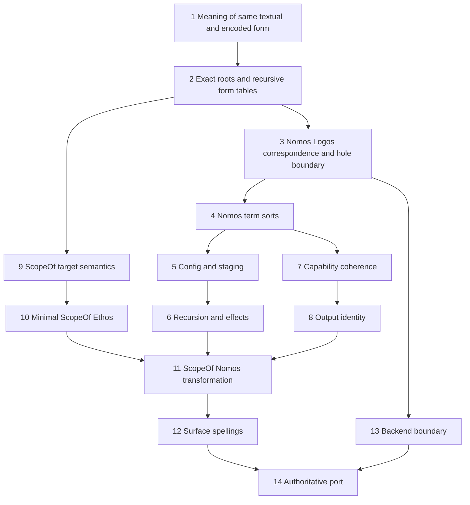

ASCII fallback:

```text
1 exact meaning of same textual/encoded form
  -> 2 exact roots and recursive form tables
  -> 3 Nomos/Logos correspondence and hole boundary
  -> 4 Nomos term sorts

4 -> 5 configuration/staging -> 6 recursion/effects -----+
4 -> 7 capability coherence -> 8 output identity --------+-> 11 ScopeOf Nomos
2 -> 9 ScopeOf target semantics -> 10 minimal Ethos -----+

11 ScopeOf Nomos -> 12 surface spellings -> 14 authoritative port
3 phase boundary -> 13 backend boundary -------> 14 authoritative port
```

**Visual 14 — review dependency order.** Syntax spelling comes late because the terms, types, and worked transformation must be known first.

### Review question 1: What exactly does “same textual/encoded form” mean?

[Line 178](/home/li/.claude/projects/-home-li-primary/0f9d1436-0f9a-4cb0-9c08-60027d8cbc6e.jsonl:178) rules the phrase and the need to round-trip, but not whether the relationship is common machinery, structural isomorphism, literal representation equality, or something else. This must be clarified before choosing shared codec or phase representation architecture.

### Review question 2: Which exact Ethos roots and recursive form tables exist?

The known-root principle cannot become a concrete language until program kinds, root selectors, position order/cardinality/delimiters, and every recursively reached local form table are known. This review includes the historical six roles and the expected type supplied to every dotted remainder.

### Review question 3: What is the Nomos/Logos correspondence and where are holes excluded?

Only after roots/forms are known can the psyche judge whether recursive `Lift`, Template(X), another correspondence, or no universal mapping is correct. The review must also locate hole exclusion; no compile-time, validation-time, or hybrid option was selected at line 273.

### Review question 4: What kinds of Nomos terms exist?

Value holes, constraints, invocation, recursion, splice, targeted insertion, effects, and plural emission may share primitives without being one undifferentiated expression. The encoded operations must be chosen before their glyphs.

### Review question 5: Is a distinct transformation-time evaluator needed, and if so what configuration/staging semantics follow?

The first decision is whether a desired Protos program needs more than structural transcription and typed transformer invocation. Only then should the psyche choose typed environments, defaults, DAGs, constraints, branch staging, or fixed points.

### Review question 6: How are required recursion and whole-population access bounded?

Recursive transformation and whole-population analysis already survive as requirements. The open decision is which operations are structural or acyclic, whether budgeted partiality is acceptable, and which population reads/effects are explicit.

### Review question 7: How does application capability coherence work?

Constructor versus transformer meaning can remain position-local only if heads and capabilities resolve coherently under pinned composition. This review also decides whether cross-package `Invoke` exists and where imports, versions, cycles, and visibility are checked.

### Review question 8: What identity do plural outputs receive?

Plural output is required, but helper identity is not settled. The psyche must distinguish local output address, universal translator-issued identity, derived identity, content identity, and displayed name before ScopeOf can generate a stable graph.

### Review question 9: What exact ScopeOf target semantics exist?

Following the required work order, review the Rust/Logos target first: scope types, conversions, containment, overlap, scope-to-domain matching, the ruled root `All` wildcard, and every unresolved direction/symmetry case.

### Review question 10: What is the minimal-information ScopeOf Ethos source?

Once the target is exact, determine which authored identities are irreducible and which are already provided by the type-declaration position or capability environment. Compare the historical dotted triple against explicit and position-supplied alternatives.

### Review question 11: What Nomos transformation produces the reviewed ScopeOf target?

Only now design whole-tree access, recursion, `All` injection, plural output roles, conversion/relation generation, and helper identity. ScopeOf should test accepted generic mechanisms rather than silently create special cases.

### Review question 12: Which textual spellings expose the accepted encoded operations?

After the operation algebra and worked transformation are known, review `$`, `$@`, `@$`, `@T`, keyword fallbacks, recursive markers, configuration prefixes, and insertion views. No historical glyph becomes canonical through repetition.

### Review question 13: What is the backend-neutral Logos boundary?

Rust is the current correctness-rich generated target; LLVM is long-term direction. The review should identify which Logos constructs are semantic and which belong only to Rust adapters, so today’s backend does not freeze tomorrow’s ontology.

### Review question 14: Where does each accepted result become authoritative?

This report must not be copied wholesale into one design log. Psyche rulings belong in dated design decisions, enduring component invariants in owning `ARCHITECTURE.md` files, supported author-facing behavior in READMEs, and cross-repository law in standards.

## 19. Adjacent train items not silently decided here

The following remain separate review or implementation threads. This research does not settle them by adjacency:

- **Alias-law scope.** Which identity/name alias behaviors are intended remains with its owning review.
- **`syn` / `quote` / `prettyplease` law scope.** Existing prohibition claims and exceptions must be resolved by their authority record; phase-lift research does not decide a tooling policy.
- **`StoreSchema` compatibility wording.** Archive compatibility language remains an owning-component documentation issue.
- **`sema-engine` use of “macro.”** Terminology there may be unrelated to Nomos semantics and should not be rewritten by analogy.
- **Spirit-down intent recovery.** The unavailable capture period may contain missing intent, but this report neither invents nor publishes it.
- **Authority policy.** Recency inside a design log and authority grade across different surfaces require explicit reconciliation.
- **Deployment and identity semantics in po2.4 through po2.6.** These were assessed as independent of the mistaken global syntax model; nothing here reverses them.
- **Rust tuple cleanup.** The no-multi-field-tuples Rust law is orthogonal to authored Protos positionality.
- **Current ScopeOf implementation train.** `protos-engine-po2.25` blocks `po2.7` while vision is reacquired. The pause remains appropriate; this report is not an implementation resumption signal.
- **Dotos rename execution.** The rename is ruled and slated with the new engine train, but no standalone repository churn is authorized here.
- **Cross-package `Invoke`.** [NomosTrainAddendum Decision 7](/home/li/primary/reports/NomosTrainAddendum-2026-07-30.md:176) deferred cross-package invocation and chose self-contained package refusal only as a not-understood-by-psyche train lean. Its eventual import, link, visibility, coherence, cycle, and caching semantics remain unresolved.

## 20. Research traceability and primary sources

### 20.1 Local authority and evidence

- [First-principles companion report](/home/li/primary/reports/protosVisionReacquisition/1-Design-psyche-vision-from-first-principles.md)
- [New Claude session](/home/li/.claude/projects/-home-li-primary/0f9d1436-0f9a-4cb0-9c08-60027d8cbc6e.jsonl)
- [Controlling Codex correction](/home/li/.codex/sessions/2026/07/30/rollout-2026-07-30T11-12-27-019fb24b-ea61-7440-88d3-9679e407131a.jsonl:2488)
- [Earlier Claude correction](/home/li/.claude/projects/-home-li-primary/df3857a3-2c92-4545-9659-d43727d969cb.jsonl:447)
- [Psyche vision reacquisition design log](/git/github.com/LiGoldragon/protos-engine/design/ProtosEngine/PsycheVisionReacquisition-2026-07-29.md)
- [`All` whole-tree wildcard ruling](/home/li/primary/design/Nomos/allMatchesAllScopeOf-2026-07-31.md)
- [Dotos rename ruling](/home/li/primary/design/ProtosEngine/dotosRename-2026-07-31.md)
- [Structural-codec architecture](/git/github.com/LiGoldragon/structural-codec/ARCHITECTURE.md)
- [Current Nomos architecture](/git/github.com/LiGoldragon/core-nomos/ARCHITECTURE.md)
- [Current Logos architecture](/git/github.com/LiGoldragon/core-logos/ARCHITECTURE.md)
- [Current Protos architecture](/git/github.com/LiGoldragon/protos/ARCHITECTURE.md)
- [Raw-discovery architecture](/git/github.com/LiGoldragon/raw-discovery/ARCHITECTURE.md)
- [Durable tentative phase-lift experiment bundle](/home/li/primary/reports/protosVisionReacquisition/experiments/phase-lift/README.md)

### 20.2 Phase lifting and Rust

- [Trees That Grow](https://simon.peytonjones.org/assets/pdfs/trees-that-grow.pdf)
- [Data types à la carte](https://www.cambridge.org/core/journals/journal-of-functional-programming/article/data-types-a-la-carte/14416CB20C4637164EA9F77097909409)
- [Functional Programming with Bananas, Lenses, Envelopes and Barbed Wire](https://research.utwente.nl/files/6142049/meijer91functional.pdf)
- [Rust generic associated types RFC 1598](https://rust-lang.github.io/rfcs/1598-generic_associated_types.html)
- [Rust non-exhaustive RFC 2008](https://rust-lang.github.io/rfcs/2008-non-exhaustive.html)
- [Rust procedural macros](https://doc.rust-lang.org/reference/procedural-macros.html)
- [Rust type aliases](https://doc.rust-lang.org/stable/reference/items/type-aliases.html)
- [rkyv `Archive` derive](https://docs.rs/rkyv/latest/rkyv/derive.Archive.html)
- [rkyv validation](https://rkyv.org/validation.html)

### 20.3 Parsing and textual forms

- [Invertible Syntax Descriptions](https://www.informatik.uni-marburg.de/~rendel/unparse/rendel10invertible.pdf)
- [Boomerang](https://www.cs.cornell.edu/~jnfoster/papers/boomerang.pdf)
- [Quotient Lenses](https://www.cs.cornell.edu/~jnfoster/papers/quotient-lenses.pdf)
- [Tree Automata Techniques and Applications](https://www.eecs.harvard.edu/~shieber/Projects/Transducers/Papers/comon-tata.pdf)
- [Verifiable Composition of Deterministic Grammars](https://www-users.cse.umn.edu/~evw/pubs/schwerdfeger09pldi/schwerdfeger09pldi.pdf)
- [Wyvern type-directed parsing](https://benchung.github.io/papers/globaldsl13.pdf)
- [Knuth on attribute grammars](https://www.ccs.neu.edu/home/chadwick/files/knuth.pdf)
- [Scope graphs](https://tudelft-cs4200.github.io/2021/publications/2015/NeronTVW15.pdf)
- [WebAssembly syntax conventions](https://webassembly.github.io/spec/core/syntax/conventions.html)
- [MLIR operation syntax](https://mlir.llvm.org/docs/LangRef/#operations)

### 20.4 Macros, staging, and configuration

- [R7RS-small](https://small.r7rs.org/attachment/r7rs.pdf)
- [R6RS macro model](https://r6rs.org/final/html/r6rs/r6rs-Z-H-12.html)
- [Racket syntax model](https://docs.racket-lang.org/reference/syntax-model.html)
- [Binding as Sets of Scopes](https://users.cs.utah.edu/plt/scope-sets/)
- [Template Haskell guide](https://ghc.gitlab.haskell.org/ghc/doc/users_guide/exts/template_haskell.html)
- [Template Haskell syntax API](https://hackage.haskell.org/package/template-haskell-2.12.0.0/docs/Language-Haskell-TH-Syntax.html)
- [MetaML thesis](https://hh.diva-portal.org/smash/get/diva2%3A413525/FULLTEXT01.pdf)
- [Nix evaluation](https://releases.nixos.org/nix/nix-2.34.0/manual/language/evaluation.html)
- [NixOS manual](https://nixos.org/manual/nixos/stable/)
- [CUE specification](https://cuelang.org/docs/reference/spec/)
- [Dhall safety guarantees](https://docs.dhall-lang.org/discussions/Safety-guarantees.html)
- [Starlark specification](https://github.com/bazelbuild/starlark/blob/master/spec.md)

## 21. Compact synthesis for review

> **[P]** Every resolved Logos schema position induces a Nomos position with two typed doors: a recursively lifted literal door and a computation door that must produce the exact resolved Logos value for that position. One data-driven structural evaluator owns surface decoding, while separate name, capability, semantic, configuration, and output-identity judgments prove what syntax cannot. Nomos evaluation may be whole-program and plural, but its read capabilities, effects, output roles, termination class, and configuration dependencies are explicit typed data. Successful evaluation yields a private hole-free `CheckedLogos` population before any Rust projection exists.

This proposal is attractive because it composes small reusable correctness mechanisms instead of creating one omniscient parser or evaluator. It remains tentative because its hardest ontology decisions are still open: program roots, exact lift reach, phase and generated identity, configuration semantics, recursion surface, plural-output ownership, and the backend-neutral Logos boundary.

The next correct action is psyche review in the dependency order above, followed by deliberate decomposition of accepted answers into authoritative homes. It is not implementation against this report.

> **TENTATIVE, NON-AUTHORITATIVE AGENT SYNTHESIS.** Psyche review is required. Accepted material must be decomposed and deliberately ported into authoritative design logs, owning `ARCHITECTURE.md` files, READMEs, or standards.
