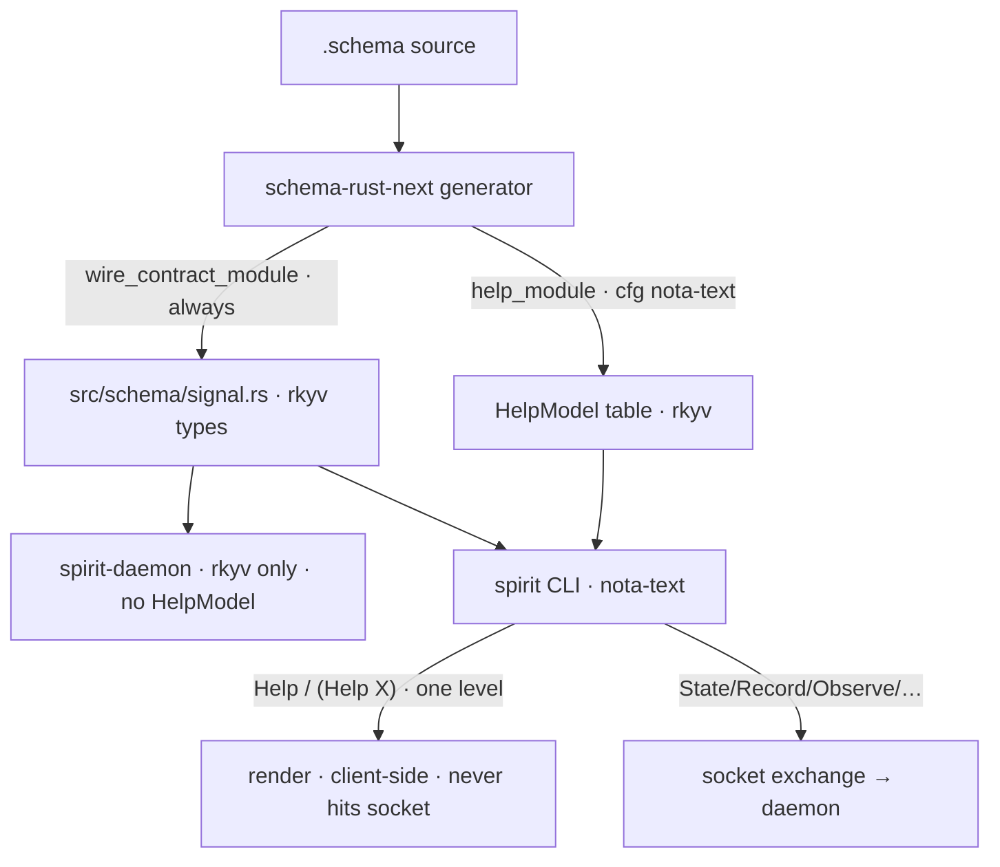

# Schema Help — the one-level navigable signature index

*schema-designer · report 1 · pairs with schema-operator's
`reports/schema-operator/1-schema-help-branch-set-research.md` · settled
intent: Spirit `6th4`*

The load-bearing claim, after the design exchange: **`(Help X)` renders
exactly one structural level of `X`, naming every child type rather than
inlining its definition. The reader recurses by *navigating* —
issuing `(Help child)` — not by the renderer transitively dumping.**
Scalar leaves surface at the newtype boundary, where help terminates as
`(Description String)`. This makes Help trivially total (no depth knob,
no cycle guard) and keeps every screen readable.

This supersedes an earlier draft of this report that proposed transitive
recurse-to-scalars with a visited-set guard. The psyche ruled out the
transitive dump; the one-level-navigable model below is simpler and
strictly better, and the cycle problem the guard was protecting against
**cannot arise** when each render is a single level.

## 1. The model

- **`(Help)`** (no argument) is a *signature index*: every top-level root
  (Input + Output), each rendered one level — its immediate argument
  shape with child types as names.
- **`(Help X)`** expands `X` by exactly one level. A child type appears as
  a **name at its use site**; its *definition* is one `(Help child)` away.
- The recursion in Spirit `6th4` ("recursively expands … until scalar
  leaves") is realised as this **navigation**: each step is one level,
  and a newtype field bottoms out one step down as `(Newtype Scalar)`.

So top-level help is *structurally complete* (every shape and every
child name is present somewhere) without becoming "a repeated transitive
dump of every nested type under every command."

## 2. Render rule, by type-kind

| Kind | Schema | `(Help X)` renders |
|---|---|---|
| **Scalar newtype** | `Description String` | `(Description String)` — the leaf |
| **Collection newtype** | `Domains (Vec Domain)` | `(Domains (Vec Domain))` — element is a *name* |
| **Struct** | `RecordRequest { Entry Justification }` | `(RecordRequest { Entry Justification })` — field **type-names** |
| **Enum** | `Kind [Decision Principle …]` | `(Kind [Decision Principle Correction Clarification Constraint])` |
| **Container** | `(Vec VerbatimQuote)` / `(Optional Antecedent)` | `(Vec VerbatimQuote)` / `(Optional Antecedent)` — element a name |
| **Root** | `Record RecordRequest` | `(Record { Entry Justification })` — payload's immediate shape |

Three things the table encodes:

- **Fields are newtypes, not `name : scalar` pairs.** Per the dimensional
  principle (Spirit `ov30`, newtype-per-role), a field's role *is* its
  type. A struct's help is its positional list of field **type-names** —
  `(Entry { Domains Kind Description Certainty Importance Privacy Referents })`,
  never `{ A String B Int }` (which is labeled, and not NOTA). The scalar
  appears only when you Help the newtype: `(Help Description)` →
  `(Description String)`.
- **A `Vec SomeThing` keeps `SomeThing` as a named reference** — shown at
  the use site, never inline-expanded. `(Help SomeThing)` expands it. This
  is the confirmed answer to the open question.
- **The root asymmetry is just payload-kind.** `Record`'s payload
  `RecordRequest` is a struct ⇒ `(Record { Entry Justification })`;
  `RecordAccepted`'s payload `RecordIdentifier` is a newtype ⇒
  `(RecordAccepted RecordIdentifier)`. Same rule, different child kind.

## 3. Worked navigation (real spirit types)

Every line below is one `(Help …)` call; each shows one level. Types are
verbatim from `signal-spirit/schema/signal.schema`.

```
(Help)                       ;; the signature index (excerpt)
  (Record { Entry Justification })
  (Observe Query)
  (RegisterReferent ReferentRegistration)
  (RecordAccepted RecordIdentifier)
  (Version)

(Help Record)                ;; root → payload's immediate shape
  (Record { Entry Justification })

(Help Entry)                 ;; struct → field type-names (all newtypes)
  (Entry { Domains Kind Description Certainty Importance Privacy Referents })

(Help Domains)               ;; collection newtype → element stays a name
  (Domains (Vec Domain))

(Help Description)           ;; scalar newtype → terminates at the leaf
  (Description String)

(Help Justification)
  (Justification { Testimony Reasoning })

(Help Testimony)             ;; Vec of a composite → element is a reference
  (Testimony (Vec VerbatimQuote))

(Help VerbatimQuote)         ;; struct; its second field is itself a newtype
  (VerbatimQuote { QuoteText OptionalAntecedent })

(Help OptionalAntecedent)
  (OptionalAntecedent (Optional Antecedent))

(Help QuoteText)
  (QuoteText String)
```

`Domain` is reached only as a name inside `(Vec Domain)`; `(Help Domain)`
then shows its enum one level — the big domain tree is *navigated*, never
dumped under `Record`.

## 4. Why this is trivially total

Because a single `(Help X)` only ever shows X's immediate children **as
names**, there is no transitive expansion within one render — so no
unbounded growth and no cycle is possible, for *any* schema, with **no
depth parameter and no visited-set**. The user's successive `(Help)`
calls are the recursion, and the user bounds them.

For the record, spirit's type graph is a finite **DAG** anyway: the
`opens` / `belongs` tokens on `SubscribeIntent` and `IntentEvent` are
**stream-membership annotations**, not structural payload edges
(`IntentEventStream`'s `event` slot points at `IntentEvent`, whose variant
payloads are `IntentRecorded { Entry RecordIdentifier }` etc. — no edge
back to the stream). So even a transitive renderer would terminate here;
the one-level model simply removes the question.

## 5. The datatype and how it is produced

A name-keyed table is still the right rkyv shape — and the one-level
renderer makes it even simpler (a single lookup + one level of child
names, no recursive walk):

```rust
// gated: present only under the text feature; daemon (rkyv-only) builds omit it.
#[cfg_attr(feature = "nota-text", derive(nota_next::NotaEncode))]
#[derive(rkyv::Archive, rkyv::Serialize, rkyv::Deserialize, Clone, Debug, PartialEq, Eq)]
pub struct HelpModel {
    roots: Roots,        // Input + Output variant names, declared order
    nodes: HelpNodes,    // type name -> HelpBody
}

#[derive(rkyv::Archive, rkyv::Serialize, rkyv::Deserialize, Clone, Debug, PartialEq, Eq)]
pub enum HelpBody {
    Scalar(ScalarKind),                      // (Description String)
    Newtype(TypeName),                       // RecordIdentifier -> String
    Struct(FieldTypes),                      // ordered Vec<TypeName> (newtype names)
    Enumeration(VariantNames),               // ordered Vec<TypeName>
    Container(ContainerKind, ElementTypes),  // (Vec Domain) / (Optional Antecedent)
}
```

**Recommended production path — runtime projection, not codegen.** The
design panel (3 approaches, judged) lands on building `HelpModel` *at CLI
runtime* by parsing the contract's already-embedded `*_SCHEMA_SOURCE`
(`SIGNAL_SCHEMA_SOURCE` is already `include_str!`'d; `schema-next` is
already a non-build dep of `spirit`) via
`schema_next::SchemaSource::from_schema_text`. Rationale: Help then
*literally is* the schema, parsed live — no generated literal to keep in
lockstep, drift impossible by construction, and the per-contract delta is
a ~6-line gated accessor, not a new crate / emission-target / proc-macro.
The reparse of ~250 lines happens only on the human-facing Help path
(microseconds, never the daemon or a hot path). It generalises to
`signal-mentci` with one identical accessor. The `HelpModel` types still
derive rkyv unconditionally, so a computed model is embeddable/
transmittable as bytes if a contract ever wants the pre-baked variant.

Two **code-grounded traps** the panel surfaced (carry into
implementation):

- **Use `from_schema_text`, not the resolver path.** An empty
  `ImportResolver` fails with `UnresolvedImportCrate`
  (`schema-next` `resolution.rs:233`). `from_schema_text` sidesteps it and
  leaves imported names (`Domain`) as **bare leaf atoms** — which is
  exactly the one-level output we want.
- **Project from the `Source*` AST.** `from_schema_text` yields the
  *source* family (`SourceRootEnum`, `SourceNamespace`, `SourceReference`,
  `SourceVariantPayload`), not the lowered `TypeReference` /
  `TypeDeclaration`. Write `impl From<&SourceReference>` for the leaf
  shape; classify scalar leaves (`String`/`Integer`/`Boolean`/`Path`/
  `Bytes`) by reserved-keyword as `schema-next`'s own `from_name` does, so
  they render as the scalar atom and stay distinct from declared types.
  Also verify the canonical container-head spelling against the **pinned**
  `schema-next` (the panel saw `Vector`/`Optional`/`ScopeOf`/`Map`/`Bytes`
  canonical at HEAD with `Vec`/`Option` possibly not parsing — yet
  `signal.schema` as pinned writes `(Vec Domain)`/`(Optional Antecedent)`;
  the render must echo whatever the pinned source actually uses).

- `HelpModel::render(query, …)` is a **method** (no free functions);
  `query` is `None ⇒ index` / `Some(TypeName)`. CLI intercept: a tiny
  `#[derive(NotaDecode)]` recognizer matches the `Help` atom / `(Help X)`
  **before** the socket connect — Help never becomes a daemon request.



## 6. Settled vs open

**Settled** (Spirit `6th4` + this exchange): recurse-as-navigation to
scalar leaves; struct fields are newtype names; `(Vec SomeThing)` keeps
`SomeThing` as a named reference; top-level `(Help)` is a one-level
signature index; Help is client-side, never a daemon request.

**Open** (my lane's recommendations in *italics*, schema-operator owns the
generation-mechanism + ops calls):

- Query payload (schema-op Q3): a single name. *Lean: optional `SymbolPath`.*
- `(Help Version)` — request shape only, or the command→reply channel
  relation `Version → VersionReported VersionReport`? *Lean: offer the
  channel relation for request roots; the signal channel is the
  meaningful unit, and the one-level model renders it as one more line.*
- `(Help)` index coverage — Input only, or Input + Output. *Lean: both.*
- Auto-add vs declared `Help` root (Q1), gate reuse (Q2), output noun (Q4),
  live-`spirit.sema` copy in tests (Q6), `nota-next` in the epic (Q7) —
  schema-operator's implementation calls; I align to whatever you pin.

## 7. POC — built, compiled, green

A self-contained POC lives at `reports/schema-designer/poc/` (source
only). It models the confirmed design exactly: a typed help data-tree
defined in Rust, **`(Help X)` resolves to an actualized `HelpTree` value**
(rkyv-serializable, not a string), which the CLI then renders; everything
is client-side and the renderer compiles out of the daemon build.

Both feature builds are green:

- `cargo test` (default = **daemon, rkyv-only**): 4 pass — including
  `actualized_help_tree_round_trips_through_rkyv` (the resolved typed tree
  serializes even on a build with no NOTA rendering) and
  `resolve_yields_a_typed_tree_not_a_string`. The `nota-text`-gated golden
  tests compile out (0 run), proving the daemon build carries no renderer.
- `cargo test --features nota-text` (**CLI build**): **15 golden render
  gates pass** + the 4 round-trips.

The demo (`cargo run --example demo --features nota-text`) reproduces the
navigation trace verbatim:

```
$ spirit Help
  (State Statement)
  (Record { Entry Justification })
  (Observe Query)
  (Version)
  (Marker)
  (RecordAccepted RecordIdentifier)
  (Proposed RecordIdentifier)

$ spirit "(Help Record)"             ->  (Record { Entry Justification })
$ spirit "(Help Entry)"              ->  (Entry { Domains Kind Description Certainty Importance Privacy Referents })
$ spirit "(Help Domains)"            ->  (Domains (Vec Domain))
$ spirit "(Help Description)"        ->  (Description String)
$ spirit "(Help Justification)"      ->  (Justification { Testimony Reasoning })
$ spirit "(Help Testimony)"          ->  (Testimony (Vec VerbatimQuote))
$ spirit "(Help VerbatimQuote)"      ->  (VerbatimQuote { QuoteText OptionalAntecedent })
$ spirit "(Help OptionalAntecedent)" ->  (OptionalAntecedent (Optional Antecedent))
$ spirit "(Help QuoteText)"          ->  (QuoteText String)
$ spirit "(Help RecordAccepted)"     ->  (RecordAccepted RecordIdentifier)
$ spirit "(Help Kind)"               ->  (Kind [Decision Principle Correction Clarification Constraint])
$ spirit "(Help DomainMatch)"        ->  (DomainMatch [Any (Partial DomainScopes) (Full DomainScopes)])
```

The POC stands in for the schema-rust-next projection with a hand-written
`generated.rs` describing a spirit subset; the real layer replaces that
one module with the `from_schema_text` parse (§5). The next step toward
the real pilot is replacing `generated.rs` with the live projection — on
the `schema-help-design` worktree, coordinated with schema-operator's
implementation track (report 2).
