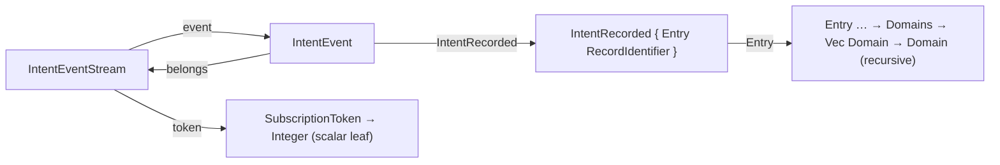
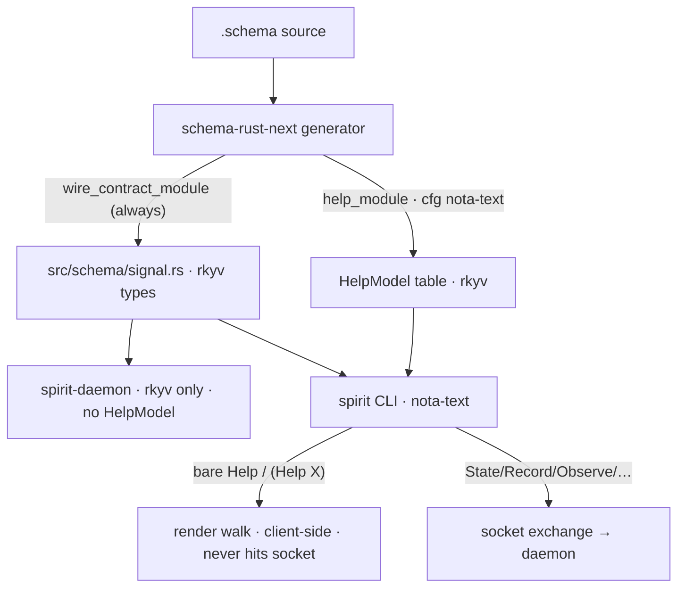

# Schema Help — the recursive structural spec

*schema-designer · report 1 · pairs with schema-operator's
`reports/schema-operator/1-schema-help-branch-set-research.md`*

The load-bearing claim: **Help is a recursive unfolding of the contract's
type graph, rendered as positional NOTA, that terminates at scalar
leaves OR at any type already shown on the walk.** The "one level"
form from the first framing (`(Record { Entry Justification })`) and the
"recurse until scalars" form are the *same* mechanism at two depths —
the special case dissolves into the normal case. The reason termination
must be by *visited-set*, not just "until scalars", is that the live
spirit schema is genuinely **cyclic**.

## 1. Where this sits (unchanged, confirmed)

- The compile-time gate already exists: `signal-spirit`'s **`nota-text`**
  feature. `default = []` ⇒ the daemon builds rkyv-only; the NOTA codec
  is `#[cfg_attr(feature = "nota-text", derive(NotaDecode, NotaEncode))]`.
  The help-spec rides this gate (or a finer one — open decision §7).
- The `.schema` source already *is* the help structure: `Record
  RecordRequest`, `RecordRequest { Entry Justification }`, `RecordAccepted
  RecordIdentifier`. The help datatype is a **projection of
  `schema-next`'s parsed `Schema` AST**, emitted by `schema-rust-next`
  under the gate.
- `Help` is resolved **client-side in the CLI**, never sent to the
  socket — daemons stay binary-only. Generic across contracts
  (`signal-mentci` has the identical gate + build dep).

## 2. The type-kind render grammar

Every declared type renders by its kind. This table is the whole spec:

| Schema kind | Source example | Help render |
|---|---|---|
| **Scalar leaf** (terminal) | `RecordIdentifier String` | `(RecordIdentifier String)` |
| **Newtype** over T | `Domains (Vec Domain)` | `(Domains (Vec Domain))` → unfolds into T |
| **Struct** (positional fields) | `RecordRequest { Entry Justification }` | `(RecordRequest { Entry Justification })` |
| **Enum** (variant list) | `DomainMatch [Any (Partial) (Full)]` | `(DomainMatch [Any Partial Full])` |
| **Container** application | `Testimony (Vec VerbatimQuote)` | `(Vec VerbatimQuote)` → element is a normal node |
| **Optional** | `(Optional Antecedent)` | `(Optional Antecedent)` |

The scalar terminal set is the schema built-ins: **`String`, `Integer`,
`Boolean`, `Path`, `Bytes`**. Everything else is a named node that
unfolds.

A **root** renders as `(RootName <body-of-its-payload>)`: the payload's
*immediate shape* is inlined. That is the entire reason the two original
examples look different —

- `Record`'s payload `RecordRequest` is a **struct** ⇒ inline its body
  ⇒ `(Record { Entry Justification })`.
- `RecordAccepted`'s payload `RecordIdentifier` is a **newtype/scalar**
  ⇒ show the reference name ⇒ `(RecordAccepted RecordIdentifier)`.

Same rule, different payload kind. No asymmetry in the mechanism.

## 3. The container element — answering "how do we deal with SomeThing"

A `(Vec SomeThing)`, `(Optional SomeThing)`, `(Map K V)` is **not a
terminal** — it is a structural *application*, and its element is just
another reference rendered by the same walk. So `Referents (Vec
Referent)` with `Referent String`:

- shallow: `(Referents (Vec Referent))`
- deep: `(Referents (Vec (Referent String)))` — the element unfolds to
  its scalar and terminates.

And `Domains (Vec Domain)` where `Domain` is the big domain enum: the
walk recurses into `Domain` **exactly once**, expands its variant tree,
and on any repeat or cycle prints the bare name. "SomeThing" needs no
special handling: it is a node; expand it once, memoized; bottom out at a
scalar or an already-seen name.

## 4. Why termination must be a visited-set (the cyclic landmine)

"Recurse until scalars" alone **does not terminate on the real spirit
schema.** Concrete cycle, straight from `schema/signal.schema`:

```
IntentEventStream  (Stream { token SubscriptionToken opened SubscriptionStarted
                             event IntentEvent close SubscriptionToken })
IntentEvent        [ (IntentRecorded IntentRecorded belongs IntentEventStream)
                     (IntentClarified ...) ... ]
```

`IntentEventStream.event` is `IntentEvent`; every `IntentEvent` variant
`belongs IntentEventStream`. That is a literal `A → B → A` cycle — a
scalar-only stop condition loops forever. Independently, dozens of types
**repeat** (`Justification`, `Entry`, `Magnitude`, `RecordIdentifier`
appear under many parents), so even the acyclic parts would render
redundantly.

**The rule:** recurse until **(a)** a scalar terminal, **or (b)** a type
already expanded on this walk — then print the bare type name, which the
reader can `(Help ThatType)` to expand on its own. That bare-name stop is
exactly "structurally, not redundantly" generalised to arbitrary depth.



The second time the walk reaches `IntentEventStream`, it stops at the
name. The type *graph* is finite; only a naive *unfolding* is infinite.

## 5. The depth knob reconciles both framings

`render(typeRef, visited, depth)`:

- scalar built-in → the scalar name (`String`, `Integer`)
- `typeRef ∈ visited` **or** `depth == 0` → the bare `typeRef` name (opaque, independently Help-able)
- else mark visited, look up the declaration, and by kind: struct → `(Name { field-renders })`, enum → `(Name [variant-renders])`, newtype → `(Name <render(inner)>)`, container application → `(Vec <render(element)>)`.

- **depth 1** = the immediate-shape view from the first framing:
  `(Record { Entry Justification })`, `(RecordAccepted RecordIdentifier)`.
- **uncapped** (default) = recurse to scalars, memoised:
  `(Record { (Entry { Topics Kind Summary Context Certainty Quote })
  (Justification { (Testimony (Vec (VerbatimQuote { (QuoteText String)
  (OptionalAntecedent (Optional Antecedent)) }))) (Reasoning String) }) })`,
  and `(RecordAccepted (RecordIdentifier String))`.

One structure, one walk, a single integer chooses the view.

## 6. The datatype — a name-keyed table, not a nested value

The rkyv form should **not** be a deeply nested recursive value (a cyclic
schema cannot be a finite nested literal). It is a **flat table keyed by
type name**, mirroring how `schema-next`'s registry already keys
declarations. Each entry is a closed enum over the kinds:

```rust
// gated: present only under the text feature; daemon builds omit it entirely.
#[cfg_attr(feature = "nota-text", derive(nota_next::NotaEncode))]
#[derive(rkyv::Archive, rkyv::Serialize, rkyv::Deserialize, Clone, Debug, PartialEq, Eq)]
pub struct HelpModel {
    roots: Roots,          // the Input + Output variant names, in declared order
    nodes: HelpNodes,      // every declared type name -> HelpBody
}

#[derive(rkyv::Archive, rkyv::Serialize, rkyv::Deserialize, Clone, Debug, PartialEq, Eq)]
pub enum HelpBody {
    Scalar(ScalarKind),                 // String | Integer | Boolean | Path | Bytes
    Newtype(TypeName),                  // RecordIdentifier -> String ; Domains -> (Vec Domain)
    Struct(FieldTypes),                 // ordered Vec<TypeName>
    Enumeration(VariantArms),           // ordered Vec<VariantArm>
    Container(ContainerKind, ElementTypes), // Vec | Optional | Map + element refs
}
```

- **Finite** even for the cyclic schema (the graph is finite).
- **rkyv-clean**: a flat map, no recursive `Box` gymnastics; round-trips
  in the daemon build (no nota-text) so the same artifact is shared.
- Every named type is **independently** `(Help X)`-able by direct key
  lookup.
- Rendering is a **method on `HelpModel`** (no free functions):
  `fn render(&self, query: HelpQuery, depth: Depth) -> HelpText`, walking
  `nodes` from the query root with a visited-set. `HelpQuery` is
  `None ⇒ all roots` / `Some(TypeName)`.

Generation: a new `ModuleEmission::help_module(...)` in `schema-rust-next`
walks the parsed `Schema` (the same AST it lowers to Rust), emits the
`HelpModel` builder gated behind `nota-text`. Daemon builds never see it.



## 7. Open decisions for the psyche

Folding in schema-operator's seven questions; these are the ones the
*structural model* turns on (my lane), with my lean first:

1. **Default depth** — uncapped recurse-to-scalars (memoised) as default,
   with `(Help X)` honoring an optional depth; or depth-1 default with an
   explicit "deep" form? *Lean: uncapped-memoised default.*
2. **Newtype at a leaf** — unfold one step to the scalar
   `(RecordIdentifier String)`, or stop at the name `RecordIdentifier`?
   *Lean: unfold — it is one cheap step and shows the actual wire scalar.*
3. **Help coverage** — Input roots only, or Input + Output + all
   declarations reachable? *Lean: all roots (Input+Output) listed by
   bare `Help`; any declared type reachable by `(Help X)`.*
4. **Query payload type** (schema-operator Q3) — the recursion model
   wants a plain **`TypeName`/`SymbolPath`** (a single name to look up),
   not a bespoke per-root path type. *Lean: optional `SymbolPath`.*
5. **Root vs channel** (schema-operator Q5) — should `(Help Version)`
   show only the request shape, or the **command→reply** relation
   `Version -> VersionReported VersionReport`? The schema pairs them; I
   think a root's help should be able to show its paired reply, because
   the signal *channel* is the meaningful unit. *Lean: show the channel
   relation for request roots.*
6. **Auto-add vs declared** (schema-operator Q1) / **gate** (Q2) /
   **output noun** (Q4) / **test-db copy** (Q6) / **nota-next in the epic**
   (Q7) — these are generation-mechanism + naming + ops decisions;
   schema-operator owns the implementation call, I'll align the model to
   whatever you pin.

## 8. POC status

The background research built a compiling one-level baseline POC
(datatype + nota-text-gated render + rkyv round-trip). It now needs
extending to the **recursive, visited-set** walk above and a test that
exercises the `IntentEventStream` cycle (proving termination). I'll land
that as the demonstrable POC — real `cargo test` output for both the
daemon (rkyv-only) and CLI (nota-text) builds — on the `schema-help-design`
worktree branch, and report the captured output here.
