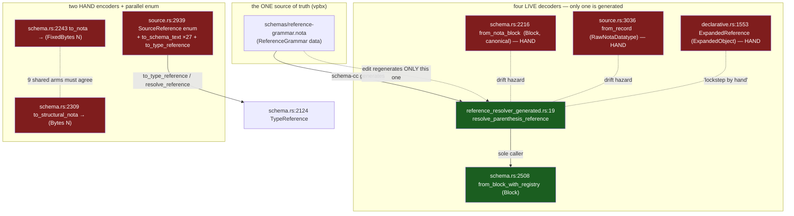
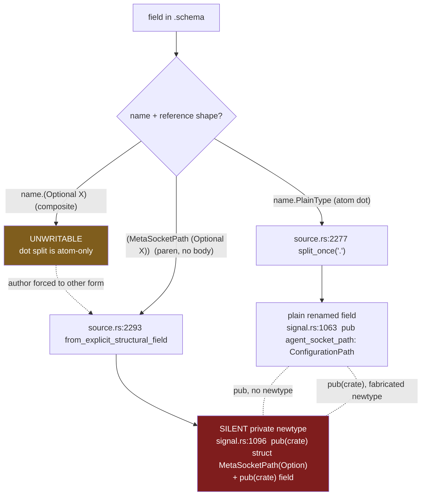

# Schema-stack audit — representation, parsing/emission, and hygiene

*schema-designer · report 14 · a full-stack design audit of the schema
toolchain (nota-next, schema-next, schema-rust-next, signal-spirit,
meta-signal-spirit, spirit) for missed opportunities, repetition, and
hard-to-reason-about design, graded against governing Spirit intent. Answers
the psyche's audit order; the convergent one-IR target it points to is
developed jointly with operator (report 15, operator report 13).*

## Spirit gate

No capture — a task-only audit order. The lens the psyche set ([anything hard
to reason about is a red flag]) is the workspace's standing legibility value
(`ESSENCE.md`), not a new durable record; it became the audit's complexity
dimension rather than a Spirit write.

## Method

A multi-agent sweep, grounded first in the governing Spirit records and each
repo's `INTENT.md`/`ARCHITECTURE.md` so findings are graded against actual
discipline, not generic taste:

- **Map** — eight deep readers, one per subsystem, returned a component map plus
  raw smells (205 gathered).
- **Audit** — seven dimensional finders (hand-parsing/emission,
  representation-duplication, complexity, repetition/stale/dead,
  grammar/contract inconsistency, missed-opportunity/abstraction,
  rust-discipline/boundary) produced **57 raw findings**, each cited to file:line
  and to the intent record or skill it tensions with.
- **Verify** — every finding went to an adversarial verifier instructed to
  *refute* it against the cited code. **48 survived, 9 were refuted**; several
  claimed *critical*/*major* severities were corrected down where the code
  showed latent-drift-hazard rather than an active fault. Where the verifier
  caught an auditor overstating ("already diverged", "won't compile"), the
  consolidation below uses the corrected reading.

The honest headline: the stack's *intent* — one authored NOTA grammar, one
structural-macro-node codec, one semantic IR lowered to Rust (`6grf`, `7c71`,
`ycmd`) — is right and partly realised, but the **reference-type vocabulary and
its codecs are hand-duplicated across four-plus surfaces and three-to-four input
representations**, and that single fact accounts for roughly a third of the
findings seen through different lenses. Theme H records what is already clean so
no later pass re-spends severity on it.

The nine refuted findings (recorded so they are not re-raised): the
"FixedBytes round-trips wrong" / "three codecs already diverged" claims (the
two spellings are deliberate and each round-trips under its own test); "a fourth
RawNotaDatatype clone of nota_next::Block is redundant" (it is the source
archive tree, a real layer); "Source\* AST is dead transitional" (load-bearing
for imports/roots/help); "SchemaError 57-variant enum is too broad" (one typed
per-crate error is correct); "RustIdentifier reimplements Name" (different
target alphabet); "schema-cc is data-as-grammar in name only" (true but reframed
as a missed-opportunity, Theme A); "Visibility should be a boolean" (the enum is
the right typed-role shape).

## Consolidated audit: schema-stack representation, parsing/emission, and hygiene

This consolidates 41 verified findings (adversarially confirmed and re-graded against the code) into eight themes. The headline: the stack's *intent* — one authored NOTA grammar, one structural-macro-node codec, one semantic IR lowered to Rust (6grf, 7c71, ycmd) — is right and partly realized, but the **reference-type vocabulary and its codecs are hand-duplicated across four-plus surfaces and three-to-four input representations**, and that single underlying fact accounts for roughly a third of the findings seen through different lenses. Most of what the adversarial pass *down-graded* was over-claimed "active bug / already diverged" framing; the genuine, repeated defect is latent drift and reasoning-load, not present miscompilation. The audit is honest about that, and Theme H records what is already clean so no one re-spends severity on it.

### Severity-ranked consolidated issues

| Sev | Theme | One-line | Key site | Intent tension |
|---|---|---|---|---|
| major | A reference-codec duplication | One reference grammar/vocabulary hand-coded across 4 live decoders + 2 encoders + a parallel `SourceReference` enum; only one path is grammar-generated | `schema.rs:2216`, `source.rs:3036`, `declarative.rs:1553`, `reference_resolver_generated.rs:19` | 6grf, 7c71, vpbx, ycmd |
| major | B god-files | `schema-rust-next/src/lib.rs` 7788 lines / ~2000-line `RustModuleRenderer`; `source.rs` 3680 lines, four concerns, no module boundary | `lib.rs:5524`, `source.rs:1-3680` | crate-layout.md, ARCHITECTURE.md |
| major | C hand-parsing above the raw parser | Macro library + variant payloads are hand recursions / empty-`structural_variants()` shells at the exact site v0n6 names | `declarative.rs:415`, `source.rs:2859` | v0n6, xai7, 7c71 |
| major | D Help reads unresolved source AST | Help built from `SchemaSource`, hand-rolls one-level resolution, header falsely calls it "the SAME resolved IR" | `help.rs:5`, `help.rs:274` | 6cfr, 6th4 |
| major | E dot-prefix grammar inconsistency | Dot differentiator names only `Plain`; composites forced into a second form that silently fabricates a private newtype | `source.rs:2277`, `signal.rs:1096` | a5tg/ov30, report 646 §4 |
| major | F stale-alias hole | Retired `(Vec ...)` parses as a generic `Application`; contract comment claims it "no longer parse[s]" — false | `meta-signal.schema:31`, `schema.rs:2107` | iypq, 3don-spirit |
| minor | A′ 27 hand-written `to_schema_text` printers | Structure assembly hand-spelled per method where a derive exists in-crate | `source.rs:3085` + 26 more | ycmd, v0n6 |
| minor | A′ scalar vocabulary scattered | `String/Integer/Boolean/Path/Bytes` re-spelled at ~9 sites, no table | `schema.rs:2180,2246,…` | iypq |
| minor | A′ flat pair-map hand-parsed | `{}` body / even-count / `chunks_exact(2)` at ~7 sites where a map codec exists | `schema.rs:1696`, `source.rs:1902` | v0n6, ycmd |
| minor | A′ optional-leaf emitter | `RustOptionalEnumNotaTokens` hand-spells codec; derive cannot express the sigil-free shape yet | `schema-rust-next/lib.rs:4802` | v0n6, ycmd |
| minor | A′ two `SourceReference→TypeReference` lowerings | `to_type_reference` vs `resolve_reference` differ only in leaf scoping | `source.rs:3150`, `source.rs:3184` | 58bv, 6grf |
| minor | F′ migration.rs 4th `TypeReference→Rust` renderer | Self-contained pilot; `HashMap`/`i64`/`String` diverge from canonical emitter | `migration.rs:465` | 58bv |
| minor | F′ live `format!` Rust-type renderer + reparse bridge | `rust_type` builds Rust as string then `syn::parse_str`s it back; INTENT claims string-emission is gone | `lib.rs:7692` | ycmd |
| minor | E′ field grammar decoded twice | `SourceField` vs `MacroExpansionField` drift risk (predicates copied, not shared) | `source.rs:2259`, `declarative.rs:1768` | 58bv, v0n6 |
| minor | C′ plane projection by type-name strings + 4 emit-panics | Cross-plane wiring keyed on emitted Rust names; scope-relation path panics instead of `SchemaError` | `lib.rs:6807`, `lib.rs:4164` | vpbx, typed-Error |
| minor | B′ derive shape taxonomy | 7 shape kinds × 6-7 methods, 3 `unreachable!()` arms standing in for unrepresentable states | `derive/src/lib.rs:1206` | abstractions.md |
| minor | G three parallel reference enums | nota-next / schema-next / `SourceReference` re-encode container vocab (dependency-direction-constrained) | `instance_schema.rs:27`, `schema.rs:2124` | 6grf |
| minor | G PascalCase case-conversion ×3 | Same word-boundary walk hand-rolled in three crates; primitive belongs in nota-next seed | `schema.rs:50`, `grammar.rs:75`, `lib.rs:2294` | — |
| minor | G Help collection wrappers / name-indexed find | 2-3 `Vec<T>` wrappers re-implement linear find-by-name; recurs in schema-next | `help.rs:336,402` | — |
| minor | I `Schema::new` reassembly ×3 | 9-arg positional rebuild open-coded; `into_schema` drops relations **and** `impl_blocks` | `upgrade.rs:323,397,551` | — (latent correctness edge) |
| minor | I stale "assembled schema" wording | Doc comments / test name still center the removed Asschema IR | `schema.rs:2794`, `lib.rs:5283` | 6cfr |
| nit | I `-next` generator name in 92 generated headers | `generator_name: "schema-rust-next"` stamped per file | `lib.rs:69,78,469` | ctkv |
| nit | E′ emitter writes retired `*`, parser rejects it | `SourceFieldValue::to_schema_text` Derived arm; test-covered, never on a real round-trip | `source.rs:2454` | a5tg, 646 §4 |
| nit | A′ lossy `FixedBytes` width parse | `.parse::<u64>().ok()` discards `ParseIntError`; helper exists | `schema.rs:2226` | errors.md |
| nit | C′ daemon_emit large `to_tokens` | Cosmetic; the recommended `DaemonTopology`/dedup already exist | `daemon_emit.rs:522` | — |
| good | H feature-gate boundary, methods-only, rkyv, typed errors | t4gd/bkcd hold end-to-end; no free fns/ZST namespaces; `omit_bounds` sound | `lib.rs:908`, `engine.rs:50` | t4gd, bkcd |

A near-tie of cross-referenced findings — `parsing-emission#2/5/6`, `representation-duplication#2/5`, `complexity#2/8`, `repetition-stale-dead#2`, `missed-opportunity#2/5`, `rust-discipline#1/2` — all reduce to **Theme A**: one reference vocabulary, many hand copies. They are counted once below.

### Theme A — the reference-type codec is hand-duplicated across surfaces and representations (major)

**What it is.** A `(Vector T)`, `(Optional T)`, `(Map K V)`, `(ScopeOf S T)`, `(Bytes N)`, scalar-leaf, `Application` vocabulary is the spine of the schema language. The stack realizes it as *data* in exactly one place — `schemas/reference-grammar.nota` decodes into `ReferenceGrammar` and schema-cc generates `TypeReference::resolve_parenthesis_reference` (`reference_resolver_generated.rs:19-56`), which `from_block_with_registry` (`schema.rs:2508`) is the *sole* caller of. Everywhere else the same precedence ladder, the same head/arity table, and the same scalar set are hand-written.

**Why it is hard to reason about.** The one precedence ladder is hand-re-coded over four *different* input representations, none routing through the generated resolver:

- `schema.rs:2216-2239` — `NotaDecode::from_nota_block` over nota-next `Block` (the canonical machine codec; live via `StructFieldMap::from_nota_block` at `:1711`).
- `source.rs:3036-3055` — `SourceReference::from_record` over `RawNotaDatatype` (schema-next's source archive tree).
- `declarative.rs:1553-1592` — `ExpandedReference::type_reference` over `ExpandedObject`, documented at `:1536` as "kept in lockstep by hand" — the fourth copy the original audit missed.
- the generated resolver over `Block`.

Editing `reference-grammar.nota` regenerates one of four. The four currently **agree** — so this is latent drift, not an active fault (this is why the adversarial pass corrected the claimed *critical* to *major*) — but every future built-in head or arity change is a four-site edit kept correct by discipline alone.

On top of the decoders sit two hand-written **encoders** for `TypeReference` — `to_nota` (`schema.rs:2243`) and `to_structural_nota` (`schema.rs:2309`) — plus a near-twin enum `SourceReference` (`source.rs:2939`) carrying its own `to_schema_text`/`derived_field_name`/`to_type_reference`, and **27 `to_schema_text` printers** in `source.rs` (43 hand-written NOTA printers crate-wide). The `to_nota`/`to_structural_nota` split spells the fixed-byte leaf two ways — `(FixedBytes N)` canonically, `(Bytes N)` structurally. The audit must be precise here: **this is not the drift bug it was repeatedly claimed to be.** Both spellings are deliberate, documented (`schema.rs:2269-2277`), and each round-trips byte-identically under its own test (`tests/typeref_structural_macro.rs:41`, `tests/generics.rs:95`). The genuine residue is that *two hand encoders over one enum must agree on the nine shared arms* and *the canonical decoder is hand-written while the source decoder is generated* — a single-source-of-truth gap, not a correctness defect.

The scalar vocabulary `String/Integer/Boolean/Path/Bytes` is the same story in miniature: re-spelled at ~9 sites (`schema.rs:2180,2246,2311,2360,2372,2378` + `source.rs:2348,3117`), with no central table (iypq says the vocabulary lives in Schema — it does, but as scattered literals). `ReferenceHead::node_arity` (`schema.rs:2168`) exists as the aspirational table and has **zero callers** — a dead hook toward the consolidation that never landed.

**Best target shape (no back-compat).** One reference type through the pipeline with one generated codec:

1. Make the schema-cc-generated resolver the single reference *decoder*; route `from_nota_block`, `SourceReference::from_record`, and `ExpandedReference::type_reference` through one shared trait over their respective trees, or — where a tree genuinely cannot share the `Block` resolver — through the one `ReferenceHead`/`node_arity` table. Delete the three hand ladders.
2. Drive both encoders from the `#[derive(StructuralMacroNode)]` per-variant `#[shape(...)]` already used in-crate (`FixedBytesNode` at `schema.rs:2015`); keep the canonical-vs-source distinction as *two declared shapes*, not two hand `format!` matches.
3. Promote the scalar set to one `Scalar` enum with `name()`/`from_name()` that every codec, predicate, and `derived_field_name` reads; delete `node_arity`'s dead twin or wire it.
4. The `SourceReference → TypeReference` bridge becomes one `lower(resolve_leaf)` parameterized by leaf strategy (`to_type_reference` passes `from_name`; the resolver passes `visible_name`), covering both the `Plain` leaf **and** the `Application` head. Per the adversarial correction, the source/semantic *split* is intentional layering (pre- vs post-import-resolution, different parse-input types) and stays; only the duplicated variant set, codec bodies, and vocabulary collapse.

This is 6grf/7c71/ycmd/vpbx: the grammar is the type, the type is the reader, the codec emits from schema, and the compiler definition is data — realized for *all* reference paths, not one.

### Theme B — god-files (major)

`schema-rust-next/src/lib.rs` is **7788 lines**, 91 structs, 121 impl blocks, no internal module boundary. `RustModuleRenderer` (`:5524`) is a ~2000-line god-struct (113 methods, ~25-34 schema-analysis predicates like `emits_*`/`has_type`/`root_enum_named`/`sema_*_root` interleaved with `emit_*` token routers) threading schema interpretation, plane selection, and emission ordering through one mutable `output: String` + three note-vectors. ARCHITECTURE.md's claim that "cross-object emission logic is named rather than smeared across a god-struct" is half-true — the 45 `*Tokens` nouns are genuinely extracted — but the renderer itself *is* the god-struct. `crate-layout.md` ("one concern per file"; split past ~300 lines) is violated ~25×.

`schema-next/src/source.rs` is **3680 lines**, 31 public types, 52 impls, four concerns in one scroll: (a) source AST + `from_block`/`to_schema_text` codec, (b) resolution (`SourceTypeResolver`/`SourceVariantResolver`), (c) the stateful `SourceNamespaceWalk` cursor, (d) lowering accumulators (`SourceLoweredNamespace`/`SourceDeclarationGroup`). No reader holds the source-codec boundary in their head.

**Best target shape.** For `lib.rs`: a `rust_model` module (the `*Tokens` nouns + data model), a `render` module (section drivers), a `plane` module (all plane/projection/role-trait logic), and — the high-leverage move — extract the ~30 schema-analysis predicates onto a `SchemaShape`/`SchemaPresence` query type built **once** from the schema, so the renderer becomes a pure token-router over a precomputed shape instead of re-deriving schema facts at render time. For `source.rs`: split per major subsystem (resolver, namespace-walk, lowering accumulators move first — they are the least entangled; note lowering is *partly* interleaved into AST body types like `SourceEnumBody::to_declaration_group`, so it does not extract cleanly). Per crate-layout.md, keep each type's impls beside the type; the split is by subsystem, not codec-vs-ast. Much of `source.rs` is downstream of Theme A — derive the codecs first and the residual shrinks before you split.

### Theme C — hand-parsing above the raw parser, at the site v0n6 names (major)

v0n6 names the schema-next macro library *by name* as a hand-parsing site to fix. The code shows exactly that:

- `MacroPatternObject::from_block` / `MacroTemplateObject::from_block` (`declarative.rs:415`, `:813`) are near-identical recursive NOTA decoders (`demote_to_string` → capture-sigil → `match Block::{Delimited,PipeText,Atom}` with `unreachable!()` on `Atom`); `matches_block` (`:461`) re-implements nota-next's `PatternElement::match_block`; `to_source_notation` (`:503`, `:893`) are hand NOTA printers. nota-next *already owns* `Pattern`/`PatternElement`/`MacroDelimiter`/`match_block` (`macros.rs`) — schema-next even re-declares its own `MacroDelimiter` (`declarative.rs:1002`). The `StructuralMacroNode` impls here are shells: `from_structural_block` delegates to the hand `from_block`, `structural_variants()` returns empty. The trait is present in name; the engine is re-implemented underneath.
- `SourceVariantPayload`'s `StructuralMacroNode` impl (`source.rs:2859`) returns `structural_variants() -> Vec::new()` then does try/`Err(_)`-fallthrough dispatch (`SourceReference::from_block` else `SourceDeclarationValue::from_block`) — the opposite of xai7's ordered first-match. Honesty correction: `structural_variants()` has **zero callers** for hand-written impls (only the *derive* consults it), so the empty return is advisory dead metadata, not a defeated dispatch list. And the try/catch is not lazy — `Reference` and `Declaration` *overlap* (`SourceDeclarationValue` already contains `Reference`; a bare atom is both), so a `StructuralVariantSet` would be rejected by `validate_no_silent_conflicts`. This is exactly the case v0n6 says to **surface to the psyche**, not the case to mechanically derive.

**Best target shape.** Express `MacroPattern`/`MacroTemplate` as one `SigilMirrored` structural form (capture / rest-capture / atom / delimited-children) with a single derive-backed codec — the pattern/template distinction becomes what they *do* with captures (match vs substitute), removing both `from_block` copies and both printers. For `SourceVariantPayload`, the genuine overlap is the signal: surface the unrepresentable-shape to the psyche per v0n6 rather than dressing a hand match as a structural node. (`complexity#5` and `complexity#7` are this theme; both correctly minor.)

### Theme D — Help carries the unresolved source AST and re-implements resolution by hand (major)

`HelpModel` is built from `SchemaSource` (`help.rs:163-168`) and stores `SourceDeclarationValue` bodies — the authored AST, never lowered through `SchemaEngine`. The module header (`help.rs:5`) calls this "the SAME resolved IR that instance-schema rendering and Rust lowering read." It is not: Rust lowering reads the *resolved* `Schema` (schema-rust-next `lib.rs:181` calls `lower_schema_source_with_resolver` first), and the proof Help is unresolved is `body_for_root_node` (`help.rs:274-287`), which hand-rolls one level of name lookup because the source AST has no resolution — deeper chains are not followed. The header even documents that the deleted `HelpBody`/`HelpTypeExpression` fork "is exactly where the `Vec`/`Vector` spelling escaped" — representation duplication that already shipped a bug. The latest commit message claims "collapse Help onto the resolved schema IR"; the code still reads `SchemaSource`, so the comment is now stale.

This is genuine but contained (one internal consumer, one-level resolution covers current targets) — leaning low-major because of the false invariant-claiming comment plus resolution re-implemented at the wrong layer.

**Best target shape (6cfr/6th4).** Build Help from the semantic `Schema`; `body_for_root_node` and the hand resolution vanish because `resolved_imports` already did the work. If Help reads source only to get canonical `.schema` *text* (which `Schema` lacks), close *that* gap — give the semantic `Schema` the text projection (Theme A's single reference encoder) — rather than keeping an unresolved parallel tree to obtain text. Then the header comment becomes true, and `HelpEntry`'s public `body: Option<SourceDeclarationValue>` (`grammar-contract#5`) stops leaking schema-next *source* nouns onto a peer/client wire surface.

### Theme E — dot-prefix grammar inconsistency (major), the slice already planned

Report 646 §4 settled **one** explicit-name escape hatch: `key.TypeReference`, dot, name-first. The implementation applies the dot split only to a bare **atom** (`source.rs:2277` `atom.0.split_once('.')`; `declarative.rs:1793`). A composite like `(Optional ConfigurationPath)` is a parenthesis, so `meta_socket_path.(Optional ConfigurationPath)` is **unwritable**. `signal.schema` is therefore forced into the *other* form for every named composite — `(MetaSocketPath (Optional ConfigurationPath))` — and that form is not a rename: `from_explicit_structural_field` (`source.rs:2293` → `to_lowered_field:2370`) lowers it to a **private inline newtype**: `signal.rs:1096` `pub(crate) struct MetaSocketPath(Option<ConfigurationPath>)`, where the dot form (`agent_socket_path.ConfigurationPath`) yields a plain `pub` renamed field (`signal.rs:1063`). Two visually similar forms, **different generated types *and* different visibility** (`pub` vs `pub(crate)`), and the cleaner one is unavailable exactly where naming is most needed (composites *are* collections per ov30/a5tg). The principle quote the finding labels `a5tg` is actually under record **ov30** (646 §5) — same text, corrected id.

**Best target shape.** Parse `name.<reference>` where `<reference>` may be a following parenthesized composite, making the dot form the single explicit-name mechanism for Plain *and* composite. Retire the bodyless `(Name composite)` field form (keep parenthesized only for genuine inline declarations *with a body*, per 646's own §4 intent). A named composite field is one renamed field, never a silently-spawned newtype unless the author writes a block body.

**Pairing.** This is the already-planned dot-prefix slice. It pairs directly with Theme A: the dot form's right-hand side must accept a composite *reference*, which is exactly the one reference type/encoder Theme A establishes — do A's reference-type unification first or jointly, or the dot-composite parse re-touches the same hand ladders. The drifted field-decoder pair (`SourceField` vs `MacroExpansionField`, `grammar-contract#2`, minor) folds in here: collapse to one field decoder so the dot-split / is-type / reserved-scalar predicates live in one place. (The original "same `.schema` parses in one, errors in the other" claim was refuted — both reject the lowercase-headed pair, differing only in error *variant* — so this rides as a minor consolidation, not a correctness fix.)

### Theme F — stale-alias hole and the `-next` rename (major + cleanups)

`meta-signal.schema:31` declares `ImportedRecords (Vec ImportedRecord)`. The `TypeReference` doc comment (`schema.rs:2107`) asserts the aliases "Vec, Option, Scope, KeyValue are gone and no longer parse." **They parse.** `Vec` is not in `ReferenceHead::classify`, so it skips the built-in arms, skips the retired-head guard (`source.rs:3047`, which only fires for heads `classify()` recognizes), and falls into the `Application` catch-all (`source.rs:3066`) → `Application { head: Vec, arguments: [ImportedRecord] }` → `pub struct ImportedRecords(Vec<ImportedRecord>)`, which compiles only because `Vec` is a real Rust generic. The single instance is benign; the structural hole is not — **any** typo'd or stale PascalCase head silently becomes unchecked Rust instead of a typed error, and a shipped contract carries a false invariant. This tensions iypq (Vector canonical, Vec is drift) and its own comment.

**Fix.** (1) `meta-signal.schema:31` → `(Vector ImportedRecord)`. (2) Make retired aliases (`Vec`/`Option`/`Scope`/`KeyValue`) an explicit `RetiredReferenceHead` reject in head dispatch, so a stale alias fails loudly and the comment becomes true.

The `-next` rename (ctkv, High, unfulfilled) rides nearby: `RustEmitter` hardcodes `generator_name: "schema-rust-next"` (`lib.rs:69,78`), stamped `// @generated by schema-rust-next` into **92** committed files (`repetition-stale-dead#1` / `rust-discipline#7`; corrected down from the claimed "14k/thousands of lines" — it is one header line per file). One constant, plus `build.rs:536` and `migration.rs:90` literals, flipped with the crate rename and one regeneration pass. Two `format!`-string Rust-type renderers contradict an absolutist INTENT sentence and are genuine cleanup, not breakage: `migration.rs`'s `TypeRenderer` (a 4th `TypeReference→Rust` projection, `HashMap`/`i64`/`String` vs the canonical `BTreeMap`/`Integer`/`Path`) is a **self-contained, test-passing pilot** not wired into the driver, so the "won't type-check / won't round-trip" headline was refuted — fold it into the canonical `RustTypeReferenceTokens` *when the pilot graduates*. The live `rust_type` + `RustTypeTokens(&str)` reparse bridge (`lib.rs:7692`) *does* falsify INTENT's "no `format!`-built Rust" claim — soften the absolutist sentence and delete the redundant confined renderer, feeding `RustTypeReferenceTokens` directly at its three call sites.

### Theme G — missed shared abstractions (minor)

Three small primitives are hand-rolled where one shared owner would do:

- **Three reference enums** (nota-next `instance_schema::TypeReference`, schema-next semantic `TypeReference`, source `SourceReference`) re-encode the container vocabulary. Constraint the audit must respect: nota-next does **not** depend on schema-next, so the instance-schema enum *cannot* be the report-6 reflection or a wrapper around schema-next's enum — that inverts the dependency. The source-vs-semantic split is also a deliberate pre/post-resolution boundary. So the *headline* collapse is foreclosed; the real residue is shared with Theme A.
- **PascalCase boundary conversion** hand-rolled three times (`schema.rs:50` snake, `grammar.rs:75` snake, `lib.rs:2294` SCREAMING) — the same word-boundary walk parameterized only by per-segment case. The schema-cc copy is *forced* by the dependency cut, which is the signal: the splitter belongs in nota-next (the seed all three reach). One walk, three thin case-mappers.
- **Name-indexed collections**: `HelpRoots`/`HelpNodes` re-implement linear `find(name)` (`HelpEntries` is a result wrapper, not a query collection — finding corrected); the same shape recurs in schema-next's `type_named`. A `Named` trait + `ByName<T>` covers all.

The derive shape taxonomy (`complexity#6`, minor) belongs here too: 7 flat shape kinds × 6-7 methods with 3 `unreachable!()` arms standing in for unrepresentable states. Decompose into orthogonal head-descriptor × body-descriptor axes; each method matches two axes instead of a 7-name cross-product, and the `unreachable!()` arms become real branches.

### Theme H — what is genuinely good (honest ledger)

The audit is not all-negative, and these are recorded so no later pass spends severity on them:

- **Feature-gate boundary holds end-to-end (t4gd/bkcd).** `NotaSurface` is a correct three-state emitter control; gated items get `#[cfg(feature = "nota-text")]`, gated derives get `#[cfg_attr(...)]`; consumers gate even the `pub use nota_next::...` re-exports, and `default = []` with `optional = true` means the daemon-default build links **zero** NOTA code. The `domain.rs` Software match block is emitter output, fully gated — not hand-written.
- **Help is now codec-driven.** The duplicate `HelpBody`/`HelpTypeExpression` fork was deleted; Help shares schema-next's one declaration text codec (report 7). The *remaining* defect (Theme D) is reading the *source* IR, not a second codec.
- **Methods-only discipline holds.** Zero column-0 free functions across nota-next/schema-next/schema-rust-next/signal-spirit; no ZST namespaces (`TcpListenerTier` is a legitimate domain marker).
- **rkyv is sound.** Every recursive `Box`/`Vec` reference field carries `#[rkyv(omit_bounds)]` with the full bytecheck/serialize/deserialize triad; the cycle is documented (`resolution.rs:90`).
- **Typed per-crate errors.** `SchemaError` via `thiserror` with `#[from]` on upstream nota errors; `RustIdentifier::verify` is the right pre-check-don't-panic pattern. (nota-next's `MacroError`/`StructuralVariantError` twins hand-roll `Display` and should collapse to one `VariantDispatchError` — minor, and the only error-style inconsistency.)
- The `daemon_emit.rs` "cartesian-conditional" alarm was **refuted**: `NexusDaemonShape` already centralizes the topology, bodies are flat additive fragments, and the recommended dedup (`owner_connection_message`/`_method`) is already implemented. No action.

### Recommended sequencing

**First — most reasoning-load reduction per unit effort:**

1. **Theme A reference-type unification** — the keystone. It collapses ~10 cross-referenced findings, is prerequisite for the dot-prefix slice (E) and shrinks `source.rs` (B) before any file split. Do the *vocabulary table* (one `Scalar` enum, wire `node_arity` or delete it) and *route all decoders through the generated resolver/shared table* first; the encoders and `SourceReference` fold-in follow.
2. **Theme E dot-prefix composite** — pairs with A, already planned. Extend the dot RHS to composites, retire the bodyless `(Name composite)` newtype-fabricating form, collapse the duplicated field decoder. This removes a live grammar inconsistency in a pre-production contract.

**Cheap cleanup (low risk, do alongside, no deep refactor):**

3. **Theme F**: the `(Vec ...)` reject + schema line fix (loud-fail a real hole), the `-next` literal flip (1 constant + 2 literals + regen, with ctkv), the stale "assembled schema" wording (6cfr), the retired-`*` arm, the lossy `FixedBytes` width error. The `Schema::new` reassembly (`upgrade.rs`) is cheap but carries a **latent correctness edge** the audit flags: `into_schema` silently drops both `relations` *and* `impl_blocks` — give `Schema` one `map_parts`/`with_namespace` updater so editing a schema with standalone impl blocks stops dropping them.

**Deep refactor (schedule after A lands):**

4. **Theme B god-files** — most valuable *after* A derives the codecs, because the residual hand logic to split is smaller. The `SchemaShape` predicate-extraction from `RustModuleRenderer` is the single highest-leverage navigability win in schema-rust-next.
5. **Theme C** structural-node migration of the macro library (v0n6's named site) and the surface-with-overlap-to-psyche for `SourceVariantPayload`.
6. **Theme G** shared primitives — the nota-next casing splitter and `ByName<T>` are quick once you are in those files; the three-enum question is mostly answered by A plus the dependency constraint.

**Pairing with the operator's report-9 follow-ups:** report 9 already surfaced the misleading-"resolved-IR" framing (Theme D) and the live grammar inconsistency (Theme E). D and E are the two themes where this audit and report 9 converge — sequence them as one work item with the operator: build Help from the semantic `Schema` (D) *using* the single reference encoder (A) that the dot-composite parse (E) also needs. Doing A, then D+E jointly, retires the largest cross-cutting reasoning load and makes the `help.rs:5` header comment true as a side effect.

### Diagram 1 — the reference vocabulary, its representations, and the missing single source

### Diagram 2 — the dot-prefix grammar fork (Theme E)

Target: one dot mechanism feeds both `R1` and a composite-RHS equivalent; the `PAREN`-without-body path (and its silent newtype) is retired so `R2` only exists when the author writes a block body.
