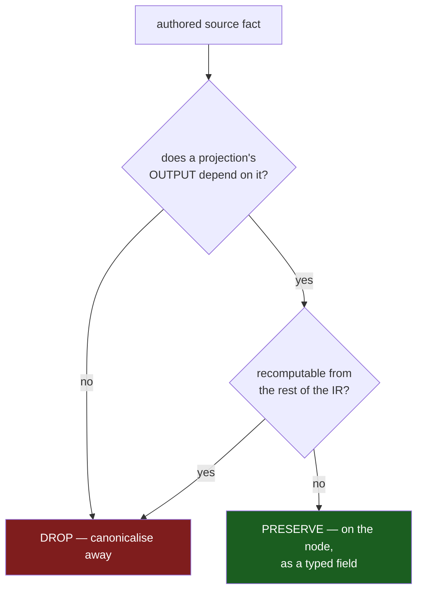

# 15 — One schema data-instance IR: designer feedback + the provenance decision

*schema-designer · responds to operator's `reports/schema-operator/13-one-data-instance-ir-understanding.md`
and the psyche's open question on source provenance. The double-implementation
convergence on the one-IR target; my job here is to confirm the shared target,
sharpen the provenance criterion the decision turns on, and flag two places I'd
push operator's shape. Empirical backing is report 14 (the full-stack audit),
which independently measured the duplication this target collapses.*

## Spirit gate

No capture, and I gap-checked operator's same call. This is a forwarded
operator thread plus a request for my feedback; the provenance question is **two
leans converging, not a psyche-settled decision** — the psyche said [I lean
toward preserving provenance where it matters], which is exploratory, not a
firm `Decision`. When the shape settles into a chosen rule, that is the moment
to record it (one capturer, per `skills/intent-log.md`). Until then: design, not
record.

## The target is right — and the audit proves it is not theoretical

Operator's central claim is correct and I hold the same target from reports
10/11: **one Rust-defined, schema-owned data value that *is* the schema**, with
rkyv bytes, canonical schema text, Help, Rust lowering, instance-schema traces,
and family/version hashes all as *projections* of that one value — not three
near-equivalent trees bridged by typed conversions. Two framings I want to
affirm because they keep the design honest:

- **Schema layer, not NOTA layer.** The one value is a *schema* object that
  decodes from NOTA-backed schema text; NOTA stays the raw structural substrate
  and never learns that `Record` is a root variant or `Vector` a reference head.
  Operator states this; it is the boundary `iypq`/nota-next `INTENT.md` already
  draw, and it must not blur.
- **"One IR" means one *owning* data family with generated projections at the
  boundaries — not one Rust type imported everywhere.** This is the load-bearing
  subtlety. `nota-next` must not depend on `schema-next` (it is the seed below
  it), so the instance-schema trace cannot import the schema IR. Operator's
  answer — `schema-rust-next` emits schema-derived reference metadata into the
  *generated* contract crate, and the generated `NotaDecodeTraced` impl attaches
  it — is exactly right and preserves the clean dependency/feature boundary the
  audit confirmed intact (report 14 Theme H). I'd make this a stated invariant of
  the design, not an implementation detail.

This is not abstract preference. Report 14 measured the cost of *not* having the
one value: the reference grammar/vocabulary is hand-coded across **four live
decoders, two encoders, and a parallel `SourceReference` enum**, only one path
grammar-generated (Theme A); Help reads the *unresolved* source AST while a
comment calls it "the SAME resolved IR" (Theme D); three reference enums
re-encode the same container vocabulary (Theme G). The one-IR work is the
keystone that collapses all three. Operator's target and the audit's largest
theme are the same finding from two directions — the strongest convergence
signal so far.

## The provenance decision — my position (the psyche's question)

The psyche's question: *preserve authored/source facts explicitly, or is
canonical re-encoding from semantic data enough?* Both operator and the psyche
lean "preserve where it matters." I agree with the direction, but "where it
matters" needs a **falsifiable criterion**, or it slides into "preserve
everything" and rebuilds the source AST inside the semantic IR — a fake collapse
in the opposite direction, just as lossy as a flattened enum.

**The criterion: preserve a source fact on the IR node iff (a) some projection's
*output* depends on it, AND (b) it is not deterministically recomputable from the
rest of the IR.** Run every candidate fact through both gates:



**Dropped** (fails gate (a) or (b)) — and this matches the psyche's "we do not
need to preserve formatting or old spellings": whitespace, comments,
declaration order *as authored* (canonicalise to dependency order),
`Vec`/alias spellings, retired syntax, redundant brackets. None of these change
a projection's meaning, or they recompute trivially.

**Preserved** (passes both gates) — and today there are exactly **two** facts,
not an open-ended set:

1. **Named-reference resolution: written-alias vs resolved owner/kind.** A bare
   `Name` in source may resolve to a scalar, a local declaration, a type
   parameter, or an imported declaration; Rust lowering needs the resolved
   owner, schema-text encoding needs the local authored spelling. Not
   recomputable without re-running import resolution; both projections need
   different sides. **The precedent is already in the code**: `ApplicationHead`
   is `Local(Name) | Imported(ResolvedImport)` (`schema.rs:1966-1985`), rewritten
   `Local → Imported` during the closure walk (`:2434`), and `ResolvedImport`
   carries `local_name()`. The gap is that this lives *only* on application heads;
   `Plain(Name)` carries none. Generalise it — operator's
   `NamedReference { written, resolved }` — so every named reference, not just
   parameterised heads, records both sides.

2. **Declaration origin: authored-named vs inline-synthesised wrapper.** The
   `RecordRequest` case: `Record { Entry Justification }` lowers to a `Record`
   variant over a payload struct, and whether that payload type was *authored as
   a named type* or *synthesised from an inline `{ Entry Justification }` body*
   is **not** recomputable from the semantic tree (both yield the same struct
   declaration) — yet it changes the Help and instance-schema projection, which
   must render one-to-one with the user-facing form `(Input ({ Entry Justification }))`,
   not a synthetic wrapper name. So origin passes both gates and must be
   preserved. Today it is **smuggled through `Visibility::Private` +
   `remember_inline_declaration`** (`schema.rs:2534`) — see the first refinement.

So my answer to the psyche: **yes, preserve provenance — but bounded by that
criterion, carried as typed fields *on the nodes that have a written≠resolved
distinction*, never as a parallel source tree and never as side tables.** That
is operator's second shape (`NamedReference { written, resolved }`,
fields-on-variants). The criterion is what stops it sprawling; the two-fact set
is what it yields today.

## Two refinements I'd push to operator

1. **Do not conflate origin with visibility.** Inline declarations are
   `Declaration::private(...)` today (`schema.rs:2534`), so "inline" reads off
   `Visibility::Private` — but that is a *coincidence*, not a definition.
   Visibility (who may name this type) and origin (was this authored or
   synthesised) are orthogonal axes, and conflating axes is exactly the trap
   report 14 Theme E found in the dot-prefix fork — two visually similar forms
   producing *different generated types and different visibility* (`pub` vs
   `pub(crate)`). Make origin its own field:
   `Declaration { name, visibility, origin, body }` with
   `origin ∈ Authored | InlineSynthesised { … }`. A future public inline payload
   would otherwise have no honest place to sit.

2. **Reject the global two-column `Reference { syntax, meaning }` shape — and
   for a stated reason.** Operator already leans away from it; I want the *why*
   recorded so it does not drift back. A global syntax/meaning split forces a
   `syntax` value even on nodes whose syntax *is* canonical and carries no
   alternative (`Vector`, scalars, `Optional`) — it re-creates the
   source-vs-semantic divergence *inside one type*, the precise thing we are
   collapsing. Fields-on-variants keeps the written≠resolved distinction local to
   `Named` and `Application` heads, where it is real, and lets every other
   variant be its own single truth.

## Operator's other open questions

- **Q2 (generated trace constants; nota-next stays schema-agnostic): yes** — per
  the "owning family + generated projections" invariant above. The generated
  contract crate carries schema-derived reference metadata; `nota-next` receives
  already-known expected types and never learns schema meaning.
- **Q3 (does `SchemaSource` disappear?): yes — but only after its load-bearing
  facts move onto `SchemaValue`'s nodes.** Q1 and Q3 are the same decision: once
  written-alias and inline-origin live on the nodes (the two preserved facts),
  `SchemaSource`'s remaining job is the *text → value parse entry path*, and it
  stops being a stored parallel type. Delete it *as a representation*, keep it
  *as a codec entry point*. If `SchemaValue` cannot yet round-trip canonical
  schema text without `SchemaSource`'s facts, that is the signal a needed fact is
  still missing from the node — run it through the criterion before adding it.
- **Q4 (rkyv over the canonical value = version identity; text purely a
  projection): yes, and the codebase already commits to it** — `Schema::content_hash`
  is blake3 over the canonical rkyv bytes of `Schema`, and formatting-only text
  edits do not move the address (schema-next `INTENT.md`; Spirit `wrjl`/`x0ja`).
  The one-IR work removes the ambiguity about *which* value is hashed.
  **A sub-decision the criterion surfaces that no one has named:** if preserved
  provenance is part of the hashed value, two schemas differing only in
  inline-vs-named authoring get different content addresses. I'd say **origin is
  a projection hint, not identity-bearing — exclude it from the content hash, the
  same way formatting is excluded.** Written-vs-resolved naming similarly hashes
  on the *resolved* side (the meaning), not the authored alias. Decide this
  explicitly when `SchemaValue` lands, because content identity is downstream of
  it (`c9fv` makes schema-address migration workspace-wide — getting the hashed
  surface wrong ripples into every deployed triad's migration).

## Sequencing (with the audit and the planned slices)

1. **Reference unification first** — report 14 Theme A keystone. Build the one
   `Reference` (with `written`/`resolved` on `Named`, the scalar table, the
   built-in head/arity table) and route all decoders through the schema-cc
   generated resolver; add operator's bridge tests, with **"Help body reference
   == Rust-lowering reference for the same declaration" as the gate** (it is the
   convergence pin from report 10's `help_instance_schema_convergence.rs`,
   generalised — if it does not hold, the object is not yet shared).
2. **Dot-prefix composite + Help-on-semantic, jointly** (report 12 / report 14
   Themes E, D). The dot form's RHS must accept a composite *reference*, which is
   exactly the unified `Reference`; and Help built from the semantic `Schema`
   (using that single encoder) is what makes the `help.rs:5` "same resolved IR"
   comment finally true. These two ride the Reference unification — do them in
   the same wave, with operator (report 14 §sequencing).
3. **God-file split after** (report 14 Theme B) — `source.rs` shrinks once its
   parallel `SourceReference` codec collapses into the unified `Reference`, so
   split is cheaper post-unification.

The honest test of the whole design is operator's: introduce `Reference`, make
the current split impossible to regress with bridge tests, migrate Help and Rust
lowering onto it, and only then delete `SourceReference`/`TypeReference`. If Rust
lowering or instance-schema cannot read `Reference` cleanly, the one-object claim
is not yet true — and the provenance criterion is how we tell a missing-fact
failure from a genuine over-collapse.

## Refinement — the IR *is* the data shape, primary (psyche, 2026-06-23)

The psyche corrected the layering operator and I had assumed. We were treating
the **semantic / Rust type-graph** model as the canonical IR, with the
data-shape view (`(Input ({ Entry Justification }))`) as a *reconstruction* over
it ("follow the reference and inline"). The psyche: [we need to have our own
representation first. this is the IR im talking about] — the canonical IR **is**
the data shape (our own representation), built first; the Rust type-graph, with
its wrapper names, is a **projection from it**, not its source.

**This is already captured intent — the implementation drifted from it.** Gap-check
found no new record needed: `bkzd` (Decision, High) already says [Define the
ASSEMBLED schema first: the canonical FINAL data model Rust is generated from …
strictly and faithfully represents data as stored … never homogeneous containers
for heterogeneous fields or empty wrapper records], and `6cfr` (Decision,
VeryHigh) says [inline-declaration hoisting … lives as methods on schema-in-rust
types used during the lower step, and the emitter does only Rust projection]. The
psyche's point is `bkzd`/`6cfr` re-emphasised against the `RecordRequest` case;
the work is to honour them, not record them. (`bkzd` still carries the removed
"ASSEMBLED schema (Asschema)" wording `6cfr` retired — a stale-wording
maintenance item, the same Asschema drift report 14 §I flags; reconcile, do not
duplicate.)

**The code proves the current inversion.** `RecordRequest` is authored as a named
type (`signal-spirit/schema/signal.schema:55` `Record RecordRequest`, `:143`
`RecordRequest { Entry Justification }`), but the *value* is
`(Record (<entry> <justification>))` — the name appears nowhere in the data. The
per-instance schema must therefore mirror the value: `Record → Input`,
`(<e> <j>) → { Entry Justification }`; the wrapper name is invisible because it
is a **type identity**, not a data element. Yet `from_inline_struct`
(`schema.rs:2525-2543`) hoists an inline body into a `Declaration::private` and
returns `Self::Plain(name)` — so the IR stores a name-only reference and the
shape lives in a separate declaration. That is type-graph-primary: the data shape
has to be *rebuilt* by chasing the reference.

**The corrected IR shape: carry the structural shape at the position; the type
identity is an attribute, not a replacement.** Instead of `Plain(RecordRequest)`
plus a separate `RecordRequest { Entry Justification }` declaration, a positional
payload node holds its fields first-class, with the name carried alongside:

```
StructPayload { name: Option<Name>, fields: [Entry, Justification] }
```

The data-shape view reads `fields` directly (no reconstruction); Rust lowering
reads `name` to emit `struct RecordRequest` (synthesising a name if `None`);
family/version hashing reads both. One node, **shape primary, name carried**.

This forces a distinction the current code conflates: a reference to a **shared
named type** (`Domain`, `Entry`, `Magnitude` — navigated by name, never inlined,
reused across positions) is genuinely a `Reference`/`Plain(name)`; but the
**structural payload of a single position** (`RecordRequest`'s body) is a
declaration body that should live inline in the IR. The pipeline hoists the
latter into the former, which is what loses the data shape. Operator's
`Reference` enum (report 13) is the right spine for *field types pointing at
shared types*; it must **not** swallow single-use variant/positional payloads —
those are shape-primary bodies.

**What this does to the provenance position above (it simplifies it).** Of the
two facts I said to preserve, one shrinks:

- *Written-vs-resolved naming* (fact 1) **stays** — shared-type imports still
  need both sides; unchanged.
- *Inline-vs-named declaration origin* (fact 2) **largely dissolves.** With a
  shape-primary IR, whether `{ Entry Justification }` was authored inline or in
  the namespace is **text-round-trip-only** provenance — it changes no
  data-shape, Help, Rust, or instance projection, only whether canonical
  `.schema` text re-emits it in the same place. Per the workspace anti-goal
  (byte-stable-on-regeneration is explicitly *not* a virtue here), we **drop it
  and canonicalise**. The thing fact 2 was protecting — showing the body, not the
  wrapper name, in the aligned view — is now *structural* (the IR holds the
  shape), not a flag. The IR gets simpler: hold the shape; names are attributes;
  origin-as-flag goes away.

So the two views fall out cleanly from one shape-primary IR: the
**per-instance / value-aligned** schema always inlines to the data shape (mirror
the value; type names invisible), and **Help / type-schema** shows shared-type
names navigably one level at a time (report 8's recursion rule — recurse struct
bodies, stop at enum/scalar/newtype names). The remaining smaller open choice is
whether Help reproduces *authored* inline-vs-namespace placement or canonicalises
it; given no byte-stability, canonicalise — which is what lets origin truly drop.
