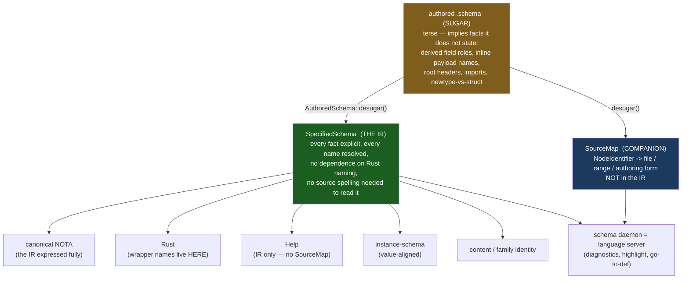
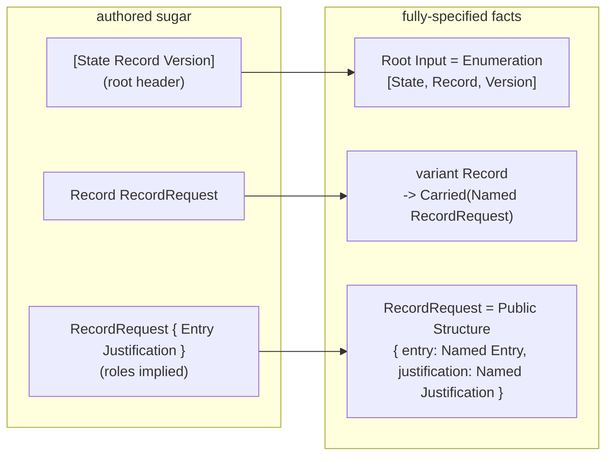
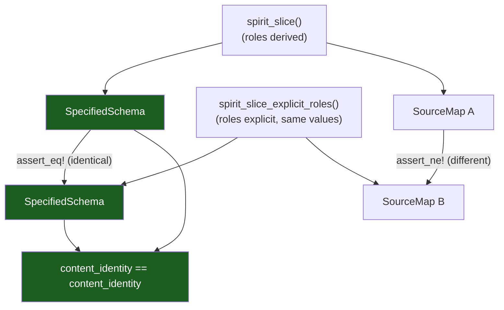

# 16 — The fully-specified schema IR: a tested proof of concept

*schema-designer · implements, tests, and presents the IR the psyche
specified: "fully specified — that's why it's called schema." The authored
`.schema` is sugar; the IR is the complete explicit specification it denotes;
the `SourceMap` is a separable companion; everything else is a projection. A
self-contained, `cargo test`-green POC on the Spirit `Record` slice
(`~/wt/specified-schema-ir-poc`, 9/9 tests). Pairs with operator's
`reports/schema-operator/13-...` under the double-implementation discipline.*

## Spirit gate

No capture. The concept is already recorded — `bkzd` (Decision, High)
[Define the canonical FINAL data model Rust is generated from … faithfully
represents data as stored … never empty wrapper records] and `6cfr` (Decision,
VeryHigh) [inline-declaration hoisting lives as methods used during the lower
step; the emitter does only Rust projection]. This report honours them; the
psyche's "implement-test-present" is a working order, not durable intent. (One
pending maintenance item, flagged earlier, awaiting the psyche's nod: `bkzd`
still carries the retired "ASSEMBLED schema (Asschema)" wording.)

## Convergence — operator landed the same spine in live code

The double-implementation converged in the strongest possible way: while I built
this POC, operator landed a real `SpecifiedSchema` in the live engine
(`schema-next/src/specified.rs`, commit `818292c`, today). It carries the POC's
exact spine — `SpecifiedRoot`, `SpecifiedDeclaration { visibility, name,
parameters, body, impls }`, `SpecifiedField`, `SpecifiedVariant` — typed,
rkyv/nota-derived, not hypothetical. The data-model half of the target *exists*.
The live one is richer (ten axes: `imports`, `resolved_imports`, `input`,
`output`, `declarations`, `streams`, `families`, `relations`, `impl_blocks`,
`identity`) where the POC has two. So this POC's job is what a designer prototype
is for: validate the *thesis* cleanly on a slice, and surface — adversarially —
exactly where the two designs disagree and what the live one still owes the
"fully specified" claim. The validation below did that against the live code.

## The thesis in one picture

Three layers, one direction. The authored file *implies*; the IR *states*; the
companion *locates*; the consumers *project*.



The earlier mistake this corrects (reports 10–15): I kept anchoring the IR to the
*authored shape* ("preserve inline-vs-named as written"). Source fidelity is not
the goal — full specification is. The IR is not what the author typed and not
what Rust lowers into; it is the complete explicit meaning the sugar denotes.

## The datatypes — the IR (`src/lib.rs`)

The "lots of datatypes" the psyche asked for. Every name is a full English word;
every node carries a `NodeIdentifier` that the IR uses for *nothing* semantic —
it is the join key the `SourceMap` uses, so source facts live outside the IR.

```rust
pub struct SpecifiedSchema {
    pub roots: Vec<SpecifiedRoot>,        // one per direction (Input/Output)
    pub namespace: Vec<SpecifiedDeclaration>,
}

pub struct SpecifiedRoot {
    pub identity: NodeIdentifier,
    pub direction: RootDirection,         // Input | Output
    pub enumeration: SpecifiedEnumeration,// the root IS an enum, made explicit
}

pub struct SpecifiedDeclaration {
    pub identity: NodeIdentifier,
    pub name: TypeName,
    pub visibility: Visibility,           // OWN axis — not a proxy for "inline"
    pub body: DeclarationBody,
}

pub enum DeclarationBody {
    Structure(SpecifiedStructure),        // positional fields (order load-bearing)
    Enumeration(SpecifiedEnumeration),
    Newtype(SpecifiedReference),
    Scalar(ScalarKind),                   // Text|Integer|Boolean|Path|Bytes
}

pub struct SpecifiedField {
    pub identity: NodeIdentifier,
    pub role: FieldRole,                  // RESOLVED (derived or explicit)
    pub reference: SpecifiedReference,
}

pub enum VariantPayload { Unit, Carried(SpecifiedReference) }

pub enum SpecifiedReference {            // the ONE reference vocabulary
    Scalar(ScalarKind),
    Named(TypeName),                      // RESOLVED name — no alias, no wrapper
    Vector(Box<SpecifiedReference>),
    Optional(Box<SpecifiedReference>),
    Map(Box<SpecifiedReference>, Box<SpecifiedReference>),
}
```

And the **separable companion** — source facts keyed by node, never in the IR:

```rust
pub struct SourceMap { pub facts: Vec<(NodeIdentifier, SourceFact)> }
pub struct SourceFact { pub file: String, pub span: SourceSpan, pub authored_form: AuthoredForm }
pub enum AuthoredForm {
    InlinePayload,                  // author wrote (Name { ... }) at the use site
    NamespaceDeclaration,           // author wrote a top-level declaration
    RootHeaderEntry,                // author listed it in [State Record ...]
    DerivedFieldRole(TypeName),     // role derived from the type (the author wrote only a type)
    ExplicitFieldRole(FieldRole),   // role written explicitly (role.Type)
}
```

Two deliberate design choices vs the live engine (audit report 14):
`SpecifiedReference` is **one** type where the live engine hand-codes the reference
vocabulary across four decoders, two encoders, and a parallel `SourceReference`
(Theme A); and `Visibility` is its **own axis**, not a stand-in for "was this
authored inline" — the live engine conflates them (`schema.rs:2534`), the trap
report 15 named.

## Desugaring — sugar → fully-specified IR + SourceMap

`AuthoredSchema::desugar()` makes every implied fact explicit. The Spirit slice
authored as sugar (root header + type-only struct fields + a named payload):



The desugarer expands three classes of sugar and records each in the SourceMap:
the **root header** becomes an explicit `Input` enumeration; **field roles**
derive from type names (`Entry` → `entry`); an **inline payload**
`(RecordRequest { … })` is hoisted to a private namespace declaration with the
variant carrying a resolved `Named` reference — and `6cfr`'s rule is honoured: a
synthesised wrapper name is a lower-step concern, not baked into the stored model
the way `from_inline_struct` (`schema.rs:2525`) does today.

## The projections — real outputs (`cargo run --example demo`)

Every projection below is a thin read of the **one** `SpecifiedSchema`. These are
verbatim program output, not hand-written.

**Projection 1 — canonical NOTA (the IR expressed fully).** The psyche's "it could
be decoded into nota": the IR is a data value, NOTA one faithful projection.
Note the unified dot-prefix field syntax (`entry.Entry`, `domains.(Vector Domain)`
— report 12) for plain *and* composite fields, and the namespace canonicalised by
name (order is not load-bearing; struct field order is):

```text
(Root Input
  (Enumeration
    (State Statement)
    (Record RecordRequest)
    (Version)
  ))
(Namespace
  (Public Entry { domains.(Vector Domain) kind.Kind })
  (Public Justification { reasoning.Reasoning })
  (Public Kind [ (Decision) (Principle) (Correction) ])
  (Public Reasoning (Newtype String))
  (Public RecordRequest { entry.Entry justification.Justification })
  (Public Statement (Newtype String))
)
```

**Projection 2 — Rust.** The wrapper name `RecordRequest` is a real namespace
declaration here because Rust needs a named struct — *minted by the projection,
not invented in the IR for Rust's sake*:

```rust
pub enum Input {
    State(Statement),
    Record(RecordRequest),
    Version,
}
pub struct RecordRequest {
    pub entry: Entry,
    pub justification: Justification,
}
pub struct Entry {
    pub domains: Vec<Domain>,
    pub kind: Kind,
}
// … Justification, Statement(pub String), enum Kind, Reasoning(pub String)
```

**Projection 3 — Help (`Kind`).** Computed from the IR alone — `help()` takes no
`SourceMap` argument, so a Help model ships with zero source facts:

```text
(Public Kind [ (Decision) (Principle) (Correction) ])
```

**Projection 4 — instance-schema (value-aligned).** Mirrors the *value*: the enum
name `Input`, never the variant `Record`, never the wrapper `RecordRequest` —
neither appears in the value `(Record (…))`:

```text
value : (Record (entryValue justificationValue))
schema: (Input ({ Entry Justification }))
```

**Projection 5 — content identity.** Two authorings of the *same meaning* (derived
vs explicit field roles) hash to the **same identity** with **different
SourceMaps** — the clearest proof that identity is the IR, not the source:

```text
derived-role authoring  identity: a6ee751bbd201b20
explicit-role authoring identity: a6ee751bbd201b20
same identity? true   |   same SourceMap? false
```

## The proofs (`tests/poc.rs`, 9/9 green)



The nine tests pin the whole thesis: roles derive; the root header becomes an
explicit `Input` enum; **same meaning / different sugar ⇒ one IR + one identity +
two SourceMaps**; namespace order is not load-bearing; inline payloads are hoisted
and *remembered* in the SourceMap; the value-aligned view is `(Input ({ Entry
Justification }))`; the Rust projection is where the wrapper name appears; Help
reads the IR without the SourceMap; canonical NOTA uses the unified dot-prefix
field form.

## What this resolves

- **The provenance question dissolves into a clean line.** The IR carries
  *semantic* facts only; the SourceMap carries *syntactic* facts (the authoring
  form, the alias, the location). Help proves the separation by needing none of
  it; the identity test proves it by hashing the IR alone. No flags-on-nodes, no
  hidden side tables — the worry the psyche named is structurally answered.
- **The three reference enums collapse.** `SpecifiedReference` is one type used by
  variant payloads, struct fields, and newtype bodies alike — the audit's Theme A
  duplication (four decoders, two encoders, a parallel `SourceReference`) was the
  symptom of not having this one specified value.
- **The wrapper name stops being load-bearing.** `RecordRequest` is a namespace
  declaration in the IR and a Rust artifact in the projection; it never appears in
  the value-aligned view. `6cfr`'s "hoisting is a lower-step concern" becomes
  literally true.

## What holds / where it bends

Eight adversarial validators read the POC *and* the live `schema-next`, each
trying to break the design on one concern. Five concerns broke, two held, one
held-with-caveats — and the breakages are the most useful output of this whole
exercise.

**What holds (the thesis spine is sound):**

- **The hashed surface is the resolved name-graph; source facts are structurally
  outside it.** Not a toggle — the live `Schema`/`Declaration` carry *no*
  span/line/column fields at all (`schema.rs:434,1069`); positions live only in
  the separate `SchemaSource`. `tests/identity.rs::formatting_differences_do_not_change_any_hash`
  passes by construction. The cut is real.
- **Field-role authoring is purely a source fact — the finished half of the
  thesis.** Live `FieldDeclaration` is `{ name, reference }` (`schema.rs:1740`);
  whether the role was authored or derived is *unrepresentable* in the semantic
  schema and lives only in `AuthoredForm`. The POC's identity test exercises
  exactly this case, which is why it holds.
- **"Stop at `Named`" is a live invariant — fully-specified never means infinite
  inlining.** A validator lowered the real recursive `Domain` tree: it flattened
  into seven separate named enum declarations, every variant `Plain(Name)` to a
  sibling, cycles terminated by the live `ClosureWalk` visited-set
  (`identity.rs:301`). The recursive/shared-type concern held outright.

**Where it bends (ranked; these are real and mostly about what the POC and the
"fully specified" claim still owe):**

1. **The inline-vs-named identity contradiction — the most consequential.** "Inline
   is pure sugar that desugars to the *same* IR" is **false today in both systems**:
   `from_inline_struct` stamps the hoisted body `Declaration::private` while a named
   top-level type is `public`, and `visibility` is in the rkyv bytes
   (`schema.rs:1070`) — so inline-payload vs named-reference of an *identical body*
   produce different family hashes. My own POC test asserts `Private` for the inline
   case. The POC fixes the conflation in *type design* (Visibility is its own axis)
   but its `desugar` still stamps `Private`, so the behaviour survives. This is
   Q1 — and it subsumes the wrapper-visibility leak report 15 named. (Framing
   correction the validators force: there is no engine-*minted* nameless wrapper —
   inline syntax is name-first `(Name { … })`, so the name is always authored and
   the hoist only relocates the declaration. The "synthesised wrapper name"
   question has no live case *unless* a nameless-inline form is later allowed.)
2. **The reference vocabulary and declaration shape are a strict subset of what
   emission needs.** The POC's 5-variant `SpecifiedReference` drops three live forms
   the emitter *transforms*: `ScopeOf` (name transform `#name → #nameScope`,
   `lib.rs:1912`), `Application{head,arguments}` (generics, `#head<#args>`), and
   `FixedBytes(width)`. And the POC drops generic *parameters* entirely, which the
   live `SpecifiedDeclaration.parameters` (`specified.rs:232`) renders into the type
   header. Gated by Q3.
3. **Scalar lowering — fixed.** The POC originally inlined concrete std types
   (`Integer→i64`, a signedness error vs the live `u64`; `Path→PathBuf` vs the live
   `String` alias). Corrected: scalars stay *named tokens* over a generated alias
   preamble, matching the live engine (codec impls attach to the named token).
4. **The POC's instance-schema struct branch is value-*independent*.** It maps
   `position_name()` over the *IR* fields and never reads the value, so three
   different values all render `(Input ({ Entry Justification }))` — it does not
   actually prove value-alignment *for structs* (it proves it for the variant
   selection only). The live `aligned()` walks the decode *trace* and is
   value-shaped throughout — and is itself internally asymmetric (depth-1 standalone
   vs depth-2 through a root variant), contradicting its own doc. This is Q5, and
   the projection must bind to the decode trace, not the IR alone.
5. **The fully-specified value is materially larger and more relational than two
   axes.** Live has ten axes; the POC has two. Streams, families, stream relations
   (`opens`/`belongs` on variants — a payload shape `Unit|Carried` cannot hold),
   impl/trait catalogs, and imports have no home in the POC. And the newtype-vs-struct
   collapse is genuinely *lossy*: a one-field struct always becomes a `Newtype`
   (`schema.rs:2532`), erasing authored struct-ness. This is Q2 — "everything is a
   projection of one value" must enumerate the full node-kind list.
6. **The import alias breaks the IR/SourceMap line as the POC draws it.** For
   imports the local alias is *semantic* in the live IR — references are stored
   *under the alias* and the alias is *in* the `FamilyClosure` (`identity.rs:121`),
   so two schemas importing the same `crate:module:Type` under different aliases get
   *different* family hashes. My designer position (alias → SourceMap, resolve to
   canonical) is the thesis-consistent fix but contradicts live behaviour. Q4.
7. **Every location-bearing language-server feature is unfounded — there are no
   spans anywhere.** The POC hardcodes `{0,0}`; the live engine has *zero*
   spans/offsets in all of `src/`. Diagnostics-with-squiggles, go-to-definition, and
   find-references each need a byte range neither captures, plus a referent back-edge
   the IR lacks. The schema-daemon-as-language-server is a *later* slice; threading
   spans through `Document → SchemaSource → Schema` reaches into nota-next's parser,
   and the SourceMap should key on `SymbolPath`, not mint-ordered `NodeIdentifier`
   (which shifts on any edit above a node).

## Honesty ledger — what the POC does and does not prove

It **proves**: source→IR desugaring of three sugar classes; the IR/SourceMap split
(via `help()` taking no SourceMap and the identity test); identity over the IR
alone; the wrapper name living only in the Rust projection; "stop at Named." It is
**silent or wrong on**: the other ~80% of real Rust emission (impls, derive
clusters, the alias preamble, route enums); streams/families/relations/imports/
generics; value-driven struct alignment; spans and everything downstream of them.
It validated the *thesis*, not the *engine* — which is exactly the prototype's job
under the double-implementation discipline.

## Open questions

The validation sharpened these into seven design decisions, each with its
trade-off. They are the real content of the next conversation.

- **Q1 — Is inline-vs-named identity-equivalent?** If yes, the hoisted inline
  declaration must not be `Private` (or visibility must leave the family-closure
  bytes). If no, the "inline is pure sugar → same IR" claim is retracted. The
  current design straddles both. *Trade-off: identity-equivalence buys "same
  meaning, same hash" at the cost of making inline genuinely non-encapsulating.*
- **Q2 — What is the full top-level node-kind list of the IR value?** Are streams,
  families, relations, and impl_blocks part of the fully-specified *value* (as live
  `specified.rs` makes them, included in identity) or projections? *Trade-off: a
  richer value is the honest target but undercuts the "IR is minimal" rhetoric.*
- **Q3 — Does the IR carry generics, or monomorphize them away?** Live carries them
  (`parameters`, `Application`, `ScopeOf`). "Fully specified" arguably implies
  monomorphization. *Trade-off: carrying keeps one declaration per family;
  monomorphizing makes the IR truly closed but multiplies declarations.*
- **Q4 — Import reference: resolved canonical target (alias → SourceMap) or alias as
  head?** The thesis demands resolved-canonical; the live code stores *and hashes*
  the alias, so the same import under two aliases gets two family hashes.
  *Trade-off: resolved-canonical makes identity alias-independent but changes
  generated `use` aliases; alias-as-head leaks the import environment into identity.*
- **Q5 — Canonical depth rule for instance-schema `aligned`?** Strict depth-1 ("one
  token per value position" — then the live two-level-at-root expansion is wrong),
  or "expand the root payload's struct one extra level" (then say why the root is
  special). Live ships the second while its doc claims the first. Also: are
  `aligned` and `expanded` both endorsed, or is one canonical?
- **Q6 — Is the IR the identity basis, and is rebasing acceptable?** Flipping
  identity from `Schema` to canonicalized `SpecifiedSchema` changes *every* existing
  Spirit content/family hash. The no-backcompat rule says yes — but Spirit identity
  may be the "explicitly-declared boundary" that is exempt. **This is the gating
  decision**: until answered, `SpecifiedSchema` stays the downstream leaf it is
  today. (Sub-decision: should the whole-schema hash canonicalize namespace *order*
  the way the family closure already does? Today it does not.)
- **Q7 — Does the version string belong in the whole-schema hash?** It makes that
  hash a *release* address, not a content address (a re-tag re-addresses an
  unchanged schema). Should version-control consume *family* hashes for content-dedup
  and the whole-schema hash only for release pinning?

Two more that are mine, not the validators':

- **The concept's name.** "Assembled schema" is the right idea, burned term
  (`6cfr`). Working name `SpecifiedSchema`; `Schema` (the canonical one),
  `SettledSchema`, `ExplicitSchema` are candidates.
- **The `-next` rename** (`ctkv`): ready on your go — `nota-next → nota`,
  `schema-next → schema`, `schema-rust-next → schema-rust`. It touches
  operator-owned `main`s, so it is an operator-lane execution I can scope but
  should coordinate, not run unilaterally — your call whether I hand it to operator
  or scope-and-dispatch a subagent operator then lands.

## First implementation slice

The smallest move that shifts `schema-next` from "`SpecifiedSchema` exists as a
downstream leaf" to "`SpecifiedSchema` is IR-primary" — additive, non-breaking,
and it forces the open questions to become concrete blockers in the right order:

1. **Repoint ONE projection at `SpecifiedSchema`** — the instance-schema projection
   (smallest surface). This immediately exposes whether the value-aligned walk can
   be value-driven off the IR (Breakage 4).
2. **Add a `SourceMap` sibling** produced alongside `to_schema`, initially recording
   only the two facts the POC proves (`InlinePayload` vs `NamespaceDeclaration`,
   `DerivedFieldRole` vs `ExplicitFieldRole`). Spans stay placeholders — this slice
   does not attempt the parser threading (deferred, Breakage 7).
3. **Do NOT flip the identity basis yet.** That is the one genuinely breaking step
   (Q6) and needs explicit psyche sign-off. Leave identity on `Schema`.

Deliberately *not* in this slice: un-baking the eager hoist. It is baked at two
lockstep sites (`schema.rs:2525` and `source.rs:170`, the engine comment requires
they stay in lockstep), so un-baking changes the canonical lowering — highest blast
radius. The additive slice defers it. What it unblocks: once one real projection
reads the IR, "everything is a projection of one value" stops being POC rhetoric and
becomes a live property under test, and Q2/Q4 turn from open questions into concrete
blockers the moment a projection demands streams/families/imports — forcing the
enumeration *before* the breaking identity flip, not after.

## Pointers

- POC: `~/wt/specified-schema-ir-poc` — `cargo test` (9/9), `cargo run --example demo`.
- `src/lib.rs` — the IR datatypes, `desugar()`, the five projections, the minimal
  NOTA value model. (`Value::parse` is a dependency-free stand-in; the real engine
  reuses nota-next's codec, never a hand-rolled parser — the thing audit report 14
  flags.)
- `tests/poc.rs` — the nine proofs. `examples/demo.rs` — the projection dump above.
