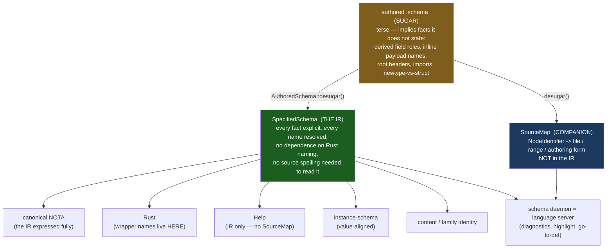
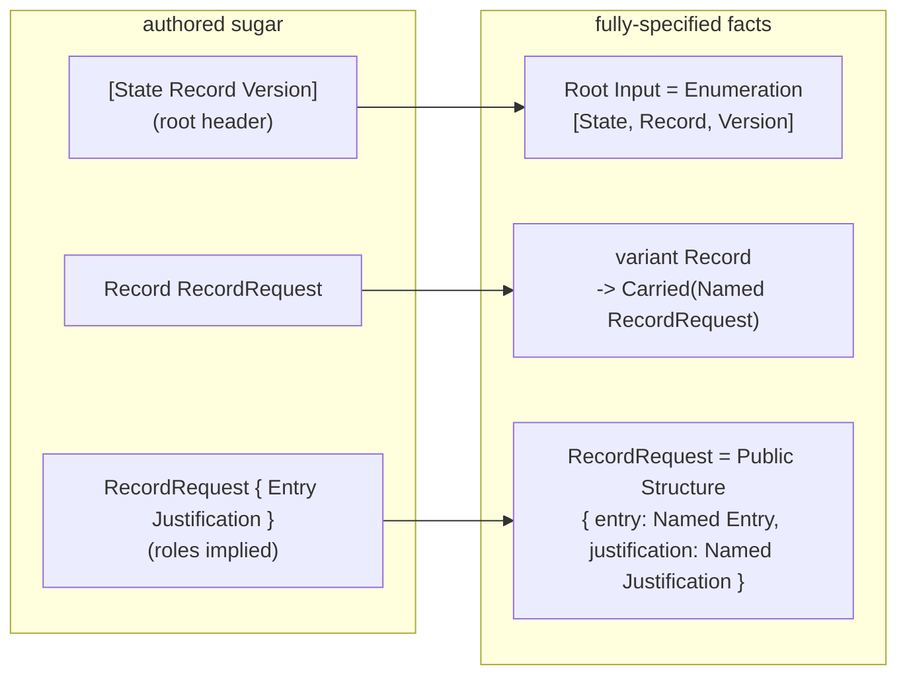
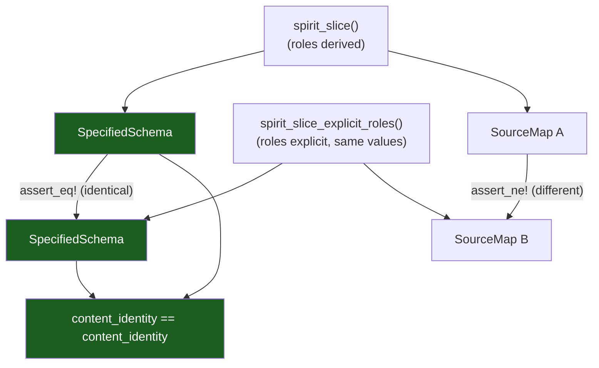

# 16 — The fully-specified schema IR: a tested proof of concept

*schema-designer · implements, tests, and presents the IR the psyche
specified: "fully specified — that's why it's called schema." The authored
`.schema` is sugar; the IR is the complete explicit specification it denotes;
the `SourceMap` is a separable companion; everything else is a projection. A
self-contained, `cargo test`-green POC on the Spirit `Record` slice
(`~/wt/specified-schema-ir-poc`, 9/9 tests). Pairs with operator's
`reports/schema-operator/13-...` under the double-implementation discipline.*

## Spirit gate

No capture. The concept is already recorded — `bkzd` (Decision, High)
[Define the canonical FINAL data model Rust is generated from … faithfully
represents data as stored … never empty wrapper records] and `6cfr` (Decision,
VeryHigh) [inline-declaration hoisting lives as methods used during the lower
step; the emitter does only Rust projection]. This report honours them; the
psyche's "implement-test-present" is a working order, not durable intent. (One
pending maintenance item, flagged earlier, awaiting the psyche's nod: `bkzd`
still carries the retired "ASSEMBLED schema (Asschema)" wording.)

## The thesis in one picture

Three layers, one direction. The authored file *implies*; the IR *states*; the
companion *locates*; the consumers *project*.



The earlier mistake this corrects (reports 10–15): I kept anchoring the IR to the
*authored shape* ("preserve inline-vs-named as written"). Source fidelity is not
the goal — full specification is. The IR is not what the author typed and not
what Rust lowers into; it is the complete explicit meaning the sugar denotes.

## The datatypes — the IR (`src/lib.rs`)

The "lots of datatypes" the psyche asked for. Every name is a full English word;
every node carries a `NodeIdentifier` that the IR uses for *nothing* semantic —
it is the join key the `SourceMap` uses, so source facts live outside the IR.

```rust
pub struct SpecifiedSchema {
    pub roots: Vec<SpecifiedRoot>,        // one per direction (Input/Output)
    pub namespace: Vec<SpecifiedDeclaration>,
}

pub struct SpecifiedRoot {
    pub identity: NodeIdentifier,
    pub direction: RootDirection,         // Input | Output
    pub enumeration: SpecifiedEnumeration,// the root IS an enum, made explicit
}

pub struct SpecifiedDeclaration {
    pub identity: NodeIdentifier,
    pub name: TypeName,
    pub visibility: Visibility,           // OWN axis — not a proxy for "inline"
    pub body: DeclarationBody,
}

pub enum DeclarationBody {
    Structure(SpecifiedStructure),        // positional fields (order load-bearing)
    Enumeration(SpecifiedEnumeration),
    Newtype(SpecifiedReference),
    Scalar(ScalarKind),                   // Text|Integer|Boolean|Path|Bytes
}

pub struct SpecifiedField {
    pub identity: NodeIdentifier,
    pub role: FieldRole,                  // RESOLVED (derived or explicit)
    pub reference: SpecifiedReference,
}

pub enum VariantPayload { Unit, Carried(SpecifiedReference) }

pub enum SpecifiedReference {            // the ONE reference vocabulary
    Scalar(ScalarKind),
    Named(TypeName),                      // RESOLVED name — no alias, no wrapper
    Vector(Box<SpecifiedReference>),
    Optional(Box<SpecifiedReference>),
    Map(Box<SpecifiedReference>, Box<SpecifiedReference>),
}
```

And the **separable companion** — source facts keyed by node, never in the IR:

```rust
pub struct SourceMap { pub facts: Vec<(NodeIdentifier, SourceFact)> }
pub struct SourceFact { pub file: String, pub span: SourceSpan, pub authored_form: AuthoredForm }
pub enum AuthoredForm {
    InlinePayload,                  // author wrote (Name { ... }) at the use site
    NamespaceDeclaration,           // author wrote a top-level declaration
    RootHeaderEntry,                // author listed it in [State Record ...]
    DerivedFieldRole(TypeName),     // role derived from the type (the author wrote only a type)
    ExplicitFieldRole(FieldRole),   // role written explicitly (role.Type)
}
```

Two deliberate design choices vs the live engine (audit report 14):
`SpecifiedReference` is **one** type where the live engine hand-codes the reference
vocabulary across four decoders, two encoders, and a parallel `SourceReference`
(Theme A); and `Visibility` is its **own axis**, not a stand-in for "was this
authored inline" — the live engine conflates them (`schema.rs:2534`), the trap
report 15 named.

## Desugaring — sugar → fully-specified IR + SourceMap

`AuthoredSchema::desugar()` makes every implied fact explicit. The Spirit slice
authored as sugar (root header + type-only struct fields + a named payload):



The desugarer expands three classes of sugar and records each in the SourceMap:
the **root header** becomes an explicit `Input` enumeration; **field roles**
derive from type names (`Entry` → `entry`); an **inline payload**
`(RecordRequest { … })` is hoisted to a private namespace declaration with the
variant carrying a resolved `Named` reference — and `6cfr`'s rule is honoured: a
synthesised wrapper name is a lower-step concern, not baked into the stored model
the way `from_inline_struct` (`schema.rs:2525`) does today.

## The projections — real outputs (`cargo run --example demo`)

Every projection below is a thin read of the **one** `SpecifiedSchema`. These are
verbatim program output, not hand-written.

**Projection 1 — canonical NOTA (the IR expressed fully).** The psyche's "it could
be decoded into nota": the IR is a data value, NOTA one faithful projection.
Note the unified dot-prefix field syntax (`entry.Entry`, `domains.(Vector Domain)`
— report 12) for plain *and* composite fields, and the namespace canonicalised by
name (order is not load-bearing; struct field order is):

```text
(Root Input
  (Enumeration
    (State Statement)
    (Record RecordRequest)
    (Version)
  ))
(Namespace
  (Public Entry { domains.(Vector Domain) kind.Kind })
  (Public Justification { reasoning.Reasoning })
  (Public Kind [ (Decision) (Principle) (Correction) ])
  (Public Reasoning (Newtype String))
  (Public RecordRequest { entry.Entry justification.Justification })
  (Public Statement (Newtype String))
)
```

**Projection 2 — Rust.** The wrapper name `RecordRequest` is a real namespace
declaration here because Rust needs a named struct — *minted by the projection,
not invented in the IR for Rust's sake*:

```rust
pub enum Input {
    State(Statement),
    Record(RecordRequest),
    Version,
}
pub struct RecordRequest {
    pub entry: Entry,
    pub justification: Justification,
}
pub struct Entry {
    pub domains: Vec<Domain>,
    pub kind: Kind,
}
// … Justification, Statement(pub String), enum Kind, Reasoning(pub String)
```

**Projection 3 — Help (`Kind`).** Computed from the IR alone — `help()` takes no
`SourceMap` argument, so a Help model ships with zero source facts:

```text
(Public Kind [ (Decision) (Principle) (Correction) ])
```

**Projection 4 — instance-schema (value-aligned).** Mirrors the *value*: the enum
name `Input`, never the variant `Record`, never the wrapper `RecordRequest` —
neither appears in the value `(Record (…))`:

```text
value : (Record (entryValue justificationValue))
schema: (Input ({ Entry Justification }))
```

**Projection 5 — content identity.** Two authorings of the *same meaning* (derived
vs explicit field roles) hash to the **same identity** with **different
SourceMaps** — the clearest proof that identity is the IR, not the source:

```text
derived-role authoring  identity: a6ee751bbd201b20
explicit-role authoring identity: a6ee751bbd201b20
same identity? true   |   same SourceMap? false
```

## The proofs (`tests/poc.rs`, 9/9 green)



The nine tests pin the whole thesis: roles derive; the root header becomes an
explicit `Input` enum; **same meaning / different sugar ⇒ one IR + one identity +
two SourceMaps**; namespace order is not load-bearing; inline payloads are hoisted
and *remembered* in the SourceMap; the value-aligned view is `(Input ({ Entry
Justification }))`; the Rust projection is where the wrapper name appears; Help
reads the IR without the SourceMap; canonical NOTA uses the unified dot-prefix
field form.

## What this resolves

- **The provenance question dissolves into a clean line.** The IR carries
  *semantic* facts only; the SourceMap carries *syntactic* facts (the authoring
  form, the alias, the location). Help proves the separation by needing none of
  it; the identity test proves it by hashing the IR alone. No flags-on-nodes, no
  hidden side tables — the worry the psyche named is structurally answered.
- **The three reference enums collapse.** `SpecifiedReference` is one type used by
  variant payloads, struct fields, and newtype bodies alike — the audit's Theme A
  duplication (four decoders, two encoders, a parallel `SourceReference`) was the
  symptom of not having this one specified value.
- **The wrapper name stops being load-bearing.** `RecordRequest` is a namespace
  declaration in the IR and a Rust artifact in the projection; it never appears in
  the value-aligned view. `6cfr`'s "hoisting is a lower-step concern" becomes
  literally true.

## What holds / where it bends

*(Adversarial validation across consumers — Rust emission, identity/hashing,
instance-schema delimiters, Help/language-server, recursive/shared types,
desugaring completeness, live-migration distance, IR/SourceMap line — is running;
this section folds in its synthesis on completion.)*

## Open questions

These are the design choices the POC surfaces and does **not** settle:

1. **Instance-schema delimiter + depth.** The POC renders `(Input ({ Entry
   Justification }))` (carried-payload parens + struct braces, one level). Your
   earlier deeper example was `(Input ({ Domains Kind … } { Testimony Reasoning
   }))` (expanded through `Entry`/`Justification`). Is the rule one-level, or
   all-the-way-down through structs (stopping at enums/scalars/newtypes per report
   8)? And does the carried payload always keep its value-group parens?
2. **Is a synthesised wrapper name identity-bearing?** If an inline payload is
   hoisted to a synthesised name, do two schemas that differ only inline-vs-named
   get the same family hash? My lean: the synthesised name is *not* identity-bearing
   (exclude it, like formatting) — but this ripples into `c9fv` schema-address
   migration and should be decided deliberately.
3. **Where exactly does the IR/SourceMap line fall for imports?** The designer
   position is that a written alias is a source fact → SourceMap, the resolved
   owner is semantic → IR. Is there ever a case where the IR *needs* the local
   alias to disambiguate two imports in one scope?
4. **The new name for the concept.** "Assembled schema" is the right idea but the
   term is burned (`6cfr` retired the Asschema artifact). `SpecifiedSchema` is the
   POC's working name; `Schema` (the canonical one), `SettledSchema`, or
   `ExplicitSchema` are candidates. Worth choosing deliberately.
5. **The `-next` rename** (`ctkv`): ready to dispatch on your go —
   `nota-next → nota`, `schema-next → schema`, `schema-rust-next → schema-rust`.
   The audit mapped the blast radius (92 `@generated` headers + `build.rs`/
   `migration.rs` literals beyond the repo renames and Cargo repins). Note: this
   touches operator-owned `main`s, so it is an operator-lane execution I can
   scope but should coordinate, not run unilaterally.

## First implementation slice

*(Folded in from the validation synthesis — the smallest move that shifts the live
`schema-next` toward fully-specified-IR-primary.)*

## Pointers

- POC: `~/wt/specified-schema-ir-poc` — `cargo test` (9/9), `cargo run --example demo`.
- `src/lib.rs` — the IR datatypes, `desugar()`, the five projections, the minimal
  NOTA value model. (`Value::parse` is a dependency-free stand-in; the real engine
  reuses nota-next's codec, never a hand-rolled parser — the thing audit report 14
  flags.)
- `tests/poc.rs` — the nine proofs. `examples/demo.rs` — the projection dump above.
