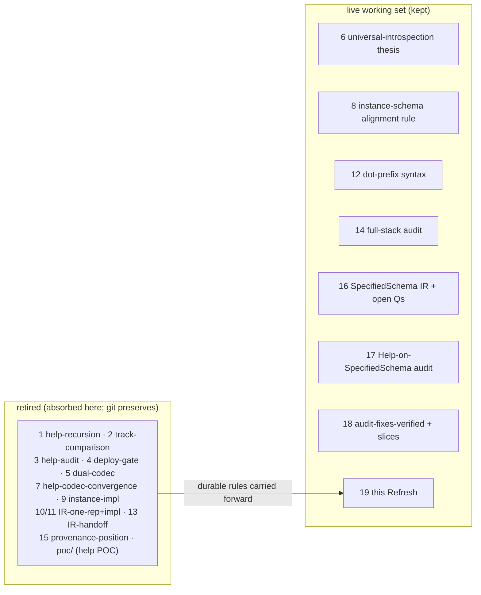

# 19 — Refresh: the schema stack's canonical position (Spirit-aligned)

*schema-designer · report 19 · a context-maintenance Refresh driven by
psyche alignment and guided by Spirit data. It agglomerates the pre-`SpecifiedSchema`
journey (reports 1–13, 15) into one landing witness, names the durable design
rules with their Spirit anchors, and surfaces the one genuine misalignment the
sweep found: a cluster of Asschema-era Spirit records the psyche's own `6cfr` /
`6grf` / `ng1x` decisions already superseded. Live working set after this pass:
6, 8, 12, 14, 16, 17, 18 + this Refresh.*

## What this pass was

The psyche asked for *context maintenance driven by relentless psyche alignment,
guided by spirit data*. Concretely: take the deployed Spirit store as the
lodestar, rank the schema-designer report tree against it, retire what current
intent has reframed, and preserve every load-bearing design rule in a home that
survives the retirement. The report dir had grown to **18 numbered reports + a
stale help POC** — well over the 12-report soft cap — across one long arc that
has now converged.

## Spirit gate

No capture. The prompt is a task-only maintenance order — it dies when the task
is erased, so it is task state, not durable intent. The pass is *Observe/refresh*:
it reads Spirit and aligns agent-written surfaces to it; it records nothing new.
The one place new psyche authority is needed — the Asschema-era intent-log
supersession — is raised as a recommendation below, not executed.

## The lodestar — one IR, named SpecifiedSchema

Everything in this lane now hangs off one decision, the highest-certainty schema
record in the store:

> Per Spirit `6grf` (Decision VeryHigh): [Schema is a specialized NOTA dialect
> built on structural macro nodes: authored .schema is sugar decoded by the
> schema codec into a fully specified schema-in-rust IR. The public Rust name
> for this value is **SpecifiedSchema** … Rust interface code, Help,
> instance-schema, content and family hashes, schema-daemon language-service
> features, and text/debug projections are projections from SpecifiedSchema.
> Source locations, aliases, shorthand origins, and editor diagnostics live in a
> **SourceMap** companion, not in the semantic IR itself. Identity and hash
> projections may rebase onto SpecifiedSchema; resulting hash changes are normal
> version-upgrade migration, not a protected compatibility boundary.]

paired with its removal half:

> Per Spirit `6cfr` (Decision VeryHigh): [The separate Assembled Schema
> (**Asschema**) IR is removed: the resolution it performed (inline-declaration
> hoisting, visibility, ordering, symbol paths) lives as methods on
> schema-in-rust types used during the lower step, and the emitter does only
> Rust projection, not schema semantics.]

```mermaid
flowchart TB
  Sugar["authored .schema (SUGAR)"] -->|"schema codec (desugar)"| IR
  Sugar --> Map
  IR["SpecifiedSchema — the ONE IR\n(rkyv-serializable; every fact explicit)"]
  Map["SourceMap (companion)\nspans, aliases, authoring form — NOT in the IR"]
  IR --> Rust["Rust interface code"]
  IR --> Help["Help"]
  IR --> Inst["instance-schema"]
  IR --> Hash["content / family identity"]
  IR --> Lang["schema-daemon language service"]
  Map --> Lang
  classDef ir fill:#1b5e20,color:#fff; classDef map fill:#1b3a5e,color:#fff;
  class IR ir; class Map map;
```

This is the live work right now: `schema-operator` holds `nota-next`,
`schema-next`, `schema-rust-next`, `signal-spirit` under the claim *migrate Rust
lowering and family identity to SpecifiedSchema, then rename next crates*. Reports
16/17/18 are the designer half of that loop and stay live.

## Durable design rules carried forward (with anchors)

These are the load-bearing rules the retired journey reports established. Each now
lives in a home that outlives its source report; this section is the consolidated
restatement so nothing is lost when the sources retire.

| Rule | Source report (retired) | Durable home |
|---|---|---|
| **Help renders exactly one structural level**, naming child types; the reader navigates by `(Help child)`, never a transitive dump. Trivially total — no depth knob, no cycle guard. | 1 | Spirit `6th4` [the help model exposes one structural level per request through schema-emitted nouns and newtypes]; the SpecifiedSchema Help model in reports 17/18 |
| **Help/introspection is codec-driven, never hand-printed** — encode↔decode through schema-next's declaration codec, not a `format!` string. The 27 `to_schema_text` printers in `source.rs` ARE that trusted codec floor (acceptable), distinct from forbidden application-level hand-printing. | 5, 7 | Report 18 Q4 (codec-floor rule, operator-proposed, psyche-blessing pending); Spirit `hc0t`/`kfqa`/`aipc` (no hand-rolled parsers, real codec) |
| **instance-schema is value-aligned**: an enum position shows the enum *name*, never the variant nor the alternatives; recurse struct bodies, stop at enum/scalar/newtype names. Produced decoder-driven, rendered through the encoder — no hand-written value walk. | 8, 9 | Report 16's instance-schema projection; open depth rule is Q5 (see below); Spirit `kfqa` |
| **Provenance criterion**: preserve a source fact on an IR node iff (a) a projection's *output* depends on it AND (b) it is not recomputable from the rest of the IR. Everything else canonicalises away. Carried as typed fields on the nodes that have a written≠resolved distinction, never a parallel source tree. | 15 | This Refresh + report 16 (the shape-primary IR simplifies it to ~one preserved fact: written-vs-resolved naming); Spirit `a3l4`/`thi1` anchor provenance intent |
| **Unified dot-prefix struct-field syntax** `name.TypeReference`, where the type after the dot may be composite (`members.(Vector X)`); the parenthesized `(name composite)` form is deprecated. | 12 (kept) | Report 12 stays live (grammar still being implemented); cited by report 16 |
| **Universal schema introspection**: anything that prints as a NOTA value can print its schema through the same pure codec — the broaden-Help-to-mentci forward thesis. | 6 (kept) | Report 6 stays live (forward thesis, cited by report 18); not yet settled psyche intent |

## The open questions that remain live (report 16 §Open questions)

Settled with the psyche (report 16 update): **name `SpecifiedSchema` stays**;
**rehashing is authorized** — [I dont mind rehashing — its part of version
upgrades] — so identity may rebase onto `SpecifiedSchema` (inside the
no-backcompat zone per `c9fv`/`29pb`); **redundant explicit field roles stay
rejected** (`a5tg`/`ov30`); **`-next` rename is operator's** (`ctkv`).

Still open, gating downstream slices: **Q1** inline-vs-named identity-equivalence;
**Q2** the full top-level node-kind list of the IR value (streams/families/
relations part of the value or projections); **Q3** generics carried vs
monomorphized; **Q4** import reference resolved-canonical vs alias-as-head; **Q5**
instance-schema depth rule (depth-1 vs expand-root-one-level — the live `aligned()`
contradicts its own doc), which gates the typed instance-schema projection; **Q7**
whether the version string belongs in the whole-schema hash. The migration order
(report 18) honours these: **Rust lowering → family identity → `-next` rename →
instance-schema (after Q5) → HelpBody-to-schema-next → SourceMap → schema daemon**.

## The one real misalignment — Asschema-era Spirit records

The sweep's headline finding. The psyche decided Asschema is **removed** (`6cfr`
VeryHigh, `ng1x` [Drop compatibility surfaces — the Asschema projection, old
Asschema APIs … once superseded]), and `6grf` re-homes every projection on
`SpecifiedSchema`. But a cluster of **Asschema-era records is still active** in the
store, framing `.asschema` as the canonical resolved artifact. Reports 15 and 16
both flagged this in passing as "a stale-wording maintenance item awaiting the
psyche's nod." It is the root misalignment between the deployed intent log and the
current era — exactly what a Spirit-guided pass should surface.

Two dispositions, conservative by default (this needs psyche authority —
superseding genuine prior psyche intent is psyche-only; `skills/intent-maintenance.md`):

**(A) Pure-Asschema records — supersede/retire (surviving arrow already in `6grf`):**

| Record | Kind / certainty | Why superseded |
|---|---|---|
| `hc0t` | Constraint VeryHigh | [The assembled schema (.asschema) is canonical NOTA-and-rkyv only … AsschemaNotaWriter/Reader] — the artifact it constrains no longer exists |
| `n9ta` | Decision High | [the Rust emitter consumes the serialized assembled form (.asschema NOTA files)] — directly contradicted; emitter consumes `SpecifiedSchema` |
| `av1q` | Decision High | [Define assembled schema (.asschema) before sugar] — the IR it defines is removed |
| `sfwv` | Clarification Medium | [The resolved assembled-schema artifact is the Asschema (.asschema) file] — clarifies a dead artifact |
| `yuku` | Principle Medium | [Asschema owns assembled schema data, AsschemaArtifact owns NOTA and rkyv] — responsibilities of a removed type |

**(B) Dual-content records — Clarify in place (strip the dead Asschema framing, keep the surviving rule):**

| Record | Surviving rule to keep | Dead framing to strip |
|---|---|---|
| `bkcd` (High/VeryHigh) | rkyv is the universal wire base; NOTA codec opt-in per consumer (DOUBLE vs binary-only) | "from one .asschema" → from one `.schema`/`SpecifiedSchema` |
| `b2jg` (High/High) | real file-based tests prove each pipeline step | "macro assembly into macro-free Asschema data" |
| `t5wx` (High/Medium) | schema/NOTA compiler is build-time-only, never linked into the runtime daemon | "assembled into Asschema, emitted as Rust" |
| `oxgh` (High/Medium) | field identity IS its type name; visibility-tagged declarations | "In the assembled schema …" |
| `mcuk` (Medium/Low) | .schema is header-first, no outer wrapper; positional input/output | the `asschema` referent tag |
| `xbu8` (Medium/Medium) | the schema component is self-editing (daemon edits its own schema) | "its Asschema" → its `SpecifiedSchema` |
| `py4h` (Medium/Medium) | upgrades are live typed SEMA operations; Add/Remove/Modify diff families | "on the Asschema" → on the `SpecifiedSchema` |

`h053`'s surviving "one typed noun per semantic object" arrow is already restated
cleanly by `6grf` (one `SpecifiedSchema`, projections derive from it), so it folds
under (A) once confirmed. This is a recommendation: **I have not executed any
Spirit edit** — the exact `Clarify`/`Supersede`/`Retire` calls are ready to run on
the psyche's go-ahead, tombstoning each record's full text first per
`skills/intent-maintenance.md`.

## Report supersession map



- **Retired (11 reports + the `poc/` help prototype):** 1, 2, 3, 4, 5, 7, 9, 10,
  11, 13, 15, and `reports/schema-designer/poc/`. Each is either an ephemeral
  status/deploy/convergence witness whose feature has landed, or a pre-`SpecifiedSchema`
  IR-journey report that report 16 explicitly corrects ("the earlier mistake this
  corrects, reports 10–15"). Their durable rules are in the table above; the help
  feature is in production (`signal-spirit/src/help.rs`) and migrated onto
  `SpecifiedSchema` (reports 17/18).
- **Kept:** 6, 8, 12 (live design detail cited by the working set), 14 (its eight
  audit themes are the live migration's targets, cross-referenced by 16/17/18), and
  16/17/18 (the active designer–operator migration loop).

## Other alignment touched this pass

- **`skills/spirit-cli.md`** — corrected the deployed `spirit` version `0.14.0` →
  `0.16.0` (verified via `spirit Version`). Factual drift; no structural change.
- **`skills/schema-designer.md`**, **`protocols/active-repositories.md`** — checked
  against the lodestar; both already clean and SpecifiedSchema-aligned (the
  active-repos map already cites "Asschema removed per record `6cfr`"). No edit.
- **Schema-repo `INTENT.md` files** — operator-owned and mid-migration; report 17
  confirms `schema-next/INTENT.md` is already on the SpecifiedSchema basis. Left
  untouched (their lane, in flight).
