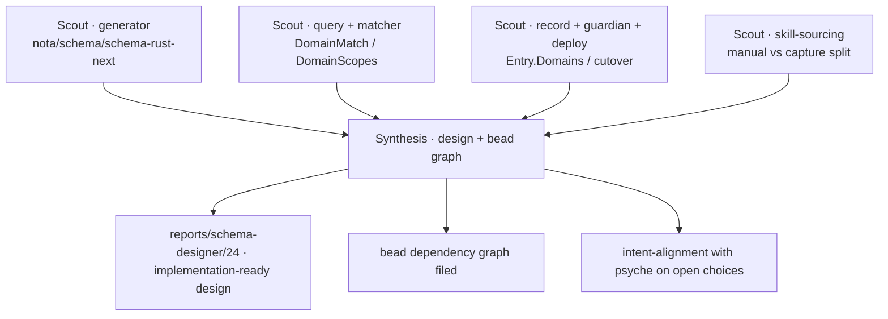

# 23 — First implementation wave: `All` domain + Spirit-skill sourcing (frame)

The launch frame for the first wave of implementation jobs handed off by
report `22-Design-all-domain-and-skill-sourcing-2026-06-24.md`. Report 22
holds the design and the captured decisions; this report frames the wave
now in flight and is the fresh-context pickup point for it. The synthesis
report (24) supersedes this once the wave's design pass returns.

## Intent grounding

Two psyche decisions drive the wave, both captured in Spirit:

> Per Spirit `nob8` (Decision High): [All is a complete leaf domain value
> available at every level of the domain tree … symmetric across querying
> and assignment … A domain-based query returns, alongside the specific
> matches, the All-tagged records of every parent level along the queried
> path … This ancestor-All inclusion is configurable: shorthand query
> options expose both the domain-based mode that folds the parent-All
> records in and a regular mode that does not.]

> Per Spirit `xblw` (Decision High): [The Spirit skill manual half … is
> generated from the spirit repository production-versioned documentation
> … The capture discipline … stays primary-authored agent-conduct
> teaching.]

Consistency constraints the design must uphold: `izib` (leaf-completeness,
no Some/None exposed; the generator owns the internal representation),
`081i` (matching is structural nesting + scope-prefix), `sn1g`
(`PublicTextSearch` is the existing low-level query shorthand), `k4i3`
(skills are self-contained teaching that cite nothing external —
generation is a build-time relationship, the produced skill stays
standalone).

## Verified current state

- `signal-spirit/schema/domain.schema` — `Domain` is a structural enum; the
  `(Optional <X>Leaf)` construct is the implicit early-stop the `All`
  design makes an explicit named value. There is **no `All` value
  anywhere** today.
- `signal-spirit/schema/signal.schema` — record side `Entry { Domains … }`,
  `Domains (Vector Domain)` (complete domains); query side
  `DomainMatch [Any (Partial) (Full)]` over `DomainScopes`,
  `DomainScope (ScopeOf Domain)` (the generated prefix language).
- Generator toolchain present: `nota-next`, `schema-next`,
  `schema-rust-next`. Spirit daemon `0.16.0` deployed; live guardian
  rejects unknown domains, so it must be rebuilt/redeployed before any
  record can be tagged `All`.
- Spirit production docs (the generation source for the manual half) live
  in the spirit repo as `ARCHITECTURE.md` / `skills.md` / `README.md` /
  schema + `target/doc` rustdoc.

## The launched wave — Map → Design

Prime-designer parallel workflow (`all-domain-skill-sourcing-scope`, run
`wf_05709885-b0d`). Four independent scouts chart the surfaces, then a
synthesis resolves the open choices and emits the design + bead graph.

## Open implementation choices the synthesis resolves

1. **Generated representation of the `All` terminal** — a per-level unit
   variant the generator emits at each node (including root `Domain` and
   the `DomainScope` prefix side), versus a generator-level construct.
2. **Concrete shorthand query verbs** for domain-based mode (folds parent-
   `All` records in) versus regular mode, beside `PublicTextSearch`.
3. **`Full`/`Partial` `DomainMatch` semantics** adjust, versus the
   ancestor-`All` fold-in landing as a separate query flag/variant.

## Dependency shape of the wave

First-wave root (unblocked): the `All` leaf in `domain.schema` + the
generator representation. Downstream on the signal-spirit track:
record-side assignment + guardian → ancestor-`All` matcher + shorthand
verbs in `signal.schema` → daemon version bump, rebuild, `CriomOS-home`
pin update, redeploy → the founding-maxim record under top-level `All` at
**Maximum** importance (blocked on the daemon shipping `All`). The
skill-sourcing track is primary-side designer work and runs in parallel.

## Next

Synthesis returns → write report 24 (implementation-ready design + the
resolved open choices) → file the first-wave beads with their `blocks`
edges → bring any genuinely psyche-level fork to chat for intent-alignment
before code lands.
