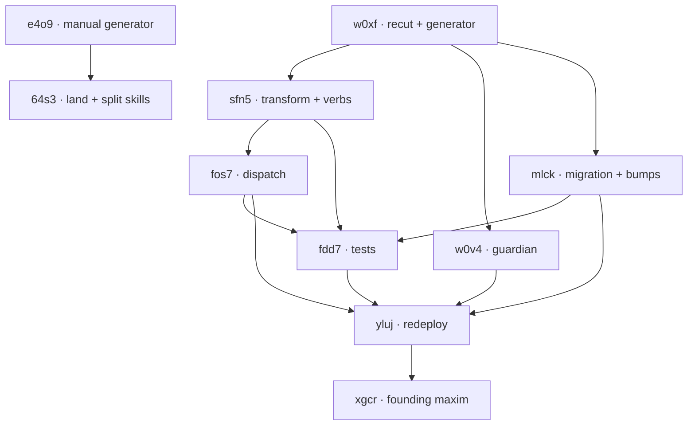

# 24 — The `All` domain leaf and the Spirit-skill sourcing split (implementation design)

Supersedes report 23 (the launch frame, deleted in this commit). This is
the implementation-ready synthesis of the first-wave Map→Design workflow
(`all-domain-skill-sourcing-scope`, run `wf_05709885-b0d`): four scout maps
(generator, query+matcher, record-side+guardian+deploy, skill-sourcing)
resolved against the two driving psyche decisions. Two tracks — the
signal-spirit `All`-domain recut (one wire/storage cutover) and the
primary-side Spirit-skill sourcing split — independent and parallel.

The two binding intent records this report serves:

- Spirit `nob8` [All is a complete leaf domain value available at every
  level of the domain tree — symmetric across querying and assignment; the
  implicit Optional stop becomes the value All, added at the root where no
  stop exists today; a domain-based query folds in the All-tagged records
  of every parent level along the queried path; this fold is configurable
  via shorthand query options; the izib leaf-completeness rule holds with
  All as a valid terminal leaf, not a match-layer wildcard].
- Spirit `xblw` [the Spirit skill manual half is generated from the spirit
  repository production-versioned documentation so the read-side skill
  tracks the deployed component and is never copied into the intent
  database; the capture discipline stays primary-authored beside the other
  behaviour skills; this realizes the read-only versus capture modular
  split].

## Part 0 — The single unifying decision the maps converge on

All three signal-spirit maps independently arrive at the same shape, and it
is the most beautiful one: the domain tree carries **no `Optional` and no
hand-written `All` token in `domain.schema` source**. The generator
recognizes that every enum reachable through the `ScopeOf`-rooted domain
tree is a node of that tree, and **injects a single `All` unit variant into
every such enum on both the complete-`Domain` side and the
`DomainScope`-prefix side, root included**. `(Optional XLeaf)` is deleted
from source outright; the child reference becomes a plain non-optional
reference.

This dissolves the special case the quality ladder demands we remove. Today
the same concept has two spellings: `Option::None` on the record/complete
side (`Hardware(None)`, never named) and a generated `All` on the
scope/query side. nob8's own words are decisive: "the implicit Optional
stop becomes the value All ... unifying the representation rather than
adding a redundant sibling." Keeping `(Optional XLeaf)` and *also* adding
`All` would be the redundant sibling — two ways to write "all of Hardware."
We delete `Optional` from the domain tree entirely; `All` is the only
early-stop, and it is the same generator-injected variant on both sides.

The scope side already proves this works: `ScopeEnumModel`
(`schema-rust-next/src/lib.rs:4303`) already injects `All` at every
non-root scope level, and the `From<Software>` arm already folds `Some/None`
into it. The whole signal-spirit track is: generalize that existing
injection to the complete-`Domain` side and to both roots, remove the root
gates, then delete the now-dead `Optional` payload handling. It is mostly a
subtraction.

## Part 1 — The All leaf in domain.schema and the generator

### Source edits (`signal-spirit/schema/domain.schema`)

Subtractive and mechanical. No new grammar construct.

1. **Root `Domain` (lines 5-30): no source change to the variant list.**
   The root gains `All` by generator injection, not by a hand-written
   variant. (Do not add `All` to the bracket body — that would re-introduce
   the hand-maintained dispatch table `language-design.md` rule 15 forbids,
   and one missed level silently breaks.)
2. **`Technology` (line 32): `(Hardware (Optional HardwareLeaf))` becomes
   `(Hardware HardwareLeaf)`.** Plain reference; the `Optional` is removed.
3. **`Software` (lines 37-48): every `(Name (Optional NameLeaf))` becomes
   `(Name NameLeaf)`.** Programming, Systems, Distributed, Data,
   Intelligence, Security, Quality, Operations, Observability, Surfaces,
   Engineering — all lose `(Optional ...)`.
4. **All leaf enums (`HardwareLeaf`, `ProgrammingLeaf`, ... line 35,
   50-60): no source change.** They gain `All` by injection. "All of
   Programming" becomes `Software(Programming(ProgrammingLeaf::All))`.
5. **`(Software)` SelfTagged (line 33) and `(Technology)` SelfTagged (line
   29): no change.** They already lower to a plain non-optional payload.

After this edit no `Optional` token survives anywhere in `domain.schema`.
The `Equivalence` block (lines 65-67) names specific leaves, not `All`, and
stays valid — but see the equivalence-composition risk below.

### Generator edits (`schema-rust-next`, with `schema-next` reachability)

The GenerationPlan/ModuleEmission/GenerationDriver labels map to
`RustEmitter` + `LowerToRust` + the `*Tokens` `ToTokens` emitters in
`schema-rust-next/src/lib.rs`. Concrete work, all emitting into `impl`
blocks per the method-only rule:

1. **Shared domain-tree reachability.** `ScopeEnumModel::from_scope_newtype`
   (`lib.rs:4303`) already walks exactly the set of enums reachable from the
   root named in a `ScopeOf(Plain(Root))` newtype. Lift that reachability
   into a shared `DomainTree` model (a data-bearing type) consulted by
   *both* the complete-side `RustEnumTokens` and the scope-side
   `ScopeEnumTokens`, so the All-injection set is one definition. This
   guards the "leaf shared outside the tree" risk: the injection set is
   exactly the `ScopeOf`-rooted closure.
2. **Inject `All` on the complete side.** `RustEnumTokens` /
   `RustEnumVariantTokens` (`lib.rs:5260`) emit `All,` as the first variant
   of every domain-tree enum, and emit child references **without** `Option`
   (the `Optional(inner)` render at `lib.rs:2154` is no longer reached for
   domain-tree payloads).
3. **Remove the root gates.** The `!model.root` gate at `lib.rs:4546`
   (scope `All` injection) and `lib.rs:4625` (scope containment top) is
   removed so the root scope enum `DomainScope` and the root complete enum
   `Domain` both carry `All`. This is nob8's "added at the root where no
   stop exists today."
4. **Uniform `From` map.** The `match payload { Some => ..., None => ...All }`
   fold in `ScopeOperationImplTokens` (`lib.rs:4589-4602`) collapses to a
   uniform variant-for-variant map now that both sides name `All` and no
   payload is optional: `Domain::All => DomainScope::All`,
   `Technology::Hardware(leaf) => TechnologyScope::Hardware(leaf.into())`.
   The three-arm shape (none / some / plain) becomes one shape.
5. **Retire the optional-leaf NOTA path.** `RustOptionalEnumNotaTokens`
   (`lib.rs:4829`) and `has_optional_payload_variant` (`lib.rs:1523`) are
   dead for domain-tree enums. `All` decodes as the bare atom `All` via the
   generic enum NOTA codec — the same path every unit variant uses. Root
   `Domain::All` must `to_nota` as the bare atom `All` (not a parenthesized
   form) so the wire matches nob8's "written by stopping at All."

### Emitted Rust (target shape)

```rust
pub enum Domain { All, Health(Health), /* ... */ Technology(Technology) }
pub enum Technology { All, Hardware(HardwareLeaf), Software(Software) }
pub enum Software { All, Programming(ProgrammingLeaf), Theory, /* ... */ }
pub enum ProgrammingLeaf { All, TypeSystems, Compilation, /* ... */ }
```

"All of Software" is `Domain::Technology(Technology::Software(Software::All))`;
"all of Programming" is `...Software::Programming(ProgrammingLeaf::All)`;
the top maxim is `Domain::All`. No `None` anywhere. izib leaf-completeness
holds with `All` as a valid terminal leaf at every level.

### Naming and ordinal notes

The injected variant is the bare word `All` on both `{Name}` and
`{Name}Scope` — never a level-qualified `SoftwareAll`. nob8 requires the
self-describing bare value at every level. Note `All` is already a NOTA atom
elsewhere in `signal.schema` (`ObserverFilter [All OperationsOnly
EffectsOnly]`, line 214), so no atom-collision concern at the codec layer.

`All` is injected first-position, shifting every existing variant's ordinal
by one. The generator's `SignalFrameImplTokens` route/short-header
derivation (`lib.rs:2320`) consumes signal *roots*; `Domain` is a data enum,
not a signal root, so this is almost certainly moot — but confirm no
persisted index keys on `Domain` variant ordinals. Any that does is
regenerated (acceptable pre-production).

## Part 2 — Record-side All assignment and the guardian

The `Entry { Domains Kind Description Certainty Importance Privacy
Referents }` and `Domains (Vector Domain)` shapes (`signal.schema:221,
103/221`) are **untouched**. The record-side change is entirely the
regenerated `Domain` enum from Part 1. A record terminating at `All` at any
level — `[All]`, `[(Software All)]`, `[(Technology (Software All))]` — now
decodes instead of hitting `NotaDecodeError::UnknownVariant`.

### Validation (no change)

`EmptyDomain` (`ValidationError`, `signal.schema:157`; fired in
`spirit/src/engine.rs:767-784` from the schema-emitted `input.validate()`)
checks the *cardinality* of the `Domains` vector — `[]` is rejected. `[All]`
is a one-element non-empty vector and passes. No new `ValidationError`
variant is needed. The decode layer (`signal-spirit/src/schema/domain.rs`,
the per-level `NotaBodyDecode` impls that raise `UnknownVariant` at
`domain.rs:756, 789, 877, ...`) simply gains `All` as a known atom at each
level via regeneration.

### Guardian (the load-bearing prose change)

The guardian's `UnclearDomain` gate (`GuardianRejectionReason::UnclearDomain`,
`signal.schema:244`; gloss in `spirit/src/guardian_prompt.rs:129-132`;
checklist gate 8 in `guardian-prompts/checklist.md:10`, few-shot in
`few-shot.md:24`) is judgment over an already-decoded, structurally-valid
`Domain`. It must be re-taught that `All` is a legitimate terminal domain
meaning "every alternative at this level," so a record tagged `[All]` (the
top maxim bucket) is **not** `UnclearDomain`. The closed-reason machinery
(`MODEL_REASONS`, `guardian_prompt.rs:62-79`) needs no new variant — `All`
is *admitted*, not a new rejection.

This is prose in `guardian-prompts/` (record-shape and checklist), not
compile-checked against the Domain tree, so it is easy to forget and is
load-bearing: the production daemon requires a guardian, and without this
teaching the very first All record (the founding maxim) is remanded
`UnclearDomain` in production. It must ship in the same redeploy as the
schema recut.

## Part 3 — Ancestor-All matching and the shorthand query verbs

### Where the matcher lives

The matcher is in `signal-spirit/src/lib.rs` (hand-written extension
methods) plus the generated `contains_scope`/`From` in
`signal-spirit/src/schema/domain.rs`. The daemon (`spirit/src/store/mod.rs`)
only orchestrates the walk. Per xblw this read-side logic is the
deployed-component source the manual tracks. The matcher *already supports
query-side `All` at every non-root scope level* — the scope tree already
has `All` everywhere except the root `DomainScope` enum, which Part 1's
generator change now fixes by removing the root gate.

### The ancestor-All fold (chosen design: scope-set transform)

The requirement: a domain query for `(Technology Software Data Persistence)`
returns, alongside the specific matches, every record tagged `All` at a
parent level along that path — `All` (root maxim), `(Technology All)`,
`(Technology Software All)`, `(Technology Software Data All)`. The root
`All` is a parent of every path, so a root-`All` maxim surfaces for every
domain query in fold mode.

We express the fold as a **pure scope-set transform computed once, then
matched with the unchanged `Partial` prefix rule** — not a flag inside
`Query::matches`, and not an overload of the deployed `081i` prefix rule.
The query scope `(Technology Software Data Persistence)` expands to its
ancestor-All closure (itself plus `(Technology Software Data All)`,
`(Technology Software All)`, `(Technology All)`, `All`), and the existing
`contains_scope` machinery (`(Self::All, _) => true`, `domain.rs:3962`) does
the rest. This dissolves the special case into the normal case: the fold
sits beside the existing `expand()` equivalence transform (`domain.rs:4376`),
the same shape.

Concretely, two new generated methods (emitted into `impl` blocks):

- `DomainScope::ancestor_maxims(&self) -> ScopeSet` — the queried scope plus
  the `All` scope of every ancestor level up to and including the root
  `All`. Generated because "truncate to `All` at each level" is mechanical
  from the scope tree; it belongs beside the generated `contains_scope`/
  `From`.
- `DomainScopes::with_ancestor_maxims(&self) -> DomainScopes` — flat-maps
  each scope through `ancestor_maxims`, deduplicated, exactly as `expand`
  does.

The fold-in query path calls it; the regular path does not. Keeping it in
`signal-spirit` (not the daemon `Store::observe`) keeps the deployed
read-side single-sourced per xblw; the daemon stays a thin walker.

### The Full vs Partial resolution (the sharpest question — resolved)

The query+matcher map flagged this as the highest-value open question and
was uncertain. Here is the resolution. `DomainMatch [Any (Partial) (Full)]`
(`signal.schema:175`) cannot express "Full over the specifics AND OR-accept
the ancestor maxims" in one variant — and that is exactly the tell that the
fold does not belong inside `DomainMatch` semantics at all.

The fold is **only ever a `Partial`-shaped widening** (OR the maxims in). A
maxim record matching the *parent* of your query is an *addition* to your
result set, never a tightening. Therefore:

- The fold applies to **both** `Partial` and `Full` queries, but it always
  produces `Partial`-shaped acceptance for the maxim scopes. The specific
  scopes keep their original `Partial`/`Full` semantics; the ancestor-maxim
  scopes are accepted by `Partial` (any-of) union.
- We do **not** stuff maxims into a `Full` list (that would require a record
  to carry *all* ancestors — the opposite of intent). We do **not** add a
  new `DomainMatch` variant.
- Realization: `RecordSelection::into_maxim_folded_query` builds the public
  `Query` such that `domain_match` becomes `Partial(specifics ∪
  ancestor_maxims)` for the maxim acceptance, while the specific acceptance
  is preserved at its declared strength. Since a record matching the
  specific scope at `Full` strength also matches it at `Partial` strength,
  and the only records the fold *adds* are ancestor-maxim records (which are
  `Partial`-accepted), `Partial(specifics ∪ ancestor_maxims)` is the correct
  and complete fold for both modes. `Full` strength over the specifics is
  reserved for the `SpecificRecords` (non-fold) verb, where it is meaningful.

This keeps `DomainMatch [Any (Partial) (Full)]` unchanged, keeps
`DomainScopes::matches_any_domain` (`lib.rs:896`) unchanged, and puts the
entire fold in one generated scope-set transform plus one `RecordSelection`
method.

### The shorthand verbs

Two sibling verbs distinguished by full English name (the mode is a
type/variant, not a boolean field — the dimensional principle), mirroring
the existing `PublicRecords`/`PrivateRecords` split over one
`RecordSelection`:

- **`DomainRecords`** — domain-based mode; folds parent-`All` maxim records
  in.
- **`SpecificRecords`** — regular mode; only the specific matches, no fold.

Both reuse the existing `RecordSelection { DomainMatch SelectedKind }`
(`signal.schema:249`) — no new struct. The verb identity *is* the mode. This
matches the `Public`/`Private` precedent exactly. A `RecordSelection {
DomainMatch SelectedKind Fold }` field is rejected: it pushes a mode into a
data payload and makes every selection site carry it.

### signal.schema edits

```
;; line 44, Input root vector — add beside PublicRecords PrivateRecords:
  ... PublicRecords PrivateRecords DomainRecords SpecificRecords Lookup ...
;; field block (beside lines 63-64):
  DomainRecords RecordSelection
  SpecificRecords RecordSelection
;; line 217, OperationKind — append:
  ... Marker DomainRecords SpecificRecords
```

(They return `RecordsObserved` like `PublicRecords`, so no new output root.)

### Matcher and daemon touch-points

- `signal-spirit/src/lib.rs:556` `DomainMatch::matches` — **unchanged**.
- `signal-spirit/src/lib.rs:425` `impl RecordSelection` — **add**
  `into_maxim_folded_query` beside `into_public_query` (`lib.rs:430`).
- `signal-spirit/src/schema/domain.rs:2105` `enum DomainScope` — root `All`
  (generated, Part 1).
- `signal-spirit/src/schema/domain.rs:3962` `DomainScope::contains_scope` —
  leading `(Self::All, _) => true` arm at root (generated, Part 1).
- `signal-spirit/src/schema/domain.rs:4376` `DomainScope::expand` — sibling
  generated `ancestor_maxims`; `DomainScopes::with_ancestor_maxims`.
- `signal-spirit/src/schema/domain.rs:3906, 3931` `From<Technology>`/
  `From<Domain>` — root `Domain::All => DomainScope::All` arm (generated,
  Part 1).
- `spirit/src/nexus.rs:1187-1198` `Input` dispatch — `DomainRecords` (folds
  via `into_maxim_folded_query`) and `SpecificRecords` (via
  `into_public_query`) arms.
- `spirit/src/store/mod.rs:804/1020/1360` `observe`/`count`/
  `canonicalized_query` — **no change**; confirm canonicalization does not
  strip folded scopes.
- `spirit/src/store/mod.rs:1492/1505` `GuardianEntryExt::guardian_domain_scopes`
  — review: guardian retrieval context uses `DomainMatch::full(single
  scope)`; if a guarded entry carries a root/intermediate `All`, guardian
  retrieval should likely fold maxims too. Flag, not block.

### Composition and ordering risks

- **`expand()` equivalence × maxim fold.** `expand` already widens via
  equivalence (`(Information Database) ≡ (Technology Software Data)`,
  `domain.rs:4391`). Fold-then-expand vs expand-then-fold must compose
  idempotently without double-counting or cross-domain maxim leakage. Needs
  a test asserting the closure is the same regardless of order.
- **Root-`All` maxim on every fold query** — by design (nob8). Ranking
  (`certainty_rank`/`importance_rank` sort, `mod.rs:811`) should keep maxims
  visible without drowning specifics. Presentation decision, not a blocker.
- **`PublicTextSearch` is domain-blind** (`mod.rs:823`) — the fold does not
  reach it. Consistent with scope.

## Part 4 — Daemon rebuild and redeploy cutover

The record-side `All` and the query-side `All` are **one cutover, not two**
— a stored `[All]` record is unqueryable until both ship. All of Parts 1-3
land in one wire/storage version bump.

Surfaces, in order (per `skills/versioning.md`):

1. **`signal-spirit` wire-contract bump.** Adding `All` across the Domain
   tree is a deliberate breaking recut of the deployed wire contract —
   allowed, pre-production, no compatibility owed. Bump `signal-spirit`
   (consumed at `0.6.0` per `spirit/build.rs:38`) at minimum minor;
   regenerate `signal-spirit/src/schema/domain.rs`.
2. **Storage-schema bump — REQUIRED, with migration.** `StoredRecord {
   RecordIdentifier Entry }` (`sema.schema:56`) stores `Entry` (hence
   `Domain`) as rkyv bytes, and `RecordsFamily` is **keyed by `Domain`**
   (`sema.schema:62`). Injecting `All` first-position changes the rkyv
   `Archive` layout and discriminants of every stored `Domain` *and the
   family key*. This is the class of change that produced version 10. Bump
   `SPIRIT_SCHEMA_VERSION` 10 → 11 (`store/mod.rs:75`) and add the 10→11
   migration in the `Migration` family (`store/family_directory.rs:54-67`)
   re-keying and re-encoding every existing record under the new layout,
   preserving stable record identifiers (`store/record_identifier.rs`). This
   is the riskiest leg — exercise it against a copy of the live `.sema`
   before redeploy; `production_migration.rs` needs a dedicated authoring
   pass.
3. **Daemon (component) bump.** spirit `0.16.0 → 0.17.0` (`spirit/Cargo.toml:3`)
   — minor, new public behavior plus storage migration. The `build.rs`
   generation-plan label `"spirit", "0.3.0"` is a separate generation
   string; bump only if it gates regeneration.
4. **Rebuild and test.** `process_boundary.rs` and `nix_integration.rs` (the
   live wire/deploy shape) — coverage listed in Part 6's bead.
5. **Pin update.** In `CriomOS-home/flake.lock`, advance the `spirit` node
   `rev` (`flake.lock:2303`) and `signal-spirit-source` node `rev`
   (`flake.lock:2271`) to the new commits. The live unit
   `spirit-daemon.service` is unsuffixed (`spirit.nix:165`, `ExecStart =
   ${spiritPackage}/bin/spirit-daemon` at `:192`), so no slot-name edit is
   strictly required.
6. **Redeploy.** Rebuild Home/profile, restart `spirit-daemon.service`.
   `ExecStartPre = ${initializeState}` (`spirit.nix:191`) plus the in-daemon
   `Migration` ladder carries the 10→11 migration on first start. Only after
   the service points at the new build is the version **deployed** — and
   only then can any `All` record be admitted.

**Cutover-base caveat:** the deployed pin rev `0dec3710` is ahead of and
newer-dated than the local clone HEAD `8480eeb` (both 0.16.0). The cutover
branches from the deployed tip, not local HEAD — verify the working branch
is based on the pinned rev before editing.

## Part 5 — Maxim-record sequencing

The first `All` record is the essence-level founding maxim: [The work aims
at the best possible shape — the one than which none better could be made —
and beauty is the criterion that knows it is done], recorded under top-level
`All` at Maximum importance. Concretely a `Record` with `Entry.domains =
[All]`, `Kind = Principle` (affirmatively framed maxim), `Importance =
Maximum` (`Magnitude::Maximum`, `signal.schema:254`). It is the
always-present top maxim bucket nob8 says surfaces alongside every specific
domain query in fold mode.

**Hard sequencing blocker:** this record is blocked on the daemon shipping
`All`. The live 0.16.0 daemon's decode layer rejects bare atom `All` at the
root with `UnknownVariant`, and even if decoded the production guardian
would remand `UnclearDomain`. Strict order: (1) land schema recut + storage
migration + guardian teaching, (2) bump versions, (3) update CriomOS-home
pin, (4) redeploy, (5) *only then* record the maxim under `[All]`.

## Part 6 — The Spirit-skill sourcing split (primary-side, parallel track)

Per xblw the two bundled skills split along the read-side / capture-judgment
seam. This track is primary-side designer work and runs fully in parallel
with the signal-spirit track; it depends on the spirit repo exposing a
generated manual but not on the All cutover.

### The partition

`skills/spirit-cli.md` (466 lines) is ~85% MANUAL: what Spirit is, CLI
invocation, encoding rules, the full operation catalogue and wire shapes,
the eight-field `Query` and selector grammars, `Kind`/`Magnitude`/
`GuardianRejectionReason` as wire facts, the domain tree, `spirit-render`,
binary-startup. `skills/intent-log.md` (421 lines) is ~85% CAPTURE: the
Spirit gate, read-the-domain-first, the privacy gate, the five-kind
discrimination, non-recordable shapes, affirmative framing, the
certainty/importance ladder (the load-bearing calibration),
domain/keyword/referent judgment, one-capturer-per-prompt, manifestation,
bracket-quote citation. Its two embedded wire-shape sections (`## Record
shape`, `## Recording goes through the Spirit CLI`) are the exact
duplication xblw eliminates.

### Canonical generation source

The decisive structural finding: `SpecifiedSchema` carries type structure,
**not prose** (verified: `schema-next/src/specified.rs` has no doc field;
generated `signal.rs` has zero `///`/`//!`). So the manual cannot be 100%
generated from reflection. Two sources combine:

- **Shape (authoritative, never drifts):** the deployed `HelpModel`/
  `SpecifiedSchema` reflection in `signal-spirit/src/help.rs`
  (`HelpModel::from_signal_schema_source()`, `help.rs:168`), already
  `nota-text`-exposed via `spirit (Help ...)`.
- **Narration (no machine source today):** what Spirit is, how to read and
  query, encoding-rules walk-through, per-operation semantics — lives only
  in version-pinned hand-authored prose (`spirit/README.md`,
  `ARCHITECTURE.md`, `INTENT.md`).

**Recommended source = deployed `Help`/`SpecifiedSchema` reflection for the
exhaustive shape, plus a small repo-owned `ManualNarration` prose file
authored in the spirit `schema/` neighbourhood** (version-pinned with the
component) for the narration. The generator interleaves narration with
`Help`-rendered shape blocks. One repo owns both halves; both track the
binary.

### Generation mechanism

A dedicated **manual generator binary in the spirit repo** (read-side
analogue of `spirit-render`), behind a `manual` feature, a thin text-edge
client over the already-deployed `HelpModel` — *not* a new schema-rust-next
emission target. Obeying the Rust discipline, all data-bearing types and
`impl From` projections:

```
struct ManualGenerator { model: HelpModel, narration: ManualNarration }
impl ManualGenerator { fn render(&self) -> GeneratedManual { /* interleave */ } }
impl From<&HelpResponse> for ManualSection { /* shape block <- Help entry */ }
struct GeneratedManual { body: String }
```

A flake `checks.manual-current` derivation (sibling of the existing `doc`
check, `flake.nix:977`) regenerates and asserts the produced markdown
matches a checked-in artifact — the same staleness gate `build.rs` applies
to generated `src/schema/*.rs`.

### Resulting skill files

1. **`skills/spirit-manual.md`** (new, GENERATED, read-side) — checked into
   primary with a provenance header (`generated from spirit <version>; do
   not hand-edit`), refreshed by an operator/system-operator step on each
   spirit version bump. This satisfies "tracks the deployed component" —
   byte-derived from the pinned version — without making every primary read
   depend on a Rust build. Replaces `spirit-cli.md`; its `skills.nota` entry
   replaces the `spirit-cli` line. The standalone guarantee (Spirit `k4i3`)
   holds: the full wire shape is rendered inline, not linked — the *opposite*
   of today's `spirit-cli.md` "read the wire shape from the pinned source,"
   which dissolves.
2. **`skills/intent-capture.md`** (rename of `intent-log.md`,
   PRIMARY-AUTHORED, capture-side) — the Spirit gate, the
   certainty/importance ladder, affirmative framing, non-recordable shapes,
   the five-kind discrimination, domain/keyword/referent judgment,
   manifestation, citation. Loses its two duplicated wire sections; keeps one
   short pointer to the manual for any shape question.

The `## Substrate migration discipline` section in `spirit-cli.md` fits
neither half — route to `intent-maintenance.md` or abandon; do not let it
land in the generated manual.

### Rename and AGENTS.md sweep

Renaming `intent-log.md` → `intent-capture.md` better signals the
post-split capability; no production to protect, so the clean-break rename
is defensible. It touches the `AGENTS.md` hard-override wording (which names
`skills/intent-log.md` and `skills/spirit-cli.md` by path), `skills.nota`,
and several `See also` blocks (~6 references). Reversible but psyche-visible
— see the psyche question.

## Resolved open implementation choices

1. **Generated representation of the `All` terminal** → the generator
   injects a single `All` unit variant at every domain-tree node (both
   sides, root included); `(Optional XLeaf)` is deleted from source; `All`
   is never spelled in source. Hand-adding `All` ~50 times is the
   hand-maintained dispatch table `language-design.md` rule 15 forbids; the
   injection already exists in embryo on the scope side.
2. **Shorthand query verbs** → two sibling verbs over the existing
   `RecordSelection`: `DomainRecords` (folds) and `SpecificRecords` (no
   fold), mirroring `PublicRecords`/`PrivateRecords`. The verb identity is
   the mode (dimensional principle), not a boolean `Fold` field.
3. **`Full`/`Partial` semantics vs a flag** → neither. The fold is a pure
   scope-set transform (`ancestor_maxims` / `with_ancestor_maxims`) computed
   once by `into_maxim_folded_query`, then matched with the unchanged
   `Partial` prefix rule. A parent-maxim match is always additive
   (`Partial`-shaped), never a tightening, so it lives outside `DomainMatch`
   and needs no new variant.

## The first-wave bead graph

Signal-spirit track (branch `all-domain-leaf`) and the parallel skill track
(`spirit-manual` + primary). First wave = the two unblocked roots,
`primary-w0xf` (the generator recut) and `primary-e4o9` (the manual
generator).

| Bead | Job | Blocked by |
|---|---|---|
| `primary-w0xf` | Recut domain.schema + generator (delete Optional, inject All) | — |
| `primary-sfn5` | Ancestor-All transform + DomainRecords/SpecificRecords verbs | `w0xf` |
| `primary-fos7` | Daemon dispatch + guardian-retrieval fold review | `sfn5` |
| `primary-w0v4` | Teach the guardian All is a legitimate terminal | `w0xf` |
| `primary-mlck` | Storage migration 10→11 + version bumps | `w0xf` |
| `primary-fdd7` | Round-trip + ancestor-All fold tests | `sfn5`,`fos7`,`mlck` |
| `primary-yluj` | Rebuild, repin CriomOS-home, redeploy w/ migration | `fos7`,`w0v4`,`mlck`,`fdd7` |
| `primary-xgcr` | Record the founding All maxim (Maximum importance) | `yluj` |
| `primary-e4o9` | spirit-repo manual generator + narration + check | — |
| `primary-64s3` | Land spirit-manual.md + split intent-log→intent-capture | `e4o9` |



## Open psyche-level questions (intent-alignment)

1. **Maxim wording.** The first top-level `All` record is the founding
   axiom, recorded at Maximum importance — it surfaces on every domain query
   in fold mode, so its wording is high-leverage and (being Maximum) cannot
   be agent-inferred. Recommended: the essence-grounded wording above. The
   psyche should confirm or author the exact phrasing. (Bead `primary-xgcr`,
   far downstream — no rush, but it is the *why* of the work.)
2. **Capture-skill rename.** `intent-log.md` → `intent-capture.md` touches
   the `AGENTS.md` every-session contract. Recommended: do the clean-break
   rename + sweep (no production to protect). Alternative: keep the name to
   minimize churn to the contract. (Bead `primary-64s3`.)
3. **Manual refresh cadence.** Recommended: check `spirit-manual.md` into
   primary as a generated artifact refreshed on each spirit version bump,
   guarded by a spirit-side staleness check (primary reads never need a Rust
   build). Alternative: fetch the manual live (zero between-bump drift,
   heavier). (Beads `primary-e4o9`/`primary-64s3`.)

## How a fresh agent picks this up

Signal-spirit track: start with the generator recut (`primary-w0xf`) — it
unblocks everything by regenerating both `Domain` and `DomainScope` trees
with injected `All`. Then the matcher fold + verbs, the guardian teaching,
the storage migration + version bumps, the redeploy, and finally the
founding maxim. Skill track: the spirit-repo manual generator
(`primary-e4o9`), then the primary-side checked-in manual + capture-skill
rename — independent of the All cutover and parallel to it.
