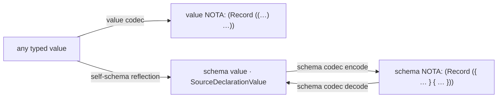

# Universal schema introspection — the schema of any value, all the way down

*schema-designer · report 6 · generalizes the help mechanism (reports
1–5) from "the schema of the contract" to "the schema of **any value**,"
via the same pure schema codec. The structural-forms thesis closing on
itself: a value and its schema are both data, spoken by one codec.*

## The idea

Help renders the schema of the contract's roots. The same mechanism
generalizes: **anything that prints as a NOTA value can also print its
schema** — the same positional shape, but with the declaration
delimiters, so the *kind* of every position is legible at a glance.

Two positionally-aligned views of one datum:

| view | what it shows | delimiters |
|---|---|---|
| **value** | the instance data | the value's own NOTA |
| **schema** | the type at each position | `{ }` struct · `[ ]` enum · bare scalar · `(Vec X)` / `(Optional X)` container |

Worked, on a `Record` instance (illustrative — exact surface is an open
choice below):

```
value :  (Record (( [(Technology (Software (Programming CodeGeneration)))] Decision [a description] Medium Medium Zero [spirit] )
                   ( [ ([a quote] None) ] [reasoning] )))

schema:  (Record  ({ (Vec Domain) [Kind] Description [Magnitude] [Magnitude] [Magnitude] (Vec Referent) }
                   { (Vec VerbatimQuote) Reasoning }))
```

Same nesting, same positions; the delimiters tell you `Entry` is a struct
`{ }`, `Kind` is an enum `[ ]`, `Domains` is a `(Vec …)`, `Description`
is a scalar. You can *see* what everything is.

## Represent the data as a schema internally

To emit the schema of a value, the value's type must be available **as a
schema value** — a `schema-next` declaration value (`SourceDeclarationValue`
and friends), the same internal representation help already projects.
Then schema-output is just `schema_encode(value's schema value)`:
**pure encode through the actual schema encoder, no hand-rolling**, and it
**decodes** back the same way. This is the report-5 discipline made
universal — the schema codec is the only encoder/decoder, NOTA is the
block substrate beneath it.

So every schema-derived type gains a **self-schema**: a macro-generated
reflection (emitted by the schema derive / `schema-rust-next`, alongside
the rkyv + codec impls) that yields the type's schema value. That is the
"macro-generated, compile-time" mechanism from the very first framing —
now for *every* type, not just the contract. Gate it behind the text
feature exactly like help, so daemon (binary-only) builds carry none of
it.



## Help is the special case

Help = the schema of the contract's *roots*. This = the schema of *any
value*. One mechanism: a schema value, encoded/decoded by the schema
codec. `(Help X)` is "give me the schema value for type `X` and encode
it"; the general feature is "give me the schema value for *this* value and
encode it." The help-codec work (running now) is the foundation — it
proves the schema value round-trips through the codec; this generalizes
the *source* of the schema value from "the parsed contract" to "any
value's reflection."

## Why "all the way down" is safe for an instance

A subtle but load-bearing point: the static **type** schema can be
recursive (the spirit `Domain` tree; a `Node { parent: Node }`), which is
why *help* over a type is one-level-navigable. But the schema of an
**instance** mirrors a **concrete, finite value** — the realized data has
no cycles — so "all the way down" **terminates naturally**, with no depth
knob or visited-set. The two flavors:

- **Type schema** (help): the full type, possibly recursive → render
  one level, navigate deeper with `(Help child)`.
- **Instance schema** (this): the realized value's shape, finite →
  expand fully, all the way down, aligned to the actual data.

So instance introspection is the *easier* case structurally — it follows
the data, which is always a finite tree.

## The thesis, closed

`skills/structural-forms.md`: *everything is data conforming to a
schema-defined type; the file is a typed tree; the grammar is the type.*
Universal schema introspection is that thesis turned on the running
system: a **value** is data; its **schema** is also data (a schema
value); **both are spoken by one codec**. Printing the value and printing
its schema are the same act at two altitudes — the second is just the
first with the type at each position and the declaration delimiters that
name the kind.

## Open design choices

1. **Enum positions show the enum NAME — corrected (supersedes an earlier
   "realized arm" draft).** At an enum position the instance-schema shows
   the **enum type name** with the realized variant's payload type if any
   — `(EnumName payload-schema)`, or just `EnumName` when payload-less. It
   shows **neither** the realized variant (`Decision` — that is the value)
   **nor** the variant list (`[Decision …]` — that is Help). Three aligned
   views of one datum: **value** = the variant (`Decision`);
   **instance-schema** = the enum + payload type (`Kind`); **help** = the
   alternatives (`(Help Kind)`). Worked examples and the data+decoder
   mechanism are in report 8 — and operator's
   `reports/schema-operator/3-…` converged on the same: a decoder trace of
   expected types.
2. **The delimiter vocabulary** for the schema view: `{ }` struct, `[ ]`
   enum, bare/`(Name String)` scalar-newtype, `(Vec X)` / `(Optional X)`
   / `(Map K V)` containers, `(Stream { … })` / `(Family { … })` frames.
   This is the report-5 schema declaration grammar, reused verbatim.
3. **Where the self-schema is generated and gated.** The schema derive
   (`schema-rust-next`) emits a `fn schema_value() -> SourceDeclarationValue`
   (or a `Reflect`/`Describe` trait) per type, gated behind the text
   feature like help, so the daemon build omits it. Confirm the trait
   shape and whether it threads the runtime value (for the realized-instance
   view) or only the static type (for the type view) — likely both: a
   static `Type::schema_value()` and a value-walking
   `value.schema_value()`.

This is a natural next epic once the help-codec schema round-trip lands;
it reuses that codec wholesale and only adds the per-type reflection.
