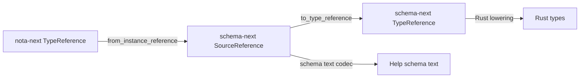
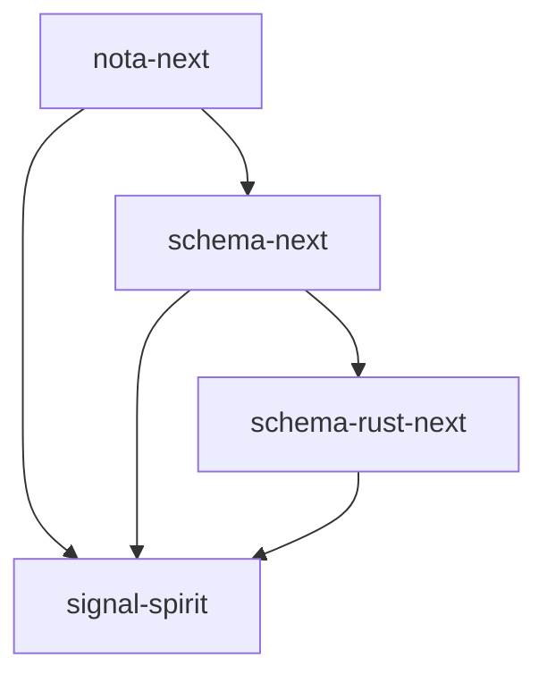
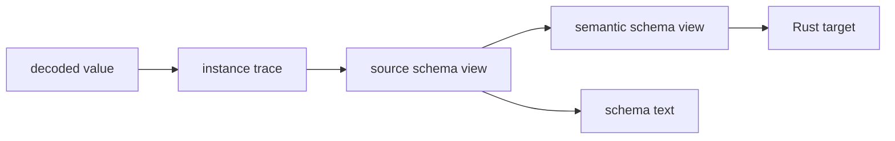
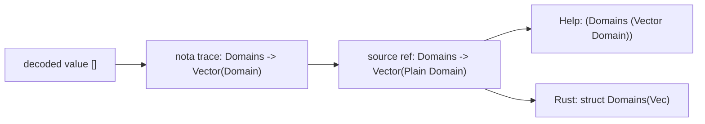

# One IR, Layered Bridge Explainer

*schema-operator · answers the psyche's question about report 9 finding 3:
why "one IR" is true as a design direction but currently implemented as a
layered typed bridge rather than one Rust enum everywhere.*

## The Short Version

There are two different claims that sound similar:

1. **Good claim:** every schema introspection surface should derive from the
   same typed schema facts, not from sibling parsers or hand-rendered strings.
2. **Overstrong claim:** Help, per-instance schema, and Rust lowering all
   literally read the same Rust enum value.

The current code satisfies the good claim for the Spirit pilot. It does not
literally satisfy the overstrong claim.

## The Three Representations



### 1. `nota_next::TypeReference`

This lives in the bottom crate. It is intentionally small:

- `Named(&'static str)`
- `Vector`
- `Optional`
- `Map`
- `FixedBytes`

Its job is not to understand schema declarations. Its job is to let
`NotaDecodeTraced` say, while decoding a real value: "at this value position I
expected `Domains`, or `(Vector Domain)`, or `(Optional Antecedent)`."

That crate must stay below schema-next, so it cannot use schema-next's richer
types without creating the wrong dependency direction.

### 2. `schema_next::SourceReference`

This is the source/schema-codec reference shape:

- `Plain(Name)`
- `FixedBytes`
- `Vector`
- `Optional`
- `ScopeOf`
- `Map`
- `Application { head, arguments }`

Its job is to represent authorable schema reference syntax and render/decode
schema text. Help currently uses this layer because Help's output is a
re-headed schema declaration:

```nota
(Domains (Vector Domain))
(Record { Entry Justification })
(IntentEventStream (Stream { token SubscriptionToken opened SubscriptionStarted event IntentEvent close SubscriptionToken }))
```

That is why Help stores `SourceDeclarationValue` / `SourceReference`: the
source codec already owns exactly the syntax Help prints and decodes back.

### 3. `schema_next::TypeReference`

This is the semantic schema reference used after source lowering. It is richer
where lowerers need richer meaning:

- scalar leaves are explicit variants (`String`, `Integer`, `Boolean`, `Path`,
  `Bytes`);
- declared names are `Plain(Name)`;
- containers are canonical (`Vector`, `Map`, `Optional`, `ScopeOf`);
- applications have an `ApplicationHead` and typed arguments.

Rust lowering mostly consumes this semantic form and turns it into Rust target
syntax: `Vector` becomes `Vec<T>`, `Optional` becomes `Option<T>`, `Map`
becomes `BTreeMap<K, V>`, and so on.

## Why This Is Not Automatically Bad

The stack has real layering constraints:



`nota-next` is the raw NOTA/codec layer. It cannot depend on schema-next just
to name instance-schema references. If it did, the seed layer would know schema
semantics, which breaks the architecture.

So a small `nota_next::TypeReference` is legitimate as a lower-layer trace
vocabulary. The important discipline is that higher layers lift it into schema
vocabulary before rendering schema text. That is exactly what
`SourceReference::from_instance_reference` does.

## Where The Risk Is

The bridge is currently good for the shapes Spirit uses heavily:


But it is not a proven full isomorphism for every reference shape in
schema-next. For example, schema-rust-next's instance-trace emission maps
uncommon semantic references outside the basic cases through a fallback:

```text
Scope and other compound references are not used at optional leaf positions
in the spirit taxonomy; name them by their rendered form so the trace stays total.
```

That means the trace is **total** — it will produce something — but not
guaranteed **lossless** for every future reference form. If a future schema
feature depends on `ScopeOf` or generic `Application` showing up inside
per-instance schema, we need a bridge test and probably a richer
`nota_next::TypeReference`.

This is why I called the current wording a risk, not a bug. It can mislead a
future implementer into thinking every representation is already identical and
fully lossless.

## What "One IR" Should Mean Here

The clean meaning is:

```text
Every projection is generated from typed schema facts and round-trips through
the owning codec for its layer. No projection owns a sibling parser, sibling
AST, or hand text printer.
```

That is stronger than "we happen to print the same strings" and weaker than
"there is exactly one enum in the whole stack."

Better phrase:

> one canonical schema reference spine, with source, semantic, and
> instance-trace representations connected by typed projections.

The spine is the invariant:



The important thing is every arrow is typed and tested. There is no text
parser/printer hiding inside an arrow.

## What Would Literal One-Type IR Require?

A literal one-type design would require one of these:

1. Move a shared reference enum into a new crate below both nota-next and
   schema-next.
2. Move instance schema out of nota-next and into schema-next, so it can use
   schema-next's reference types directly.
3. Make nota-next depend on schema-next.

Option 3 violates the layer. Option 2 weakens the idea that traced decode is a
base codec feature. Option 1 is plausible only if the reference vocabulary is
truly schema-independent. Today it is not obviously schema-independent because
`Application`, `ScopeOf`, scalar leaves, and import-aware semantic heads belong
to schema meaning, not raw NOTA.

So I would not force literal one-type IR yet. I would make the bridge explicit,
then grow it only when a real reference form proves the lower trace vocabulary
is too small.

## Concrete Example

For `Domains`:



This is working and tested:

- per-instance schema of an empty `Domains` value expands to
  `(Domains (Vector Domain))`;
- `(Help Domains)` renders `(Domains (Vector Domain))`;
- both compare through `SourceReference`, not string coincidence.

For a future `GenericBox<T>` or `ScopeOf<T>` position, we should not assume the
same proof exists. Add the bridge test first, then widen the lower trace type
if needed.

## Operator Recommendation

Keep the layered bridge. Correct the wording. Add a standard bridge test every
time schema-next gains a new reference form or an existing form starts appearing
inside generated `NotaDecodeTraced` output.

The invariant to enforce is:

```text
help_reference(type) == lift(instance_schema_reference(value_of_type))
```

for every reference form the schema stack claims to support in introspection.

That keeps the design honest without collapsing the crate layers prematurely.
