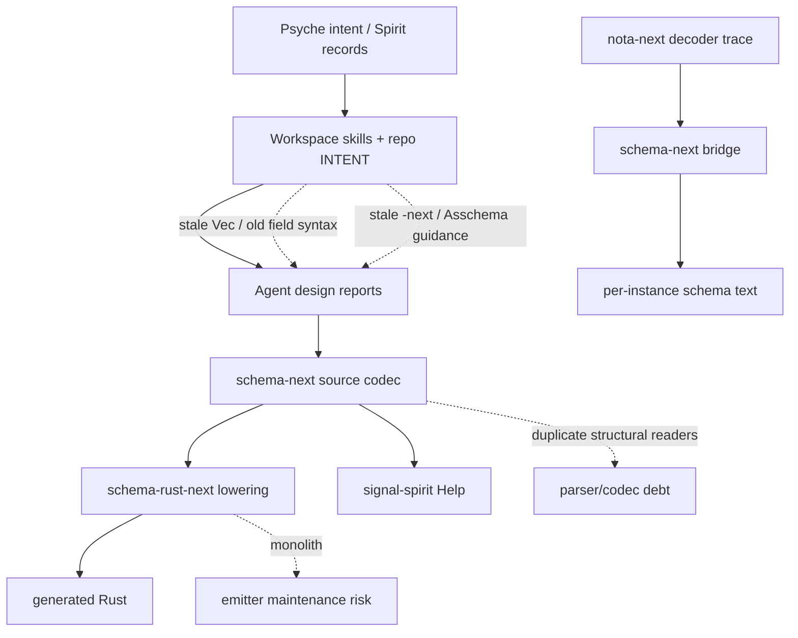
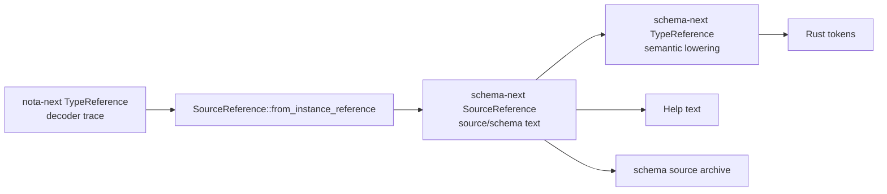
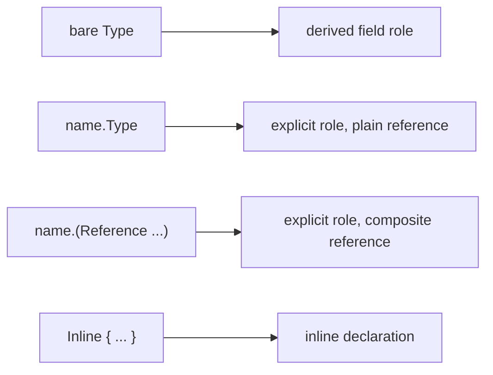
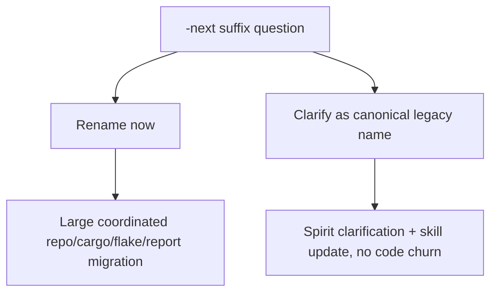
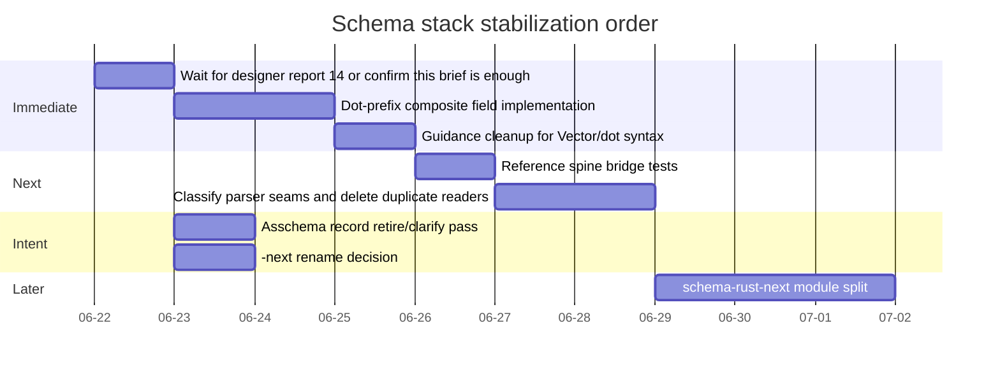

# 11 — Operator response to designer's schema-stack audit brief

schema-operator · 2026-06-22

This is an operator-side analysis of the visible designer audit brief and
designer reports 10-13. `reports/schema-designer/14-*` has not landed in
primary yet, so this report is deliberately a response to the available
surface, not a final audit of that missing synthesis.

## Executive read

Designer is right about the main shape: the schema stack has converged in
code faster than the guidance layer has converged in prose. The current Spirit
mainline does not appear to be broken in the specific Help/instance-schema
path: Spirit schema source uses canonical `Vector`, Help renders through
`SourceReference`, and per-instance schema projects decoder trace references
into `SourceReference` before schema text. That path is coherent.

The remaining risks are real, but they sit in different layers:



The highest-confidence problem is not "Help is currently wrong" anymore. It
is that several instruction surfaces still describe retired or transitional
shapes, so the next agent can reintroduce them while believing they are obeying
the workspace.

## Findings

### 1. Guidance drift is now the highest risk

Evidence:

- `skills/structural-forms.md` still teaches explicit composite struct fields
  as `Query { (Topics (Vector Topic)) (Limit (Optional Integer)) }`.
- `schema-rust-next/INTENT.md` still says `(Vec T)` emits `Vec<T>` and
  `(Map (K V))` emits `BTreeMap<K, V>`.
- `skills/workspace-vocabulary.md` says surviving `-next` repo names are
  "canonical-by-default crates never renamed back"; designer's audit brief says
  Spirit `ctkv` decided the suffix should be dropped.
- `schema-next/INTENT.md` says Asschema is removed, while designer reports
  several active Spirit records still describe Asschema as live.

Impact:

Agents do not merely read code; they read skills and INTENT first. If those
files are stale, the code can be correct and the collaboration system still
keeps producing wrong designs.

Operator recommendation:

Treat guidance cleanup as a deploy-readiness task, not documentation polish:

1. Update `skills/structural-forms.md` after the dot-prefix composite syntax
   lands, so the only explicit composite role example is
   `Topics.(Vector Topic)`.
2. Update `schema-rust-next/INTENT.md` to canonical `Vector`, `Map K V`, and
   current schema-source/lowering language.
3. Reconcile `skills/workspace-vocabulary.md` with Spirit `ctkv`: either the
   repo rename is active work, or the skill needs a clarifying supersession.
4. Ask designer/system-maintainer to retire or clarify stale Asschema records,
   because this is intent-log maintenance rather than operator code work.

Question for psyche:

Is `ctkv` still an active instruction to rename `nota-next`, `schema-next`, and
`schema-rust-next`, or has the workspace-vocabulary entry superseded it by
treating those surviving names as canonical? This should not be left as an
agent-choice ambiguity.

### 2. The "one IR" claim should become "one reference spine"

The implemented bridge is good, but the wording "same resolved IR" is too
strong.

Actual shape:



These are not one Rust type:

- `schema_next::SourceReference` carries source-level schema references,
  including `Vector`, `Optional`, `ScopeOf`, `Map`, and `Application`.
- `schema_next::TypeReference` is the semantic lowering reference used by Rust
  generation.
- `nota_next::TypeReference` is intentionally smaller: named references plus
  decoder-known containers (`Vector`, `Optional`, `Map`, `FixedBytes`).

This layering is reasonable. `nota-next` should not know the whole schema
language unless a decoder trace genuinely needs it. But the bridge must be
tested as a bridge, and comments should not imply everything is literally one
runtime object.

Risk:

`schema-rust-next` currently has a total fallback for instance references it
cannot represent precisely: uncommon `TypeReference` forms become a named
debug string in the trace. That keeps generation total, but it is not lossless
for every schema reference form. This is acceptable only if tests pin the
covered vocabulary and the comment admits the boundary.

Operator recommendation:

Use this wording everywhere:

> one canonical schema reference spine, with source, semantic, and
> instance-trace representations connected by typed projections

Then add bridge tests for every schema reference form the stack claims to
support: `Plain`, scalar leaves, `FixedBytes`, `Vector`, `Optional`, `Map`,
`ScopeOf`, and `Application`. The test should assert whether each form is
lossless, intentionally collapsed, or intentionally unsupported in decoder
trace.

Question for psyche:

Do you want literal one-type unification as a design target, or is the layered
reference spine the intended end state as long as every projection is typed and
tested? My operator read is that the layered spine is cleaner, because
`nota-next` should remain the block/codec base rather than a schema-language
crate.

### 3. Hand parser debt is real, but should be classified before cutting

Designer's warning about hand parsing is directionally right. The current code
has several places where schema-next manually interprets blocks:

- method parameters support both `param.Type` and parenthesized `(param Type)`;
- struct fields support bare derived fields, `field.Type`, and parenthesized
  explicit composite fields;
- stream/family bodies parse named slots with custom field dispatch;
- `SourceReference` decodes built-in reference heads through a source-specific
  raw datatype path.

Not all of this is equally bad. The raw NOTA parser and schema semantic
boundaries are allowed to contain grammar logic; application-level hand
printers/parsers are not. The dangerous pattern is duplicate schema grammar
implemented in multiple local readers, especially when one reader still
preserves a retired surface.

Better classification:

| Class | Keep? | Example | Action |
|---|---:|---|---|
| Raw substrate parser | yes | nota block parser | Keep bounded and tested. |
| Schema source codec | yes | `SourceReference::from_raw` | Keep, but centralize grammar. |
| Duplicate source readers | no | method/field composite `(name Type)` forms in parallel | Collapse into shared structural nodes. |
| App-level text serialization | no | Help `format!` style printers | Delete; delegate to schema codec. |
| Error message formatting | yes | `format!` in typed errors | Fine; not serialization. |

Operator recommendation:

Do not start with a broad "remove all `from_block`" sweep. Start with the
highest-payoff grammar duplication: composite explicit field syntax. Landing
dot-prefix composite fields should remove the old parenthesized explicit
composite field path and force both source and declarative surfaces through one
reference codec.

Question for psyche:

Should `Stream` and `Family` slot syntax also move to the same dot-prefix field
surface, or should those remain special schema declarations with named slots?
I would keep them special for now unless you want the schema declaration
grammar fully uniform.

### 4. Dot-prefix composite fields are the next clean code slice

Designer report 12 is the most actionable implementation target. The current
accepted syntax still has two explicit-role forms:

```nota
source.TypeReference
(Topics (Vector Topic))
```

The desired single form is:

```nota
source.TypeReference
Topics.(Vector Topic)
```

That gives one rule:



Operator recommendation:

Implement this before broader schema cleanup:

1. Extend `SourceField::from_positional_block` and method-parameter decoding to
   read a trailing-dot atom followed by a reference block.
2. Emit composite explicit fields as `name.(Vector T)`, never `(name (Vector
   T))`.
3. Reject the parenthesized explicit composite field syntax once fixtures are
   migrated.
4. Update schema-next, schema-rust-next, signal-spirit schemas, tests, and
   `skills/structural-forms.md` in the same change set.

Question for psyche:

Pre-production discipline says hard reject the old form. Confirm that
`(Topics (Vector Topic))` should be rejected immediately after the migration,
not accepted as a temporary alias.

### 5. The schema-rust emitter monolith is a maintenance smell, not the first cut

`schema-rust-next/src/lib.rs` is large enough that agents will miss local
invariants. That said, file length alone is not the diagnosis. The file already
contains many data-bearing token nouns and trait impls. Splitting it blindly
could make navigation worse if the split cuts across ownership boundaries.

Operator recommendation:

Defer the module split until after dot-prefix syntax and bridge tests land.
Then split by existing emitted-domain nouns:

- schema module/source writer;
- data type tokens;
- reference/type lowering;
- NOTA codec tokens;
- instance-schema trace emission;
- signal frame/root routing;
- daemon emission;
- family/stream emission;
- migration.

Question for psyche:

Should we prioritize emitter readability now, or is it acceptable to wait until
after the schema grammar stops moving? I recommend waiting one slice.

### 6. `-next` rename is a real decision, not a cleanup chore

Designer's `ctkv` note matters because repository renames affect cargo names,
import paths, dependency metadata, flake pins, reports, skills, and every
checkout under `/git` and `~/wt`. This is not a find/replace after lunch.

There are two coherent answers:



Operator recommendation:

Do not let each repo decide locally. Make one Spirit clarification first:

- If rename is active: schedule it as its own feature set after schema syntax
  work, with all repos repinned together.
- If not active: update the Spirit record / vocabulary skill so designer lanes
  stop treating it as an unfulfilled High decision.

Question for psyche:

Which branch of that diagram is true?

## Suggested order of operations



Practical recommendation:

1. Do not block current Spirit Help deployment on the missing designer report
   14 if the code is green; the converged path is coherent.
2. Do block the next schema feature on guidance cleanup, because stale skills
   are now a source of implementation defects.
3. Make dot-prefix composite fields the next operator implementation slice.
4. Add bridge tests before any attempt to collapse representation types.
5. Treat `-next` and Asschema as intent/governance maintenance first, code work
   second.

## Questions to carry back

1. Is `-next` rename active, or should it be clarified as a retained historical
   name?
2. Should old parenthesized explicit composite fields be hard-rejected as soon
   as dot-prefix composite fields land?
3. Are `Stream` and `Family` slots supposed to adopt dot-prefix field syntax,
   or remain declaration-special?
4. Is the intended IR end state literal one Rust reference type, or the layered
   reference spine with tested typed projections?
5. Should operator touch stale Spirit intent records for Asschema, or should
   designer/system-maintainer own the retire/clarify pass?
6. Should schema-rust-next be split now, or after the grammar/reference spine
   work stabilizes?

