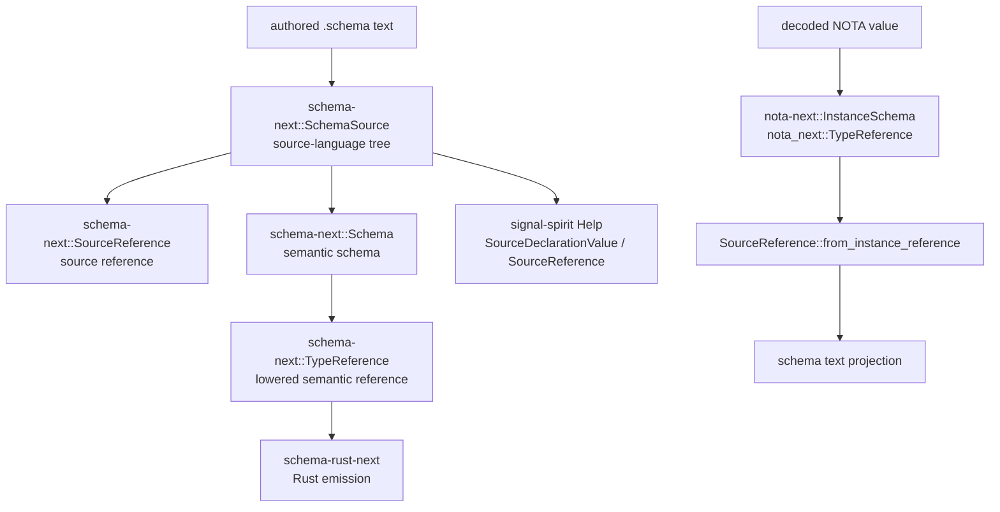
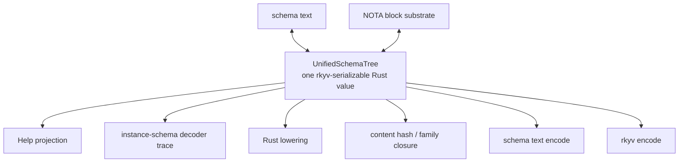
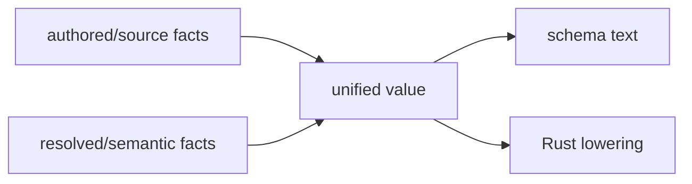
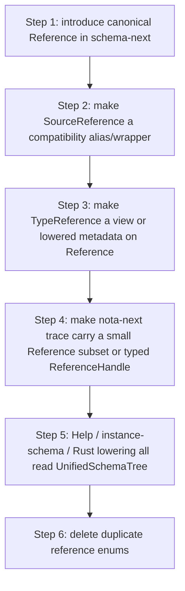

# 12 — One data-instance IR: current state and target

schema-operator · 2026-06-22

This responds to the psyche preference: one Rust-serializable defined data
instance — a tree of specified data that can encode/decode through schema text,
NOTA where appropriate, and rkyv — rather than several almost-equivalent
representations bridged by projections.

## Short answer

Yes, that target is coherent and more elegant than the current bridge. It is
not what is implemented today.

Today the stack has one canonical *meaning* but several Rust data shapes:



That is a typed bridge, not a single data instance.

Your target would look more like this:



The important part: `UnifiedSchemaTree` is not "schema" as text and not "NOTA"
as raw blocks. It is the typed Rust domain value. Schema text and NOTA blocks
are codecs around it.

## What is implemented now

### 1. Source reference

`schema_next::SourceReference` is the source-facing tree:

```rust
pub enum SourceReference {
    Plain(Name),
    FixedBytes(u64),
    Vector(Box<SourceReference>),
    Optional(Box<SourceReference>),
    ScopeOf(Box<SourceReference>),
    Map(Box<SourceReference>, Box<SourceReference>),
    Application { head: Name, arguments: Vec<SourceReference> },
}
```

It is rkyv-serializable and it owns schema text projection for source
references. Help now reads this side, which is why Help and schema text agree
on canonical `Vector`.

### 2. Semantic reference

`schema_next::TypeReference` is the lowered semantic tree:

```rust
pub enum TypeReference {
    String,
    Integer,
    Boolean,
    Path,
    Bytes,
    FixedBytes(u64),
    Plain(Name),
    Vector(Box<TypeReference>),
    Map(Box<TypeReference>, Box<TypeReference>),
    Optional(Box<TypeReference>),
    ScopeOf(Box<TypeReference>),
    Application { head: ApplicationHead, arguments: Vec<TypeReference> },
}
```

This is close to `SourceReference`, but it includes scalar leaves as explicit
variants and uses `ApplicationHead` instead of just `Name`. Rust lowering reads
this side.

### 3. Decoder-trace reference

`nota_next::TypeReference` is much smaller:

```rust
pub enum TypeReference {
    Named(&'static str),
    Vector(Box<TypeReference>),
    Optional(Box<TypeReference>),
    Map(Box<TypeReference>, Box<TypeReference>),
    FixedBytes(usize),
}
```

This exists because the NOTA decoder is tracing the type it expected while it
decodes a real value. It intentionally does not know the whole schema language.
Then schema-next lifts it into `SourceReference` with
`SourceReference::from_instance_reference`.

### 4. Result

Current architecture:

- typed: yes;
- data-driven: mostly yes;
- rkyv-serializable: yes for source/semantic schema surfaces;
- one object: no;
- one reference datatype: no;
- schema text codec as the single textual authority: increasingly yes;
- perfect bridge coverage: not yet.

The phrase "one IR" is therefore currently too strong. A better description
for the implementation is:

> one schema meaning, carried through source, semantic, and instance-trace
> trees by typed projections

## What one data-instance would mean

The target is a single Rust datatype family that can represent the thing before
any consumer asks for a view:

```rust
pub struct SchemaModule {
    imports: Vec<Import>,
    input: Root,
    output: Root,
    declarations: Vec<Declaration>,
}

pub enum DeclarationBody {
    Reference(Reference),
    Struct(StructBody),
    Enum(EnumBody),
    Stream(StreamBody),
    Family(FamilyBody),
}

pub enum Reference {
    Scalar(Scalar),
    Named(Name),
    FixedBytes(u64),
    Vector(Box<Reference>),
    Optional(Box<Reference>),
    ScopeOf(Box<Reference>),
    Map(Box<Reference>, Box<Reference>),
    Application { head: ApplicationHead, arguments: Vec<Reference> },
}
```

Then every feature is a method/projection over that same tree:

| Consumer | Reads unified value | Emits |
|---|---|---|
| schema text codec | `SchemaModule` | canonical `.schema` text |
| rkyv codec | `SchemaModule` | binary schema artifact |
| Help | `SchemaModule` + query name | one-level `DeclarationBody` view |
| Rust lowering | `SchemaModule` | generated Rust tokens |
| instance-schema trace | `Reference` + decoded value shape | per-instance schema tree |
| content identity | `SchemaModule` / closure | blake3 over canonical rkyv |

This is what I understand you to mean by "one data instance."

## The main design tension

The one-type target is elegant, but it has to handle one distinction cleanly:



Source facts and semantic facts are not always identical:

- `Name` versus resolved imported ownership;
- scalar words like `String` as authored names versus scalar variants;
- generic application head as local text versus resolved application head;
- stream/family declarations as source declarations versus semantic metadata;
- inline declarations and visibility;
- provenance such as root variant payload wrappers.

A single data instance can still work, but it probably needs layered fields
inside the same tree, not a flattened enum that forgets source or resolution:

```rust
pub struct Reference {
    source: ReferenceSyntax,
    resolved: Option<ResolvedReference>,
}
```

or:

```rust
pub enum Reference {
    Scalar(Scalar),
    Named(NamedReference),       // can carry local/import identity
    Vector(Box<Reference>),
    Application(ApplicationReference),
}
```

The wrong version of "one type" would erase needed distinctions and recreate
hidden side tables. The right version makes the distinctions explicit inside
one serializable tree.

## Migration path I recommend

Do not collapse everything in one edit. Make the current three-reference bridge
prove the target first.



Concrete first slice:

1. Add a new `schema_next::Reference` that can express both current
   `SourceReference` and `TypeReference`.
2. Add `From<SourceReference> for Reference` and `TryFrom<Reference> for
   SourceReference` only while migrating.
3. Add golden bridge tests for every reference form.
4. Move Help to `Reference`.
5. Move Rust lowering to `Reference`.
6. Only then decide whether `nota-next::TypeReference` should become the same
   type, a borrowed subset, or a trace-specific wrapper. `nota-next` may not be
   allowed to depend on schema-next without inverting crate layering.

That last point is important: literal one type across crates may force
`nota-next` to know schema-next, which would be backwards. The likely clean
shape is:

- one schema IR type in `schema-next`;
- decoder trace carries either generated schema references from the consumer
  crate, or a small codec-neutral reference seed that schema-next can lift
  losslessly;
- no duplicate source/semantic reference types inside schema-next.

So the strongest feasible version may be "one schema IR data instance" rather
than "one Rust enum imported by every crate including nota-next."

## Questions

1. Should the one data instance live in `schema-next`, with `nota-next`
   remaining the raw NOTA/codec substrate?
2. Is it acceptable for decoded instance traces to carry references generated
   from the schema IR, instead of using `nota_next::TypeReference`?
3. Do you want the unified value to preserve source provenance and resolution
   in the same tree, or should it be purely semantic after decode?
4. Should the dot-prefix syntax work wait until this IR unification starts, or
   should it land first as a grammar cleanup on the current bridge?

