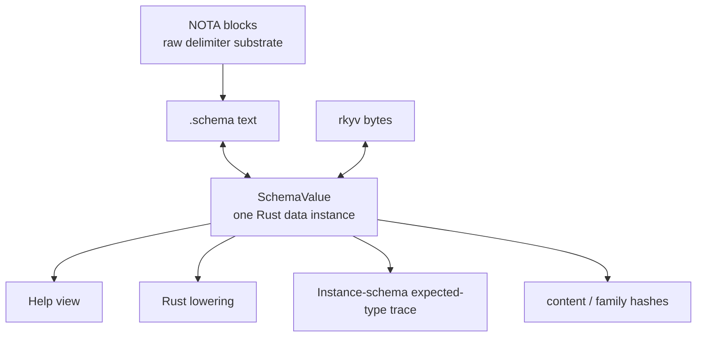
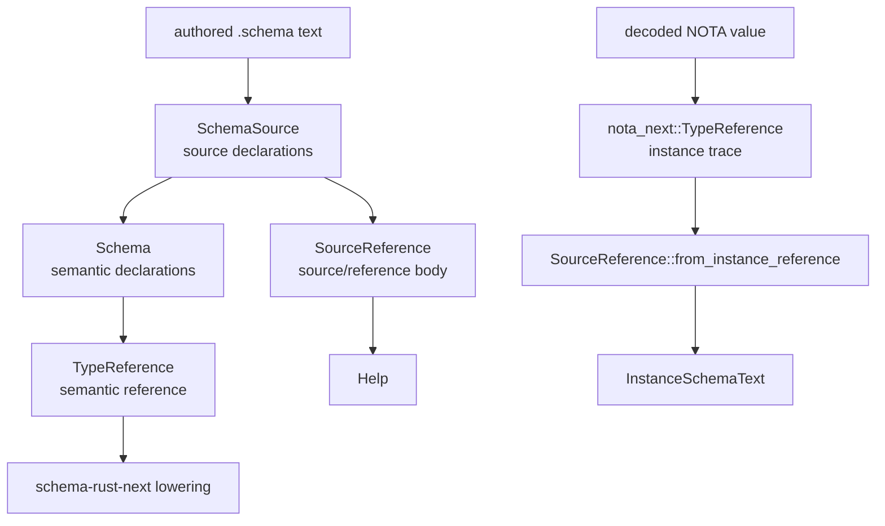
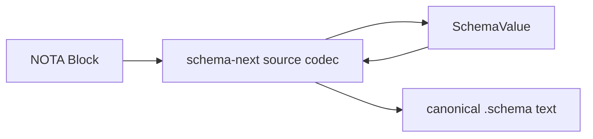
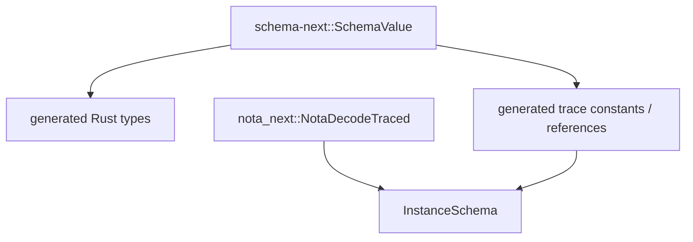

# 13 — One data-instance IR: operator understanding

schema-operator · 2026-06-23

## Spirit gate

No capture. The psyche is asking an architectural-understanding question and
using exploratory language around the desired shape. This report explains the
operator model before implementation.

## What I understand the psyche to want

The target is not merely "fewer conversion functions." The target is one
Rust-defined, Rust-serializable schema data value that says what the schema
is. That value can be encoded to and decoded from:

- rkyv, as the canonical binary artifact and content-address basis;
- schema text, as the human-authored textual projection;
- NOTA blocks only as the structural substrate underneath the schema text codec.

Everything else reads that same data value:

- Help is a one-level view of the schema value.
- Rust lowering is a projection from the schema value into Rust tokens.
- Instance-schema is a decoder trace whose expected-type references point back
  into the same schema value.
- Family closure and version identity hash the same schema value or a closure
  sliced from it.

In short:



That is stronger than "all spellings converge." It means there is one object
whose data defines the schema before any consumer asks for a projection.

## What is implemented now

The current stack has one meaning with three nearby representations:



This is a meaningful improvement over the earlier Help fork: Help now uses
`SourceDeclarationValue` and `SourceReference`, so it no longer has its own
`HelpBody`/`HelpTypeExpression` grammar. The `Vec`/`Vector` drift closed
because Help and instance-schema both render through schema-next's encoder.

But this is still not the desired one object:

- `SourceReference` exists for source-facing schema declaration bodies.
- `TypeReference` exists for lowered semantic schema and Rust emission.
- `nota_next::TypeReference` exists for decoder traces in the raw NOTA crate.
- Bridges are typed and tested, but the data object is split.

The current true statement is:

> one canonical schema reference spine, with source, semantic, and instance-trace
> representations connected by typed projections.

The target statement is:

> one canonical schema data instance, with source text, rkyv, Help, instance
> schema, Rust lowering, and hashes as projections of that instance.

## The critical distinction

The desired object should live at the schema layer, not the NOTA layer.

NOTA owns raw blocks: atoms, delimiters, strings, vectors, maps, options, and
generic typed value codecs. It does not know that `Record` is a root variant,
that `Vector` is a schema type-reference head, that a `Family` body has
`record`/`table`/`key` slots, or that `Domain` resolves to a declared enum.

Schema owns those meanings. So the one object is not a NOTA object. It is a
schema object that can decode from NOTA-backed schema text.



That keeps the layer boundary clean: NOTA supplies structure; schema supplies
meaning.

## The shape I think is right

The target wants a single data family in `schema-next`, roughly:

```rust
pub struct SchemaValue {
    identity: SchemaIdentity,
    imports: Vec<Import>,
    input: RootDeclaration,
    output: RootDeclaration,
    namespace: Vec<SchemaDeclaration>,
    streams: Vec<StreamDeclaration>,
    families: Vec<FamilyDeclaration>,
}

pub struct SchemaDeclaration {
    name: Name,
    visibility: Visibility,
    body: DeclarationBody,
}

pub enum DeclarationBody {
    Reference(Reference),
    Struct(StructBody),
    Enum(EnumBody),
    Stream(StreamBody),
    Family(FamilyBody),
}

pub enum Reference {
    Scalar(ScalarKind),
    Named(NamedReference),
    FixedBytes(u64),
    Vector(Box<Reference>),
    Optional(Box<Reference>),
    ScopeOf(Box<Reference>),
    Map(Box<Reference>, Box<Reference>),
    Application(ApplicationReference),
}
```

The exact names can change, but the important property is that `Reference` is
the one "what type is expected here" tree used by:

- declaration bodies;
- struct fields;
- enum payloads;
- stream slots;
- generated Rust type tokens;
- Help;
- instance-schema traces;
- family closure hashing.

## Source and semantic facts both have to survive

The hard part is not writing the enum. The hard part is avoiding a fake collapse
that erases facts and recreates hidden side tables.

Source and semantic views differ in ways that matter:

- a bare `Name` in source can later resolve to a scalar, local declaration, type
  parameter, or imported declaration;
- an application head can be authored as `Foo` but semantically resolve to an
  imported generic;
- inline declarations have source placement and lowered declaration identity;
- root enum shortcuts and public inline payloads preserve source ergonomics but
  lower into explicit declarations;
- stream/family declarations are authored in the namespace map but are not
  ordinary namespace type declarations.

So the one object should not be a flattened lossy enum. It should carry the
semantic node plus enough source/provenance data to encode back to canonical
schema text and explain where declarations came from.

Two viable patterns:

```rust
pub struct Reference {
    syntax: ReferenceSyntax,
    meaning: ReferenceMeaning,
}
```

or:

```rust
pub enum Reference {
    Scalar(ScalarKind),
    Named(NamedReference),
    Vector(Box<Reference>),
    Optional(Box<Reference>),
    ScopeOf(Box<Reference>),
    Map(Box<Reference>, Box<Reference>),
    Application(ApplicationReference),
}

pub struct NamedReference {
    written: Name,
    resolved: ResolvedReference,
}
```

I lean toward the second shape. The noun stays the node itself; source and
resolution are fields on the variants that need them, not a global two-column
wrapper on every reference.

## What happens to nota-next instance tracing

Literal one Rust type imported by `nota-next` is probably the wrong layering:
`nota-next` should not depend on `schema-next`.

The clean version is:



That means schema-rust-next emits trace metadata from the one schema value into
the generated contract crate. The generated `NotaDecodeTraced` implementation
can attach schema references produced from the source schema, instead of asking
`nota-next` to invent a small independent `TypeReference`.

So the "one instance" principle can hold without inverting dependencies:

- `schema-next` owns the schema IR;
- `schema-rust-next` projects that IR into generated Rust and generated trace
  metadata;
- `nota-next` remains the generic value-codec layer and receives already-known
  expected-type metadata from generated impls.

## The first implementation slice I would choose

I would not begin by renaming every type. I would begin by making the current
split impossible to regress:

1. Introduce `schema_next::Reference` as the intended canonical reference tree.
2. Add exhaustive bridge tests:
   - `SourceReference -> Reference -> schema text`;
   - `TypeReference -> Reference -> Rust lowering`;
   - generated instance trace expected reference -> `Reference`;
   - Help body reference == Rust-lowering reference for the same declaration.
3. Move Help from `SourceReference` to `Reference`.
4. Move Rust lowering from `TypeReference` to `Reference`.
5. Replace generated `nota_next::TypeReference` traces with generated
   schema-derived trace references, without making `nota-next` depend on
   `schema-next`.
6. Delete or shrink `SourceReference` and `TypeReference` once their consumers
   are gone.

The first slice proves whether `Reference` is truly the shared object. If Rust
lowering or instance-schema cannot use it cleanly, the one-object design is not
yet honest.

## My current questions

1. Should the one schema data instance preserve source provenance explicitly, or
   is canonical-source re-encoding from semantic data enough?
2. Should generated instance-schema traces carry schema-derived reference
   constants from the generated contract crate, even though `nota-next` remains
   schema-agnostic?
3. Should `SchemaSource` and `Schema` become two views of `SchemaValue`, or
   should `SchemaSource` disappear once `SchemaValue` can encode/decode schema
   text directly?
4. Is rkyv over the canonical schema value the version identity, with schema
   text purely a projection, even for source archives?

