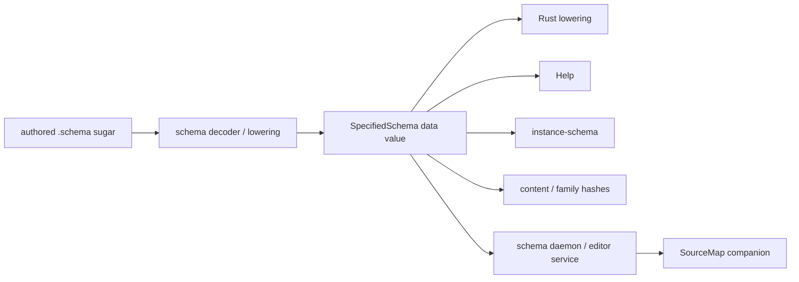
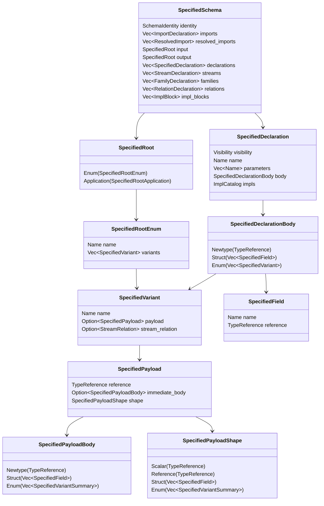
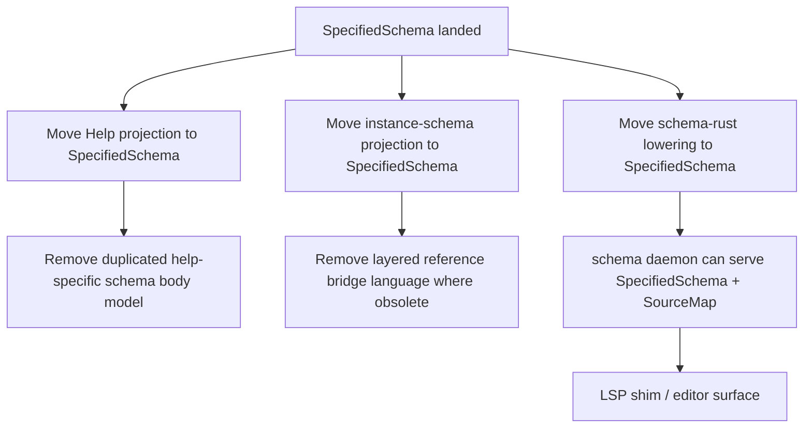

# Fully Specified Schema IR Implementation

*schema-operator · report 14 · implementation slice landed in `schema-next` main*

## Result

`schema-next` now has a first-class, Rust-defined, rkyv-serializable fully
specified schema value:

```rust
SpecifiedSchema
```

This is the first concrete implementation of the idea the psyche corrected:
authored `.schema` is sugar; the real object is a fully specified data value.
The new direct entry point is:

```rust
SchemaEngine::lower_specified_source(source, identity) -> Result<SpecifiedSchema, SchemaError>
```

The implementation is on `schema-next` main:

| Commit | Meaning |
|---|---|
| `818292cc` | `schema-next: introduce fully specified schema IR projection` |
| `80b587c6` | `schema-next: expose direct specified schema lowering` |

Tested:

```text
cargo fmt --check
cargo test specified_schema -- --nocapture
cargo test
```

All green.

## Mental Model



Important split:

| Artifact | Owns |
|---|---|
| `.schema` source | authoring shorthand, comments, order, source ranges |
| `SpecifiedSchema` | explicit semantic facts |
| `SourceMap` companion, not implemented in this slice | file/range/origin/provenance facts for editor service |

The IR does not need source fidelity to be the truth. It needs semantic
completeness. A schema daemon can keep `SpecifiedSchema + SourceMap`; Help
only needs `SpecifiedSchema`.

## Input Fixture

The test fixture intentionally uses the newer explicit field-prefix syntax
where it adds information:

```schema
{}
[Record Observe Version]
[RecordAccepted]
{
  Record RecordRequest
  Observe Query
  RecordAccepted RecordIdentifier
  RecordRequest { record_entry.Entry record_reason.Justification }
  Entry { domains.(Vector Domain) Kind Description Certainty Importance Privacy Referents }
  Justification { Testimony Reasoning }
  Query { filter.DomainMatch limit.(Optional Integer) }
  Domains (Vector Domain)
  Testimony (Vector VerbatimQuote)
  VerbatimQuote { QuoteText OptionalAntecedent }
  OptionalAntecedent (Optional Antecedent)
  Antecedent String
  QuoteText String
  Reasoning String
  Description String
  Referents (Vector String)
  RecordIdentifier String
  Domain [Health Technology]
  DomainMatch [Any Partial Full]
  Kind [Decision Principle Correction Clarification Constraint]
  Certainty Magnitude
  Importance Magnitude
  Privacy Magnitude
  Magnitude [Zero Minimum VeryLow Low Medium High VeryHigh Maximum]
}
```

This source is sugar. The test path does not hand-parse it. It goes through:

```rust
SchemaEngine::default().lower_specified_source(source, identity)
```

## Output Shape

The root enum becomes explicit data:

```text
SpecifiedSchema
  input: SpecifiedRoot::Enum
    name: Input
    variants:
      Record
        payload.reference: Record
        payload.immediate_body: Newtype(RecordRequest)
        payload.shape: Struct
          record_entry -> Entry
          record_reason -> Justification
      Observe
        payload.reference: Observe
      Version
        payload: None
  output: SpecifiedRoot::Enum
    name: Output
    variants:
      RecordAccepted
        payload.reference: RecordAccepted
        payload.immediate_body: Newtype(RecordIdentifier)
        payload.shape: Scalar(String)
```

Namespace declarations remain explicit once:

```text
Entry:
  Struct
    domains -> Vector(Domain)
    kind -> Kind
    description -> Description
    certainty -> Certainty
    importance -> Importance
    privacy -> Privacy
    referents -> Referents

Kind:
  Enum
    Decision
    Principle
    Correction
    Clarification
    Constraint

Certainty:
  Newtype(Magnitude)
```

## Datatype Inventory



## Why Payload Summaries Are Bounded

The first compile attempt exposed a real design issue: if a variant payload
contains a fully expanded declaration body, and enum bodies contain variants,
then the archive graph is recursively shaped:

```text
Variant -> Payload -> DeclarationBody::Enum -> Variant -> ...
```

That is not a good first-class serialized value. The landed design uses two
levels:

| Position | Carries |
|---|---|
| `SpecifiedDeclarationBody::Enum(Vec<SpecifiedVariant>)` | full enum declaration in the namespace/root |
| `SpecifiedPayloadBody::Enum(Vec<SpecifiedVariantSummary>)` | bounded payload summary: variant name, payload reference, stream relation |
| `SpecifiedPayloadShape::Enum(Vec<SpecifiedVariantSummary>)` | bounded shape summary after transparent newtype following |

This keeps the data finite and still explicit. Alternatives live once on the
enum declaration. Payloads point at them by reference and can carry a bounded
summary for local consumers.

## Explicit Field Syntax Result

Input sugar:

```schema
RecordRequest { record_entry.Entry record_reason.Justification }
Entry { domains.(Vector Domain) Kind Description Certainty Importance Privacy Referents }
Query { filter.DomainMatch limit.(Optional Integer) }
```

Decoded facts:

```text
RecordRequest:
  record_entry -> Entry
  record_reason -> Justification

Entry:
  domains -> Vector(Domain)
  kind -> Kind
  description -> Description
  certainty -> Certainty
  importance -> Importance
  privacy -> Privacy
  referents -> Referents

Query:
  filter -> DomainMatch
  limit -> Optional(Integer)
```

The decoder still rejects redundant explicit spellings such as
`domain_match.DomainMatch`. That rule is still in force.

## Codec State

| Codec | State |
|---|---|
| rkyv | Implemented and tested by `SpecifiedSchema::to_binary_bytes` / `SpecifiedSchema::from_binary_bytes` |
| NOTA typed data | Derives `NotaEncode` / `NotaDecode` for the data value surface |
| schema sugar | Decoded through the existing schema engine into `SpecifiedSchema` via `lower_specified_source` |
| schema source map | Not implemented in this slice |

The important point: the schema sugar path is decoder-driven. No new hand
parser was introduced. The projection is a typed fold over the already-lowered
semantic schema.

## Tests Added

| Test | Pins |
|---|---|
| `specified_schema_makes_root_variants_and_payload_shapes_explicit` | root `Record` payload reference, immediate newtype body, collapsed struct shape |
| `specified_schema_keeps_namespace_declarations_as_explicit_data` | declarations keep field names and type references as data; enum alternatives live on the enum |
| `specified_schema_summarizes_enum_payloads_without_recursive_expansion` | transparent newtype chain reaches scalar without duplicating declaration graph |
| `specified_schema_is_a_rkyv_serializable_data_value` | binary encode/decode round-trip of the full explicit schema value |

## What This Does Not Yet Do

This is an implementation slice, not the full migration of every consumer.

Not yet done:

1. Rust lowering still consumes the existing `Schema` / `TypeReference` surface.
2. Help and instance-schema are not yet re-pointed to `SpecifiedSchema`.
3. The schema daemon / language-service process does not exist yet.
4. The `SourceMap` companion is not implemented.
5. The `-next` repository/crate rename is inventoried by a subagent but not executed here.

## Suggested Next Implementation Order



The rename should happen as a coordinated mechanical migration:

```text
nota-next         -> nota
nota-next-derive  -> nota-derive
schema-next       -> schema
schema-rust-next  -> schema-rust
```

The rename inventory is done, but should be a separate branch/landing because
it touches manifests, generated headers, flake pins, imports, and downstream
consumers.

## Insights

1. The IR needs to be finite, not recursively self-expanding. Explicit does
   not mean inline-everything-everywhere.
2. Newtype boundaries and collapsed payload shape are both useful facts, so
   `SpecifiedPayload` carries both `reference/immediate_body` and `shape`.
3. Enum alternatives should live once on the enum declaration. Values and
   payloads name the enum or carry bounded summaries.
4. The existing schema decoder already enforces the single-member
   field-prefix syntax. The IR should not revive old field-pair text forms.
5. `Vector` is still the canonical built-in head in the current source codec.
   If the psyche wants `Vec`, that is a separate canonical spelling decision.

## Questions

1. Is `SpecifiedSchema` the right public name, or do you want a stronger name
   such as `SchemaIr`, `ConcreteSchema`, or `AssembledSchema` with the old
   Asschema term explicitly deprecated?
2. Should redundant explicit field syntax remain rejected? Today
   `domain_match.DomainMatch` fails because the derived field name is already
   `domain_match`.
3. Should `SpecifiedPayload.shape` follow all transparent newtype chains, as
   landed, or should it stop at the first semantic role boundary for some
   projections?
4. Should the next slice be Help, instance-schema, or schema-rust lowering?
   My recommendation is Help first because it removes the duplicated
   help-specific model with the smallest blast radius.
5. Do you want the `-next` rename before or after consumers move onto
   `SpecifiedSchema`? I recommend after one consumer migration, before the
   full downstream wave.
