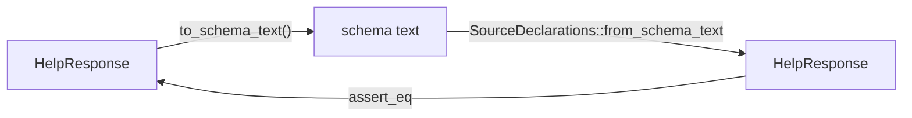
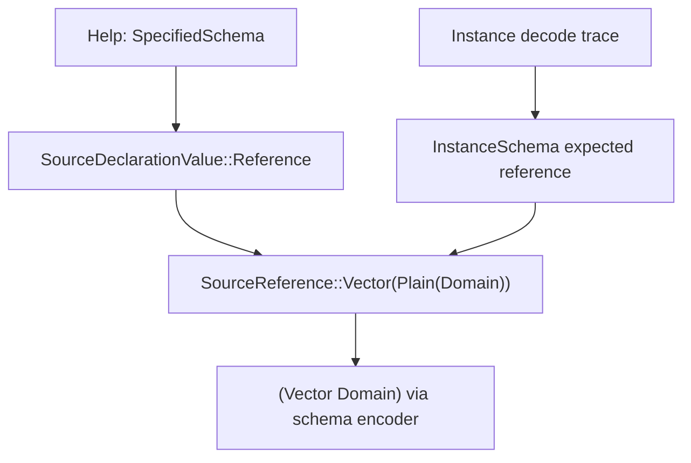

# Help on SpecifiedSchema — operator migration report

*schema-operator · report 15 · implementation landed on main in `schema-next` and `signal-spirit`*

## Result

Help is now a pure `SpecifiedSchema` read in `signal-spirit`.

That means the stored typed value is no longer a Help-specific AST and no longer a source-walk artifact. The model stores fully specified schema data, then projects a requested entry into a schema declaration only at the response boundary.

```mermaid
flowchart LR
    A["authored .schema sugar"] --> B["SchemaSource::from_schema_text"]
    B --> C["SchemaEngine lowering + import resolution"]
    C --> D["SpecifiedSchema"]
    D --> E["HelpModel { HelpSchemas(Vec<SpecifiedSchema>) }"]
    E --> F["HelpCatalog, transient lookup"]
    F --> G["HelpResponse / HelpEntry"]
    G --> H["SourceDeclaration projection"]
    H --> I["schema codec text"]
    I --> J["SourceDeclarations::from_schema_text"]
    J --> G
```



The important boundary is:

- `HelpModel` stores `SpecifiedSchema`.
- `HelpResponse` stores re-headed schema declaration entries for the current answer.
- Text encode/decode is the schema declaration codec.
- `Display` delegates to the schema codec.
- rkyv is the binary codec for the Help wrappers and stored `SpecifiedSchema` values.

## Code Landed

`schema-next` main:

- Commit `6e6d629d6386` — compact specified self-tagged variant projections.
- Adds source projection compaction so a variant whose payload is the same named type encodes as `(Health)`, not `(Health Health)`.
- Full suite green.

`signal-spirit` main:

- Commit `3e84885259e8` — drive Help from `SpecifiedSchema`.
- `HelpModel` now stores `HelpSchemas { schemas: Vec<SpecifiedSchema> }`.
- `HelpModel::from_signal_schema_source()` lowers the signal schema and imported domain schema through `SchemaEngine`, converts both to `SpecifiedSchema`, and stores those values.
- The old persistent `HelpRoots` / `HelpNodes` source-built model is gone; roots/nodes now live only in a transient `HelpCatalog`.

## Datatype Shape

The implemented storage shape is:

```rust
pub struct HelpModel {
    schemas: HelpSchemas,
}

pub struct HelpSchemas {
    schemas: Vec<SpecifiedSchema>,
}
```

The response shape remains a codec-facing schema declaration list:

```rust
pub struct HelpResponse {
    entries: HelpEntries,
}

pub struct HelpEntry {
    name: HelpName,
    body: Option<SourceDeclarationValue>,
}
```

That split is intentional. `HelpEntry` is not the canonical IR; it is the response projection of the canonical IR into the schema declaration codec.

`SpecifiedSchema` is the canonical typed data value:

```rust
pub struct SpecifiedSchema {
    identity: SchemaIdentity,
    imports: Vec<ImportDeclaration>,
    resolved_imports: Vec<ResolvedImport>,
    input: SpecifiedRoot,
    output: SpecifiedRoot,
    declarations: Vec<SpecifiedDeclaration>,
    streams: Vec<StreamDeclaration>,
    families: Vec<FamilyDeclaration>,
    relations: Vec<RelationDeclaration>,
    impl_blocks: Vec<ImplBlock>,
}
```

`SpecifiedPayload` still has both the immediate role-preserving reference and a derived shape:

```rust
pub struct SpecifiedPayload {
    reference: TypeReference,
    immediate_body: Option<SpecifiedPayloadBody>,
    shape: SpecifiedPayloadShape,
}
```

The psyche agreed with designer's Q3 framing: canonical identity keeps role boundaries; fully-followed terminal shape is a derived projection/cache, not the identity-bearing form. I clarified Spirit record `6grf` with that exact rule.

## Inputs And Outputs

The tests now pin these concrete outputs from the real deployed signal and domain schemas.

### Top-Level Help

Input:

```nota
Help
```

Representative output entries:

```schema
(Record { Entry Justification })
(RecordAccepted RecordIdentifier)
(Proposed RecordIdentifier)
```

Top-level help names the roots and one-level payload shape. It does not recursively dump child definitions.

### Record

Input:

```nota
(Help Record)
```

Output:

```schema
(Record { Entry Justification })
```

`Record` is the input variant. Its payload shape is one struct body with `Entry` and `Justification`.

### Entry

Input:

```nota
(Help Entry)
```

Output:

```schema
(Entry { Domains Kind Description Certainty Importance Privacy Referents })
```

The newtype/role boundaries are preserved. This is not collapsed to underlying enum/scalar forms.

### VerbatimQuote And OptionalAntecedent

Input:

```nota
(Help VerbatimQuote)
```

Output:

```schema
(VerbatimQuote { QuoteText OptionalAntecedent })
```

Input:

```nota
(Help OptionalAntecedent)
```

Expected navigation step:

```schema
(OptionalAntecedent (Optional Antecedent))
```

This is the key correction from the earlier source-walk behavior. `VerbatimQuote` keeps the named role. The optional container is one step away.

### Domains And Vector

Input:

```nota
(Help Domains)
```

Output:

```schema
(Domains (Vector Domain))
```

This settles the `Vec` / `Vector` mismatch for Help: the schema codec emits canonical `Vector`. Help no longer preserves source spelling.

### Domain

Input:

```nota
(Help Domain)
```

Output:

```schema
(Domain [(Health) (Food) (Home) (Finance) (Work) (Craft) (Knowledge) (Education) (Language) (Art) (Kinship) (Selfhood) (Spirituality) (Governance) (Law) (Community) (Nature) (Travel) (Commerce) (Leisure) (Appearance) (Safety) (Information) (Technology)])
```

This is intentionally one level. It does not dump the entire nested taxonomy. Same-named payload variants use schema's self-tagged form: `(Health)` means variant `Health` with payload type `Health`.

Next navigation:

```nota
(Help Health)
```

Expected shape:

```schema
(Health [Body Mind Nutrition Exercise Sleep Medicine Disease Medication Therapy Reproduction Sexuality Aging Disability Addiction Dentistry Senses Pain Prevention FirstAid Rehabilitation])
```

### DomainMatch

Input:

```nota
(Help DomainMatch)
```

Output:

```schema
(DomainMatch [Any (Partial) (Full)])
```

This is the compact self-tagged enum form. It avoids redundant `Partial Partial` and still round-trips through the schema codec.

### Stream

Input:

```nota
(Help IntentEventStream)
```

Output:

```schema
(IntentEventStream (Stream { token.SubscriptionToken opened.SubscriptionStarted event.IntentEvent close.SubscriptionToken }))
```

Streams are now typed schema projection output, not opaque fallback text.

## Codec Proof

The Help response codec proof is:



The tests cover:

- struct: `(Record { Entry Justification })`
- struct of roles: `(Entry { Domains Kind Description Certainty Importance Privacy Referents })`
- vector reference: `(Domains (Vector Domain))`
- newtype: `(RecordAccepted RecordIdentifier)`
- enum: `(DomainMatch [Any (Partial) (Full)])`
- stream: `(IntentEventStream (Stream { ... }))`
- top-level multi-declaration response
- rkyv round trip for `HelpModel`
- rkyv round trip for `HelpResponse`

## Help Versus Instance Schema

Help and instance-schema now meet at the same canonical reference spine for the covered vector case.



The convergence test still does a narrow proof around `Domains`:

- Help side: `(Help Domains)` projects to a `SourceReference::Vector(Plain(Domain))`.
- Instance side: decoding a real `Domains` value captures the same expected reference.
- Both render `(Vector Domain)` through the schema encoder.

This is not yet a full migration of instance-schema to `SpecifiedSchema`; that remains the next consumer slice after the depth rule is settled.

## What Changed Semantically

| Target | Previous source-walk tendency | Current SpecifiedSchema behavior |
|---|---|---|
| `Domains` | preserve source spelling like `Vec` | canonical schema codec emits `Vector` |
| `VerbatimQuote` | could leak field type expansion `OptionalAntecedent.(Optional Antecedent)` | preserves role: `OptionalAntecedent` |
| `Domain` | could dump nested taxonomy in one response | one-level enum: `(Health)`, `(Food)`, ... |
| `DomainMatch` | risk redundant same-name payload spelling | compact self-tagged variants |
| `IntentEventStream` | earlier design concern about text fallback | typed schema projection |

The general rule is: Help answers "what is the immediate schema shape of this named thing?" It does not recursively follow every reference or erase roles.

## Testing

`schema-next`:

```sh
cargo fmt
cargo test specified_schema -- --nocapture
cargo test
```

Result: green.

`signal-spirit`:

```sh
cargo fmt
cargo test --features nota-text --test generated_contract -- --nocapture
cargo test --features nota-text --test help_instance_schema_convergence -- --nocapture
cargo test --features nota-text
cargo test
```

Result: green.

The default `signal-spirit` build still keeps text projection gated; the `nota-text` tests compile and execute the Help surface.

## Insights

1. The "one IR" story becomes clearer if we stop calling every projected value the IR. `SpecifiedSchema` is the stored semantic value. `SourceDeclarationValue` is a schema-codec projection used by Help responses.
2. Role preservation is not cosmetic. `Certainty`, `Importance`, and `Privacy` share lower structure but are different semantic fields; Help must show the role boundary and let the user navigate down.
3. Fully specified does not mean fully expanded. A fully specified enum can still name its payload type instead of dumping that payload body. Naming the payload is explicit information.
4. The schema codec is now the text authority. The container head is `Vector` because the codec says so; Help no longer preserves authored aliases or source spelling.
5. Streams/families were a useful stress test. Treating them as schema projection values rather than ad hoc text keeps the same codec story.

## Questions

1. `Vector` is now the canonical emitted spelling. Do we leave authored schema aliases retired and accept `Vector` everywhere, or do we later change the schema codec itself if you want a different canonical word?
2. Instance-schema still has a depth-rule question: should a root payload render exactly one level like Help, or should it expand the selected root payload one level deeper for data alignment? I recommend deciding that before migrating instance-schema to read `SpecifiedSchema`.
3. Rename timing: I recommend doing the `-next` rename after this Help consumer migration is digested, as a separate mechanical wave. The code is now in a better state for that churn.
4. `SpecifiedPayload.shape` is still present in the canonical data type. The clarified intent says fully-followed shape is derived/cache and excluded from identity; the follow-up implementation should either prove it is excluded from hashes or move it to a derived side value.
