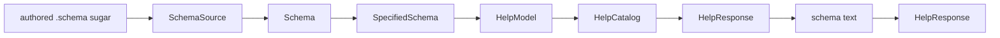
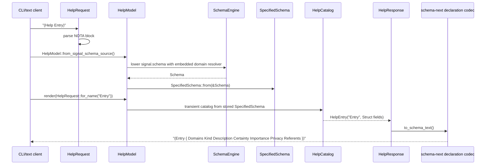
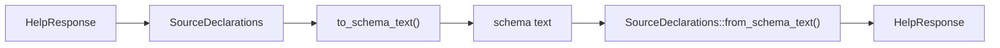
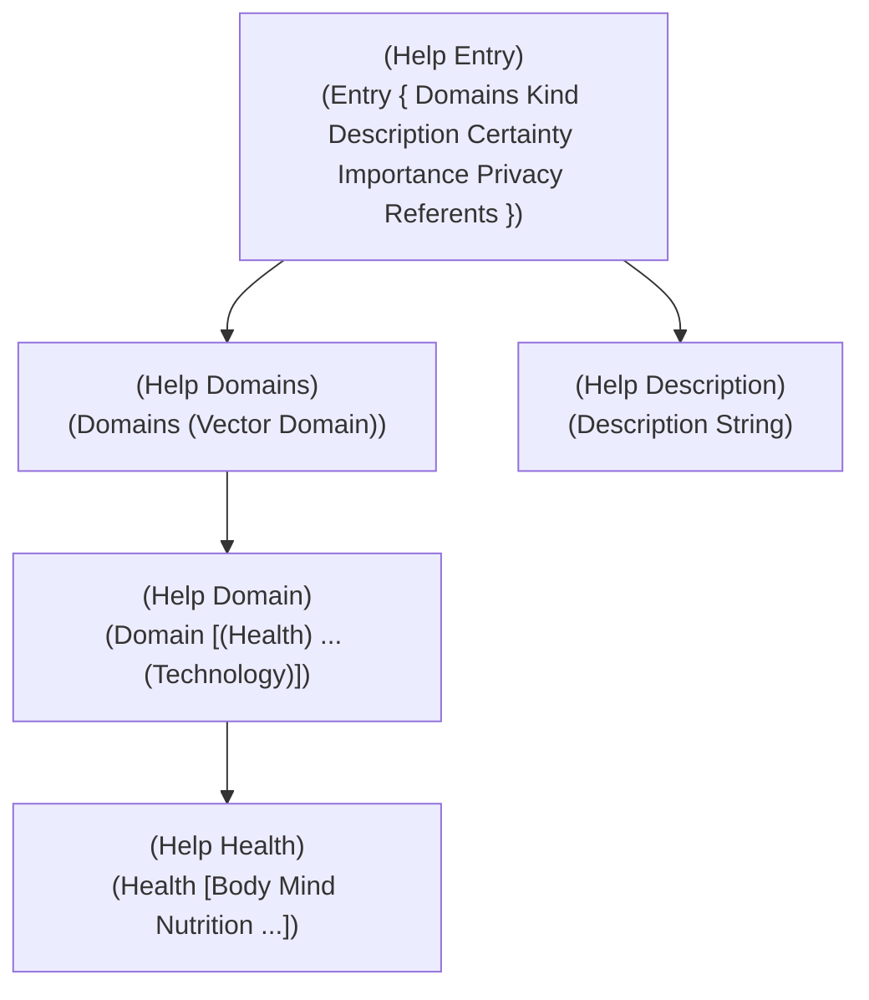

# How Help on SpecifiedSchema works

*schema-operator · report 16 · detailed walkthrough of the landed design*

## The Short Version

Help is now a read-only client projection of `SpecifiedSchema`.

There are four nouns to hold in your head:

| Noun | Lives in | Job |
|---|---|---|
| `SpecifiedSchema` | `schema-next` | The fully specified typed schema value. This is the real schema IR. |
| `HelpModel` | `signal-spirit` | Stores one or more `SpecifiedSchema` values, rkyv-serializable. |
| `HelpCatalog` | `signal-spirit`, private transient | Builds a lookup table from `SpecifiedSchema` each time Help renders. |
| `HelpResponse` | `signal-spirit` | The requested answer, projected as schema declarations and encoded/decoded through the schema codec. |

That gives this shape:



The important split:

- `HelpModel` stores semantic truth: `SpecifiedSchema`.
- `HelpResponse` stores a current answer: a list of re-headed schema declarations.
- The response text is encoded by schema-next's declaration codec.
- The response text is decoded by schema-next's declaration codec.
- `Display` is allowed only because it delegates to the codec.

## Why This Is The Right Mental Model

The old danger was treating Help as a little parallel schema language:

```text
schema source text -> Help-specific AST -> handwritten-looking output
```

That duplicated type-reference representation and created the `Vec` / `Vector` mismatch: Help preserved source spelling while instance-schema used the canonical resolved schema reference.

The new path is:

```text
schema source text -> Schema -> SpecifiedSchema -> schema declaration projection
```

That means Help cannot invent a spelling or collapse a role unless `SpecifiedSchema` and the schema codec say so.

## The Full Flow



## Layer 1: SpecifiedSchema

`SpecifiedSchema` is the typed schema value after authored `.schema` sugar is decoded, resolved, and made explicit.

From `schema-next/src/specified.rs`:

```rust
/// The fully specified schema value: the semantic schema object after authored
/// `.schema` sugar has been decoded, resolved, and made explicit.
#[derive(
    rkyv::Archive,
    rkyv::Serialize,
    rkyv::Deserialize,
    nota_next::NotaDecode,
    nota_next::NotaEncode,
    Clone,
    Debug,
    Eq,
    PartialEq,
)]
pub struct SpecifiedSchema {
    identity: SchemaIdentity,
    imports: Vec<ImportDeclaration>,
    resolved_imports: Vec<crate::ResolvedImport>,
    input: SpecifiedRoot,
    output: SpecifiedRoot,
    declarations: Vec<SpecifiedDeclaration>,
    streams: Vec<StreamDeclaration>,
    families: Vec<FamilyDeclaration>,
    relations: Vec<RelationDeclaration>,
    impl_blocks: Vec<ImplBlock>,
}
```

This is the answer to "what is the schema as data?"

It is not source text. It is not a Help AST. It is not Rust output. It is the Rust-serializable data instance that projections read.

The immediate root shape is explicit too:

```rust
pub enum SpecifiedRoot {
    Enum(SpecifiedRootEnum),
    Application(SpecifiedRootApplication),
}

pub struct SpecifiedRootEnum {
    name: Name,
    variants: Vec<SpecifiedVariant>,
}
```

So for Spirit, the input root is conceptually:

```text
SpecifiedRoot::Enum {
    name: Input,
    variants: [
        SpecifiedVariant { name: Record, payload: ... },
        SpecifiedVariant { name: Observe, payload: ... },
        ...
    ]
}
```

## Layer 2: Payloads Keep Role And Shape Separate

This is the subtle but important part.

`SpecifiedPayload` carries:

```rust
pub struct SpecifiedPayload {
    reference: TypeReference,
    immediate_body: Option<SpecifiedPayloadBody>,
    shape: SpecifiedPayloadShape,
}
```

Read these as three different questions:

| Field | Question |
|---|---|
| `reference` | What named type does this payload use? |
| `immediate_body` | What is the first schema boundary behind that type? |
| `shape` | If transparent newtypes are followed, what data shape appears? |

The intent decision is: `reference` and `immediate_body` preserve role boundaries; fully-followed terminal `shape` is a derived projection/cache, not what Help normally exposes.

That is why:

```schema
(Help VerbatimQuote)
```

returns:

```schema
(VerbatimQuote { QuoteText OptionalAntecedent })
```

not:

```schema
(VerbatimQuote { QuoteText OptionalAntecedent.(Optional Antecedent) })
```

The first response says: this field role is `OptionalAntecedent`.

Then:

```schema
(Help OptionalAntecedent)
```

is the next navigation step:

```schema
(OptionalAntecedent (Optional Antecedent))
```

That preserves the role. It also preserves readability.

## Layer 3: The HelpModel Stores SpecifiedSchema

From `signal-spirit/src/help.rs`:

```rust
#[derive(rkyv::Archive, rkyv::Serialize, rkyv::Deserialize, Clone, Debug, Eq, PartialEq)]
pub struct HelpModel {
    schemas: HelpSchemas,
}

#[derive(rkyv::Archive, rkyv::Serialize, rkyv::Deserialize, Clone, Debug, Eq, PartialEq)]
pub struct HelpSchemas {
    #[rkyv(omit_bounds)]
    schemas: Vec<SpecifiedSchema>,
}
```

This is the actualized typed help data tree.

It is not a string. It is not in the daemon. It can be archived with rkyv because `SpecifiedSchema` and the wrappers derive rkyv.

The builder path is:

```rust
pub fn from_signal_schema_source() -> Result<Self, HelpError> {
    let engine = SchemaEngine::default();
    let resolver = ImportResolver::new().with_module_source(
        "signal-spirit",
        "domain",
        env!("CARGO_PKG_VERSION"),
        DOMAIN_SCHEMA_SOURCE,
    );
    let signal_source = SchemaSource::from_schema_text(SIGNAL_SCHEMA_SOURCE)?;
    let signal_schema = engine.lower_schema_source_with_resolver(
        &signal_source,
        SchemaIdentity::new("signal-spirit:signal", env!("CARGO_PKG_VERSION")),
        &resolver,
    )?;
    let domain_source = SchemaSource::from_schema_text(DOMAIN_SCHEMA_SOURCE)?;
    let domain_schema = engine.lower_schema_source(
        &domain_source,
        SchemaIdentity::new("signal-spirit:domain", env!("CARGO_PKG_VERSION")),
    )?;
    let signal_schema = SpecifiedSchema::from(&signal_schema);
    let domain_schema = SpecifiedSchema::from(&domain_schema);
    Ok(Self::from_specified_schemas(vec![
        signal_schema,
        domain_schema,
    ]))
}
```

That does four things:

1. Decode the embedded `.schema` source through `SchemaSource`.
2. Lower it through `SchemaEngine`, including the embedded domain import resolver.
3. Convert semantic `Schema` into `SpecifiedSchema`.
4. Store the specified values in `HelpModel`.

The domain resolver detail matters because Spirit's signal schema imports the domain taxonomy. Help must be generated from the same complete resolved schema graph a real schema consumer reads.

## Layer 4: HelpCatalog Is Temporary

`HelpCatalog` exists only to answer a request ergonomically.

```rust
#[derive(Clone, Debug, Eq, PartialEq)]
struct HelpCatalog {
    roots: HelpRoots,
    nodes: HelpNodes,
}
```

It is built from `SpecifiedSchema` on render:

```rust
pub fn render(&self, request: &HelpRequest) -> Result<HelpResponse, HelpError> {
    HelpCatalog::from_schemas(self.schemas.schemas()).render(request)
}
```

The catalog builder walks the stored schema value:

```rust
fn insert_schema(&mut self, schema: &SpecifiedSchema) {
    self.insert_root(HelpPlane::Input, schema.input());
    self.insert_root(HelpPlane::Output, schema.output());
    for declaration in schema.declarations() {
        self.insert_declaration(declaration);
    }
    for stream in schema.streams() {
        self.nodes.insert(HelpNode::new(
            HelpName::from(&stream.name),
            Some(SourceDeclarationValue::from(stream)),
        ));
    }
    for family in schema.families() {
        self.nodes.insert(HelpNode::new(
            HelpName::from(&family.name),
            Some(SourceDeclarationValue::from(family)),
        ));
    }
}
```

This is why streams are no longer opaque fallback text. They project through schema data:

```schema
(IntentEventStream (Stream { token.SubscriptionToken opened.SubscriptionStarted event.IntentEvent close.SubscriptionToken }))
```

## Layer 5: HelpResponse Is A Schema Declaration Projection

The response is not the canonical IR. It is the current answer projected into schema declaration form.

```rust
pub struct HelpResponse {
    entries: HelpEntries,
}

pub struct HelpEntry {
    name: HelpName,
    body: Option<SourceDeclarationValue>,
}
```

A Help entry re-heads the projected body over the requested name:

```rust
fn to_source_declaration(&self) -> SourceDeclaration {
    SourceDeclaration::new(Name::new(self.name.as_str()), self.body.clone())
}

pub fn to_schema_text(&self) -> String {
    self.to_source_declaration().to_schema_text()
}
```

And the response does the same for every entry:

```rust
pub fn to_schema_text(&self) -> String {
    self.to_source_declarations().to_schema_text()
}
```

The inverse is also schema, not a custom parser:

```rust
pub fn from_schema_text(source: &str) -> Result<Self, HelpError> {
    let declarations = SourceDeclarations::from_schema_text(source)?;
    Ok(Self::from_source_declarations(&declarations))
}
```

So the text codec is:



There is no hand-written serializer path here. `Display` is just:

```rust
impl fmt::Display for HelpResponse {
    fn fmt(&self, formatter: &mut fmt::Formatter<'_>) -> fmt::Result {
        formatter.write_str(&self.to_schema_text())
    }
}
```

That is legal because it delegates to the codec.

## What A Request Does

The request parser recognizes only Help forms.

```rust
pub struct HelpRequest {
    target: Option<HelpName>,
}
```

The shape:

| Input | Meaning |
|---|---|
| `Help` | Top-level roots |
| `(Help)` | Top-level roots |
| `(Help Entry)` | One named target |

The parser logic is deliberately small:

```rust
pub fn from_text(source: &str) -> Result<Option<Self>, HelpError> {
    let document = Document::parse(source)?;
    if document.holds_root_objects() != 1 {
        return Ok(None);
    }
    let root = document.root_object_at(0).expect("checked root object count");
    if root.demote_to_string() == Some("Help") {
        return Ok(Some(Self::new(None)));
    }
    let Some(objects) = root.as_delimited(Delimiter::Parenthesis) else {
        return Ok(None);
    };
    let Some(head) = objects.first().and_then(Block::demote_to_string) else {
        return Ok(None);
    };
    if head != "Help" {
        return Ok(None);
    }
    match objects {
        [_] => Ok(Some(Self::new(None))),
        [_, target] => {
            let Some(target) = target.demote_to_string() else {
                return Err(HelpError::InvalidRequest(source.to_owned()));
            };
            Ok(Some(Self::for_name(target)))
        }
        _ => Err(HelpError::InvalidRequest(source.to_owned())),
    }
}
```

The parser only recognizes whether the user asked for Help. It does not parse schema syntax. The schema text parser remains in `schema-next`.

## Concrete Examples

### Top Level

Input:

```nota
Help
```

Representative output entries:

```schema
(State Statement)
(Record { Entry Justification })
(Observe Query)
(Version)
(Marker)
(RecordAccepted RecordIdentifier)
(Proposed RecordIdentifier)
```

Top-level Help is root-oriented. It names root variants and their immediate payload shapes.

### Record

Input:

```nota
(Help Record)
```

Output:

```schema
(Record { Entry Justification })
```

Read it as:

```text
Input root enum has variant Record.
Record's payload is a struct shape.
The struct fields are Entry and Justification.
```

It does not say:

```text
Record RecordRequest { ... }
```

because there is one schema element per data element. The variant `Record` is the element, and its payload shape is the next element.

### Entry

Input:

```nota
(Help Entry)
```

Output:

```schema
(Entry { Domains Kind Description Certainty Importance Privacy Referents })
```

Read it as:

```text
Entry is a struct.
Its field roles are Domains, Kind, Description, Certainty, Importance, Privacy, Referents.
```

It does not expand `Kind`, `Description`, or `Magnitude`-like roles inline. Those are named schema facts.

### Description

Input:

```nota
(Help Description)
```

Output:

```schema
(Description String)
```

This is where the scalar appears: at the newtype boundary, one navigation step below `Entry`.

### Domains

Input:

```nota
(Help Domains)
```

Output:

```schema
(Domains (Vector Domain))
```

This proves Help is not preserving authored alias spelling. The schema codec emits canonical `Vector`.

### Domain

Input:

```nota
(Help Domain)
```

Output:

```schema
(Domain [(Health) (Food) (Home) (Finance) (Work) (Craft) (Knowledge) (Education) (Language) (Art) (Kinship) (Selfhood) (Spirituality) (Governance) (Law) (Community) (Nature) (Travel) (Commerce) (Leisure) (Appearance) (Safety) (Information) (Technology)])
```

Read `(Health)` as the schema codec's compact self-tagged variant:

```text
variant name: Health
payload type: Health
```

The explicit non-compact form would be redundant:

```schema
(Health Health)
```

So `schema-next` compacts it back to:

```schema
(Health)
```

The implementation point is in `SpecifiedVariant::to_source_variant_signature()`:

```rust
if self.stream_relation().is_none()
    && matches!(
        &payload,
        Some(SourceVariantPayload::Reference(SourceReference::Plain(name)))
            if name == self.name()
    )
{
    return SourceVariantSignature::from_self_tagged(self.name.clone());
}
```

### DomainMatch

Input:

```nota
(Help DomainMatch)
```

Output:

```schema
(DomainMatch [Any (Partial) (Full)])
```

This has three variants:

| Variant | Payload |
|---|---|
| `Any` | none |
| `Partial` | same-named payload type `Partial` |
| `Full` | same-named payload type `Full` |

The self-tagged schema syntax keeps that compact.

### VerbatimQuote

Input:

```nota
(Help VerbatimQuote)
```

Output:

```schema
(VerbatimQuote { QuoteText OptionalAntecedent })
```

Then:

```nota
(Help OptionalAntecedent)
```

Output:

```schema
(OptionalAntecedent (Optional Antecedent))
```

This is the role-preserving rule in action. The immediate field role is not erased just because the type is transparent.

### Stream

Input:

```nota
(Help IntentEventStream)
```

Output:

```schema
(IntentEventStream (Stream { token.SubscriptionToken opened.SubscriptionStarted event.IntentEvent close.SubscriptionToken }))
```

Streams are schema declarations, not text blobs.

## One-Level Help Is Not Under-Specified

This is the core insight:

```text
Fully specified != fully dumped.
```

A fully specified schema may still name another type. Naming a type is explicit information.

The one-level rule makes Help total, readable, and navigable:



No renderer depth knob is needed. The user navigates.

## Why Help Goes First

Help is a pure IR read:

```text
SpecifiedSchema -> HelpResponse
```

It does not need:

- a runtime value;
- a decoder trace;
- instance alignment rules;
- a root-payload depth decision.

That is why it was the clean first consumer of `SpecifiedSchema`.

Instance-schema has a harder shape:

```text
value + decoder trace + schema expectation -> per-instance schema
```

It must answer a separate depth question: when a concrete root value appears, how far should the per-instance schema expand while staying one-to-one with the value? That is not a Help problem.

## What The Tests Prove

### Golden Help Shapes

The test `generated_help_model_renders_spirit_one_level_shapes` pins:

```rust
assert_eq!(
    model
        .render(&signal_spirit::HelpRequest::for_name("Record"))
        .expect("render Record help")
        .to_string(),
    "(Record { Entry Justification })"
);
```

It also pins:

```rust
"(Entry { Domains Kind Description Certainty Importance Privacy Referents })"
"(Domains (Vector Domain))"
"(Description String)"
"(VerbatimQuote { QuoteText OptionalAntecedent })"
```

### Full Decoded Target Coverage

The test `generated_help_model_renders_every_decoded_schema_target` checks that top-level Help is generated from every decoded input and output root, then renders every declared type.

It also pins `Domain`:

```rust
"(Domain [(Health) (Food) (Home) ... (Technology)])"
```

and stream output:

```rust
"(IntentEventStream (Stream { token.SubscriptionToken opened.SubscriptionStarted event.IntentEvent close.SubscriptionToken }))"
```

### Schema Codec Round Trip

The test `generated_help_round_trips_through_the_schema_codec` proves:

```text
HelpResponse -> to_schema_text -> from_schema_text -> same HelpResponse
```

for representative shapes:

```rust
("Record", "(Record { Entry Justification })")
("Entry", "(Entry { Domains Kind Description Certainty Importance Privacy Referents })")
("Domains", "(Domains (Vector Domain))")
("RecordAccepted", "(RecordAccepted RecordIdentifier)")
("DomainMatch", "(DomainMatch [Any (Partial) (Full)])")
("IntentEventStream", "(IntentEventStream (Stream { token.SubscriptionToken opened.SubscriptionStarted event.IntentEvent close.SubscriptionToken }))")
```

It separately checks:

```rust
assert_eq!(
    response.to_string(),
    expected,
    "{target} Display must delegate to the schema codec"
);
```

That is the no-hand-printer guard.

### Rkyv Round Trip

The generated contract tests also archive and decode both:

- `HelpModel`
- `HelpResponse`

That proves Help is a real typed binary value, not just text output.

### Help / Instance-Schema Convergence

The convergence test proves the vector case from both sides:

```rust
let help_inner = help_reference("Domains");
let schema = instance_schema_of::<Domains>("[]");
let instance_inner = instance_vector_reference(&schema);

assert_eq!(help_inner, instance_inner);
assert_eq!(help_inner.rendered_schema_text(), "(Vector Domain)");
```

That is the narrow proof that Help and per-instance schema now meet at the same canonical reference spine for `Domains`.

## Cognitive Load Improvements

The new design removes these concepts from the public mental model:

- `HelpTypeExpression`
- `HelpBody`
- source-spelling preservation
- hand rendering
- separate Help parser for schema declaration output
- stream/family text fallback

The remaining path is:

```text
SpecifiedSchema stores the truth.
HelpCatalog indexes it temporarily.
HelpResponse projects one answer.
The schema codec renders and decodes that answer.
```

That is smaller and harder to misuse.

## Correctness Properties

| Property | Mechanism |
|---|---|
| Client-side only | Help lives under `nota-text`; no `Input::Help` or daemon root. |
| Typed binary value | `HelpModel`, `HelpSchemas`, `HelpResponse`, and `SpecifiedSchema` derive rkyv. |
| Typed text value | `HelpResponse` encodes/decodes through schema declarations. |
| No hand serializer | `Display` delegates to `to_schema_text()`. |
| No separate schema parser | Decode uses `SourceDeclarations::from_schema_text()`. |
| Imports included | `HelpModel::from_signal_schema_source()` lowers signal schema with embedded domain module resolver. |
| Roles preserved | `SpecifiedPayload::to_help_source_declaration_value()` prefers immediate named boundaries for newtypes. |
| Enum payloads finite | `SpecifiedVariantSummary` names payload references rather than recursively expanding. |
| Same-name payloads compact | `to_source_variant_signature()` emits self-tagged forms. |
| Stream/family typed | Streams/families project into `SourceDeclarationValue`, not raw strings. |

## What Is Still Open

1. `SpecifiedPayload.shape` currently lives in the type, but intent now says fully-followed terminal shape is a derived projection/cache outside identity. The next implementation check should verify hash exclusion or move that shape to a derived side value.
2. Instance-schema should migrate after the root-depth rule is settled. Help did not need that question because Help has no value payload to align with.
3. The `-next` rename can now happen as a cleaner mechanical wave, after one real `SpecifiedSchema` consumer has landed.
4. `Vector` is the current canonical emitted spelling. If the psyche wants a different spelling, the change belongs in the schema codec, not Help.

## File Pointers

- `schema-next/src/specified.rs` defines `SpecifiedSchema`, `SpecifiedRoot`, `SpecifiedVariant`, `SpecifiedPayload`, and projection helpers.
- `schema-next/src/source.rs` owns schema declaration text encode/decode and stream/family source bodies.
- `signal-spirit/src/help.rs` stores `SpecifiedSchema` in `HelpModel`, builds transient `HelpCatalog`, and encodes `HelpResponse` through schema declarations.
- `signal-spirit/tests/generated_contract.rs` pins the real Spirit Help outputs, schema-codec round trips, and rkyv round trips.
- `signal-spirit/tests/help_instance_schema_convergence.rs` proves the `Domains` reference path converges with per-instance schema.
