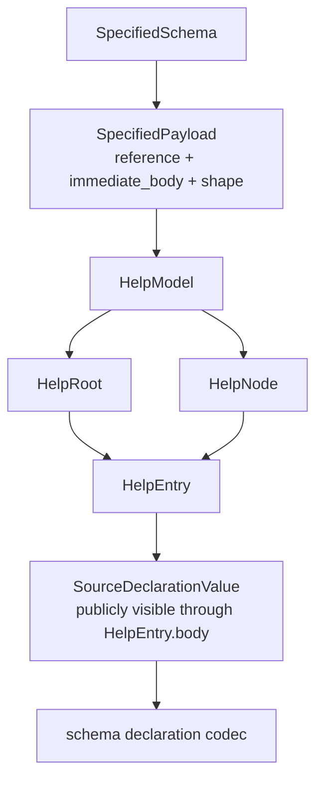
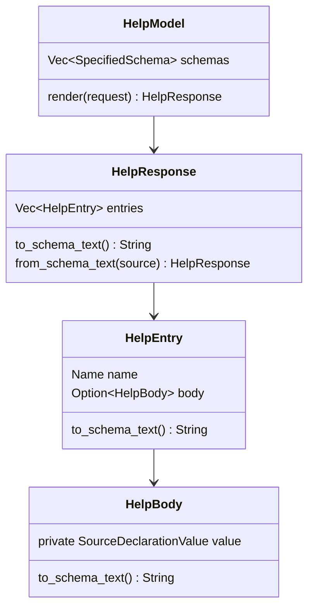

# Help on SpecifiedSchema audit fixes

schema-operator report 17

## Result

Designer's audit in `reports/schema-designer/17-audit-help-specified-migration.md`
was right about the remaining cleanup. I landed the fixes in the two code
repos:

| Repo | Commit | Result |
|---|---:|---|
| `schema-next` | `d4ea7992d3e8` | `SpecifiedPayload.shape` removed from canonical payload data; `SpecifiedSchema::content_hash()` added with a golden regression proving the derived shape cache is outside identity. |
| `signal-spirit` | `5a22350c60d1` | Help API collapsed around `HelpEntry` + owned `HelpBody`; public source-noun leak removed. |
| `signal-spirit` | `6d8687523e66` | Lockfile advanced to the schema-next hash-guard commit. |

The important state: Help now reads `SpecifiedSchema`, projects through
schema-next's declaration codec, and exposes a smaller signal-spirit-owned Help
surface. The identity-hash caveat is now executable: `SpecifiedSchema` has its
own content hash and the fixture hash is pinned.

## Before

The migration was substantively correct, but the shape had three places where
the design was heavier or riskier than needed.



Problems:

1. `shape` was stored inside `SpecifiedPayload`, even though it is fully
   derivable by following the schema's resolved references. If identity later
   rebases onto rkyv bytes for `SpecifiedSchema`, that derived cache would
   become identity-bearing by accident.
2. `signal-spirit` exposed `schema_next::SourceDeclarationValue` through its
   public Help response body. That made a schema-next source noun part of the
   client-facing Help API.
3. Help had three near-identical name/body wrappers (`HelpRoot`, `HelpNode`,
   `HelpEntry`) plus collection wrappers. The data was just entries split into
   roots and nodes.

## After

```mermaid
flowchart TD
    Schema[SpecifiedSchema<br/>canonical resolved data]
    Payload[SpecifiedPayload<br/>reference + immediate_body]
    Shape[SpecifiedPayloadShape<br/>derived side value]
    Model[HelpModel<br/>Vec&lt;SpecifiedSchema&gt;]
    Catalog[HelpCatalog<br/>roots: Vec&lt;HelpEntry&gt;<br/>nodes: Vec&lt;HelpEntry&gt;]
    Entry[HelpEntry<br/>Name + Option&lt;HelpBody&gt;]
    Body[HelpBody<br/>private SourceDeclarationValue]
    Codec[schema-next declaration codec]
    Text[schema text<br/>(Domains (Vector Domain))]

    Schema --> Payload
    Schema --> Shape
    Payload -. derives through schema .-> Shape
    Schema --> Model
    Model --> Catalog
    Catalog --> Entry
    Entry --> Body
    Body --> Codec
    Codec --> Text
```

The key distinction is now encoded in the data model:

| Concept | Lives where | Identity-bearing? |
|---|---|---|
| Payload reference | `SpecifiedPayload.reference` | Yes |
| Immediate role-preserving body | `SpecifiedPayload.immediate_body` | Yes |
| Fully followed terminal shape | `SpecifiedPayload::shape(&SpecifiedSchema)` | No, derived |
| Help body surface | `signal_spirit::HelpBody` | Yes, as Help response data |
| Schema codec internals | private `HelpBody.value` | Not public API |

## M1: derived shape

`SpecifiedPayload` is now the minimal canonical payload fact:

```rust
pub struct SpecifiedPayload {
    reference: TypeReference,
    immediate_body: Option<SpecifiedPayloadBody>,
}

impl SpecifiedPayload {
    pub fn shape(&self, schema: &SpecifiedSchema) -> SpecifiedPayloadShape {
        schema.payload_shape_for_reference(self.reference())
    }
}
```

The recursive work moved to the owner that has enough information to do it:

```rust
impl SpecifiedSchema {
    pub fn payload_shape_for_reference(
        &self,
        reference: &TypeReference,
    ) -> SpecifiedPayloadShape {
        self.payload_shape_for_reference_with_visited(reference, Vec::new())
    }
}
```

That keeps `Certainty`, `Importance`, and `Privacy` role boundaries canonical,
while still allowing Help to ask for terminal shape when it needs to render a
payload body.

Concrete example:

```text
canonical payload fact:
  Certainty -> Magnitude

derived terminal shape:
  Magnitude -> [Zero Minimum VeryLow Low Medium High VeryHigh Maximum]

Help preserves the role boundary:
  (Help Entry) -> (Entry { Domains Kind Description Certainty Importance Privacy Referents })

The terminal enum remains one navigation step away:
  (Help Certainty) -> (Certainty Magnitude)
  (Help Magnitude) -> (Magnitude [Zero Minimum VeryLow Low Medium High VeryHigh Maximum])
```

Regression coverage added in `schema-next`:

| Test | What it proves |
|---|---|
| `specified_payload_shape_is_derived_not_stored_on_payload` | rkyv recovery preserves immediate role data, and terminal shape recomputes from the recovered schema. |
| `specified_schema_projects_self_tagged_variants_through_schema_codec` | self-tagged payload compaction still round-trips through the schema declaration codec. |

`SpecifiedSchema::content_hash()` now hashes the fully specified schema's
canonical rkyv bytes under the whole-schema hash domain. The regression pins
the fixture's hash after exercising a derived terminal shape:

```rust
assert_eq!(
    payload.shape(&specified),
    SpecifiedPayloadShape::Scalar(TypeReference::String)
);

assert_eq!(
    specified.content_hash().expect("specified schema hashes").to_hex(),
    "b1b8b5aad9a636ebf66c9f24999531560f4a291df93c2d38a24ae204fb57d9ab"
);
```

If a future change puts a stored derived shape cache back into
`SpecifiedPayload`, the canonical rkyv bytes change and this test fails. That
is the missing hard guard the earlier report said had to wait; it does not have
to wait anymore.

## M2: owned Help body

The public Help API no longer returns schema-next source nouns.

```rust
pub struct HelpEntry {
    name: Name,
    body: Option<HelpBody>,
}

pub struct HelpBody {
    value: SourceDeclarationValue,
}

impl HelpBody {
    pub fn to_schema_text(&self) -> String {
        self.value.to_schema_text()
    }
}
```

`SourceDeclarationValue` still appears inside `src/help.rs`, because the schema
codec is the correct encoder/decoder for Help text. The boundary is the point:
clients receive `HelpBody`, not `SourceDeclarationValue`.

The canary changed from a schema-next source-noun consumer to a
signal-spirit-owned body consumer:

```rust
let entry = response.entries().first().expect("one help entry");
entry
    .body()
    .expect("help entry has a body")
    .to_schema_text()
```

## M3: type collapse

The Help type stack is now the small version:



Deleted concepts:

| Removed | Replacement |
|---|---|
| `HelpName` | `schema_next::Name` |
| `HelpSchemas` | `HelpModel { schemas: Vec<SpecifiedSchema> }` |
| `HelpEntries` | `HelpResponse { entries: Vec<HelpEntry> }` |
| `HelpRoot` | `HelpEntry` in `HelpCatalog.roots` |
| `HelpNode` | `HelpEntry` in `HelpCatalog.nodes` |
| `HelpPlane` | no separate plane type |

Roots and nodes are still distinct internally because top-level `(Help)` should
show only root possibilities, while `(Help X)` can target either a root variant
or a named declaration. That distinction belongs in `HelpCatalog`, not in
duplicated entry types.

## Inputs and outputs

Help remains client-side and schema-codec-driven.

```text
input:
  (Help Domains)

internal path:
  HelpRequest(target = Domains)
  -> HelpModel(Vec<SpecifiedSchema>)
  -> HelpCatalog lookup
  -> HelpEntry { name = Domains, body = HelpBody(Vector Domain) }
  -> SourceDeclaration::to_schema_text()

output:
  (Domains (Vector Domain))
```

The convergence proof is now explicit:

```text
Help path:
  (Help Domains)
  -> (Domains (Vector Domain))

Instance-schema path:
  decode Domains value []
  -> traced expected schema
  -> (Domains (Vector Domain))

Assertion:
  Help text == instance-schema expanded text
```

## Test evidence

`schema-next`:

```text
cargo fmt
cargo test --test specified_schema -- --nocapture
cargo test
```

`signal-spirit`:

```text
cargo test --features nota-text --test generated_contract -- --nocapture
cargo test --features nota-text --test help_instance_schema_convergence -- --nocapture
cargo test --features nota-text
cargo test
```

Observed green counts from the final signal-spirit pass:

| Suite | Result |
|---|---|
| `generated_contract` with `nota-text` | 16 passed |
| `help_instance_schema_convergence` with `nota-text` | 3 passed |
| full `nota-text` test run | 38 passed across integration suites |
| default test run | 15 passed across integration suites; text-gated tests compiled out |

## Remaining questions

1. Should `HelpBody` expose more typed accessors than `to_schema_text()`? For
   now I kept the public surface narrow. If programmatic Help consumers need
   structure, the next step should be a signal-spirit-owned enum rather than
   exposing schema-next source nouns.
2. Should we move stream/family Help bodies onto an explicitly specified body
   type next? The current implementation still uses the schema codec path
   correctly, but streams/families remain the last place where the body is
   effectively projected through source-declaration form rather than a richer
   Help-owned typed node.

## Insight

The core design is now simpler than the implementation history:

```text
SpecifiedSchema is the data.
Help is a read-only view of that data.
Schema text is the codec output.
Instance schema is the decoder trace.
Rust lowering is another projection.
```

That is the cognitive-load win. The code no longer asks future readers to
remember a parallel Help AST or a stored terminal-shape cache. If they need to
know what Help means, they follow one path: `SpecifiedSchema` -> `HelpEntry` ->
schema codec.
