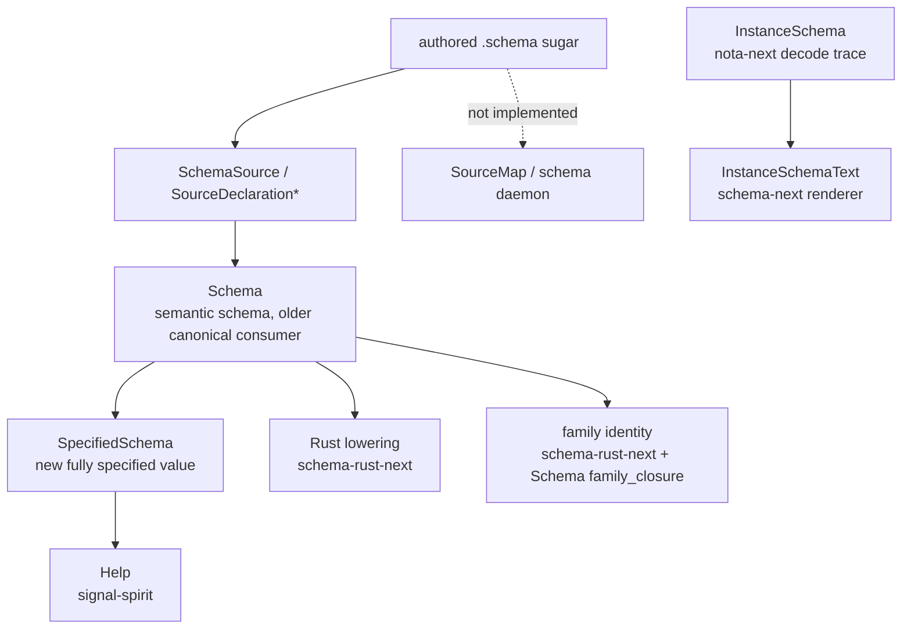
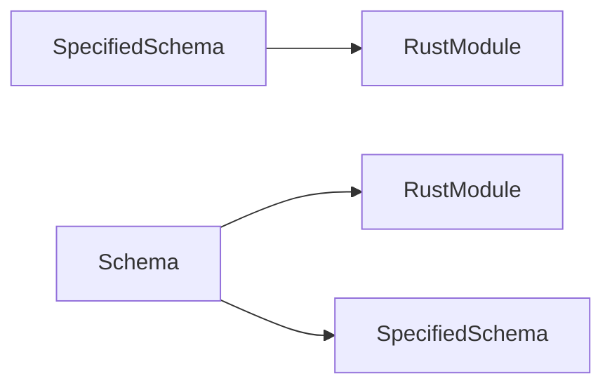
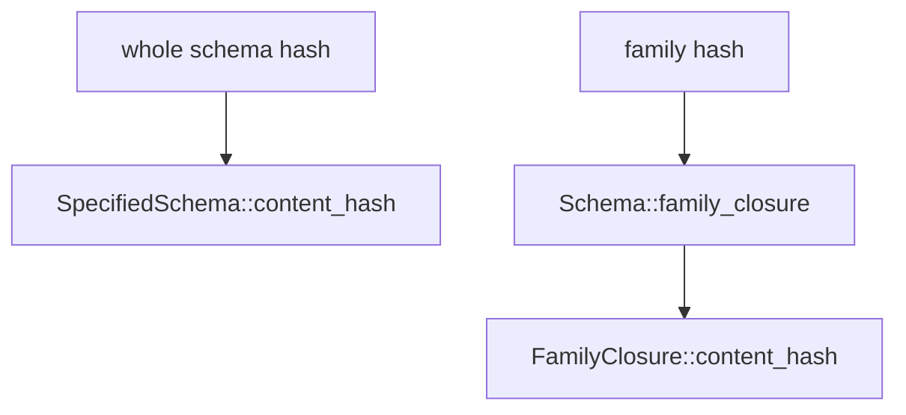
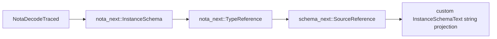
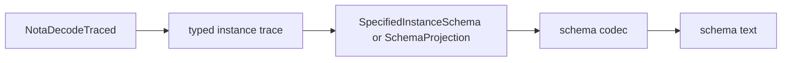
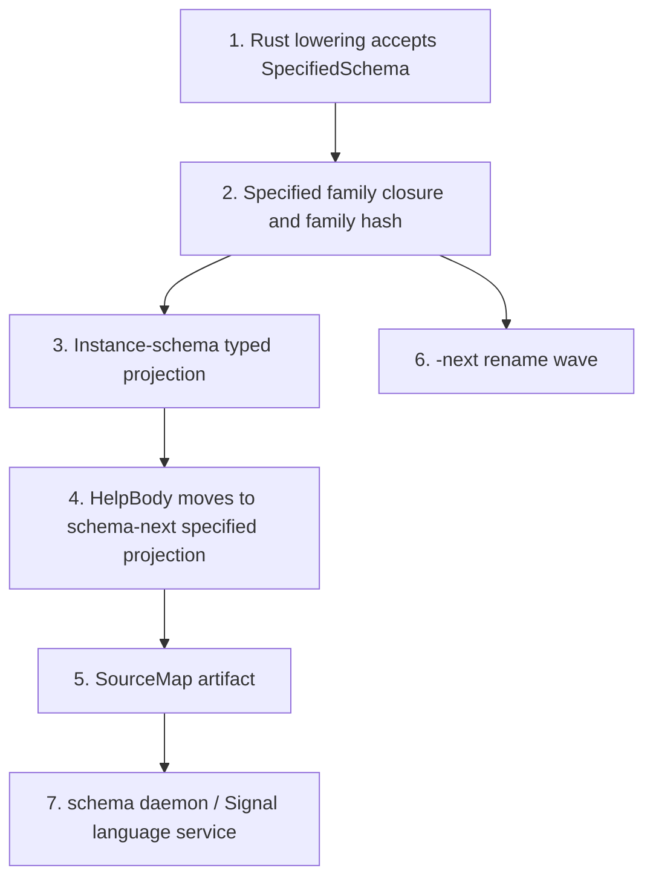

# SpecifiedSchema gap audit

schema-operator report 18

## Scope

This audit checks the current implementation against the settled design:

```text
authored .schema sugar
  -> schema codec
  -> SpecifiedSchema, the fully specified Rust data value
  -> projections: Help, instance-schema, Rust lowering, identity, source-map services
```

I audited:

- `/git/github.com/LiGoldragon/schema-next`
- `/git/github.com/LiGoldragon/signal-spirit`
- `/git/github.com/LiGoldragon/schema-rust-next`
- `/git/github.com/LiGoldragon/nota-next`

This is not a broken-build audit. The focused tests are green. It is a
missing-implementation and design-gap audit: where the code still does not
match the intended final shape.

## Current State



The good news: Help is now on `SpecifiedSchema`, and `SpecifiedSchema` has a
real content hash with a regression protecting derived shape from identity.

The gap: the stack is still a bridge, not yet one IR everywhere.

## Verification

Commands that passed during the audit:

```text
schema-next:
  cargo test --test specified_schema -- --nocapture
  cargo test --test identity -- --nocapture

signal-spirit:
  cargo test --features nota-text --test generated_contract -- --nocapture
  cargo test --features nota-text --test help_instance_schema_convergence -- --nocapture

schema-rust-next:
  cargo test --test family_emission generated_descriptors_carry_the_pinned_family_identity -- --nocapture
  cargo test --test emission emission_can_gate_nota_surface_behind_text_client_feature -- --nocapture
  cargo test --test emission emits_vec_map_and_option_collection_types_with_shared_codec_traits -- --nocapture

nota-next:
  cargo test --test instance_schema -- --nocapture
```

One attempted schema-rust command used two test filters in one Cargo invocation
and Cargo rejected it. I reran those checks separately and only count the
successful commands above.

## Findings

| Priority | Finding | Status |
|---|---|---|
| P1 | Rust lowering still consumes `Schema`, not `SpecifiedSchema`. | Missing main migration. |
| P1 | Family identity still hashes `Schema` family closures, not specified-schema closures. | Identity split remains. |
| P1 | SourceMap and schema-daemon/language-service artifact do not exist. | Design not implemented. |
| P2 | Per-instance schema still renders through a custom string projection, not a typed schema-codec value. | Correct tests, incomplete architecture. |
| P2 | Help body is owned at the public boundary, but internally still stores `SourceDeclarationValue`; streams/families still project through source form. | Good bridge, not final typed body. |
| P2 | The `-next` rename is still outstanding. | Mechanical but high blast radius. |
| P3 | The "no hand printer" line is unevenly enforced. | Needs a formal codec-floor decision. |

## P1: Rust Lowering Still Reads `Schema`

Evidence:

- `schema-rust-next/src/lib.rs:83` exposes `emit_file_from_schema(&Schema)`.
- `schema-rust-next/src/lib.rs:97` exposes `emit_code_from_schema(&Schema)`.
- `schema-rust-next/src/lib.rs:122` implements `RustSchemaLowering for Schema`.
- `schema-rust-next/src/lib.rs:554` implements the real module lowering for
  `Schema`, walking `self.namespace()`, `self.input_and_output()`,
  `self.resolved_imports()`, and related old semantic surfaces.

The design says Rust lowering should be one projection of the fully specified
schema data value. Today it is still a projection of `Schema`.



Why this matters:

- The old `Schema` and new `SpecifiedSchema` can drift.
- A bug fixed in the specified surface may not affect emitted Rust.
- The code generator remains the biggest consumer outside the one-IR contract.

Recommended slice:

1. Add `RustSchemaLowering for SpecifiedSchema`.
2. Keep `Schema` lowering only as a transitional wrapper:
   `SpecifiedSchema::from(schema).lower_to_rust_module(...)`.
3. Move namespace/root/import/family walks to the specified types.
4. Delete or sharply reduce the old `Schema` lowering once fixtures are green.

## P1: Family Identity Still Uses `Schema`

Evidence:

- `schema-next/src/identity.rs:177` now implements
  `SpecifiedSchema::content_hash()`.
- `schema-next/src/identity.rs:172` still defines `Schema::family_closure(...)`.
- `schema-rust-next/src/lib.rs:1075` implements `LowerToRust<RustVersionedStore>
  for Schema`.
- `schema-rust-next/src/lib.rs:1084` emits family hashes from
  `self.family_closure(...).content_hash()`.

So whole-schema identity has a specified-schema path, but family identity still
comes from the older closure.



This is the main identity gap left after the hash-guard fix. If Spirit
identity rebases onto `SpecifiedSchema`, family identity should rebase too, or
we keep two subtly different identity bases.

Recommended slice:

1. Add `SpecifiedFamilyClosure`.
2. Add `SpecifiedSchema::family_closure(...)`.
3. Port closure walking to `SpecifiedDeclaration`, `SpecifiedRoot`, and
   `SpecifiedPayload`.
4. Switch schema-rust family emission to specified closures.
5. Add a regression that old `Schema` and new `SpecifiedSchema` family hashes
   agree for the current fixtures until the old path is deleted.

## P1: SourceMap and Schema Daemon Are Still Only Design

The settled design split was:

```text
SpecifiedSchema = fully specified semantic data
SourceMap = source facts: file, range, alias text, shorthand origin, diagnostics
schema daemon = both, served over Signal/NOTA with optional JSON/LSP shim
```

Evidence from absence:

- No `SourceMap` type appears in schema-next.
- `SpecifiedSchema` stores semantic data but no source-map companion.
- `ResolvedImport` still carries alias-oriented information in schema-next
  resolution code, which is useful today but not the final SourceMap split.

This is not a small cleanup. It is the missing half of the "schema as language
server" vision.

Recommended first implementation:

```rust
pub struct SourceMap {
    schema_identity: SchemaIdentity,
    nodes: Vec<SourceMapEntry>,
}

pub struct SourceMapEntry {
    node: SpecifiedNodePath,
    origin: SourceOrigin,
}

pub enum SourceOrigin {
    FileRange(SourceFileRange),
    Generated(SourceGeneration),
    Imported(SourceImportOrigin),
}
```

Keep it as a sibling artifact:

```text
SchemaSource::decode_with_map(...)
  -> SpecifiedSchema
  -> SourceMap
```

Do not put spans or aliases inside canonical `SpecifiedSchema`.

## P2: Instance Schema Is Decoder-Driven, But Not Yet a Schema Value

The implementation is strong where it matters most: the instance schema trace
is captured by the decoder, not by re-parsing the value.

Evidence:

- `nota-next/src/instance_schema.rs:151` defines `NotaDecodeTraced`.
- `nota-next/src/instance_schema.rs:157` makes tracing part of the decode
  contract.
- `nota-next/src/instance_schema.rs:81` stores an `InstanceSchema` tree.

The gap is the rendering/projection layer:

- `nota-next/src/instance_schema.rs:12` says the trace carries a
  nota-next-local `TypeReference`.
- `schema-next/src/instance.rs:3` says schema-next projects that trace into
  schema text.
- `schema-next/src/instance.rs:124` starts custom collapse logic for aligned
  rendering.
- `schema-next/src/instance.rs:173` manually controls brace spacing.

This is correct enough behaviorally, but it is not the final "one data instance
that decodes/encodes through schema" story. It is still:



The target should be:



Recommended slice:

1. Add a schema-next-owned projection type, e.g. `SpecifiedInstanceSchema`.
2. Convert `nota_next::InstanceSchema` into that type using the contract's
   `SpecifiedSchema` for validation.
3. Encode the projection through schema-next's declaration/reference codec.
4. Reduce `InstanceSchemaText` to a compatibility wrapper over the typed
   projection.

Open design point: nota-next cannot depend on schema-next without inverting the
crate stack. Keeping the raw decode trace in nota-next is reasonable; the
schema-owned projection should start in schema-next.

## P2: Help Body Is Better, But Not Fully Final

What is fixed:

- `signal-spirit::HelpBody` hides `SourceDeclarationValue` from public
  consumers.
- Help stores `SpecifiedSchema`.
- Help text round trips through `SourceDeclarations::from_schema_text` /
  `to_schema_text`.

Remaining gap:

- `signal-spirit/src/help.rs:408` still stores `SourceDeclarationValue`
  internally.
- `signal-spirit/src/help.rs:265` and `273` still route streams/families through
  `SourceDeclarationValue::from(stream/family)`.
- `schema-next/src/specified.rs:712` and `723` implement those stream/family
  conversions directly into source-declaration bodies.

This is no longer a public API leak. It is a design-completeness issue: Help
has an owned wrapper, but not an owned body algebra.

Current:

```rust
pub struct HelpBody {
    value: SourceDeclarationValue,
}
```

Target:

```rust
pub enum HelpBody {
    Reference(SourceReference),
    Struct(Vec<SpecifiedField>),
    Enum(Vec<SpecifiedVariantSummary>),
    Stream(SpecifiedStreamBody),
    Family(SpecifiedFamilyBody),
}
```

Better still: put that body in schema-next as a specified projection type, not
in signal-spirit. Signal-spirit should not own generic schema introspection
datatypes long-term.

## P2: The `-next` Rename Is Still Outstanding

The decision says next is now the now. The code still has:

- repo/package names: `nota-next`, `schema-next`, `schema-rust-next`
- dependency names in `signal-spirit/Cargo.toml`
- generator name in `schema-rust-next/src/lib.rs:69` and `78`
- generated headers and fixture text in many repos

This is mechanical but broad. I would not mix it with Rust-lowering migration.

Recommended order:

1. Land `SpecifiedSchema` as Rust-lowering input.
2. Land specified family identity.
3. Run the rename wave:
   - `nota-next` -> `nota`
   - `schema-next` -> `schema`
   - `schema-rust-next` -> `schema-rust`
4. Regenerate affected fixtures after the generator name changes.

The reason to wait until after the two specified-schema migrations is simple:
the rename will touch every import and lockfile. It will make real semantic
diffs harder to audit if interleaved.

## P3: Codec Floor Needs a Crisp Rule

There is a subtle but important distinction:

- Help must not hand-print schema text.
- Instance schema should not hand-print schema text.
- The schema codec itself must exist somewhere.

Today schema-next's source codec is the trusted floor, and it contains manual
`to_schema_text` methods. That is acceptable only if we explicitly bless
schema-next's declaration codec as the serialization floor.

If the stronger rule is "no hand-authored schema text encoder anywhere," then
schema-next/source.rs itself becomes the next major migration: schema text must
be emitted by a generated codec over a schema-defined grammar datatype. That is
a much larger project than Help or instance-schema.

Recommendation: capture the rule as:

```text
Consumers do not hand-print schema text. They project into schema-next codec
datatypes. schema-next's declaration codec is the current trusted floor until
the schema grammar is itself generated from SpecifiedSchema.
```

That gives agents a usable boundary and prevents misclassifying every
`format!` inside diagnostics or the codec floor as a bug.

## Missing Tests

| Missing test | Why it matters |
|---|---|
| `schema-rust-next` emits identical code from `Schema` wrapper and direct `SpecifiedSchema` input | Forces Rust lowering migration to be behavior-preserving until the old path is deleted. |
| `SpecifiedSchema::family_closure` hash matches current `Schema::family_closure` for fixtures | Pins the identity migration. |
| Instance-schema projection round trips through a typed schema-next projection value, not only rendered text | Closes the decoder-driven but custom-rendered gap. |
| SourceMap has a fixture proving inline sugar, explicit fields, imports, and self-tagged variants map back to source ranges | Starts the schema-daemon/language-service implementation. |
| Rename wave has a generated-header fixture check | Prevents `schema-rust-next` and old repo names from staying in generated code. |

## Suggested Implementation Order



My recommendation:

1. Do Rust lowering first. It is the biggest consumer and proves
   `SpecifiedSchema` is not just a Help artifact.
2. Do family identity immediately after. Identity is where stale old-IR use can
   hurt.
3. Then do the rename as a clean mechanical wave.
4. SourceMap/schema-daemon should start once the canonical data path is stable.

## Questions For Psyche

1. Should family hashes rebase onto `SpecifiedSchema` in the same semantic
   version wave as whole-schema identity, or do you want a short transitional
   period where whole-schema and family identity are knowingly split?
2. Should the per-instance schema output become a real schema-next datatype now,
   or is it acceptable to keep `InstanceSchemaText` as the bridge until Rust
   lowering is migrated?
3. For Help, do you want `HelpBody` to remain a signal-spirit type, or should
   generic Help projections move into schema-next so mentci and future contracts
   share the same datatype directly?
4. Do we bless schema-next's declaration codec as the current trusted floor, or
   should we start designing the generated schema-grammar codec as part of the
   same epoch?

## Bottom Line

The current stack is correct where it has been touched. The missing work is
mostly about removing parallel old surfaces:

```text
done:
  Help -> SpecifiedSchema
  SpecifiedSchema content hash
  derived payload shape outside identity

not done:
  Rust lowering -> SpecifiedSchema
  family identity -> SpecifiedSchema
  instance-schema -> typed schema projection
  SourceMap / schema daemon
  -next rename
```

The next high-leverage implementation is Rust lowering on `SpecifiedSchema`.
That is the point where the "one IR" claim becomes true for the main producer,
not only for the Help/client introspection path.
