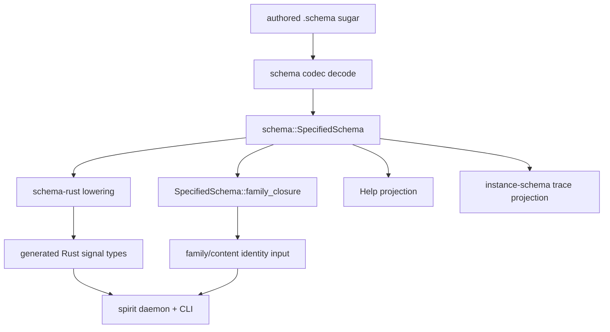

# SpecifiedSchema Rust lowering, family identity, and rename wave

schema-operator report 19

## Result

The requested sequence is implemented, pushed, and gated:

1. Rust lowering now enters through `schema::SpecifiedSchema`.
2. Family identity now uses the specified schema family closure.
3. The crate/package/import rename wave is complete: `nota-next` became the Rust crate/package `nota`, `schema-next` became `schema`, and `schema-rust-next` became `schema-rust`.
4. Spirit is integrated on pushed `main`, with local cargo gates, Nix build, Nix process-boundary integration, and the production-copy SEMA sandbox test green.

The GitHub repository slugs are still the historical `*-next` slugs. The Rust crates, package names, imports, generated paths, Nix vendored package names, and downstream consumers now use the current names.

## Visual



The important simplification is that Rust lowering and family identity no longer walk a parallel source-ish object. They read the same fully specified schema value that Help already reads.

## Data path

The new intended spine is:

```text
schema text
  -> schema::Schema
  -> schema::SpecifiedSchema
  -> schema_rust::RustModule
  -> generated signal Rust
```

For identity:

```text
schema::SpecifiedSchema
  -> family_closure(root)
  -> ordered specified declarations
  -> binary identity material
```

For Help:

```text
schema::SpecifiedSchema
  -> declaration lookup
  -> schema declaration codec
  -> help text
```

The conceptual instance for a root is fully specified data, not another text form:

```rust
SpecifiedRoot {
    name: "Input",
    variants: [
        SpecifiedVariant {
            name: "Record",
            payload: Struct {
                fields: [
                    Field { role: "Entry", reference: Entry },
                    Field { role: "Justification", reference: Justification },
                ],
            },
        },
    ],
}
```

That value can project to Rust, Help, instance schema, schema text, and identity. Schema text is authoring sugar over this value; it is not the authority once decoded.

## Rename Shape

```text
before                           after
nota-next package/lib crate      nota package/lib crate
nota_next Rust path              nota Rust path
schema-next package/lib crate    schema package/lib crate
schema_next Rust path            schema Rust path
schema-rust-next package/crate   schema-rust package, schema_rust crate
schema_rust_next Rust path       schema_rust Rust path
```

Nix still fetches from `github:LiGoldragon/nota-next`, `github:LiGoldragon/schema-next`, and `github:LiGoldragon/schema-rust-next` because the remote repositories have not been renamed. Inside the vendored closure those repos provide the renamed packages.

## Repo Matrix

| Repository | Pushed main commit | Gate |
|---|---:|---|
| `nota-next` | `96e64bcdbe53` | `cargo test` |
| `schema-next` | `b3d9826a04d0` | `cargo test`, identity tests |
| `schema-rust-next` | `06eec0d13e84` | `cargo test`, fixture regeneration |
| `signal-frame` | `d0dd5c0b66a9` | `cargo test`, `cargo test --features nota-text` |
| `version-projection` | `0f450f084025` | `cargo test`, `cargo test --features nota-text` |
| `signal-spirit` | `a01e7fa11000` | default + `nota-text` schema artifact regeneration |
| `meta-signal-spirit` | `62cab1163543` | default + `nota-text` schema artifact regeneration |
| `signal-mirror` | `34ed3fdd429b` | default + `nota-text` schema artifact regeneration |
| `meta-signal-mirror` | `9d2aeddf11d0` | default + `nota-text` schema artifact regeneration |
| `mirror` | `b7e39e0db1a8` | `nota-text` artifact regeneration, `--no-default-features` |
| `signal-persona` | `7de74911dd17` | default + `nota-text` schema artifact regeneration |
| `signal-standard` | `dfbda8d8a35b` | default + `nota-text` schema artifact regeneration |
| `signal-message` | `71da67a56dba` | default + `nota-text` schema artifact regeneration |
| `signal-mind` | `f5d6a93d7a64` | default + `nota-text` schema artifact regeneration |
| `signal-harness` | `0d06d4ae2a0b` | default + `nota-text` schema artifact regeneration |
| `signal-criome` | `182036acc4e7` | default + `nota-text` schema artifact regeneration |
| `signal-router` | `277bd153a714` | default + `nota-text` schema artifact regeneration |
| `meta-signal-router` | `5c0f6ee830cf` | default + `nota-text` schema artifact regeneration |
| `router` | `70b79603c8cf` | `nota-text` artifact regeneration, `--no-default-features` |
| `signal-agent` | `e271fb340ac4` | default + `nota-text` schema artifact regeneration |
| `signal-introspect` | `cbff25f55953` | `cargo test`, `cargo test --features nota-text` |
| `meta-signal-agent` | `d7378752368b` | default + `nota-text` schema artifact regeneration |
| `agent` | `098d2bee7f3c` | artifact regeneration, `--no-default-features` |
| `meta-signal-criome` | `507c56f57080` | default + `nota-text` schema artifact regeneration |
| `signal-sema` | `e11901358bab` | `cargo test`, `cargo test --features nota-text` |
| `spirit` | `d1e15bd8218b` | full gates below |

All listed worktrees were clean after push, and local `main@origin` matched local `main`.

## Spirit Gates

Spirit was the final integration target and had the broadest gates:

```text
cargo test
  -> ok

SPIRIT_UPDATE_SCHEMA_ARTIFACTS=1 cargo test --features nota-text
  -> ok

nix build .#default --no-link --print-out-paths
  -> /nix/store/88828d29zvi97vqw5jf5mzc799c0gjg5-spirit

cargo test --features nota-text --test nix_integration -- --ignored
  -> 9 passed, 0 failed, finished in 81.34s
```

The `nota-text` suite includes:

```text
tests/process_boundary.rs
  candidate_daemon_handover_from_production_copy_preserves_original_sema_database
    -> ok
```

That is the production-copy SEMA sandbox gate: a candidate daemon runs against a copied production-style store and the original store remains preserved.

The ignored Nix suite proves the pushed Spirit flake builds both binaries and exercises the Nix-built daemon/CLI over real Unix sockets:

```text
nix_build_default_package_emits_both_binaries ... ok
nix_built_daemon_rejects_invalid_input_through_schema_emitted_rejection ... ok
nix_built_daemon_returns_missed_when_no_matching_record_exists ... ok
nix_built_daemon_observes_recorded_entries_back_through_query ... ok
nix_built_daemon_alias_state_across_separate_cli_processes ... ok
nix_built_daemon_persists_state_across_two_cli_invocations ... ok
nix_built_daemon_handles_back_to_back_inputs_through_one_socket ... ok
nix_built_spirit_cli_records_through_real_socket_to_nix_built_daemon ... ok
nix_built_binaries_round_trip_representative_schema_outputs ... ok
```

## Fixes Found By The Gate

The final Spirit Nix gate caught two real integration issues:

1. The remote `github:LiGoldragon/spirit/main` branch resolution was stale in Nix, still resolving to the pre-migration commit. I changed the harness default to the exact local Git `HEAD` commit and kept stack overrides only when explicitly requested.
2. The Nix tests still expected an older fail-closed route. Current valid `Record` input with referents reaches referent registration first, so the no-guardian sandbox returns `ReferentGuardianRejected(HarnessUnavailable)`, not `GuardianRejected(HarnessUnavailable)`. The tests now assert the typed current route.

That second point is a useful behavioral witness: after adding the non-empty referent, the record is structurally valid and gets far enough to prove the referent guardian gate.

## Router Syntax Note

The rename wave also preserved the newer single-member field syntax where it mattered. `signal-router` now uses the explicit dot-prefix form for single-member named fields, for example:

```schema
EndpointTransport { Kind Target Auxiliary.(Optional String) }
Actor { Name Process Endpoint.(Optional EndpointTransport) }
RegisterActor { Actor Home.(Optional RemoteRouterIdentity) }
RouterBootstrapDocument { Operations.(Vector RouterBootstrapOperation) }
```

That keeps the old `name (Type)` field form out of newly regenerated router artifacts.

## Remaining Questions

1. Remote repository slugs: crate names are renamed, but GitHub repos are not. If the repo slugs should also lose `-next`, that is a separate infrastructure wave because every flake URL and Git dependency source changes.
2. Nix vendoring shape: Spirit still carries a large explicit vendoring patch surface. It is now green, but the repeated `substituteInPlace` blocks are brittle. The next cleanup should turn this into one typed source-closure rewrite instead of dozens of exact text substitutions.
3. Family identity consumers: schema and schema-rust now expose/use specified family closure. Any external identity reader outside this swept repo set should be checked before relying on old source-schema hashes.

## Coordination Note

The orchestrate claim helper could not update the lane claim during this work because the local daemon reported a schema-version mismatch: the lock file was written with v2 and the build expected v3. I continued with normal operator ownership on the code repos and recorded the state here.
