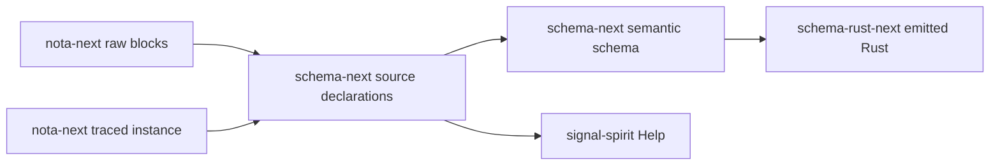
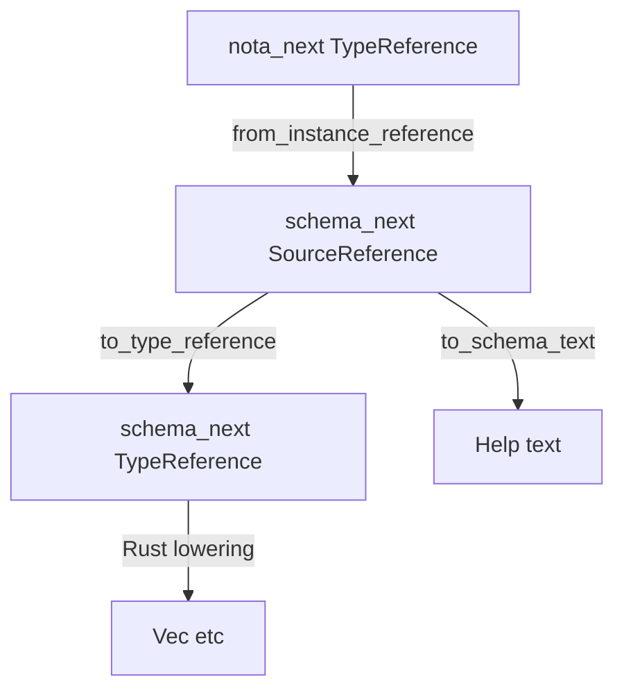
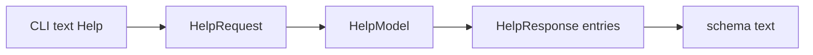
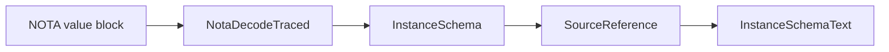

# Schema Engine Analysis And Audit

*schema-operator · engine audit after schema-IR/help/instance-schema integration
landed on main across nota-next, schema-next, schema-rust-next, and
signal-spirit.*

## Current Understanding

The schema engine is now a layered compiler stack:

The important convergence is real: Help no longer owns a parallel help AST,
Spirit's schema source now uses canonical `(Vector T)`, and Help plus
per-instance schema render the same `(Domains (Vector Domain))` shape through
schema-next's schema codec.

The phrase "one IR" needs precision. There is one schema-text/reference spine
for Help and instance-schema convergence, but there are still three Rust
representations at different layers:

That layering is healthy if intentional: `nota-next` cannot depend on
`schema-next`, and `SourceReference` preserves declaration/source-codec
information Help needs. It is not literally one Rust enum everywhere.

## Component Ledger

| Repo | Role | Size snapshot | Current main | Consumers |
|---|---|---:|---|---:|
| nota-next | raw NOTA parser, codec, structural macro node derive, instance trace base | 3,743 production Rust; 2,501 test Rust; 68 public types; 78 tests | `4642807` 2026-06-22 | 82 |
| schema-next | source codec, semantic schema, macro expansion, reference IR | 13,207 production Rust; 7,706 test Rust; 802 schema lines; 185 public types; 229 tests | `9219e32` 2026-06-22 | 10 |
| schema-rust-next | Rust lowering and build driver | 11,258 production Rust; 19,157 test Rust; 14,134 generated fixture lines; 143 public types; 102 tests | `e4ac3ba` 2026-06-22 | 49 |
| signal-spirit | Spirit wire contract and pilot client-side help/instance-schema use | 1,813 production Rust; 10,360 generated Rust; 323 schema lines; 283 public types; 38 tests | `99edb48` 2026-06-22 | 2 |

Dependency pins are clean on the integrated line:

- schema-next depends on nota-next `branch = "main"`.
- schema-rust-next depends on schema-next and nota-next `branch = "main"`.
- signal-spirit depends on nota-next and schema-next optionally under
  `nota-text`, and uses schema-rust-next as a build dependency on `main`.
- signal-spirit has no lingering `schema-ir`, `instance-schema`, or local
  cross-repo path patches.

The reverse-dependency counts are mechanical grep counts over LiGoldragon
`Cargo.toml` files and should be read as a rough blast-radius signal, not as a
semantic package graph.

## Runtime Path

### Help

`signal-spirit/src/help.rs` recognizes `(Help ...)` locally and returns before
daemon transport. `HelpResponse::to_schema_text()` delegates to
`SourceDeclarations::to_schema_text()`, while `HelpResponse::from_schema_text()`
delegates to `SourceDeclarations::from_schema_text()`. `Display` delegates to
that codec, so the forbidden hand-printer path is gone.

### Per-Instance Schema

The decoder walks the value once and returns both the decoded value and the
expected-type tree. Enums record the enum name at the schema position; the
chosen variant remains visible in the value payload. Empty vectors still carry
their element type because the decoder trait supplies the expected reference
before seeing elements.

## Witness Ledger

Current local audit runs:

| Command | Result | What it proves |
|---|---|---|
| `cargo test` in nota-next | green | raw parser, codec, structural macro node, instance trace base |
| `cargo test` in schema-next | green | source codec, dropped `Vec` alias behavior, family/stream source codec, instance render |
| `cargo test` in schema-rust-next | green | generated Rust compiles, `NotaDecodeTraced` emission, Rust lowering |
| `cargo test --features nota-text` in signal-spirit | green | Help, schema codec round-trip, rkyv round-trip, feature-gated text surface, convergence tests |

Selected live witnesses:

- `(Help Domains)` renders `(Domains (Vector Domain))`.
- Help and per-instance schema compare equal after lifting the instance trace
  into `SourceReference`.
- Help responses round-trip through both rkyv and schema text:
  `HelpResponse::to_schema_text()` then `HelpResponse::from_schema_text()`.
- signal-spirit's dependency-boundary test proves daemon-default builds do not
  pull nota-next/schema-next into the runtime dependency tree.
- schema-next tests keep `(Vec T)` as an ordinary `Application`, not the
  built-in vector.

No Nix/prod-database sandbox was rerun in this audit pass. The current tested
claim is source/test correctness across the four crates, not deployment
side-effect proof against a copied production Spirit database.

## Findings

### 1. Help Is Correctly Client-Side And Codec-Driven

`signal-spirit/src/help.rs` no longer has `HelpBody`, `HelpTypeExpression`,
or a local string formatter for Help declarations. Help is built from
`SchemaSource::from_schema_text`, stores `SourceDeclarationValue`, and encodes
through schema-next's declaration codec.

This closes the earlier major correctness hole: Help is not a daemon root, not
a parallel contract AST, and not NOTA-shaped text produced by `format!`.

### 2. The Vector Canonicalization Is Settled In Main

Spirit's source schema uses `(Vector T)` everywhere. schema-next documents and
tests that `Vec` is a dropped alias. signal-spirit has a convergence test that
would fail if Help preserved `(Vec Domain)` again.

The practical result: everything emits `Vector` in schema/help text, and Rust
lowering emits `Vec<T>` only at the Rust target layer.

### 3. "One IR" Is A Layered Bridge, Not One Rust Type

The code comments in signal-spirit say Help's `SourceDeclarationValue` is "the
SAME resolved IR that instance-schema rendering and Rust lowering read." The
implementation is slightly different:

- Help holds `schema_next::SourceDeclarationValue` /
  `schema_next::SourceReference`.
- Rust lowering mostly consumes semantic `schema_next::TypeReference`.
- Instance-schema initially records `nota_next::TypeReference`, then
  schema-next lifts it through `SourceReference::from_instance_reference`.

That is not a runtime bug; the tests prove the bridge is lossless for the
covered shapes. It is a terminology and architecture-boundary risk. Future
agents may read "same IR" as permission to collapse crate layering improperly
or to skip a bridge test when adding a new reference form.

Recommended wording: "one canonical schema reference spine, with source,
semantic, and instance-trace representations connected by typed projections."

### 4. Dot-Prefix Composite Field Syntax Is Not Landed

The old `*` shorthand and lowercase name-value forms are rejected, but the
parenthesized explicit composite field form is still accepted and re-emitted:

- `Query { (Topics (Vector Topic)) (Limit (Optional Integer)) }` round-trips
  in schema-next's source codec tests.
- `SourceField::from_explicit_structural_field` still recognizes that shape.
- `MacroExpansionField::explicit_structural_field` still recognizes the same
  shape in the declarative/macro path.
- `SourceField::to_schema_text` still emits parenthesized explicit composite
  fields for non-plain references.

Designer report `reports/schema-designer/12-unified-dot-prefix-field-syntax.md`
is accurate: implementing `Topics.(Vector Topic)` requires lookahead in both
source and declarative struct-body readers because NOTA tokenizes that as the
atom `Topics.` followed by the parenthesis block `(Vector Topic)`.

### 5. Stream And Family Are Typed In The Source Codec

The previous Help fallback that treated streams/families as raw text is gone
at the schema source level. `SourceDeclarationValue` has `Stream` and `Family`
variants, with typed `SourceStreamBody` and `SourceFamilyBody`, and Help
round-trips `IntentEventStream` through the schema codec.

There is still formatting inside schema-next's codec implementation. That is
not the forbidden application-level hand-printer; it is the owning schema codec.
The important boundary is that signal-spirit delegates to it instead of
constructing schema text itself.

## Questions

1. Should "one IR" be literal or layered? Literal means a deeper refactor:
   either nota-next's instance trace stops owning its own `TypeReference`, or a
   smaller shared reference crate appears below both nota-next and schema-next.
   Layered means we keep the current design and rename comments/tests to say
   "typed projections over one schema reference spine."

2. Should I implement the dot-prefix composite field migration now? The target
   grammar is `members.(Vector ContainedRunIdentifier)` and
   `limit.(Optional Integer)`, with the parenthesized explicit composite form
   hard-rejected after migration.

3. Should the old parenthesized explicit composite form be rejected immediately
   or accepted only by a one-shot migration tool? Because this is
   pre-production schema syntax, immediate rejection matches the workspace's
   normal direction. A migration tool only matters if existing checked-in
   schemas outside these four repos still use the form.

4. Should Help's public API stay source-declaration-shaped
   (`SourceDeclarationValue`) or be renamed as a schema-view type that wraps it?
   The current API is honest but leaks schema-next's source nouns into
   signal-spirit's client-facing library surface.

## Recommendation

Treat the landed schema engine as deployable for the Help/instance-schema
feature: tests are green, dependency gating holds, no daemon wire root was
added, and Help is codec-driven. The next implementation slice should be the
dot-prefix composite field syntax, because it is the remaining visible grammar
inconsistency and it blocks deprecating the older `(Field (Vector T))` form.

The IR wording cleanup should happen with that syntax slice: update comments
and tests to describe the actual layered representation, then add bridge tests
for any new reference forms introduced by dot-prefix composite fields.
