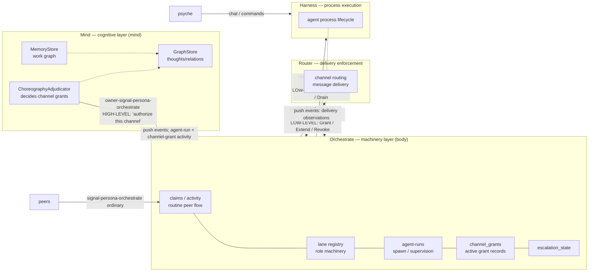

# 16 — Mind ↔ Orchestrate boundary — research with the mind/body analogy

*Research report opening the design question on what the
Mind→Orchestrate authority surface should look like at what level
of abstraction. Anchored in the psyche's mind/body analogy
(2026-05-20T13:45:00Z) and grounded in the current `persona-mind`
and `persona-orchestrate` designs as they stand. Seed for
multi-agent design exploration — open questions, not a finished
spec.*

## 0 · TL;DR

Psyche framing (2026-05-20T13:45:00Z): *the body does many things
mindlessly; the mind does many things that don't involve the body;
the mind can override the body and instruct it to do things it
wouldn't do on its own.*

Mapped onto the components:

- **Orchestrate is the body.** It has substantial autonomy. It
  runs claims, activity, repository index, lifecycle transitions,
  scope acquisition, scheduling, escalation — its own machinery
  — without Mind's involvement. Routine operation is the body's
  domain.
- **Mind is the mind.** It has its own life: the typed work
  graph, thought records, relations, channel-choreography
  decisions, durable policy truth, supersession judgment. Most of
  what Mind does does NOT involve directing Orchestrate.
- **The Mind→Orchestrate authority surface is the override and
  instruct path.** Mind reaches across to Orchestrate when its
  cognitive judgment needs to redirect the body — *not* to
  micromanage routine work. The abstraction level at the seam is
  cognitive ("authorize this channel for this agent's purpose";
  "we need to spawn an agent in this lane"); the body translates
  that into low-level mechanics (Grant/Extend on Router, Spawn on
  Harness).

The research question this opens: **what is the right vocabulary
of the override-and-instruct surface?** That surface is
`owner-signal-persona-orchestrate` today, with three verbs
(`Create` / `Retire` / `Refresh`). The destination surface
probably grows considerably, but the *shape* of the growth — what
verbs, what abstraction level, what payload structures — is open.

This report catalogs what Mind and Orchestrate already own, then
sketches the seam, then names open questions for other agents.

## 1 · The mind/body analogy as the design anchor

The psyche's statement (`intent/component-shape.nota`
2026-05-20T13:45:00Z, Principle, Maximum):

> *"think of the human mind vs the body; the body does many things
> mindlessly, and the mind does many things that don't involve
> controlling the body, while it still can override the body and
> instruct it to do things it wouldn't do on its own"*

Three load-bearing observations from the analogy:

**The body has autonomy.** Walking, breathing, digestion,
heartbeat — the body runs without explicit mental direction. If
the mind had to choreograph every step, the mind would do nothing
else. *Most* of what the body does is routine; the body's design
contains the mechanisms to handle routine without the mind.

**The mind has its own life.** Thinking, deciding, remembering,
imagining — most of what the mind does has no body-instruction
component. The mind reads, the mind plans, the mind judges.

**The mind can reach in when it matters.** The mind can hold
breath (override the autonomous breathing). The mind can say
"don't react to that itch" (override an autonomous reflex). The
mind can instruct the body to do something it wouldn't do on its
own ("walk to the kitchen now"). The mind doesn't ride alongside
the body's routine — it interrupts when its cognitive judgment
needs to redirect.

Mapped to Persona:
- **Orchestrate's autonomy** = claim flow, activity tracking,
  repository index management, lock-file projection, routine
  lifecycle transitions on agent-runs.
- **Mind's own life** = typed mind-graph, thoughts/relations,
  channel-choreography *decisions*, durable policy, work-graph
  reducer, subscription registration.
- **Mind's override and instruct** = the channel decision
  becomes a high-level instruction to Orchestrate; agent spawning
  is a cognitive decision Mind makes that Orchestrate enacts; an
  escalation may be Mind overriding routine "this blocked work
  should escalate, do that now."

The seam between Mind and Orchestrate lives at the
override-and-instruct boundary.

## 2 · Mind as it stands now

From `persona-mind/ARCHITECTURE.md`:

**Mind owns state.** Per the canonical principle
(`intent/persona.nota` 2026-05-18T12:08:41Z): *"persona-mind owns
STATE — work graph, memory, thoughts, durable policy truth,
channel-grant authority decisions."*

**Mind's current actor topology** (lines 137-150):

- `MindRoot` (the root actor)
- `IngressPhase` / `DispatchPhase` / `DomainPhase` — request flow
- `StoreSupervisor` → `StoreKernel` + `MemoryStore` + `GraphStore`
- `ViewPhase` — query/read-view
- `SubscriptionSupervisor` — post-commit graph delta delivery
- **`ChoreographyAdjudicator`** — *the channel-choreography
  decision plane*
- `ReplyShaper`

**Mind's owned domains**:
- Work/memory graph (items, notes, edges, status, aliases)
- Typed thought/relation graph (Thought + Relation records with
  supersession)
- Channel choreography decisions (currently in
  `ChoreographyAdjudicator`)
- Durable graph subscriptions (`SubscribeThoughts`,
  `SubscribeRelations`)
- Persona-specific subscription filters
- Operation-log audit trail
- Caller identity, time, event sequence, IDs — all minted by
  infrastructure/store actors

**What Mind does NOT own** (per ARCH §7 "Boundaries"):
- Ordinary role claim/release/handoff/activity — *belongs to
  `persona-orchestrate`*
- Router delivery, harness messaging, terminal transport
- OS/window-manager observation
- A shared database for other components
- BEADS as a live backend

**An important inconsistency.** Mind's ARCH §6.6 (lines 408-445)
currently asserts:

> *"`ChannelGrant`, `ChannelExtend`, `ChannelRetract`, and
> `AdjudicationDeny` (handled by `ChoreographyAdjudicator`) are
> outbound `Mutate` / `Retract` orders: **mind authoritatively
> tells the router to install / extend / remove a channel**; the
> router obeys and acks."*

This **contradicts** the corrected intent at
`intent/component-shape.nota` 2026-05-20T13:30:00Z (*"Orchestrate
owns Router; Mind does NOT own Router"*) and the canonical
authority chain at `intent/persona.nota` 2026-05-19T15:30:00Z
(*"supervisor → spirit → mind → orchestrate →
router/harness/terminal"*). Mind's ARCH §6.6 needs updating; the
new shape is: Mind decides (via `ChoreographyAdjudicator`); Mind
issues a high-level "enact this channel decision" to Orchestrate;
Orchestrate translates that into the low-level Router Grant/Extend
calls.

## 3 · Orchestrate as it stands now

From `persona-orchestrate/ARCHITECTURE.md`:

**Orchestrate owns machinery.** Per the same canonical principle:
*"persona-orchestrate owns MACHINERY — role claims, activity log,
agent-run lifecycle, spawn plans, scope-acquisition workflow,
executor capacity, scheduling, escalation, lane registry."*

**Orchestrate's authority graph** (§2, lines 119-134) — already
consistent with the corrected intent:

| Link | Contract | Direction |
|---|---|---|
| `persona-mind → persona-orchestrate` | `owner-signal-persona-orchestrate` | mind orders orchestration machinery |
| `persona-orchestrate → persona-router` | `owner-signal-persona-router` | **orchestrate orders channel grants and retractions** |
| `persona-orchestrate → persona-harness` | `owner-signal-persona-harness` | orchestrate orders agent-run lifecycle transitions |

**Orchestrate's ordinary surface** (`signal-persona-orchestrate`,
§3):
- `Claim(RoleClaim)` / `Release(RoleRelease)` /
  `Handoff(RoleHandoff)`
- `Observe(RoleObservation)`
- `Submit(ActivitySubmission)` / `Query(ActivityQuery)`
- `Watch(ObservationSubscription)` /
  `Unwatch(ObservationToken)`

**Orchestrate's owner surface today** (`owner-signal-persona-orchestrate`,
§4):
- `Create(CreateRoleOrder)`
- `Retire(RetireRoleOrder)`
- `Refresh(RefreshRepositoryIndexOrder)`

This is the surface Mind speaks on. **It is conspicuously
narrow** — three verbs that cover only role lifecycle and
repository index. The destination is much larger.

**Orchestrate's working tables** (§5):

| Table | Status |
|---|---|
| `claims` | implemented |
| `activities` | implemented |
| `activity_next_slot` | implemented |
| `claim_archive` | missing |
| `agent_runs` | missing |
| `spawn_plans` | missing |
| `agent_executors` | missing |
| `scope_acquisitions` | missing |
| `channel_grants` | **missing** — destination table for active grants |
| `escalation_state` | missing |

Each missing table corresponds to a missing capability. The
`channel_grants` row is particularly telling: the **active grant
state** lives in Orchestrate (Router enforces it; Orchestrate
records and authorizes it). Mind's `ChoreographyAdjudicator` makes
the *decision*; Orchestrate holds the *active enactment record*;
Router holds the *delivery enforcement*. State-vs-machinery split
applied to one capability.

## 4 · The seam — where the boundary lives

Mapped onto the mind/body analogy:

Two abstraction levels:

**Cognitive level (Mind→Orchestrate).** "I have decided that this
agent should be authorized to talk on this channel for this
purpose." "I have decided this work item is stuck and needs
escalation." "I have decided a new agent should run in lane X to
handle topic Y." Mind delivers cognitive intent; the verb shapes
match Mind's decision granularity, not Router/Harness's
mechanics.

**Mechanical level (Orchestrate→Router, Orchestrate→Harness).**
"Install ChannelId X with these endpoints and this duration."
"Spawn process for agent X with these resource limits." Orchestrate
translates cognitive intent into the concrete low-level mechanics
its downstream peers expect.

The translation step is the value Orchestrate adds — it has the
state (active runs, scope acquisitions, lane registry) to render
a cognitive instruction into the right mechanical operations.

## 5 · Candidate shape of the cognitive surface

This is the **research question** the psyche named. What verbs
does `owner-signal-persona-orchestrate` need to grow, at what
abstraction level, to carry the Mind→Orchestrate hop?

Today's three (`Create` / `Retire` / `Refresh`) cover only role
management. The destination needs to cover at minimum:

### Channel choreography (the hop /160 opened)

Possible candidate verbs:

- `AuthorizeChannel(ChannelAuthorization)` — *Mind: "I have
  decided this channel exists between these endpoints for this
  purpose."* Payload carries the cognitive shape (purpose, parties,
  conditions). Orchestrate decides whether to call Router with
  `Grant(...)` plus what concrete `ChannelDuration` /
  `ChannelMessageKind` set fits the authorization.
- `RetractChannelAuthorization(ChannelAuthorizationToken)` —
  *Mind: "that authorization no longer holds."* Orchestrate
  decides whether to call Router with `Revoke(...)` or
  `Deny(...)`.
- `RecordChannelDecision(ChannelDecision)` — *Mind: "for
  audit/state purposes, here's the cognitive trail of why."*

Note the abstraction level: cognitive ("authorize for purpose")
vs mechanical ("Grant ChannelId-X with TimeBound until T2").

### Agent lifecycle (the next likely hop)

- `SpawnAgent(AgentSpawnIntent)` — *Mind: "I have decided we need
  an agent in lane X to handle topic Y."* Orchestrate maps that
  to spawn plans, scope acquisitions, harness orders.
- `EscalateBlockedWork(EscalationIntent)` — *Mind: "this work
  item is stuck; do whatever you need to do to surface it for
  user attention."*

### Cross-cutting policy

- `ConfigureSchedulingPolicy(...)` — slot caps, prioritization,
  backpressure.
- `ConfigureSupervisionPolicy(...)` — restart, drain, escalation
  rules.

These are still candidates. Naming, granularity, and payload
shape are open. The shape question is partly a question of how
much cognitive context Mind transfers across the seam vs how
much is reconstructable from Orchestrate's own state.

### Counter-example — what does NOT belong on this surface

- `Grant(...)` / `Extend(...)` / `Revoke(...)` /
  `Deny(ChannelGrant)` shape — that's Router-level mechanics.
  If Mind speaks Router-level on owner-signal-persona-orchestrate,
  Orchestrate becomes a pass-through translator with no
  value-add.
- `SetActiveClaim(...)` / `MoveActivity(...)` — that's already
  in `signal-persona-orchestrate` ordinary (peer-callable);
  doesn't need owner override unless Mind needs to *force* a
  claim against peer behavior.
- `RefreshRepositoryIndex(...)` is debatable. Is it cognitive
  ("I want a fresh look at the workspace") or routine
  machinery ("git pull, basically")? Today it's owner-only;
  arguably it could be peer-callable too.

## 6 · What stays in Orchestrate's autonomous loop

The body has many autonomous capabilities; the mind doesn't have
to instruct each one. What Orchestrate handles on its own:

- **Peer claim/release/handoff flow.** Agents claim scopes;
  Orchestrate enforces non-overlap; Mind doesn't see this unless
  Mind subscribed to activity.
- **Activity log.** Continuous record of agent-issued
  observations; Orchestrate timestamps and sequences; Mind reads
  through subscription if interested.
- **Routine agent-run lifecycle transitions.** "Process started,"
  "process exited cleanly," "process replaced" — Orchestrate's
  state machine, Mind sees observations.
- **Repository index machinery.** ghq checkouts, symlinks,
  metadata refresh — pure machinery.
- **Lock-file projection.** Compatibility output from typed
  state — Orchestrate's housekeeping.

Anything Mind subscribes to with a push observation is
information flowing up; the body reports to the mind. Anything
Mind doesn't subscribe to, the body handles silently.

## 7 · Where Mind reaches in (the override path)

The override-and-instruct boundary specifically:

- **Channel choreography decisions** — Mind's `ChoreographyAdjudicator`
  has decided a channel should exist (or extend, or close). Mind
  instructs Orchestrate to enact.
- **Cross-cutting policy reshapes** — Mind decides scheduling
  capacity should change, or supervision policy should be
  different. Mind instructs Orchestrate to reconfigure.
- **Escalation overrides** — Mind has judged that routine work
  shouldn't proceed (e.g., this blocked work needs human
  attention; this agent-run should be paused for cognitive
  review).
- **Spawn requests** — Mind has decided an agent is needed for a
  cognitive purpose; Mind instructs Orchestrate to spawn.
- **Retirement of cognitive constructs** — Mind has decided a
  role is no longer needed; Mind instructs Orchestrate to retire.

What makes these the override-and-instruct path: they're
moments of **cognitive judgment**. Mind isn't running the routine
loop alongside Orchestrate — Mind reads its own state (the
work graph, choreography decisions, escalation triggers), makes a
judgment, and reaches across.

## 8 · The lifecycle question — does Mind have Start/Stop?

The other open intent (`intent/component-shape.nota`
2026-05-20T13:45:00Z, Clarification, Minimum):

> *"we need start/stop/etc verbs?"*

The mind/body analogy speaks to this. The mind doesn't tell the
body to start beating its heart at birth — that's birth-level
infrastructure. The mind doesn't tell the body to stop when the
body dies — that's death-level infrastructure.

Mapped: **Mind's lifecycle is infrastructure-level, not
cognitive-level.** The supervisor (or systemd in current
deployment) brings Mind up and down. `owner-signal-persona-mind`
stays cognitive-policy-only (Configure / Inspect and future
Spirit-shaped surfaces); lifecycle lives out-of-band.

This is a **research lean**, not a settled answer. The competing
reading is: the workspace's "two authority tiers, no middle"
rule means every owner surface must carry lifecycle too,
because there's no separate supervisor contract. If that's
right, `owner-signal-persona-mind` grows `Start` / `Drain` /
`Stop` / `Reload` (carried by whichever owner is acting:
Spirit for cognitive policy, supervisor for lifecycle).

Open for psyche / multi-agent design.

## 9 · Inconsistencies to fix (in addition to the seam research)

Surfaces that already disagree with the corrected intent and
need updating:

1. **`persona-mind/ARCHITECTURE.md` §6.6** asserts Mind
   *"authoritatively tells the router to install / extend /
   remove a channel."* Needs updating: Mind decides; Mind
   instructs Orchestrate; Orchestrate calls Router.
2. **`skills/component-triad.md` authority-chain mermaid**
   (lines ~308-326) shows Mind issuing Mutate directly to
   Router as step 3. Needs updating: Mind→Orchestrate, then
   Orchestrate→Router (matches the §"4. Two authority tiers"
   text in the same skill, which is already correct).
3. **`intent/component-shape.nota` 2026-05-19T20:30:00Z**
   ("signal-persona-mind's channel-choreography family
   splits into multiple contract-local verbs Grant / Extend
   / Revoke / List / Deny") — this earlier intent is
   superseded by the 2026-05-20T13:30:00Z correction.
   Needs explicit supersession marking per
   `skills/intent-maintenance.md`.

These are designer-lane edits; surfaced here so the design
research output points at all the surfaces that need to come
into alignment.

## 10 · Open questions for multi-agent design exploration

The psyche named this report as a seed to "involve other agents
in the design." Concrete questions other agents can pick up:

### Q1 — Cognitive vocabulary on owner-signal-persona-orchestrate

What's the right verb set and abstraction level for the
override-and-instruct surface? Sketch:

- Is the cognitive layer expressed as `AuthorizeChannel` +
  `RetractAuthorization`, or as something more abstract like
  `EnactDecision(CognitiveDecision)` with a sum payload
  carrying the kind of decision?
- Should each cognitive verb carry an explicit "why" payload
  (decision provenance from Mind's adjudicator) that
  Orchestrate stores for audit?
- How do cognitive verbs compose with Orchestrate's
  existing peer-callable working surface (claims, activity)?

### Q2 — Mind→Orchestrate hop payload shape

When Mind calls `AuthorizeChannel(...)` (or whatever the
cognitive verb is named), what does the payload carry?

- Endpoints? (Channel ID, source, destination, kinds —
  Router-level)
- Or purpose? ("authorize this agent for this work item's
  cross-component messaging" — cognitive-level)
- Or a fused shape: enough cognitive context for audit, plus
  enough mechanical hints for Orchestrate to render Router
  calls without a second round-trip?

### Q3 — Bidirectional flow: how does Orchestrate report back?

Mind subscribes to Orchestrate's working state via
`signal-persona-orchestrate` push subscription (per
push-not-pull). When Orchestrate has enacted (Router accepted
the grant; channel is live), how does it surface that to
Mind? As a typed event on a subscription? As an inline reply
to the owner call?

Mind's `ChoreographyAdjudicator` needs to know enactment
succeeded to advance its own state from "decided" to "live."
That feedback loop is currently undesigned.

### Q4 — Cognitive vs mechanical mapping rules

Inside Orchestrate, what rule decides the Router-shaped
`Grant(ChannelGrant)` from the cognitive
`AuthorizeChannel(...)` payload? Is the translation purely
mechanical (Orchestrate picks the duration based on
authorization type), or does it consult Orchestrate's own
state (current scope acquisitions, agent runs)? Different
answers shape the verbs.

### Q5 — Escalation, spawn, lifecycle — what else needs the override path?

Once channel choreography lands, what's the next cognitive
verb? Likely `SpawnAgent(...)` because /233's persona-orchestrate
work names agent lifecycle. Each new cognitive verb is a
research microcosm — sketch the cognitive layer first, then
the mechanical translation.

### Q6 — Mind lifecycle on signal contract vs out-of-band

(From §8 above.) Should `owner-signal-persona-mind` carry
`Start` / `Drain` / `Stop` / `Reload`, or does Mind's
lifecycle stay infrastructure-supervisor-only? The mind/body
analogy suggests out-of-band; the two-tier rule suggests
on-contract. Need explicit psyche resolution.

### Q7 — Subscription flows for Mind's body-observation

Mind observes Orchestrate via push subscription (per the
"observe up-tree, order down-tree" rule). Which subscriptions
does Mind currently need or want from Orchestrate? Agent-run
lifecycle? Activity stream? Lane registry changes?
Channel-grant enactment confirmations? Specifies the
information flow up.

## 11 · References

### Settled intent (the design substrate)
- `intent/persona.nota` 2026-05-18T12:08:41Z — *"persona-mind
  owns STATE … persona-orchestrate owns MACHINERY."* The
  load-bearing principle.
- `intent/persona.nota` 2026-05-19T15:30:00Z — *"Spirit owns
  mind … supervisor → spirit → mind → orchestrate →
  router/harness/terminal."* Canonical authority chain.
- `intent/component-shape.nota` 2026-05-20T13:30:00Z —
  *"Orchestrate owns Router; Mind does NOT own Router."*
  Correction.
- `intent/component-shape.nota` 2026-05-20T13:45:00Z — the
  mind/body analogy Principle anchoring this research.

### Component designs as they stand
- `/git/github.com/LiGoldragon/persona-mind/ARCHITECTURE.md`
- `/git/github.com/LiGoldragon/persona-orchestrate/ARCHITECTURE.md`
- `/git/github.com/LiGoldragon/signal-persona-mind/src/lib.rs`
- `/git/github.com/LiGoldragon/signal-persona-orchestrate/`
- `/git/github.com/LiGoldragon/owner-signal-persona-orchestrate/src/lib.rs`
- `/git/github.com/LiGoldragon/owner-signal-persona-router/`
  (newly created in /operator-assistant/160)

### Workspace skills
- `skills/component-triad.md` §"4. Two authority tiers" — the
  canonical wording (consistent with corrected intent).
- `skills/component-triad.md` authority-chain mermaid — needs
  fixing (inconsistent).
- `skills/intent-maintenance.md` — supersession protocol for
  the 20:30Z record.

### Related reports
- `reports/operator-assistant/159-persona-mind-signal-tree-owner-contract-vision.md`
- `reports/operator-assistant/160-owner-signal-persona-router-channel-authority.md`
- `reports/second-designer-assistant/14-audit-of-operator-assistant-159-owner-signal-persona-mind.md`
- `reports/second-designer-assistant/15-clarification-for-operator-assistant-on-orchestrate-router-authority.md`
- `reports/designer/249-component-intent-gap-analysis.md` §3
  (persona-orchestrate) — surfaces several adjacent gaps,
  particularly Gap #15 (Mind→orchestrate authority handoff
  missing).
