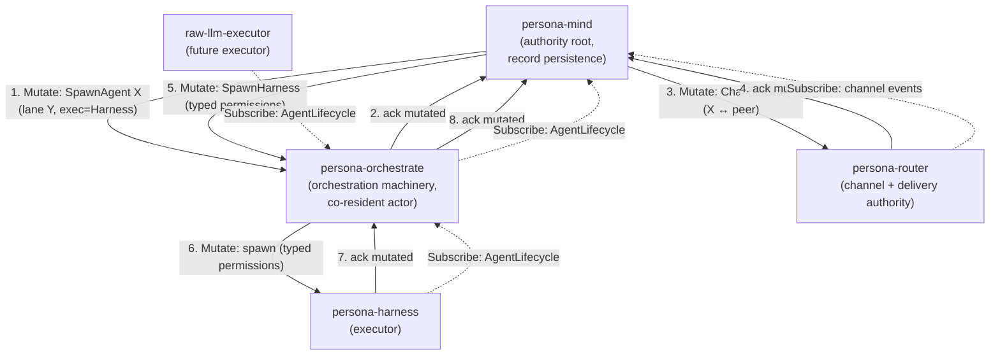

# orchestrate — landed state + forward intent

*Consolidated record of the orchestrate work arc. Agglomerates and
supersedes prior reports 1–4 of this lane. Captures what landed
across the workspace, the persona-orchestrate architectural
position, the Rust-port operator spec, and the open beads. One
read for any agent picking up adjacent work.*

Date: 2026-05-17

Author: second-designer-assistant

---

## TL;DR

**Landed this session:**

1. **Skill scaffolding consolidation.** Seven assistant skill files
   deleted; `skills/role-lanes.md` is the canonical meta-pattern;
   four main-role skills (`designer`, `operator`,
   `system-specialist`, `poet`) carry inline *"Working with
   assistants"* sections; `AGENTS.md`, `ARCHITECTURE.md`, and the
   protocol doc swept to match.
2. **`orchestrate/` directory.** `protocols/orchestration.md`
   renamed to `orchestrate/AGENTS.md` (clean break, no shim); 11
   lane lock files moved from workspace root into `orchestrate/`;
   `tools/orchestrate` updated to read/write the new location;
   `.gitignore` simplified from 11 individual entries to one
   `/orchestrate/*.lock` glob; 13 workspace files swept.
3. **Shell-helper interim port.** `orchestrate/roles.list` is the
   externalised lane registry (one lane per line, bash-readable);
   `tools/orchestrate` sources roles via `mapfile` instead of a
   hardcoded array; adding a lane is a one-line edit in
   `roles.list` plus a report subdirectory.

**Outstanding (filed as beads):**

- **`primary-68cb`** `[role:operator]` — Rust port of
  `tools/orchestrate` as a **thin signal-persona-mind client**.
  Scope, checklist, and acceptance criteria in §3 of this report.
- **`primary-699g`** `[role:designer]` — design
  `signal-persona-orchestrate` contract + `persona-orchestrate`
  component. Architectural rationale in §2 of this report.

**The persona-orchestrate position** (§2): orchestration verbs
split cleanly between two concerns. `persona-mind` owns the
*records* — `RoleClaim`, `RoleRelease`, `RoleHandoff`,
`RoleObservation`, `ActivitySubmission` already exist as typed
records in `signal-persona-mind` and as parsed requests in
`persona-mind`. A new `persona-orchestrate` would own the
*machinery* — agent spawning across harness + the planned
raw-LLM-API executor, supervision FSM for running agents, conflict
resolution policy, scheduling, escalation on blocked work. The
conceptual split is universal (Erlang/OTP, Akka, Hewitt's actor
model); deployment-level split (separate OS process vs co-resident
actor) is deferrable at workspace scale.

**As of designer/210 (commit `90cba206`), this is no longer just a
recommendation.** `persona-mind/ARCHITECTURE.md` §6.6 (new) names
the orchestrate component's slot in the Mutate authority chain
running through it; `skills/component-triad.md` (new, tier-1
required reading per `AGENTS.md` §"Skill importance") names the
universal daemon + CLI + signal-* contract shape that
persona-orchestrate must follow; and the Mutate authority verb
reframing in `signal-core/ARCHITECTURE.md` shapes how
`signal-persona-orchestrate`'s verbs need to be designed (most are
**Mutate** orders flowing down-tree from mind through orchestrate
to executors). The bead `primary-699g` design work has *upstream
inputs* now, not just a green field.

---

## §1 — What landed

### Five commits on `main`

```
8fb724eb  second-designer-assistant: report 1 — role-skill consolidation survey + .gitignore system-assistant.lock fix
a7d68dbf  skills: collapse 7 assistant skill files into skills/role-lanes.md meta-pattern
81f5262f  orchestrate/: move protocols/orchestration.md + 11 lane lock files into dedicated directory
d1ebdb04  orchestrate: source role list from external orchestrate/roles.list (interim shell port)
604c220b  second-designer-assistant: revise report 2 — narrow Rust-port scope per report 4
(plus the report commits 3a2712c0, 22e4f580, 9f6b8c75 — research artefacts)
```

### Skill scaffolding — before and after

```
Before                                  After
──────                                  ─────
11 role skill files (~3000 lines)       5 role-shaped skill files (~1700 lines):
  designer.md, operator.md,               designer.md (with "Working with assistants")
  system-specialist.md, poet.md           operator.md (same)
  designer-assistant.md                   system-specialist.md (same)
  second-designer-assistant.md            poet.md (same)
  operator-assistant.md                   role-lanes.md (new — the meta-pattern)
  second-operator-assistant.md
  system-assistant.md                   7 assistant skill files deleted
  second-system-assistant.md
  poet-assistant.md
```

The lane mechanism in `skills/role-lanes.md`: per-lane is **lock
filename**, **report subdirectory**, **claim string** — and only
those three. Everything else (discipline, required reading, owned
area, beads label) is shared with the main role. Adding a future
lane (`third-designer-assistant`, etc.) is now: add to
`orchestrate/roles.list`, create `reports/<lane>/`, mention in
`AGENTS.md`. No new skill file. Three-place edit shrinks to
two-and-a-half.

### `orchestrate/` directory layout

```
~/primary/
├── orchestrate/
│   ├── AGENTS.md                          ← was protocols/orchestration.md
│   ├── roles.list                         ← interim role registry (bash-readable)
│   ├── operator.lock                      ← lane state (gitignored)
│   ├── operator-assistant.lock
│   ├── second-operator-assistant.lock
│   ├── designer.lock
│   ├── designer-assistant.lock
│   ├── second-designer-assistant.lock
│   ├── system-specialist.lock
│   ├── system-assistant.lock
│   ├── second-system-assistant.lock
│   ├── poet.lock
│   └── poet-assistant.lock
├── tools/orchestrate                      ← shell helper, sources orchestrate/roles.list
└── protocols/
    └── active-repositories.md             ← stays (not orchestration state)
```

Workspace root lost 11 visual-clutter lock files. The protocol doc
moved to its own directory, sitting next to the lock files it
governs.

### What didn't change

- `tools/orchestrate` invocation surface (`claim`, `release`,
  `status`) — agents see no change.
- Lock-file format (plain text, one scope per line, optional
  `# reason` annotation).
- Report-lane structure (`reports/<lane>/` per the existing
  convention, exempt from claim flow).
- BEADS storage and access patterns.
- Workspace baseline reading list (added `skills/role-lanes.md`;
  removed per-lane skill mentions from the role contracts list;
  the discipline reading is unchanged).

---

## §2 — Persona-orchestrate: records vs machinery

### The position

`signal-persona-mind` already owns the **records** of orchestration:

- `RoleClaim` (`signal-persona-mind/src/lib.rs:418`) —
  "this lane is claiming this scope at this time, for this reason."
- `RoleRelease` (`lib.rs:450`).
- `RoleHandoff` (`lib.rs:466`).
- `RoleObservation` (`lib.rs:543`) — query for current state.
- `ActivitySubmission` (`lib.rs:580`).
- Reply records: `ClaimAcceptance`, `ClaimRejection`,
  `ReleaseAcknowledgment`, `HandoffAcceptance`,
  `HandoffRejection`, `RoleSnapshot` (with `ClaimEntry` +
  activity history).

The `signal_channel!` macro at `lib.rs:1756-1760` wires them
through the signal-core verb vocabulary:
`Assert RoleClaim`, `Retract RoleRelease`, `Mutate RoleHandoff`,
`Match RoleObservation`, `Assert ActivitySubmission`.

`persona-mind` already parses these requests
(`persona-mind/src/text.rs:242-782` — NOTA-text → typed
`MindRequest` for the role verbs).

What does **not** exist anywhere in the workspace:

- The **machinery** that produces orchestration outcomes —
  conflict resolution beyond path-nesting, agent spawning
  (today done manually by humans starting Codex / Claude Code
  sessions), supervision of running agents, dead-agent
  recovery, blocked-work escalation, scheduling across executor
  kinds (harness vs the planned raw-LLM-API path).
- A scheduler actor inside `MindRoot`. The daemon's child-actor
  topology is request-side and state-side only
  (`IngressPhase`, `DispatchPhase`, `DomainPhase`,
  `StoreSupervisor`, `ViewPhase`, `SubscriptionSupervisor`,
  `ChoreographyAdjudicator`, `ReplyShaper` per
  `persona-mind/ARCHITECTURE.md`).
- A signal contract for orchestration commands and lifecycle
  events.

This is a real gap. `tools/orchestrate` today is the workspace's
*entire* machinery surface; it covers exactly the path-nesting +
task-token-exact-match overlap check plus lock-file emission. As
soon as the workspace wants automated spawning (e.g. "a bead under
`role:operator` just transitioned to ready, spawn an operator
agent for it"), the shell helper's surface is inadequate.

### The Kameo analogy is correct

The actor-system tradition draws a sharp line between worker
abstraction and runtime/supervisor abstraction:

- **Hewitt's actor model** gives actors three primitives (send,
  create, designate). Supervision is a *runtime* concern.
- **Erlang/OTP** Supervisor Principles: *"a child process does
  not need to know anything about its supervisor… it is instead
  only the supervisor which hosts the child who must know which
  of its children are significant ones."*
- **Akka** carries the same shape — ClusterSingletonManager,
  ClusterSharding, etc. live alongside user actors but are
  conceptually a different layer.

Translating: `persona-mind` is the "child" — it owns its state,
answers requests, doesn't carry agent-lifecycle code.
`persona-orchestrate` is the supervisor-shaped component. They
communicate through typed signal channels.

The Kameo refactor pressure
(`reports/operator-assistant/138-persona-mind-gap-close-2026-05-16.md`
§"P2" — supervised state-bearing actors race shutdown ordering
because `notify_links` drops `mailbox_rx` before the actor's
`Self` value is dropped) is the *implementation* challenge of
getting supervision right. It argues for encapsulating
supervision discipline in **one** place rather than scattering it
across every component that needs to spawn or supervise.

### Similar-systems pattern at workspace scale

When systems split state from scheduling at process level:

- **Kubernetes** — `kube-scheduler` separate from `kube-apiserver` /
  etcd. Driven by scale, horizontal scalability, independent
  component evolution.
- **Borg → Omega** (Schwarzkopf et al., EuroSys 2013) — Borg
  unified state + scheduler; Omega refactored to shared state +
  parallel schedulers, explicitly because monolithic scheduling
  *"restricts feature velocity and decreases utilization"* at
  Google scale.
- **Mesos** — master allocates resources; frameworks schedule on
  top. Two-level. Driven by heterogeneity (multiple teams,
  multiple scheduling logics).

When systems unify at process level:

- **Nomad** — server holds state and runs scheduler in-tier.
  Operational simplicity wins at smaller scale.
- **systemd / launchd** — init unifies supervision and state of
  what's running. PID 1 can't be split.
- **Erlang/OTP, Akka** — supervisor and worker are different
  abstractions in the same OS process. The conceptual split
  holds; process boundary doesn't.

Our workspace is in the small-scale regime (one node, ~10 agents
max, one discipline). The K8s/Omega *process-level* split is a
scale argument that doesn't apply. The *conceptual* split (clean
contract boundary between machinery and records) applies
universally — even Erlang and Akka, which run everything in one
VM, insist on the supervisor-vs-worker distinction.

### Recommended shape

The shape is now constrained by three pieces of upstream
discipline landed in designer/210:

- The **triad** (`skills/component-triad.md`, new tier-1 skill):
  every stateful component is a *daemon + CLI + signal-* contract*.
  `persona-orchestrate` follows this — `persona-orchestrate/`
  repo (daemon + `orchestrate` CLI), `signal-persona-orchestrate/`
  repo (typed wire vocabulary + per-variant `SignalVerb` mapping).
  Three invariants the triad enforces apply unchanged: CLI has
  exactly one Signal peer (its own daemon), daemon's external
  surface is exclusively `signal-core` frames, verb declared
  per-variant in the contract crate.
- The **Mutate authority semantics** (`signal-core/ARCHITECTURE.md`,
  authority-direction paragraph): `Mutate` is the authority verb —
  top-down, *"change this; I do not care what you think."* The
  issuer holds *possibly-mutated* state until the subordinate
  confirms; transitions to *now-mutated* on the typed reply; may
  then issue the next downstream order.
- The **explicit slot** (`persona-mind/ARCHITECTURE.md` §6.6, new):
  orchestrate component is named in mind's extended authority chain
  — mind issues `Mutate (SpawnAgent X in lane Y)` to orchestrate;
  orchestrate may further issue `Mutate (spawn typed permissions)`
  to harness or future executors; each subordinate obeys and
  confirms; mind transitions its choreography state on each
  confirmation.

#### `signal-persona-orchestrate` — verb classifications

Per the triad invariant "verb declared per-variant in the contract
crate," each request kind carries one of the six `SignalVerb` roots.
The orchestrate vocabulary lands like this (proposed; the contract
design in `primary-699g` finalises):

| Request | Verb | Direction | Notes |
|---|---|---|---|
| `SpawnAgent { lane, work, executor }` | **`Mutate`** | mind → orch | Authority order; orch obeys and confirms via `AgentSpawned`. May internally issue downstream `Mutate` to executor. |
| `AcquireScope { lane, scope, reason }` | **`Mutate`** | issuer → orch | Authority order: install the scope claim; orch resolves conflict and confirms via `ScopeAcquired` or typed-failure `ScopeRejected`. Internally orch persists the underlying `RoleClaim` via existing `signal-persona-mind`. |
| `ReleaseScope { lane, scope }` | **`Retract`** | issuer → orch | Symmetric retraction; orch persists `RoleRelease` via `signal-persona-mind`. |
| `SuperviseAgent { lane, policy }` | **`Mutate`** | mind → orch | Authority order: register restart policy. |
| `EscalateBlockedWork { lane, work, reason }` | **`Assert`** | bottom-up | A typed *fact*: "this work is blocked because…". Orch's escalation flow turns the asserted fact into a user-visible escalation. Not an authority chain. |
| `OrchestrateObservation` | **`Match`** | any | One-shot query for current orchestrate state. |
| `AgentLifecycle` deltas | **`Subscribe`** | observer → orch | Push subscription; receivers observe agent FSM transitions. Per `skills/push-not-pull.md`. |
| `ScopeContested` events | **`Subscribe`** | observer → orch | Push subscription on conflict-resolution events. |
| `WorkReady` events | **`Subscribe`** | observer → orch | Push subscription on new-ready-work notifications. |

The verb-mapping witness test from the triad skill catches
misclassifications: `signal-persona-orchestrate-signal-verb-mapping-covers-every-request-variant`.

#### The Mutate chain through `persona-orchestrate`



At each Mutate step the issuer holds *possibly-mutated* state
until the typed ack arrives; only then does it advance to the
next order. Replies are confirmations (or typed-failure
rejections), not opinions. The harness is not spawned with
channel rights until step 4 returns: install the channel, then
spawn the agent that uses it.

The two relationships matter:

- **Authority down-tree.** Mind issues Mutate orders to orchestrate;
  orchestrate may issue Mutate orders to executors. Each step is
  obeyed-then-confirmed.
- **Observation up-tree.** Executors emit `AgentLifecycle`
  subscriptions to orchestrate; orchestrate emits its own
  subscriptions to mind. Observation flows the opposite direction
  from authority, per `skills/push-not-pull.md`.

#### Multi-executor

`(SpawnAgent <lane> <work-item> <executor-kind>)` accepts at
minimum `Harness` (existing — orch issues Mutate down to
`persona-harness`) and `RawLlm` (forthcoming — the user-named
non-harness path for specialised LLM calls, slotted into the same
spawn authority per /210 §5). Future executor kinds land as new
enum variants on the executor enum. This is the Mesos two-level
pattern in miniature: orchestrator allocates work to executors;
each executor owns its own runtime discipline; orch's contract
stays stable as executors come and go.

#### Deployment

Start as a co-resident Kameo actor tree in the same OS process as
`MindRoot`, contracted by `signal-persona-orchestrate`. The contract
boundary is the load-bearing distinction; physical process split is
deferrable. Peel apart if independent failure / restart or real-time
constraints from the raw-LLM-API executor demand it. This matches
report 4's Nomad-flavored recommendation and isn't contradicted by
/210 §3 ("this report doesn't contradict that").

### Why this beats the alternatives

- **"Just put orchestrate machinery in persona-mind."** Violates
  the central-state daemon's owned scope (record persistence,
  not lifecycle management). Bloats one daemon with two
  concerns and two failure domains.
- **"Build a separate `signal-persona-orchestrate` contract but
  duplicate the role records there too."** Forces every
  component touching role state to choose between two record
  types. Drift inevitable.
- **"Skip persona-orchestrate; let each future component
  re-implement its own scheduling."** Per
  `skills/micro-components.md` and the Mesos rationale — when
  multiple executors need scheduling, *one shared scheduler
  beats per-executor scheduling*.

---

## §3 — `tools/orchestrate` Rust-port operator spec (bead `primary-68cb`)

### Scope

A Rust port of `tools/orchestrate` that **imports
`signal-persona-mind` for the record vocabulary** and **preserves
the on-disk lock-file format bit-for-bit**. No new contract crate.
No new typed vocabulary. The orchestration *machinery* (agent
spawning, supervision, etc.) is out of scope — that's bead
`primary-699g` and §2 above.

### What the binary does

1. **Reads the role registry.** Today `orchestrate/roles.list`;
   accepts `orchestrate/roles.nota` once that file is introduced
   (the Nota form is a parallel piece of work; both readers can
   coexist during the transition).
2. **Decodes argv into a `signal-persona-mind` request.**
   - `claim <lane> <scope> [...] -- <reason>` →
     `MindRequest::RoleClaim(RoleClaim { lane, scopes, reason, ... })`.
   - `release <lane>` →
     `MindRequest::RoleRelease(RoleRelease { lane, ... })`.
   - `status` →
     `MindRequest::RoleObservation(RoleObservation)`.
3. **Resolves overlap.** Reads all peer lock files; applies the
   existing path-nesting / task-token-exact-match overlap rules
   (current `tools/orchestrate` §`scopes_overlap`); surfaces
   conflicts in the reply.
4. **Writes lock files.** On successful claim/release, writes
   `orchestrate/<lane>.lock` in the existing format as a **side
   effect**. Lock files are a serialised projection for the
   shell-helper era; the records are the source-of-truth shape
   in `signal-persona-mind` vocabulary.
5. **(Future)** sends the decoded `MindRequest` to
   `persona-mind`'s Unix socket directly, once persona-mind is
   the canonical store. At that point the lock-file side effect
   becomes redundant and drops. Once `persona-orchestrate`
   (§4) is live, the natural routing is `tools/orchestrate` →
   `signal-persona-orchestrate AcquireScope` (Mutate) →
   orchestrate → underlying `RoleClaim` via signal-persona-mind.
   The orchestrate layer is what resolves conflicts and emits
   the lifecycle events; mind stays the persistence layer. For
   the rewrite itself, the immediate target is mind-direct
   (since orchestrate doesn't exist yet); the routing-through-
   orchestrate shape is a small follow-up once the
   `signal-persona-orchestrate` contract lands.

### What the binary explicitly does NOT do

- Define its own typed vocabulary.
- Build its own contract crate.
- Spawn or supervise agents.
- Implement scheduling policy.
- Implement escalation flows.

All of those belong to `persona-orchestrate` (bead `primary-699g`).

### Implementation form

Two options, operator chooses:

- **Direct binary at the path.** `tools/orchestrate` is the Rust
  binary. Clean; requires the build to drop the binary at exactly
  that path.
- **Bash shim wrapper.** `tools/orchestrate` is a 3-line bash
  shim that exec's a Rust binary placed nearby. Lower
  build-system friction.

Behavior identical either way.

### Typed errors per `skills/rust/errors.md`

One `Error` enum, `#[from]` conversions for foreign types, no
`anyhow` or `Box<dyn Error>`. Variants:

- `UnknownLane(String)`
- `LockReadFailed { path: PathBuf, source: io::Error }`
- `RoleRegistryParseFailed { path: PathBuf, source: ParseError }`
- `ClaimOverlap { lane: LaneName, scope: Scope, held_by: LaneName }`
- `BeadsScopeForbidden(PathBuf)`
- ... etc.

### Tests per `skills/testing.md`

- **Pure check** — argv → `MindRequest` round-trip; role-registry
  parsing; lock-file format round-trip.
- **Stateful runner** — claim/release sequences against a
  tempfile-rooted workspace; named flake output for inspection.
- **Chained derivation (optional)** — end-to-end CLI smoke test.

### Operator checklist

1. Skeleton — new small crate or `[[bin]]` on an existing crate
   per `skills/micro-components.md`.
2. Add `signal-persona-mind` as dependency. Import
   `MindRequest` / `MindResponse` records.
3. Falsifiable specs first per
   `skills/contract-repo.md` §"Examples-first round-trip
   discipline" — round-trip tests for argv decode, role-registry
   parse, lock-file format.
4. Lock-file parser/writer against the existing
   `orchestrate/<lane>.lock` fixtures.
5. Role-registry loader (`roles.list` today;
   accept `roles.nota` if it lands before the rewrite).
6. Overlap detection — port the shell's `scopes_overlap`
   semantics.
7. CLI dispatch — `claim` / `release` / `status` subcommands;
   one per supported `MindRequest` shape.
8. BEADS bridge — `status` invokes
   `bd --readonly list --status open --flat --no-pager --limit 20`;
   `.beads/` claim attempts produce the existing rejection.
9. Migration commit — replace `tools/orchestrate`. Verify agents
   see no behavior change.
10. Architectural-truth witness — fixture-workspace integration
    test asserting lock files match expected format
    (per `skills/architectural-truth-tests.md`).

### Acceptance criteria

- Same lock-file contents and overlap-detection behavior as the
  shell version.
- Argv decodes into `signal-persona-mind`'s existing
  `MindRequest` shape — no parallel vocabulary.
- All Nota records round-trip via `nota-codec`.
- Errors typed per crate; no `anyhow` or `Box<dyn Error>` at any
  boundary.
- Tests pass under `nix flake check`.
- Existing `.beads/` "never claim" invariant preserved.

---

## §4 — `persona-orchestrate` design (bead `primary-699g`)

### Designer-scope deliverables

A. **`signal-persona-orchestrate` contract repo.** Typed records
for the machinery verbs sketched in §2 (`SpawnAgent`,
`AcquireScope`, `ReleaseScope`, `SuperviseAgent`,
`EscalateBlockedWork`) and the lifecycle events
(`AgentLifecycle`, `ScopeContested`, `WorkReady`, `Escalation`).
Includes the contract-crate-shaped artefacts per
`skills/contract-repo.md`: examples-first round-trip tests,
reserved record-head discipline, typed enum closures (no
`Unknown` variants), and the **per-variant `SignalVerb` mapping**
per the triad invariant (§2's verb table is the proposed
mapping; finalise in the contract crate). The witness test
`signal-persona-orchestrate-signal-verb-mapping-covers-every-request-variant`
keeps the mapping honest.

B. **`persona-orchestrate` daemon skeleton.** New repo following
the triad shape (`skills/component-triad.md`): daemon + CLI +
this `signal-*` contract. `ARCHITECTURE.md` names:
- Owned scope (the machinery, explicitly distinct from
  persona-mind's record persistence). Citations to
  `skills/component-triad.md` rather than restating its
  invariants.
- Actor topology (root + planned children for spawning,
  supervision, scheduling, escalation).
- Inbound/outbound verb table (per the pattern
  `persona-mind/ARCHITECTURE.md` §6.6 establishes). For each
  request: is it received from a higher authority (Mutate
  inbound from mind), emitted as an order to a subordinate
  (Mutate outbound to harness / raw-LLM executor), a fact
  appended (Assert inbound from a subscriber), or a stream
  observed (Subscribe outbound from this daemon).
- Obey-then-confirm discipline for inbound Mutate (per
  `persona-router/ARCHITECTURE.md` §2.5). Hold
  possibly-mutated state across the operation; emit the
  typed confirmation reply only after the order commits.
- Deployment shape (start co-resident with `MindRoot`; the
  open question on process split addressed below).
- Subscription primitives consumed (mind deltas, executor
  lifecycle events).
- Subscription primitives emitted (lifecycle events, contested
  scopes, ready-work fan-out, escalations).
- The triad witness tests (CLI exactly-one-Signal-peer; daemon
  external-surface-Signal-only; verb-mapping-covers-every-variant;
  CLI cannot open peer database; CLI accepts one NOTA in and
  prints one NOTA out).

C. **The `orchestrate` CLI** (the third triad leg). Thin Rust
binary that takes one `signal-persona-orchestrate` NOTA request
on argv/stdin and prints one typed NOTA reply. Per the triad:
one Signal peer (its own daemon), no other component's surface
opened.

D. **Resolution of the open questions in §5.**

### Upstream design context — read first

Designer reports `/209` and `/210` land the discipline this
contract design respects:

- `/209` — component triad audit + skill-gap finding (commit
  `9f78a30e`). Establishes that the workspace's persona-mind /
  persona-router / persona-introspect etc. all already follow
  a triad shape; surfaces the gap that the shape wasn't
  named.
- `/210` — component triad decisions + Mutate authority
  semantics (commit `90cba206`). Lands
  `skills/component-triad.md`, the `AGENTS.md` skill-importance
  tier table (triad at tier 1), the authority-direction column
  in `skills/contract-repo.md`'s verb table, the
  authority-direction paragraph in `signal-core/ARCHITECTURE.md`,
  the new §6.6 in `persona-mind/ARCHITECTURE.md`
  ("`Mutate` flows down-tree"), and the new §2.5 in
  `persona-router/ARCHITECTURE.md` ("channel grants are inbound
  `Mutate` orders"). `/210` §3 explicitly cites the
  persona-orchestrate work this bead carries forward, and
  §5 notes that the raw-LLM-API executor "lands as a sibling
  of `persona-harness` under orchestrate's spawn authority."

These two reports + `skills/component-triad.md` are the
load-bearing inputs. Read them before designing the contract;
this report's §2 sketches a verb mapping but the canonical
classifications go through that discipline.

---

## §5 — Open questions

Tagged for the designer pickup of `primary-699g`. None are
load-bearing enough to block §3's Rust-port work, which is why
they live here rather than in §3.

1. **Spawning protocol — concrete shape.** The Mutate framing
   from /210 settles the *shape*: orchestrate issues a
   `Mutate (Spawn …)` order to the executor (harness or
   raw-LLM) over the executor's `signal-*` contract, expects
   the typed confirmation reply. Still open: does
   `persona-harness` today carry a request variant that maps
   to this Mutate, or does
   `signal-persona-harness` need extension? Also: does orch
   spawn a fresh harness process per agent, or does it issue
   the Mutate against an already-running harness daemon that
   manages multiple agents internally?
2. **Identity of "an agent."** Today each agent is a human-driven
   Codex / Claude Code session. Automated orchestration introduces
   non-human-attended agents. Does the existing role-coordination
   protocol (one lock file per lane) hold, or do automated agents
   get a different identity discipline? Likely: the lock file
   (now `orchestrate/<lane>.lock`) stays as the per-lane
   coordination surface; the *holder* changes from
   "human-attended" to "orchestrate-spawned" but the
   per-lane identity persists.
3. **Backpressure.** If `persona-orchestrate` is observing mind
   via subscription and pushing to executors, and the executors
   are slower than the work-stream, what's the discipline? Per
   `skills/push-not-pull.md` §"Named carve-outs",
   backpressure-aware pacing is allowed — but the specific shape
   needs design. Probable shape: orch observes executor capacity
   via `AgentLifecycle` subscriptions; gates the next
   `SpawnAgent` Mutate on executor readiness.
4. **Authorisation — partly resolved by Mutate framing.** The
   authority chain (`signal-core/ARCHITECTURE.md`
   authority-direction paragraph; `skills/component-triad.md`)
   answers part of this: mind is the authority root; mind
   issues `Mutate (SpawnAgent …)` with typed permissions in the
   payload; orchestrate executes the order; the spawned agent's
   authority is exactly what mind ordered. The user's role
   becomes "authorise mind itself" — likely via the existing
   ClaviFaber-shaped key discipline near term, and the Criome
   quorum-signature direction in `ESSENCE.md` §"Today and
   eventually" eventually. Still open: where does the
   per-spawn typed-permissions payload live in the
   `SpawnAgent` Mutate record? (Inline; or by reference to a
   role-policy record in mind?)

---

## See also

- this workspace's `orchestrate/AGENTS.md` — the canonical
  orchestration protocol; the `tools/orchestrate` invocation
  surface and lock-file format both live there.
- this workspace's **`skills/component-triad.md`** — the
  universal daemon + CLI + signal-* contract shape.
  Tier-1 required reading per `AGENTS.md` §"Skill importance"
  and load-bearing for the persona-orchestrate design.
- this workspace's `skills/role-lanes.md` — the lane meta-pattern
  this report's §1 landed.
- this workspace's `skills/micro-components.md` — the one-capability
  principle the persona-orchestrate split honours.
- this workspace's `skills/contract-repo.md` — verb table now
  with the authority-direction column; canonical home for the
  contract-crate discipline `signal-persona-orchestrate` must
  follow.
- this workspace's `skills/push-not-pull.md` — the subscription
  discipline `persona-orchestrate` would respect across both its
  mind-side reads and its executor-side writes.
- this workspace's `skills/actor-systems.md` §"Release before
  notify" — the discipline `persona-orchestrate` would encode for
  agent lifecycle teardown.
- this workspace's `skills/kameo.md` §"Blocking-plane templates"
  Template 2 — the current Kameo deferral on supervised
  resource-owning actors; relevant to `persona-orchestrate`
  supervising agent processes.
- this workspace's
  `reports/operator-assistant/138-persona-mind-gap-close-2026-05-16.md`
  §"P2" — the supervised-resource teardown race that grounds the
  Kameo analogy.
- this workspace's
  `reports/designer/209-component-triad-daemon-cli-contract-2026-05-17.md`
  (commit `9f78a30e`) — designer audit on the
  daemon+CLI+signal-contract triad; establishes the discipline
  `skills/component-triad.md` formalises.
- this workspace's
  `reports/designer/210-component-triad-decisions-and-mutate-authority-2026-05-17.md`
  (commit `90cba206`) — lands `skills/component-triad.md`,
  the Mutate authority semantics, and the orchestrate component's
  formal slot in mind's extended authority chain. **Required
  upstream reading** for the persona-orchestrate contract design.
- `/git/github.com/LiGoldragon/signal-core/ARCHITECTURE.md` —
  authority-direction paragraph for the six verbs; the wire
  kernel `signal-persona-orchestrate` builds on.
- `/git/github.com/LiGoldragon/signal-persona-mind/src/lib.rs:418-580, 1756-1760`
  — the existing typed orchestration-record vocabulary.
- `/git/github.com/LiGoldragon/persona-mind/src/text.rs:242-782`
  — the daemon's existing parsing for the same vocabulary.
- `/git/github.com/LiGoldragon/persona-mind/ARCHITECTURE.md`
  §6.6 (new) — "Authority direction — `Mutate` flows down-tree";
  per-verb inbound/outbound table for mind; orchestrate
  component slotted into the extended chain.
- `/git/github.com/LiGoldragon/persona-router/ARCHITECTURE.md`
  §2.5 (new) — "Authority direction — channel grants are
  inbound `Mutate` orders"; obey-then-confirm discipline
  pattern persona-orchestrate's inbound handlers follow.
- Schwarzkopf et al., "Omega: flexible, scalable schedulers for
  large compute clusters," EuroSys 2013
  (<https://research.google/pubs/omega-flexible-scalable-schedulers-for-large-compute-clusters/>)
  — the canonical state-vs-scheduling split paper. Applies at
  scale; the conceptual lesson holds at any scale.
- Erlang OTP Supervisor Principles
  (<https://www.erlang.org/doc/system/sup_princ.html>) — the
  supervisor-vs-worker abstraction that holds even when
  co-resident.
- Mesos two-level scheduling architecture
  (<https://mesos.apache.org/documentation/latest/architecture/>)
  — the multi-executor pattern relevant once
  `raw-LLM-API` joins `persona-harness` as a second executor.
