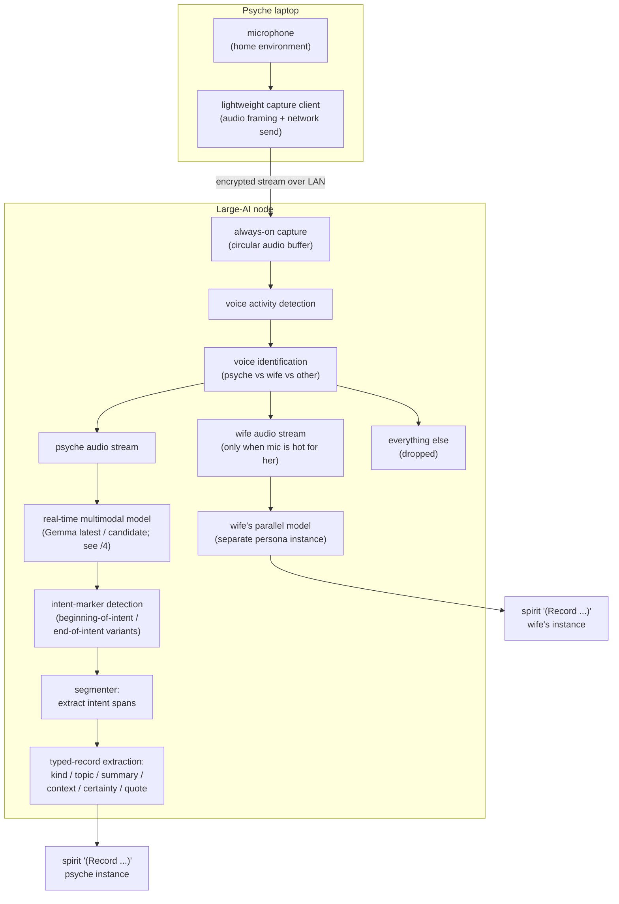
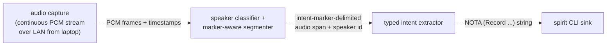

# 145 — Real-time intent recording system

*Kind: Design · Topic: recording-system · Date: 2026-05-21 (revised 2026-05-22)*

*Design sketch for the always-on intent-recording system in response
to the psyche's lost ten-minute spoken session on 2026-05-21. Spirit
captures typed intent today; this system replaces the chat-mediated
extraction with continuous voice capture, leaving spirit as the
typed substrate underneath. Revised 2026-05-22 to absorb intent
records 104 (canonical reference is the large-ai-node role, not
Prometheus) and 105 (laptop is the audio origin; large-ai-node is
the processor). Sections marked **(designing-mode speculative)**
are direction, not commitment; sections without that marker are
derived from the Maximum-certainty intent records.*

## 0 · TL;DR

A new persona-shaped component runs continuously on the
**large-ai-node** (the CriomOS role; Prometheus fills it today),
captures audio from the psyche's laptop microphone over the
network, identifies the speaker, segments speech by spoken intent
markers ("Beginning of intent" / "End of intent"), routes
recognised psyche speech through a real-time multi-modal model
into typed intent records, and forwards the resulting NOTA to
`spirit '(Record ...)'`. Wife's voice is filtered by default; if
the psyche passes the mic, wife's segments route to her parallel
persona instance.

The load-bearing distinction from today's flow: **the agent stops
being the intent-capture layer**. The recording system is the
capture layer; agents read typed intent from spirit when they need
it. Chat-mediated intent extraction becomes a fallback during
non-speech sessions and a transitional path while the recording
system stabilises.

Provisional component name: **persona-listen** (working name; see
§10 Q1).

## 1 · The problem

Psyche spoke for ~10 minutes thinking the recording was on. It
wasn't. Ten minutes of design dictation gone — the failure mode
the workspace's intent layer was supposed to make impossible.

Today's flow:

```text
psyche speaks → STT (off-device, app-dependent)
             → text appears in chat input
             → psyche reviews, sends
             → agent reads, extracts intent
             → agent calls spirit '(Record ...)'
```

Three failure modes today:

1. **Recording not on** (this incident). Speech evaporates.
2. **Agent under-extracts.** Substance the psyche dictated doesn't
   make it into a typed record because the agent didn't recognise
   it as intent.
3. **Roundtrip lag.** Psyche dictates, then has to wait for the
   chat round-trip before the intent is durable.

The system replaces (1) with always-on capture, narrows (2) by
giving the extraction model the full audio context including
prosody and pauses, and removes (3) by running capture in
parallel with whatever the psyche is doing.

## 2 · Architecture

The audio originates on the psyche's laptop microphone and crosses
the network to the large-ai-node where the always-on capture
buffer plus the model pipeline live:



The pipeline has three real seams (the dashed lines below are the
seams worth surfacing as typed interfaces):



The three seams are also the three failure boundaries: a capture
failure stays at the first seam (no segment flows out); a
segmenter failure stays at the second (no NOTA reaches the
extractor); an extractor failure stays at the third (no record
reaches spirit). Each seam logs to its own diagnostic stream.

**Why the laptop-to-large-ai-node split.** The laptop is where the
psyche speaks (microphone proximity, mobility); the large-ai-node
is where the GPU substrate lives (model inference scale). Trying
to run inference on the laptop competes with the psyche's other
work and is bounded by laptop hardware; pushing audio to the node
keeps inference cheap and the laptop's resources free. The
network hop is small (LAN) and the audio is encoded for size; the
trade is privacy (audio crossing the LAN) for compute headroom.

## 3 · The capture layer

Always-on capture from the psyche's laptop microphone. PCM frames
(or equivalent compressed continuous-stream form) get encoded by
a lightweight capture client running on the laptop and shipped
over LAN to a **circular buffer** on the large-ai-node. The buffer
is sized large enough that the marker-detection step can look back
into pre-marker audio if the psyche says "End of intent" before
the model has heard the start marker.

Buffer depth open (see §10 Q2); designer lean: at least 10 minutes
of audio always available, expandable to an hour with a coarse
write-to-disk circular file as the persistent floor.

Two processes, one per machine:

- **Laptop side: capture client.** Owns the microphone. Encodes
  audio into a stream-friendly format (codec choice deferred —
  Opus is the candidate for low-latency real-time use). Sends to
  the LAN endpoint of the large-ai-node. Minimal — no model
  inference, no buffering beyond a small jitter buffer.
- **Large-ai-node side: capture daemon.** Owns the circular
  buffer. Receives the laptop stream. Decodes back into PCM
  frames for downstream consumption. Everything downstream
  consumes from this buffer.

The capture client is the only laptop-side process that touches
audio hardware. The capture daemon is the only large-ai-node
process that touches the buffer. Both processes are
single-responsibility — easy to restart, easy to keep
privacy-sensitive surface contained.

### Privacy floor

Always-on home-microphone capture is privacy-sensitive. Five rules:

- **Audio crosses LAN only.** Capture goes from laptop to
  large-ai-node over the local network. No upstream API call
  carries raw audio; no off-LAN host sees it.
- **The LAN hop is authenticated and encrypted.** The capture
  client and capture daemon mutually authenticate; the audio
  stream is encrypted in transit (TLS-wrapped or equivalent).
- **The circular buffer never persists past its window.** A
  rotating in-memory ring on the large-ai-node is the floor; a
  configurable disk spool (write-then-delete) is optional but
  defaults off.
- **The voice-identification model rejects unknown voices by
  default.** Section 4 — wife is the explicit exception;
  everyone else is filtered out without further processing.
- **The capture client is auditable.** A user-visible indicator
  on the laptop shows when the mic is active and what's being
  sent; muting is a single keystroke.

## 4 · Voice identification

The first downstream consumer of the circular buffer is the
**voice-identification classifier**. Per intent ID 61, the model
must distinguish the psyche from the wife (who shares the
residence). Per intent ID 62, the wife should also be able to
record into her own parallel persona instance when she takes the
mic.

Three classes, in priority:

| Class | Action |
|---|---|
| Psyche | Route to psyche's extractor pipeline (§5–6) |
| Wife (active session) | Route to wife's parallel instance (§7) |
| Anyone else (visitor, TV audio, background) | Drop at this stage |

The classifier needs enrolment audio for both psyche and wife.
Enrolment is a one-time setup step; details speculative (see §10
Q3).

The "active session" qualifier on wife: she is recognised by
voice always, but her audio is only consumed when the mic has
been explicitly passed to her. The pass-the-mic gesture is
ambient — the psyche says something like "[wife's name], your
turn" and the classifier flips into wife-active mode for a
configured window or until the psyche speaks again. The exact
gesture vocabulary is open (see §10 Q4).

## 5 · Intent-marker detection and segmentation

Per intent ID 60, the psyche uses spoken keyword markers to bracket
intent statements. Recognised forms (initial set):

- "Beginning of intent" / "Begin intent" / "Beginning intent" /
  "Start of intent" / "Start intent" — open a span.
- "End of intent" / "End intent" / "Done" (context-dependent) —
  close the span.

The real-time multimodal model (Gemma latest, per intent ID 59 —
candidate confirmation in /4 research) runs continuously on the
psyche audio stream and emits both raw transcription and a marker-
token stream. The marker tokens are the segmentation signal.

Failure modes the segmenter must handle:

- **Missing begin marker, present end marker.** Look back into the
  buffer up to the last marker boundary or a natural pause. If
  neither is found, capture the last N seconds as the span.
- **Missing end marker.** A new begin marker, prolonged silence,
  or a voice-change to wife/other implicitly closes the span.
- **Markers embedded in normal speech.** The psyche says "well,
  begin intent here is the thing..." — the marker classifier
  needs prosody + context to distinguish a literal marker from a
  meta-reference. The model handles this; if a false positive
  happens, the resulting span is empty or nonsensical and the
  extractor (§6) catches it.

## 6 · Typed-record extraction (the intent-capture function)

The extraction stage is a **runtime function**, not a long-lived
agent (intent 126 + 124). It's a per-call stateless LLM
invocation: given an audio span (plus full context provisioned
per call), it returns typed intent records and routed prompt
sections. No persistent identity; no signed work; no carried
state between calls. The function/agent distinction is
load-bearing per /150 §1; the rest of this section assumes that
shape.

Each captured span feeds the function. Output: one or more
typed intent records in the spirit wire shape:

```text
(Record (<topic> <Kind> "<summary>" "<context>" <Certainty> "<verbatim>"))
```

The extractor's job: classify Kind (Decision / Principle /
Correction / Clarification / Constraint), pick Topic (workspace
canonical vocabulary), synthesize Summary + Context, estimate
Certainty (Maximum / Medium / Minimum — *not* High; per
designer/267), and quote the verbatim faithfully.

This is the same job today's chat-mediated agent does, but with
two advantages:

- **Full audio context** including prosody, hesitation, emphasis.
  Helps certainty estimation in particular (a confident "do it"
  reads different from a tentative "I guess do it").
- **The span boundaries are already settled** by the marker
  detection. The extractor isn't guessing what counts as one
  intent statement; the marker pair told it.

For each span, the extractor emits a NOTA record. The record
flows to the spirit CLI sink (§8).

### What the extractor does NOT decide

The conservative-by-default principle (per `intent/workspace.nota`
2026-05-20T14:40:00Z) still applies: when an audio span is
ambiguous about which Kind or what Certainty, the extractor
**under-extracts**. Possible mechanisms:

- Drop the certainty to Medium when uncertain.
- Add a sentinel marker to the summary noting the ambiguity, so
  a future agent reviewing the record can re-classify.
- Surface a separate "needs psyche review" record for genuinely
  borderline cases (see §10 Q5).

### 6.5 · Per-call context provisioning

Because the intent-capture is a function, every invocation
receives a fresh context bundle. Today the bundle has at least:

- The STT typo correction table (per `skills/stt-interpreter.md`).
- The current topic vocabulary (from `intent/*.nota` topics + the
  spirit topic catalog).
- The intent record schema (the spirit wire shape).
- The certainty taxonomy (Maximum / Medium / Minimum — *not*
  High; per designer/267).
- The conservative-by-default principle (per
  `intent/workspace.nota` 2026-05-20T14:40:00Z).

When orchestrate's typed lane registry + occupancy mapping
lands (per /150 §7), the bundle gains the current lane
occupancy so the function knows which long-lived agent currently
holds each lane.

### 6.6 · Topic-based routing to long-lived agents

A single psyche utterance can cross multiple topics. The
function recognises topic boundaries and routes each section to
the right downstream agent (per intent 126). The output of one
function call is therefore zero-or-more **(intent record,
routed prompt section)** pairs, not just intent records.

A worked example:

```text
psyche says:
  "On the orchestrate redesign, settle the claim surface.
   And for the recording system, the laptop should buffer
   locally if the LAN drops. Also, sweep poet-assistant
   reports for stale items."

intent-capture function emits:
  - intent record: persona / Decision / "claim surface
    settlement" (topic: persona-orchestrate)
  - prompt section: "Settle the claim surface in
    persona-orchestrate" → routed to lane `designer` or
    `second-designer`
  - intent record: recording-system / Decision / "LAN-drop
    local buffer" (topic: recording-system)
  - prompt section: "Add LAN-drop local buffer to the capture
    client" → routed to lane `operator` or `system-specialist`
  - intent record: workspace / Decision / "sweep
    poet-assistant" (topic: workspace)
  - prompt section: "Sweep poet-assistant reports" → routed
    to lane `designer` (or future `poet-discipline-designer`)
```

The routing table (topic → lane) lives in persona-orchestrate's
storage. The function queries orchestrate on each invocation to
learn the current routing. As lanes are created / retired, the
routing surface stays current.

When a prompt section can't be unambiguously routed by topic, the
function falls through to a default routing target (likely
designer for ambiguity; the psyche reviews and re-routes
manually if needed).

## 7 · Wife's parallel persona instance

Per intent ID 62, when wife is recording into the system she
operates as her own psyche with her own persona-mind / persona-
spirit / etc. The wife's spirit DB is separate from the psyche's;
her intent records are her own intent layer, not a sub-stream of
the psyche's.

**(designing-mode speculative.)** The full shape — whether the
wife gets a full persona engine on a separate user, whether her
agents run alongside the psyche's, whether her intent merges
anywhere — is unsketched. The minimum landing:

- A separate spirit daemon socket dedicated to the wife's intent.
- A separate redb store for her records.
- A separate `bootstrap-policy.nota` if her intent layer needs
  different rules.
- A user-level identity boundary so her records and the psyche's
  don't accidentally cross.

Multi-persona-instance is a new concept in the workspace; today's
persona stack assumes a singular psyche. Settling the shape needs
a dedicated design report (likely in the persona thread, not the
recording thread). Defer to v2 unless psyche pulls in.

## 8 · The spirit CLI sink

Each extracted NOTA record invokes `spirit` (or wife's parallel
binary, e.g., `spirit-<wife-shortname>` if the binaries are
per-instance — open).

Per `skills/spirit-cli.md`, the binary takes exactly one argument
(NOTA string or file path). The recording system writes each
record to a one-shot file (avoiding shell-quoting headaches with
the psyche's natural apostrophes), then invokes the binary:

```sh
spirit /tmp/persona-listen/spans/<uuid>.nota
```

Daemon-stamped capture-time on the record handles the timestamp.

Failures at the sink boundary (daemon down, NOTA parse error,
unknown variant in topic or certainty) go to a diagnostic stream
the psyche can review; the original audio span is preserved in
the circular buffer so the agent can re-run the extraction if
needed.

## 9 · Cross-cutting concerns

### 9.1 · Privacy

Covered in §3. Reinforcing: **audio crosses LAN only** between
laptop and large-ai-node, both endpoints under the psyche's own
network. The only thing that crosses the workspace network
boundary is the typed NOTA record reaching the psyche's spirit
daemon (already on the local machine in the canonical deployment).

If the model is large enough that local inference is impractical,
the trade-off needs naming explicitly — local-only is the default
floor.

### 9.2 · Compute budget

Per intent ID 59, the psyche referenced the large-ai-node's prior
research showing this is "free" on current hardware. That maps to
Gemma-class models running on the cluster's GPU substrate.
Verifying the specific model + hardware footprint is research
follow-up — see /4 (research report on real-time speech
recognition models).

### 9.3 · Failure recovery

The capture layer is the most expensive to lose (audio that
doesn't get captured is gone forever). The downstream stages can
re-run against the buffer if they fail. Therefore:

- **Capture client (laptop)** should be the most-isolated process
  on the laptop — single responsibility, minimal dependencies,
  restart-on-crash policy tight.
- **Capture daemon (large-ai-node)** is the most-isolated process
  on the node — same shape.
- The classifier, segmenter, extractor, and sink can be restarted
  freely; their inputs persist.
- The diagnostic stream surfaces failures non-destructively
  (logs, not exceptions that drop spans).

If the LAN connection between laptop and large-ai-node drops, the
capture client buffers locally (small bounded buffer — minutes,
not hours) and resumes on reconnect. Beyond the local buffer's
window, audio is lost; surface that visibly so the psyche knows
when speech is at risk.

### 9.4 · Integration with existing intent vocabulary

The recording system writes the same shape spirit accepts today:
`(Record (<topic> <Kind> "<summary>" "<context>" <Certainty>
"<verbatim>"))`. No new wire surface; the recording system is a
NOTA producer like any agent.

The Topic vocabulary is the workspace-canonical set (`workspace`,
`spirit`, `signal`, `persona`, `component-shape`, `intent-log`,
etc.). The extractor needs to know this vocabulary; it's a small
constant set, learnable from `intent/*.nota` topics + the spirit
DB's topic catalog (`spirit '(Observe Topics)'`).

## 10 · Open psyche questions

**Q1 — Component name.** Working candidate: `persona-listen`.
Alternatives: `persona-ear`, `persona-scribe`, `persona-captor`.
Whatever it's called, the binary is the daemon + thin CLI per
triad shape. Pick before operator scaffolds the repo.

**Q2 — Circular buffer window.** Suggested 10 minutes in memory
on the large-ai-node, optional 60 minutes on disk. The trade-off
is RAM cost vs. look-back coverage when markers are missed.
Confirm.

**Q3 — Voice enrolment.** How does the psyche enrol voices?
Candidates: a one-time NOTA-driven enrolment command
(`spirit '(EnrolVoice (...))'`); a CLI utility (`persona-listen
enrol`); a passive enrolment that learns over time. Designer
lean: an explicit one-shot command, simplest correctness.

**Q4 — Pass-the-mic gesture vocabulary.** How does the wife's
session activate? Spoken passing ("your turn"); a literal button
press; a NOTA command sent to the recording daemon. Designer
lean: spoken gesture + explicit deactivation when psyche speaks
again, plus a manual override CLI for edge cases.

**Q5 — Borderline-intent review mechanism.** When the extractor
isn't confident a span is intent, what happens? Options: (a)
drop to Minimum certainty and let it land; (b) skip; (c) emit a
sentinel record the psyche reviews. Designer lean: (c), with the
sentinel topic being something like `recording-review` that the
psyche can browse and either confirm into a real record or
discard.

**Q6 — Marker vocabulary stability per speaker.** The current
marker set (intent ID 60) is psyche-spoken. If wife also uses the
system, does she use the same words (and the classifier
disambiguates by voice) or her own marker vocabulary (and the
classifier doesn't have to worry about cross-speaker false
positives)? Designer lean: per-speaker enrolment carries both
voice and marker vocabulary; defaults to the same words but
configurable per-speaker.

**Q7 — Real-time model choice.** Per intent ID 59 the psyche
referenced "Gemma 4 is the latest" — verifying the specific
model + hardware footprint is what /4 (research report) explores.
This question stays open until the research lands and the psyche
picks.

**Q8 — Recording vs. transcription as the substrate.** Two
shapes: (a) the model produces transcription and an
intent-classifier runs on text; (b) the model produces typed
intent records directly from audio. (b) is the audio-context
advantage from §6; (a) is simpler to debug. Designer lean:
prototype with (a), measure, move to (b) if the audio-context
advantage proves real.

**Q9 — Component triad shape.** This is a real persona-shaped
component; should it follow the standard triad (working signal +
owner signal + daemon)? Designer lean: yes, but the working
signal is mostly events (observation stream of segmented
spans, captured records, failures); the owner signal carries
configuration (voice enrolments, marker vocabulary, buffer
window). See §11 for the sketched triad shape.

**Q10 — Where does wife's parallel persona instance live?**
Multi-tenant on the large-ai-node? Separate user account?
Separate machine? The simplest landing is multi-tenant on
large-ai-node; the longer-term shape is unsketched.

**Q11 — Laptop-side process shape.** The capture client is the
laptop's only persona-component process (in the current design).
Does it count as a persona-listen sub-process running on a
different host? Triad design: one component, two binaries
(capture-client on laptop, persona-listen-daemon on
large-ai-node)? Or does the capture-client get its own component?
Designer lean: one component, two binaries, with the laptop-side
binary being the minimal stream forwarder.

## 11 · Component triad sketch (designing-mode speculative)

If the recording system becomes a real persona triad, the
shape:

### signal-persona-listen (working)

```text
channel Listen
    operation Observe(Observation) opens DomainStream
    operation Watch(Subscription) opens DomainStream
    operation Unwatch(SubscriptionToken)
    operation Tap(ObserverFilter)
    operation Untap(ObserverSubscriptionToken)

reply Reply
    SegmentsObserved(SegmentsObserved)
    ExtractionsObserved(ExtractionsObserved)
    FailuresObserved(FailuresObserved)
    SubscriptionOpened(SubscriptionOpened)
    SubscriptionRetracted(SubscriptionRetracted)
    RequestUnimplemented(RequestUnimplemented)

event Event
    SegmentCaptured(SegmentCaptured) belongs DomainStream
    IntentExtracted(IntentExtracted) belongs DomainStream
    ExtractionFailed(ExtractionFailed) belongs DomainStream

observable
    filter default
    operation_event OperationReceived
    effect_event EffectEmitted
```

The component doesn't take commands from peers (no `Record`
operation — capture is its own driver); it serves observation
queries and event subscriptions.

### owner-signal-persona-listen (policy)

```text
channel OwnerListen
    operation EnrolVoice(VoiceEnrolment)
    operation RetireVoice(VoiceIdentifier)
    operation Configure(Configuration)
    operation Start(Start)
    operation Drain(Drain)
    operation Reload(BootstrapPolicy)
```

Configuration carries: buffer window, marker vocabulary, model
selection, sink targets (which spirit daemon socket the records
go to), wife-session activation policy.

### persona-listen (daemon + binaries)

The daemon owns the large-ai-node side:

- The capture-receive process (accepts the laptop stream into
  the circular buffer).
- The classifier, segmenter, extractor pipeline (in-process
  actors or sub-process pipelines).
- The sink (invocations of `spirit` per record).
- The local store of enrolments, recent diagnostics, and
  buffer state.

Plus the laptop-side capture client as a second binary (per
intent ID 105, the laptop is the audio origin):

- `persona-listen-daemon` — long-lived on the large-ai-node.
- `persona-listen-capture` — long-lived on the laptop; forwards
  microphone audio over LAN.
- `listen` — thin CLI for ad-hoc commands (configure, enrol,
  status).

The two binaries communicate over signal (the laptop binary is
a signal client of the large-ai-node daemon).

## 12 · Migration / cutover

The recording system is additive. Existing chat-mediated intent
extraction stays functional during the build-out. The cutover
happens organically: as the recording system matures, the psyche
naturally uses the spoken-marker shape more, and chat-mediated
extraction becomes rare.

No big-bang cutover; no chat-intent forbidding; no migration of
existing records (the recording system writes new records; the
historical record stays).

## 13 · Recommended next slice

Designer recommendation, prioritized:

1. **System-specialist verifies the large-ai-node compute side.**
   Find the prior research the psyche referenced. Identify the
   model + the hardware footprint + the latency budget. The /4
   research report (this lane) sketches candidates; system-
   specialist confirms which actually run on the deployed
   large-ai-node hardware.
2. **System-specialist scaffolds the capture client + capture
   daemon** as a minimal always-on audio recorder (laptop binary
   → LAN → large-ai-node binary writing to a circular buffer).
   No intelligence yet — just the capture floor.
3. **Designer follow-up report** picks Q1 (component name), Q2
   (buffer window), Q3 (enrolment) once Q1–Q3 carry psyche input.
4. **Operator stubs the triad** (signal-persona-listen,
   owner-signal-persona-listen, persona-listen daemon) per §11
   once the design is psyche-approved. No model wiring yet; the
   daemon just consumes the buffer and writes to spirit through
   a manual plumbing layer.
5. **System-specialist adds the model and segmentation** as a
   separate pass once the daemon plumbing is real.
6. **Designer reviews end-to-end** with a real spoken intent test
   and identifies the gaps.

This is a multi-week build; no part of it is trivial. The
disciplined incremental path keeps every stage shippable.

## 14 · See also

- `intent/intent-log.nota` records 59, 60, 61, 63, 105 — the
  intent records driving this design.
- `intent/persona.nota` record 62 — wife's parallel persona
  instance (Medium certainty).
- `intent/workspace.nota` record 58 — the dispatching agent's
  lane reassignment (this report's authoring lane).
- `intent/horizon.nota` record 104 — large-ai-node as the
  canonical CriomOS role name (replaces Prometheus references).
- `skills/spirit-cli.md` — the typed-record wire shape this
  design produces.
- `skills/intent-log.md` — the conservative-by-default discipline
  the extractor inherits.
- `reports/designer/267-v2-intent-substrate-certainty-drift.md` —
  why the certainty vocabulary must be Maximum/Medium/Minimum.
- `reports/designer/264-designing-protocol-and-role-spaces.md`
  §"Per-role protocols" — the protocol framing under which this
  report is written.
- `reports/designer/266-persona-pi-triad-design.md` + pi-api-surface-
  notes — adjacent persona-shaped design work; similar triad shape.
- `reports/second-designer/148-research-real-time-speech-recognition.md`
  — the research report on candidate models for §10 Q7.
- `reports/second-designer/150-design-agent-identity-and-runtime-functions.md`
  — the function-vs-agent distinction this report's §6 absorbs;
  the topic-routing flow this report's §6.6 introduces; the
  cryptographic-identity model for the long-lived agents
  downstream of the intent-capture function.
- `protocols/active-repositories.md` — the persona-component
  inventory this design would join.

This report retires when (a) a successor design report
supersedes it after the open questions land, OR (b) the
recording system reaches end-to-end real-spoken-intent capture
and the design's load-bearing claims are proven.
