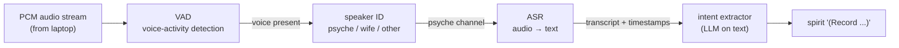

# 148 — Real-time speech recognition for the recording system

*Kind: Research · Topic: recording-system · Date: 2026-05-22*

*Research survey of open-weights real-time speech-recognition,
voice-identification, and streaming-ASR options that could
substrate the recording system in /1. Grounds /1 Q7 (model
choice) and §13 step 1 (system-specialist verifies large-ai-node
compute side). Not a recommendation report; a research report.
The system-specialist picks the final model after running them
against the deployed hardware.*

*Source basis is the agent's training corpus (knowledge cutoff
early 2026). The specific options listed have established public
implementations as of that cutoff; verifying current versions,
benchmarks, and license terms is system-specialist follow-up.
Where the agent flags uncertainty about a specific model
version, the system-specialist should treat those as
verify-against-current-state items.*

## 0 · TL;DR

The recording system's audio pipeline needs four pieces, in
order: voice-activity detection, speaker identification, audio-
to-text recognition, and intent extraction from the text. **None
of these are well-served by a single end-to-end model today.**
The right shape is a small pipeline of specialised open-weights
models, each cheap to run, composed into the persona-listen
daemon. The agent's recommended candidate set per stage is below;
the system-specialist confirms against the large-ai-node's
actual GPU after running the candidates head-to-head.

The psyche referenced "Gemma 4 is the latest, multi-modal" as
the target model. Gemma is Google's open-weights model family;
its multi-modal variants as of the agent's knowledge cutoff
support vision and text but **audio-input is not Gemma's primary
strength**. The agent flags this as a likely STT or vocabulary
mismatch and proposes alternative multimodal-with-audio
candidates below. The system-specialist should clarify with the
psyche whether "Gemma 4" is the actual target or whether
audio-aware multimodal candidates like Phi-4-multimodal,
Qwen2-Audio, or Ultravox were the intent.

## 1 · The pipeline stages

The recording system needs four distinct functions. Lumping
them into one model loses control; running them as a small
pipeline keeps each piece swappable.



VAD is the cheap gate — most of the audio is silence or
background, and the gate filters it before the more expensive
stages run. Speaker ID is the second filter — only psyche's
voice flows to ASR by default; wife's flows to her own pipeline
(see /1 §7). ASR converts the gated audio to text. The intent
extractor is text-based; it can be any of the workspace's existing
LLM patterns.

## 2 · Voice activity detection (VAD)

VAD's job: emit "speech here / not here" per frame. Cheap, fast,
always-on. The signal gates downstream stages.

| Candidate | Notes |
|---|---|
| **Silero VAD** | Small (~1MB), neural, fast on CPU. Industry default for streaming VAD. MIT-licensed (verify current license). Supports streaming frames. **Likely the right pick** — well-supported, fast, accurate. |
| **WebRTC VAD** | Classic signal-processing approach. Tiny, very fast, no GPU. Less accurate than neural alternatives but extremely cheap. Good fallback if Silero has integration issues. |
| **pyannote VAD** | The VAD component of pyannote.audio. Heavier than Silero. Use if pyannote is already in the speaker-ID stage and the VAD comes free. |

Recommendation: **Silero VAD**. The large-ai-node will hardly
notice the cost; the cheap-and-fast wins.

## 3 · Speaker identification

Speaker ID's job: classify each audio frame (or short window) by
which enrolled voice produced it. Must support:

- Online operation (don't batch the whole utterance before
  emitting).
- Multi-speaker enrolment (psyche + wife).
- Reject-unknown (background, visitors, TV).

| Candidate | Notes |
|---|---|
| **pyannote.audio** | The established open library for speaker diarization + identification. Pre-trained models on HuggingFace; supports enrolment-based speaker ID. Active community. Some pre-trained models have HuggingFace-gated licenses; verify before deployment. **Likely the right pick** — most mature option in the open-source space. |
| **SpeechBrain** | Competing library. Strong speaker-verification models (ECAPA-TDNN). Cleaner Python API than pyannote in some respects. Worth a head-to-head test against pyannote on the deployed corpus. |
| **3D-Speaker** | Alibaba's library. Newer; less established but actively developed. Apache-2.0 licensed (verify). Some benchmarks favourable for streaming use. |
| **WeSpeaker** | Another speaker-recognition toolkit. ESPnet-adjacent. Strong in some benchmarks. |

Recommendation: **pyannote.audio** for the prototype; test
against SpeechBrain's ECAPA-TDNN if pyannote's accuracy on the
psyche-vs-wife pair isn't good enough. Both should hit usable
accuracy on the two-voice problem with a few minutes of
enrolment audio per speaker.

**Enrolment shape.** Both pyannote and SpeechBrain support
embedding-based enrolment: capture a few minutes of each
speaker's voice, compute an embedding, store it. Inference is
embedding distance against the stored embeddings. The cost is
tens of milliseconds per window — fits the real-time budget.

## 4 · Automatic speech recognition (ASR)

ASR's job: convert audio to text. Must support:

- Streaming (emit text as audio flows in, not wait for utterance
  end).
- Open weights (no API calls).
- Run on the large-ai-node's GPU.
- English (workspace primary language) — additional languages
  are out of scope for v1.

### The Whisper family

| Variant | Notes |
|---|---|
| **OpenAI Whisper** (reference) | Multiple sizes (tiny / base / small / medium / large-v2 / large-v3 / turbo). Open weights, MIT-licensed. **Not natively streaming** — designed for batch. Streaming wrappers exist (see below). large-v3 is the accuracy ceiling; turbo is the speed/accuracy compromise. |
| **faster-whisper** | CTranslate2-based reimplementation. 2-4× faster than reference Whisper at equal accuracy. Supports INT8 quantization for further speed. **The standard pick** for self-hosted Whisper deployments. Streaming wrappers easy to bolt on. |
| **Distil-Whisper** | Distilled smaller versions of Whisper. Faster than the originals at the same parameter count, with some accuracy loss. Good for CPU deployment; less critical when a GPU is available. |
| **WhisperLive** | Open-source streaming wrapper over Whisper. Uses VAD to chunk audio, runs Whisper on each chunk. Latency in the 200–500ms range with small/medium models. **Practical streaming path** if Whisper is the chosen model. |
| **Whisper-streaming** (UFAL) | Academic streaming implementation; finer-grained chunking. Worth comparing against WhisperLive. |

### NVIDIA models

| Variant | Notes |
|---|---|
| **Parakeet-TDT** | NVIDIA's streaming-first ASR. RNN-T architecture naturally streams. Apache-2.0 (verify current). Lower latency than Whisper streaming wrappers. Multiple sizes (Parakeet-TDT-0.6B / 1.1B). **Strong candidate** if the large-ai-node has NVIDIA GPU and good NeMo integration. |
| **Canary** | NVIDIA's newer multilingual ASR. Highly accurate on benchmarks. Recently open-sourced (verify). Streaming-friendly. |

### Multimodal-with-audio models

These are LLMs that take audio input directly and produce text or
structured output. Different shape from pure ASR — they can do
ASR + downstream tasks (e.g., intent extraction) in one call.

| Variant | Notes |
|---|---|
| **Phi-4-multimodal** (Microsoft) | Phi-4 family with audio + vision input. Strong audio understanding. Open weights (MIT-style license; verify). **Plausible candidate** for collapsing the ASR + intent-extraction stages into one model. |
| **Qwen2-Audio** (Alibaba) | Audio-input LLM. Open weights. Designed for audio understanding tasks. Worth evaluating as a one-stop audio-to-intent model. |
| **Ultravox** | Open-weights audio-LLM. Real-time-friendly. Active community. |
| **Voxtral** (Mistral) | Mistral's audio model. Open weights. Newer; worth verifying current capability. |
| **SeamlessM4T** (Meta) | Multimodal speech model. Translation-focused but also handles ASR. Heavyweight. |

**On "Gemma 4 is the latest, multi-modal" (psyche reference).**
Gemma 4 is released as of 2026-05-22 (psyche confirmed; intent
ID 116). The agent's training cutoff predates the release, so
the specific capabilities of Gemma 4 — and whether it carries
audio-input multimodal support distinct from Gemma 3's
vision+text — are not in the agent's knowledge. Two paths the
system-specialist can verify when picking the actual model:
(a) if Gemma 4 has audio-input, it is the candidate the psyche
named; verify against the deployed large-ai-node; (b) if Gemma
4 stays text+vision and audio support requires a different
model family, the Phi-4-multimodal / Qwen2-Audio / Ultravox /
Voxtral candidates listed above are the alternatives. Either
way the research's recommendation path is unchanged: prototype
with Path A (pipeline ASR + text LLM) using whichever text-
inference model fits the hardware; evaluate Path B
audio-to-intent direct as the audio-multimodal capability
matures.

### Recommendation

**Two parallel paths to evaluate**:

- **Path A — Pipeline with faster-whisper or Parakeet-TDT for
  ASR, then text-based intent extraction via a separate LLM
  call (e.g., a local Gemma or Phi or Qwen text model running on
  the same GPU).** This is the conservative, debuggable shape.
  Each stage swappable. Faster-whisper has the best
  open-community track record; Parakeet-TDT is the latency winner
  on NVIDIA hardware. Pick based on the large-ai-node's GPU
  family.
- **Path B — Audio-to-intent in one shot with Phi-4-multimodal
  or Qwen2-Audio.** The model takes audio in and emits
  classification or structured output. Fewer moving parts but
  harder to debug when wrong. Worth trying as a second-pass
  once Path A is working as a baseline.

The /1 design's Q8 (recording vs transcription as substrate)
maps to this fork: Path A is "transcription as substrate"; Path
B is "recording as substrate". The pragmatic landing is Path A
first.

## 5 · Intent-marker detection (keyword spotting)

The psyche's marker vocabulary ("Beginning of intent" / "End of
intent" and variants) is a small closed set spoken at known
moments. Three implementation options:

| Option | Notes |
|---|---|
| **Regex over ASR output** | Cheapest. Once the ASR has emitted text, regex-match the marker phrases. Latency adds to whatever ASR latency is. Easy to extend the marker set. **Probably the right v1 choice.** |
| **Dedicated keyword spotting model** | Models like Picovoice Porcupine (proprietary), OpenWakeWord (open weights), or wav2vec2-based custom keyword models run on raw audio with lower latency than ASR. Useful if marker latency matters. More moving parts. |
| **ASR + prosody classifier** | Detect "Beginning of intent" said as a marker vs said as content via prosody (the marker said as a deliberate command has different cadence than the same phrase in prose). The audio-multimodal models (Phi-4-mm, etc.) might handle this naturally if they have access to prosody. |

Recommendation: **regex over ASR for v1**. The latency cost is
small (markers don't need to be detected within milliseconds —
they're segmentation boundaries, not interactive triggers). If
ASR transcription accuracy is poor on the markers, fall back to
a dedicated keyword-spotting model.

## 6 · Hardware sketch

This section is system-specialist territory; the agent sketches
the budget so the verification has concrete targets.

### Throughput per stage (rough orders of magnitude)

| Stage | Compute | Latency budget |
|---|---|---|
| VAD (Silero) | CPU; ~5ms per 100ms frame | Negligible |
| Speaker ID (pyannote ECAPA) | CPU or small GPU; ~50ms per 1s window | Sub-second |
| ASR (faster-whisper medium) | GPU 4-8GB VRAM; real-time factor ~0.1× on consumer GPU | 200-500ms per utterance chunk |
| ASR (Parakeet-TDT 0.6B) | GPU 2-4GB VRAM; real-time factor better than 0.05× on NVIDIA | 100-300ms per chunk |
| ASR (Phi-4-mm audio path) | GPU 12-16GB+ VRAM; latency unmeasured at cutoff | Unknown |
| Intent extraction (small text LLM, batch) | GPU shared with ASR | <1s per intent span |

**Total budget**: with Path A on a GPU sized for the chosen ASR,
end-to-end latency from spoken intent to NOTA record should be
under 2 seconds. The psyche won't notice 1–2s if the model's
classification quality is good.

### GPU sizing

If the large-ai-node has 24GB+ VRAM (consumer high-end or older
data-center card), Path A with faster-whisper-large-v3 +
local Gemma text inference fits comfortably with room for the
multimodal experiments later.

If less VRAM, Path A with faster-whisper-medium + a small
text-classification model still works; latency goes up slightly.

### Always-on cost

The most expensive piece always-on is the ASR. VAD gates most
non-speech audio so ASR sleeps until VAD says "speech." Speaker
ID runs on detected-speech frames only. The continuous compute
cost is dominated by VAD + the speaker-ID classifier — both
cheap. The intermittent compute cost is the ASR; on the order of
a few seconds per minute of speech.

This is consistent with the psyche's "it's free" framing
(intent ID 59): the large-ai-node doesn't get warm just sitting
there.

## 7 · License survey (verify before deployment)

| Component | License (as of cutoff; verify current) |
|---|---|
| Silero VAD | MIT |
| WebRTC VAD | BSD |
| pyannote.audio | MIT, but some pre-trained models gated on HuggingFace |
| SpeechBrain | Apache 2.0 |
| OpenAI Whisper | MIT |
| faster-whisper | MIT |
| Distil-Whisper | MIT |
| WhisperLive | MIT |
| Parakeet-TDT | Apache 2.0 (verify) |
| Canary | CC-BY-4.0 (verify) |
| Phi-4-multimodal | MIT-style (verify) |
| Qwen2-Audio | Tongyi license (some restrictions; verify) |
| Ultravox | Various (verify per model) |
| Voxtral | Apache 2.0 (verify) |

The system-specialist checks every chosen component's current
license before deployment. Open-weights ≠ MIT; some open-weights
models have usage restrictions that may or may not apply.

## 8 · Open questions for the system-specialist

These are not psyche questions; they are verification items the
system-specialist resolves against the actual large-ai-node
hardware:

1. **What GPU sits in the large-ai-node?** Determines feasible
   model sizes. NVIDIA Ampere/Hopper opens Parakeet; AMD/Intel
   limits the NVIDIA-specific paths.
2. **Is NeMo or HuggingFace Transformers the preferred Python
   stack?** Determines integration friction.
3. **Does the network between laptop and large-ai-node support
   low-latency streaming?** LAN is fine; verify no firewall /
   QoS issues for sustained audio streams.
4. **Are pre-trained pyannote models acceptable under the gating
   on HuggingFace?** If not, SpeechBrain or 3D-Speaker.
5. **What was the prior Prometheus research the psyche
   referenced** (intent ID 59)? Find the report or conversation;
   it likely contains a concrete model pick and feasibility
   sketch this report can supersede.

## 9 · Recommended pilot pipeline

For the first capture-to-NOTA witness on the large-ai-node:

```text
  Silero VAD
    -> pyannote speaker ID
       (psyche|wife|other; gate on psyche for now)
    -> faster-whisper medium-or-large
       (whichever fits VRAM; streaming via WhisperLive)
    -> regex on transcript for "begin of intent" / "end of intent"
       (extract span boundaries)
    -> small local LLM
       (Gemma 2 / 3 / 4 text variant, Phi-4, or any open
        instruction-tuned model running on the same GPU)
       (extract Kind / Topic / Summary / Context / Certainty /
        Verbatim per the spirit record shape)
    -> spirit CLI invocation
```

Every stage is open-weights, self-hosted, swappable. The
end-to-end works on a single GPU with reasonable VRAM. The
system-specialist's verification pass is: run this pipeline on
the deployed hardware against a corpus of recorded psyche speech;
measure end-to-end latency, accuracy of intent extraction
against a ground-truth set; identify the bottleneck stage; tune.

## 10 · See also

- `reports/second-designer/145-design-real-time-intent-recording-system-2026-05-21.md`
  — the recording-system design that this research feeds.
- `intent/intent-log.nota` records 59, 60, 61, 63, 105 — intent
  records on the recording system.
- `intent/horizon.nota` record 104 — large-ai-node as the
  canonical CriomOS role name.
- `intent/persona.nota` record 62 — wife's parallel persona
  instance (constrains the speaker-ID requirements).

This report retires when (a) the system-specialist's
verification pass lands with a concrete model pick, OR (b) a
successor research report supersedes the candidate set after the
hardware verification.
