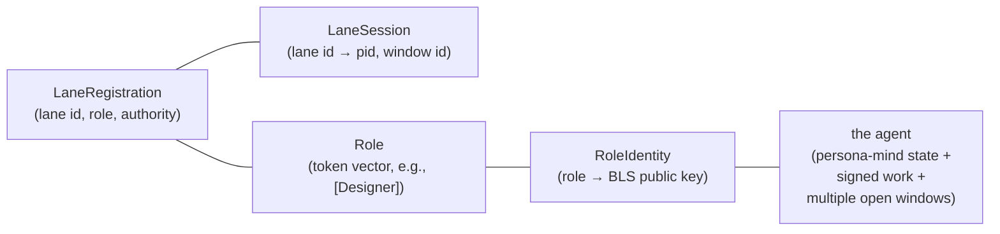

# 150 — Agent identity and intent-capture as a runtime function

*Kind: Design · Topic: persona-identity · Date: 2026-05-22*

*Captures the function-vs-agent distinction (intent 124), the
cryptographic-identity model for long-lived agents (intent 125),
and the intent-capture stage's reframing as a per-call runtime
function (intent 126). Refines `/264` §4 (per-agent Criome
identities) + `/264` §5 (shortest_id), which were Medium-
certainty speculative. Refines `/145` §6 (recording-system
extractor stage) which was capability-neutral.*

## 0 · TL;DR

Three threads converge in this design:

1. **Function vs agent.** Not every LLM call in the persona engine
   is an agent. Some calls are stateless functions invoked on
   demand. Long-lived agents — designer, operator, etc. — have
   persistent cryptographic identity. The recording system's
   intent-capture stage is a function, not an agent.
2. **Agent identity is a public key.** When Criome is available,
   the agent's master Criome public key IS its identifier — no
   separate UID storage. Pre-Criome, an ephemeral keypair
   fills the same role. Identifiers at multiple lengths
   (shortest / short / long / full) are derived methods on the
   key, not separately-stored handles.
3. **Intent-capture sits before agents.** Speech-to-text output
   goes to the intent-capture function first; the function may
   rephrase, log intent, and route prompt sections to different
   long-lived agents by topic. Agents don't receive raw STT.

The design lives at two layers. **Externally** (user-facing), the
workspace addresses agents through roles + lanes (designer,
second-designer, second-operator, etc.). **Internally** (persona
engine), agents are addressed through their cryptographic
identifier. The two layers connect at orchestrate, which knows
"this lane is currently occupied by an agent with that public
key."

## 1 · The function/agent distinction

(Settled. Intent 124, Principle Maximum.)

A persona-stack invocation is one of two shapes:

- **Function** — a stateless LLM call. Given a prompt + context
  bundle, returns output. Invoked per task; doesn't persist
  identity, accumulate state, or sign anything. Examples:
  intent-capture from STT, individual extraction passes,
  classification, summarisation when used as one-shot.
- **Agent** — a long-lived entity with cryptographic identity.
  Accumulates signed work, opinions, reputation. Lives in a
  lane, may carry session state, may invoke functions on its
  own behalf. Examples: this dispatching designer, the
  operator working on `primary-c620`, the system-specialist
  running deploys.

The distinction is by **persistence + identity**, not by
capability. A function call may use the same LLM model and the
same prompt-engineering effort as an agent for a single task;
what makes the agent an agent is the durable identity.

### Why the distinction matters

Three places it changes the design:

1. **Storage** — agents have persistent state (intent records,
   skill bundles, conversation history); functions don't.
2. **Authorization** — agents can sign things; functions can't.
   What an agent puts its signature on is durable, attributable
   work; what a function emits is provisional output that needs
   downstream authorization to become durable.
3. **Routing** — orchestrate addresses agents by lane / identity.
   Function calls are invoked by name with parameters; no
   addressing problem.

### What about "agents that are really just functions"?

The recording system's intent-capture is the worked example. It
LOOKS like an agent (it has prompts, processes natural language,
emits typed output), but it doesn't persist anything beyond the
call. The clearer characterization is "function" — every
invocation gets full context, runs, returns. No identity is
needed.

Some agents may also wrap functions: a long-lived agent may
delegate sub-tasks to function calls without giving those
functions agent identity. That's normal.

## 2 · Long-lived agent identity

(Refined 2026-05-22 by intent 147 + 148: identity is per-role,
not per-lane. Originally /150 said per-agent; the mirror model
collapses windows onto a role's single agent.)

### The cryptographic identity layer

**Each role has one long-lived agent**; the agent has a keypair.
Multiple lanes of the same role (e.g., `designer`,
`second-designer`, `third-designer`) are parallel windows into
the same agent and share the keypair. When Criome is available,
the role's master Criome public key IS its identity. Before
Criome lands, an ephemeral **BLS12-381 keypair** fills the same
role — same cryptographic primitive Criome uses (per intent
134), so the pre-Criome key migrates cleanly into Criome's
attestation layer when it ships rather than requiring a re-sign
on adoption.

What this means at the workspace surface: when designer and
second-designer sign an intent record or a report, the signature
is the SAME (the Designer's keypair). Two windows can each sign
independently, but their signatures verify under one key. The
agent's signed body of work is one thread; it's not split by
which window happened to be open.

The keypair gives the agent the power to **sign things**:
intent records it authored, reports it wrote, code it
committed, opinions it stated. The signature is the agent's
attestation; it's what makes the agent "exist in the Criome"
once Criome is real.

### Storage: the key IS the identifier

Two paths:

- **Wrong:** store the public key AND a separate generated
  internal UID. Two primitives, two storage rows, two ways for
  agents to reference the same identity.
- **Right:** store only the public key. Identifiers at every
  length are derived methods on the key.

### Identifier graduation

A single public key answers four identifier-length needs:

| Length | Name | Use |
|---|---|---|
| ~3 characters | `shortest_id` | Bead-style identifiers; the tiny inline reference (`designer-a4f`) |
| ~5 characters | `short_id` | Common UI display; the readable agent handle |
| ~7 characters | `long_id` | Tie-breaker when collisions surface |
| Full key | The full public key | Cryptographic verification; cross-machine reference |

These are **derived methods on the key**, not separately
stored. The implementation is a hash-and-truncate (similar to
beads' shortest-ID); collision handling widens the truncation
when needed.

The shape mirrors beads, which the workspace already uses
successfully — `primary-a4q0`, `primary-c620`, etc. are short
forms of larger identifiers within the bead db. The same shape
applies to agent identifiers.

### Why graduated lengths

Three forms are useful for different surfaces:

- **`shortest_id`** is for inline references the psyche reads.
  3 characters fits in a bead-id-style notation without
  cluttering the prose. Most of the time the workspace doesn't
  have enough agents to need disambiguation past this length.
- **`short_id`** is the readable handle for UI surfaces — a
  status line, a chat sidebar, a CLI prompt. Five characters
  reads as a name without being so short that collisions are
  routine.
- **`long_id`** is the disambiguator when shortest/short
  collisions surface — rare, but the system handles it without
  asking the user.
- **Full key** is the cryptographic anchor — used for
  signatures, cross-machine references, persistent storage.

### Pre-Criome path

Until Criome ships, the workspace can already use this model
with an ephemeral **BLS12-381 keypair** generated when the
agent spawns (per intent 134; same primitive as Criome).
The keypair has no Criome attestation layer (no revocation, no
delegation, no master/sub structure), but it's enough to:

- Sign artefacts (intent records, reports, beads).
- Derive identifiers.
- Persist identity across sessions if the keypair survives.

When Criome lands, the agent's ephemeral BLS keypair gets
delegated under the new Criome attestation surface. Because the
primitive is the same, signatures made pre-Criome remain
verifiable after Criome adoption — no re-sign required, just a
new attestation layer on top of the existing key.

## 3 · The lane-to-role-to-identity chain

(Refined 2026-05-22 by intent 147 + 148. Three layers, not two.)

Under the mirror model, lanes are windows into a role's single
agent. The bridge from a lane identifier to a cryptographic
identity is two hops:

```text
lane (LaneIdentifier)           e.g., "second-designer"
  ↓ (read from LaneRegistration)
role (Role vector)              e.g., [Designer]
  ↓ (read from role identity table)
identity (BLS12-381 public key) e.g., the Designer's keypair
```

Plus a separate per-lane window state — the session occupying
the lane right now:

```text
lane                  e.g., "second-designer"
  ↓
window session        e.g., process pid + claude-code window id +
                            lock file holder + active terminal-cell
```

Two windows of the same role can each have a session, and they
both resolve through their respective lanes to the SAME role
identity.

`persona-orchestrate`'s typed registry carries three tables:

| Table | Keyed by | Stored |
|---|---|---|
| `lane_registry` | LaneIdentifier | LaneRegistration (role, authority) |
| `lane_sessions` | LaneIdentifier | session metadata (pid, window id, lock holder) |
| `role_identities` | Role (vector of tokens) | cryptographic identity (BLS public key + metadata) |

Lane registration creates the lane entry. Session acquisition
fills the session entry (when an agent claims the lane).
Role-identity registration happens once per role at first
spawn (or first signing event); subsequent windows of the same
role read the existing entry rather than mint a new one.

## 4 · Intent-capture as a runtime function

(Settled. Intent 126, Decision Maximum.)

The recording system (`/145`) describes an extraction stage
that takes captured audio spans and emits typed intent records.
The new framing: **this stage is a function**, not an agent.

### Per-invocation shape

The function takes:

- The audio span (or its STT transcription).
- A context bundle, freshly assembled per call:
  - STT typo correction table (per
    `skills/stt-interpreter.md`).
  - Topic vocabulary + routing rules (which topics route to
    which long-lived agents).
  - Current intent record schema (the spirit wire shape).
  - The active lane occupancy map (so routing can target by
    lane).
  - Recent conversation context if relevant.

It returns:

- Zero or more typed intent records destined for spirit.
- Zero or more "prompt sections" tagged with target lane
  identifiers, destined for routing to long-lived agents.
- Possibly a rephrased / cleaned-up version of the input for
  the routing payload (psyche's STT typos fixed; sentences
  structured; the prose the agents see is cleaner than the raw
  STT output).

### Why a function, not an agent

Three reasons the intent-capture wants to be a function:

1. **No persistent state needed.** Every call has full context
   provisioned. There's nothing the call needs to remember
   between invocations that isn't already in spirit's intent
   records, persona-mind's topic taxonomy, or orchestrate's
   lane state.
2. **No signing role.** The intent-capture's output goes
   downstream — to spirit (which has its own daemon-stamped
   provenance), to lane-routed agents (who sign their own
   work). The function itself doesn't author durable artefacts
   under its own name.
3. **Parallelisability.** Functions can scale by spawning more
   instances; agents can't (their identity is unique). If the
   psyche speaks fast and the queue backs up, the function
   layer scales horizontally.

### Topic-based prompt routing

A psyche utterance often crosses multiple topics. The
intent-capture function recognises topic boundaries and routes
each section to the right downstream agent:

```text
psyche says:
  "On the orchestrate redesign, let's settle the claim surface.
   And for the recording system, the laptop should buffer
   locally if the LAN drops. Also, designer should sweep
   poet-assistant reports for stale items."

intent-capture function emits:
  - intent record: persona/Decision "claim surface settlement"
    (settled lane: orchestrate)
  - prompt section: "Settle the claim surface in
    persona-orchestrate..." → routed to designer (or
    second-designer)
  - intent record: recording-system/Decision "LAN-drop local
    buffer" (settled lane: recording-system)
  - prompt section: "Add LAN-drop local buffer..." → routed
    to ... an operator or system-specialist
  - intent record: workspace/Decision "sweep
    poet-assistant" (settled lane: workspace)
  - prompt section: "Sweep poet-assistant reports..." →
    routed to designer (or a poet-discipline agent)
```

The routing table (topic → lane) lives in orchestrate's
storage (per `/146`-`/149` lane registry work). The function
queries orchestrate to learn the current routing when invoked.

## 5 · Connection to the recording system design

`/145` (recording system design) describes the pipeline that
ends in the intent-capture stage. The function-vs-agent
refinement applies to that pipeline's final stages:

- The VAD, speaker-ID, ASR, and marker-detection stages remain
  as-is — they're substrate, not agent-shaped at all.
- The "typed-record extraction" stage in `/145` §6 IS the
  intent-capture function. Reframing.
- A new "topic-based routing" stage follows extraction: send
  prompt sections to lane-targeted long-lived agents.

A minor update to `/145` is needed to absorb the function
framing — landing in this turn alongside this design.

## 6 · Connection to /264 §4-5

`/264` §4 sketched per-agent Criome identities (Medium
speculative); §5 sketched `shortest_id()` 3-byte truncation
(Medium speculative). Intent 125 (today) refines both:

- §4 confirmation: yes, agents have Criome identity. Plus the
  pre-Criome ephemeral-keypair path.
- §5 refinement: not just 3-byte, but a graduated set
  (shortest / short / long / full). All derived methods on the
  key, not separately stored.

`/264`'s sections are still in the prime designer's lane; this
report doesn't edit them. The substance refinement lives here
and gets absorbed when `/264` is next touched by the prime
designer.

## 7 · Implications for persona-orchestrate's typed registry

The lane-registry slice (`/147`, `/149`) carries `LaneRegistration`
with `(lane, role, authority)`. Under the mirror model
(intent 147), two more tables land alongside:

- **`lane_sessions`** keyed by LaneIdentifier, stores the
  per-window session metadata (pid, window id, lock holder).
  When a window opens, it claims the lane and writes its session
  metadata; when the window closes, the entry retires. Multiple
  lanes of the same role each have their own session entry, but
  the role's identity is unaffected.
- **`role_identities`** keyed by Role (vector of tokens), stores
  the role's cryptographic identity (BLS12-381 public key +
  metadata). One entry per role; populated on first registration
  or first signing event. All windows of the role's lanes read
  this entry to discover the shared identity.

The lane → role → identity chain:



Two windows of the same role share role → identity but each
has its own lane → session entry. Per /150 §2 + §3.

This is a follow-up design slice; it doesn't need to land before
the persistent-counter follow-up from `/149` §3.

## 8 · Open questions

**Q1 — Identifier hash function.** Blake3-truncated? SHA-256?
The choice affects collision behaviour at short lengths. Beads
uses a specific scheme; designer follow-up to check whether the
workspace already has an established choice or if this is a
fresh decision.

**Q2 — What does the function actually return?** This design
sketches "intent records + routed prompt sections." The exact
wire shape (one combined record with mixed fields, or two
parallel output streams, or a typed sum) is undecided. A
typed-sum return value is the workspace's usual pattern;
designer follow-up.

**Q3 — Where the function runs.** The intent-capture function
runs alongside the recording pipeline on the large-ai-node.
Does it run as a sub-process of persona-listen (the recording
daemon), as its own persona-component, or as a function-call
service that any component can invoke? Designer lean:
sub-process of persona-listen for v1 (one component, one
deployment unit); split off when a second consumer arrives.

**Q4 — Identity migration when Criome lands. [Largely
resolved by intent 134.]** Since the pre-Criome ephemeral keypair
is BLS12-381 (the same primitive Criome uses), the migration
is the (b) delegated-attestation path: Criome's attestation
layer mounts over the existing key without changing the key
itself. Signatures made under the ephemeral keypair stay
verifiable after Criome adoption. The remaining design
question is the attestation hierarchy shape (delegated from
what root) — designer follow-up when Criome's surface is more
concrete.

**Q5 — Cross-machine identity reference.** When agents on
different machines need to reference each other, the full
public key is the only reliable form. The graduated shorter
forms (shortest/short/long) work within one machine's identity
namespace but may collide across machines. The reference
discipline (when to use full vs short) is design follow-up.

## 9 · See also

- `intent/persona.nota` records 124, 125 — function-vs-agent +
  cryptographic-identity decisions driving this design.
- `intent/intent-log.nota` record 126 — intent-capture as a
  function (refining /145).
- `reports/second-designer/145-design-real-time-intent-recording-system-2026-05-21.md`
  — the recording system; §6 (extractor) gets refreshed to
  match this design's function framing.
- `reports/second-designer/146-design-persona-orchestrate-lane-management-2026-05-21.md`
  — the lane management work this builds on (lane registry +
  occupancy + agent identity = the full picture).
- `reports/second-designer/147-proposal-lane-registry-test-implementation-2026-05-21.md`
  — the slice that landed (bead `primary-ao1q`); the occupancy
  + identity dimensions are downstream slices.
- `reports/second-designer/149-audit-lane-registry-implementation-2026-05-22.md`
  — the audit of /147's implementation; designer-lean
  recommendation to absorb the persistent-counter follow-up
  into `primary-c620`.
- `reports/designer/264-designing-protocol-and-role-spaces.md`
  §4 + §5 — the per-agent Criome identity + `shortest_id`
  sketches this design refines (the prime designer absorbs
  this report's substance when /264 is next touched).
- Bead `primary-c620` — broader persona-orchestrate migration;
  occupancy + identity work absorbs into this bead, not a new
  one.

This report retires when (a) a successor design supersedes
after Criome lands and the cross-machine reference discipline
settles, OR (b) the occupancy + identity slices ship and the
substance lives in the typed contract.
