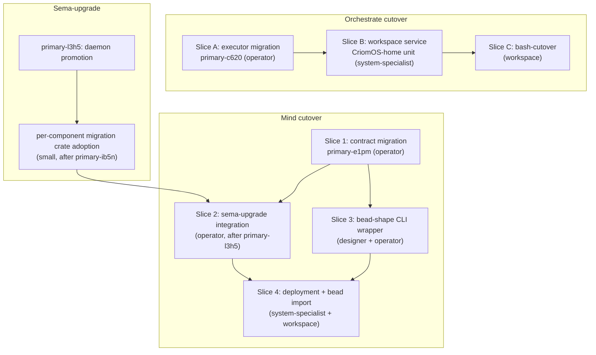

# 151 — Mind-replaces-beads + Orchestrate-replaces-tools/orchestrate: readiness + path

*Kind: Design · Topic: persona-orchestrate / persona-mind · Date: 2026-05-22*

*Readiness pulse and path-forward design in response to psyche
direction: get persona-mind running as the beads replacement and
persona-orchestrate running as the `tools/orchestrate` shell-helper
replacement, while accepting the update-mechanism prereq
(sema-upgrade). The Spirit→Mind owner contract (intent-to-mind /
/249 Gap #1) is explicitly deferred per intent 204.*

## 0 · TL;DR

**Orchestrate is close to a canary cutover.** The lane registry is
in (commits `5e52655e`, `50ed6f78`, `5e6e8cc`, `5863d339`,
`73904f37`); claim/release/handoff operations exist on the working
contract; create/retire/refresh on the owner contract; lock-file
projection exists in the daemon for backward compatibility; daemon
+ thin CLI bound. The remaining work to be ready as a
`tools/orchestrate` substitute is **two slices**: executor migration
(bead `primary-c620`, in flight) and designer confirmation that the
current claim/handoff shape is the cutover form rather than the
"redesign before migrate" path I previously recommended in `/137`
§"Open Q1".

**Mind is further away** but closer than its contract shape
suggests. The repo has a Kameo runtime with mind-local Sema tables;
typed Thought/Relation records; subscription delivery via
`SubscriptionSupervisor`; a daemon with Unix-socket Signal-frame
transport; the `mind` binary as a thin CLI. The contract carries
bead-shaped operations *already* (Opening, NoteSubmission, Link,
StatusChange, AliasAssignment, Query) — these are the exact verbs
beads exposes today. **What blocks mind-replaces-beads is the
contract migration** (still on the old universal-verb shape:
`Assert SubmitThought`, `Match QueryThoughts`, etc. — bead
`primary-e1pm` covers this) **plus a bead-shaped CLI surface** so
agents can talk to mind in bead's command vocabulary without rewriting
every reference to `bd`.

**The update-mechanism prereq is structurally load-bearing
(intent 205)** but practically tolerable for orchestrate's
data shape (claims, activity logs — short-lived, regenerable),
intolerable for mind's (bead-equivalent records are durable; loss
on restart is catastrophic). Path implication: **orchestrate can
ship with current sema-upgrade gaps tolerated; mind cannot**.

## 1 · The two targets

| Target | Substitute for | What survives loss-on-restart? |
|---|---|---|
| persona-orchestrate daemon | `tools/orchestrate` shell helper, `orchestrate/*.lock`, `orchestrate/roles.list` | claims (regenerable), activity log (re-emittable), lane registry (re-registerable from `roles.list`). Tolerable. |
| persona-mind daemon | beads (open issues, notes, links, statuses, aliases) | accumulated issue history — months of work tracked. INTOLERABLE to lose. |

The asymmetry shapes deployment sequencing: orchestrate ships first
(tolerable risk), mind ships behind sema-upgrade (so restarts
don't drop work).

## 2 · Orchestrate readiness

### 2.1 · What ships

Working contract `signal-persona-orchestrate` (verified at
`/git/github.com/LiGoldragon/signal-persona-orchestrate`):

- `operation Claim(RoleClaim)` — the central tools/orchestrate verb.
- `operation Release(RoleRelease)`.
- `operation Handoff(RoleHandoff)`.
- `operation Observe(Observation)` — read the claim/activity surface.
- `operation Submit(ActivitySubmission)` — log activity.
- `operation Query(ActivityQuery)`.
- `operation Watch(ObservationSubscription) opens ObservationStream` — domain subscription.
- `operation Unwatch(ObservationToken)`.

Owner contract `owner-signal-persona-orchestrate`:

- `operation Create(CreateRoleOrder)` — dynamic role creation.
- `operation Retire(Retirement)` — role + lane retirement.
- `operation Refresh(RefreshRepositoryIndexOrder)` — local repository index.
- `operation Register(LaneRegistrationRequest)` — lane registration (the slice that just shipped via `primary-ao1q`).
- `operation SetAuthority(LaneAuthorityChange)`.

Daemon (`/git/.../persona-orchestrate/`):

- `persona-orchestrate.redb` sema-backed store.
- Lock-file projection from daemon state (per ARCH §0 — "Lock-file
  projection from daemon state exists").
- Ordinary + owner socket binding.
- Thin CLI `persona-orchestrate` (NOTA-to-Signal adapter, no
  direct store access).

### 2.2 · What's missing

Three concrete gaps:

1. **Executor migration** (bead `primary-c620`, in flight).
   `src/service.rs` matches directly on contract operations and
   mutates ledgers — service-direct, not executor-centred. Per
   /280 + second-operator/166: needs `Command` / `Effect` types,
   `Lowering`, `CommandExecutor`, `ToSemaOperation` / `ToSemaOutcome`.
   Operator's recommended next slice (second-operator/166 §"Implementation
   Order"). Not strictly blocking the substitute role, but the
   service-direct shape will calcify wrong if cutover happens
   before migration. **Designer lean: migrate first, ship second.**

2. **Claim-surface design supersession** (`/137` §"Open Q1").
   The current Claim/Release/Handoff vocabulary is lock-helper-shaped.
   The destination (per intent 93 + intent records 97–100) is
   abstract-job submission + agent registry + policy programmability —
   different vocabulary. **Designer position now: keep Claim/Release/
   Handoff as the cutover-1 vocabulary**; treat abstract-job + agent
   registry as a follow-up surface that LAYERS ON, not replaces. The
   shell helper's claim flow is what agents already know; switching
   substrate without rewriting the verbs minimises cutover risk.

3. **Workspace-service deployment.** No systemd service unit ships
   today; the daemon runs manually. CriomOS-home would need to gain
   a `persona-orchestrate-daemon` user service unit (similar to
   `persona-spirit-daemon-v0.1.0.service`). System-specialist
   territory; small.

### 2.3 · Update-mechanism tolerance

Orchestrate's data is ephemeral enough that drop-and-rebuild on
contract edit is acceptable for the cutover-1 deployment:

- Claims regenerate when agents next claim their scopes (or are
  re-derived from existing lock files during the transitional
  window).
- Activity log is observation-only; loss is forgettable.
- Lane registry can re-register from `orchestrate/roles.list`
  during the bash-as-source-of-truth period.

Operator can ship orchestrate before sema-upgrade catches
orchestrate's schema. When sema-upgrade lands, orchestrate gets
versioned. Until then, contract edits between deployments need
operator coordination (clear redb file before restart with new
binary).

### 2.4 · Cutover slices

Three slices in order:

**Slice A — executor migration** (operator, `primary-c620`).
~1-2 days of work. Done.

**Slice B — supervision under Persona** (system-specialist +
operator). Per intent records 208 + 209: the Persona
(engine-manager daemon) lands BEFORE Spirit cutover and becomes
the universal supervisor + upgrade orchestrator. CriomOS-home no
longer needs per-component service units — it gets ONE service
unit (`persona-daemon`) and the engine supervises everything
under it. Orchestrate launches as a Persona-supervised
child. Ordinary + owner sockets in
`~/.local/state/persona-orchestrate/`; the third upgrade socket
(`orchestrate-upgrade.sock`, 0600) lands when the version-handover
protocol consumes it. The Persona itself is bead
`primary-2y5` (the `persona` daemon, in flight per /282).
Orchestrate-side prerequisite: `primary-2chb` (this report's bead
— reframed below). ~1-2 days when Persona is up.

**Slice C — bash-cutover** (workspace-wide). Agents stop running
`tools/orchestrate claim …` and start running
`persona-orchestrate '(Claim (RoleClaim ...))'`. The shell helper's
lock-file projection is bidirectional during the window: daemon
reads from `orchestrate/*.lock` to absorb prior claims; daemon
writes back so any straggling shell-helper invocations don't
collide. After a quiescence window (e.g., one week), the shell
helper retires. Bead-shaped: ~half-day designer work to write a
short cutover skill, ~half-day operator to verify the bidirectional
projection.

## 3 · Mind readiness

### 3.1 · What ships

Per `persona-mind/ARCHITECTURE.md` §0:

- Kameo runtime with `MindRoot` actor.
- Mind-local Sema tables for work graph + typed Thought/Relation.
- Subscription delivery via `SubscriptionSupervisor` (post-commit
  delta delivery for typed graph records).
- Unix-socket Signal-frame daemon + client transport.
- `mind` binary as thin CLI: one NOTA request in, one NOTA reply out.

The working contract `signal-persona-mind` has the bead-shaped
operations already:

- `Assert Opening(Opening)` — opens an issue (cf. `bd create`).
- `Assert NoteSubmission(NoteSubmission)` — adds a note (cf.
  `bd note`).
- `Assert Link(Link)` — links issues (cf. `bd link`).
- `Mutate StatusChange(StatusChange)` — change status (cf.
  `bd set-state`).
- `Assert AliasAssignment(AliasAssignment)` — alias (cf. partial).
- `Match Query(Query)` — query (cf. `bd query`, `bd list`).
- Plus thought/relation operations for the broader work graph.

The shape is right. The contract just needs migration to
contract-local verbs (drop the Assert/Match/Mutate prefixes; lift
*Submit / *Receipt families).

### 3.2 · What's missing

Four concrete gaps:

1. **Contract migration** (bead `primary-e1pm`, P1, open). Mind is
   the worst-shaped contract per /257 and my audit (former /130, now
   `reports/second-designer/130`). Move to contract-local verbs;
   lift *Thought/*Relation siblings; drop Mind prefixes; add
   observable block. Operator slice; per /150 the migration playbook.

2. **Bead-shaped CLI / migration path for accumulated beads.** The
   `mind` binary today takes one NOTA request, which is the right
   wire shape but a poor agent UX for bead-replacement
   (`mind '(Opening (Opening ...))'` is harder to type than
   `bd create`). Two options:
   - **(a) Thin wrapper.** A small `bd`-shaped CLI (named `mind`
     or something else) that translates `bd`-style subcommands
     (`mind open "Task description"`, `mind note <id> "Comment"`)
     into NOTA frames. Agent ergonomics preserved.
   - **(b) Rewrite agent invocations.** Every `bd …` in agent
     skills and reports translates to a NOTA-formed `mind '(...)'`.
     Faithful to single-argument rule but high friction during
     cutover.
   - Designer lean: **(a) thin wrapper for cutover**; (b) is the
     long-term shape (skills already point at NOTA), but ergonomics
     during cutover matter.

3. **Bead migration tool.** Existing beads in `~/primary/.beads/`
   need to land in mind's redb. A one-shot import — agent-written,
   per the substrate-replacement discipline ("either a separate
   dumb tool for one-time import, or hand-relog by agent"). The
   conservative path is hand-relog: an agent walks `bd list` and
   re-files each via mind. Bigger beads inventories may want the
   dumb-tool option.

4. **Workspace-service deployment.** Same as orchestrate's slice B —
   user systemd service unit in CriomOS-home. Gated on the
   contract-migration first (don't deploy a daemon whose contract
   is about to change).

### 3.3 · Update-mechanism intolerance

Mind's accumulated state is durable (bead histories spanning
weeks/months when fully migrated). Drop-and-rebuild on every
contract edit is unacceptable. Therefore: **mind deployment is
gated on sema-upgrade being able to migrate mind's schema**.

Sema-upgrade's temp CLI (`sema-upgrade-temporary`) is per-component
hand-written today; spirit is the first driven migration. For mind
to deploy, sema-upgrade needs a `persona_mind/version_X_to_Y.rs`
module pattern equivalent to spirit's. This is operator work and
naturally lands when mind's contract migration ships (Slice 1).

### 3.4 · Cutover slices

Four slices in order:

**Slice 1 — contract migration** (operator, `primary-e1pm`).
Move signal-persona-mind to contract-local verbs; lift sums;
drop ancestry; add observable block. ~2-3 days. Per /150 playbook.

**Slice 2 — sema-upgrade integration for mind** (operator, follows
Slice 1). Equivalent of spirit's `version_0_1_0_to_0_1_1.rs` but
the first mind version is 0.1.0 itself (no migration body needed
for first ship; the slot is reserved). Per /285 the
`VersionProjection<Source, Target>` trait wraps this. ~half-day.

**Slice 3 — bead-shape CLI wrapper** (designer + operator). Small
crate `mind-bead-shim` or similar that translates `bd`-style
subcommands to mind NOTA frames. ~1 day designer (CLI surface
spec) + ~1-2 days operator (implementation). Could also live as
a thin Nix-flake-installable wrapper in the persona-mind repo.

**Slice 4 — supervision under Persona + bead import** (system-
specialist + workspace-wide). Mind launches under the Persona
(intent 208/209) — not as a standalone systemd service. Migration
tool or hand-relog for existing beads. Cutover skill. ~1 day
system-specialist + ~variable depending on bead corpus size.

## 4 · Update-mechanism prereq

Per intent 205: the deploy → restart → update flow means a daemon
coming up against an existing redb must either find no schema
drift OR migrate. Three states for a deployed daemon:

- **State A — no migration in flight.** Schema unchanged since last
  binary. Daemon comes up, opens redb, runs. No migration code
  runs.
- **State B — drift, migration available.** Schema changed; sema-upgrade
  has a migration body for the old → new transition. Daemon coming
  up either (a) coordinates with sema-upgrade-daemon to migrate
  in-process or (b) refuses to start until the operator runs
  sema-upgrade-temporary, then starts against the migrated db.
- **State C — drift, no migration.** Schema changed; sema-upgrade
  has no body. Daemon refuses to start. Operator either ships the
  migration or drops the redb (data loss).

State A is the default for stable schemas. State B is the design
target (per /285). State C is the failure mode mind cannot
afford.

**For orchestrate cutover-1**, State C is tolerable: claims and
activity are ephemeral; the operator running with drop-and-rebuild
on contract edit accepts the cost.

**For mind cutover-1**, State C is unacceptable: bead histories
are durable. Therefore Slice 2 (sema-upgrade integration) is a
hard gate.

### 4.1 · What the operator working on version-projection needs from
mind + orchestrate

**Substrate landed 2026-05-22** (per operator/158): `version-projection`
crate (commit `69bd2dd0`), `signal-version-handover` contract
(commit `f2dfe3b4`), `sema-engine` CommitSequence (commit
`e0a7153c`), `sema-upgrade` handover prototype (commits
`060982d0` + `677206d5`). Beads `primary-la7q` (per-type migration
trait) and `primary-5w28` (sema-engine commit sequence) closed.
Per /285 the canonical spec uses `VersionProjection<Source, Target>`
(one trait, bidirectional) plus per-component policy plus
daemon-to-daemon handover protocol on a private upgrade socket.

For each persona component (mind + orchestrate) to participate:

1. **`CONTRACT_VERSION` constant** (Blake3 schema hash, hand-edited
   until the schema generator exists).
2. **`Projected` impl per type.** Blanket `Identity` covers
   self-projection at no per-type cost; hand-written
   `VersionProjection<Source, Target>` impls live in the frozen
   historical crate when an adjacent version pair needs them.
3. **Three sockets** per /285 §3.2: `<component>.sock` (ordinary),
   `<component>-owner.sock` (owner), `<component>-upgrade.sock`
   (private upgrade, 0600).
4. **PeerCheck retired** (per /285 §"three §9 open questions
   confirmed"). `signal-version-handover` is the single discovery
   mechanism — no per-component PeerCheck operation.
5. **Per-component policy** (`<component>/src/version_policy.rs`)
   with per-operation `Mirror` / `DivergenceRecord` / `Reject`
   choices. SubscribePolicy default `TerminateAtHandover`.

Items 1, 2, 3 are small surface additions; item 5 is the
substantive per-component design (small enough to land per-
component without a separate bead).

The operator working on `primary-l3h5` (sema-upgrade daemon
promotion) carries the handover-protocol production wiring; the
mind + orchestrate adoptions follow once those daemons ship.

## 5 · Path forward — concrete slices, ranked by dependency

Sequenced for blocking weight (top = next):

Concrete recommendation:

1. **Orchestrate Slice A (`primary-c620`) is the next operator
   slice.** Already in flight per second-operator/166.
2. **File a system-specialist bead for Orchestrate Slice B**
   (workspace service unit). Designer can file this now —
   minimal dependencies.
3. **Mind Slice 1 (`primary-e1pm`) is the next operator slice
   after orchestrate's Slice A.** Already filed P1. The
   contract-migration epic `primary-u8vo` is the parent.
4. **Sema-upgrade Slice SM follows `primary-ib5n` + `primary-l3h5`.**
   Operator on sema-upgrade arc carries this; designer files the
   small bead for mind + orchestrate adoption once the `migration`
   crate is named.
5. **Mind Slice 2** depends on (4). Naturally serial.
6. **Mind Slice 3** (bead-shape CLI wrapper). Designer files a
   small design report once Slice 1 ships and the new contract is
   stable to wrap.

## 6 · Open questions

**Q1 — Confirm orchestrate Slice C (bash-cutover) accepts current
Claim/Release/Handoff vocabulary.** My `/137` §"Open Q1" said
redesign before migrate. Now I lean: ship with current vocabulary;
add abstract-job + agent registry as a layered follow-up. The
lock-helper-shape is what agents already know; switching substrate
without rewriting the verbs is the lower-risk cutover. Confirm.

**Q2 — Mind Slice 3 wrapper shape.** Thin shell-CLI translating
`bd`-style commands to NOTA frames, OR rewrite all agent
invocations from `bd …` to `mind '(...)'`? Designer lean: thin
wrapper for cutover (ergonomics preserved during the window);
NOTA-direct is the long-term shape. Confirm.

**Q3 — Bead corpus migration.** Hand-relog by agents (substrate-
replacement discipline default) or one-shot dumb-tool import?
Designer lean: depends on `~/primary/.beads/` size. If under ~50
beads, hand-relog. If larger, dumb tool. Operator inspects + picks.

**Q4 — `version-projection` per-component adoption ordering.** Now
that the `version-projection` crate is named and landed (per /285 +
operator/158), do mind + orchestrate adopt simultaneously or
sequentially? Designer lean: simultaneously (both need the surface;
symmetry is cheaper than serial). Confirm.

**Q5 — Spirit→Mind owner contract verb set** (carried from /249
Gap #1). Psyche explicitly deferred (intent 204). Recorded as
out-of-scope for this design.

## 7 · See also

- `intent/persona.nota` records 204 + 205 — the priority + prereq
  intents driving this design.
- `intent/persona.nota` records 93, 97-100, 117, 118, 147 + 148 —
  lane management + role identity context for orchestrate's
  destination shape.
- `intent/persona.nota` record 156 — engine-manager involved in
  updating components (shapes the deployment story).
- `reports/second-designer/137-persona-orchestrate-triad-audit-2026-05-21.md`
  — prior triad audit; §"Open Q1" framing now superseded by §2.2
  here.
- `reports/second-designer/147-proposal-lane-registry-test-implementation-2026-05-21.md`
  — the proposal `primary-ao1q` implemented (lane registry shipped).
- `reports/second-designer/149-audit-lane-registry-implementation-2026-05-22.md`
  — audit of the shipped lane-registry slice.
- `reports/second-designer/130-persona-mind-triad-audit-2026-05-21.md`
  — mind's audit (worst-shaped contract).
- `reports/second-operator/166-review-persona-orchestrate-migration-2026-05-22.md`
  — operator's current view of orchestrate state + next slice.
- `reports/second-operator/168-review-mind-router-policy-2026-05-22.md`
  — mind/router policy review.
- `reports/designer/285-versionprojection-trait-and-handover-protocol-specification.md`
  — the canonical `VersionProjection` spec that mind + orchestrate
  adopt. (Supersedes the dropped /284.)
- `reports/designer/287-version-handover-component-explained.md` —
  visual walk-through of the handover stack mind + orchestrate
  participate in.
- `reports/operator/158-version-handover-foundation-implementation-2026-05-22.md`
  — substrate landings (`version-projection`, `signal-version-handover`,
  `sema-engine.CommitSequence`, `sema-upgrade` handover prototype).
- `reports/operator/159-persona-engine-upgrade-foundation-2026-05-22.md`
  — Persona's engine-manager layer of upgrade orchestration
  (Persona supervises mind + orchestrate per intent 208/209).
- Beads `primary-c620` (orchestrate executor migration),
  `primary-e1pm` (mind contract migration), `primary-l3h5`
  (sema-upgrade daemon), `primary-ib5n` (sema-upgrade arch merge),
  `primary-u8vo` (contract migration epic).

This report retires when (a) both cutovers complete (orchestrate
serves as tools/orchestrate substitute; mind serves as beads
substitute), OR (b) a successor design supersedes the path
forward after psyche redirects priorities.
