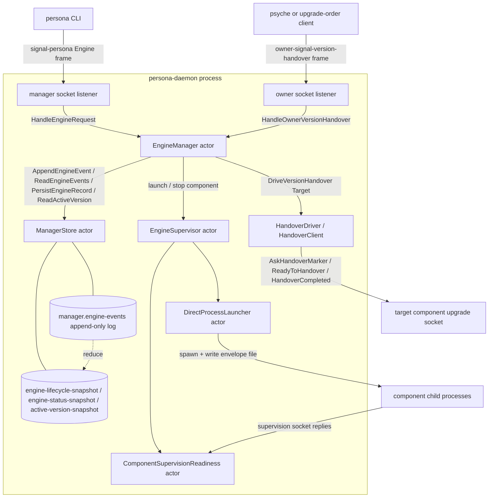
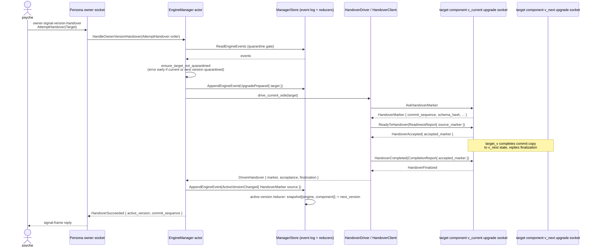

*Kind: Component sub-report · Topic: Persona daemon · Date: 2026-05-22*

# 1 — Persona daemon

## What it is

Persona is the engine-management half of the persona triad. The repo
ships two binaries: `persona-daemon` (the long-lived host-level engine
manager actor; runs as the dedicated `persona` system user) and
`persona` (the thin CLI daemon-client, one NOTA request in, one NOTA
reply out). Together they are the **root** of the durable-agent
ecosystem: Persona supervises per-engine component federations
(mind, router, system, harness, terminal, message, introspect) and,
per intent records 208/209/210, owns root component-upgrade
orchestration — owner-authority upgrade orders arrive at Persona's
owner socket, and Persona drives the smart handover protocol against
target components' private upgrade sockets. Per records 215+216 the
canonical short name is just "Persona"; "engine-manager daemon" /
"Persona Engine Manager Daemon" are not used as nouns in any new
substance.

## Current state

**Implemented on `main` (commit `04ec9302` `persona: gate handover on
quarantine`, 2026-05-22 19:49):**

- Manager actor (`src/manager.rs`): the Kameo `EngineManager` actor
  with the four request-handling planes — ordinary engine ops
  (`HandleEngineRequest`), upgrade preparation/completion
  (`PrepareUpgrade` / `CompleteUpgrade`), full upgrade drive
  (`DriveVersionHandover`), and owner-authority version-handover
  routing (`HandleOwnerVersionHandover`).
- Typed upgrade target model (`src/upgrade.rs`): `Target`,
  `TargetInput`, `Prepared`, `PreparedEvent`, `ActiveVersionChanged`,
  `ActiveVersionChangeSource`, `VersionQuarantined`, `ActiveVersion`,
  `HandoverEndpoint`, `HandoverFrameCodec`, `HandoverClient`,
  `HandoverDriver`, `DrivenHandover`. The four-socket model is
  realised — every `Target` carries current/next owner socket paths
  and current/next private upgrade socket paths.
- Manager event log with new variants `UpgradePrepared`,
  `ActiveVersionChanged`, `VersionQuarantined`. Schema version `4`
  at `src/manager_store.rs:18`.
- Active-version snapshot reducer projecting `(EngineId,
  ComponentName) -> ActiveVersion` from the event log; rebuilds from
  the log on `ManagerStore::open`.
- `HandoverDriver::drive_current_side` opens a Unix-socket client to
  the current upgrade socket and walks `AskHandoverMarker ->
  ReadyToHandover -> HandoverCompleted` end-to-end (commit
  `22089f47` `persona: drive version handover sockets`).
- Owner socket transport (`src/transport.rs:75`): the daemon binds
  a separate `<stem>-owner.sock` derived from the manager socket
  (or `PERSONA_OWNER_SOCKET`) and routes owner-version-handover
  operations (`AttemptHandover`, `ForceFlip`, `Rollback`,
  `Quarantine`) into `HandleOwnerVersionHandover` (commit
  `d89c3ac5` `persona: consume owner version handover authority`).
- Quarantine gating on every `prepare_upgrade` /
  `drive_version_handover`: if the manager event log shows a
  `VersionQuarantined` entry for either the current or next version
  of the target component, the call returns
  `Error::ComponentVersionQuarantined` before any wire I/O (commit
  `04ec9302`).
- Manager-internal launch composite `launch::ResolvedComponentLaunch`
  + child-readable `signal-persona::SpawnEnvelope`; the child reads
  only the typed envelope from a file under
  `/var/run/persona/<engine-id>/<component>.envelope`.
- Direct-process launcher (`src/direct_process.rs`), engine
  supervisor (`src/supervisor.rs`), supervision-readiness probe
  actor (`src/supervision_readiness.rs`),
  envelope-driven readiness model (`src/readiness.rs`), engine
  layout / socket policy / spawn-envelope records (`src/engine.rs`),
  manager-store actor with append-only event log + reducer-on-append
  snapshots (`src/manager_store.rs`).

The Nix witness column in ARCH §9 calls out the specific upgrade
witnesses already in place: `persona-engine-manager-prepares-upgrade-
with-version-handover-request`,
`persona-engine-manager-records-active-version-after-handover-
completion`,
`persona-engine-drives-version-handover-over-component-upgrade-
socket`,
`persona-engine-owner-attempt-drives-version-handover`,
`persona-engine-refuses-version-handover-with-quarantined-version`,
`persona-daemon-serves-owner-version-handover-socket`,
`persona-daemon-owner-attempt-drives-version-handover`.

**Pending (per `primary-wvdl` Track A — Persona: port to current
Signal stack + complete upgrade orchestration):**

- Target component support for binding the private upgrade socket
  per `~/.local/state/<component>/v<X.Y.Z>/<component>-upgrade.sock`
  (per designer/285 §3.2). Persona drives the protocol; the
  components need to answer on it. Spirit is the first target.
- Spirit v0.1.0 retrofit + v0.1.1 cutover wiring (`primary-x3ci`)
  proving the full path from psyche-issued
  `(Upgrade <spirit-target>)` order through Persona's owner socket,
  through Persona's `HandoverDriver`, into a live `spirit-daemon`
  v0.1.0 with the upgrade socket bound.
- Failure-class handling: `MissingNext` (next daemon unreachable)
  per record 178, marker mismatch is a typed error today but the
  error-class taxonomy on the owner-socket reply surface still
  needs filling in.

**Pending (per `primary-wvdl` Track B — port to current Signal
stack):**

- `signal-executor` integration (Lowering, CommandExecutor,
  ObserverChannel) per the pattern Spirit followed. Today the
  daemon dispatches operations through the Kameo actor mesh
  directly rather than going through the executor envelope.
- Axis 2 rename on the daemon side (see §"Axis 2 rename status"
  below).
- Observable block on the `signal-persona` Engine channel (the
  designer lean per `reports/designer/258`: yes on Engine, skip on
  EngineManagement).
- `NotaEnum` mixed-variant derive adoption wherever hand-written
  codec impls remain.

## Diagram

## Upgrade orchestration role

Per intent records 208/209/210, Persona is the **root** component-
upgrade orchestrator. Upgrade orders enter Persona through the owner
socket; Persona then drives the handover protocol against the target
component's private upgrade socket.

Three things to note about the picture as currently implemented:

1. **Persona connects to `current_upgrade_socket_path`, not
   `next_upgrade_socket_path`.** `HandoverDriver::drive_current_side`
   in `src/upgrade.rs:414` opens a client to the current side. The
   current daemon answers the marker/readiness/completion protocol;
   the smart handover code on the current side is what walks the
   commit copy into the next daemon's redb. The `next_upgrade_
   socket_path` field on `Target` is recorded in the event log
   (proof of intent, audit) but the engine itself does not drive the
   next daemon directly.
2. **Owner socket and manager socket are distinct.** The manager
   socket carries `signal-persona::engine::Operation`
   (status/start/stop/launch). The owner socket carries
   `owner-signal-version-handover::Operation`
   (AttemptHandover/ForceFlip/Rollback/Quarantine). Same daemon
   process, two listener tasks, two contract surfaces.
3. **Active selector lives in the manager event log, not in
   filesystem symlinks.** `manager.active-version-snapshot` is the
   authoritative answer to "which version of component X is live
   right now". This is what supersedes the CriomOS-home
   `current -> v<X.Y.Z>` symlink mechanism for component upgrades
   per intent 208.

`ForceFlip` and `Rollback` are owner-authority overrides: they
append `ActiveVersionChanged` directly with `ActiveVersionChange
Source::ForceFlip { reason }` or `::Rollback { reason }` and skip
the handover protocol; quarantine writes `VersionQuarantined` and is
checked on the next prepare. The reducer projects all three sources
into the active-version snapshot.

## Axis 2 rename status

The signal-persona contract side has **already been renamed**:
`EngineManagementProtocolVersion`, `EngineManagementUnimplemented
Reason`, etc. are in place per the rename plan. The Persona daemon
side still carries 211 `supervision` / `Supervisor` occurrences
across 6 files (counted per `grep -c "[Ss]upervision\|[Ss]upervisor"`
2026-05-22):

| File | occurrences |
|---|---|
| `src/supervisor.rs` | 86 |
| `src/supervision_readiness.rs` | 63 |
| `src/bin/persona_component_fixture.rs` | 35 |
| `src/engine.rs` | 28 |
| `src/direct_process.rs` | 27 |
| `src/readiness.rs` | 3 |
| total | 242 |

(My count is 242 across these six files; the orchestrator's brief
said ~211. The exact number depends on how `[Ss]upervis` is counted
— some occurrences are within long-form identifiers. The shape is
the same either way: low hundreds, six files, three identifier
classes.)

Three classes of identifier need the rename:

- **module / file names**: `src/supervisor.rs` ->
  `src/engine_manager.rs`, `src/supervision_readiness.rs` ->
  `src/engine_management_readiness.rs`, `pub mod supervisor` ->
  `pub mod engine_management`.
- **type names**: `EngineSupervisor`, `EngineSupervisorInput`,
  `StartPrototypeSupervision`, `ComponentSupervisionExpectation`,
  `ComponentSupervisionReadiness`, `ComponentSupervisionReadiness
  Failure`, `VerifyComponentSupervision`, `SupervisionServer`,
  `BlockingSupervisionCodec`, `SupervisionOnlyProcess` -> Engine
  Management equivalents.
- **field / variable / socket-path strings**: `supervision_socket_
  path`, `supervision_socket_mode`, `supervision_socket`,
  `supervision_listener`, `supervision_server`, `supervision_
  thread`, `supervision_readiness`, `started_supervision_count`,
  `stopped_supervision_count`, the `PERSONA_SUPERVISION_SOCKET_
  PATH` env var, the `.supervision.sock` filename constants. These
  are an ABI break — the env-var name flows from the parent
  `persona-daemon` into the child via `signal-persona::SpawnEnvelope`,
  so the rename has to land atomically across the daemon, the
  fixture, and the launcher set.

The rename is mechanically large but not architecturally complex —
the supervision relation **is** the engine-management relation, the
distinction the rename closes is a vocabulary one. The contract side
is already past the rename; the daemon side waits because the env-var
flip is a coordinated cut across the prototype launcher set and the
fixture binary.

## Open design questions

**(a) signal-persona crate split** (preserved from `primary-wvdl`
comments per intent 229). Today `signal-persona` carries both the
Engine channel (status/start/stop/launch) and the EngineManagement
channel (supervision-relation health/identity/readiness vocabulary).
Two competing ideas:

- **One repo, two channels** (status quo). The two channels share
  the same contract crate, the same versioning, the same release
  cadence. They are both Persona-management vocabulary; keeping
  them together reduces fan-out on the contract dependency graph.
- **Split EngineManagement out** into a sibling `signal-engine-
  management` (or `signal-persona-engine-management`) crate. The
  motivation is that EngineManagement is consumed by **every**
  supervised component daemon (every component speaks the
  supervision relation upward to Persona), while the Engine channel
  is consumed only by clients of `persona-daemon` (the CLI plus a
  small number of UIs). The two surfaces have different audiences.
  The split reduces what a component daemon needs to depend on
  just to bind its supervision socket.

Both ideas remain live; the operator-window slice that follows
should pick one explicitly and record the choice as a Decision via
Spirit.

**(b) ForceFlip and Rollback go through the same `ActiveVersion
Changed` event variant as `HandoverMarker`-sourced changes,
discriminated only by `ActiveVersionChangeSource`.** This means the
active-version reducer treats every change uniformly. Open question
preserved: should `ForceFlip` and `Rollback` instead be **separate**
event-log variants (`ActiveVersionForceFlipped`,
`ActiveVersionRolledBack`) so the audit trail records the kind of
change at the event-variant level rather than inside a payload enum?
The current shape favours uniform reducer code; the alternative
favours grep-friendly audit log walks.

**(c) Owner-socket framing.** The owner socket today uses an
`owner-signal-version-handover` contract dedicated to version
handover. Future owner-authority surfaces (engine retire, force-
restart, manual quarantine of a component instance, etc.) could
either grow new variants in `owner-signal-version-handover`, get
their own `owner-signal-persona` contract, or fold into a single
`owner-signal-engine-management` crate alongside the Axis 2 rename.
This is upstream of sub-report 7 (`owner-signal-version-handover`
wire spec).

**(d) Per-engine active-version snapshot keying.** The active-
version snapshot is keyed by `(EngineId, ComponentName)`. In a
single-engine deployment this is just `(default, component)`. The
cross-engine question — does a component upgrade in engine A
automatically apply to engine B, or do upgrades run per-engine — is
deferred until multi-engine becomes real; the current key shape
supports both.

## How it fits

- **Sub-report 2 (signal-persona)** owns the contract surface the
  manager socket speaks (Engine channel) plus the supervision
  relation under the still-pending Axis 2 rename (EngineManagement
  channel). The split-vs-merge open question above is the seam
  between this sub-report and sub-report 2.
- **Sub-report 3 (signal-version-handover)** owns the working-
  signal protocol Persona drives against component upgrade sockets:
  `MarkerRequest`, `HandoverMarker`, `ReadinessReport`, `Handover
  Acceptance`, `CompletionReport`, `HandoverFinalization`. Persona
  is its first consumer.
- **Sub-report 4 (version-projection)** owns the `ContractVersion` /
  `ComponentName` types and the `VersionProjection` trait that
  components implement to be upgradable. Persona stores
  `ContractVersion` (schema hash) on `ActiveVersionChanged` and
  surfaces it in the active-version snapshot.
- **Sub-report 5 (sema-stack)** owns the `commit_sequence` typed
  pointer (sema-engine) and the smart-handover commit-copy
  mechanism (sema-upgrade) that the target component's upgrade
  socket executes when Persona drives `ReadyToHandover`. Persona
  records the `commit_sequence` from the returned `HandoverMarker`
  on `ActiveVersionChanged`.
- **Sub-report 6 (persona-spirit)** is the first cutover target.
  Spirit v0.1.0 is currently deployed without the handover
  protocol; the retrofit (record 209: Persona lands before Spirit
  cutover) reissues v0.1.0 with the upgrade socket bound, then
  v0.1.1 lands with the handover protocol live.
- **Sub-report 7 (owner-signal-version-handover)** owns the wire
  spec for the owner socket Persona binds. Persona's owner-socket
  listener routes its operations into `HandleOwnerVersion
  Handover`.

## ARCHITECTURE.md update

I edited `/git/github.com/LiGoldragon/persona/ARCHITECTURE.md`:

1. Added a new §1.6.7 "Persona as root component-upgrade
   orchestrator" between the existing §1.6.6 "Multi-engine as
   upgrade substrate" and §1.7 "Startup Strategy". The new section
   names: (a) the owner socket as the entry point per intent 210,
   (b) the four-socket `Target` model from operator/159, (c) the
   `PrepareUpgrade` / `CompleteUpgrade` / `DriveVersionHandover` /
   `HandleOwnerVersionHandover` manager messages, (d) the
   active-version snapshot as the live selector that replaces the
   CriomOS-home symlink mechanism, (e) the four
   `ActiveVersionChangeSource` variants (HandoverMarker, ForceFlip,
   Rollback) and the quarantine gate, (f) the canonical "Persona"
   name per records 215+216 with explicit retirement of "Persona
   Engine Manager Daemon" as a noun.
2. Reframed §1.6.6 — the prior "engine-level upgrade replaces
   component-level hot-swap" prose described a side-by-side
   engine v1/v2 path with mind-granted migration channels. That is
   now demoted to a forward-looking note ("multi-engine remains as
   a substrate for engine-level migration when a federation
   topology change is involved") and §1.6.7 carries the
   per-component upgrade discipline that records 208/209/210 made
   load-bearing.

The §9 Architectural-Truth Tests table already names the upgrade-
related Nix witnesses (lines 1311–1315 and 1321–1322 of the file),
so no edit was needed there. The §0 TL;DR blockquote and §0.5
"Persona — the durable agent" already use "Persona" as the name; I
did not edit those.

The ARCH edit landed as commit `248f339f` ("persona: ARCH names
Persona as root upgrade orchestrator") on top of an undescribed
in-flight working-copy commit holding operator's pending work on
`src/manager.rs`, `src/upgrade.rs`, `tests/daemon.rs`,
`tests/manager.rs`, `flake.nix`, `TESTS.md`, and `Cargo.lock`. The
operator's in-flight commit was preserved exactly as I found it
(via `jj squash --from @- --into @ ARCHITECTURE.md` after a fresh
`jj new`); only `ARCHITECTURE.md` moved into the described commit.
