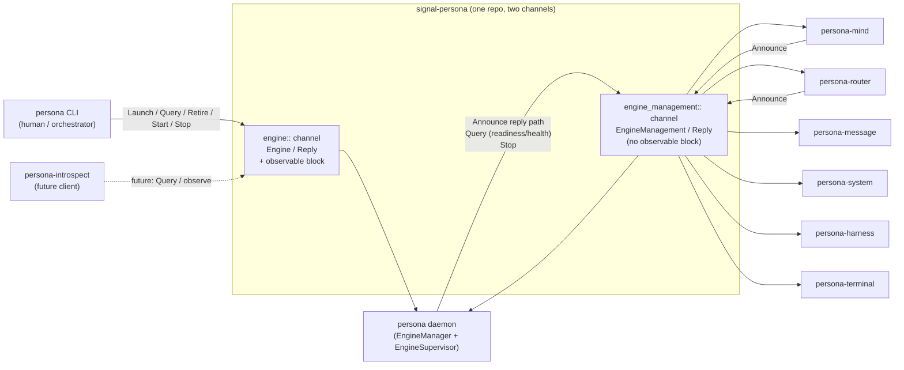

*Kind: Component sub-report · Topic: signal-persona working contract · Date: 2026-05-22*

# 2 — signal-persona (Engine + EngineManagement working contract)

## What it is

`signal-persona` is the typed Signal contract for the `persona`
engine-manager daemon. It is one of the **two-channel triad
exceptions** the workspace carries: instead of the canonical
`<component>` + `signal-<component>` + `owner-signal-<component>`
shape, persona's engine-management surface is folded as a **second
channel inside `signal-persona` itself** (per intent records 156 &
174). There is no `owner-signal-persona` repo and per current
psyche framing there will not be one.

The two channels are:

- **`engine::` channel (`Engine`)** — the public ordinary working
  surface clients use to launch, retire, query, start, and stop
  engines and their components. Consumed by `persona` CLI clients
  and any external orchestrator.
- **`engine_management::` channel (`EngineManagement`)** — the
  manager-to-supervised-component lifecycle relation. Consumed by
  every supervised child daemon (mind, router, message, system,
  harness, terminal, introspect, orchestrate) so the engine manager
  can `Announce` presence, query readiness/health, and `Stop` them.
  Despite being a "second channel", structurally this fills the
  authority-signal role: the engine manager exerts owner-like
  control over its children through it.

Both channels are declared with `signal_frame::signal_channel!` and
share the same `signal_persona_auth::*` provenance and the same
`SpawnEnvelope` shape.

## Current state

### What's renamed (Axis 2 done on the contract side)

The supervision → engine-management rename **has fully landed in
`src/lib.rs`**. Grep confirms:

- `EngineManagementProtocolVersion` — present at line 310
- `engine_management_protocol_version` — three call sites
  (`Presence` line 403, `ComponentIdentity` line 410, `SpawnEnvelope`
  line 477)
- `EngineManagementUnimplementedReason` — line 447, with payload
  variant `EngineManagementUnimplemented` at line 454
- `engine_management::` module — declared at line 480, contains the
  channel macro invocation
- `engine_management_socket_path` / `engine_management_socket_mode`
  — both present on `SpawnEnvelope` (lines 473–474)

The migration was committed as `signal-persona: migrate engine
management contract surface` (`92b33ad1`, current `main` HEAD).

### What still says "supervision" (documentation/tooling residue)

The code surface is clean. Five companion files still carry stale
`supervision`/`Supervisor` text:

| File | Hits | Kind |
|---|---|---|
| `src/lib.rs:4` | 1 | doc-comment word "supervised local components" |
| `ARCHITECTURE.md` | 27 references on a fast scan | full body; section headings, mermaid, type lists |
| `skills.md` | 9 references | sections on the supervision relation, the SupervisionRequest aliases, the four-op surface |
| `README.md:8` | 1 | "the common manager-to-supervised-component lifecycle relation" |
| `tests/engine_manager.rs:384` | 1 | function name `supervisor_action_round_trips_with_typed_rejection` |

`ARCHITECTURE.md` is updated by this sub-report (see §"ARCHITECTURE.md
update" below). The other four are out of scope for this sub-agent;
they should be claimed under bead `primary-wvdl` Track B (the same
bead that tracks the daemon-side rename).

### Operations and replies (deployed surface)

**Engine channel:**

```text
operation Launch(EngineLaunch)
operation Query(Query)
operation Retire(signal_persona_auth::EngineId)
operation Start(ComponentStartup)
operation Stop(ComponentShutdown)

reply Launched(LaunchAcceptance)
reply LaunchRejected(LaunchRejection)
reply Catalog(EngineCatalog)
reply EngineStatus(EngineStatus)
reply ComponentStatus(ComponentStatus)
reply ComponentMissing(ComponentName)
reply Retired(signal_persona_auth::EngineId)
reply RetireRejected(RetirementRejection)
reply ActionAccepted(ActionAcceptance)
reply ActionRejected(ActionRejection)
```

`Query` is a payload-side enum: `Catalog(EngineCatalogScope)`,
`EngineStatus(EngineStatusScope)`, `ComponentStatus(ComponentName)`.

**EngineManagement channel:**

```text
operation Announce(Presence)
operation Query(Query)
operation Stop(ComponentName)

reply Identified(ComponentIdentity)
reply Ready(ComponentReady)
reply NotReady(ComponentNotReady)
reply HealthReport(ComponentHealthReport)
reply StopAcknowledged(StopAcknowledgement)
reply Unimplemented(EngineManagementUnimplemented)
```

`Query` here is its own per-module enum:
`ReadinessStatus(ComponentName)`, `HealthStatus(ComponentName)`.

### Observable block status (designer lean: ADD on Engine, SKIP on EngineManagement)

**The designer lean is implemented.**

`Engine` carries an observable block (`src/lib.rs:280–284`):

```text
observable {
    filter default;
    operation_event OperationReceived;
    effect_event EffectEmitted;
}
```

with `OperationReceived { operation: OperationKind }` and
`EffectEmitted { observation: SemaObservation }` records emitted
just below (lines 287–295).

`EngineManagement` has **no** observable block. Per the designer
lean the engine-management traffic is internal infrastructure —
adding the observable block there would just double-record what
the manager already knows. Status: **matches the lean exactly,
no follow-up needed on this axis**.

## Diagram



Persona daemon both **emits** on EngineManagement (when it queries
or stops a child) and **receives** on EngineManagement (when a child
`Announce`s its presence at startup). The daemon is the only
process emitting on Engine to the CLI; clients consume only.

## The Axis 2 rename

**What "Axis 2" means here.** The audit at
`reports/second-designer/142-persona-engine-manager-triad-re-audit-2026-05-21.md`
(/258's companion) enumerated several rename axes. Axis 2 is the
universal supervision → engine-management replacement — every
identifier, field name, module path, doc string, and protocol token.

**What landed in this contract.** All deployed-code symbols carry
the new vocabulary:

- `engine_management::` module path (was `supervision::`)
- `EngineManagementProtocolVersion` newtype (was
  `SupervisionProtocolVersion`)
- `EngineManagementUnimplemented` + `EngineManagementUnimplementedReason`
  (was `SupervisionUnimplemented{,Reason}`)
- `engine_management_socket_path` + `engine_management_socket_mode`
  on `SpawnEnvelope`
- `engine_management_protocol_version` field on `Presence`,
  `ComponentIdentity`, `SpawnEnvelope`
- `StopAcknowledgement` (was `GracefulStopAcknowledgement`)

Tests and examples follow the new names
(`tests/spawn_envelope.rs`, `tests/canonical_examples.rs`,
`examples/canonical.nota`).

**What didn't land.** Documentation prose. `ARCHITECTURE.md`,
`skills.md`, `README.md`, the lib.rs module-level doc comment, and
one test function name still read "supervision". They are
externally-visible (agents grep them) but not wire-visible. This
sub-report updates `ARCHITECTURE.md`; the others should be cleared
under the same track that fixes the daemon-side rename.

**How the daemon side lags.** Per re-audit /142 §2.5 and bead
`primary-wvdl` Track B item 8: the `persona` daemon still uses
`supervision` / `Supervisor*` across ~6 files (`supervisor.rs`,
`supervision_readiness.rs`, `direct_process.rs`, the wire_*
binaries, `Cargo.toml` env-var names, and the
`DaemonConfiguration` field). That is **not** a contract problem;
it's a downstream consumer-rename cascade. The contract is ready
to be consumed under its new names today.

## Open design questions

### Q1 — One repo with two channels, or split EngineManagement into its own contract?

This is the **preserved competing-design slot** per intent record
229. Re-audit /142 §2.4 raises it but does not settle it. The
designer lean (and the current state) is one repo with two `pub
mod` channels. The competing position:

**For staying one repo (current):**

- Both channels serve `persona-daemon`. One contract crate per
  daemon is the natural unit.
- Intent record on component-shape (psyche 2026-05-21) explicitly
  authorises multi-channel-per-crate via modules.
- Splitting now means another contract repo in the dependency
  graph, another flake, another set of tests.
- The two channels share `signal_persona_auth::*`, `ComponentKind`,
  `ComponentName`, `EngineManagementProtocolVersion` — splitting
  would force one crate to depend on the other (likely
  `signal-persona-engine-management` on `signal-persona`).

**For splitting:**

- Different consumers. Engine is CLI-facing; EngineManagement is
  internal infrastructure between manager and supervised children.
- Different authority. Engine is a working surface; EngineManagement
  is manager-exercising-owner-authority-over-children, structurally
  closer to the `owner-signal-<X>` role.
- Splitting would let the engine-management surface evolve at a
  different cadence than the public engine catalog surface.

**Status: psyche has not confirmed either way.** The contract sits
in the "one repo, two channels" shape because that's what landed
when the rename happened; the question of whether to split is open
and tracked here for future psyche input.

### Q2 — `signal-persona::ComponentName` vs `signal_persona_auth::ComponentName`

`SpawnEnvelope.component_name` is typed as
`signal_persona_auth::ComponentName` (closed enum of supervised
local principals). The crate-local `signal_persona::ComponentName`
is an open `String` newtype used elsewhere (e.g. `ComponentStatus`,
`Presence`). Two crates currently share the type name; the intended
split (per the current `ARCHITECTURE.md` "Typed Records" section)
is `signal_persona_auth::ComponentPrincipal` (closed enum) and
`signal_persona::ComponentInstanceName` (open instance identifier).
The rename has not landed. **Carry-over from /258, /142; not
currently blocking.**

### Q3 — Should the Engine `Query` payload enum stay flat, or grow nested observation queries?

Today `Query` is `Catalog | EngineStatus | ComponentStatus`. With
persona-introspect arriving (intent 184) and observable-block traffic
joining the surface, the Engine channel may want a parallel
observation-query family (subscribe to operation/effect streams).
Whether that becomes a new operation root (`Observe(…)`) or a new
`Query` payload variant is unresolved. **Surfaced in
re-audit /142 §3 indirectly; not yet a real design item.**

## How it fits

- **Sub-report 1 — Persona daemon (engine-manager).** The daemon
  is the lone server of the Engine channel and the manager-side
  client of the EngineManagement channel. Its daemon-internal
  `PrepareUpgrade` / `CompleteUpgrade` Kameo messages
  (`persona/src/manager.rs:393`, `416`) are **not** part of this
  contract — they consume `signal-version-handover` (a separate
  sibling working contract) and `owner-signal-version-handover`
  (the owner spec, sub-report 7). The signal-persona contract was
  NOT extended by operator/159's upgrade work; the upgrade
  vocabulary lives in the version-handover triad.
- **Sub-report 7 — owner-signal-version-handover (wire spec).**
  Persona daemon's authority surface for "perform a smart handover
  on this component" is the owner-signal-version-handover contract,
  not an extension of EngineManagement here. This is how Persona
  gains owner-authority semantics without growing a sibling
  `owner-signal-persona`: the upgrade-related owner-authority is
  factored out to a per-concern sibling contract whose scope is
  smart handover only.
- **Sub-report 4 — version-projection.** Provides `ContractVersion`
  and `ComponentName` used by `signal-version-handover`; the
  Engine channel currently does not consume version-projection but
  may need to once introspect queries grow.

## ARCHITECTURE.md update

Yes. I rewrote `/git/github.com/LiGoldragon/signal-persona/ARCHITECTURE.md`
to:

1. Replace every "supervision" / "Supervisor*" reference with the
   `engine_management` / `EngineManagement*` vocabulary.
2. Update the operation/reply tables to match the deployed `src/lib.rs`
   surface (renamed types, current reply variants).
3. Record that the Engine channel carries an observable block and
   the EngineManagement channel intentionally does not.
4. Note the absence of `owner-signal-persona` and the role of
   `signal-version-handover` / `owner-signal-version-handover` as
   the version-upgrade authority vocabulary (so the operator/159
   work sits in the right architecture context).
5. Trim retired-vocabulary lists to the names that genuinely retired
   (drop names that were never deployed under those forms).

Committed via `jj` with description `signal-persona: refresh
ARCHITECTURE for engine-management rename and version-handover
neighbours`.

Out-of-scope rename targets left for the daemon-side track:
`README.md`, `skills.md`, the lib.rs module-level doc comment,
`tests/engine_manager.rs:384` function name.
