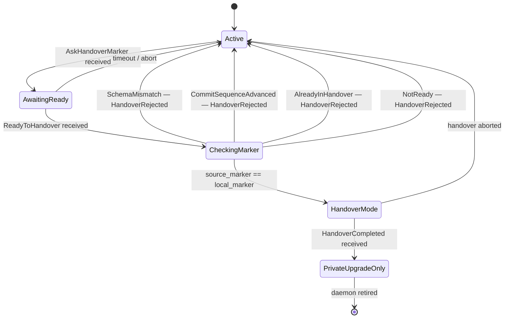

*Kind: Component sub-report · Topic: signal-version-handover contract · Date: 2026-05-22*

# 3 — signal-version-handover

## What it is

`signal-version-handover` is the daemon-to-daemon handover protocol — the
typed wire vocabulary two sibling versions of one component daemon speak
across each daemon's **private upgrade socket**
(`~/.local/state/<component>/v<X.Y.Z>/<component>-upgrade.sock`, mode `0600`,
same-UID-only). Six operations carry the protocol: marker discovery,
readiness, completion, mirrored writes, divergence recording, and recovery.
The crate is pure wire vocabulary — no daemon code, no runtime state
machine, no migration logic, no socket binding policy. Companion library
`version-projection` (sub-report 4) holds the trait that turns records
between versions; the companion contract `owner-signal-version-handover`
(sub-report 7) holds administrative-authority verbs and ships on a separate
owner-only socket.

## Current state

**Landed.** Commit `f2dfe3b4` on `main` (operator/158) instantiated the
channel macro and all eight payload records. Round-trip witnesses in
`tests/round_trip.rs` exercise rkyv and NOTA codecs end-to-end. Today's
ARCHITECTURE.md restructure (commit `eb80f588`) brings the file onto the
`skills/architecture-editor.md` template; this sub-agent didn't have to
rewrite it.

**Consumed by `persona-spirit` at commit `40c0c93e`** (operator/161).
`persona-spirit-daemon` now binds three sockets — ordinary working, owner
policy, and private upgrade — and the upgrade socket serves
`AskHandoverMarker`, `ReadyToHandover`, and `HandoverCompleted` against
the real sema-engine commit sequence. `HandoverCompleted` removes the
ordinary and owner socket paths. This is the first production daemon to
own its private upgrade socket directly; earlier work routed the protocol
through `sema-upgrade-handover-temporary` (a standalone runner driving
`sema-upgrade::handover`).

**End-to-end proof via `spirit-smart-handover-sandbox`** (operator/160).
A Nix-owned sandbox starts tagged `persona-spirit` daemons at `v0.1.0`
and `v0.1.1`, copies a real production database snapshot, runs the smart
handover protocol over the contract, flips the selector, and verifies the
post-handover write semantics. The run migrated **217 records** in
operator/160, **218 records** in operator/161's verification. The proof
covers: legacy `High` rejected on `v0.1.0`, `Maximum` accepted on `v0.1.0`
before snapshot, migrated current write observed by `v0.1.1`, next-only
`High` write after handover observed only by `v0.1.1`, current database
unchanged by next-only write.

**Mirror semantics — partially settled.** `MirrorPayload` carries
`(component, source_version, target_version, kind, payload: Vec<u8>)`.
The payload field is **raw rkyv-encoded bytes plus a `RecordKind`
discriminant**, deliberately keeping this contract free of cross-imports
to every signal-X crate. The typed-enum alternative remains open
(see *Open design questions* below). `Mirror` operation handling on the
upgrade socket — i.e. *applying* a mirror payload onto current's database
via reverse projection — is **not yet implemented** in
`persona-spirit-daemon`; the path is exercised only inside
`sema-upgrade::handover`'s prototype.

**Read-during-handover semantics — not implemented.** The contract only
models writes (Mirror + Divergence). Whether reads during HandoverMode
fan out across both daemons, project back through `version-projection`,
or fall through to current alone is an open daemon-side question.

**Recovery operation — wire only.** `RecoverFromFailure(RecoveryRequest)`
and the `RecoveryResult` reply exist; the recovery state machine that
consumes them is downstream tooling and not part of this contract.

## Diagram

### Successful handover, current ↔ next

```mermaid
sequenceDiagram
    autonumber
    participant Cur as Current daemon<br/>(v0.1.0 — Active)
    participant Nxt as Next daemon<br/>(v0.1.1 — started, not public)

    Note over Cur: ordinary + owner + upgrade<br/>sockets bound; serving public
    Note over Nxt: own ordinary + owner + upgrade<br/>sockets bound; not yet public

    Nxt->>Cur: AskHandoverMarker(MarkerRequest)
    Cur-->>Nxt: HandoverMarker { commit_sequence N,<br/>last_record_identifier,<br/>schema_hash, recorded_at }

    Note over Nxt: copy current's state up to N,<br/>projecting each record through<br/>version-projection

    Nxt->>Cur: ReadyToHandover(ReadinessReport { source_marker })

    alt source_marker matches current's marker
        Cur-->>Nxt: HandoverAccepted(HandoverAcceptance)
        Note over Cur: enter HandoverMode<br/>(public writes paused)
        Note over Nxt: drain deltas N+1..N'<br/>via Mirror / Divergence
        Nxt->>Cur: HandoverCompleted(CompletionReport)
        Cur-->>Nxt: HandoverFinalized(HandoverFinalization)
        Cur->>Cur: remove ordinary + owner socket paths<br/>(upgrade socket stays bound)
        Note over Nxt: now serves public traffic<br/>(selector flipped by persona engine)
    end
```

### Marker-mismatch branch — state machine on current



The four rejection branches map one-to-one to the `HandoverRejectionReason`
enum variants in `src/lib.rs`. On any rejection, current stays in `Active`;
next is expected to re-fetch the marker via a fresh `AskHandoverMarker`
and retry.

## Operations and replies

| Operation | Direction | Payload | Accepted reply | Rejection reply |
|---|---|---|---|---|
| `AskHandoverMarker` | next → current | `MarkerRequest { component }` | `HandoverMarker { component, schema_hash, commit_sequence, write_counter, last_record_identifier, recorded_at_date, recorded_at_time }` | `HandoverRejected(SchemaMismatch \| AlreadyInHandover)` |
| `ReadyToHandover` | next → current | `ReadinessReport { component, source_marker: HandoverMarker }` | `HandoverAccepted(HandoverAcceptance { accepted_marker })` | `HandoverRejected(CommitSequenceAdvanced \| SchemaMismatch \| NotReady)` |
| `HandoverCompleted` | next → current | `CompletionReport { component, accepted_marker }` | `HandoverFinalized(HandoverFinalization { finalized_marker })` | `HandoverRejected(NotReady)` |
| `Mirror` | next → current | `MirrorPayload { component, source_version, target_version, kind: RecordKind, payload: Vec<u8> }` | `Mirrored(MirrorAcknowledgement { component, write_counter })` | `HandoverRejected` |
| `Divergence` | next → current | `DivergencePayload { component, source_version, target_version, reason: DivergenceReason, kind, payload }` | `DivergenceRecorded(DivergenceAcknowledgement { component, divergence_identifier })` | `HandoverRejected` |
| `RecoverFromFailure` | either direction | `RecoveryRequest { component, failure_identifier }` | `Recovered(RecoveryResult { component, recovered })` | `HandoverRejected` |

Rejection-reason enum: `SchemaMismatch`, `CommitSequenceAdvanced`,
`AlreadyInHandover`, `NotReady`. Divergence-reason enum:
`NotRepresentable`, `TargetUnavailable`, `TargetRejected`.

The load-bearing field across the contract is `HandoverMarker`. It
carries the four-tuple next needs to prove durability of its copy: the
`schema_hash: ContractVersion` (Blake3 hash of current's wire schema —
detects version-pair mismatch), the `commit_sequence: u64` (sema-engine
high-water mark — proves "all writes up to N are durable" so next can
replay from N+1), the `write_counter: u64` (cross-check on transaction
count), and the `last_record_identifier: Option<u64>` (append-only stream
tail for gap-free resumption). Both `Date` and `Time` are daemon-stamped
capture timestamps on every marker.

## Open design questions

Preserved per intent record 229 (closing duplicate beads preserves
information; competing design ideas kept). Each of these has a current
lean but is **not committed**.

- **Mirror payload — raw bytes versus typed enum.** Today
  `MirrorPayload.payload` is `Vec<u8>` plus a `RecordKind` discriminant.
  The typed-enum alternative (one variant per signal-X crate's record
  type) would couple this contract to every signal-X crate in the
  workspace, and would force every triad to add a Cargo dependency on
  this crate's variant for its types to be mirrorable. Current lean:
  **bytes until a second component handover lands** — per /285 §9 and
  operator/158 §"Open design pressure". Visibility: the daemon-side
  cost of decoding twice (once for projection, once for application)
  is bounded; the cross-import cost of a typed enum is unbounded.

- **Read-during-handover semantics — not yet on the wire.** The
  contract models writes (Mirror + Divergence) and does not model
  reads during HandoverMode. Daemon-side options today: route reads
  to current only (current behavior, since current still owns the
  database during HandoverMode); fan-out reads to both with
  client-side merge; route reads to next which projects back through
  `version-projection`. Per operator/158: not yet implemented. Open
  whether this surfaces on the wire here, on the ordinary contract,
  or in `version-projection`'s `ReadPolicy`. Current lean: keep
  reads off this wire — reads are an ordinary-contract concern and
  policy is already named in `version-projection` (`ActiveOnly`,
  `ActiveProjectsResponse`, `DualQueryMerge`).

- **Mirror application implementation gap.** The wire is defined; the
  daemon-side handler that takes a `MirrorPayload`, calls
  `VersionProjection::project` in reverse, and writes the projected
  record into current's database does **not yet exist on
  `persona-spirit-daemon`**. The path is exercised inside
  `sema-upgrade::handover`'s prototype only. This is an
  implementation gap, not a contract design question — but it is
  load-bearing for the first production cutover (operator/158
  §"Remaining Work").

- **Recovery contract surface.** `RecoverFromFailure / RecoveryResult`
  exist on the wire with a single `recovered: bool` outcome. The
  failure-class taxonomy lives on the persona-introspect side per
  /285 §6 (`CrossVersionFailure / FailureClass`). Open: whether the
  recovery operation should carry a richer outcome shape (residual
  failure list, partial-application coordinates) when persona-introspect
  consumption matures, or stay as the boolean handshake it is today.
  Current lean: stay narrow — the rich shape belongs on the
  persona-introspect contract; this one only acknowledges the
  reconciliation attempt happened.

## How it fits

This contract is **wire only**; it sits between adjacent components:

- **Sub-report 4 — `version-projection`** is the library this contract
  references (`ComponentName`, `ContractVersion`, `RecordKind` all
  come from there) and the library every daemon that consumes this
  contract calls to actually turn one version's records into another.
  The `Mirror` and `Divergence` operations are the wire by which the
  *result* of a `VersionProjection::project` call (success or
  `NotRepresentable`) gets reported back to current. The two crates
  are siblings, not nested.

- **Sub-report 5 — sema-stack (`sema-engine` + `sema-upgrade`)**
  provides the `CommitSequence` that lands in `HandoverMarker`.
  `sema-engine`'s commit sequence is the durable per-database
  monotonic counter every successful write advances; it lets next
  prove "I have copied every write up to N" without sema-engine being
  imported here. `sema-upgrade` hosts the prototype state machine
  (`PrototypeHandover`) that drove the sandbox proof; production
  state machines live on each component's daemon, not in sema-upgrade.

- **Sub-report 6 — `persona-spirit`** is the first production daemon
  consumer at commit `40c0c93e` (operator/161). It serves the three
  marker-discovery operations on its private upgrade socket today and
  is the first component the persona engine will orchestrate through
  this contract in production. The remaining v0.1.0 retrofit and
  Mirror-payload application are the next gates before the cutover
  per `primary-x3ci`.

- **Sub-report 7 — `owner-signal-version-handover`** is the sibling
  owner contract, pending per bead `primary-7kge`. It carries the
  administrative-authority verbs (`ForceFlip` to override the
  protocol, `Rollback` to revert a recent handover, `Quarantine` to
  mark a daemon ineligible) that escalate above this contract's
  cooperative handshake. The two contracts coexist on separate
  sockets: this one on the daemon's private upgrade socket,
  `owner-signal-version-handover` on the persona engine's owner
  socket (per spirit record 210, the engine owns upgrade orchestration).

The contract does **not** depend on any `signal-persona-*` contract,
and component daemons that compose handover behaviour import this
crate and `version-projection` as peer client dependencies (per
`skills/component-triad.md` carve-out 3).

## ARCHITECTURE.md update

The repo's `ARCHITECTURE.md` was restructured this morning (commit
`eb80f588`) onto the `skills/architecture-editor.md` template and
already absorbs the operator/158 + operator/160 + operator/161
landings, including the diagram, wire vocabulary, possible-features
section, and the 0600 / version-suffix socket discipline. This
sub-agent reviewed every section against today's state and made **no
edits** — the file is current. The three open questions in the
report above mirror the three items in the file's "Possible features"
section.
