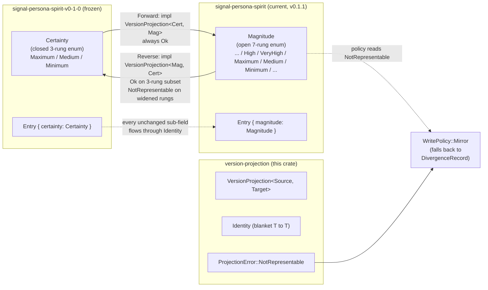

*Kind: Component sub-report · Topic: version-projection library · Date: 2026-05-22*

# 4 — version-projection (trait library)

## What it is

`version-projection` is a workspace-universal Rust library crate that
holds the **type-projection foundation** that makes daemon-to-daemon
version handover possible. It owns one bidirectional projection trait
(`VersionProjection<Source, Target>`), a marker for projected types
(`Projected`), a blanket `Identity` impl that covers the no-migration
diagonal, the typed error variants components branch on
(`ProjectionError`), the per-component / per-operation policy
vocabulary (`ComponentPolicy`, `WritePolicy`, `ReadPolicy`,
`SubscribePolicy`), the binary contract-version hash type
(`ContractVersion([u8; 32])`), and the compile-time `MigrationIndex`
for locating historical decoders. The crate is library-only — no
daemon, no socket, no redb, no Persona-specific content. It sits at
the same tier as `signal-sema` and ships peer to
`signal-version-handover`, which carries the wire shape that uses
these primitives.

## Current state

Landed in `/git/github.com/LiGoldragon/version-projection` at
`69bd2dd0` on main (per operator/158). Current present types,
confirmed by reading `src/lib.rs` and submodules:

- `src/projection.rs` — `VersionProjection<Source, Target>` trait;
  `Projected` marker carrying `CONTRACT_VERSION` constant and
  `component()`; `Identity` struct with blanket
  `VersionProjection<T, T>` impl for every `T: Projected`;
  `ProjectionError` with three variants (`NotRepresentable`,
  `TransformFailed`, `DirectionNotImplemented`).
- `src/policy.rs` — `OperationKind` (six variants — `AppendWrite`,
  `MutateWrite`, `RetractWrite`, `Match`, `Subscribe`, `Tap`);
  `WritePolicy` (`Mirror`, `DivergenceRecord`, `Reject`); `ReadPolicy`
  (`ActiveProjectsResponse`, `DualQueryMerge`, `ActiveOnly`);
  `SubscribePolicy` (`ResumeAgainstNext`, `TerminateAtHandover`) with
  `TerminateAtHandover` as the derived `Default` (intent 195);
  `PerOperationPolicy`, `OperationPolicy`, `ComponentPolicy` records.
- `src/version.rs` — `ComponentName` (transparent string wrapper);
  `ContractVersion([u8; 32])` with NOTA byte-literal codec impls;
  `ContractVersionError::InvalidLength`.
- `src/index.rs` — `MigrationIndex`, `MigrationIndexEntry`,
  `RecordKind`, `DecodeError`; `DecodeFunction` is a `fn` pointer so
  the index stays trait-object-free and compile-time addressable.

Dependencies: `nota-codec` (git, main), `rkyv 0.8`, `thiserror 2`. No
dependency on `signal-frame`, `signal-sema`, or any
`signal-persona-*` contract. `unsafe_code = "forbid"` at the crate
level.

Tests at `tests/projection.rs` are present (witness-only round-trip
tests). Nix `flake check` passed under operator/158.

`ARCHITECTURE.md` already exists at the repo root and is current as
of jj change `b5adda0c` ("ARCHITECTURE: rewrite without report refs,
add policy/migration index sections"). The boundary, constraints,
non-goals, and code map are all present.

## Diagram

### Types in the crate

```mermaid
classDiagram
    class VersionProjection~Source, Target~ {
        <<trait>>
        type Error
        +project(source: Source) Result~Target, Error~
    }

    class Projected {
        <<trait>>
        const CONTRACT_VERSION: ContractVersion
        +component() ComponentName
    }

    class Identity {
        <<blanket impl>>
        impl VersionProjection~T, T~ for Identity
        where T: Projected
        Error = Infallible
    }

    class ProjectionError {
        <<enum>>
        NotRepresentable { source_type, target_type }
        TransformFailed(String)
        DirectionNotImplemented
    }

    class ContractVersion {
        +bytes: [u8; 32]
        +new(bytes) ContractVersion
        +zero() ContractVersion
    }

    class ComponentName {
        +new(String) ComponentName
        +as_str() &str
    }

    class WritePolicy {
        <<enum>>
        Mirror
        DivergenceRecord
        Reject
    }

    class ReadPolicy {
        <<enum>>
        ActiveProjectsResponse
        DualQueryMerge
        ActiveOnly
    }

    class SubscribePolicy {
        <<enum, Default=TerminateAtHandover>>
        ResumeAgainstNext
        TerminateAtHandover
    }

    class OperationKind {
        <<enum>>
        AppendWrite
        MutateWrite
        RetractWrite
        Match
        Subscribe
        Tap
    }

    class PerOperationPolicy {
        +write_policy: WritePolicy
        +read_policy: ReadPolicy
        +subscribe_policy: SubscribePolicy
    }

    class OperationPolicy {
        +kind: OperationKind
        +policy: PerOperationPolicy
    }

    class ComponentPolicy {
        +component: ComponentName
        +operations: Vec~OperationPolicy~
    }

    class MigrationIndex {
        +entries: Vec~MigrationIndexEntry~
        +find(component, contract_version) Option~&Entry~
    }

    class MigrationIndexEntry {
        +component: ComponentName
        +contract_version: ContractVersion
        +decode: fn(bytes, kind) Result~String, DecodeError~
    }

    Identity ..|> VersionProjection : blanket impl T,T
    Projected <.. Identity : T must be Projected
    VersionProjection ..> ProjectionError : Error type
    Projected ..> ContractVersion : CONTRACT_VERSION
    Projected ..> ComponentName : component()
    PerOperationPolicy *-- WritePolicy
    PerOperationPolicy *-- ReadPolicy
    PerOperationPolicy *-- SubscribePolicy
    OperationPolicy *-- OperationKind
    OperationPolicy *-- PerOperationPolicy
    ComponentPolicy *-- ComponentName
    ComponentPolicy *-- OperationPolicy
    MigrationIndex *-- MigrationIndexEntry
    MigrationIndexEntry *-- ContractVersion
    MigrationIndexEntry *-- ComponentName
```

### Worked example — Spirit v0.1.0 Certainty to v0.1.1 Magnitude



The two hand-written impls (`SpiritEntryForward` and
`SpiritEntryReverse`, per designer/285 §8.1) live in the frozen
`signal-persona-spirit-v0-1-0` crate, not in `version-projection`
itself. Every Entry sub-field that didn't change between v0.1.0 and
v0.1.1 — date, time, body text, weight — pays zero per-type override
cost because the blanket `Identity` impl already covers it.

## How a component adopts it

A component daemon (persona-spirit today; persona-mind, persona-router
tomorrow) opts into version-projection by doing four things in its
own runtime crate:

1. **Declare `CONTRACT_VERSION`.** Every type in the component's
   signal-X contract crate carries the schema-version hash as a
   `Projected::CONTRACT_VERSION` constant. The hash is emitted by the
   schema generator per /279 §6b at build time; the component does
   not compute it by hand. All types in one contract crate share one
   hash.

2. **Hand-write per-type impls only for changed types.** When a new
   contract version ships, the frozen historical sibling crate
   (`signal-<component>-v<major>-<minor>-<patch>`) ships forward AND
   reverse `VersionProjection<Old, New>` impls for the small set of
   types whose shape changed. Every unchanged type is covered by the
   blanket `Identity` impl at zero per-type cost. This is the
   load-bearing economy: the cost of a contract version bump is
   proportional to the number of types that actually changed, not to
   the total surface of the contract.

3. **Declare per-operation policy.** The runtime crate (NOT the
   contract crate) ships `<component>/src/version_policy.rs` with one
   `ComponentPolicy` whose `operations` vector carries one
   `OperationPolicy` per public operation. The policy decides what to
   DO with each projection outcome — `WritePolicy::Mirror` (next
   does the write, main mirrors via reverse projection, fallback to
   `DivergenceRecord` on `NotRepresentable`); `WritePolicy::Reject`
   (structural mismatch — operation has no main contract equivalent);
   `ReadPolicy` (who answers read traffic during handover);
   `SubscribePolicy::TerminateAtHandover` (the workspace default per
   intent 195).

4. **Add the historical crate to `MigrationIndex`.** When a frozen
   sibling crate ships, persona-introspect's `MigrationIndex` gains
   one row pointing at its `decode_to_nota` helper. The compile-time
   index is `Vec`-backed and addressed by `(ComponentName,
   ContractVersion)`, so adding a new historical version is one
   literal entry and one Cargo dep.

The component's runtime actor tree imports `version-projection` types
directly. Projection happens at the wire boundary inside the
component daemon when mirroring writes through the upgrade socket
(see sub-report 3 — the `Mirror` operation in
`signal-version-handover` carries the raw bytes; the receiving
daemon's actor decodes, projects, and applies).

## Open design questions

Carried forward from designer/285 §9 and operator/158
"Open design pressure", confirmed open by intent 229's principle
that competing design ideas remain preserved:

- **Mirror payload shape — raw bytes vs typed enum.** Today the
  `Mirror` operation in `signal-version-handover` carries
  `payload_bytes: Vec<u8>` plus a `RecordKind` discriminant. The
  alternative is a typed enum holding the archived value directly.
  The trade-off is concrete: a typed enum would force
  `version-projection` (or its peer contract crate) to import every
  signal-X crate in the workspace and expand whenever a new
  component ships handover. The bytes shape keeps the contract crate
  pure. Lean from /285 §9 and ARCHITECTURE.md "Possible features":
  bytes, until a second component handover surfaces a concrete need.

- **Read semantics during handover.** The current landed
  implementation only covers write handover (Mirror) plus divergence
  recording. The `ReadPolicy` enum is present in the policy
  vocabulary, but the wire protocol and actor logic for serving
  reads during the overlap window are not yet built. Per
  operator/158 "Open design pressure" this is open in the landed
  code. The three `ReadPolicy` variants
  (`ActiveProjectsResponse`, `DualQueryMerge`, `ActiveOnly`) name
  what's possible; deciding which fits Spirit's `Observe(Records)` /
  `Observe(Topics)` semantics under load is the next concrete
  decision — likely settled at the second component cutover when
  read-heavy traffic patterns surface.

## How it fits

- **Sub-report 3 (signal-version-handover).** The peer contract crate
  carries the daemon-to-daemon wire shape that uses these
  primitives. `ContractVersion` rides inside `HandoverMarker`;
  `WritePolicy` reading drives whether main calls `Mirror` or
  `Divergence` after reverse projection; `ProjectionError::NotRepresentable`
  is the signal that determines which reply variant comes back.
- **Sub-report 5 (sema-stack — sema-engine + sema-upgrade).**
  Projections operate over data stored under sema-engine; sema-engine
  owns the `CommitSequence` high-water mark that bounds the
  copy-then-replay window during handover, and sema-upgrade's
  handover prototype is the executable witness exercising the
  projection trait end-to-end against real redb storage.
- **Sub-report 7 (owner-signal-version-handover, pending).**
  Administrative override doesn't use the projection transform
  (`ForceFlip` / `Rollback` / `Quarantine` bypass per-type
  projection), but it does consume the same `ContractVersion` and
  `ComponentName` vocabulary from this crate to address daemons. The
  owner contract is downstream of these primitives.

## ARCHITECTURE.md update

No drift detected. The repo's `ARCHITECTURE.md` (at jj change
`b5adda0c`) already covers the current type set, the
trait/Identity/policy split, the migration index, the boundary
diagram, the constraints, the non-goals, and the open features. The
`Possible features` section already preserves the same two open
questions surfaced in this sub-report (typed `Mirror` payload;
owner-side handover authority contract; per-operation policy
generation from contract macros). No update commit is required.
