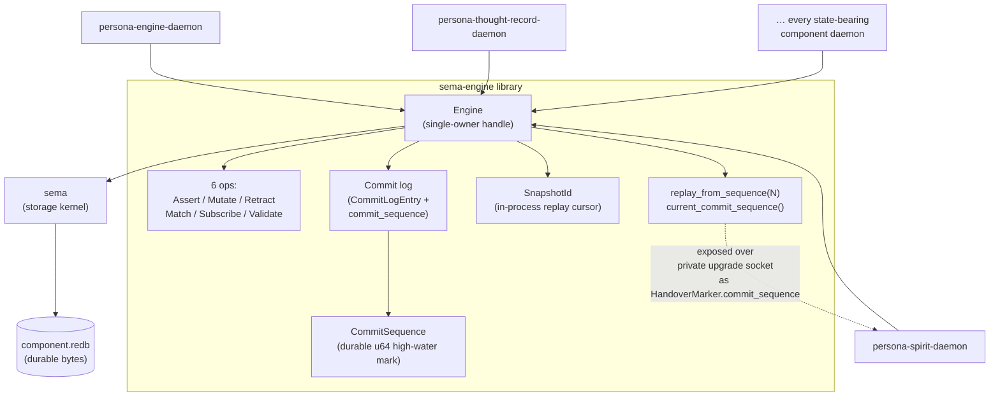

*Kind: Component sub-report · Topic: sema-engine + sema-upgrade · Date: 2026-05-22*

# 5 — sema-stack (sema-engine + sema-upgrade)

## What it is

`sema-engine` is the workspace's full typed database engine library, layered
over the `sema` storage kernel. It owns transaction boundaries, registered
typed record families, the six closed Sema operations
(`Assert` / `Mutate` / `Retract` / `Match` / `Subscribe` / `Validate`), the
commit log, snapshots, and — landed today — the durable `CommitSequence`
high-water mark. It is library-only: no daemon, no tokio, no Kameo, no
NOTA, no Persona signal contract. Every state-bearing component daemon
in the workspace consumes it as the storage substrate.

`sema-upgrade` is the workspace-universal schema-upgrade component, in
prototype shape today. It hosts: (1) the **handover prototype**
(`src/handover.rs`) — a testable state-machine witness for the
`signal-version-handover` protocol that production daemons can model
their wiring after; (2) the **migration module index** — one Rust
module per component-version step, each pairing a private `historical`
storage shape with a `current_shape` override and a From-chain
conversion; (3) a temporary CLI plus Nix-owned sandbox apps that drive
the first Spirit cutover end-to-end without touching live data. The
crate is library-shaped today; a future `sema-upgrade-daemon` may
emerge if upgrade orchestration separates from the persona engine's
own responsibilities.

## sema-engine: storage + CommitSequence

### Current state

Library at `/git/github.com/LiGoldragon/sema-engine`, commit `e0a7153c`
on main. Public surface (per `src/lib.rs`):

- `Engine` / `EngineOpen` — single-owner handle, opens storage through
  `Sema::open_with_schema`.
- `CommitSequence` (`src/sequence.rs`) — `pub struct CommitSequence(u64)`
  with `new`, `genesis`, `value`, `next`. Rkyv-archivable.
- `CommitReceipt`, `MutationReceipt`, `CommitLogEntry` — all carry
  `commit_sequence`.
- `Engine::current_commit_sequence()` — returns the per-database
  high-water mark.
- `Engine::replay_from_sequence(start)` — returns commit-log entries
  by `CommitSequence` (companion to the existing
  `commit_log_range(SnapshotId)` API).
- Existing surface: registered record families, single-operation writes,
  structural multi-operation `commit`, `Match`, `Subscribe`, `Validate`,
  typed `ReadPlan` nodes, subscription sinks (detached/inline).

### What advances CommitSequence

Every successful write transaction advances the per-database counter
by one. Failed commits do not advance it. The counter is durable per
database and survives `Engine::close` / `Engine::open`. A multi-
operation commit advances the counter once, not once per operation —
the bundle is the atomic unit.

### Replay API

The companion to the existing `SnapshotId`-cursor surface. `SnapshotId`
still drives in-process subscription replay; `CommitSequence` is the
boundary for **cross-daemon handover**. Both are durable, monotonic,
and per-database. A peer daemon reading the handover marker observes
the value the next successful commit will exceed; it copies state at
sequence N, then drains `replay_from_sequence(N + 1)` to catch up.

### How component daemons use it

Every state-bearing daemon (persona engine, persona-spirit,
persona-thought-record, …) owns its `Engine` from a single Kameo
actor, serialises all engine calls through that actor, and surfaces
`current_commit_sequence()` over its private upgrade socket as the
`HandoverMarker.commit_sequence` field. No daemon talks to `sema`
directly — `Engine::storage_kernel()` is the controlled escape for
unmigrated component-local tables.

## sema-upgrade: prototype + migration tooling

### Current state

Library at `/git/github.com/LiGoldragon/sema-upgrade`, commits
`060982d0` (handover prototype) and `677206d5` (repin to
sema-engine's CommitSequence) on main. Three pieces:

**Handover prototype (`src/handover.rs`).** State-machine witness of
`signal-version-handover`. Models a `PrototypeHandover` holding two
`PrototypeEndpoint` records (current + next), each with a
`HandoverMarker` (component, schema hash, commit_sequence,
write_counter, last record identifier, timestamp) and an
`EndpointState` (`Public` / `Handover` / `PrivateUpgradeOnly`).
Drives the six-operation protocol: `AskHandoverMarker`,
`ReadyToHandover` (rejects with `CommitSequenceAdvanced` if the
marker has moved), `HandoverCompleted`, `Mirror` (uses
`VersionProjection`; records typed `Divergence` on
`NotRepresentable`), `Divergence`, `RecoverFromFailure`.
`for_spirit_0_1_0_to_0_1_1()` constructs the canonical Spirit pair.
End-to-end proved in Nix tests; works against the real
`persona-spirit` v0.1.1 daemon's private upgrade socket per
operator/161.

**Migration module index.** `src/index.rs` exposes
`MigrationIndex` / `MigrationModule` / `DatabaseMigration`. The
first module is `src/migrations/persona_spirit/version_0_1_0_to_0_1_1.rs`
— maps Spirit's deployed `Certainty` (3-variant) into the new
`Magnitude` (7-variant) while preserving identifiers and
daemon-stamped date/time. Bin `sema-upgrade-temporary` routes
`(Attempt …)` NOTA requests through this index.

**Nix sandbox apps.** `spirit-migration-sandbox` (live smoke test on
a copy), `spirit-smart-handover-sandbox` (full two-daemon protocol
end-to-end, proves selector flip and write isolation per
operator/160 — 217 records migrated, all assertions green),
`spirit-migration-stage` (persistent staged cutover with backup).

### Production roadmap

Production daemon-to-daemon wiring lives in the **target component
daemons**, not in sema-upgrade — each component's daemon directly
consumes `signal-version-handover` over its own private upgrade
socket. The handover prototype is the contract witness those daemons
follow; it is not itself the production runtime. `persona-spirit`
v0.1.1 already owns its real upgrade socket (operator/161);
v0.1.0 still needs a retrofit so the protocol can run
daemon-to-daemon instead of through the temporary external runner.

Open: whether `sema-upgrade-daemon` ever ships as its own binary.
Today the persona engine is the upgrade orchestrator (intent 208,
209) — owner of the active-version selector and the `start-handover`
order. If orchestration responsibilities separate from per-engine
concerns later, sema-upgrade may grow a daemon; otherwise it stays
library-only as a home for migration modules and protocol witness.

### Two-submodule migration pattern

Per `skills/spirit-cli.md` §"Substrate migration discipline" and the
landed Spirit example:

- `mod historical` — **private reproduction** of the deployed old
  types, copied byte-for-byte from the old signal contract. Lives
  inside the migration module; never re-imported across modules.
  Carries every type the historical record depends on, including
  primitives that haven't actually changed shape (because rkyv
  archived layout depends on the closure of dependent types).
- `mod current_shape` — overrides **only the fields that changed**,
  re-using the current public contract types for everything else.
  `From<historical::X> for current_shape::X` composes a conversion
  chain that the migration runner invokes per record.

This pattern keeps each migration module self-contained: nothing
breaks the migration when the current contract evolves further, and
historical layouts stay frozen alongside the records they decode.
Every component-version step gets its own module under
`src/migrations/<component>/version_X_Y_Z_to_X_Y_W.rs`.

## Diagram 1 — sema-engine as substrate for every component daemon



`sema-engine` is library-only. The arrow shape is always
"component daemon owns Engine" — never daemon-to-daemon through
sema-engine. CommitSequence is what makes cross-daemon handover
possible: it is the durable marker the next-version daemon reads
to know where to start its replay drain.

## Diagram 2 — sema-upgrade roles

```mermaid
flowchart TB
    subgraph protocols[Contracts consumed]
        SVH["signal-version-handover<br/>(working protocol contract)"]
        VP["version-projection<br/>(projection trait + policy types)"]
        SSU["signal-sema-upgrade<br/>(ordinary upgrade requests)"]
        SE["signal-executor<br/>(component-local commands)"]
    end

    subgraph crate[sema-upgrade crate]
        HANDOVER["src/handover.rs<br/>PrototypeHandover state machine<br/>(witness; not production wiring)"]
        INDEX["src/index.rs<br/>MigrationIndex /<br/>MigrationModule"]

        subgraph migrations[src/migrations/]
            SPIRIT_MOD["persona_spirit/<br/>version_0_1_0_to_0_1_1.rs"]
            FUTURE_MOD["future:<br/>persona_thought_record/<br/>version_X_to_Y.rs"]
            FUTURE_MOD_2["… one module per<br/>component-version step"]
        end

        subgraph submods[Per-module two-submodule pattern]
            HIST["mod historical<br/>(private reproduction of<br/>deployed old types)"]
            CUR["mod current_shape<br/>(override only changed fields;<br/>From chain)"]
        end

        BIN_T["bin/sema-upgrade-temporary<br/>(first-cutover migration CLI)"]
        BIN_H["bin/sema-upgrade-handover-temporary<br/>(external protocol runner;<br/>retires when v0.1.0 has socket)"]
    end

    subgraph sandboxes[Nix sandbox apps]
        SB1[".#spirit-migration-sandbox"]
        SB2[".#spirit-smart-handover-sandbox"]
        SB3[".#spirit-migration-stage"]
    end

    subgraph future[Production daemon-to-daemon (FUTURE)]
        CUR_D["persona-spirit v0.1.0<br/>(needs retrofit)"]
        NEXT_D["persona-spirit v0.1.1<br/>(socket already owned per /161)"]
    end

    HANDOVER --> SVH
    HANDOVER --> VP
    INDEX --> migrations
    SPIRIT_MOD --> HIST
    SPIRIT_MOD --> CUR
    CUR --> HIST
    INDEX --> SSU
    INDEX --> SE

    BIN_T --> INDEX
    BIN_H --> HANDOVER

    SB1 --> BIN_T
    SB2 --> BIN_H
    SB2 --> BIN_T
    SB3 --> BIN_T

    HANDOVER -. "witness; production<br/>daemons model wiring<br/>after this" .-> CUR_D
    HANDOVER -. "" .-> NEXT_D
```

Two roles surface clearly: the **protocol witness** (handover.rs is
where the wire protocol gets exercised before production daemon
sockets ship) and the **migration module home** (one module per
component-version step, two submodules per module).

## Open design questions

Per intent record 229 (closing duplicate beads preserves information;
competing design ideas kept). Three open questions on this slice:

### (a) Asymmetric Spirit release — deliberate?

`persona-spirit` and `signal-persona-spirit` are both at `v0.1.1`;
`owner-signal-persona-spirit` stays at `v0.1.0`. Third-designer/18
flags this as worth confirming. Two readings:

1. **Deliberate** — only the working contract changed shape
   (Certainty → Magnitude); the owner contract was untouched, so
   no version bump is needed. Triad members version independently
   when their shapes evolve independently.
2. **Drift** — the owner contract should track the daemon version
   because operator tooling, deploy nix, and the handover protocol
   key off "the component is at v0.1.1." Asymmetric versions make
   "what does v0.1.1 mean" ambiguous downstream.

Designer lean: (1) is the principled answer, but the workspace
needs explicit confirmation before treating it as the workspace
discipline. If (1), this should be a noted convention in
`skills/component-triad.md`. If (2), `owner-signal-persona-spirit`
needs a no-op v0.1.1 tag to align.

### (b) sema-upgrade self-upgrade bootstrap

Third-designer/19 Q5: when sema-upgrade itself changes schema (its
own upgrade history database, the module index format, …), does
it self-apply through its own migration mechanism, or is the first
upgrade hand-written outside the framework?

1. **Recursive dogfood** — sema-upgrade upgrades itself the same
   way every other component upgrades. The historical bytes are
   decoded by a `historical` submodule, projected into
   `current_shape`, From-chain composes the conversion. Maximum
   coherence; maximum bootstrap complexity (the running
   sema-upgrade has to read its own old bytes through a
   submodule the new build defines).
2. **Hand-written bottom-of-stack** — the first sema-upgrade
   upgrade (and any breaking change to the framework itself) is
   a hand-written one-off, gated on a workspace-level operator
   step. Intent 200 noted sema-upgrade dogfoods at the
   mechanism-enabled tag; this question asks "what enables the
   mechanism in the first place."

Designer lean (per third-designer/18 §"Architecture decisions"):
hand-written until contracts stabilise; recursive dogfood is the
goal-state once the framework is stable enough to trust upgrading
itself.

### (c) Where the divergence sink lives

Mirror payload application (operator/158 §"Open design pressure"):
when reverse projection records `NotRepresentable`, the prototype
holds divergences in an in-memory `Vec<DivergencePayload>`. Long-
term, divergences should land in `persona-introspect` for typed
auditing — but persona-introspect isn't deployed yet. Open: should
sema-upgrade's prototype persist divergences into a local file
sink in the interim, or wait until persona-introspect ships?
Designer lean: in-memory for the prototype; the first production
cutover (Spirit) is small enough that divergence loss on crash is
acceptable for one run; persona-introspect picks up the discipline
once it ships.

## How it fits

- **Sub-report 3 (signal-version-handover protocol)** — the wire
  contract. `sema-engine.CommitSequence` is exposed as
  `HandoverMarker.commit_sequence`; the prototype handover state
  machine in `sema-upgrade/src/handover.rs` is the protocol's
  testable witness.
- **Sub-report 4 (version-projection)** — projection operates over
  data **stored under sema-engine**. The migration modules in
  `sema-upgrade/src/migrations/` invoke `VersionProjection` impls
  to walk historical records into current shape, then `Assert`
  them into a fresh sema-engine database at the target schema
  version.
- **Sub-report 6 (persona-spirit cutover)** — the first production
  consumer of sema-upgrade migration. The
  `persona_spirit/version_0_1_0_to_0_1_1.rs` module is already
  landed; the live cutover waits on retrofit, persona engine
  orchestration, and the live-copy delta replay mechanism.
- **Sub-report 7 (owner-signal-version-handover wire spec)** — the
  administrative authority on top of the stack. The owner contract
  carries `ForceFlip` / `Rollback` / `Quarantine` verbs that
  bypass or override the handover state machine that
  `sema-upgrade/src/handover.rs` witnesses.

## ARCHITECTURE.md update

`sema-engine/ARCHITECTURE.md` — already reflects CommitSequence
(constraints lines 72–82; dedicated `## CommitSequence` section
lines 170–190). No update needed in this slice.

`sema-upgrade/ARCHITECTURE.md` — already reflects the handover
prototype (lines 64–82), the two-submodule migration pattern is
documented inline at the `persona-spirit` module description
(lines 40–62), and the future-`sema-upgrade-daemon` open question
is in `## Possible features` (lines 154–162). The current text
covers everything this sub-report carries. Optional clarifying
edit: the two-submodule pattern (`mod historical` private
reproduction + `mod current_shape` override) is described
prose-style without naming the pattern; making it a named
discipline ("Two-submodule migration pattern") would make it
easier to invoke from new migration modules. Treating as
lower-priority — leaving for a later sweep.

**No commits required for ARCHITECTURE.md in this slice.**
