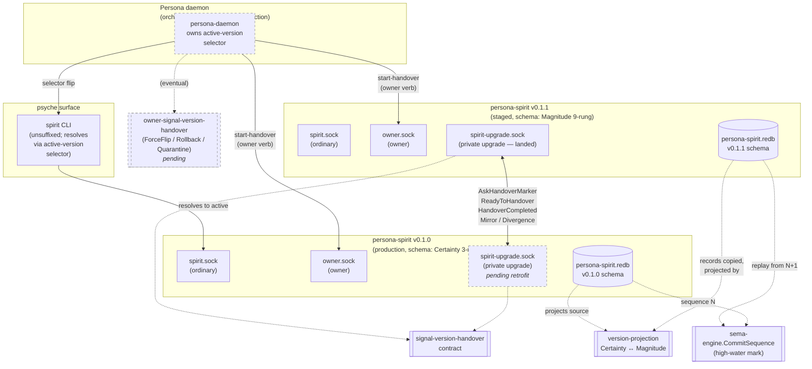
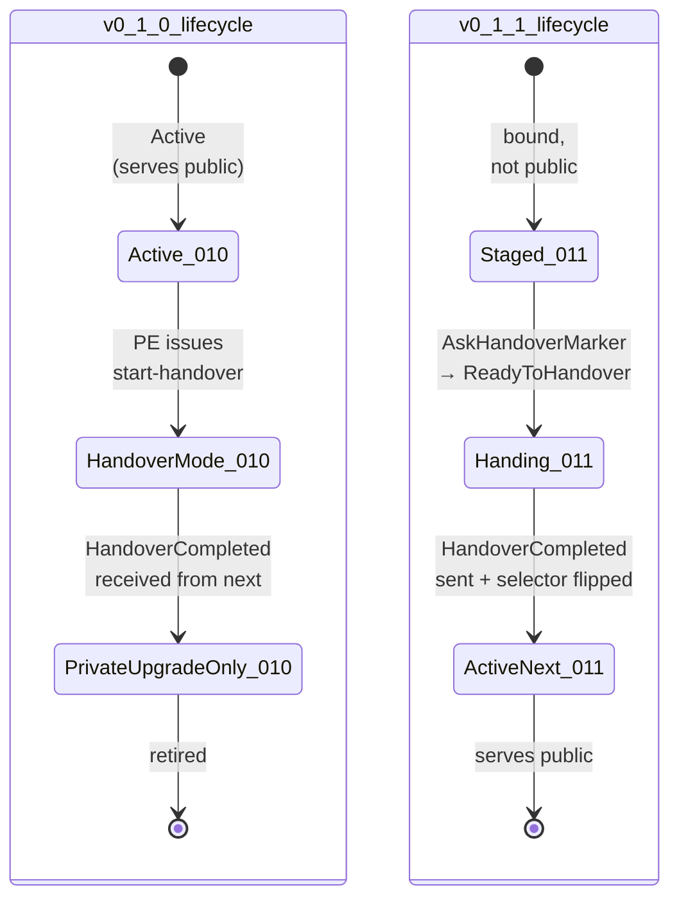

*Kind: Component sub-report · Topic: persona-spirit as cutover target · Date: 2026-05-22*

# 6 — persona-spirit cutover

## What it is

`persona-spirit` is the workspace's first production user of the
smart-handover stack — the proving ground. It is a deployed,
psyche-facing daemon owning a live database of intent records,
already running in a dual-version configuration (`v0.1.0`
public, `v0.1.1` staged-but-disabled per intent 201). Its
`v0.1.0 → v0.1.1` schema delta — `Certainty` (closed 3-rung enum)
widening to `Magnitude` (open 9-rung-plus-`Unknown` lattice) — is
the smallest possible exercise of the per-type version-projection
mechanism, which makes it the lowest-risk, highest-information
substrate for the entire smart-handover stack to land against.

Every other piece of the engine — Persona daemon (sub-report 1),
signal-version-handover (3), version-projection (4), sema-engine
CommitSequence (5), owner-signal-version-handover (7) — converges
here. If the stack works for Spirit, it works for everything else
(mind, router, orchestrate) by parametric substitution. If
something in the stack is wrong, Spirit cutover is where it shows
up first, in production, against real intent records.

## Current state

**Daemon code — landed and proven.** As of
`persona-spirit@40c0c93e` (operator/161), the daemon binds three
typed Unix sockets: ordinary (`signal-persona-spirit`), owner
(`owner-signal-persona-spirit`), and **private upgrade**
(`signal-version-handover`). The upgrade socket today serves:

- `AskHandoverMarker` — reads the store's current sema-engine
  commit sequence and last record identifier;
- `ReadyToHandover` — accepts only when the source marker still
  matches the local store; rejects with `CommitSequenceAdvanced`
  on drift;
- `HandoverCompleted` — finalises the marker and *removes* the
  ordinary and owner socket paths from the filesystem.

The daemon code is wired through the actor tree:
`SpiritRoot::submit_upgrade_request` → `RecordStore` →
`SpiritStore::handover_marker`. The dependency chain is real;
the upgrade socket is not a mock. Commit `f1e2223b` (one above
`40c0c93e` on `main`) added the explicit
`Active → HandoverMode → PrivateUpgradeOnly` state-machine
diagram to `ARCHITECTURE.md`, so the in-repo architecture file
already reflects every change required for this slice (no
ARCHITECTURE.md update needed in this sub-report — see the
final section).

**Sandbox proof — end-to-end smart-handover passed twice.**
`spirit-smart-handover-sandbox` in `sema-upgrade` (operator/160,
re-verified in operator/161) ran the full smart-handover
sequence against a real copy of the live production database:

- 217 records migrated in operator/160's run (218 in /161's
  verification);
- legacy `High` rejected on `v0.1.0`'s closed `Certainty`;
- `Maximum` accepted on `v0.1.0` before snapshot;
- migrated record observed by `v0.1.1`;
- next-only `High` after handover observed only by `v0.1.1`;
- `v0.1.0`'s database unchanged by the next-only write.

The sandbox still drives the protocol through the temporary
external runner `sema-upgrade-handover-temporary` rather than via
direct daemon-to-daemon socket exchange — that is the next
implementation slice, now unblocked by `40c0c93e`.

**Deployment state — dual daemon, asymmetric authority.**

- `persona-spirit-daemon-v0.1.0.service` — active, public, the
  unsuffixed `spirit` command resolves here;
- `persona-spirit-daemon-v0.1.1.service` — active, staged, holds
  a migrated copy of `v0.1.0`'s database; not yet public per
  intent 201;
- `signal-persona-spirit` at `v0.1.1` (`Magnitude` schema);
- `persona-spirit` daemon source at `v0.1.1`;
- `owner-signal-persona-spirit` still at `v0.1.0` — this is
  *deliberate*, not an oversight (see *Open design questions*).

**What's pending for the production cutover (intent 228 — keep
going until no clear work remains):**

1. **Retrofit `v0.1.0`** — backport `40c0c93e`'s upgrade socket
   and handover-protocol code onto the `v0.1.0` tag without
   changing the database schema. Re-tag, redeploy as production.
   Intent 206 confirmed this is the path. Until it lands,
   `v0.1.0` cannot answer `AskHandoverMarker` because it doesn't
   bind the upgrade socket.
2. **Persona daemon in production** — engine-management binary
   that owns the active-version selector and drives the handover
   over the target's owner socket. Bead `primary-wvdl` carries
   this; intent 209 fixes Persona-before-Spirit-cutover sequencing.
3. **`owner-signal-version-handover` contract** — administrative
   verbs (`ForceFlip` / `Rollback` / `Quarantine`) for when the
   automatic protocol can't proceed. Intent 214; sub-report 7.
4. **Mirror payload application on the upgrade socket** — the
   daemon currently serves marker/readiness/completion but does
   not yet apply mirrored writes back into `v0.1.0` from `v0.1.1`.
5. **Replace `sema-upgrade-handover-temporary`** — once the
   retrofit lands, the protocol runs daemon-to-daemon over real
   upgrade sockets; the external runner becomes a sandbox-only
   construct or is retired entirely.

Bead `primary-x3ci` tracks the cutover; it cannot land until
`primary-wvdl` (Persona engine) lands. Intent 209 made the
sequencing explicit.

## Diagram

### Spirit-specific cutover topology

### End state after handover completes

## What gets exercised

Spirit cutover is the first end-to-end exercise of every piece
of the stack:

| Piece | What Spirit's cutover proves |
|---|---|
| **`VersionProjection<Certainty, Magnitude>` trait** | Forward (every `Certainty` rung maps cleanly to a `Magnitude` rung) AND reverse (`Magnitude::Maximum/Medium/Minimum → Certainty` succeeds; widened rungs return `NotRepresentable`). The bidirectional, single-trait shape from /285 §1.2 lands. |
| **`signal-version-handover` contract** | All six operations carried over a real socket: marker discovery, readiness, completion, mirror, divergence, recovery. The wire-shape choice (rkyv length-prefixed frames, separate contract — not an envelope marker on ordinary signal) is validated by `persona_spirit_daemon_serves_version_handover_frames_through_upgrade_socket`. |
| **`sema-engine.CommitSequence`** | The handover marker. `AskHandoverMarker` returns `(commit_sequence, last_record_id)`; `ReadyToHandover` is rejected with `CommitSequenceAdvanced` if the source's sequence moved between the read and the readiness. Replay-from-N+1 closes the consistency gap. |
| **Persona daemon orchestrator** | Receives upgrade orders on its OWN owner socket (intent 210), addresses the target's owner socket to start the handover, owns the active-version selector flip (intent 209 — replaces the prior CriomOS-home symlink mechanism). Spirit is the first target Persona drives. |
| **Selector flip mechanism** | The flip is atomic from the client's perspective; the unsuffixed `spirit` command resolves to the new daemon socket after the flip lands. Whether the selector lives as a Persona-owned in-memory route, a `current` symlink under `~/.local/state/persona-spirit/`, or a routing socket is a Persona-design choice (sub-report 1) — Spirit is the test substrate. |
| **`owner-signal-version-handover` (once it exists)** | Authority verbs for when the automatic protocol stalls: `ForceFlip` overrides a stuck `ReadyRejected` loop, `Rollback` reverts to the previous active version, `Quarantine` marks the next daemon as not-eligible-for-upgrade. Spirit will be the first daemon these are aimed at. |
| **Dual-socket-retraction discipline** | `HandoverCompleted` removes the *ordinary and owner* socket paths from the filesystem (witnessed by `persona_spirit_daemon_serves_version_handover_frames_through_upgrade_socket`). After flip, the only writes the old daemon can accept come over the upgrade socket. This is the "private-upgrade-writable only" state from intent 193. |
| **Live database migration with provable replay** | 217+ real production records carried through projection without loss. Future cutovers can copy a much larger database (mind's working memory; orchestrate's lane registry) and use the same machinery. |

The narrowness of the schema delta (one enum widening) is a
feature, not a limitation: it gives the projection trait the
exact case-distinction tension it needs (one direction always
succeeds, the other can return `NotRepresentable`) without
forcing the test substrate to also exercise multi-table
restructuring, record-shape changes, or cross-record references.
Mind cutover later will exercise those; Spirit's job is to prove
the *protocol* and the *trait shape*, not the full migration
combinatorics.

## Open design questions

Per intent 229 — competing ideas preserved so agents in those
fields can essay them.

### (a) Asymmetric Spirit release — `owner-signal-persona-spirit` still at `v0.1.0`

**Question.** `signal-persona-spirit` and `persona-spirit` are at
`v0.1.1`; `owner-signal-persona-spirit` stayed at `v0.1.0`. Is
this deliberate, or did the owner contract miss its bump?

**Reading after inspecting the source.** Deliberate. The
`Certainty → Magnitude` widening lives entirely on the ordinary
working contract (`signal_persona_spirit::Entry.certainty`,
`signal_persona_spirit::RecordSummary.certainty`). The owner
contract has zero references to `Magnitude` or `Certainty`
(verified by grep over `owner-signal-persona-spirit/src/`); its
operations (`Register`, `Retire`, `Started`, `DrainedAndStopped`,
`ReloadBootstrapPolicy`) are schema-independent of intent record
content. Bumping the owner contract just to track the ordinary
contract's version would be **ancestry-carrying versioning** —
the owner contract's identity would carry working-contract
history without owning any of it.

**The principle this surfaces.** Triad-leg versions advance
**independently** based on each leg's schema delta. The
component daemon's own version (`persona-spirit` itself)
advances when *any* leg's contract changes OR when the daemon's
implementation crosses a contract boundary; that's why
`persona-spirit` is at `v0.1.1` even though only one of its two
contracts changed. This needs to be a workspace-level principle,
not an undocumented Spirit-specific exception.

**Competing alternative.** Lockstep version-bump all triad legs
on any change in any leg. Pro: simpler narrative; con: forces
recompilation and hash invalidation on legs that genuinely
didn't change, defeats `ContractVersion` as a precise
discriminator in the `MigrationIndex`.

### (b) Read semantics during HandoverMode

**Question.** When `v0.1.0` is in HandoverMode (ordinary socket
still serves reads, public writes paused), and `v0.1.1` is still
copying, where do incoming reads go?

**Options.**

- **Active-only.** Reads to the active (current) daemon, full
  stop. Simplest; reads see whatever state the source has been
  copied to including the in-progress range. **Risk:** a read
  immediately followed by the selector flip can see N and then
  N-ε if next missed a delta.
- **Both, merge.** Reads fan out to both daemons; client-side
  merge reconciles. Reduces window where readers see stale
  data; costs latency and demands `Observe`-shape
  cross-projection.
- **Active-projects-response.** Active answers; if the caller
  expects the *other* shape (e.g. a `v0.1.1`-aware client
  reading during the overlap), active projects via
  `version-projection` before reply. Closest to /285 §2 spec
  but not yet implemented.

This is genuinely open. The spec doc (/285 §9 last-but-one
bullet) names it as an open question; the prototype (sub-report
4) only models writes. Spirit cutover will need a concrete
choice before the live production flip.

### (c) `Mirror` payload application on the upgrade socket

**Question.** The daemon's upgrade socket today serves marker /
readiness / completion. It does *not* yet apply mirrored writes
flowing back from `v0.1.1` to `v0.1.0` during the overlap window
(when old-shape readers still want to see new writes through the
projection). The sandbox runs the protocol through the temporary
external runner, which calls `sema-upgrade::handover`'s prototype
mirror-application code rather than the daemon's.

Implementing mirror application requires (i) decoding the
`MirrorPayload`'s `Vec<u8>` against the producing-version's signal
crate, (ii) calling the reverse `VersionProjection`, (iii) writing
to the local store with a flagged "from-mirror" provenance so the
write isn't itself mirrored back into a loop. The shape is clear;
the work is real.

### (d) Active-version selector mechanism

**Question.** When Persona "flips the selector," what physically
flips? Three options, all viable, none chosen yet at the workspace
level:

- **Symlink under `~/.local/state/persona-spirit/`** retargeting
  `current -> v0.1.1`; user-profile bare `spirit -> spirit-v0.1.1`
  retargets in lockstep. Home-Manager declaratively maintained.
- **Persona-owned in-memory route** — `spirit` CLI consults
  Persona's CLI-routing socket on every invocation. Adds a hop;
  removes the symlink-staleness window.
- **Routing socket** — `spirit.sock` becomes a Persona-owned
  proxy that forwards to whichever versioned daemon socket is
  active. One-hop latency on every call; trivial flip semantics.

Spirit cutover will pick one by necessity; the choice has
workspace-wide consequences for every later component cutover.

### (e) Sandbox runner retirement timing

**Question.** When can `sema-upgrade-handover-temporary` be
retired? After `v0.1.0` is retrofitted with the upgrade socket
and the sandbox is re-pointed at the real daemon-to-daemon path,
the temporary runner is functionally obsolete. But it remains
useful as a deterministic, hermetic protocol witness — a stand-in
when the live deployment is unreachable. **Lean:** keep it as a
test-only runner in `sema-upgrade`, retire only its production
sandbox usage; documents the protocol independently of any daemon
binary.

## How it fits

Spirit cutover is the convergence point. Each upstream piece
contributes one ingredient:

- **Sub-report 1 (Persona daemon)** — drives the cutover.
  Persona-daemon receives the upgrade order on its owner socket
  (intent 210), starts the next-version daemon if not already
  running, addresses the target's owner socket to begin
  `start-handover`, owns the selector flip after
  `HandoverCompleted`. Persona is the engine; Spirit is the
  load.
- **Sub-report 2 (signal-persona / EngineManagement)** —
  the protocol *between* Persona and the target component. Spirit
  is the first target the EngineManagement verbs are aimed at.
- **Sub-report 3 (signal-version-handover)** — the wire used
  over `spirit-upgrade.sock`. The frame codec is already live
  in `persona-spirit-daemon@40c0c93e`.
- **Sub-report 4 (version-projection)** — supplies the
  `Certainty → Magnitude` and `Magnitude → Certainty` projection
  impls. `NotRepresentable` returned on widened-rung reverse
  projection triggers the `Divergence` arm of the protocol.
- **Sub-report 5 (sema-engine / sema-upgrade)** —
  `CommitSequence` is the marker `AskHandoverMarker` returns;
  the sema-upgrade bulk-copy plan is the body of "copy from
  N, project, replay from N+1" that `v0.1.1` performs.
- **Sub-report 7 (owner-signal-version-handover)** — the
  authority verbs Persona will use against Spirit's owner socket
  when the protocol can't proceed automatically (`ForceFlip` if
  `ReadyRejected` loops; `Rollback` if `v0.1.1` post-flip
  misbehaves; `Quarantine` if `v0.1.1` should not even be
  upgraded to). Spirit cutover is the first arena these verbs
  prove themselves in.

The remaining sub-reports (0 frame, 8 workspace skills, 9
overview) frame the session rather than contribute mechanism.

## ARCHITECTURE.md update

**No update required this slice.** `persona-spirit`'s
`ARCHITECTURE.md` at commit `f1e2223b` on `main` already
documents:

- the three-socket layout (ordinary / owner / private upgrade);
- the upgrade socket's three operations and their semantics
  (`AskHandoverMarker`, `ReadyToHandover`, `HandoverCompleted`);
- the `Active → HandoverMode → PrivateUpgradeOnly` state machine
  with explicit semantics for each state;
- the constraints witnessing the upgrade socket's behaviour
  through `persona_spirit_daemon_serves_version_handover_frames_through_upgrade_socket`
  and the related shutdown / completion socket-path-removal
  tests;
- the code map entries for the daemon's upgrade-socket binding,
  the `signal-version-handover` frame codec, and the store
  plane's `handover_marker` read path;
- the status entries acknowledging private upgrade socket as
  implemented, mirrored write replay as not-yet-implemented.

What `ARCHITECTURE.md` does *not* yet cover — and need not until
the work lands — is mirror-payload application, the Persona
daemon's orchestration role over Spirit's owner socket, and the
`owner-signal-version-handover` arrival. These belong in future
slices' ARCHITECTURE.md edits.

The repo working copy is clean; no jj edit was made by this
sub-agent.
