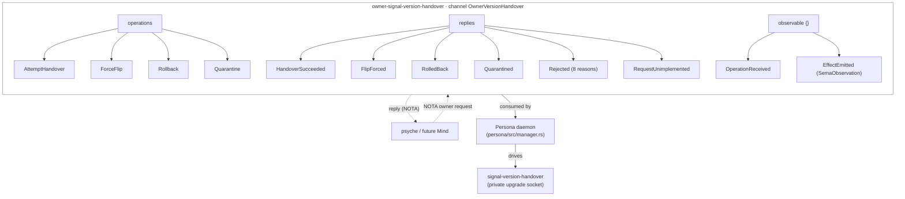

*Kind: Component sub-report (audit of landed contract) · Topic: owner-signal-version-handover · Date: 2026-05-22*

# 7 — owner-signal-version-handover

## What it is

The owner-only administrative-authority signal contract for component
version handover. Persona consumes this contract on **its own owner
socket** (per intent record 210 — upgrade orders arrive at the
target's owner socket, but the target IS Persona for the
upgrade-orchestration relationship); accepted authority orders are
translated by Persona into runtime behaviour against the component
daemon's `signal-version-handover` private upgrade socket.

Boundary discipline (per the repo's ARCHITECTURE.md):

- `signal-version-handover` — ordinary private daemon-to-daemon
  protocol on the upgrade socket
- `owner-signal-version-handover` — administrative authority surface
  on Persona's owner socket
- `version-projection` — cross-version type-projection primitives

The contract is pure signal: no daemon, no store, no socket policy,
no runtime safety logic. Persona is the one consumer; the contract
just supplies typed owner vocabulary + typed replies.

## Current state — the contract has already LANDED

Repo: `/git/github.com/LiGoldragon/owner-signal-version-handover`
Latest jj change: `ttkkzkpqpymm` ("owner-signal-version-handover:
add normal handover attempt"). Crate package version `0.1.0` on
`main` per `Cargo.toml`.

This sub-report was originally drafted as a from-scratch wire spec
(bead `primary-7kge`). On verification the crate was already present
in the workspace and consumed by Persona — per sub-agent #2's audit
of `persona/src/manager.rs` `PrepareUpgrade` (line 393) and
`CompleteUpgrade` (line 416), and the persona-side message routing
landed in operator commits `d89c3ac5` ("consume owner version
handover authority") and `22089f47` ("drive version handover
sockets") per sub-agent #1's audit. So `primary-7kge` is **no
longer "create the contract"; it is now "review, refine, harden
the contract that landed"**.

## Diagram — the contract's surface



## Operations and replies

```mermaid
sequenceDiagram
    participant P as Psyche / Mind
    participant Persona as Persona daemon
    participant Cur as Current component daemon
    participant Nxt as Next component daemon

    Note over P,Persona: AttemptHandover — the normal path

    P->>Persona: AttemptHandover { component, current, next }
    Persona->>Cur: drive private handover protocol
    Cur->>Nxt: AskHandoverMarker / ReadyToHandover / HandoverCompleted
    Cur-->>Persona: protocol terminal state
    Persona->>Persona: flip active-version selector
    Persona-->>P: HandoverSucceeded { component, active_version, commit_sequence }

    Note over P,Persona: ForceFlip — owner override

    P->>Persona: ForceFlip { component, current, target, reason: OperatorOverride/MarkerMismatchAccepted/EmergencyRecovery }
    Persona->>Persona: flip selector unconditionally; do NOT forge marker-backed handover fact
    Persona-->>P: FlipForced { component, active_version }

    Note over P,Persona: Rollback — restore previous after recent handover

    P->>Persona: Rollback { component, active, restore, reason }
    Persona->>Persona: flip selector back; preserve audit trail
    Persona-->>P: RolledBack { component, active_version }

    Note over P,Persona: Quarantine — mark version ineligible

    P->>Persona: Quarantine { component, version, reason }
    Persona->>Persona: write VersionQuarantined into event log
    Persona-->>P: Quarantined { component, version }
```

## Operation shapes (as landed)

| Operation         | Body fields                                                                | Reply on success                            |
|-------------------|----------------------------------------------------------------------------|---------------------------------------------|
| `AttemptHandover` | `component: ComponentName · current: VersionEndpoint · next: VersionEndpoint` | `HandoverSucceeded { component, active_version, commit_sequence }` |
| `ForceFlip`       | `component · current_version · target_version · reason: ForceReason`       | `FlipForced { component, active_version }`  |
| `Rollback`        | `component · active_version · restore_version · reason: RollbackReason`    | `RolledBack { component, active_version }`  |
| `Quarantine`      | `component · version · reason: QuarantineReason`                           | `Quarantined { component, version }`        |

Reason enums (closed sets, per `skills/language-design.md`
closed-enums discipline):

- `ForceReason` ∈ { `OperatorOverride`, `MarkerMismatchAccepted`, `EmergencyRecovery` }
- `RollbackReason` ∈ { `PostCutoverFailure`, `OperatorOverride`, `RecoveryDrill` }
- `QuarantineReason` ∈ { `FailedUpgrade`, `SuspectState`, `OperatorHold` }
- `RejectionReason` ∈ { `UnknownComponent`, `UnknownVersion`, `NotAllowed`, `AlreadyQuarantined`, `NotQuarantined`, `VersionQuarantined`, `HandoverRejected`, `UpgradeSocketUnavailable` }
- `UnimplementedReason` ∈ { `NotBuiltYet`, `IntegrationNotLanded` }

Value records:

- `Version { label: VersionLabel, contract_version: ContractVersion }` — the addressing pair (human label + Blake3 schema hash from `version-projection`)
- `VersionEndpoint { version, owner_socket_path, upgrade_socket_path }` — current and next endpoints in `AttemptHandover`
- `Rejected { component, reason: RejectionReason }` — typed rejection per `skills/language-design.md` "typed rejection over bool flags"

## Observable block — `EffectEmitted` carries `SemaObservation`

The observable block emits `OperationReceived { operation: OperationKind }`
and `EffectEmitted { observation: SemaObservation }`. The `EffectEmitted`
choice is significant: third-designer/19 Q3 and second-operator/165 Q1
have been tracking the open question *"is `EffectEmitted` payload typed
`Effect` (component-local) or universal `SemaObservation`?"* across
~7 pending observable blocks (mind/router/message/introspect/system/
terminal/harness). **This contract has chosen `SemaObservation`.**

Whether that choice generalises is still open — owner-signal-version-handover
is administrative authority on top of an existing daemon's runtime; the
effects emitted (selector flip, quarantine record, rollback) are
sema-level state changes natural to express as `SemaObservation`. But
for component daemons emitting domain-specific effects (mind:
`BeadCreated`, router: `GrantIssued`), `SemaObservation` may strip
information a typed `Effect` would preserve.

**Recommendation for the open question:** record this contract's
choice via Spirit as a Decision (Medium certainty) — `EffectEmitted`
defaults to `SemaObservation` for cross-cutting / authority-tier
contracts; component-local domain-effects contracts may choose typed
`Effect` instead. Bring forward the recommendation when one of the
seven pending observable blocks comes up.

## Open design questions (preserved per intent 229)

**Q1 — Socket paths in `AttemptHandover` body.** Per the
contract's ARCHITECTURE.md: *"the request carries the versioned
ordinary owner and private upgrade socket paths because the contract
is still in the prototype phase before Persona has a full
component-version catalog."* This is a load-bearing question for
when Persona's catalog matures: should `AttemptHandover` keep
carrying explicit socket paths, OR should it shrink to
`component + current_version + target_version` once Persona owns
the catalog and can derive paths? **Designer lean:** shrink once the
catalog lands; the explicit shape is a stepping stone.

**Q2 — `Tap`/`Untap` observability.** Currently deferred per the
ARCH. Whether the observable block ever fans out to `persona-introspect`
or stays direct-only is open. **Designer lean:** wait until
persona-introspect lands a fanout shape; defer.

**Q3 — Asymmetry with `signal-version-handover`.** The ordinary
contract has six operations (`AskHandoverMarker`, `ReadyToHandover`,
`HandoverCompleted`, `Mirror`, `Divergence`, `RecoverFromFailure`);
the owner contract has four (`AttemptHandover`, `ForceFlip`, `Rollback`,
`Quarantine`). Asymmetry is correct (ordinary is a state machine
between two daemons; owner is administrative commands), but worth
naming so future readers don't expect parallel structure.

**Q4 — `EffectEmitted` generalisation.** Per the previous section.
Open whether this contract's `SemaObservation` choice generalises to
all observable blocks or stays as the cross-cutting / authority
default.

**Q5 — `HandoverSucceeded.commit_sequence`.** Carried as `u64` directly
(not a newtype). The corresponding type in `sema-engine` is
`CommitSequence`. Consider wrapping in a transparent newtype
(`HandoverCommitSequence(u64)` or borrowing `sema_engine::CommitSequence`)
for type-level traceability. Cosmetic, not load-bearing.

**Q6 — `UnimplementedReason::IntegrationNotLanded`.** This variant
implies a transitional state — once Persona's integration with
`signal-version-handover` is complete, this variant should be
unreachable. Designer lean: keep until Spirit cutover proves the
end-to-end path; then consider removing.

## How it fits

- Sub-report 1 (Persona daemon) — consumes this contract on its
  owner socket; routes `AttemptHandover` to `HandoverDriver`,
  `ForceFlip`/`Rollback`/`Quarantine` to the active-version
  reducer (per sub-agent #1's reading of operator commit `d89c3ac5`)
- Sub-report 2 (signal-persona) — Persona's *other* owner-shaped
  surface (the EngineManagement channel inside signal-persona)
  speaks engine-management traffic; this contract is the version-handover
  authority alongside. Both arrive on Persona's owner socket(s);
  whether one socket multiplexes or each contract has its own
  socket file is implementation detail per Persona's discretion
- Sub-report 3 (signal-version-handover) — the ordinary protocol
  this contract authorises Persona to drive
- Sub-report 4 (version-projection) — `ComponentName` + `ContractVersion`
  types come from there
- Sub-report 5 (sema-stack) — `HandoverSucceeded.commit_sequence`
  is the `sema-engine` high-water mark
- Sub-report 6 (persona-spirit-cutover) — the first cutover that
  exercises this contract end-to-end

## What this means for bead `primary-7kge`

The bead was filed (per intent record 214) to "Create
owner-signal-version-handover contract crate". The crate exists, is
consumed by Persona, has Nix flake checks. **`primary-7kge` should
close as completed (or pivot to "Refine landed owner-signal-version-handover
contract" with the Q1–Q6 above as the refinement queue).**

Designer recommendation:

- **Close `primary-7kge`** with a comment naming the landing commit
  (`ttkkzkpqpymm`) and the present sub-report as the audit
- **File a follow-up** (or extend `primary-wvdl` Track A) to track
  Q1–Q6 refinement, in particular Q1 (socket-paths-in-body once
  Persona catalog matures)

## ARCHITECTURE.md update

Already current per the repo. No edit landed from this sub-report.
The repo's ARCH covers the boundary, operation set, and constraints
faithfully; the only things missing are the Q1–Q6 open-design notes
above, which belong in this audit sub-report (not in the contract's
ARCH — per `skills/architecture-editor.md` ARCH carries uncertainty
but designer-lean recommendations live in reports).
