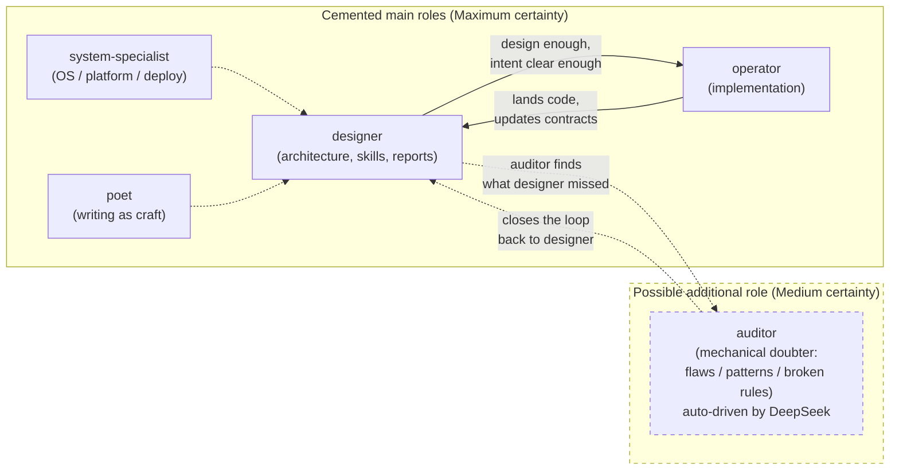

*Kind: Skill / discipline encoding · Topic: standard agent behavior + auditor role · Date: 2026-05-22*

# 8 — Standard agent behavior + auditor role

This sub-report encodes the five intent records captured at the
start of this session (231 reports, 232 reports, 233 workspace, 234
workspace, 235 workspace) into the workspace's standing guidance
files. The five records split cleanly into two clusters: 231 and 232
land in the **reports topic** (chat-vs-report shape, per-response
report, meta-report directory pattern) and belong in
`skills/reporting.md` plus a brief mention in `AGENTS.md`; 233, 234,
and 235 land in the **workspace topic** (engine-as-design-and-intent
dance, third role auditor, automate the auditor with DeepSeek) and
belong in `ESSENCE.md`, `AGENTS.md`, and `INTENT.md`.

## What landed in workspace files

### `skills/reporting.md`

Added two new sections in the reporting skill, each citing its intent
record inline:

- **Meta-report directory pattern (intent 231).** Section "Meta-report
  directories — sub-agent sessions". Describes that when an agent
  dispatches sub-agents, the orchestrating agent creates a numbered
  directory `reports/<role>/<N>-<name>/` and each sub-agent writes a
  numbered sub-report inside. The directory IS the meta-report — no
  `meta-` prefix because being a directory is the signal — and is
  garbage-collected as one session unit (substance migrates to
  permanent homes; the directory retires together). The current
  session's own home (`reports/second-designer/152-persona-engine-architecture-overview/`)
  is the first worked example.

- **Per-response report + standard chat shape (intent 232).** Extends
  the existing chat-vs-report rule: every chat response is the
  *paraphrase* of an accompanying per-response report (the report is
  the session log; chat is the paraphrase). The chat carries 3-7 most
  important items spread more-evenly-than-not across three categories:
  (a) questions/clarifications of intent, (b)
  observations/suggestions/explanations of how new mechanisms work,
  (c) examples of recent work or evolving ideas in the thread.

The existing intent-218 shape-trigger rules (mermaid / table /
multi-paragraph explanation / >5 substantive list items / >10 lines
of design code → report) stay verbatim; the new section sits
underneath them as extension, not replacement. The chat-normal-
response rule that already named the 3-7 items count (encoded in
AGENTS.md on 2026-05-22) gets its full categorical structure here.

### `AGENTS.md`

Two small additions, both intent-cited inline:

- §"Reports go in files; chat is for the user" gets a paragraph at
  the end naming the meta-report directory pattern (intent 231) with
  a one-line locator pointing at `skills/reporting.md`'s new section
  for the full discipline. The existing shape-trigger list (intent
  218) and 3-7-item chat normal-response policy (intent 232's earlier
  encoding) stay verbatim.

- §"Roles" gets a "Possible additional role" sub-paragraph mentioning
  the **auditor** (intents 234 and 235) under carrying-uncertainty
  framing per `skills/architecture-editor.md` §"Carrying uncertainty".
  The role is named, the audit-loop arrow to designer is named, the
  DeepSeek automation direction is named, the Medium certainty is
  named explicitly. No new `skills/auditor.md` file yet — see "What is
  NOT yet encoded" below.

### `ESSENCE.md`

One new section added near the top, after "Intent is the cornerstone"
and before "Logging psyche intent is the first action": **"Intent and
design — the engine's dance"** (intent 233). High-confidence essence-
level addition: the workspace operates as an intent-and-design-driven
engine, designer and operator are paired halves of the dance, the
implementation signal is intent-clarity AND design-quality both met.
The verbatim psyche quote sits in italics ("the whole engine is
mostly intent and design driven … when enough is, the intent is
clear and the design is good enough, we can implement"). No mention
of the auditor — that's Medium certainty and belongs lower in the
hierarchy, not in essence.

### `INTENT.md`

One paragraph added under the existing "Intent is primordial"
introduction, and a separate "Possible additional role" paragraph
near the end of the file (in the "When a new role appears" zone):

- **"The engine is intent and design"** (intent 233): paraphrases
  the essence section in prose suited to INTENT.md's voice; names
  the designer/operator pair as the back-and-forth dance; states
  the implementation signal (intent clear AND design good enough).

- **"Possible additional role — auditor"** (intents 234 + 235):
  brief Medium-certainty paragraph naming the auditor as a possible
  third role that closes the loop back to designer, doing mechanical
  doubter work (finds flaws / bad patterns / broken rules) and
  automated through DeepSeek. Framed under
  `skills/architecture-editor.md` §"Carrying uncertainty" so the
  reader sees it as proposed-not-decided.

## Diagram

The dashed border around the auditor subgraph carries the Medium
certainty visually. Cemented roles are solid; the auditor and its
audit-loop arrow are dashed; system-specialist and poet show as
adjacent roles but the design/intend dance is specifically
designer-operator.

## Open design questions

Preserved per intent 229 (competing design ideas kept):

- **Auditor authority class — structural or support?** The role-
  lanes skill carves authority into two tiers (structural-authority
  windows `<role>` / `second-<role>`; support-authority windows
  `<role>-assistant`). Where does auditor sit? Mechanical pattern-
  checking + automated DeepSeek calls suggest support-authority
  (cannot make new structural decisions, can only flag), but the
  loop-back-to-designer dynamic suggests the auditor's findings
  CAN trigger structural revisions. Unsettled.

- **Auditor lane mechanism — separate windows, shared agent, or
  external pipeline?** The mirror model (per
  `skills/role-lanes.md`) treats lanes as windows into one agent
  per role; if auditor IS a role, it gets its own agent identity
  and its own windows. But if the auditor is run by DeepSeek as
  an external pipeline rather than as a Claude-Code window into a
  persona-mind state, the lane mechanism doesn't apply the same
  way. Two possible shapes: (a) auditor is a real workspace role
  with its own `reports/auditor/` subdirectory and lock file,
  driven by DeepSeek through a wrapper; (b) auditor is an
  external CI-style pipeline whose outputs flow back as designer-
  consumable reports.

- **How DeepSeek's outputs come back to designer.** The intent
  named DeepSeek as the main auditor (audits are mechanical, suit
  a smaller model good at rules-and-flaws detection) but did not
  name the substrate. Options: written audit reports under
  `reports/auditor/`, intent records via Spirit (if the auditor
  has its own agent identity), comments on beads, or PR-style
  review on jj commits. The right shape depends on Q1 + Q2.

## How it fits

The five intent records this report encodes fall along the two
topic axes of recent psyche intent:

- **Reports topic** (intents 231 + 232) — the meta-report directory
  pattern and the per-response report shape both refine *how
  reports work in the workspace*. They belong in
  `skills/reporting.md` (the canonical home for the reporting
  discipline), with a brief mention in `AGENTS.md` §"Reports go in
  files; chat is for the user" so the every-keystroke contract
  surface points at them.

- **Workspace topic** (intents 233 + 234 + 235) — the intent-and-
  design-driven engine framing, the auditor as a possible third
  role, and the DeepSeek automation of audits all refine *how the
  workspace operates as a system*. The 233 essence-level framing
  belongs in `ESSENCE.md`; the auditor proposal (Medium certainty)
  belongs in `AGENTS.md` §"Roles" under carry-uncertainty framing
  and in `INTENT.md`'s open-roles zone.

The split aligns with the Spirit topic vocabulary
(`skills/intent-log.md` §"Topic organization — broad topics, slow
split"): `reports` is the broad topic for chat-vs-report and
report-shape rules; `workspace` is the broad topic for how the
workspace organises itself as a system.

## What is NOT yet encoded

Three things deliberately deferred:

- **No `skills/auditor.md` file.** Per the architecture-editor
  carry-uncertainty discipline, a Medium-certainty role proposal
  does NOT yet earn its own skill file. The role goes in the
  "possible additional role" zone of `AGENTS.md` §"Roles" and
  `INTENT.md`; the skill file lands when the role is firm enough
  to support a discipline document (the role's authority class,
  lane mechanism, claim shape, and substrate are all settled). If
  agents start working as auditors before the skill file exists,
  `skills/role-lanes.md` §"Registering a new lane" and
  `INTENT.md`'s "When a new role appears without a skill" both
  cover the bootstrap path (read AGENTS, ESSENCE, INTENT; query
  skill index for closest existing role; escalate to psyche for
  scope clarification; draft new skill file in-place).

- **No new entry in `skills/skills.nota`.** The typed skill index
  only carries entries for landed skill files. No file means no
  entry. Will be added when the file is.

- **No structural change to `orchestrate/roles.list` or
  `reports/auditor/` subdirectory creation.** Both are downstream
  of the auditor role's authority/lane decisions. Creating the
  filesystem position before the decisions are settled would
  ossify a wrong shape. The lane-registration mechanism
  (`skills/role-lanes.md` §"Registering a new lane") handles this
  when the role is ready.

- **No supersession of intent 218's chat-vs-report shape triggers.**
  Intent 232 EXTENDS those rules with the per-response-report
  paraphrase and the 3-7-items-three-categories shape; it does
  not replace them. The edits to `skills/reporting.md` and
  `AGENTS.md` integrate alongside, not over.

## ARCHITECTURE.md update

Not applicable. This sub-report is a discipline-encoding sweep into
workspace standing guidance files (skills + AGENTS + ESSENCE +
INTENT), not a component architecture edit. No ARCH file in any
repo changed under this sub-report.
