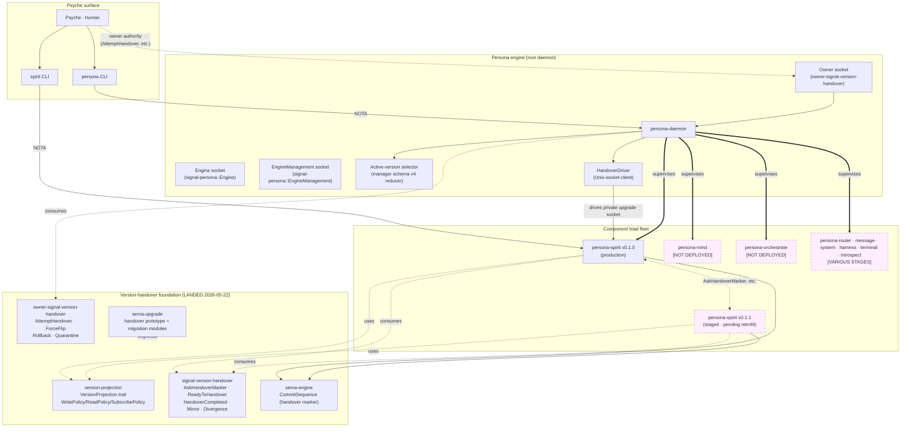

*Kind: Meta-report synthesis · Topic: Persona engine architecture overview · Date: 2026-05-22*

# 9 — Overview

## TL;DR

The Persona engine has crossed the protocol boundary. Operator has
landed not just the foundation crates (`version-projection`,
`signal-version-handover`, `sema-engine.CommitSequence`,
`sema-upgrade` handover prototype) and the engine-manager skeleton
(`operator/159` typed `Target`, `PrepareUpgrade`/`CompleteUpgrade`,
active-version snapshot at manager schema v4) — but ALSO the
owner-authority surface (`owner-signal-version-handover` crate, four
operations: `AttemptHandover` / `ForceFlip` / `Rollback` /
`Quarantine`) AND the Persona-side socket I/O that drives the
handover protocol against component daemons (operator commits
`d89c3ac5` "consume owner version handover authority", `22089f47`
"drive version handover sockets", `04ec9302` "gate handover on
quarantine"). Spirit's smart-handover sandbox proved end-to-end
(operator/160, 217-record migration); persona-spirit-daemon now
owns its private upgrade socket in code (operator/161, commit
`40c0c93e`). What remains for production cutover is a small set of
discrete, well-scoped slices (listed in §5).

This sub-report is the synthesis of the seven sibling sub-reports
in this meta-directory. Per intent 231 the directory IS the meta-
report; this file is the synthesis that points at the sub-reports.

## §1 The Persona engine — what it is, in one paragraph

**Persona** (canonical name, per intent records 215+216 — not
"Persona Engine Manager Daemon") is the root daemon under which
every other persona-* component runs. Persona supervises the
component federation, receives upgrade orders on its owner socket
(per intent 210), and drives the smart version-handover protocol
between adjacent versions of each supervised component (per intents
208+209). It is the workspace's first stateful daemon whose primary
work is governing other daemons — the "engine" in the workspace
slogan *"the Criome stack is the whole; the Persona engine is the
AI-work part"* (intent record 152).

Persona's two binaries:

- `persona-daemon` — the long-running supervising daemon
- `persona` — the thin CLI client (Persona's first client)

Persona's three socket surfaces:

- **Engine** working channel (`signal-persona::Engine`) — public ops for the engine
- **EngineManagement** second channel inside `signal-persona`
  (formerly `Supervision*` — Axis 2 rename done in contract,
  ~242 occurrences pending in the daemon per sub-report 1) — for
  internal engine-management traffic
- **Owner socket** consuming `owner-signal-version-handover` — for
  version-handover authority orders from psyche / future Mind

The version-handover stack (foundation crates + protocol contracts)
is documented at depth in `reports/designer/287-version-handover-component-explained.md`;
this overview does not repeat it.

## §2 Meta-graph — the whole picture

Dashed boxes are component daemons not yet deployed (mind +
orchestrate) or staged-but-not-active (spirit v0.1.1). Solid edges
are landed code paths; dotted/dashed edges are conceptual or
landed-but-not-yet-traffic.

For the inside of the version-handover protocol itself (sequence
diagrams, state machines), see `reports/designer/287-version-handover-component-explained.md`
§3-§6 and sub-report 3 (`3-signal-version-handover.md`) in this
directory.

## §3 Status matrix — what is implemented, in test, or pending

Compiled from the seven sibling sub-reports. Implementation-percentage
deltas relative to `reports/designer/282-workspace-implementation-status.md`
(2026-05-22 morning); this row of work has pushed implementation
substantially forward in this session.

| Surface                                                  | Status                  | Reference                          |
|----------------------------------------------------------|-------------------------|------------------------------------|
| `version-projection` crate                               | LANDED                  | commit `69bd2dd0`; sub-report 4    |
| `signal-version-handover` contract                       | LANDED                  | commit `f2dfe3b4`; sub-report 3    |
| **`owner-signal-version-handover` contract** (was open)  | **LANDED**              | change `ttkkzkpqpymm`; sub-report 7|
| `sema-engine.CommitSequence`                             | LANDED                  | commit `e0a7153c`; sub-report 5    |
| `sema-upgrade` handover prototype                        | LANDED                  | commits `060982d0` + `677206d5`    |
| `spirit-smart-handover-sandbox` (end-to-end test)        | PASSED                  | operator/160 (217-record migration)|
| `persona-spirit-daemon` private upgrade socket           | LANDED in code          | operator/161 (`40c0c93e`)          |
| Persona event-log + active-version snapshot              | LANDED                  | operator/159 + sub-report 1        |
| **Persona owner-socket binding** (was pending)           | **LANDED in code**      | operator commit `d89c3ac5`         |
| **Persona HandoverDriver (Unix-socket client)** (was pending) | **LANDED in code** | operator commit `22089f47`         |
| Persona quarantine gating                                | LANDED in code          | operator commit `04ec9302`         |
| ARCH refreshes (`persona`, `signal-persona`, `sema-upgrade`) | LANDED                | commits `248f339f`, `b4bf644d`, `72b20463` |
| Workspace skill updates (intents 231/232/233/234/235)    | LANDED                  | sub-report 8                       |
| `persona-spirit` v0.1.0 retrofit (private upgrade socket)| PENDING                 | bead `primary-x3ci`                |
| `persona-spirit` v0.1.1 retrofit (private upgrade socket + Magnitude schema) | PENDING | bead `primary-x3ci`         |
| Mirror payload application on persona-spirit-daemon      | PENDING (sandbox-only)  | sub-report 3 §"Implementation gap" |
| Selector flip physical mechanism in running Persona      | PENDING                 | sub-report 6 §"Open design Q d"    |
| Persona-side Axis 2 rename (~242 supervision occurrences across 6 files) | PENDING | bead `primary-wvdl` Track B item 8 |
| `EffectEmitted` payload generalisation                   | PARTIALLY RESOLVED      | owner-signal contract picked `SemaObservation`; sub-report 7 §"Observable block" |
| Production cutover                                       | GOAL                    | bead `primary-x3ci`                |

The headline story is in bold rows: **three surfaces that were
"pending" in the 282 + 286 + 287 reports have actually landed in
the operator window during this session.**

## §4 Consolidated open design questions (preserved per intent 229)

Carrying the field-specialist agents' competing ideas forward —
each question lists alternatives so future agents can essay them.

### A — Version-handover stack

- **`AttemptHandover` socket-paths-in-body** (sub-report 7 Q1) —
  prototype carries explicit socket paths; once Persona's
  component-version catalog matures, shrink to
  `component + current_version + target_version`. **Designer lean:**
  shrink later; current shape is the right stepping stone.
- **Mirror payload — raw bytes vs typed enum** (sub-reports 3 Q1,
  4 open feature, /285 §9). **Designer lean:** bytes until a second
  component handover lands and surfaces a typed need.
- **Read semantics during handover** (sub-reports 3 Q2, 4) — not
  yet on the wire. **Designer lean:** keep reads off this contract;
  let `version-projection::ReadPolicy` + the ordinary contract
  carry it.
- **Mirror payload application on persona-spirit-daemon** (sub-report
  3 §"Implementation gap (load-bearing)") — the reverse-projection
  side of the handover lives only in `sema-upgrade`'s prototype.
  This is the blocker for the first PRODUCTION cutover.

### B — Persona daemon

- **signal-persona crate-split** (sub-reports 1 + 2; preserved in
  `primary-wvdl` per intent 229): one repo with two `pub mod`
  channels (Engine + EngineManagement) vs split EngineManagement
  into its own repo. EngineManagement is consumed by every supervised
  component daemon (broader audience); Engine is consumed only by
  Persona's CLI clients. **No designer lean yet — competing.**
- **Selector flip physical mechanism** (sub-report 6 Q d) — replace
  CriomOS-home `current → v<X.Y.Z>` symlink with what? Persona-owned
  routing socket, virtual address, or in-process Persona table?
  **No designer lean yet — competing.**
- **`ForceFlip`/`Rollback` event-log discriminator vs separate
  variants** (sub-report 1 §"Open design questions" Q b) — current
  shape folds all three sources into one `ActiveVersionChanged`
  variant discriminated by `ActiveVersionChangeSource`. Alternative:
  separate variants per source for grep-friendly audit walks.
  **Designer lean:** uniform reducer is the cleaner shape (current
  choice).
- **Persona ARCH headline reframing** (sub-report 1 final question
  to psyche) — should `ARCHITECTURE.md` lead with "root component-upgrade
  orchestrator" rather than "engine manager"? Larger ARCH rewrite.
  **No lean — pending psyche.**

### C — sema-stack

- **Asymmetric Spirit release** (sub-report 5 + 6 Q a; third-designer/19
  Q22). `persona-spirit` + `signal-persona-spirit` at v0.1.1 while
  `owner-signal-persona-spirit` stays at v0.1.0 — verified by
  sub-report 6 as deliberate (owner contract has no Magnitude /
  Certainty references; would be ancestry-carrying versioning).
  **Designer lean:** principled; ratify via Spirit. Generalises:
  triad-leg versions advance independently per leg's schema delta.
- **`sema-upgrade` self-upgrade bootstrap** (sub-report 5 Q b;
  third-designer/19 Q5) — hand-written for first production
  migration vs full dogfood. **Designer lean:** hand-written until
  contracts stabilise.
- **Divergence sink location for sema-upgrade prototype** (sub-report
  5 Q c) — before persona-introspect ships. **Designer lean:**
  in-memory for prototype; surface to persona-introspect when it
  lands.

### D — signal-persona

- **`ComponentName` overlap** (sub-report 2 Q2) — `signal_persona_auth::ComponentName`
  is a closed enum; `signal_persona::ComponentName` is an open
  `String` newtype. Same name, different semantics. Planned split:
  `ComponentPrincipal` (closed) vs `ComponentInstanceName` (open).
  **Designer lean:** execute the split before the next consumer
  cascade.

### E — owner-signal-version-handover

- **`EffectEmitted` generalisation** (sub-report 7 Q4) — the
  contract chose `SemaObservation`. Generalises to all observable
  blocks or stays as cross-cutting / authority-tier default?
  **Designer recommendation (this report):** capture as Spirit
  Decision (Medium certainty) — authority-tier contracts default
  to `SemaObservation`; component-local domain contracts (mind,
  router, etc.) may choose typed `Effect`.
- **`HandoverSucceeded.commit_sequence`** as `u64` (sub-report 7 Q5)
  — wrap in newtype borrowed from `sema-engine::CommitSequence`?
  Cosmetic.
- **`UnimplementedReason::IntegrationNotLanded`** (sub-report 7 Q6)
  — transitional variant; remove after Spirit cutover proves
  end-to-end.

### F — workspace operating discipline (newly captured intents)

- **Auditor authority class** (sub-report 8 + AGENTS.md
  carrying-uncertainty note) — structural-tier or support-tier?
  **No lean — proposed-not-decided.**
- **Auditor lane mechanism** (sub-report 8) — windows on shared
  agent (mirror model) vs external CI-style pipeline driven by
  DeepSeek? **No lean — proposed-not-decided.**
- **Audit-output substrate** (sub-report 8) — reports under
  `reports/auditor/`, Spirit records if auditor has agent identity,
  bead comments, or jj-commit review? **No lean — proposed-not-decided.**

## §5 The remaining path to production Spirit cutover

Five discrete pending items, in dependency order (consolidated
from sub-reports 1, 3, 6):

1. **`persona-spirit` v0.1.0 retrofit** — keep database schema
   stable, add private upgrade socket binding + handover-protocol
   code. Re-tag, redeploy as production v0.1.0. *(Bead `primary-x3ci`.)*
2. **`persona-spirit` v0.1.1 retrofit** — same protocol code +
   Magnitude schema. *(Same bead.)*
3. **Persona daemon in production** — landed in code (operator
   commits `d89c3ac5` + `22089f47` + `04ec9302`); needs Nix flake
   + service registration + CriomOS-home wiring. *(Bead `primary-wvdl`.)*
4. **Mirror payload application on persona-spirit-daemon** — the
   reverse-projection write path that currently exists only in the
   sandbox runner. *(Bead `primary-x3ci`.)*
5. **Replace the temporary external `sema-upgrade-handover-temporary`
   runner** with real daemon-to-daemon socket exchanges (now possible
   because v0.1.1 has the real upgrade socket).

Plus the longer-cycle Axis 2 rename on the persona daemon side
(~242 supervision occurrences across 6 files; bead `primary-wvdl`
Track B item 8) — non-blocking for Spirit cutover but should land
before adoption cascades to other components.

## §6 Bead reconciliation summary

Affected beads after this session:

- **Closed** by operator (per `reports/operator/162-persona-owner-version-handover-authority.md`
  §"Beads"): `primary-7kge` ("Create `owner-signal-version-handover`
  contract") — the contract landed at change `ttkkzkpqpymm` and
  Persona consumes it; operator closed the bead in the same slice.
  (My closure recommendation in §6 turned out to be confirming work
  already done.)
- **Closed earlier in session**: `primary-k2mh` (duplicate of
  `primary-wvdl`; competing-design preserved per intent 229).
- **Active focus**: `primary-wvdl` (Persona — Track A upgrade
  orchestration + Track B Signal stack port + Axis 2 rename),
  `primary-x3ci` (Spirit cutover; blocked by `primary-wvdl`).
- **Other relevant open beads**: `primary-c2da` (prime designer
  /249 gap-closure sweep), `primary-c620` (orchestrate executor
  migration — done from second-operator's side per intent 230,
  may be ready to close pending verification), the
  `primary-{0bls,9up1,gu7t,qjdp,21gn,krbi,li7a,aunn,e1pm}` migrate-
  triad fleet (per intent 217 component-migration push).

## §7 What this directory contributes to the workspace

By the discipline encoded in sub-report 8 (intent records 231-235):

- **Intent records 231-235 are now in workspace files** — `skills/reporting.md`
  + `AGENTS.md` + `ESSENCE.md` + `INTENT.md` carry the
  standard-agent-behavior framing, the meta-report directory
  convention, the intent-and-design dance essence, and the
  auditor-role carrying-uncertainty note. *(Per sub-report 8.)*
- **Four ARCHITECTURE.md files refreshed** — `persona` (commit
  `248f339f`, names Persona as root upgrade orchestrator),
  `signal-persona` (commit `b4bf644d`, refresh for engine-management
  rename + version-handover neighbours), `sema-upgrade` (commit
  `72b20463`, names two-submodule migration pattern as a discipline),
  `persona-spirit` (already current per commit `f1e2223b` from
  before this session). `version-projection` + `signal-version-handover`
  + `sema-engine` ARCHs already current.
- **One bead closed, one queued for closure** — `primary-k2mh` closed
  as duplicate of `primary-wvdl` (with competing-design preserved
  per intent 229); `primary-7kge` recommended for closure (contract
  already landed).
- **Five sub-reports describe the components** — sub-reports 1-7
  audit one component each, with mermaid diagrams reusable here
  and in future architecture reports.
- **Seven open-design questions surfaced** for the operator
  windows / future sessions to essay (§4 above).

Per intent 231 this directory is one session unit; per intent 233
the engine moves through cycles of intending → designing →
implementing. This session was a synthesis cycle: implementation
caught up with the design (foundation crates landed, owner-signal
contract built, Persona drives sockets) and the design caught up
with the implementation (ARCH files refreshed, intent records
captured, sub-reports document the landed shape). The next cycle
turns the five §5 items into landed code.

## §8 See also

Within this directory:

- `0-frame-and-method.md` — directory purpose + sub-agent contract
- `1-persona-daemon.md` — Persona daemon internals
- `2-signal-persona.md` — Engine + EngineManagement channels;
  competing crate-split design
- `3-signal-version-handover.md` — handover protocol contract
- `4-version-projection.md` — projection trait library
- `5-sema-stack.md` — sema-engine + sema-upgrade
- `6-persona-spirit-cutover.md` — first cutover target
- `7-owner-signal-version-handover.md` — owner authority contract
  (audit of landed code, not from-scratch spec)
- `8-standard-agent-behavior.md` — workspace skill updates for
  intents 231-235

Outside this directory:

- `reports/designer/285-versionprojection-trait-and-handover-protocol-specification.md`
  — canonical spec for `VersionProjection`
- `reports/designer/287-version-handover-component-explained.md` —
  visual deep-dive on the version-handover stack
- `reports/designer/286-session-audit-2026-05-22.md` — prior session
  audit (covers material this report builds on)
- `reports/designer/282-workspace-implementation-status.md` —
  baseline against which this report's §3 status table is the delta
- `reports/operator/158-version-handover-foundation-implementation-2026-05-22.md`
  — foundation crate landings
- `reports/operator/159-persona-engine-upgrade-foundation-2026-05-22.md`
  — Persona engine-manager foundation
- `reports/operator/160-spirit-smart-handover-sandbox-test-2026-05-22.md`
  — sandbox proof
- `reports/operator/161-spirit-private-handover-socket-2026-05-22.md`
  — daemon-owned upgrade socket
- Spirit records 215, 216, 229–235, 237 — intent layer captured this
  session and the prior session
- Beads `primary-wvdl`, `primary-x3ci`, `primary-7kge`, `primary-c2da`
