*Kind: Design · Topic: EffectEmitted payload + public-traffic routing during cutover · Date: 2026-05-22*

# 154 — EffectEmitted payload + public-traffic routing — explanation + designs

*Per psyche 2026-05-22: "explain" + "get in the details" + "show
both of those with visuals of problems and offered designs". Both
questions are open from /152 + /153.*

**Status update 2026-05-23:** Both questions RATIFIED. Part 1
EffectEmitted = Design D (tier-based default — authority-tier
`SemaObservation`, component-local typed `Effect`) ratified
implicitly via intent 244 (three-tier signal sizing) + 251 (adopt
Part 1 leans). Part 2 public routing = Design D (Persona-orchestrated
FD handoff via SCM_RIGHTS) ratified via intent 252; Design C
(client-side discovery) rejected via intent 246. Beads filed:
`primary-l02o`, `primary-bg9l`, `primary-b86d`, `primary-2py5`,
`primary-ezzp`, `primary-x5ba`, `primary-ak4g`. Carry-forward
issues remain on Mirror payload typing + Read semantics during
handover — see `reports/second-designer/158-...` for the live
status of those.

# Question 1 — `EffectEmitted` payload type

## §1.1 The problem

Every component triad working contract carries an **observable
block** — a typed observation stream that consumers subscribe to in
order to follow what the daemon is doing. The block has TWO event
families:

- **`OperationReceived`** — fires when the daemon accepts an
  operation (the request half of the request/reply pair); carries
  the operation discriminator
- **`EffectEmitted`** — fires when the daemon applies an effect (a
  state change visible to the outside world); carries SOME payload
  describing what changed

The open question is **what kind of payload `EffectEmitted` carries**.
Around seven pending observable blocks are waiting on this decision
— `signal-persona-mind`, `signal-persona-router`,
`signal-persona-message`, `signal-persona-introspect`,
`signal-persona-system`, `signal-persona-terminal`,
`signal-persona-harness` — each one designed but blocked on the
payload type. The just-landed `owner-signal-version-handover`
contract picked `SemaObservation`, which forces the question.

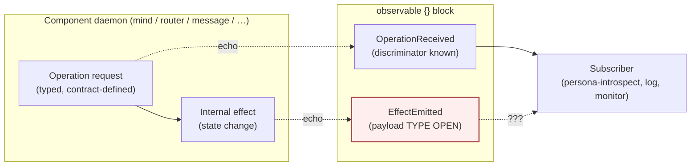

The question isn't whether observers exist — they do. It's what
they SEE on the effect side.

## §1.2 Why the question is load-bearing

Three forces pull in different directions:

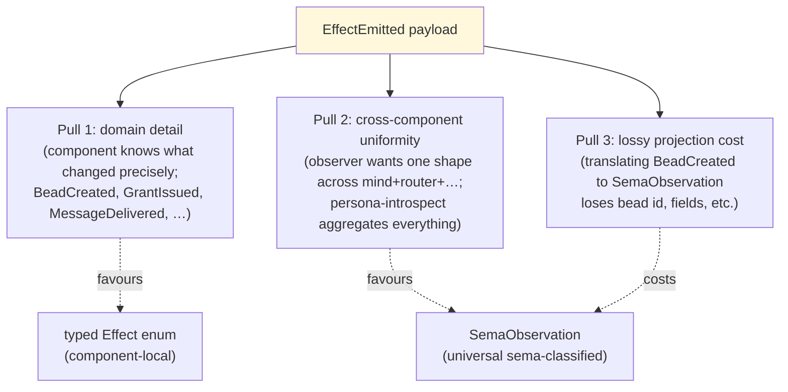

If every observer needs domain detail, the typed `Effect` wins. If
every observer aggregates across components, `SemaObservation` wins.
In practice **both kinds of observer exist** (persona-introspect
aggregates; a per-component dashboard reads detail), so the question
is which audience is the primary consumer.

## §1.3 The four candidate designs

### Design A — Universal `SemaObservation` everywhere

Every component's `EffectEmitted` carries `SemaObservation`. The
component picks a sema classification at emit time; domain detail
falls into a free-form `summary` string or is dropped.

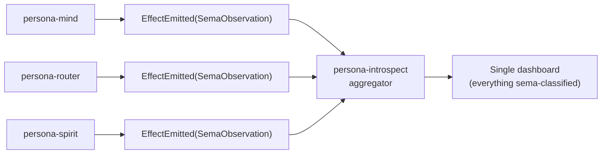

- ✓ Uniform consumer shape across all components
- ✓ One subscription channel for cross-cutting tooling
- ✗ Loses domain detail (`BeadCreated.bead_id` becomes a string)
- ✗ Forces every component to invent a sema classification for every
  effect (cost on the producer side)

### Design B — Component-local typed `Effect` everywhere

Every component's `EffectEmitted` carries a component-local enum:
`persona_mind::Effect`, `persona_router::Effect`, etc. The contract
defines the enum; observers must know each component's vocabulary.

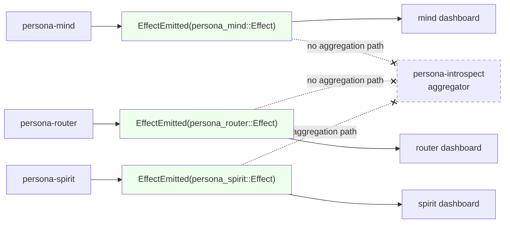

- ✓ Full domain detail preserved
- ✓ Producer cost zero (the effect IS already typed internally)
- ✗ No aggregation path — persona-introspect would have to learn
  every component's `Effect` enum
- ✗ Adding a new component forces every observer to add a case

### Design C — Two-stream (both, separately)

Each component emits TWO observable streams: `EffectEmitted` with
typed local `Effect` AND `SemaEmitted` with `SemaObservation`. The
component does the projection once at emit time; both subscribers
get what they want.

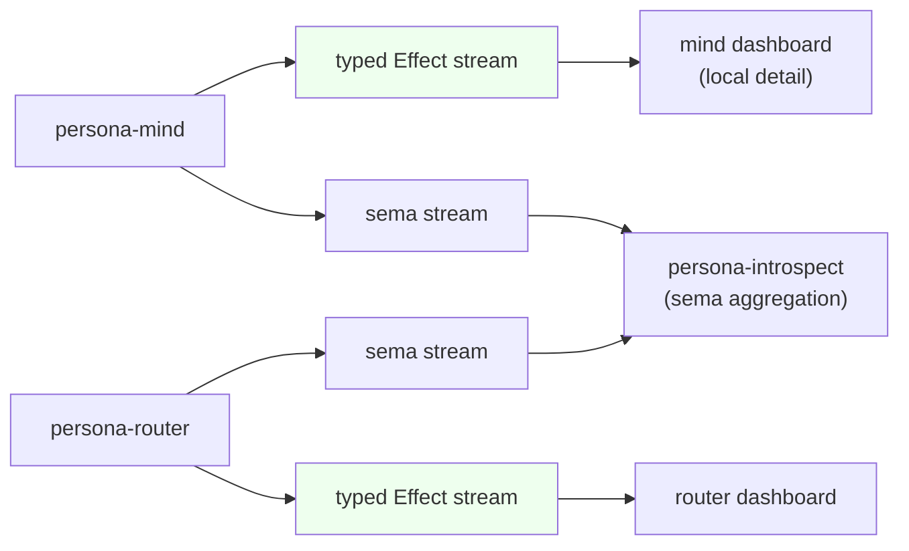

- ✓ Both audiences served
- ✓ Domain detail preserved + aggregation works
- ✗ Producer cost: every effect projected twice
- ✗ Doubles the observable surface in every contract
- ✗ Risk of skew between the two streams if projection forgets
  a case

### Design D — Tier-based default (recommended)

Two tiers of contract, each gets its natural default:

- **Authority-tier contracts** (`owner-signal-*`, cross-cutting
  contracts about other daemons' state — `owner-signal-version-handover`,
  future `owner-signal-mind` policy verbs, etc.) → `SemaObservation`
- **Component-local domain contracts** (`signal-persona-mind`,
  `signal-persona-router`, etc.) → typed component-local `Effect`

`persona-introspect` learns to read both shapes; it gets sema-classified
data from authority-tier emissions for free (because authority-tier
is small and stable) and parses domain effects per-component (one
adapter per known component, manageable count).

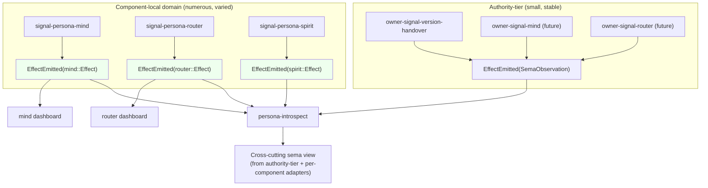

- ✓ Right default per tier — authority-tier is rare + cross-cutting
  (sema is right); domain is frequent + detail-rich (typed is right)
- ✓ Already matches what landed (`owner-signal-version-handover`
  picked `SemaObservation`)
- ✓ persona-introspect's effort scales with component count, not
  with effect count
- ✗ Two patterns instead of one (cost on writers)
- ✗ Edge case: a domain contract that happens to be cross-cutting
  (e.g. `signal-persona-introspect` itself) needs explicit ruling

## §1.4 Designer recommendation

**Design D — tier-based default.** Capture as Spirit Decision
(Medium certainty) so the seven pending observable blocks can move:

```text
authority-tier contracts (owner-signal-*, cross-cutting state about
other daemons) → EffectEmitted(SemaObservation)
component-local domain contracts (signal-persona-X for X being a
component daemon) → EffectEmitted(component-local typed Effect)
edge case: contracts that span both audiences default to typed
Effect and let persona-introspect adapt
```

The case is strong because:

- `owner-signal-version-handover` already chose `SemaObservation`
  and the choice fits its content
- Domain contracts emit detail-rich effects where sema projection
  is genuinely lossy
- persona-introspect's adapter count is bounded by component count
  (small), not by effect count (large)

If psyche prefers Design A (universal SemaObservation) the cost is
one-time vocabulary work in every component to express its domain
in sema terms; this is conceivable but probably not worth it.

# Question 2 — Public-traffic routing during cutover

## §2.1 The problem

A client (e.g. the `spirit` CLI, a future Mind worker) connects to
"spirit's ordinary socket". During steady state this is
`spirit-v0.1.0`'s ordinary socket; **after a cutover** it must
become `spirit-v0.1.1`'s ordinary socket. The handover protocol on
the private upgrade socket coordinates state copy; the public
**routing** is the missing piece.

Persona owns the active-version selector (snapshot table, manager
schema v4). systemd transient units own per-version process
identity (`persona-component@persona-spirit:v0.1.0.service` vs
`:v0.1.1.service`). Each component daemon binds its own
version-suffixed ordinary socket (e.g.
`~/.local/state/persona-spirit/v0.1.0/spirit.sock`).

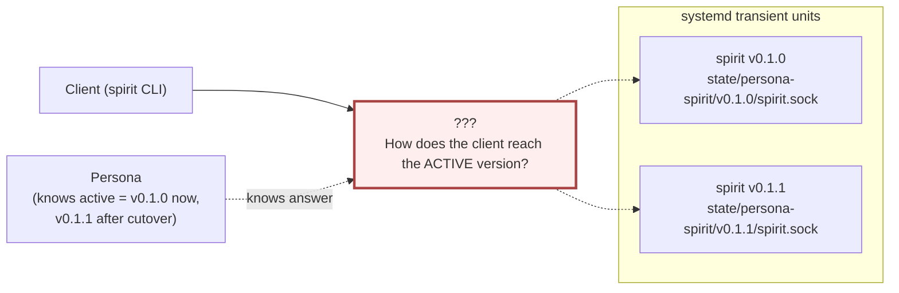

The cutover is supposed to be **atomic from the client's view** —
no client should see "neither", no client should connect to old
during the freeze window AFTER `HandoverCompleted`. The handover
protocol freezes writes on v0.1.0 and v0.1.1 picks up; the routing
question is how the *connection* swings over.

## §2.2 What's already decided

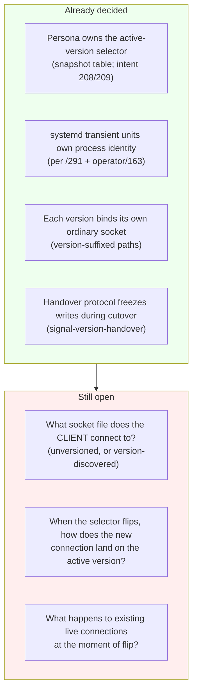

## §2.3 The three candidate designs

### Design A — Persona-owned routing socket (proxy)

Persona binds a stable per-component socket
(`~/.local/state/persona-spirit/spirit.sock`); the file is owned by
Persona. Clients connect to this socket. Persona accepts the
connection and proxies bytes to the active version's ordinary
socket. On selector flip, new proxy connections route to the new
active.

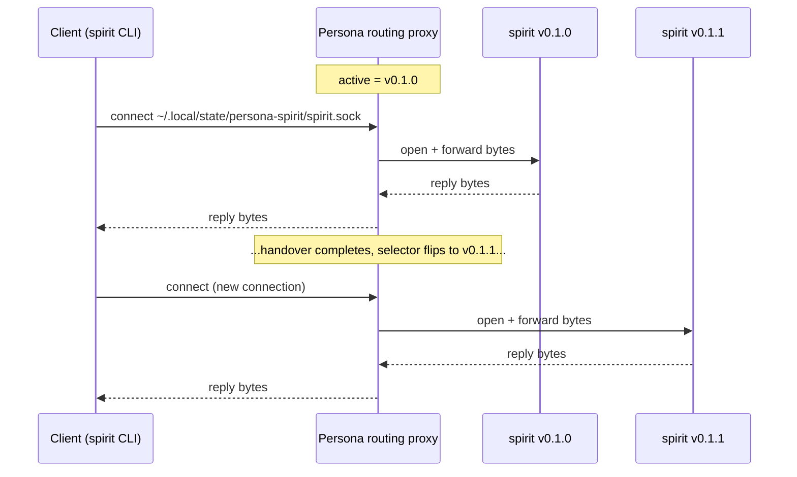

- ✓ Atomic flip from client's view — new connections see new active
- ✓ Persona has live signal on every connection (could rate-limit,
  audit, gate)
- ✓ Existing connections to V0 can be drained on Persona's terms
- ✗ Latency hit per request (extra socket hop + bytes copy)
- ✗ Persona is on the data-plane path — Persona crash = traffic stop
- ✗ Persona is single-threaded by Kameo actor model; high-throughput
  components would queue behind Persona

### Design B — systemd socket activation (one stable socket, Persona swaps which unit listens)

systemd binds the public socket
(`~/.local/state/persona-spirit/spirit.sock`); the socket is owned
by a `persona-spirit.socket` unit with no specific service yet.
Persona issues `start-transient-unit` with `Sockets=persona-spirit.socket`
naming the active unit; systemd hands the listening file descriptor
to that unit. On selector flip, Persona issues `stop-unit
<old>; start-transient-unit <new> --sockets=persona-spirit.socket`
and systemd transfers the listening FD to the new unit.

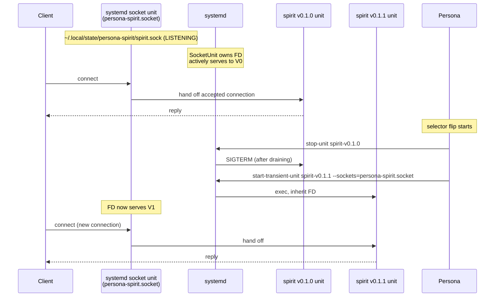

- ✓ Atomic flip from client's view (systemd handles FD transfer)
- ✓ No data-plane proxy — bytes flow client ↔ active daemon directly
- ✓ Operating system handles connection draining + idle-timeout
- ✗ Coupling: Persona's correctness now depends on systemd unit
  behavior + socket-unit interaction
- ✗ Existing connections to V0 must drain BEFORE V1 takes the FD
  (handover protocol's freeze window plus a drain delay)
- ✗ Two-phase setup is more complex; harder to test in non-NixOS
  development sandbox

### Design C — Client-side version negotiation (CLI asks Persona, connects direct)

Client first connects to Persona's owner socket; asks "where's
spirit?"; receives `~/.local/state/persona-spirit/v0.1.0/spirit.sock`;
connects there directly. After cutover, a new client's discovery
returns `:v0.1.1/spirit.sock`. Existing connections to V0 stay
connected and drain on V0's terms.

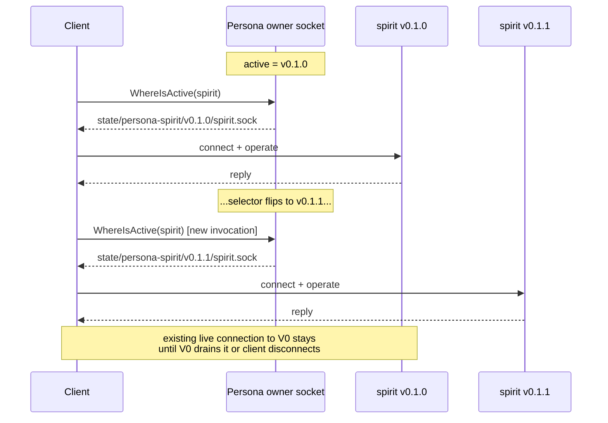

- ✓ No proxy hop; bytes flow direct after discovery
- ✓ Persona is OFF the data plane — Persona crash doesn't stop
  traffic mid-connection
- ✓ Simple to test (no systemd-socket-activation surface)
- ✗ Client must talk to Persona FIRST per logical session — extra
  round-trip on connection establishment
- ✗ Client caching the discovered path = race window; client may
  reach v0.1.0 after cutover until cache invalidates
- ✗ Per-component daemons would need to coordinate their drain
  policy with Persona's selector flip to avoid client confusion
- ✗ Every client SDK needs the discovery step — couples persona-CLI
  + future-Mind + every signal client library to Persona

## §2.4 Comparison

| Concern                            | A — Persona proxy        | B — systemd socket activation     | C — Client discovery        |
|------------------------------------|--------------------------|-----------------------------------|-----------------------------|
| Atomic flip (client view)          | Yes (new connections)    | Yes (FD transfer)                 | Eventual (cache invalidation) |
| Latency overhead                   | Per-request proxy hop    | Zero after FD handoff             | One discovery round-trip per session |
| Persona on data plane              | Yes (high coupling)      | No                                | No                          |
| Persona crash = traffic stop       | Yes                      | No                                | No (for existing connections) |
| Connection drain at flip           | Persona-managed          | systemd + freeze window           | Per-component drain         |
| Test sandbox complexity            | Low                      | High (needs --user systemd)       | Low                         |
| Client SDK change cost             | None (transparent)       | None (transparent)                | One discovery step per session |
| Composes with handover freeze      | Naturally (proxy holds)  | Tightly (drain → FD swap → new bind) | Loosely (per-component)  |
| New component added                | Add per-component proxy  | Add per-component socket unit     | Add WhereIsActive variant   |

## §2.5 Designer recommendation

**Design B — systemd socket activation, with Design C as fallback
for non-systemd environments.**

The reasoning:

- Persona is already a permissioned system daemon (intent 238/239);
  systemd is the production substrate per /291 + operator/163.
  Coupling to systemd's socket-activation is natural at the
  per-component scope where systemd is already managing units.
- Zero data-plane latency once the FD is in place.
- Persona stays OFF the data plane — fault-isolation between
  Persona and individual component traffic.
- The complexity cost (FD-transfer timing) is bounded; systemd has
  proven the pattern in production.
- The non-systemd development sandbox uses `DirectProcessLauncher`
  per /291 §5 anyway — for that backend, Design C is the fallback
  (Persona returns the version-suffixed path on direct ask).

The fallback discipline keeps the development story simple while
production gets the right primitive.

If psyche prefers Design A (Persona proxy) — viable but accepts
Persona on the data plane. Reasonable if Persona's role is
explicitly broader than "supervisor" (e.g. if Persona is also
expected to gate every request).

If psyche prefers Design C universally — viable but pushes
complexity into every client SDK and accepts the cache-invalidation
race during cutover.

## §2.6 Open follow-on if Design B is chosen

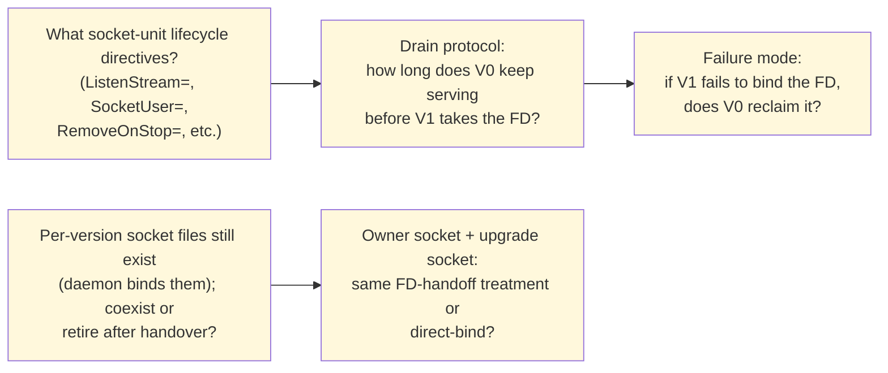

Designer leans on the follow-ons:

- **Q1**: minimal directives — `ListenStream=...`, `SocketUser=persona`,
  `SocketMode=0600`. No `Accept=yes` (keep connection handling in
  the daemon).
- **Q2**: tie to handover protocol's freeze window — V0 stops
  accepting new connections at `ReadyToHandover`, drains existing
  with a configurable timeout (~5s), V1 binds the FD at
  `HandoverCompleted` minus drain timeout.
- **Q3**: V0 reclaims if V1 fails to bind within a timeout; Persona
  records the failure as an event.
- **Q4**: per-version socket files coexist short-term so the upgrade
  socket can still drive the protocol from the inactive side; retire
  the OLD version's ordinary file once `HandoverCompleted` lands.
- **Q5**: owner + upgrade sockets stay direct-bind (per-version) —
  the FD-handoff treatment is for the **public ordinary** socket
  only. Owner socket is on PERSONA, not on the component.

# §3 Combined recommendation summary

Both questions have a recommended design with the same shape: the
SETTLED system-level discipline (Persona + systemd hybrid; sema
universe for cross-cutting + typed Effect for component-local)
flows down to consistent per-contract rules.

| Question | Recommendation | Spirit capture |
|---|---|---|
| EffectEmitted payload | Design D — tier-based default | Decision (Medium certainty); authority-tier defaults to SemaObservation; component-local defaults to typed Effect |
| Public routing during cutover | Design B — systemd socket activation (production); Design C — direct discovery (dev sandbox) | Decision (Medium); follow-on Q1-Q5 per §2.6 |

Both feed the broader workspace shape captured at intent records
208 (Persona as upgrade orchestrator), 238/239 (Persona as
permissioned system daemon), and the foundation crates landed in
this session.

# §4 See also

- `reports/second-designer/152-persona-engine-architecture-overview/`
  — the meta-report context for both questions
- `reports/second-designer/153-refresh-after-prime-systemd-followups-2026-05-22.md`
  — surfaces both as open
- `reports/designer/291-persona-systemd-units-for-daemon-management.md`
  — the systemd hybrid that Design B (Q2) composes with
- `reports/operator/163-persona-systemd-component-management-position.md`
  — operator's systemd alignment
- `reports/designer/285-versionprojection-trait-and-handover-protocol-specification.md`
  — handover protocol Design B (Q2) composes with
- Spirit records 208, 209, 210, 214, 238, 239 — drivers for both
  questions
