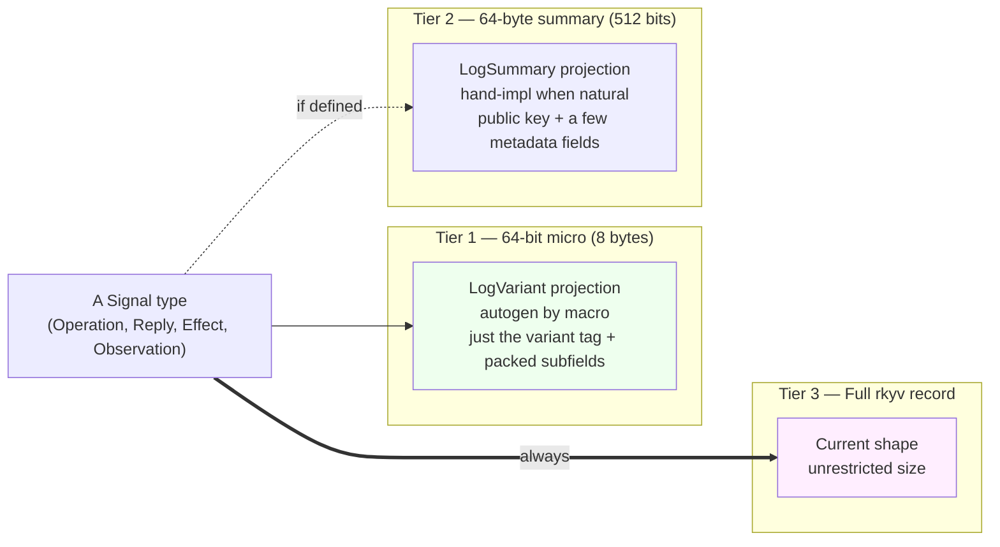
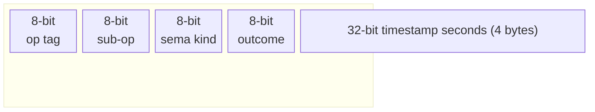
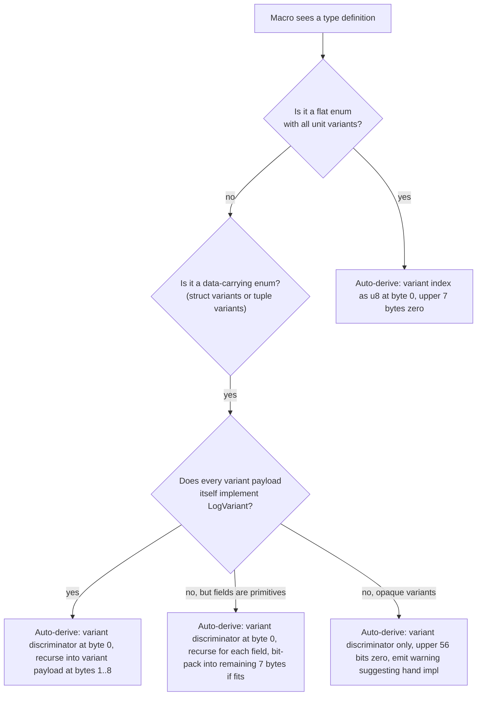
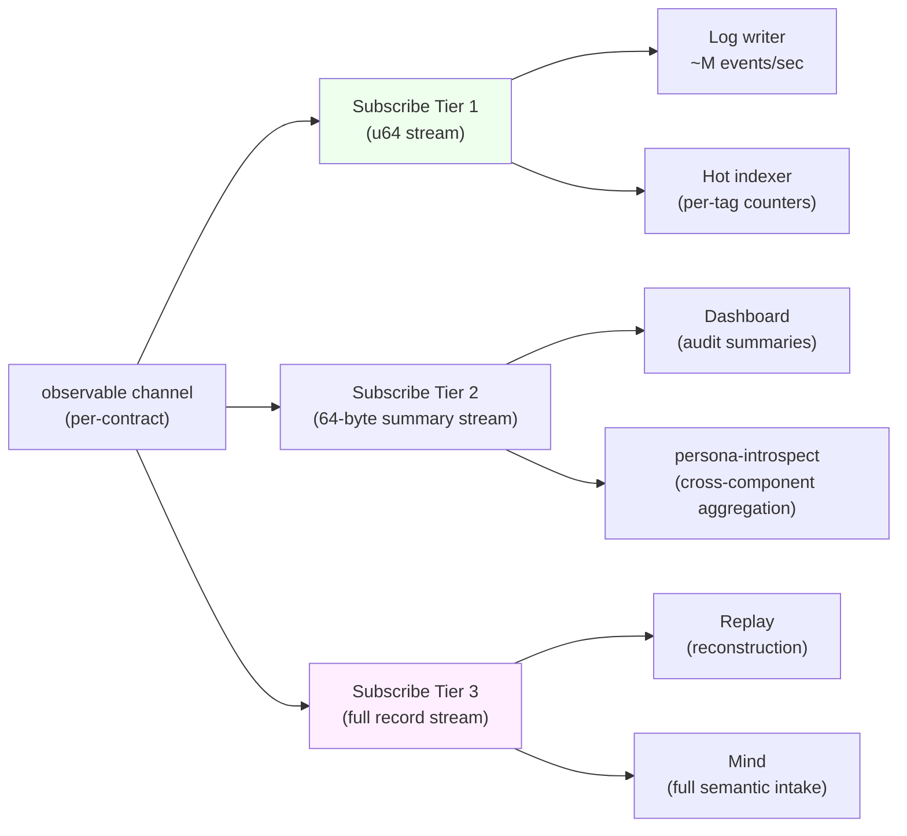
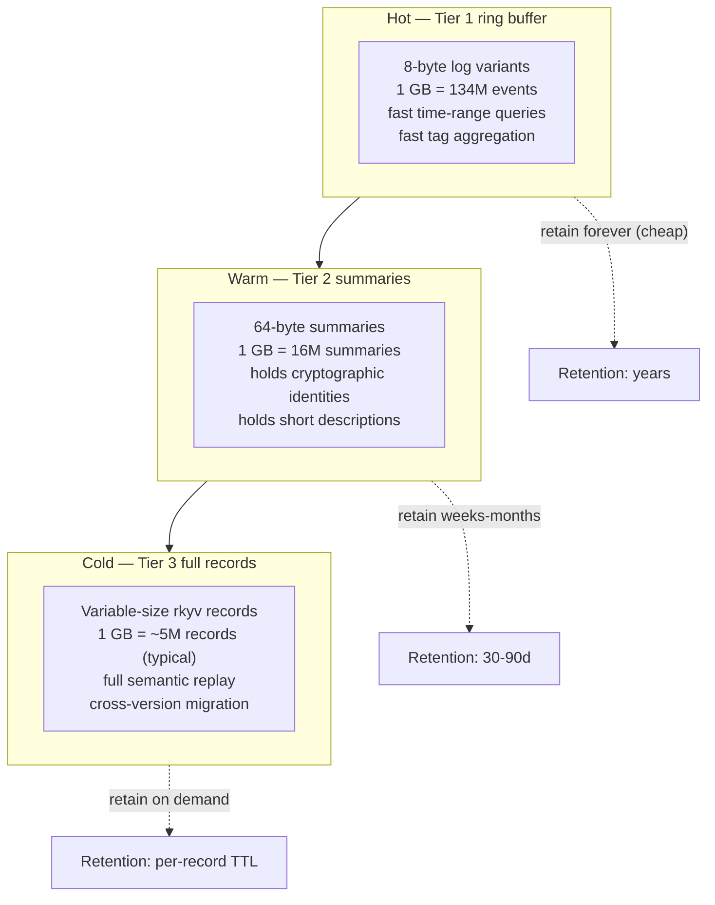
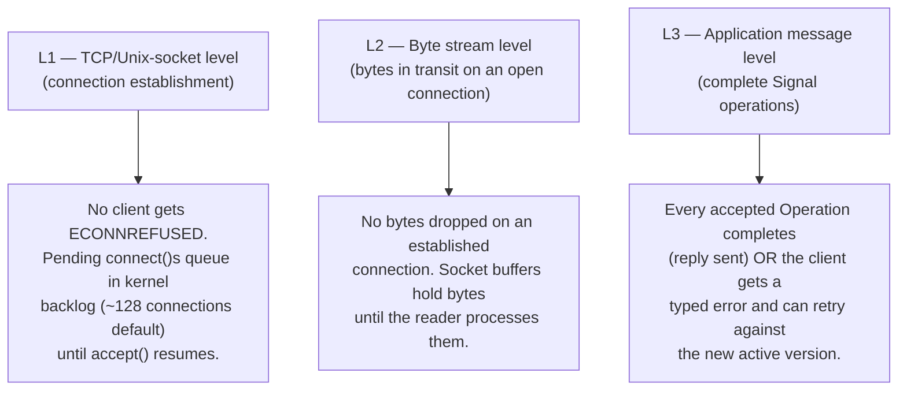
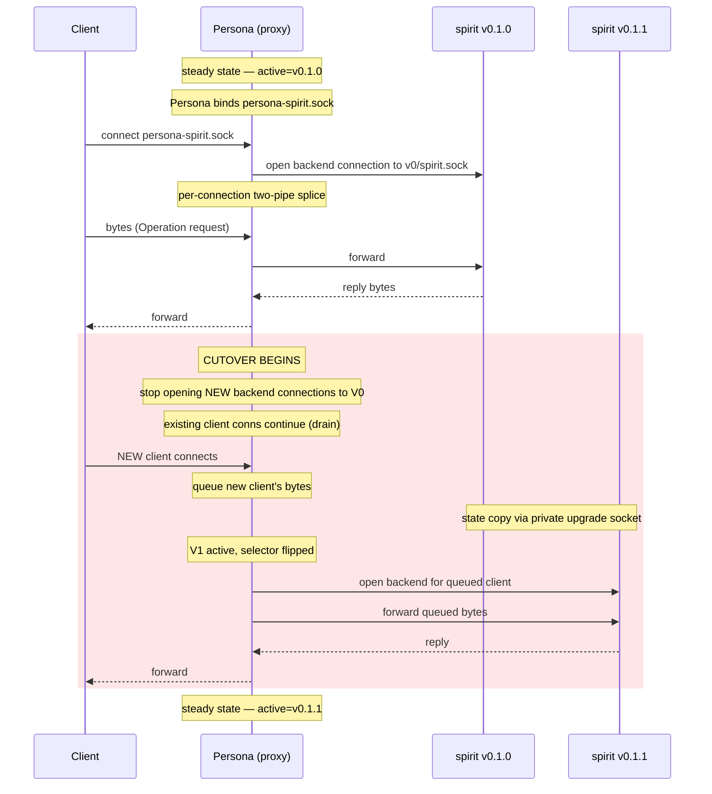
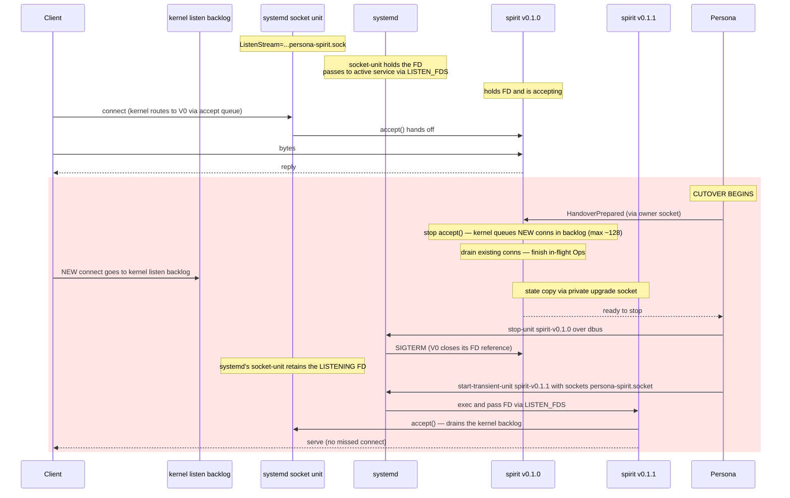
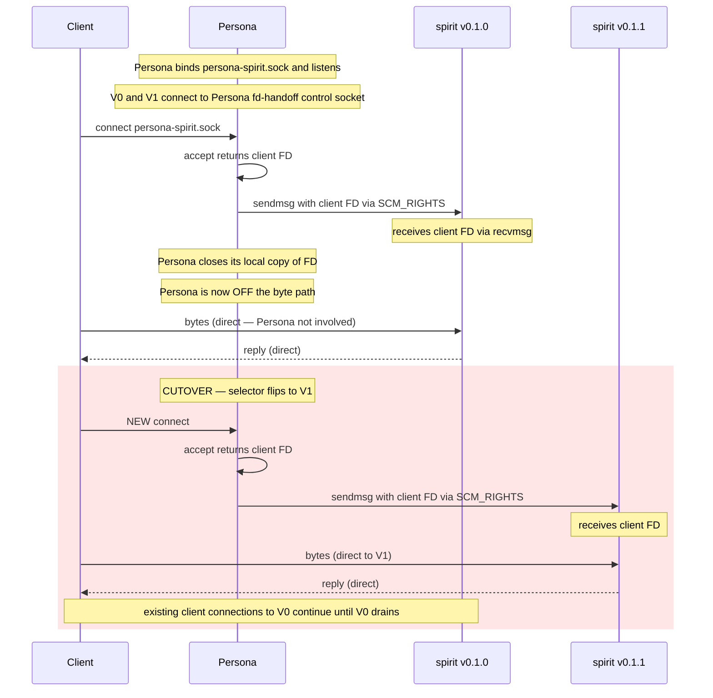
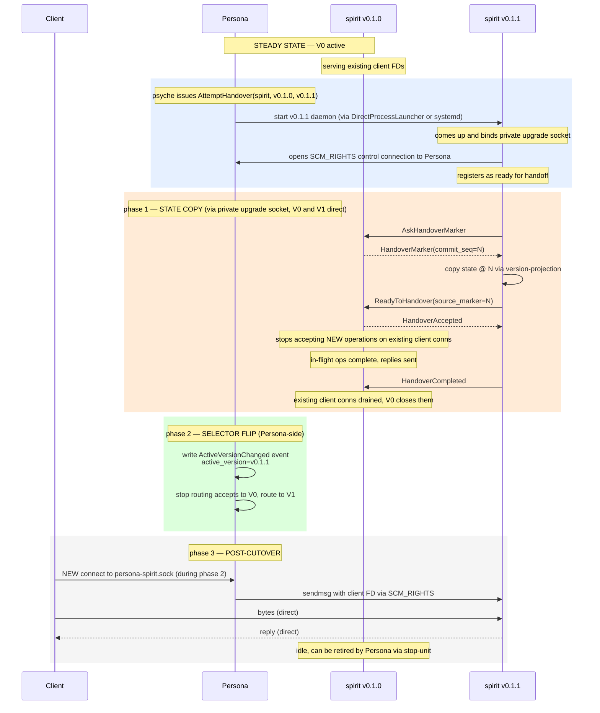

*Kind: Design · Topic: Three-tier signal sizing + lossless cutover routing · Date: 2026-05-22*

> **STATUS BANNER (added 2026-05-23 by /161/3 context-maintenance sweep):**
> Both designs ratified and substance fully migrated to permanent docs:
> - Part 1 (three-tier signal sizing + 64-bit verb namespace) → `signal-frame/ARCHITECTURE.md §5 "Three-Tier Signal Sizing + Verb Namespace"` (jj change `2313c5ed`, via `reports/second-designer/159-intent-manifestation/1-signal-verb-namespace-arch.md`); cross-ref in `signal-sema/ARCHITECTURE.md` (jj change `1604cceb`).
> - Part 2 (lossless cutover routing — Design D Persona FD-handoff via SCM_RIGHTS) → `persona/ARCHITECTURE.md` Design D section + cross-refs in `signal-persona-orchestrate/ARCHITECTURE.md`, `signal-persona-introspect/ARCHITECTURE.md`, `signal-persona-spirit/ARCHITECTURE.md`.
>
> Report retained for design rationale and competing-design preservation per intent record 229 (closing duplicate beads preserves information; competing design ideas kept).

# 155 — Three-tier signal sizing + lossless cutover routing

*Per psyche 2026-05-22 follow-up to /154: (1) explore three-tier
Signal-type sizing with an auto-derived 64-bit logging trait
(intent record 244); (2) come back with how lossless message
handover actually works during cutover now that Design C
(client-side discovery) is rejected (intent records 245 + 246).*

# Part 1 — Three-tier signal sizing

## §1.1 The wisdom psyche named

Every Signal Operation, Reply, Effect, and SemaObservation today
gets serialized as a full rkyv record — variable-size, sometimes
hundreds of bytes. For three jobs (logging, indexing, cheap
subscription) that's an order of magnitude more than needed. The
shape psyche named:



Three tiers because three audiences need different things:

- **Tier 1 audience** — log writers, hot-path indexers, dashboard
  histograms, persona-introspect aggregation. They want a tag, not
  detail. 8 bytes per event scales to billions per GB.
- **Tier 2 audience** — auditors, slow dashboards, observers that
  want enough detail to follow the story but not the full payload.
  64 bytes = ~10 small fields or one cryptographic identity + a
  few words of context.
- **Tier 3 audience** — replay, reconstruction, full semantic
  consumers (mind, router, downstream daemons). Want everything.

The discipline is: **every type implements Tier 1 by default
(auto-derived); types that have a natural Tier 2 summary
implement that hand-written; Tier 3 is the existing record**.

## §1.2 What fits in 64 bits (8 bytes)

Rust type sizes:

| Type | Size | Notes |
|---|---|---|
| `bool`, `u8`, `i8` | 1 byte | |
| `u16`, `i16` | 2 bytes | |
| `u32`, `i32` | 4 bytes | |
| `u64`, `i64`, `usize`, `isize` | 8 bytes | exactly fills the 64-bit budget alone |
| Unit-only `enum` with N variants | 1 byte (N≤256), 2 bytes (N≤65536) | |
| Data-carrying `enum` | 1 byte discriminator + max(variant sizes) + alignment padding | |
| `Option<NonZeroU8>` | 1 byte (niche optimization) | |
| `Option<u32>` | 8 bytes (4 + tag + 3 padding) | |
| `[u8; 8]` | 8 bytes | exactly the budget as a byte array |

So in 64 bits we can fit:

- **One u64** (timestamp, sequence number, packed bitfield)
- **One unit-only enum** with discriminator + 7 bytes spare for
  sub-fields
- **Up to 8 stacked unit-only enums** (each 1 byte, all packed)
- **One enum + a u32 + a couple of u8s** with bit packing
- **One ContractVersion** — wait no, that's 32 bytes; doesn't fit

A useful packing for a Signal log variant:



That's 4 enum tags (each ≤256 values) plus a u32 timestamp_seconds
(good for ~136 years from 1970). Exactly fills the budget. Each
field is independently indexable.

Alternative packings:

- `(op:8, sub:8, sequence:48)` — 281 trillion events per stream
- `(op:8, padding:56)` — just the discriminator, lots of unused
- `(op:16, sub:16, sequence:32)` — 65k op kinds + 4G sequence

The macro defaults to the simplest useful packing per type. Hand
override for types that have a natural fit.

## §1.3 What fits in 64 bytes (512 bits)

64 bytes is enough for:

- **1 BLS12-381 G1 compressed point** (48 bytes) + 16 bytes
  metadata. This carries an identity + a few enum tags.
- **1 SHA-256 / Blake3 hash** (32 bytes) + 32 bytes other.
- **1 short string up to ~60 bytes** (4 bytes for len prefix +
  60 bytes content).
- **1 Ed25519 public key** (32 bytes) + 32 bytes context (sema
  classification + a hash + a few flags).
- **8 u64s** (timestamps, sequences, counters).
- **2 ContractVersion** (32 bytes each) — current + target version
  in a handover summary.
- **1 ComponentName + 1 Version + a couple of enum tags** —
  natural for owner-signal-version-handover summaries.

This is the **summary tier** — enough fidelity to follow what
happened without re-reading the full record.

## §1.4 The trait design

```rust
/// Every Signal type provides a 64-bit logging projection.
/// Always derivable by the signal_channel! macro.
pub trait LogVariant {
    fn log_variant(&self) -> u64;
}

/// Optional 64-byte summary projection.
/// Implemented when the type has a meaningful summary at 64 bytes.
/// `Summary` is bound to <= 64 bytes via a const-generic check.
pub trait LogSummary {
    type Summary: rkyv::Archive + Sized;
    const SUMMARY_SIZE_CHECK: () = assert!(
        std::mem::size_of::<Self::Summary>() <= 64,
        "LogSummary::Summary must fit in 64 bytes"
    );
    fn log_summary(&self) -> Self::Summary;
}
```

Every Signal type — Operation, Reply, Effect, SemaObservation —
implements `LogVariant` (autogen). Types with natural summaries
hand-implement `LogSummary`.

## §1.5 Macro autogen logic for `LogVariant`

The `signal_channel!` macro already defines the top-level enum
shapes. Extending it to derive `LogVariant`:



The variant discriminator (root tag) is **always** at byte 0
(LSB). This makes histogram aggregation cheap: take the low byte
and you have the root operation kind for grouping.

For struct types with multiple enum fields:

```rust
// Example: a 4-tuple log variant for an Observation
struct ObservationLog {
    sema_kind: SemaKind,        // u8 — 1 byte
    component: ComponentKind,   // u8 — 1 byte
    outcome: OutcomeKind,       // u8 — 1 byte
    extra: u8,                  // 1 byte
    timestamp_seconds: u32,     // 4 bytes
}
// Total: 8 bytes — fits exactly in u64

impl LogVariant for ObservationLog {
    fn log_variant(&self) -> u64 {
        let mut packed = 0u64;
        packed |= (self.sema_kind as u64) << 0;
        packed |= (self.component as u64) << 8;
        packed |= (self.outcome as u64) << 16;
        packed |= (self.extra as u64) << 24;
        packed |= (self.timestamp_seconds as u64) << 32;
        packed
    }
}
```

## §1.6 Three subscription tiers

Once every type has Tier 1 + optional Tier 2 + always Tier 3, the
observable block extends:



Subscription tier is a filter on the same observable channel — the
producer emits once, the runtime projects per-subscriber. The
producer cost is one projection per active tier (most channels will
only have Tier 1 + Tier 3 subscribers in practice; Tier 2 is opt-in
where it adds value).

## §1.7 Storage efficiency

Persona-introspect (or any observer with persistence) can
materialize three storage tiers from the three subscription tiers:



The cost ratio is roughly **~8× between adjacent tiers**. Tier 1 is
cheap enough to keep indefinitely; Tier 3 follows TTL discipline.

## §1.8 Logging + computational overhead

For the producer-side cost:

| Operation | Cost |
|---|---|
| Emit Tier 1 (LogVariant) | 1 `u64` shift-and-or per field, ~5ns total |
| Emit Tier 2 (LogSummary) | 1 small struct construction, ~50ns |
| Emit Tier 3 (full record) | Existing rkyv serialization, ~1-10µs |

The cost difference is two orders of magnitude. A daemon that emits
1M events/sec can afford to log all of them at Tier 1, can sample
Tier 2 selectively, and falls behind at Tier 3.

For storage write throughput:

| Tier | Bytes/sec at 1M events/sec |
|---|---|
| Tier 1 | 8 MB/s |
| Tier 2 | 64 MB/s |
| Tier 3 | ~500 MB/s typical |

Tier 1 fits comfortably in a single SSD write stream; Tier 3 needs
batching + compression to keep up at sustained rates.

## §1.9 Open questions for Part 1

**Q1.1 — What's in the autogen vs hand-impl boundary for `LogVariant`?**
Lean: macro auto-derives for any type whose root is an enum (the
common case); hand impl for types with computed projections (e.g.
"first 8 bytes of the BLS signature").

**Q1.2 — How does `LogSummary`'s 64-byte bound get enforced?**
Lean: const-generic assert at compile time (illustrated in §1.4);
the type system catches over-budget summaries before they ship.

**Q1.3 — Does the variant-at-root rule force every type into the
top-level-enum shape?** Today some types are structs (e.g. `Entry`
inside persona-spirit). Lean: keep structs as structs; their
LogVariant emits a constant discriminator (one possible "variant")
+ packed fields. Or — and this is the cleaner interpretation —
**signal_channel! types** (operations, replies, effects, observations)
ARE all enums at the root by macro construction; the rule applies
to those, not to internal data records.

**Q1.4 — Should Tier 2 also be auto-derivable for some shapes?**
e.g. "the first 64 bytes of the rkyv record" as a fallback. Lean:
no — the value of Tier 2 is *semantic* summary, not byte-truncation.
Hand-impl only.

**Q1.5 — How do tiers interact with subscription cost?** Subscribers
that pay only for Tier 1 should not force the producer to project
Tier 2. Lean: the runtime tracks per-tier subscriber count; emits
each tier on-demand.

**Q1.6 — What's the relationship to `signal-sema`'s `SemaObservation`?**
SemaObservation is itself a Tier-2-shaped type (small, structured,
universal). It's the natural Tier 2 default for cross-cutting
authority contracts (per the EffectEmitted Design D in /154 §1.4).
A Tier 1 for SemaObservation is a packed enum-of-enums fitting in
8 bytes.

# Part 2 — How lossless cutover routing actually works

## §2.1 The constraint (intent records 245 + 246)

- **Lossless**: no missed messages, no dropped connections during
  cutover.
- **Client-transparent**: one stable socket; clients connect and
  talk; no discovery step.
- **Persona owns the swap decision** but is not necessarily on the
  data plane.
- **Design C (client-side discovery) is REJECTED** — clients do not
  ask Persona where the active daemon is.

This rules out /154 §2.5's recommended fallback (Design C for dev
sandbox). The dev fallback needs a different shape — proposed in
§2.5 below as Design D.

## §2.2 What "lossless" actually means at three levels



All three must hold for "no missed message". L1 and L2 are mostly
about timing — keep the listening socket bound, keep buffers from
overflowing. L3 needs **protocol cooperation**: either the operation
completes on the same daemon that accepted it (graceful drain), OR
the client sees an explicit "retry" signal.

## §2.3 Design A revisited — Persona-as-proxy, lossless mechanism



How losslessness is guaranteed:

- **L1**: Persona's `accept()` never stops; clients never get
  ECONNREFUSED.
- **L2**: Persona's per-connection backend choice (V0 vs V1) is
  decided at backend-open time; bytes are buffered in process if
  the chosen backend isn't ready.
- **L3**: existing connections to V0 finish via V0's natural drain;
  new connections opened after the selector flip route to V1. The
  HandoverProtocol's freeze on V0 must complete in-flight client
  requests before signalling HandoverCompleted (V0 holds them until
  flush).

The cost: Persona is on the byte path. Splice(2) on Linux keeps
the byte-copy in kernel space (zero-copy), but Persona's process
must be running to accept() and to splice. Persona crash = traffic
stop.

## §2.4 Design B revisited — systemd socket activation, lossless mechanism



How losslessness is guaranteed:

- **L1**: the LISTENING socket FD is held by systemd's
  `persona-spirit.socket` unit ACROSS the V0→V1 service transition.
  systemd does NOT close the listening socket between services.
  New `connect()`s during the gap are queued in the kernel's
  accept backlog. As long as the gap is shorter than backlog
  capacity × arrival rate, no connection is dropped.
- **L2**: existing connections to V0 stay open while V0 drains;
  V0 reads-and-replies on its socket buffer normally.
- **L3**: V0 must process every in-flight Operation before
  closing. The HandoverProtocol's freeze means V0 doesn't accept
  NEW Operations on existing connections; existing in-flight ones
  complete. After SIGTERM + drain timeout, V0 is guaranteed quiesced.

The kernel backlog is the safety net: with `net.core.somaxconn`
typically at 4096 (Linux default since 5.4), and connection
arrivals at ~hundreds/sec for an internal daemon, the
sub-second V0→V1 gap is well within budget.

Cost: tight coupling to systemd's socket-activation primitive;
requires careful sequencing (stop V0 → start V1 with same socket
unit). Failure mode if V1 doesn't bind the FD: systemd holds the
FD and accumulates queue until V1 succeeds OR Persona times out
and restarts V0. The fall-back path is exercised rarely but must
be tested.

## §2.5 Design D proposed — Persona-orchestrated FD handoff (SCM_RIGHTS)

A new design that combines A's Persona-control with B's
off-the-byte-path property. Persona binds the stable socket, but
USES Unix-socket `SCM_RIGHTS` to pass each accepted FD to the active
version daemon. Once the FD is handed over, the client ↔ daemon
byte stream is direct.



How losslessness is guaranteed:

- **L1**: Persona's `accept()` never stops — same as Design A.
- **L2**: bytes flow client ↔ active-version daemon directly after
  FD handoff — same as Design B steady state.
- **L3**: existing connections drain on V0; new connections route
  to V1. Same protocol cooperation as B for in-flight Ops.

Differences from A:

- After FD handoff, Persona is OFF the byte path. Persona crash
  doesn't stop traffic on established connections.
- Only `accept()` + `sendmsg()` go through Persona; bytes don't.
  Per-connection overhead is one Unix-socket message at connect
  time, not per-byte.

Differences from B:

- No systemd dependency. Works in any environment with Unix
  domain sockets + SCM_RIGHTS — dev sandbox, containers, custom
  hosts.
- Persona is the FD-handler instead of systemd. Persona has
  full visibility into who connects (could rate-limit, audit,
  gate per-component-policy).
- Same socket model in dev and prod — no different fallback for
  dev (which was the source of the rejected Design C).

The cost: SCM_RIGHTS handling on both Persona and component daemon
sides. Adds a small "FD inbox" pattern to each component daemon.

## §2.6 Comparison — three viable designs (C dropped)

| Concern | A — Persona proxy | B — systemd socket activation | D — Persona FD handoff (SCM_RIGHTS) |
|---|---|---|---|
| Lossless L1 (connect) | ✓ (Persona accept always running) | ✓ (kernel backlog absorbs gap) | ✓ (Persona accept always running) |
| Lossless L2 (bytes) | ✓ (Persona buffers + splices) | ✓ (kernel + socket buffers) | ✓ (direct client↔daemon after handoff) |
| Lossless L3 (Ops) | ✓ with V0 drain + protocol cooperation | ✓ with V0 drain + protocol cooperation | ✓ with V0 drain + protocol cooperation |
| Persona on data plane | YES (bytes flow through) | NO | NO (only `accept()` + FD handoff) |
| Persona crash → traffic stop | YES (all connections stop) | NO | NO (established connections survive) |
| Cutover gap visible to client | NO (Persona queues) | NO (kernel backlog) | NO (Persona queues new accept()s briefly) |
| Per-connection overhead | per-byte (splice() helps) | zero | one sendmsg() at connect time |
| systemd dependency | none | required (prod) | none |
| Dev/prod symmetry | yes | no (dev uses DirectProcessLauncher) | YES (same socket model both) |
| Implementation complexity | medium (proxy loop) | medium (systemd integration + FD timing) | medium-high (SCM_RIGHTS plumbing both sides) |
| Persona-visible request gating | YES | NO (post-handoff) | YES (Persona sees every connect) |
| Per-connection rate-limiting in Persona | possible | not possible | possible at connect time only |

## §2.7 Designer recommendation (revised after C rejection)

**Design D — Persona-orchestrated FD handoff via SCM_RIGHTS — as
the unified production + dev shape.**

Reasoning:

- Satisfies the lossless constraint at all three levels (L1, L2, L3).
- Satisfies the client-transparent constraint (one stable socket;
  no discovery).
- Keeps Persona off the byte path (fault isolation; no per-byte
  Persona overhead).
- Same shape in dev and prod (no dual-design discipline; no
  systemd-only path).
- Gives Persona visibility at connect time (rate-limiting, audit,
  per-component policy can land later without refactoring).

**Fallback: Design B for production-only if SCM_RIGHTS complexity
turns out to be load-bearing.** systemd socket activation is the
reasonable alternative if Design D's plumbing proves harder than
expected. Both keep Persona off the byte path; both are lossless;
Design D's only advantage over Design B is dev/prod symmetry.

**Design A (Persona proxy) — rejected on data-plane coupling.**
Persona stays in steady-state byte path indefinitely; that's an
ongoing cost. Only worth it if Persona is expected to do per-message
work (e.g. transform, gate, audit) — currently no such requirement.

## §2.8 The actual handover sequence under Design D



The protocol cooperation that makes L3 lossless: V0 finishes every
accepted Operation before closing client connections. The
HandoverProtocol's `HandoverMode` semantics already require this;
Design D inherits it without modification.

## §2.9 Open questions for Part 2

**Q2.1 — Where does Persona keep the SCM_RIGHTS control socket
for each component daemon?** Lean: one Persona-side control socket
per component (`~/.local/state/persona/control/spirit.sock`); each
component daemon connects on startup and stays connected for the
daemon lifetime.

**Q2.2 — What happens to client connections that were in the kernel
listen backlog when Persona itself restarts?** They get
ECONNREFUSED when Persona's socket file disappears. For Persona
restart resilience, Persona's bind should survive via
SystemdSocketActivation OR Persona must bind, then exec into a
fresh image (privilege-preserving restart). Defer: out of scope
for first cutover; mitigated by Persona being a long-running
system daemon.

**Q2.3 — How does Persona discover the spirit daemon's FD-receive
socket?** Lean: convention — each component daemon listens on a
known path; Persona connects on startup. Alternative: component
daemon connects to Persona's control socket as the active step
(Persona's side is server, daemon's side is client). The latter is
cleaner because Persona has authority over connection lifecycle.

**Q2.4 — What's the per-connection-establishment latency penalty?**
SCM_RIGHTS adds one Unix-socket sendmsg + the receiver's recvmsg.
Measurement: low microseconds. Negligible for typical Signal
workloads.

**Q2.5 — How does this compose with the EngineManagement channel?**
EngineManagement traffic between Persona and supervised components
uses a *different* socket per /152 sub-report 2. Design D applies
to PUBLIC sockets (the client-facing ordinary channel); doesn't
change EngineManagement.

# §3 Combined recommendation summary

| Topic | Recommendation | Spirit capture status |
|---|---|---|
| Three-tier signal sizing (Part 1) | Adopt LogVariant (Tier 1, autogen) + LogSummary (Tier 2, hand-impl) + full record (Tier 3). Macro autogens Tier 1; rule: variant always at root. | Captured as intent 244 (Decision, Medium) — refine to Maximum once research validates the 64-bit budget assumptions in §1.2. |
| Lossless cutover routing (Part 2) | Design D — Persona-orchestrated FD handoff via SCM_RIGHTS. Unified production + dev shape. Persona off the byte path. Design B as fallback if SCM_RIGHTS plumbing is too heavy. | Constraint captured as intent 245 (Maximum); rejection of Design C captured as intent 246 (Correction, Maximum). Pending: psyche ratifies Design D over Design B as the production choice. |

Both recommendations compose: a daemon serving via Design D's FD
handoff implements LogVariant on every Signal type, exposes three
subscription tiers, and supports the smart-handover protocol on its
private upgrade socket.

# §4 See also

- `reports/second-designer/154-effect-emitted-and-public-routing-designs-2026-05-22.md`
  — the predecessor with EffectEmitted Designs A-D and public-routing
  Designs A-C (Design C from /154 §2 is now rejected per intent 246)
- `reports/second-designer/152-persona-engine-architecture-overview/`
  — the broader Persona engine architecture this work fits in
- `reports/designer/291-persona-systemd-units-for-daemon-management.md`
  — the systemd hybrid Design B (Part 2) composes with
- `reports/operator/163-persona-systemd-component-management-position.md`
  — operator's systemd alignment
- `skills/component-triad.md` — the component triad shape Design D
  uses (one socket per role)
- Spirit records 244 (three-tier sizing), 245 (lossless +
  transparent constraint), 246 (Design C rejected)
