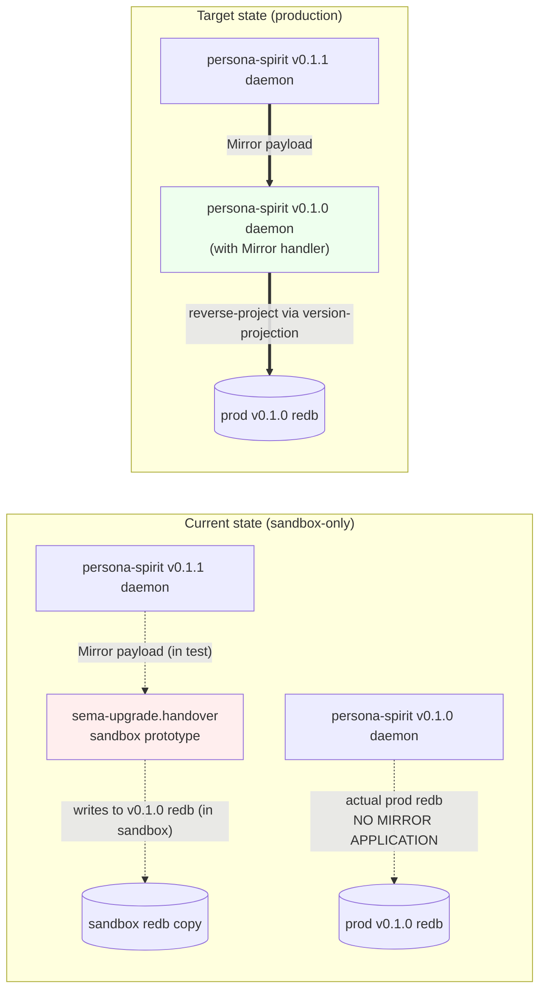
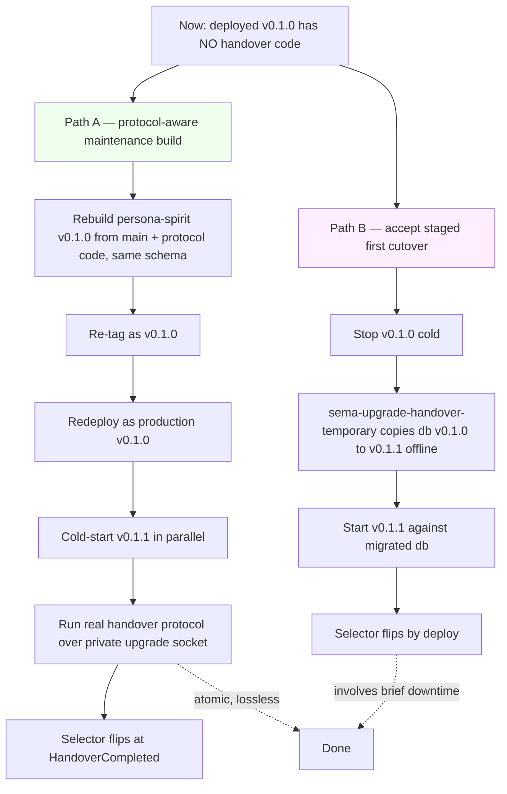
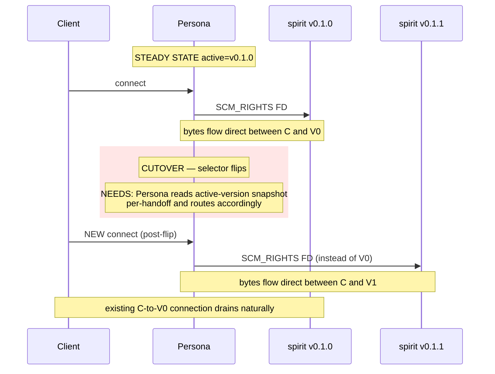
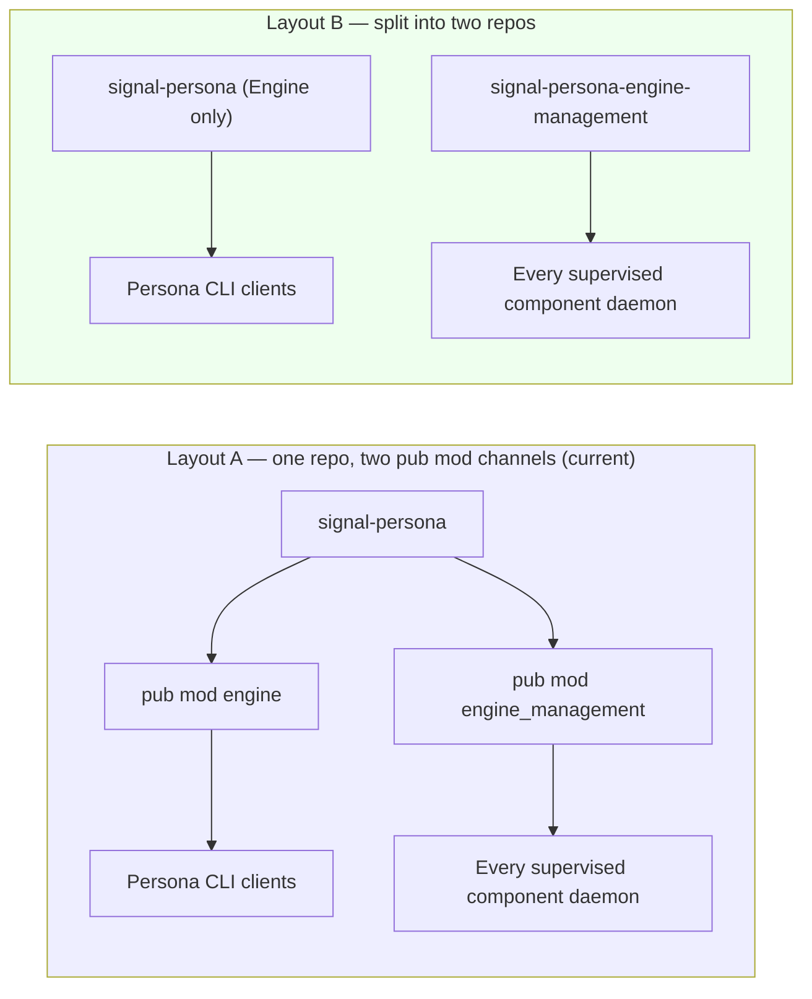
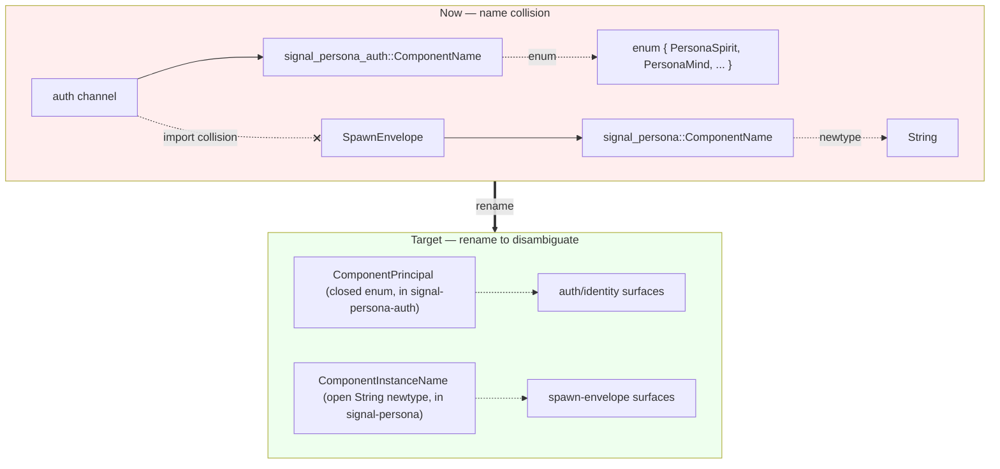
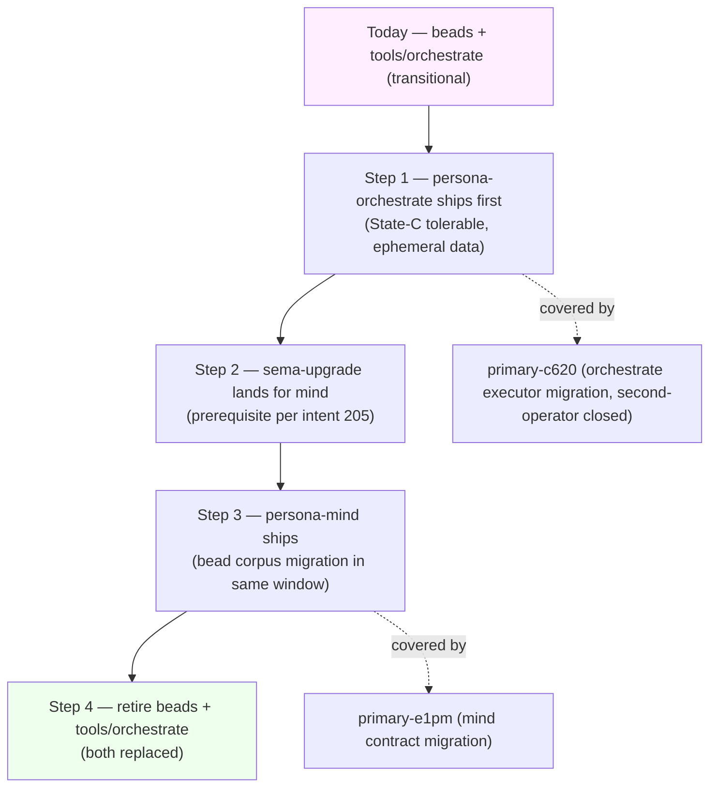
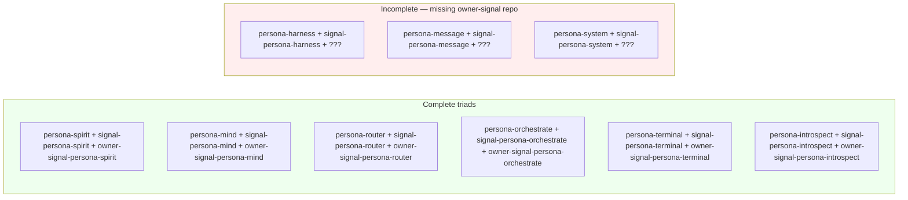
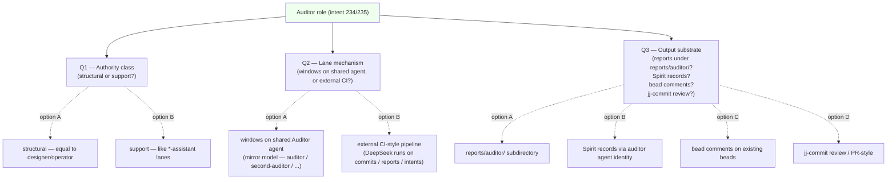

*Kind: Design audit · Topic: Most important gaps in the Persona engine stack · Date: 2026-05-23*

# 156 — Most important gaps (context · examples · solutions · visuals)

*Per psyche 2026-05-23: make a visual report of the most important
gaps with full context, examples, solutions, all with visuals.*

## Frame

The Persona engine push has crossed major thresholds in the last
24-48 hours — foundation crates landed (`version-projection`,
`signal-version-handover`, `sema-engine.CommitSequence`,
`sema-upgrade` handover prototype, `owner-signal-version-handover`),
Persona daemon now drives sockets + records ActiveVersionChanged,
sandbox migration proven end-to-end, /155 ratified Design D for
lossless routing. What remains are SEVEN load-bearing gaps in four
themes. This report walks each gap in shape:

- **Context** — what's blocking what
- **Visual** — current state vs target state
- **Example** — concrete files / code / decisions
- **Solution** — designer lean + recommended next slice

## §0 Overview map

```mermaid
flowchart TB
    subgraph ThemeA["Theme A — Spirit cutover blockers"]
        G1["Gap 1 — Mirror payload application on persona-spirit-daemon"]
        G2["Gap 2 — Spirit v0.1.0 protocol-aware retrofit"]
        G3["Gap 3 — Selector-flip-aware routing in Design D"]
    end

    subgraph ThemeB["Theme B — Architecture undecided"]
        G4["Gap 4 — signal-persona crate-split (one repo vs two)"]
        G5["Gap 5 — ComponentName overlap (closed enum vs open string)"]
    end

    subgraph ThemeC["Theme C — Infrastructure replacements"]
        G6["Gap 6 — persona-mind + persona-orchestrate deployment"]
        G7["Gap 7 — Three missing owner-signal-persona-* repos"]
    end

    subgraph ThemeD["Theme D — Strategic, proposed-not-decided"]
        G8["Gap 8 — Auditor role specifics (authority, lane, substrate)"]
    end

    PCutover["Spirit production cutover (primary-x3ci)"]
    PEngine["Persona engine epic (primary-a5hu)"]

    G1 --> PCutover
    G2 --> PCutover
    G3 --> PCutover
    G3 -.->|"follow-on to"| PEngine

    G4 -.->|"blocks Axis 2 cascade"| PEngine
    G5 -.->|"blocks next consumer cascade"| PEngine

    G6 -.->|"blocks Mind + Orchestrate adoption"| Future["Workspace tools replacement<br/>(beads + tools/orchestrate)"]
    G7 -.->|"blocks owner-tier interactions"| PEngine

    G8 -.->|"automates"| LoopBack["Design <-> implementation loop closure<br/>(intent 234/235 — DeepSeek auditor)"]

    style ThemeA fill:#fee
    style ThemeB fill:#ffe
    style ThemeC fill:#eef
    style ThemeD fill:#efe
```



The visual coding above maps to severity-by-blast-radius: red
themes block the live cutover, yellow themes block architectural
cascades, blue themes block major capability additions, green is
proposed-not-decided strategic.

# Theme A — Spirit cutover blockers

## §1 Gap 1 — Mirror payload application on persona-spirit-daemon

### Context

`signal-version-handover` defines the `Mirror` operation
(daemon-to-daemon delta-writes from next back to current during
the handover window). The PROTOCOL side is implemented; the
**daemon-side handler** that actually receives a `MirrorPayload`,
reverse-projects via `version-projection`, and writes into the
CURRENT version's database — that lives ONLY in
`sema-upgrade::handover`'s sandbox prototype. Operator/162
§"Remaining Work" item 1 + operator/170 §"Current Situation" both
flag this as production blocker.

### Visual — current state vs target



### Example — what's missing in code

In `persona-spirit/src/handover.rs` (the daemon-side handler that
operator/161 landed), the operations `AskHandoverMarker`,
`ReadyToHandover`, `HandoverCompleted` have real handlers. The
`Mirror` operation arrives but is currently a no-op or returns
`MirrorAcknowledged` without writing. The missing piece:

```text
fn handle_mirror(&mut self, payload: MirrorPayload) -> Reply {
    // MISSING:
    //   1. decode payload using sister-version's NotaCodec
    //   2. reverse-project each record via version-projection
    //      (v0.1.1 type -> v0.1.0 type)
    //   3. write to current's redb under a handover-write transaction
    //   4. return MirrorAcknowledged with the commit_sequence
    todo!("Mirror payload application — operator/162 §Remaining Work item 1")
}
```

### Solution

Designer lean: implement on the **current (v0.1.0)** daemon side,
since current owns its own redb and is the natural target for
reverse-projected writes. Reuse `sema-upgrade::handover`'s already-
proven projection logic — the sandbox code IS the reference impl.
Just lift it into the daemon and wire it to the redb write path.

Estimated slice: 1-2 days operator. Test via Nix flake check
following the `spirit-smart-handover-sandbox` pattern from
operator/160.

Bead: **not yet filed** — file as `[Mirror payload application on
persona-spirit-daemon]`, P1, blocks `primary-x3ci`.

## §2 Gap 2 — Spirit v0.1.0 protocol-aware retrofit

### Context

The deployed production `persona-spirit` v0.1.0 binary does NOT
have handover-protocol code. Operator/161 added the private upgrade
socket + `AskHandoverMarker`/`ReadyToHandover`/`HandoverCompleted`
handlers on the persona-spirit `main` branch — but the deployed
v0.1.0 binary was built before that. For a no-downtime cutover, the
deployed daemon needs the handover code to participate in the
protocol with v0.1.1.

Operator/162 §"Remaining Work" item 3 names the fork: either
**(a)** rebuild + re-tag + redeploy v0.1.0 with the new protocol
code, same DB schema, OR **(b)** accept a different first-cutover
shape (e.g. cold-start v0.1.1 + import via `sema-upgrade-handover-temporary`).

### Visual — the two paths



### Example — what changes in the v0.1.0 retrofit

The protocol code is already on `persona-spirit` main per
operator/161 commit `40c0c93e`. The retrofit is purely a build
+ tag + deploy operation, NOT a new dev cycle:

```text
cd /git/github.com/LiGoldragon/persona-spirit
# main has handover code; same DB schema as deployed v0.1.0
nix build .#persona-spirit-daemon --option max-jobs 0
# tag it
jj describe @- -m 'persona-spirit v0.1.0.1 — protocol-aware maintenance build'
# system-specialist deploys
```

### Solution

Designer lean: **Path A** (protocol-aware maintenance build). The
no-downtime story is the whole point of the smart-handover design
(intent record 203 superseded Path A stop/freeze); accepting a
staged first-cutover would compromise the precedent for every
future component cutover.

Cost: one maintenance-build + deploy cycle; ~half-day system-specialist.

Bead: tracked under `primary-x3ci` (Spirit cutover); no separate
bead needed — would fit as a comment on `primary-x3ci` after
ratification.

## §3 Gap 3 — Selector-flip-aware routing in Design D

### Context

`/155` Part 2 Design D was ratified for STEADY-STATE routing
(`primary-ezzp` Persona FD-handoff infra + `primary-x5ba` component
SCM_RIGHTS receive loop + `primary-ak4g` smoke test). What's
**deliberately deferred** is the cutover behavior: when Persona's
active-version selector flips from v0.1.0 to v0.1.1, the Persona
accept loop must start sending NEW FDs to v0.1.1 instead of v0.1.0.
Existing FDs already handed to v0.1.0 continue serving until v0.1.0
drains. Not yet beaded; `/155` §2.8 only shows the diagram.

### Visual — the missing routing flip



### Example — the per-handoff active-version read

Inside Persona's accept-and-handoff loop (currently being
implemented under `primary-ezzp`):

```text
loop {
    let client_fd = public_socket.accept().await?;
    // current implementation (primary-ezzp):
    let target = self.active_fd_receiver.clone();   // captured once at startup — WRONG
    // selector-aware version (this gap):
    let target = self.lookup_active_fd_receiver(component);  // read every handoff
    target.send_fd(client_fd).await?;
}
```

The `lookup_active_fd_receiver` reads from Persona's manager
schema v4 active-version snapshot per handoff. Compared to a
cached value, the cost is a single redb lookup (~µs); compared
to the cutover-correctness benefit, it's free.

### Solution

Designer lean: build into `primary-ezzp` from the start rather
than retrofitting. The active-version snapshot read is so cheap
that "always read per handoff" is the simpler design. The selector
flip then just becomes "the active-version snapshot has new
contents"; no special-case routing code needed.

Bead: file as `[Persona selector-flip-aware routing follow-on to
primary-ezzp]`, P1, blocks `primary-x3ci`, parent-child to
`primary-a5hu`. OR — fold into `primary-ezzp` body as a
clarification before operator starts. The latter is cleaner.

# Theme B — Architecture undecided

## §4 Gap 4 — signal-persona crate-split (competing design)

### Context

`signal-persona` currently carries TWO channels in one crate:
**Engine** (Persona's public ordinary working channel) and
**EngineManagement** (formerly `Supervision`; second channel for
internal engine-management traffic). The Axis 2 rename
(`supervision_*` → `engine_management_*`) landed contract-side
but is mid-cascade across consumers (~242 occurrences in the
persona daemon per `/152` sub-report 1).

**Competing design** preserved per intent 229: (a) keep both
channels inside `signal-persona` as today, OR (b) split
`EngineManagement` into its own repo (`signal-persona-engine-management`).
No designer lean.

### Visual — the two layouts side-by-side



### Example — audience asymmetry that pulls toward (b)

EngineManagement is consumed by EVERY supervised component daemon
(it's how each component reports its readiness, lifecycle events,
etc. to Persona). Engine is consumed only by Persona's direct
clients (CLI, future Mind interactions).

```text
Consumers of signal-persona::engine:
  - persona (CLI)
  - future Mind callers

Consumers of signal-persona::engine_management:
  - persona-spirit
  - persona-mind (future)
  - persona-router
  - persona-message
  - persona-system
  - persona-harness
  - persona-terminal
  - persona-introspect
  - persona-orchestrate (future)
```

Asymmetry of 2 consumers vs 9 consumers. Each consumer that doesn't
need `engine` carries it as a Cargo dependency anyway under Layout
A. Under Layout B, component daemons depend ONLY on
`signal-persona-engine-management`.

### Solution

This needs a psyche decision. The competing arguments:

- **For Layout A**: one repo to maintain, one Axis-2 rename pass
  to finish, channels share NOTA codec wisdom. Cost is the cargo
  dependency carry across 9 consumers (small).
- **For Layout B**: dependency hygiene; consumers pull only what
  they use; EngineManagement evolves at its own cadence
  (independent versioning if we ever need it). Cost is one more
  repo + the Axis 2 rename now becomes a split-plus-rename.

Designer recommendation if forced to lean: **Layout B**, on the
asymmetry-of-consumers argument. The dependency-narrowing pays
recurring dividends; the one-time split cost retires in the same
session as the Axis 2 rename.

Bead: file as `[signal-persona crate-split decision + execution]`,
P2, depends on psyche ratification.

## §5 Gap 5 — ComponentName overlap (closed enum vs open string)

### Context

Per `/152` sub-report 2 (audited by sub-agent #2): two types share
the name `ComponentName` with INCOMPATIBLE semantics:

- `signal_persona_auth::ComponentName` — CLOSED enum (known
  component set; type-checked variant)
- `signal_persona::ComponentName` — OPEN `String` newtype (any
  component identifier)

The planned split per `/258` + `/142` is `ComponentPrincipal`
(closed, for the auth side) and `ComponentInstanceName` (open, for
the spawn-envelope/identity side). Documented in ARCH but not
executed.

### Visual — the type-system collision



### Example — code that currently compiles ambiguously

A consumer importing both crates has to disambiguate every
`ComponentName` reference. The fix per `/258`:

```text
// before — collision risk
use signal_persona_auth::ComponentName as AuthComponentName;
use signal_persona::ComponentName as SpawnComponentName;

// after — names match the role
use signal_persona_auth::ComponentPrincipal;
use signal_persona::ComponentInstanceName;
```

### Solution

Designer lean (`/152` sub-report 2 Q2): execute the split before
the next consumer rename cascade. Cost is two simultaneous
renames (mechanical; ripgrep-and-jj-commit-per-file). Best done
in the same session as the Axis 2 rename completion on the
persona daemon side (`primary-wvdl` Track B item 8 + Gap 4).

Bead: file as `[ComponentName rename — ComponentPrincipal +
ComponentInstanceName]`, P2, depends on psyche ratification.

# Theme C — Infrastructure replacements

## §6 Gap 6 — persona-mind + persona-orchestrate deployment

### Context

Per intent record 204 (psyche, 2026-05-22): **priority destinations**
are persona-mind (replaces beads as the short-tracked-item store)
and persona-orchestrate (replaces `tools/orchestrate` shell helper
as lane coordination). Intent record 205: sema-upgrade is a
structural prerequisite for any deployed persona component (mind
can't tolerate State-C — schema drift with no migration; orchestrate
can, because claims/activity are ephemeral).

Status: BOTH daemons exist as code (persona-mind, persona-orchestrate
repos exist); NEITHER is deployed as a system service. Design at
`/151` (second-designer mind + orchestrate readiness) lays out the
cutover slices.

### Visual — the staging order



### Example — what currently fills these roles

```text
bead operations:
  bd create / bd list / bd close / bd link / bd comment
  → persona-mind would carry these as typed Signal operations

lane coordination:
  tools/orchestrate claim <role> <paths> -- <reason>
  tools/orchestrate release <role>
  tools/orchestrate status
  → persona-orchestrate would carry these
```

The replacement is shape-preserving — same operations, different
substrate (typed Signal contracts against a daemon, no shell
helper).

### Solution

Designer lean per `/151` + intent 204/205:

- **Orchestrate cutover** can ship now under Design D's routing
  primitives (once `primary-ezzp` lands). State-C tolerable
  means the cutover is low-risk.
- **Mind cutover** waits for sema-upgrade per intent 205. The
  signal-version-handover + version-projection stack landed
  this week; sema-upgrade now has the substrate. Bead corpus
  migration handled in the same window.

Bead: tracked under `primary-c620` (orchestrate executor migration
— already P1 + closed by second-operator per `/170`) and
`primary-e1pm` (mind contract migration). Follow-on bead for
deployment + bead-corpus-migration: not yet filed.

## §7 Gap 7 — Three missing owner-signal-persona-* repos

### Context

Per `/152` sub-report 2 + `/282` workspace implementation status:
the component triad for `harness`, `message`, and `system`
components is INCOMPLETE — each has the working `signal-*` repo
and a daemon, but lacks `owner-signal-*`. Per `skills/component-triad.md`
the triad is daemon + working signal + owner signal; missing owner
contract = no owner-tier authority surface for that component.

### Visual — the triad inventory



### Example — what authority verbs each missing repo should carry

```text
owner-signal-persona-harness:
  - StopHarness, RestartHarness, ChangeAuthority
  - audit verbs for harness-managed agents

owner-signal-persona-message:
  - PurgeMessage, RoutePolicyChange, RetentionOverride
  - audit verbs for inter-agent message flow

owner-signal-persona-system:
  - SystemPolicyChange, ResourceLimitOverride, MaintenanceWindowSet
  - audit verbs for system-resource governance
```

Each is a small contract crate (1-3 days operator work each).
The shape follows `owner-signal-version-handover` (which landed
this week as proof-of-pattern).

### Solution

Designer lean: file 3 beads (one per missing repo) when the
parent component's daemon is being touched, so the owner contract
lands in the same dev cycle. Today: none are being touched right
now — these can wait until the relevant component daemon is in
flight.

Bead: file as 3 separate P3 beads (or one P3 epic with 3 children).
Not blocking current work.

# Theme D — Strategic, proposed-not-decided

## §8 Gap 8 — Auditor role specifics (authority class, lane mechanism, output substrate)

### Context

Per intent records 234 (auditor as third role, Medium certainty)
and 235 (automate auditor; DeepSeek is the chosen model). The
auditor role is **proposed-not-decided** — `/152` sub-report 8 +
`AGENTS.md` §"Roles" carry it under the carry-uncertainty
discipline. Three sub-questions remain unresolved.

### Visual — the three sub-questions and the proposed-not-decided position



### Example — what an auditor would do today if it existed

```text
What gets audited:
  - Reports for design coherence (intent ratification, cross-report consistency)
  - Code for rule compliance (NOTA positional? Full English names? No /nix/store search?)
  - Beads for label hygiene + dependency correctness
  - jj commits for inline-message + reasonable scope
  - Intent records for retroactive coherence (does the implementation match?)

What surfaces from an audit:
  - "this report contradicts intent 218"
  - "this code uses Id not Identifier"
  - "this bead lacks role: label"
  - "this commit was --no-edit"
  - "this implementation diverges from /154 §1.5 spec"
```

Most of these are mechanical pattern-checks — well-suited to a
smaller model good at rules detection (intent 235's DeepSeek
framing).

### Solution

Designer recommendation: **define minimum-viable auditor first**
before deciding the three sub-questions. Pattern:

1. Pick a single concrete audit (e.g. "AGENTS.md hard-override
   violations in jj commit messages").
2. Run it manually first; capture the rules + heuristics in a
   `skills/audit-*.md` file.
3. Automate with DeepSeek as a background process triggered
   on bead-close / commit / report-write.
4. Output substrate: start with bead comments (Q3 option C —
   most actionable; surfaces in operator's `bd ready` queries).
5. Lane mechanism: external CI-style for the first pass (Q2
   option B); upgrade to mirror-model windows if and when the
   auditor surfaces structural authority decisions.
6. Authority class: support-tier (Q1 option B) — auditor doesn't
   decide architecture, just flags rule violations.

Bead: file as `[Auditor minimum-viable first pass — AGENTS.md
hard-override violation checker via DeepSeek]`, P2, after psyche
ratification of the staging order above.

# §9 Recommendation — work order

The seven gaps split cleanly by urgency:

```mermaid
flowchart LR
    subgraph Now["DO NOW — Spirit cutover critical path"]
        G1B["Gap 1 — Mirror payload application<br/>(1-2 days, file bead)"]
        G2B["Gap 2 — Spirit v0.1.0 retrofit<br/>(half-day system-specialist, under primary-x3ci)"]
        G3B["Gap 3 — Selector-flip routing<br/>(fold into primary-ezzp before operator starts)"]
    end

    subgraph Soon["DO SOON — architecture cascades"]
        G4B["Gap 4 — signal-persona crate-split<br/>(decision needed, then split + Axis 2)"]
        G5B["Gap 5 — ComponentName rename<br/>(decision needed, mechanical rename)"]
    end

    subgraph Steady["DO STEADILY — infrastructure replacement"]
        G6B["Gap 6 — persona-mind + persona-orchestrate deploy<br/>(orchestrate first, mind after sema-upgrade)"]
    end

    subgraph Later["DO LATER — strategic"]
        G7B["Gap 7 — three missing owner-signal repos<br/>(file beads, bundle with daemon work)"]
        G8B["Gap 8 — auditor minimum-viable<br/>(define rules, automate with DeepSeek)"]
    end

    Now --> Soon --> Steady --> Later

    style Now fill:#fee
    style Soon fill:#ffe
    style Steady fill:#eef
    style Later fill:#efe
```



## §10 Items needing a Spirit Decision from psyche

*Status update 2026-05-23 (intent record 255 delegation pattern):
Gaps 2, 3, 5 RATIFIED via Spirit Decision (designer-side per high-
confidence pattern match). Gaps 4 and 8 deliberately HELD per
intent 255's competing/proposed-not-decided carve-out.*

| Gap | Question | Designer lean | Status |
|---|---|---|---|
| 2 | Path A (retrofit) vs Path B (staged) for Spirit v0.1.0 | Path A — protect no-downtime precedent | RATIFIED — intent 257; bead `primary-wdl6` filed |
| 3 | Build selector-flip-aware routing into primary-ezzp, OR file as follow-on bead | Build in (cheaper than retrofit) | RATIFIED — intent 258; `primary-ezzp` body updated |
| 4 | signal-persona one repo vs two | Two (audience asymmetry) — but psyche has not decided | HELD — competing-without-lean; preserved per intent 229 |
| 5 | Execute ComponentName rename now | Yes (mechanical; bundle with Axis 2) | RATIFIED — intent 259; bead `primary-g81p` filed |
| 8 | Auditor staging (rules first, then DeepSeek, output to bead comments first) | As proposed in §8 above | HELD — proposed-not-decided; intent 234/235 Medium certainty |

## §11 See also

- `reports/second-designer/152-persona-engine-architecture-overview/` — meta-directory with sub-reports 1-9 covering the full Persona engine
- `reports/second-designer/153-refresh-after-prime-systemd-followups-2026-05-22.md`
- `reports/second-designer/154-effect-emitted-and-public-routing-designs-2026-05-22.md`
- `reports/second-designer/155-three-tier-signal-sizing-and-lossless-routing-2026-05-22.md`
- `reports/designer/249-component-intent-gap-analysis.md` — broader 35-gap inventory (24 still open per `/282`)
- `reports/designer/282-workspace-implementation-status.md` — baseline snapshot
- `reports/designer/286-session-audit-2026-05-22.md` — prior session audit
- `reports/designer/287-version-handover-component-explained.md` — version handover visual deep dive
- `reports/designer/291-persona-systemd-units-for-daemon-management.md` — systemd hybrid analysis
- `reports/operator/162-persona-owner-version-handover-authority.md`
- `reports/operator/163-persona-systemd-component-management-position.md`
- `reports/operator/170-refresh-and-action-after-persona-systemd-followups-2026-05-22.md`
- Spirit records 203, 204, 205, 208-210, 214, 217, 229-235, 238-239, 244-246, 251-252
- Beads: `primary-x3ci`, `primary-a5hu`, `primary-wvdl`, `primary-c620`, `primary-e1pm`, `primary-l02o`, `primary-bg9l`, `primary-b86d`, `primary-2py5`, `primary-ezzp`, `primary-x5ba`, `primary-ak4g`
