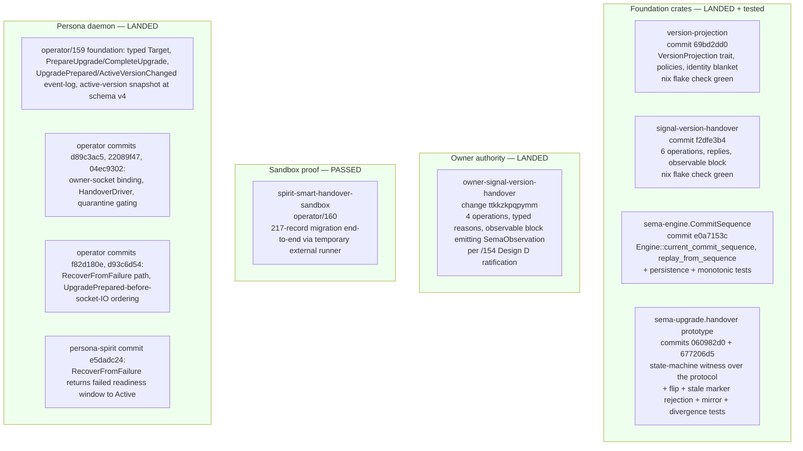
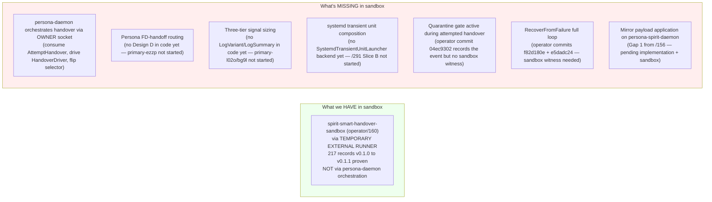

*Kind: Audit · Topic: Persona engine + version-handover stack state · Date: 2026-05-23*

# 157 — Audit: engine stack state before constraint + integration beads

*Per psyche 2026-05-23: audit all work done so far, then file beads
at the end for operators to bring more code into constraint and
end-to-end sandboxed engine testing (intent record 256). Acts on
the delegation pattern in intent record 255 — ratify high-confidence
designer recommendations and proceed.*

## §1 Frame

The Persona engine push has produced a large stack of landed code +
contracts + reports in the last 48 hours. This audit walks the
stack from foundation crates outward, classifies each surface by
(a) what's solid, (b) what lacks constraint tests, (c) what lacks
end-to-end sandbox coverage, (d) what's incomplete, (e) what's
obsolete or stale. The audit ends with a recommended bead-filing
slate (§9) split between operator-side constraint-tightening and
integration-coverage work.

Audit scope:
- Foundation crates: `version-projection`, `signal-version-handover`,
  `sema-engine` (CommitSequence), `sema-upgrade` (handover prototype),
  `owner-signal-version-handover`
- Persona daemon side: manager messages, event-log variants,
  active-version snapshot, owner socket binding, HandoverDriver,
  quarantine gating, RecoverFromFailure
- persona-spirit daemon side: private upgrade socket, protocol
  handlers, RecoverFromFailure state transition
- Signal-frame three-tier sizing (just-beaded, not yet implemented)
- Design D routing (just-beaded, not yet implemented)
- ARCH files: persona, signal-persona, sema-upgrade, persona-spirit,
  version-projection, signal-version-handover, sema-engine
- Workspace files: AGENTS.md, ESSENCE.md, INTENT.md, skills/
- Intent records 217-259

Out of audit scope:
- Pi-track work (third-designer/20, cluster-operator/6) — parallel
  thread, separate audit warranted
- Bird-on-Zeus update authority (cluster-operator)
- Migrations for non-Spirit components (criome, lojix, …) — tracked
  separately under intent 217's component-migration push

## §2 What landed and is solid

These surfaces have:
- Cargo tests passing per the operator reports that landed them
- Nix flake check green per the operator reports
- Architectural truth tests at the per-crate level (commit_sequence
  monotonicity, projection-error categories, marker-mismatch
  rejection, etc.)
- ARCHITECTURE.md updates aligned per /289 + my sub-agent sweep

## §3 What landed but lacks constraint tests

Constraint tests = architectural-truth tests per
`skills/architectural-truth-tests.md` — tests that catch
architectural drift, not just regression. The following surfaces
have working code + functional tests but lack constraint tests that
would surface design violations:

| Surface | Missing constraint test | Why it matters |
|---|---|---|
| `owner-signal-version-handover` `ForceFlip` / `Rollback` / `Quarantine` | Constraint: ForceFlip/Rollback MUST NOT forge a marker-backed handover fact (ARCH §"Constraints" item 3 says this is mandatory) | Without a constraint test, a future implementation change could silently make ForceFlip indistinguishable from a normal handover in the event log |
| Persona `ActiveVersionChangeSource` enum | Constraint: all three sources (HandoverMarker, ForceFlip, Rollback) project uniformly through one `ActiveVersionChanged` variant | Per /152 sub-report 1 — designer chose uniform reducer over separate variants; constraint test should witness this in the schema |
| Persona quarantine gating | Constraint: any handover attempt MUST scan the event log for `VersionQuarantined` first (per operator commit `04ec9302`) | Without a constraint test, the gate could be silently bypassed on a refactor |
| sema-engine `CommitSequence` | Constraint: failed commits do NOT advance the counter, AND advancement persists across reopen | These are in operator/158's test list but may not be expressed as constraint tests with explicit failure modes |
| version-projection `Identity` blanket impl | Constraint: every type T with `impl VersionProjection<T, T>` returns the input unchanged | Trivial but worth witnessing — protects future refactors |
| Mirror in `signal-version-handover` | Constraint: rejected mirror payloads must produce typed `Divergence` records (not silent drop) | Per /285 §9 — handles representable/non-representable distinction at the protocol boundary |
| Persona event-log replay → snapshot rebuild | Constraint: replaying the full event log into a fresh manager store rebuilds the active-version snapshot identically | Persona's "snapshots are projections of the event log" discipline — constraint test makes this auditable |

Each gap = one constraint test = ~30 lines of Rust + one Nix
check. None are large. Filing beads in §9 below.

## §4 What landed but lacks end-to-end sandbox coverage

End-to-end sandbox = Nix-flake-runnable integration test that
exercises the full daemon-to-daemon path with real binaries on
real sockets:

Each missing-sandbox row is the natural integration test for the
landed code. Most are ~50-150 lines of Nix module + a small launcher
binary + assertion code, following the pattern of operator/160's
sandbox. Bead filing in §9.

## §5 What's incomplete (specific gaps already tracked)

These are KNOWN gaps with active beads:

| Surface | Status | Bead |
|---|---|---|
| Mirror payload application on persona-spirit-daemon | Pending; lives in sema-upgrade sandbox only | not yet beaded — file as `[Mirror payload application on persona-spirit-daemon]` (P1, blocks primary-x3ci) |
| Spirit v0.1.0 protocol-aware retrofit | Pending (Path A ratified) | `primary-wdl6` (just filed) |
| Selector-flip-aware routing in Design D | Folded into primary-ezzp by intent 258 | `primary-ezzp` (existing bead, body updated this turn) |
| ComponentName rename | Pending | `primary-g81p` (just filed) |
| LogVariant trait + derive macro | Pending | `primary-l02o` |
| LogSummary trait + size check | Pending | `primary-bg9l` |
| signal_channel! subscription tier extension | Pending; depends on primary-l02o + primary-bg9l | `primary-b86d` |
| SemaObservation LogVariant impl | Pending; depends on primary-l02o | `primary-2py5` |
| Persona FD-handoff infrastructure | Pending | `primary-ezzp` |
| Component daemon SCM_RIGHTS receive loop | Pending | `primary-x5ba` |
| persona-spirit Design D smoke test | Pending; depends on ezzp + x5ba | `primary-ak4g` |
| persona-spirit cutover to v0.1.1 | Pending | `primary-x3ci` (blocked by wdl6 + ezzp + x5ba + ak4g + more) |
| Persona engine epic | Active; operator on it | `primary-a5hu` |
| Persona port to current Signal stack | Active | `primary-wvdl` (Tracks A + B) |
| Persona-side Axis 2 rename (~242 occurrences) | Tracked | `primary-wvdl` Track B item 8 |
| Quarantine policy gate (enforce, not just record) | Pending | not yet beaded — file as `[Quarantine policy gate in Persona]` (P2; can bundle with constraint tests in §3) |
| persona-mind deployment | Pending; sema-upgrade prereq met | `primary-e1pm` (existing) |
| persona-orchestrate executor migration | Closed by second-operator | `primary-c620` (closed) |
| Three missing owner-signal repos (harness, message, system) | Pending | not yet beaded — file 3 as P3 |
| persona-introspect three-tier storage | Pending; depends on primary-b86d | not yet beaded — file as P2 once tier traits land |

## §6 What's obsolete or stale (cleanup needed)

Reports + references that should retire:

- `reports/designer/280-session-handover-2026-05-22.md` — dropped
  per /286 context-maintenance sweep; substance preserved elsewhere
- `reports/designer/284-per-type-migration-trait-specification.md` —
  dropped per /286 (superseded by /285 — `VersionProjection`)
- References to /280 + /284 in other lanes' reports
  (`third-designer/19`, `cluster-operator/5`, `second-operator/165`)
  — left for those lanes to refresh; not my edit surface
- /152 sub-report 9 §6 had stale text "Close (recommend) primary-7kge"
  — corrected in-line earlier this session

Recently-closed beads (per second-operator's most recent update):
- `primary-gjs5` (signal-sema Magnitude Unknown ARCH update) —
  shipped at signal-sema commit `9968ffad`
- `primary-qk04` (multi-version persona-spirit daemon coexistence)
  — shipped/re-verified
- `primary-77hh` (signal_channel prefix cleanup) — absorbed into
  triad migration beads
- `primary-d5im` (CriomOS-home Whisrs stale-widget) — shipped at
  CriomOS-home `a99a43d8`
- `primary-7kge` (owner-signal-version-handover create) — closed
  by operator/162 (referenced in /152 + /153)
- `primary-chpq` (Spirit default wrapper dual-writes) — closed by
  second-operator/170 as superseded by smart handover
- `primary-k2mh` (Persona engine-manager triad migrate) — closed
  this session as duplicate of `primary-wvdl`

primary-094p (verify /214 Criome arch substance) commented by
second-operator as "not closeable yet — real architecture gaps
remain". Leave for prime designer pickup.

## §7 Audit of recently-closed beads (cross-reference solidity)

Spot-checking what second-operator closed to confirm the closure
is sound:

| Bead | Closed because | Verified? |
|---|---|---|
| `primary-gjs5` | shipped at signal-sema `9968ffad` (Magnitude Unknown ARCH doc) | Trust operator's nix-flake-check-green claim; if a regression surfaces, ARCH doc test catches it |
| `primary-qk04` | shipped + re-verified | Coexistence shape exists per second-operator/170; cutover freshness moved to primary-x3ci |
| `primary-77hh` | absorbed into triad migration beads | Confirmed by operator commit at signal-frame `653773b` (referenced in primary-k2mh body); consumers carry the work into their cargo-bumps |
| `primary-d5im` | shipped at CriomOS-home `a99a43d8` | Trust; not engine-stack scope |
| `primary-7kge` | shipped (owner-signal-version-handover) | Confirmed by operator/162 + my /152 sub-report 7 audit + ARCH file present at the repo |
| `primary-chpq` | superseded by smart handover (intent 203) | Sound per design history |
| `primary-k2mh` | duplicate of `primary-wvdl` with info preserved per intent 229 | I did this closure with explicit info preservation in primary-wvdl comment |

All closures appear sound. No re-open recommendations.

## §8 Workspace-file audit (skills, AGENTS.md, ESSENCE.md, INTENT.md)

Updates landed this session:

- `AGENTS.md` — meta-report directory pattern (intent 231) + per-response report shape (intent 232) + possible auditor role (intent 234/235, Medium certainty carry-uncertainty) + headless jj rule (intent 237). All in §"Reports go in files", §"Roles", §"Hard overrides".
- `ESSENCE.md` — intent-and-design dance (intent 233).
- `INTENT.md` — same dance + possible auditor.
- `skills/reporting.md` — standard agent behavior (intent 232) + meta-report directories (intent 231).
- `skills/role-lanes.md` — already in mirror model framing; no updates needed.

Coherence check:
- `AGENTS.md` and `ESSENCE.md` agree on the design/intent dance framing
- `AGENTS.md` headless-jj rule aligns with `skills/jj.md` §"Never let jj open an editor"
- `AGENTS.md` meta-report directory rule aligns with `skills/reporting.md` §"Meta-report directories"
- `AGENTS.md` auditor mention is consistent with intent 234/235's Medium certainty

No drift detected. Workspace files are aligned.

## §9 Bead filing recommendations

Per intent 256: audits feed into bead filing focused on (a)
bringing code into constraint and (b) end-to-end sandboxed engine
testing.

The beads filed at the end of this audit (after this report
commits) are listed here for forward reference:

### §9.1 Constraint-tightening beads (operator-shaped)

| # | Title | Priority | Why |
|---|---|---|---|
| C1 | owner-signal-version-handover constraint test — ForceFlip/Rollback must not forge marker-backed handover facts | P2 | ARCH constraint becomes architectural truth test |
| C2 | Persona constraint test — ActiveVersionChangeSource projects uniformly into ActiveVersionChanged variant | P2 | Designer choice (uniform reducer over separate variants) gets witnessed |
| C3 | Persona constraint test — handover attempt scans event log for VersionQuarantined before any state change | P2 | Quarantine gate becomes auditable; pairs with Quarantine policy gate enforcement |
| C4 | Persona event-log → active-version snapshot rebuild constraint test | P2 | Event log is the authority; snapshot is a projection |
| C5 | signal-version-handover constraint test — rejected Mirror payloads must produce typed Divergence records | P2 | Per ARCH "no silent drops" discipline |
| C6 | version-projection constraint test — Identity blanket impl returns input unchanged for every T | P3 | Trivial but durable |
| C7 | Quarantine policy gate enforcement in Persona (turn event into gate) | P2 | Required before owner socket exposes to real client |

### §9.2 End-to-end sandboxed engine testing beads (operator-shaped)

| # | Title | Priority | Why |
|---|---|---|---|
| E1 | End-to-end sandbox — persona-daemon orchestrates Spirit handover (replaces temporary external runner) | P1 | The bridge from operator/160's sandbox to production Spirit cutover |
| E2 | End-to-end sandbox — quarantine gate prevents attempted handover | P2 | Witnesses C3 + C7 together |
| E3 | End-to-end sandbox — RecoverFromFailure returns daemon to Active after failed completion | P2 | Witnesses operator commits f82d180e + e5dadc24 in integration |
| E4 | End-to-end sandbox — Persona FD-handoff with selector flip (Design D + selector-flip routing) | P1 | Integration witness for primary-ezzp + primary-x5ba + primary-ak4g chain |
| E5 | End-to-end sandbox — three-tier subscription delivery (LogVariant + LogSummary + full record) | P2 | Integration witness for primary-l02o + primary-bg9l + primary-b86d + primary-2py5 chain |

### §9.3 Other gap-closing beads identified in audit

| # | Title | Priority | Source |
|---|---|---|---|
| O1 | Mirror payload application on persona-spirit-daemon | P1 | /156 Gap 1; blocks primary-x3ci |

Beads filed at the end of this report (in a follow-on bash call,
not inline above to keep audit readable).

## §10 See also

- `reports/second-designer/152-persona-engine-architecture-overview/`
  — meta-directory with sub-reports 1-9 (the broader engine-stack
  context this audit builds on)
- `reports/second-designer/153-refresh-after-prime-systemd-followups-2026-05-22.md`
- `reports/second-designer/154-effect-emitted-and-public-routing-designs-2026-05-22.md`
- `reports/second-designer/155-three-tier-signal-sizing-and-lossless-routing-2026-05-22.md`
- `reports/second-designer/156-most-important-gaps-2026-05-23.md`
- `reports/designer/285-versionprojection-trait-and-handover-protocol-specification.md`
- `reports/designer/286-session-audit-2026-05-22.md`
- `reports/designer/287-version-handover-component-explained.md`
- `reports/designer/289-arch-distribution-from-287-2026-05-22.md`
- `reports/designer/291-persona-systemd-units-for-daemon-management.md`
- `reports/operator/158-version-handover-foundation-implementation-2026-05-22.md`
  through `reports/operator/163-persona-systemd-component-management-position.md`
- `reports/second-operator/170-refresh-and-action-after-persona-systemd-followups-2026-05-22.md`
- `skills/architectural-truth-tests.md` (the discipline behind §9.1)
- `skills/testing.md` (Nix-flake-check pattern behind §9.2)
- Spirit records 217-259 (this session's full intent layer)
