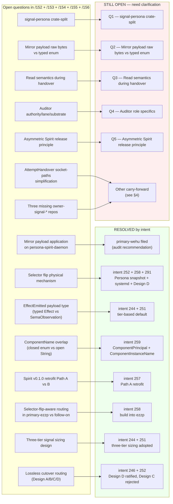
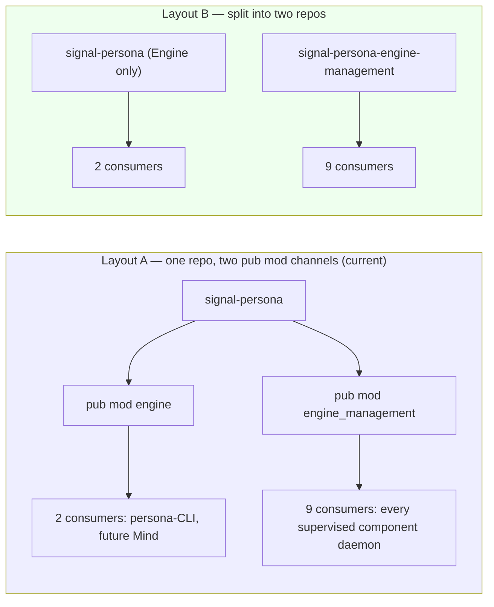
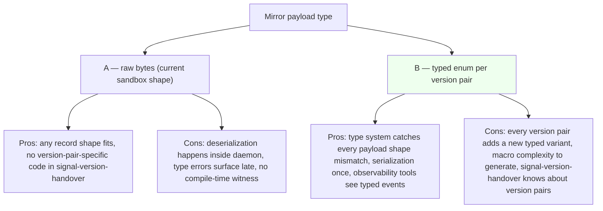
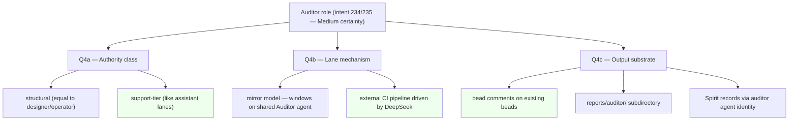
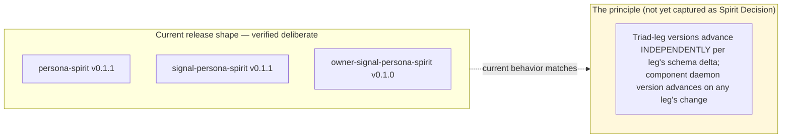

*Kind: Design status + intent-clarification surface · Topic: open-question resolution + remaining needs · Date: 2026-05-23*

# 158 — Open-question resolution + remaining intent-clarification needs

*Per psyche 2026-05-23: see if any open questions were resolved by
intent, do context maintenance, then bring forward the most
important needs for intent clarification with visuals + proposed
solutions.*

# §1 Frame + scan method

The previous design reports (`/152` sub-report 9 §4, `/153` §5,
`/154` table, `/155` §1.9 + §2.9, `/156` §10) accumulated ~30 open
questions across the Persona engine push. This report:

1. **§2 Resolution map** — visual + table showing which questions
   are resolved by which Spirit records (217-259).
2. **§3 Top-priority remaining** — 5 most important still-open
   questions with visuals + proposed solutions.
3. **§4 Carry-forward** — lower-priority remaining (designer-leans
   recorded for later capture).
4. **§5 Bead recommendations** — what files next if §3 ratifies.

Light context maintenance landed in this same turn: status banners
added to `/154` (Q1 + Q2 both ratified) and `/156` §10 (Gaps 2/3/5
ratified, Gaps 4/8 held).

# §2 Resolution map



Resolution count: **8 major questions resolved** by intent records
244, 246, 251, 252, 257, 258, 259 plus the cross-cutting bead
filings. The five most-important remaining are detailed in §3
below.

# §3 Top-priority still-open questions with proposed solutions

## §3.1 Q1 — `signal-persona` crate-split (Layout A vs B)

### Problem visual



### Context

The Axis 2 rename landed contract-side (`signal-persona` now exposes
`EngineManagement*` names). Persona daemon side is ~242
`supervision_*` occurrences pending in 6 files (under `primary-wvdl`
Track B item 8). BEFORE the next consumer cascade, this question
needs an answer.

Asymmetry of consumers (2 vs 9) is the load-bearing argument toward
Layout B. Cost of staying Layout A is 9 consumers carry an unused
Cargo dep; cost of switching to B is one extra repo + the Axis 2
rename becomes split-plus-rename.

### Designer-proposed solution

**Layout B — split EngineManagement into its own repo.** Reasons:
- Consumer-set asymmetry (2 vs 9) is structural; recurring dep
  hygiene wins
- EngineManagement evolves at its own cadence (independent
  versioning available if needed)
- The Axis 2 rename is in flight anyway — bundle the split into
  the same operator pass
- One-time split cost retires; dependency-narrowing benefit is
  recurring

### If ratified, file as

`[signal-persona crate-split execution: extract signal-persona-engine-management]`,
P2, depends on Axis 2 rename completion under `primary-wvdl`
Track B item 8.

## §3.2 Q2 — Mirror payload raw bytes vs typed enum

### Problem visual



### Context

`signal-version-handover` `Mirror` operation currently carries a
raw-bytes payload (per /285 §9 + operator/158). The sandbox uses
this shape. /285 lists "Mirror payload bytes vs typed enum" as an
open Possible-feature. Future cutovers compose with whatever shape
gets chosen.

### Designer-proposed solution

**Start with raw bytes (current shape) for first cutover; defer
typed-enum decision until second component handover surfaces the
need.** Reasons:
- First-cutover blocker is the daemon-side handler (`primary-wehu`
  Mirror payload application), not the payload type
- Premature typing locks signal-version-handover into version-pair
  awareness; the contract is currently signal-only / version-pair-blind
  (clean separation from `version-projection`)
- Once second component cutover lands, we'll know whether typed
  enums add enough value to justify the macro complexity

### If ratified, file as

Status capture only — no bead needed. Capture as Spirit Decision
(Medium): "Mirror payload remains raw bytes for first-cutover
prototype; typed-enum question stays open pending second-component
cutover evidence."

## §3.3 Q3 — Read semantics during handover window

### Problem visual

```mermaid
sequenceDiagram
    participant C as Client
    participant V0 as v0.1.0 (current, in HandoverMode)
    participant V1 as v0.1.1 (next, in StateCopy)
    participant P as Persona

    Note over V0: HandoverMode — public writes paused
    Note over V1: copying state up to commit_sequence N

    C->>P: read request via stable socket
    Note over P: ???<br/>(this is the open question)

    P -->|"Option A"| V0
    Note over V0: serve read from snapshot at N<br/>(serves the freshest writable state)

    P -->|"Option B"| V1
    Note over V1: serve read from V1's projection<br/>(serves the next-version view)

    P -->|"Option C"| Block["block until V1 active"]
    Note over Block: ~10ms-100ms gap, safer correctness
```

### Context

The handover protocol freezes WRITES on v0.1.0 during the cutover
window. Reads during this window are unaddressed in the contract
(per operator/158 §"Open design pressure" — Read semantics not yet
implemented). The choice affects read-heavy components more than
write-heavy ones.

For Spirit (current first cutover): reads are infrequent + idempotent,
so the answer barely affects user-visible behavior. For future
read-heavy components (persona-mind once deployed) the answer
matters.

### Designer-proposed solution

**Option A — reads continue against v0.1.0's frozen snapshot during
the handover window.** Reasons:
- v0.1.0's snapshot at commit_sequence N is the most authoritative
  view of the data the client expects to read
- v0.1.1's projection might be incomplete during state copy
- Blocking (Option C) introduces user-visible latency in the
  cutover window — defeats the no-downtime story
- After handover completes + selector flips, reads naturally
  shift to v0.1.1 per Design D routing

This composes with Design D: during handover, Persona keeps routing
client FDs to v0.1.0 daemon for reads + new client connections;
the freeze only applies to public WRITES. Both happen on the same
socket.

### If ratified, file as

`[Read semantics during handover — Option A: continue against
v0.1.0 snapshot]`, P2; constraint test that reads complete during
the handover window without error. Also a follow-on to
`primary-wehu` (Mirror payload application — symmetric write-side
implementation).

## §3.4 Q4 — Auditor role specifics

### Problem visual



### Context

Intent 234 (auditor as third role) + 235 (DeepSeek automates it)
are Medium-certainty proposals from psyche. `AGENTS.md` already
carries a carry-uncertainty mention; no `skills/auditor.md` yet.
The three sub-questions block the role's concrete definition.

### Designer-proposed solution

**Minimum-viable auditor as support-tier external CI with bead
comment output** (highlighted in green above):

- **Q4a → support-tier (Q1B)**: auditor flags rule violations, doesn't decide
  architecture; support-tier authority class matches that scope
- **Q4b → external CI pipeline (Q2B)**: DeepSeek-as-auditor runs on commits / report
  writes / bead closes; doesn't need to be a window on a shared
  Auditor agent until the role's authority grows
- **Q4c → bead comments (Q3A)**: most actionable; surfaces in operator's
  `bd ready` queries; reuses existing bead infrastructure

Staging order:
1. Pick a single concrete audit ("AGENTS.md hard-override violation
   checker in jj commit messages")
2. Run it manually first; capture rules + heuristics in
   `skills/audit-*.md`
3. Automate with DeepSeek as background process
4. Output as bead comments
5. Upgrade authority class / lane mechanism only if and when the
   audit surfaces structural decisions

### If ratified, file as

`[Auditor minimum-viable first pass: AGENTS.md hard-override
violation checker via DeepSeek, output as bead comments]`, P2.

## §3.5 Q5 — Asymmetric Spirit release principle formalization

### Problem visual



### Context

`/152` sub-report 6 verified the asymmetric release as deliberate
— `owner-signal-persona-spirit` has zero `Magnitude` / `Certainty`
references, so bumping it would be ancestry-carrying versioning
(intent 70 + naming.md). The PRINCIPLE this surfaces is workspace-wide
and not yet captured.

### Designer-proposed solution

**Capture as Spirit Principle (Maximum certainty)** with the wording:

> Triad-leg versions advance INDEPENDENTLY per leg's schema delta;
> component daemon version advances on ANY leg's change. Each
> `signal-X` and `owner-signal-X` repo carries its own semver
> based on its own schema evolution.

Once captured, the principle informs every future component-triad
versioning decision; consumers of any triad leg know each leg's
version is independent.

### If ratified, file as

No bead — just Spirit Decision capture. Then add a brief paragraph
to `skills/component-triad.md` referencing the principle.

# §4 Carry-forward (lower-priority remaining)

These remain open but are lower stakes — designer leans recorded
for capture when the priority bubble surfaces them:

| Question | Designer lean | Block radius |
|---|---|---|
| `AttemptHandover` socket-paths-in-body simplification | Shrink once Persona has a component-version catalog | None now; cosmetic post-prototype |
| `HandoverSucceeded.commit_sequence` newtype | Wrap in transparent newtype from `sema-engine::CommitSequence` | Cosmetic |
| `UnimplementedReason::IntegrationNotLanded` retirement | Remove after Spirit cutover proves end-to-end | Post-cutover cleanup |
| Three missing owner-signal-* repos (harness, message, system) | File 3 P3 beads when parent daemon work begins | Owner-tier completeness for those components |
| sema-upgrade self-upgrade bootstrap | Hand-written for first production migration | Sema-upgrade self-deploy |
| Divergence sink location for prototype | In-memory until persona-introspect ships | Failure-log audit |
| Persona-restart resilience | Deferred; via systemd socket activation if needed later | Persona uptime story |
| Mind channel-choreography verbs (/249 Gap #1) | Designer specification needed; deferred per intent 204 | Mind integration depth |
| persona-listen / persona-speak 11 questions | Parked per intent 166; designer-pivot to /249 gap closure | New-component design |
| persona-llm-client design | Parked per intent 166 | New-component design |
| Persona ARCH headline reframing (engine-manager vs upgrade-orchestrator) | Pending psyche | ARCH coherence |

# §5 Bead recommendations if §3 ratifies

If psyche ratifies the five §3 designer leans, the following beads
land in one batch (mirroring the audit-then-bead pattern from
intent 256):

| Bead | From | Priority | Depends on |
|---|---|---|---|
| `[signal-persona crate-split execution]` | Q1 | P2 | Axis 2 rename completion (primary-wvdl Track B item 8) |
| `[Mirror payload type Spirit-Decision capture]` | Q2 | not a bead — just Spirit Decision |  |
| `[Read semantics during handover — Option A constraint test + handler]` | Q3 | P2 | primary-wehu (Mirror payload application) |
| `[Auditor MVP — AGENTS.md hard-override checker via DeepSeek]` | Q4 | P2 | psyche ratification of staging |
| `[Triad-leg-independent versioning Spirit Principle capture + skills/component-triad.md update]` | Q5 | not a bead — just Spirit Principle + skill edit |

Three are actual beads; two are Spirit-Decision captures + small
documentation tasks.

# §6 See also

- `reports/second-designer/152-persona-engine-architecture-overview/`
  — original open-question catalogue (sub-report 9 §4)
- `reports/second-designer/153-refresh-after-prime-systemd-followups-2026-05-22.md`
  — first carry-forward status table
- `reports/second-designer/154-effect-emitted-and-public-routing-designs-2026-05-22.md`
  — status banner updated this turn (Q1 + Q2 ratified)
- `reports/second-designer/155-three-tier-signal-sizing-and-lossless-routing-2026-05-22.md`
  — Part 1 + Part 2 ratified via intents 244/251/252
- `reports/second-designer/156-most-important-gaps-2026-05-23.md`
  — §10 status banner updated this turn (Gaps 2/3/5 ratified)
- `reports/second-designer/157-audit-engine-stack-state-before-constraint-and-integration-beads-2026-05-23.md`
  — audit + 16 new beads filed
- Spirit records 217-259, especially: 244 (three-tier sizing), 246
  (Design C rejected), 251 (Part 1 leans adopted), 252 (Design D
  ratified), 255 (delegation pattern), 256 (audits feed beads), 257
  (Path A), 258 (selector-flip into ezzp), 259 (ComponentName rename)
- Beads filed in /157 + this turn: see /157 §9 + chat trail
