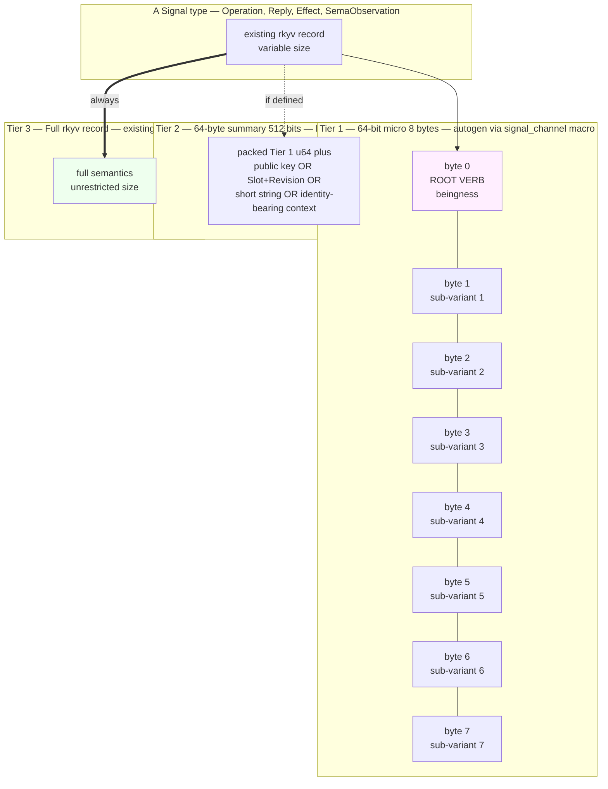

*Kind: ARCH manifestation · Topic: signal 64-bit verb-namespace · Date: 2026-05-23*

# 1 — Signal 64-bit verb-namespace + extended 64-byte tier — ARCH manifestation

## What this slice is

The psyche refined the three-tier signal sizing baseline (Spirit
records 244 + 251) with a specific 64-bit verb-namespace structure
(record 271 — byte 0 root verb plus seven bytes 1-7 sub-variants,
eight enums total, verb-space itself a single enum), universal data
sub-variants pre-allocated across namespaces (record 272 — `U8`,
`U16`, possibly more), and an extended 64-byte / 512-bit tier for
identity-bearing payloads (record 273 — Criome authorization
payload is canonical). This slice manifests all four records into
the two ARCH files that own the discipline.

The split: `signal-frame/ARCHITECTURE.md` owns the cross-cutting
structure (traits, macro autogen, universal sub-variants, three
subscription tiers). `signal-sema/ARCHITECTURE.md` owns the
worked SemaObservation case (Tier-2-shaped by nature, verb-namespace
shape applied, universal-data-variant usage example).

## Workspace files changed

| File | jj change | Commit | Description |
|---|---|---|---|
| `/git/github.com/LiGoldragon/signal-frame/ARCHITECTURE.md` | `zxvzzpwz` | `2313c5ed` | new §5 (three-tier signal sizing + verb-namespace structure), §6/§7 renumbered |
| `/git/github.com/LiGoldragon/signal-sema/ARCHITECTURE.md` | `yoplqlpm` | `1604cceb` | new "SemaObservation as a Tier-2-shaped type" section inserted before §"Boundary" |

Both commits pushed to origin/main.

## Diagram — bit layout + tier progression

The reusable visual for the meta-overview:

Three audiences (hot indexer at Tier 1, auditor / introspect at
Tier 2, replay / Mind at Tier 3) drive three projections; producer
emits each on demand based on per-tier subscriber count. The
verb-namespace structure makes Tier 1 indexes particularly
efficient — group-by-byte-0 gives the root-verb histogram in a
single linear scan.

## Beads filed or updated

No new beads filed in this slice. The two existing beads that this
ARCH manifestation enables tracking are:

- `primary-l02o` — signal-frame: LogVariant trait + autogen derive
  macro. P1 OPEN. The macro implementation work referenced from
  signal-frame/ARCHITECTURE.md §5.10. This bead is now grounded by
  ARCH text describing exactly what the macro emits.
- `primary-2py5` — signal-sema: LogVariant impl for SemaObservation
  (first canonical case). P2 OPEN. The hand-implementation work
  referenced from signal-sema/ARCHITECTURE.md "Open follow-ons".
  This bead is now grounded by the verb-namespace shape diagram
  and the illustrative byte assignments.

## Open follow-ons

- **Specific universal-data-variant set beyond `U8` / `U16`.**
  Spirit record 272 leaves room for "possibly more primitive types"
  but does not enumerate them. New universals land as concrete
  cross-component needs surface. Candidates the ARCH text does NOT
  yet commit to: `U32` (timestamp seconds, sequence counters),
  `U64` (full timestamps, hashes-of-hashes), small fixed-size byte
  arrays (`[u8; 4]` for IPv4 addresses, `[u8; 16]` for UUID-shaped
  IDs). Worth a designer-lean capture once a second concrete user
  surfaces.
- **Workspace-wide root-verb registry mechanism.** Currently each
  channel's root verbs are namespace-local enum variants. A future
  cross-namespace vocabulary catalog (so `Tap` always means `Tap`
  regardless of channel) is not specified. The verb-namespace rule
  per Spirit record 271 says "verbs unify across namespaces"
  implying a shared catalog, but the mechanism — central enum
  imported by every channel? convention with collision checking?
  generated from a manifest? — is undecided. Worth a dedicated
  bead.
- **Final byte-layout choice for SemaObservation Tier 1.** The
  signal-sema ARCH §"Verb-namespace shape applied to
  SemaObservation" lays out an illustrative byte assignment (sema
  kind, outcome, component, operation class, extra, 24-bit timing
  suffix). The bead `primary-2py5` author chooses whether to spend
  the trailing bytes on timestamp seconds, a sequence number, a
  third universal data variant, or split between them.
- **`SemaObservation` component-identity field.** The byte-2
  "component" tag in the SemaObservation Tier 1 packing implies a
  `ComponentKind` enum (or successor). That type does not currently
  live in `signal-sema`. The integration point is the
  `primary-2py5` author's design choice — pull `ComponentKind` from
  wherever the workspace catalog ends up (likely under
  `signal-frame` or a sibling utility crate).
- **`LogVariant`/`LogSummary` trait module location.** The ARCH
  text places both traits in `signal-frame`. The macro autogen
  lives in `signal-frame-macros`. The const-generic size check for
  Tier 2 needs careful placement to avoid pulling rkyv into
  `signal-frame`'s public surface beyond what's already there.
  Operator detail under `primary-l02o`.

## How it fits

- **Sub-report 2 (component binary naming)** — establishes how the
  same component-shape principle ("CLI is `<component>`, daemon is
  `<component>-daemon`") that names binaries also names the
  contract crates that own these signal channels. The verb-namespace
  per channel inherits the component name through `signal-<component>`.
- **Sub-report 3 (Mirror raw container)** — the
  `signal-version-handover` `Mirror` operation carries raw-bytes
  payload outside the typed database (Spirit record 274). Mirror
  payload bytes are NOT a Tier 1 / Tier 2 / Tier 3 case — they sit
  in a separate raw-bytes container precisely because they're
  un-incorporated. The three-tier discipline applies to TYPED
  signal records; Mirror is the explicit exception.
- **Sub-report 5 (persona-mind agent-error events)** — once
  persona-mind ships, agent errors (mermaid syntax, NOTA formatting,
  naming violations, etc.) log into Mind as typed events (Spirit
  record 275). Those typed event records sit on top of this
  three-tier sizing: their `LogVariant` Tier 1 projection gives
  per-error-kind histograms for skill-improvement loops, their
  Tier 2 summary carries enough fidelity for the auditor agent to
  follow patterns, and Tier 3 is the full event record for Mind's
  full semantic intake.
- **Sub-report 6 (operator work audit)** — the operator's recent
  work in `signal-frame` (commit `8ccaffd6` normalize persona cli
  environment stems) and `signal-sema` (commit `9968ffad` document
  magnitude unknown widening) compose with this ARCH section
  without conflict — the additions are pure documentation and do
  not touch operator-owned implementation surfaces.

## See also

- `/git/github.com/LiGoldragon/signal-frame/ARCHITECTURE.md` §5
  (this slice's primary landing surface)
- `/git/github.com/LiGoldragon/signal-sema/ARCHITECTURE.md`
  "SemaObservation as a Tier-2-shaped type" section
- `reports/second-designer/155-three-tier-signal-sizing-and-lossless-routing-2026-05-22.md`
  Part 1 §1.1-§1.9 (original design)
- `reports/second-designer/158-open-question-resolution-and-remaining-clarification-needs-2026-05-23.md`
  (resolution map showing intent 244 + 251 ratified Part 1)
- Spirit records 244, 251, 271, 272, 273 (the intent capture
  trail manifested by this slice)
- Beads `primary-l02o` (signal-frame: LogVariant trait + autogen
  derive macro) and `primary-2py5` (signal-sema: LogVariant impl
  for SemaObservation)
