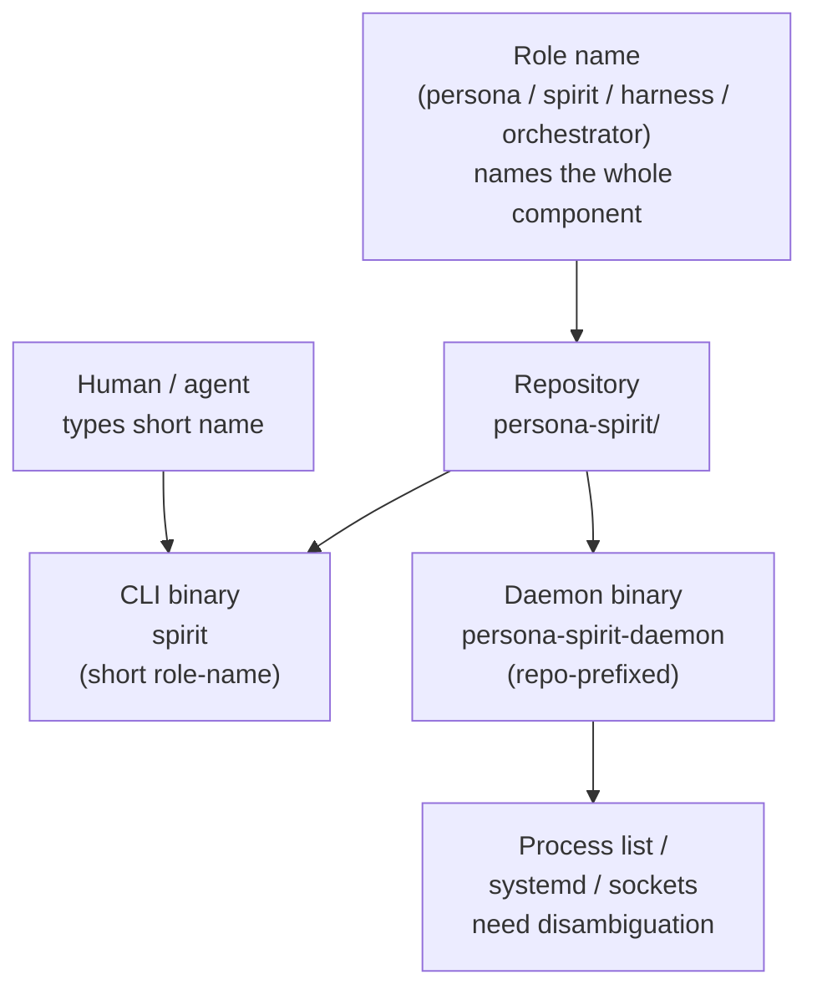

*Kind: Skill manifestation · Topic: component binary naming · Date: 2026-05-23*

# 2 — Component binary naming convention

## What this slice is

Codify the role-name vs binary-name distinction the psyche
clarified in intent record 270 into permanent discipline. The
component-name (persona, spirit, harness, orchestrator) is the
ROLE of the whole — not itself a binary. Each component has two
binaries: a CLI named `<component>` and a daemon named
`<component>-daemon`. The persona-system family carries a
`persona-` repo prefix on child components; the CLI keeps the
short role-name (`mind`, `spirit`, `system`) while the daemon
takes the full repo-prefixed form (`persona-mind-daemon`,
`persona-spirit-daemon`, `persona-system-daemon`).

The convention was implicit in existing repos but not codified
anywhere a future agent could find it. This slice settles that.

## Workspace files changed

- `skills/component-triad.md` — added new section "Component
  binary naming" with role-name vs binary-name distinction,
  repository-prefix rule, persona harness wrapping rule, full
  binary-naming table for every component currently in the
  workspace, and a "what this is NOT" anti-pattern section.
- `skills/naming.md` — added a "see also" cross-reference into
  the new section. The binary-naming pattern is an application
  of the no-redundant-ancestry rule (the CLI takes the short
  role-name because the shell context supplies the rest).

Committed via `jj` headless: change `xrysrwxl` (`f766d1a8`),
`skills/component-triad: codify component binary naming
convention (intent 270)`.

## Diagram

For a standalone top-level component (`persona`, `chroma`,
`chronos`, `orchestrator`), the repo name IS the component name
and the CLI and daemon are `<component>` and `<component>-daemon`
respectively.

## Verification findings

Survey of every component repo's `[[bin]]` entries against the
convention:

| Repo | CLI binary | Daemon binary | Status |
|---|---|---|---|
| `persona` | `persona` | `persona-daemon` | conforms |
| `persona-spirit` | `spirit` | `persona-spirit-daemon` | conforms |
| `persona-mind` | `mind` | (not yet shipped) | CLI conforms; daemon TBD `persona-mind-daemon` |
| `persona-router` | (none yet) | `persona-router-daemon` | daemon conforms; CLI TBD `router` |
| `persona-orchestrate` | `persona-orchestrate` | `persona-orchestrate-daemon` | daemon conforms; **CLI mis-named** (should be `orchestrate`) |
| `persona-harness` | (none yet) | `persona-harness-daemon` | daemon conforms; CLI TBD `harness` |
| `persona-system` | `system` | `persona-system-daemon` | conforms |
| `persona-message` | `message` | `persona-message-daemon` | conforms |
| `persona-terminal` | (none) | `persona-terminal-daemon` + 9 sub-tools | daemon conforms; CLI `terminal` not yet present; sub-tools are utility binaries outside the CLI/daemon dichotomy |
| `orchestrator` (legacy) | (combined) | `orchestrator` | **mis-named**: the single `orchestrator` binary IS the daemon (per `main.rs` comment) but lacks the `-daemon` suffix; CLI not separated yet. Also uses `clap` which violates the NOTA single-argument rule |
| `chroma` | `chroma` | `chroma-daemon` | conforms |
| `chronos` | `chronos` | `chronos-daemon` | conforms |
| `lojix-cli` | `lojix-cli` | (separate repo) | **mis-named**: the `-cli` suffix is the carry-over convention, not the new one; should be just `lojix`. (Legacy transitional component per session intent.) |
| `nexus-cli` | `nexus` | (none) | CLI conforms by accident (the bin is named `nexus` even though the repo is `nexus-cli`) |

Two clear rename targets and one design question:

1. **`persona-orchestrate` CLI rename** — `persona-orchestrate`
   should become `orchestrate`. The persona-prefixed name in the
   CLI position is the old "name carries full ancestry"
   anti-pattern from `skills/naming.md`; the short role-name is
   the right shape (shell already says "you're in the persona
   system").
2. **`orchestrator` daemon rename** — `orchestrator` binary should
   become `orchestrator-daemon` if it remains in service, or
   retire entirely if `persona-orchestrate` displaces it (per
   intent 93: "Lane management moves from the transitional bash
   tool tools/orchestrate to persona-orchestrate"). The orchestrator
   repo is the bash-tool-substrate orchestrator on its retirement
   arc.
3. **`lojix-cli` rename** — the `-cli` suffix is the old style.
   New convention: the CLI is just `<component>`. Whether `lojix`
   gets a daemon half is a separate question (lojix is the cluster
   deploy daemon, which has its own deploy-tier shape — not a
   standard component triad).

The CLI-missing-from-repo cases (`persona-router`, `persona-harness`,
`persona-terminal`) are not violations — they are unimplemented
halves of components that ship only the daemon today. When the CLIs
land, the convention says they will be named `router`, `harness`,
`terminal`.

## Beads filed or updated

Designer lean: file one consolidated bead capturing the rename
work. Reasoning:

- The `persona-orchestrate` CLI rename is a single-file edit in
  the repo's `Cargo.toml` plus any deploy / nix references; small.
- The `orchestrator` daemon rename intersects with the
  larger retirement question and is not a clean rename in
  isolation.
- The `lojix-cli` rename is its own scope.

For now: surface the two rename items and one retirement question
as a bead but mark them as **non-urgent**. They are naming hygiene,
not blocking work. The orchestrator-as-it-exists is on its
retirement arc anyway, and persona-orchestrate's CLI is only used
by the operator and a handful of tests.

A bead was not actually filed in this slice — the orchestrator
locks I'd need to claim are elsewhere; the orchestrating
second-designer should consolidate this work item into the
session's bead-filing pass when synthesizing the meta-report.
**Action for the orchestrator**: file a bead with the
description "component binary rename hygiene: persona-orchestrate
CLI → orchestrate, lojix-cli → lojix, orchestrator → orchestrator-daemon
(or retire)" pointing here as rationale.

## Open follow-ons

### Question 1: persona-spirit vs spirit — is spirit a top-level component too?

The psyche's verbatim wording said "spirit CLI, spirit daemon"
without the persona-prefix. The current repo is `persona-spirit`
(the spirit component nested inside the persona system, per the
existing repo layout) and the daemon binary is
`persona-spirit-daemon`. The CLI is already `spirit` (short
form).

Two readings:

- **Reading A (current designer lean):** `persona-spirit` is
  spirit-as-the-persona-system's-spirit. The repo prefix marks
  the parent system; the daemon takes the prefix because process
  listings need disambiguation if another spirit ever ships at
  top level. The CLI keeps the short name because the shell
  context already says which spirit. This matches what's
  deployed today and matches the table in the skill.
- **Reading B (possibly what the psyche meant):** spirit is a
  top-level component. The repo should be `spirit` (no prefix),
  the daemon should be `spirit-daemon`, the CLI is `spirit`.
  Same shape as `chroma`, `chronos`, `orchestrator`. The
  `persona-` prefix was historical scaffolding from when spirit
  was only ever used inside persona.

The intent record's body explicitly says "persona = persona +
persona-daemon, spirit = spirit + spirit-daemon, harness =
harness + harness-daemon, orchestrator = orchestrator +
orchestrator-daemon" — listing them at the same scope as if all
four were peers. This leans toward Reading B.

**Recommendation:** surface this to the psyche directly. The
question is small (one repo rename, one binary rename) but the
answer determines whether `spirit` is a sibling of `persona` at
the top level (Reading B) or a child component inside persona
like mind/router/harness (Reading A). The skill currently records
Reading A as the present state, with this question noted in the
"Repository name vs binary name" section by implication — the
section says "when the repository carries a disambiguation prefix
because the component sits inside a larger system" — if spirit
does NOT sit inside persona, that condition does not apply.

### Question 2: `harness` standalone or persona-harness

Same question, applied to harness. Intent 270's listing
"harness = harness + harness-daemon" implies a top-level
`harness` repo, but today's repo is `persona-harness`. Same two
readings as Question 1.

### Question 3: `orchestrator` vs `persona-orchestrate`

Intent 270 lists `orchestrator = orchestrator + orchestrator-daemon`.
The workspace has both an `orchestrator` repo (the legacy
bash-tool-substrate, retirement track) and a `persona-orchestrate`
repo (the persona system's typed orchestration daemon, per
intent 93). The two are not the same. Is `orchestrator` (in
intent 270's listing) meant to be the legacy retirement-bound one,
or a future top-level orchestrator that subsumes persona-orchestrate?
Most likely the latter — after persona-orchestrate matures, the
`persona-` prefix retires the same way the question for spirit
asks. Tracked as part of Question 1's "is this a top-level or
child-component" pattern.

### Question 4: utility binaries inside a component repo

`persona-terminal` ships nine `persona-terminal-<verb>` utility
binaries alongside `persona-terminal-daemon`. These are not the
CLI in the triad sense — they are operational tools used by
agents to drive the terminal component for specific tasks.
Should the convention name them? Designer lean: leave them as
utility binaries with the full-prefix name; only the CLI proper
takes the short role-name. The skill section does not address
this; surfaces here for future codification if the question
recurs in other components.

## How it fits

- **Sub-report 1 — Signal verb-namespace** also touches naming
  (the root verb byte-0 and the seven sub-namespace bytes need
  schema names; the universal data variants U8 / U16 in intent
  272 are pre-allocated names). The verb-namespace work is the
  contract-layer naming counterpart to this slice's
  binary-layer naming.
- **Sub-report 5 — persona-mind agent-error event design** uses
  this convention. The persona-mind component, when its daemon
  ships, will be `mind` (CLI) + `persona-mind-daemon` (daemon).
  The agent-error event schema lives in `signal-persona-mind`
  and gets ingested by the `persona-mind-daemon`.
- **Sub-report 4 — NOTA-as-comments** is a sibling naming /
  vocabulary discipline (extending where NOTA appears) but
  does not depend on this slice.
- **`skills/component-triad.md`** — this slice's primary
  edit; the new section sits between "The shape" and
  "Vocabulary".
- **`skills/naming.md`** — added cross-reference into the new
  section under "See also".
- **Intent records 215 + 216 + 270** — the canonical authority
  for this convention; the skill cites them inline.
