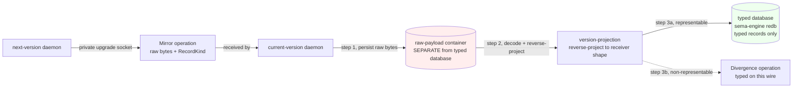
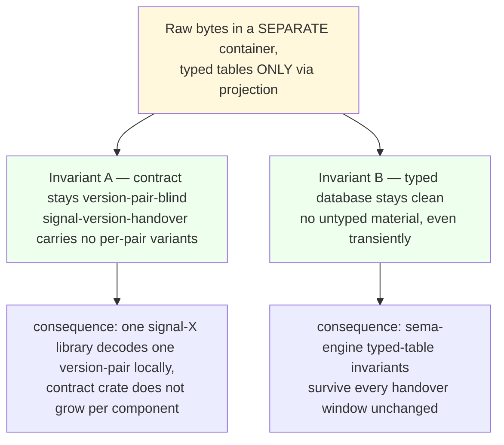

*Kind: ARCH manifestation · Topic: Mirror payload raw container · Date: 2026-05-23*

# 3 — Mirror payload raw-container ARCH manifestation

## What this slice is

Intent 274 (Maximum signal Clarification) refines the
`signal-version-handover` Mirror payload design: the wire carries
raw bytes with the type signature "unspecified raw payload"; the
receiver MUST store those bytes in a SEPARATE container outside its
typed database; `version-projection` then reverse-projects into
typed records that go into the typed database. The typed database
never accumulates un-incorporated bytes. The typed-enum
alternative for the Mirror payload remains deferred, with the
second production component handover as the trigger to revisit.
This slice manifests intent 274 into the two ARCH files where the
discipline lives: the wire contract (`signal-version-handover`) and
the typed database engine (`sema-engine`), and appends a note to
the bead that carries the daemon-side implementation work
(`primary-wehu`).

## Workspace files changed

| Repo | File | jj change | Headline |
|---|---|---|---|
| `signal-version-handover` | `ARCHITECTURE.md` | `xnpvrkos` (`0cdcc1a7`) | Mirror payload raw-container discipline (intent 274) |
| `sema-engine` | `ARCHITECTURE.md` | `nxxoouzl` (`e36c47b8`) | Handover raw-payload container discipline (intent 274) |

Edits in detail.

**`signal-version-handover/ARCHITECTURE.md`** — change `0cdcc1a7`
(short for `0cdcc1a7b47c`, ARCH refresh under `xnpvrkos`):

- TL;DR adds the "unspecified raw payload" framing plus the
  receiver-side container separation.
- Wire-vocabulary paragraph relabels `MirrorPayload` as carrying an
  "unspecified raw payload" and points at the deferred typed-enum
  alternative.
- New section "Mirror payload — raw bytes in a separate container"
  carries the load-bearing rule plus a mermaid showing the flow
  from wire to raw container to projection to typed database, with
  the typed-Divergence branch for non-representable payloads. Notes
  container scope (per-component-version-pair or
  per-handover-session) as open; receivers MAY choose either.
- Two new Constraints:
  - `MirrorPayload` carries an unspecified raw payload — contract
    does not type payload per version pair.
  - Receiver-side storage discipline: raw bytes land in a SEPARATE
    container outside the receiver's typed database; only
    reverse-projection output enters typed tables.
- Possible features entry rewritten to "Typed `Mirror` payload —
  deferred until second component handover surfaces the need" with
  the explicit revisit-trigger.

**`sema-engine/ARCHITECTURE.md`** — change `e36c47b8` (short for
`e36c47b862c2`, ARCH refresh under `nxxoouzl`):

- New section "Handover raw-payload storage discipline" before
  Non-Goals. Explains that raw `Mirror` payload bytes do NOT enter
  sema-engine's typed tables directly; receiver persists them in a
  separate raw-payload container; only reverse-projection output
  enters typed tables. Non-representable payloads become typed
  `Divergence` operations on the handover wire — never raw rows.
- "No raw byte slot store" Non-Goal extended with a back-reference
  to the new section so the apparent tension is resolved in one
  glance (sema-engine still has no raw-bytes slot store; the
  handover container lives outside it).

The bead-note update is recorded under "Beads filed or updated"
below — it appends to `primary-wehu` (Mirror payload application
on persona-spirit-daemon).

## Diagrams

### Wire-to-typed-database flow

### The two-invariant rule the discipline preserves

## Beads filed or updated

- **`primary-wehu`** (Mirror payload application on
  persona-spirit-daemon) — note appended referencing intent 274
  and locking in the raw-container discipline as a constraint on
  the implementation. Body of the note: the daemon receives raw
  bytes via Mirror, stores them in a raw-bytes container outside
  the typed redb; reverse-projection via `version-projection` then
  transforms them into typed records that go into the typed
  database. Cross-references both ARCH changes
  (`signal-version-handover@0cdcc1a7`, `sema-engine@e36c47b8`).
  Bead is already CLOSED (per persona-spirit commit `1ed90a36`);
  the note records the architectural rationale for future readers
  even though the implementation work is complete.

No new beads filed in this slice. The typed-enum decision stays
deferred per intent 274; if and when the second-component handover
surfaces the need, a fresh bead will land at that point.

## Open follow-ons

- **Container scope decision (per-component-version-pair vs
  per-handover-session)** stays open. Both fit the rule; the
  contract is indifferent. Receivers SHOULD record their choice
  in the receiver daemon's ARCHITECTURE when the production
  implementation lands. For `persona-spirit-daemon`, this is a
  receiver-side detail to surface during the next Spirit cutover
  iteration.
- **Typed-enum Mirror payload** decision deferred per intent 274.
  Trigger to revisit: the second production component handover.
  At that point, two real cutovers worth of evidence enable the
  cost-benefit between a typed wire (compile-time witness,
  observability) and per-version-pair contract bloat.
- **Read-during-handover semantics on the contract surface** is
  separately open (Q3 in `/158` §3.3) and unaffected by this
  slice; the raw-container rule is write-side discipline only.
  Reads continue against the current daemon's frozen snapshot
  (designer-leaned Option A) and are unrelated to raw-payload
  storage.

## How it fits

- Sub-report `1-signal-64bit-verb-namespace.md` — the broader
  signal-sizing work that establishes Mirror payload as a Tier 3
  signal by nature: its body is the raw bytes for a typed record
  produced under some component's signal-X library. The Tier 3
  framing is consistent with the unspecified-raw-payload type
  signature here; the wire knows the payload exists without
  knowing its inner shape.
- Sub-report `5-persona-mind-agent-error-events.md` — persona-mind
  events face a parallel raw-versus-typed distinction: agent error
  payloads may arrive as text initially, then promote to typed
  events as the schema for each error class settles. The
  raw-container-then-projection pattern modelled here is a
  reusable template for that promotion path: keep raw material in
  a separate container, type it via projection on the way into the
  typed database, and defer the typed-enum decision until a second
  use surfaces the need.
- Sub-report `0-frame-and-method.md` — frames the multi-slice
  manifestation and locates this slice as intent 274's home.
- `reports/second-designer/158-...-2026-05-23.md` §3.2 — the open
  question this slice resolves (Q2 — Mirror payload raw bytes vs
  typed enum). The §3.2 status banner already reads RATIFIED via
  intent 274; this slice manifests the ratification into the ARCH
  files so future agents read the rule directly at the wire and
  storage layers, not only in the design report.
