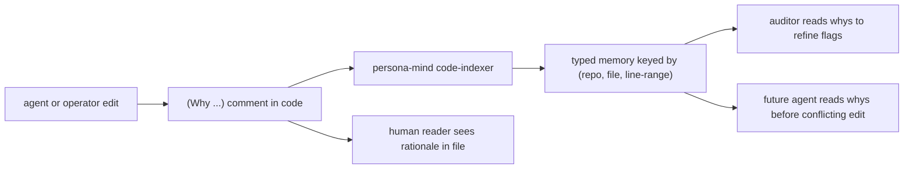

*Kind: Skill creation · Topic: NOTA-as-comments · Date: 2026-05-23*

# 4 — NOTA-as-comments new skill

## What this slice is

Manifests intent record 276 (workspace Decision, Medium certainty,
2026-05-23): *"Code comments use NOTA-formatted signal records
(nota in the comments). Since the comment lives in code (which is
text), the signal is in text form. Markdown-readable;
NOTA-syntax-highlightable. Enables Mind to read code-as-signal
directly. Comments carry the why of each edit so the system can
audit decisions and propose alternative designs based on accumulated
whys."* Verbatim: *"instead of, like, doing all this reporting on
the code, we should just document the code directly with all the
whys of why we are doing an edit, and just, like, logging, oh, yeah,
you put nota, you put nota as the comment ... It is a commenting
system, but it is actually really, like, you can, it is like
markdown. You can read nota ... it is more than nota. We should say
it is signal, we imply (in text form because its in text - ie rust
code)."*

The new skill names the discipline (the `(Why …)` opening pattern),
shows the shape in Rust / Nix / Python, names where the comment
goes, draws the boundary against Spirit intent records, and
signposts the Mind integration hooks. The skill is workspace-wide
and topic-tier — consulted when the topic of code commenting comes
up; not every-keystroke load.

## Workspace files changed

- **NEW** `skills/nota-comments.md` — full discipline skill.
  Frontmatter `# Skill — NOTA-as-comments`; sections cover the
  shape, multi-line aggregation, placement, the Why-vs-intent
  boundary, Mind integration hooks, when a `(Why …)` is worth
  writing, and what the skill is NOT for.
- **UPDATED** `skills/skills.nota` — added the new entry under
  `Workflow` kind, `Topic` tier, after the `nota-design` entry so
  the two NOTA-related skills sit together in the index.

Both edits land in one jj commit per `skills/skill-editor.md` flow
(commit message names the skill creation; bookmark on `main`; push
immediately).

## Diagram — code-edit → why-comment → Mind index → reader



The forward direction is full automation through Mind. The fallback
direction — `why` straight to the human reader who opens the file —
works the moment the discipline lands; the Mind integration is the
upside, not the prerequisite.

## Worked examples

The skill carries three short samples (Rust, Nix, Python). The
canonical Rust shape:

```rust
// (Why "fix recovery path on transient failure"
//   (caused-by "operator/162 §Remaining Work item 4")
//   (alternatives-considered (RetryWithoutFlip ColdStart))
//   (chosen-because "preserves no-downtime precedent per intent 203"))
fn handle_completion_failure(&mut self) -> Reply {
    // ... implementation
}
```

The Nix shape uses `#` instead of `//`; the NOTA body is identical:

```nix
# (Why "pin persona-spirit before persona-mind in deploy order"
#   (caused-by "operator/161 §3 — mind queries spirit at startup")
#   (alternatives-considered (PinSpiritFirst PinMindFirst RunBoth))
#   (chosen-because "mind needs spirit's wire shape resolved first"))
persona-mind = { after = [ "persona-spirit.service" ]; };
```

The grammar: positional record opened with `(Why "<summary>" …)`;
sub-records are themselves positional NOTA (`(caused-by "…")`,
`(alternatives-considered (Variant1 Variant2 …))`,
`(chosen-because "…")`). Multi-line comments aggregate — the parser
concatenates the comment payload across consecutive `//` (or `#`)
lines and strips the prefix.

## Open follow-ons

- **Mind code-indexer tool.** Once persona-mind ships, a tool walks
  repos and parses `(Why …)` records from comments into typed
  memories. The codec reuse is the easy part; the design question
  is the query surface ("what whys cite intent 203?", "what
  alternatives were considered for recovery paths?"). Tracked
  forward; no work yet.
- **Auditor read path.** When the auditor role solidifies (per
  `AGENTS.md` §"Possible additional role — auditor"), one of its
  inputs is the indexed whys. The auditor weighs a flagged shape
  against any recorded rationale before raising the flag.
- **Syntax-highlight integration.** Editor highlighters that
  dispatch to the NOTA highlighter for comment bodies — deferred.
  The discipline lands without the highlight; the highlight is the
  polish.
- **The why-vs-intent boundary.** The psyche says intent and why
  are related but not the same. The skill names the working rule
  (psyche statement → Spirit; editor's per-edit choice → `(Why …)`)
  and notes the boundary is still being worked out. A precise
  refinement may surface as the discipline gets used; flag to
  psyche per `skills/intent-clarification.md` if it tightens.

## How it fits

- **Sub-report 5** (persona-mind agent-error events) — Mind's
  typed-event design also feeds this: agent errors are one kind of
  typed memory; `(Why …)` comments parsed by the code-indexer are
  another. Both are inputs to the auditor.
- **Sub-report 6** (operator audit) — the constraint-test
  discipline named in recent operator work pairs with NOTA-comment
  discipline: a constraint-test names what must not regress; a
  `(Why …)` comment names why the code shape rests on that
  precedent. Auditor reads both together.
- Sister sub-reports 1-3 (ARCH manifestations for signal,
  component-shape, version-handover) don't directly intersect; this
  slice is workspace-wide discipline, theirs are repo/triad-level.
</content>
</invoke>