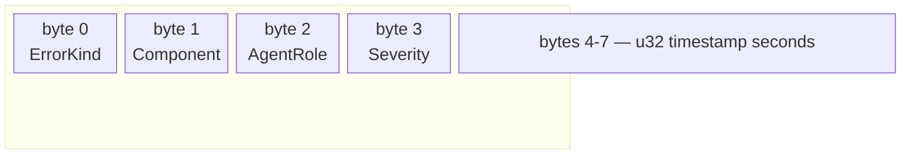
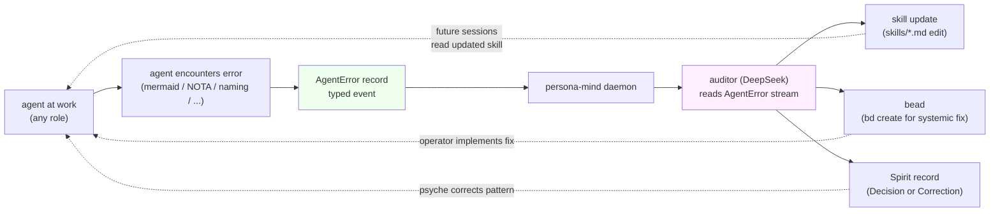

*Kind: Design · Topic: persona-mind agent-error events · Date: 2026-05-23*

# 5 — persona-mind AgentError event design

## What this slice is

Sub-report E of meta-report 159 (intent-manifestation). Designs the
`AgentError` event schema that lands in persona-mind once that daemon
ships, per psyche intent record 275 ("when agents make errors, we
should start logging that ... that would go in the mind. As an agent
error, and then you would start developing different subtypes").
Plumbs the three-tier sizing wisdom (intents 244, 271, 273), the
universal data variants (intent 272), the auditor pipeline (intents
234 + 235), and the NOTA-as-comments substrate (intent 276) into a
single coherent event family. The slice ends with a P3 design bead
that captures implementation work for the persona-mind deployment
window.

## Event shape (the schema)

The root type is `AgentError` — the "beingness" of an agent-error
event. Every error an agent produces while doing workspace work
becomes one `AgentError` record in mind. The three tiers from
designer/155 §1 give three projections of the same event, each sized
for a different audience.

### Tier 1 — `AgentErrorLogVariant` (64-bit, 8 bytes)

The auto-derived 8-byte projection follows the byte-0-is-root-verb
discipline from intent 271. Each byte is independently indexable; the
root verb (byte 0) groups histograms by error kind without touching
the payload.



| Byte | Field | Type | Notes |
|---|---|---|---|
| 0 | `ErrorKind` | `u8` unit-only enum | root verb (~256 kinds); see §"Subtypes development" below |
| 1 | `Component` | `u8` unit-only enum | which component the agent was working in (signal-frame, persona-spirit, persona-mind, ...) |
| 2 | `AgentRole` | `u8` unit-only enum | designer, operator, system-specialist, poet, auditor; plus the support lanes |
| 3 | `Severity` | `u8` unit-only enum | `Trivial`, `Notable`, `Important`, `Critical` |
| 4-7 | `timestamp_seconds` | `u32` | matches designer/155 §1.2 packing; ~136 years from epoch |

This is what hot-path indexers, dashboard histograms, and the
auditor's per-day error-count aggregator read. 8 bytes per event
scales to billions of records per GB of mind storage.

### Tier 2 — `AgentErrorLogSummary` (64-byte, 512-bit)

The hand-implemented summary projection per designer/155 §1.3. Carries
enough fidelity for an auditor to follow the story without dropping
into Tier 3.

| Bytes | Field | Notes |
|---|---|---|
| 0-7 | `AgentErrorLogVariant` | the Tier 1 packing, included verbatim |
| 8-9 | `agent_short_id` | `u16` short-ID universal data variant (intent 272); identifies the agent if Criome-mediated |
| 10-39 | `context` | 30-byte short string carrying the location reference (e.g. file path tail) or error message excerpt |
| 40-63 | `signature` | 24 bytes for an agent-identity reference if available (truncated Ed25519, or empty) |

The 64-byte budget matches intent 273 ("the extended version, which
is, I think we settled on 512 bytes ... which gives us a public key,
like, on top of that, which is an identity"). The Criome short-ID
slot follows intent 272's universal-data-variant convention so every
mind log automatically carries the agent identifier in human-readable
shortform.

### Tier 3 — full `AgentError` record (unrestricted rkyv)

The full record carries everything an auditor or skill-improvement
loop needs to recommend a fix. Positional NOTA record shape per
`skills/nota-design.md`:

```text
(AgentError
  kind            (ErrorKind ...)
  component       (Component ...)
  role            (AgentRole ...)
  severity        (Severity ...)
  occurred_at     (Timestamp ...)
  agent           (AgentReference ...)
  location        (LocationReference ...)
  message         "<full error text>"
  context_before  "<surrounding text leading up to the error>"
  context_at      "<exact failing fragment>"
  context_after   "<text following the error>"
  agent_response  "<what the agent did or proposed to do>"
  fix_applied     (Optional (Fix ...))
  source_record   (Optional (NotaCommentReference ...)))
```

(NOTA records are positional per AGENTS.md; the labels above are
illustrative — actual NOTA carries values in declared order without
keywords.)

`LocationReference` is a typed sum: file-path-plus-byte-range,
report-path-plus-section, bead-identifier, jj-change-id, or a free
text fallback when no structured location exists. `Fix` describes
what the agent (or operator, or auditor) did to resolve the failure;
omitted when the error is unresolved. `NotaCommentReference` is the
optional pointer into a NOTA-as-comment block (intent 276) that
surfaced the error — links code-as-signal to its observed failures.

## Worked examples

Three concrete cases, two of them caught in the very session that
produced this meta-report.

### Example 1 — Mermaid syntax (semicolon in sequenceDiagram Note)

Tier 1 packing:

```text
(AgentErrorLogVariant
  kind=Mermaid
  component=Reports                 # not a component triad; the report-writing surface
  role=Designer
  severity=Notable
  timestamp_seconds=1748000000)
```

Tier 3 excerpt:

```text
(AgentError
  kind            Mermaid
  component       Reports
  role            Designer
  severity        Notable
  occurred_at     2026-05-23T11:32:37
  agent           (AgentReference (Criome 0x5fa3) "second-designer-window")
  location        (ReportSection "reports/second-designer/158-..." "§3.4")
  message         "Parse error: ';' is statement boundary inside sequenceDiagram Note"
  context_before  "    Note over Agent,Mind: agent logs error;"
  context_at      ";"
  context_after   " auditor reads"
  agent_response  "edited the report to remove the semicolon"
  fix_applied     (Fix EditReport "replaced ';' with ' and '")
  source_record   None)
```

This pattern recurred twice in the meta-report session (the auditor
caught it both times). With AgentError logging in place, the second
occurrence triggers a skill-improvement nudge: "mermaid skill already
warns on this; rewrite the guidance with a stronger trigger or add a
pre-commit lint."

### Example 2 — NOTA formatting (keyword inside a record body)

```text
(AgentErrorLogVariant
  kind=NotaFormat
  component=SignalPersonaMind
  role=Operator
  severity=Important
  timestamp_seconds=1748000200)
```

Tier 3 excerpt:

```text
(AgentError
  kind            NotaFormat
  component       SignalPersonaMind
  role            Operator
  severity        Important
  occurred_at     2026-05-23T11:35:57
  agent           (AgentReference (Criome 0x3a91) "operator-codex")
  location        (FilePath "src/text.rs" 412 438)
  message         "NOTA record uses (key value) keyword form; positional rule violated"
  context_at      "(MindRequest kind Open title \"feature work\")"
  agent_response  "rewrote as (MindRequest (Open \"feature work\"))"
  fix_applied     (Fix EditCode "removed labels, made positional")
  source_record   (NotaCommentReference "src/text.rs:404"))
```

This is the AGENTS.md hard override ("NOTA records are positional,
not labeled"); the `source_record` points at a NOTA-as-comment that
described the request shape — the auditor can compare the comment's
declared form against the failing code.

### Example 3 — Naming (`Req` instead of `Request`)

```text
(AgentErrorLogVariant
  kind=Naming
  component=SignalPersonaSpirit
  role=Operator
  severity=Notable
  timestamp_seconds=1748000900)
```

Tier 3 excerpt:

```text
(AgentError
  kind            Naming
  component       SignalPersonaSpirit
  role            Operator
  severity        Notable
  occurred_at     2026-05-23T11:48:17
  agent           (AgentReference (Criome 0x71e0) "operator-claude")
  location        (FilePath "src/handover.rs" 87 90)
  message         "Identifier 'Req' violates skills/naming.md full-English rule"
  context_at      "fn handle_req(req: Req) -> Reply"
  agent_response  "renamed Req to Request and updated all call sites"
  fix_applied     (Fix EditCode "rg-replace Req -> Request, jj commit")
  source_record   None)
```

After enough Naming errors accumulate in a single agent's stream, the
auditor can propose a stronger reminder in that agent's session prelude
— skill improvement driven by observed failures, per intent 275's
"there is something they are doing wrong consistently, which just
fixes the skill" framing.

## Diagram — the error-logging loop



The diagram is reusable for the meta-overview (sub-report 7): it
shows how AgentError closes the loop from observed failure to
skill/bead/intent improvement, exactly the auditor framing in /152
sub-report 8 and /156 §8.

## Subtypes development

Per intent 275, "developing subtypes is one of the most important
parts of designing the Criome stack." `ErrorKind` is a closed enum
that grows over time as new error shapes surface. Initial vocabulary
from the three worked examples above plus a handful of obvious neighbors:

| ErrorKind | Triggers | Worked example |
|---|---|---|
| `Mermaid` | mermaid parser rejection, render failure | Example 1 |
| `NotaFormat` | NOTA positional violation, record-shape mismatch | Example 2 |
| `Naming` | abbreviated identifier, ancestry-carrying name | Example 3 |
| `RuleViolation` | AGENTS.md hard-override violation (NOTA argument flag, `/nix/store` search, `git` for non-escape-hatch) | future |
| `BuildFailure` | cargo / nix build error during agent's session | future |
| `TestFailure` | constraint test or unit test red after agent edit | future |
| `IntentMisreading` | agent claims an intent record says X when Spirit shows Y | future |
| `LaneViolation` | agent edited outside its claimed paths in `orchestrate/<lane>.lock` | future |
| `SubagentDispatch` | agent invoked a subagent without explicit psyche permission (intent 5) | future |
| `HorizontalRule` | `---` separator in markdown (AGENTS.md hard override) | future |

Subtypes are added by **anyone filing a bead** pointing at the gap:
`[Add ErrorKind::<Name> to AgentError schema — discovered via <case>]`,
P3, label `persona-mind,observability`. The designer reviews and the
operator lands the schema bump in the next persona-mind contract
revision. The act of recognising a new subtype is itself the
designer-shaped work psyche named.

The enum stays under 256 variants by construction (it fits in `u8` at
byte 0 of the Tier 1 packing). 256 is a generous ceiling — most
mature observability vocabularies converge at 30-80 categories — so
the discipline is "grow it carefully," not "ration the slots."

## Integration with the broader stack

### Three-tier sizing (intents 244 + 271 + 273)

`AgentError` fits the standard 8x8 pattern from intent 271 cleanly:
one root verb (`ErrorKind` at byte 0) plus seven data-carrying
sub-variants (here: Component, AgentRole, Severity, timestamp-as-u32
across bytes 4-7). The 64-byte summary slot accommodates the agent
identity via the universal-data-variant short ID (intent 272) — the
Criome u16 short-ID convention applies to AgentError just like every
other namespace. The full record uses Tier 3 (unrestricted rkyv) for
the surrounding code snippet, full message, and fix description.

The macro autogen rules from designer/155 §1.5 cover `AgentError`'s
Tier 1 derivation without hand-coding: each enum field is unit-only,
so the macro packs them at fixed byte offsets and emits the
`LogVariant` impl automatically.

### Auditor (intents 234 + 235)

The auditor (DeepSeek-driven, per intent 235) reads the AgentError
stream from persona-mind as its primary input. Three feeds, all
served from `SubscribeThoughts` / `SubscribeRelations` on the
`AgentError` thought family (or a dedicated `AgentError` table, TBD
per "Open follow-ons"):

- **Live tail** — every new AgentError fires a typed subscription
  delta; auditor evaluates it against rules-and-heuristics from
  `skills/audit-*.md` and decides whether to comment, file a bead,
  or propose a Spirit record.
- **Per-agent batch** — auditor periodically queries
  `AgentError where agent=X within last 24h`, aggregates by
  `ErrorKind`, and proposes skill updates for patterns above a
  threshold ("agent X has 5+ Naming errors today").
- **Cross-agent batch** — periodic query
  `AgentError where ErrorKind=X within last week`, aggregates by
  agent, surfaces systemic issues ("4 of 5 agents hit Mermaid
  errors on `;` in sequenceDiagram this week — strengthen the
  mermaid skill").

This matches the audit-MVP staging from /156 §8 and /158 §3.4: start
with bead comments as the output substrate, upgrade to Spirit records
or structural authority later if the role's authority grows.

### NOTA-as-comments (intent 276)

The optional `source_record` field on `AgentError` Tier 3 carries a
`NotaCommentReference` — a pointer into a NOTA-formatted comment in
the code that surfaced the error. This closes the design-as-code
loop: a NOTA comment declares the intended record shape; an
AgentError records when the code drifts from that declared shape;
the auditor can compare them directly.

Example: a NOTA comment at the top of `src/text.rs` declares
`(MindRequest Open Title)` as the positional shape; an AgentError
fires when an edit later writes `(MindRequest kind=Open title="...")`
with labels; the auditor sees both records via Mind and proposes the
correction.

This is the "Mind reads code-as-signal" pattern from intent 276,
operationalised: comments are queryable signal; errors against
those comments are queryable signal; the loop closes through
persona-mind's typed substrate.

## Beads filed or updated

Filed one P3 design bead for future persona-mind implementation work:

- **`primary-x0qm`** — `Design persona-mind AgentError event schema — implement when persona-mind production deployment lands`
  - Priority: P3
  - Labels: `role:designer`, `persona-mind`, `observability`, `design`
  - Body references this sub-report at
    `reports/second-designer/159-intent-manifestation/5-persona-mind-agent-error-design.md`
    and intent records 275 (parent), 244 / 271 / 273 (sizing), 234 /
    235 (auditor), 272 (universal data variants), 276 (NOTA-as-comments).
  - Implementation order, per the bead body: (a) add
    `AgentError`/`ErrorKind`/`Severity`/`AgentRole`/`Component` to
    `signal-persona-mind`; (b) add `agent_errors` table to
    `persona-mind` MindTables schema; (c) wire `LogVariant` autogen
    for Tier 1; (d) hand-impl `LogSummary` for Tier 2; (e) wire the
    AgentError submit verb; (f) ship the subscription delta for the
    auditor feed.

## Open follow-ons

Surfaced for future attention:

- **Initial error-kind vocabulary lock.** The table in §"Subtypes
  development" gives a starting point; the first persona-mind
  contract revision should ratify a concrete v1 vocabulary (probably
  the 3 worked examples plus the 5 next neighbors), with the rest
  added incrementally via bead-driven schema bumps. Designer slice:
  ~1 day to settle the v1 set after psyche reviews.

- **Auditor signal flow** — per /158 §3.4 Q4c, the designer-lean is
  "bead comments first." Open: does AgentError → auditor →
  bead-comment work through persona-mind subscription delivery, or
  through a separate auditor-side poll loop? Subscription is cheaper
  per event but couples auditor latency to mind delivery; poll is
  simpler but adds latency. Defer until auditor MVP design slice.

- **AgentError table vs Thought family.** Two encoding choices for
  the durable surface in persona-mind: (a) dedicated `agent_errors`
  redb table outside the typed Thought/Relation graph, or (b)
  represent each AgentError as a `Thought` of a new `ThoughtKind::Error`.
  Option (a) keeps the typed mind-graph clean of error noise; option
  (b) lets relations like `Authored`, `Supersedes` (a fix supersedes
  the broken state), and `Belongs` apply naturally. Designer lean:
  start with (a) and reify the table promotion to a ThoughtKind only
  if the relation-based queries become essential. Note: this mirrors
  the Mirror payload raw-container pattern from intent 274 —
  un-graph-shaped events live in a separate container so the typed
  graph stays clean.

- **Non-error agent observations.** Should AgentError extend to
  agent-move events worth surfacing that aren't errors (a clever
  refactor, a particularly clean intent capture, a multi-step
  recovery from a near-failure)? Three options: (a) add
  `Severity::Notable` cases for positive observations (overloads the
  name `AgentError`); (b) split into `AgentEvent` (broader) where
  `AgentError` is a sub-variant; (c) keep AgentError narrow and add a
  sibling `AgentNote` type for positive observations later. Lean:
  (c) — narrow types stay legible; the auditor can subscribe to both
  streams; the cost of two types is one additional schema entry.
  Defer until auditor MVP surfaces the need.

- **Severity calibration.** `Trivial` / `Notable` / `Important` /
  `Critical` are sensible defaults but need ground-truth examples
  per kind. Example: a `Mermaid` parse error is `Notable`; a
  `RuleViolation` on a NOTA-argument hard override is `Important`;
  a `BuildFailure` blocking the persona-spirit cutover is `Critical`.
  Calibration table lives in the persona-mind contract docs once the
  v1 vocabulary lands.

## How it fits

Cross-references inside meta-report 159:

- **Sub-report 1** (signal 64-bit verb-namespace) — AgentError uses
  the standard 8x8 packing from intent 271; the Tier 1 derivation
  inherits the same macro autogen.
- **Sub-report 3** (Mirror raw container) — same separate-container
  discipline applies to AgentError's table-vs-Thought choice (see
  "Open follow-ons"): un-graph-shaped events live outside the typed
  graph, mirroring intent 274's clean-database principle.
- **Sub-report 4** (NOTA-as-comments) — `AgentError.source_record`
  carries the `NotaCommentReference` that links code-as-signal to
  observed errors; the loop closes through Mind.
- **Sub-report 6** (operator audit) — when constraint tests emit
  assertion failures, the test runner can route them through
  AgentError so the auditor sees test regressions in the same
  stream as agent-side errors.
- **Sub-report 7** (overview) — the loop diagram in §"Diagram" is
  reusable for the meta-synthesis; pull it forward when describing
  how persona-mind enables the auditor role.

External cross-references:

- `reports/second-designer/152-persona-engine-architecture-overview/8-standard-agent-behavior.md`
  — auditor role framing under carry-uncertainty.
- `reports/second-designer/155-three-tier-signal-sizing-and-lossless-routing-2026-05-22.md`
  Part 1 §1.4 — `LogVariant` + `LogSummary` trait shapes used here.
- `reports/second-designer/156-most-important-gaps-2026-05-23.md`
  §8 — auditor MVP staging.
- `reports/second-designer/158-open-question-resolution-and-remaining-clarification-needs-2026-05-23.md`
  §3.4 — auditor sub-questions; this sub-report assumes Q4a/Q4b/Q4c
  resolve as proposed (support-tier, external CI, bead comments).
- `skills/mermaid.md` — pattern that broke / failed with shape that
  inspired the `AgentError` context fields.
- `/git/github.com/LiGoldragon/persona-mind/ARCHITECTURE.md` §2,
  §4 — implementation target; the `agent_errors` table (or
  `ThoughtKind::Error` family) lands here when implementation begins.
