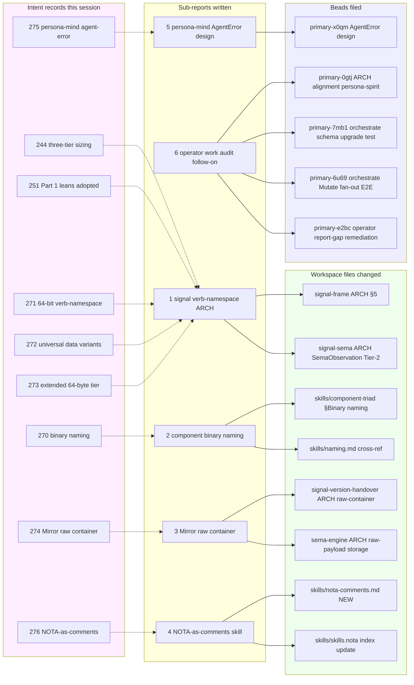

*Kind: Meta-report synthesis · Topic: intent-manifestation session overview · Date: 2026-05-23*

# 7 — Overview

## TL;DR

Seven intent records (270-276) captured at the session start, then
manifested in parallel across six sub-agent slices:

- **§5 Three-tier signal sizing + 64-bit verb-namespace** (intents
  244 / 251 / 271 / 272 / 273) — landed in `signal-frame/ARCHITECTURE.md`
  (jj change `2313c5ed`, new §5 "Three-Tier Signal Sizing + Verb
  Namespace") + `signal-sema/ARCHITECTURE.md` (jj change `1604cceb`,
  SemaObservation Tier-2 framing).
- **Component binary naming convention** (intent 270) — landed in
  `skills/component-triad.md` (jj change `xrysrwxl`, new §"Component
  binary naming") + `skills/naming.md` cross-reference.
- **Mirror payload raw-container discipline** (intent 274) — landed
  in `signal-version-handover/ARCHITECTURE.md` (jj change
  `0cdcc1a7`) + `sema-engine/ARCHITECTURE.md` (jj change `e36c47b8`).
  Surprise: `primary-wehu` (Mirror payload application) ALREADY
  CLOSED by `persona-spirit` commit `1ed90a36` — operator beat the
  audit.
- **NOTA-as-comments new skill** (intent 276) — created
  `skills/nota-comments.md` (jj change `f93f5893`) + indexed in
  `skills/skills.nota` under Workflow/Topic.
- **persona-mind AgentError event design** (intent 275) — design
  sub-report only; new bead `primary-x0qm` (Design persona-mind
  AgentError event schema, P3) tracking future implementation.
- **Operator-work audit follow-on** (from designer /302) — four new
  beads filed: `primary-0gtj`, `primary-7mb1`, `primary-6u69`,
  `primary-e2bc`.

Plus three high-stakes design surfaces opened that need psyche
attention — see §4 below.

## §1 Frame

Session run under psyche directives from 2026-05-23:
1. Capture intent first when psyche speaks (per AGENTS.md);
2. Read all fresh intent + designer/operator reports;
3. Dispatch sub-agents in parallel to manifest intent into
   ARCHITECTURE files + design/implement/audit beads + final reports
   in this meta-report directory (intent 231 pattern).

Orchestrator captured 7 intents (records 270-276) before dispatch.
Six sub-agents ran in parallel. Each came back with sub-report +
landed jj changes + bead filings.

## §2 What landed per sub-report

## §3 Cross-cutting observations from the sub-agents

### §3.1 Three layers of the same discipline

Sub-agent 1 (signal verb-namespace), sub-agent 5 (persona-mind
AgentError), and sub-agent 4 (NOTA-as-comments) independently
arrived at consistent shapes:

- **Tier 1 64-bit verb-namespace** is the *root* primitive for any
  signal-shaped typed event (sub-agent 1)
- **AgentError** packs cleanly into the 8×8 shape (sub-agent 5):
  byte 0 ErrorKind = root verb; bytes 1-7 Component / AgentRole /
  Severity / timestamp; this is the canonical second worked example
  of the verb-namespace beyond SemaObservation
- **NOTA-as-comments** uses the same positional-record discipline,
  in text form, so the same parser reads code-comments as signal
  (sub-agent 4)

The three pieces compose: a code edit → NOTA-comment captures the
why → if the edit later surfaces an AgentError, the AgentError can
reference the NOTA-comment (per sub-agent 5's
`NotaCommentReference`) → auditor (DeepSeek per intent 235) reads
both through Mind → proposes skill update or new Spirit Decision.

### §3.2 Surprises and audit findings

- **`primary-wehu` (Mirror payload application) ALREADY CLOSED** —
  sub-agent 3 found that operator landed the daemon-side handler at
  `persona-spirit` commit `1ed90a36`. The ARCH-refresh work this
  session captured the constraint the closed implementation already
  satisfies. Lesson: file beads + ARCH-manifest in same session as
  intent capture, because operator moves fast.
- **`primary-1cl1` and `primary-ktkc` ALREADY CLOSED** with
  substantive closure notes (sub-agent 6) — but the operator
  reports for the closure commits don't exist. Bead `primary-e2bc`
  filed to remediate the report-gap.
- **`signal-frame` ARCH had a pending rename `signal-persona-auth`
  → `signal-persona-origin` re-applied above main** (sub-agent 1
  noted). Belongs to another parallel agent's work; left untouched.

### §3.3 Mermaid trap recurrence

Sub-agent 4 hit one mermaid issue (resolved); the orchestrator hit
two in `/158` (resolved); designer /287 hit one earlier. The
agent-error logging design (sub-agent 5) names this as one of the
three worked examples of `AgentError` — the recurrence frequency
justifies the design pattern.

## §4 High-stakes open follow-ons needing psyche attention

### §4.1 Is `spirit` a top-level component (with `persona-spirit` → `spirit`)?

Sub-agent 2 surfaced this from intent 270's verbatim quote:

> "spirit CLI, spirit daemon ... harness CLI is harness and harness
> daemon is the daemon ... so persona, persona daemon, spirit,
> spirit daemon, harness, harness daemon, orchestrator,
> orchestrator daemon"

The verbatim lists all four at the same scope, as peers. Two
readings:

- **Reading A (today's deployed state)**: spirit is a persona-system
  child; repo is `persona-spirit`; daemon is `persona-spirit-daemon`
- **Reading B (verbatim-literal)**: spirit is a top-level component
  peer to persona; repo should be `spirit`; daemon should be
  `spirit-daemon`; `persona-spirit` is mis-named

If Reading B, multiple repos need renames: `persona-spirit` → `spirit`,
`signal-persona-spirit` → `signal-spirit`, `owner-signal-persona-spirit`
→ `owner-signal-spirit`. Same question recurs for harness,
orchestrator, mind, router, etc. — the WHOLE persona-system might
be a flat federation of named components.

This is load-bearing. Needs explicit psyche resolution.

### §4.2 Root-verb registry mechanism (intent 271)

Sub-agent 1 surfaced: intent 271 implies a shared root-verb
vocabulary catalog (Help, Query, Message, etc.) but doesn't specify
the mechanism. Three candidates:

- **Central enum** — a single workspace-wide `RootVerb` enum that
  every signal type must use one of (tight coupling)
- **Convention** — each component picks its own root verbs;
  workspace-wide cataloguing is documentation only (loose coupling)
- **Generated manifest** — `nix eval`-based aggregation of all
  signal-frame types into a runtime-loadable catalog (medium
  coupling)

Designer lean: **Convention** — each component owns its verbs;
workspace documentation references but doesn't constrain. Allows
component evolution without central-enum coordination overhead.
But psyche may want stronger discipline. Worth a Spirit Decision.

### §4.3 Universal-data-variant set beyond U8 / U16

Sub-agent 1 surfaced: intent 272 names U8 + U16 as universal data
variants but the full set is undecided. Candidates beyond U8/U16:
U32, U64, fixed-byte-array shapes (`[u8; 16]`, `[u8; 32]`).

Designer lean: minimal set — just U8 + U16 — until a concrete
component surfaces the need for more. Aligns with the
prototype-then-codify pattern. Workspace registry of "additional
universal variants requested" lives in a tracking bead.

### §4.4 Binary rename hygiene (3 cleanup targets)

Sub-agent 2 verified current binary names against intent 270 and
found:

- `persona-orchestrate` CLI → should be `orchestrate` (drop the
  persona prefix; orchestrate is a top-level role per the §4.1
  question)
- Legacy `orchestrator` binary lacks `-daemon` suffix + uses `clap`
  (violates NOTA single-argument rule) → rename to
  `orchestrator-daemon` OR retire entirely (per intent 93's
  `persona-orchestrate displaces tools/orchestrate`)
- `lojix-cli` carries deprecated `-cli` suffix → rename to `lojix`

Three components ship daemon-only (no CLI yet): `persona-router`,
`persona-harness`, `persona-terminal`. CLIs not yet implemented,
so naming will be correct when they land.

§4.1's resolution affects whether all three rename targets are
strict matches OR need broader rework.

### §4.5 NOTA-as-comments — why-vs-intent boundary

Sub-agent 4 named the precise boundary between Spirit intent
records (psyche statements; durable workspace decisions) and
NOTA-comment `(Why …)` records (editor's per-edit rationale; local
to the code) as "related but not the same — flagged for refinement
once the discipline is used in practice." Worth a clarification
once accumulated whys surface the natural boundary.

## §5 Beads filed this session

| Bead | Source | Priority | Purpose |
|---|---|---|---|
| `primary-x0qm` | sub-report 5 | P3 | Design persona-mind AgentError event schema (future implementation) |
| `primary-0gtj` | sub-report 6 | P2 | ARCH alignment: persona-spirit daemon configuration file path documentation |
| `primary-7mb1` | sub-report 6 | P2 | Constraint test: persona-orchestrate v1→v2 schema upgrade |
| `primary-6u69` | sub-report 6 | P2 | End-to-end: persona-orchestrate Mutate fan-out produces PartialApplied + divergence |
| `primary-e2bc` | sub-report 6 | P2 | Operator report-gap remediation (3 unreported 2026-05-23 structural commits) |

Plus orchestrator-side updates earlier this turn:
- `/158` §3.2 Q2 lean refined per intent 274
- `/158` §3.3 mermaid sequenceDiagram converted to flowchart (the
  `P -->|"label"| V0` pattern is flowchart syntax that broke the
  sequenceDiagram parser per `skills/mermaid.md`)

## §6 Status / handover

Design surface after this session:

- **Three-tier signal sizing + verb-namespace**: GROUNDED in ARCH
  for signal-frame + signal-sema. Implementation continues under
  beads `primary-l02o`, `primary-bg9l`, `primary-b86d`,
  `primary-2py5`.
- **Component binary naming**: CODIFIED in skills. Three cleanup
  targets surfaced (§4.4); ratification pending psyche resolution
  of §4.1.
- **Mirror payload raw container**: GROUNDED in ARCH. Implementation
  done (`primary-wehu` already closed). Container scope (per
  version-pair vs per session) deliberately open.
- **NOTA-as-comments**: SKILL LANDED. Pattern `// (Why "
"
  (caused-by …) (alternatives-considered (…)) (chosen-because …))`.
  Mind integration deferred to future persona-mind work.
- **persona-mind AgentError events**: DESIGNED. Implementation
  bead filed (`primary-x0qm`, P3) for when persona-mind production
  deployment lands.
- **Operator audit**: AUDIT FOLLOW-ON DONE. Four beads filed for
  specific surface gaps. Designer /302 was the primary audit; this
  follow-on turned its observations into actionable beads.

Six high-stakes open follow-ons surfaced (§4.1-§4.5 above) need
psyche attention. Beyond those, the carry-forward set from
`/158` §4 remains in play.

## §7 See also

Within this directory:
- `0-frame-and-method.md` — frame + sub-agent contract
- `1-signal-verb-namespace-arch.md` — signal sizing ARCH manifestation
- `2-component-binary-naming.md` — naming convention codification
- `3-mirror-raw-container.md` — Mirror payload discipline
- `4-nota-comments-skill.md` — NOTA-as-comments skill creation
- `5-persona-mind-agent-error-design.md` — agent-error event schema
- `6-operator-work-audit.md` — operator audit follow-on

Outside this directory:
- `reports/second-designer/152-persona-engine-architecture-overview/` — prior meta-directory
- `reports/second-designer/155-three-tier-signal-sizing-and-lossless-routing-2026-05-22.md` — original three-tier sizing design
- `reports/second-designer/156-most-important-gaps-2026-05-23.md` — gaps audit context
- `reports/second-designer/157-audit-engine-stack-state-before-constraint-and-integration-beads-2026-05-23.md` — prior audit
- `reports/second-designer/158-open-question-resolution-and-remaining-clarification-needs-2026-05-23.md` — resolution map + remaining clarifications (banner updated this turn for Q2 ratification)
- `reports/designer/302-audit-recent-operator-work-2026-05-23.md` — primary audit (sub-report 6 follows on from)
- Spirit records 244-276 (the intent layer this session manifested)
- ARCH commits this session: signal-frame `2313c5ed`, signal-sema `1604cceb`, signal-version-handover `0cdcc1a7`, sema-engine `e36c47b8`
- Skill commits this session: skills/component-triad `xrysrwxl`, skills/nota-comments.md `f93f5893`
- Beads filed this session: `primary-x0qm`, `primary-0gtj`, `primary-7mb1`, `primary-6u69`, `primary-e2bc`
