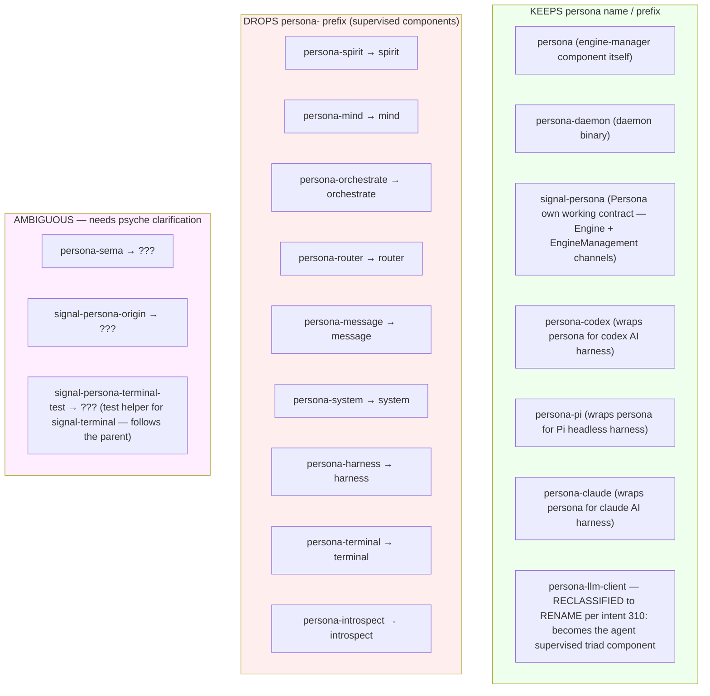
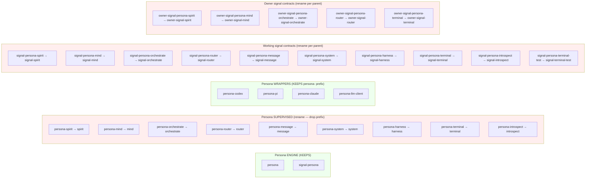
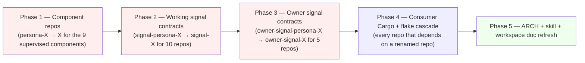

*Kind: Design + coordination · Topic: drop persona- prefix from supervised persona components · Date: 2026-05-23*

# 160 — Drop the persona- prefix from supervised components — coordinated rename

*Per intent record 280 (psyche 2026-05-23): "yea, actually you just
gave me the idea, we should take a lot of those persona- prefixes
out, even the repo names". Ratifies Reading B from /159 §4.1 +
extends it across the supervised-component fleet.*

## §1 The rule

Three kinds of name with three different fates:



Rule of thumb (per intent 280 reading):

- Component **IS** Persona (the engine-manager) → `persona` / `persona-daemon`
- Component **SUPERVISED BY** Persona (federation member) → drop the `persona-` prefix (the supervision is structural, not name-carrying)
- Component **WRAPS** Persona (frontend, harness, embeddable client) → keep the `persona-` prefix (it indicates the wrapping relationship)

## §2 Repo inventory + rename target



**Inventory totals:**
- KEEPS: 7 (persona engine + 4 wrappers + signal-persona + persona-daemon binary)
- RENAMES: 9 component repos + 10 working signal contract repos + 5 owner signal contract repos = **24 repos**
- AMBIGUOUS (psyche clarify): persona-sema, signal-persona-origin

## §3 Cascade per renamed repo

Each rename triggers a cascade. For e.g. `persona-spirit` → `spirit`:

1. **Repo rename on GitHub**: `gh repo rename LiGoldragon/persona-spirit spirit`
2. **Local checkout remote URL update**: `git -C /git/github.com/LiGoldragon/persona-spirit remote set-url origin git@github.com:LiGoldragon/spirit.git` (then mv the directory: `mv /git/github.com/LiGoldragon/persona-spirit /git/github.com/LiGoldragon/spirit`)
3. **Cargo.toml in the renamed repo**: `name = "persona-spirit"` → `name = "spirit"`; lib + bin entries; internal `path = "..."` references
4. **Rust module names**: `persona_spirit::...` → `spirit::...` everywhere inside the repo
5. **Binary names**: `persona-spirit-daemon` → `spirit-daemon`; `persona-spirit` CLI → `spirit`
6. **For each consumer repo**, update Cargo.toml dep:
   ```toml
   # before
   signal-persona-spirit = { git = "https://github.com/LiGoldragon/signal-persona-spirit.git" }
   persona-spirit = { git = "https://github.com/LiGoldragon/persona-spirit.git" }
   # after
   signal-spirit = { git = "https://github.com/LiGoldragon/signal-spirit.git" }
   spirit = { git = "https://github.com/LiGoldragon/spirit.git" }
   ```
7. **For each consumer repo**, update use statements: `use signal_persona_spirit::...` → `use signal_spirit::...`; `use persona_spirit::...` → `use spirit::...`
8. **Nix flake inputs**: `inputs.signal-persona-spirit.url = "github:LiGoldragon/signal-persona-spirit"` → `inputs.signal-spirit.url = "github:LiGoldragon/signal-spirit"`
9. **flake.lock regeneration**: `nix flake update`
10. **ARCH files**: any `persona-spirit` reference becomes `spirit`
11. **Skill files**: same
12. **Bead bodies**: same (mostly path references)
13. **Intent records**: NOT rewritten (historical record stays; new records use new names)
14. **Workspace AGENTS.md / ESSENCE.md / INTENT.md**: any references update; `intent/persona.nota` legacy file stays as historical record

**Multiply by 24 repos = significant mechanical churn.** But each step is mechanical and grep-driven.

## §4 Sequencing



Each phase is independent until phase 4 (cascade), which depends
on all renames done. Phases 1-3 can run in parallel (different
repos). Phase 4 runs after all renames complete.

Estimated effort: 1-2 days of mechanical work with full attention,
or interleaved across 3-5 days alongside other work. Operator +
system-specialist coordination.

## §5 Coordination concerns

- **In-flight work conflicts**: operator is on `primary-a5hu`
  (Persona engine systemd unit slice). Several other beads touch
  `persona-spirit`. Renaming mid-cycle risks merge churn.
  **Mitigation**: schedule the rename for a quiet window OR pause
  active work briefly for the rename pass.
- **Beads with stale paths**: every bead body referencing
  `persona-spirit` etc. needs an update. Could land via single
  sweep after phase 4.
- **Reports with stale paths**: every report. Designer-shaped
  context-maintenance sweep after phase 4 completes.
- **Spirit intent records with stale paths**: NOT rewritten —
  intent records are historical truth (per `skills/intent-maintenance.md`).
  Future records use new names.
- **Ambiguous repos**: `persona-sema`, `signal-persona-origin`.
  Surface to psyche before rename pass.

## §6 Bead

File a single coordinating bead `[Drop persona- prefix from
supervised components — coordinated rename of 24 repos]`, P1, for
operator + system-specialist:

- Phase 1-3 list each repo with the rename target
- Phase 4 cascade enumeration of consumer dependents
- Phase 5 ARCH + skill + workspace doc refresh checklist
- Test discipline: after each phase, run `nix flake check
  --max-jobs 0` across the workspace to catch any missed cascade

Each renamed repo could be its own sub-bead OR all in one — operator
preference. Bead body cites this report for the design context.

## §7 Open questions before the rename pass starts

**Resolved 2026-05-23 via intents 309 + 310:**

1. ~~**`persona-sema`** — drop prefix or keep?~~ **RESOLVED**: DELETE
   per intent 309. Legacy design-phase residue. Per /161/2 audit:
   nothing to absorb; bead `primary-moxz` (delete + clean 2 primary
   doc refs) filed.
2. **`signal-persona-origin`** — the auth → origin rename was in
   flight per /159 sub-report 1's note. Drop the persona prefix?
   Per /161/4 sub-agent D's audit: the rename to origin is fully
   complete (`primary-7ru6` closed). Open: drop persona prefix?
   /161/4 leans KEEP (persona's own boundary surface). Pending
   psyche.
3. ~~**`persona-llm-client` boundary**~~ **RESOLVED**: RENAME to
   `agent` (drops prefix; supervised triad) per intent 310. Not a
   wrapper; full triad component. Beads filed: `primary-fwll`
   (signal-agent), `primary-7i6a` (owner-signal-agent), `primary-rtz8`
   (owner-signal-agent — duplicate filing caught + reconciled),
   `primary-c0pp` (mind integration), `primary-g3gm` (cascade
   replace).

**Still open:**

- `signal-persona-engine-management` (NEW repo created today by
  operator split per intent 307). Drop persona prefix? Or keep
  because it's persona's own boundary surface? /161/4 leans KEEP
  for the same reason as `signal-persona`.

## §8 What changes in /152, /153, /155, /156, /157, /158, /159

Significant — these reports reference `persona-spirit`, etc. by
name throughout. Two options:

- **(a) Update all reports** post-rename — large context-maintenance pass
- **(b) Leave reports as historical record** — readers cross-reference paths via this report (/160) as the rename map

**Designer lean: (b)** — reports are historical context; the
rename map (this report) is the bridge. New reports use new names.
Cost is one extra lookup hop for readers; benefit is no churn on
the report archive. Per `skills/context-maintenance.md` discipline
(reports are dynamic context, not archives — but for renames
specifically, retroactive editing breaks the "this report was
written when X was X" trace).

## §9 See also

- `reports/second-designer/159-intent-manifestation/2-component-binary-naming.md` — sub-report that surfaced the question
- `reports/second-designer/159-intent-manifestation/7-overview.md` §4.1 — the open question this resolves
- `reports/second-designer/162-contract-repo-lens-and-consolidation/4b-consolidated-current-status.md` §5 — open-question resolution map (consolidates the former `/158`)
- `skills/component-triad.md` — component naming discipline (will need a small update post-rename to use new names in examples)
- `skills/naming.md` — full English words + names-don't-carry-ancestry discipline
- `ESSENCE.md` §Naming — the upstream rule
- Spirit records 270 (component binary naming clarification), 280 (this rename ratification)
- Intent records that will need re-reference post-rename: none rewritten (historical), but new records reference new names
- Beads currently using persona-spirit etc. paths: every bead in the engine cluster (will need body refresh post-rename phase 5)
