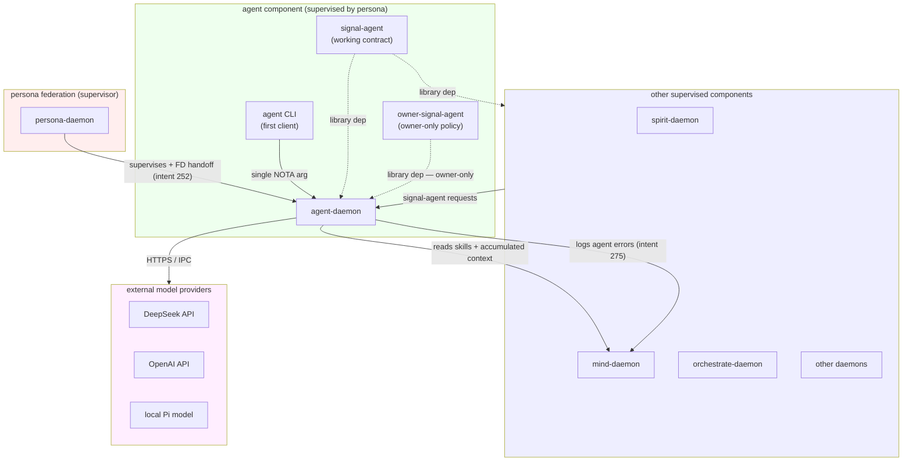
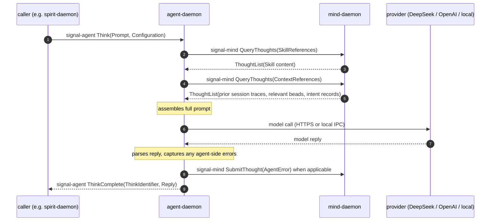
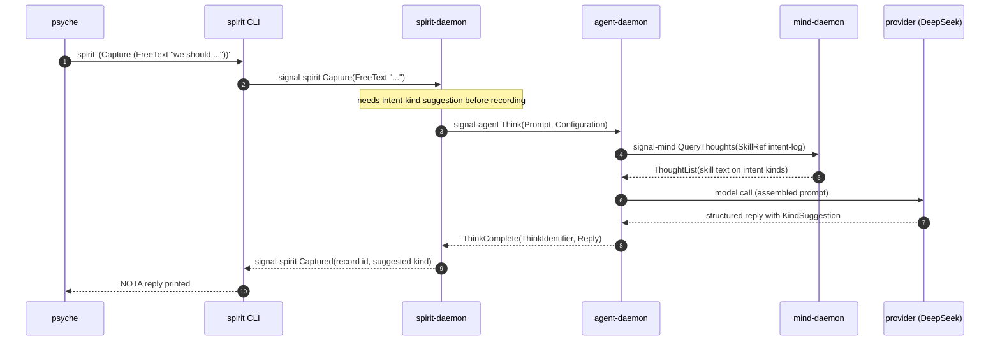
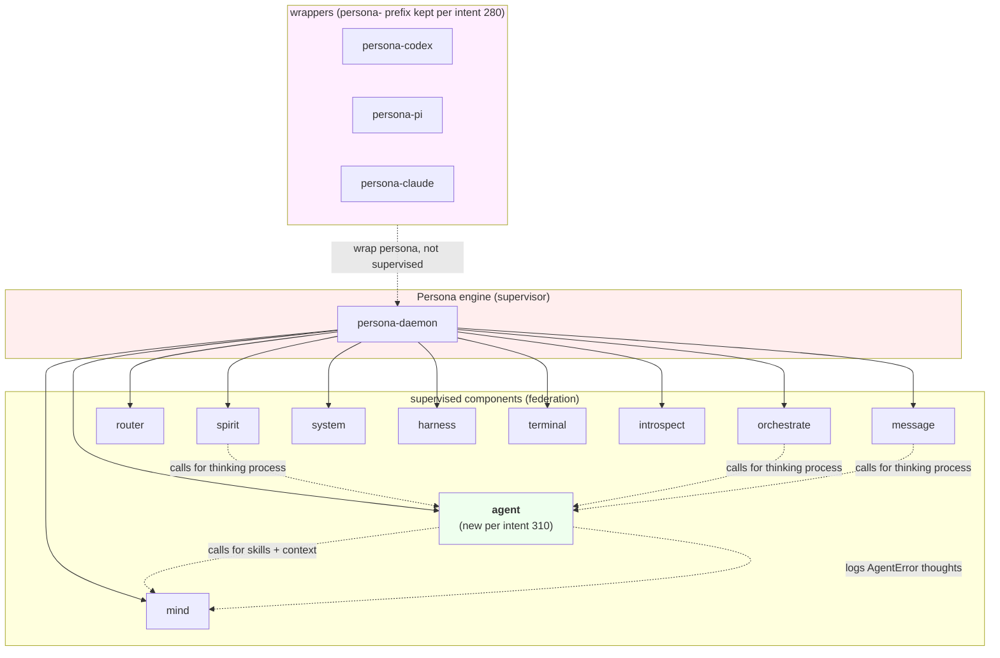
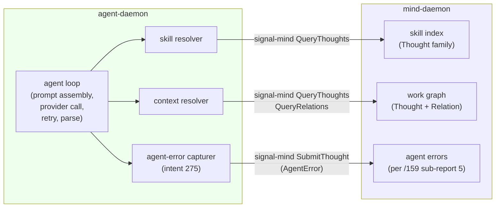

*Kind: Design · Topic: agent triad · Date: 2026-05-23*

# 1 — Agent triad design

## What this slice is

Sub-report A of meta-report 161 (design cascade and context sweep).
Designs the **agent** triad component newly framed by psyche intent
record 310. Intent 310 supersedes the prior `persona-llm-client`
library framing (spirit records 157 and 158) and reframes the
workspace's LLM-call surface as its own first-class supervised triad
component named simply `agent`. This sub-report lays out what agent
is, the triad shape, the working signal contract, the owner contract,
the mind-integration hook, and a worked example showing how spirit
(the first plausible internal consumer) calls into agent for a quick
model-classified intent-kind suggestion.

Authority: intent 310 (Maximum) for the rename and triad shape;
intents 280 + 270 for the binary naming convention; intents 244 +
251 + 271 + 272 + 273 for the three-tier signal sizing wisdom that
agent's signal types inherit; intent 252 for the FD-handoff routing
discipline; intent 275 for the agent-error feedback loop into mind.

## What agent is

An **agent** is a thinking process built from a model call. Verbatim
from intent 310: "model call plus agent equals a thinking process —
that IS what an agent is." Agent the component is the workspace's
canonical surface for that thinking process: NOTA in, NOTA out, with
the model call and surrounding agent loop pre-configured behind a
typed contract. Other supervised components call into agent when
they need a quick pre-configured API agent call — model selection,
prompt assembly, skill access via mind, accumulated context via mind,
retry semantics, and reply rendering all live inside the agent
daemon rather than being re-implemented by every caller.

**Contrast with a raw API call.** A raw API call is just the model
call by itself — bytes in, bytes out, no skills, no accumulated
context, no error capture, no retry policy, no cost accounting. The
agent layer is what turns the raw model call into a thinking
process: the model is the thinking *engine*; the agent loop is the
thinking *discipline* that wraps it. A component that only needs
raw token generation against a single prompt without any of the
discipline could in principle bypass agent and talk to a provider
directly, but the workspace pattern is to go through agent so the
discipline applies uniformly. Components that want the discipline —
which is essentially every workspace consumer — call agent.

Agent is a **supervised** component, not a wrapper. It joins the
federation alongside spirit, mind, orchestrate, router, message,
system, harness, terminal, and introspect. Persona supervises it
the same way it supervises any other supervised component (FD
handoff per intent 252, lifecycle, socket allocation, restart
policy). The `persona-` prefix is dropped per intent 280; the name
is just `agent`.

## Triad shape

Standard supervised-component triad layout per `skills/component-triad.md`:

| Repo | Role | Binaries |
|---|---|---|
| `agent` | daemon + thin CLI | `agent` (CLI) + `agent-daemon` (daemon) |
| `signal-agent` | working signal contract | (library crate) |
| `owner-signal-agent` | owner-only policy contract | (library crate) |

Per intent 270 the CLI binary is `agent` and the daemon binary is
`agent-daemon`. The CLI is the daemon's first client (a thin Signal
client per intent 1) and takes exactly one NOTA argument per the
single-argument rule in `skills/component-triad.md`.



## Operations on the working signal contract (signal-agent)

Working-signal operations a consumer can call. Verb-namespace
shape per intent 271: byte 0 is the root verb (the "beingness" of
the request); bytes 1-7 carry packed sub-discriminators. All
records are positional NOTA per `skills/nota-design.md` — type
first, then fields in declared order, no keywords.

```text
Operation root verbs (signal-agent):

(Think <Prompt> <Configuration>)
    Issue a unary thinking request. Daemon assembles the prompt
    (skills + accumulated context pulled from mind per Configuration),
    runs one or more provider calls per retry policy, returns one
    typed Reply. Most common operation.

(StreamThink <Prompt> <Configuration>)
    Streaming variant. Opens a subscription delivering token deltas
    plus a terminal Reply. Closes when the model finishes, when
    CancelThink fires, or when the consumer drops the subscription.

(CancelThink <ThinkIdentifier>)
    Cancel an in-flight Think or StreamThink. Replies with the
    captured partial reply if any.

(QueryThink <ThinkIdentifier>)
    Query status of a Think (Pending / Streaming / Complete /
    Failed / Cancelled) without subscribing.

(ListModels <ModelFilter>)
    List models the daemon can route to right now (provider up,
    spending cap not exhausted, owner policy allows).

(EstimateCost <Prompt> <Configuration>)
    Pre-flight cost estimate for a Think call without issuing it.
    Returns predicted input tokens, predicted output tokens, and
    cost per the current model price table.
```

Record shapes (positional NOTA, illustrative — actual field names
land in the contract crate per `skills/naming.md`):

```text
(Prompt
  (System "<system instructions>")
  (Skills (SkillReference ...) (SkillReference ...) ...)
  (Context (ContextReference ...) ...)
  (Conversation (Turn (Role User) "<user turn>") (Turn (Role Assistant) "<...>") ...))

(Configuration
  (Model (ModelReference ...))         ; or (Model Default)
  (Temperature (Temperature ...))
  (MaxOutputTokens (TokenCount ...))
  (RetryPolicy (RetryPolicy ...))
  (CostCeiling (Optional (Cost ...))))

(SkillReference
  (SkillName "naming")                  ; resolved against mind's skill index
  (Tier Apex))                          ; or Keystroke / Topic / Mechanism

(ContextReference
  (Origin Mind)                         ; or Spirit / Reports / Repo
  (Query <QueryShape>)                  ; mind QueryThoughts shape for the relevant subset
  (Window <ContextWindow>))             ; how much to include
```

Reply root verbs:

```text
(ThinkComplete <ThinkIdentifier> <Reply>)
(ThinkStreamDelta <ThinkIdentifier> <Delta>)
(ThinkStreamTerminal <ThinkIdentifier> <Reply>)
(ThinkCancelled <ThinkIdentifier> (Optional <PartialReply>))
(ThinkFailed <ThinkIdentifier> (FailureReason ...))
(ThinkStatus <ThinkIdentifier> <Status>)
(ModelList <ModelReference> ...)
(CostEstimate <Cost> <TokenCount> <TokenCount>)
```

The 8x8 verb-namespace pattern from intent 271 applies: each root
verb occupies byte 0 of the Tier 1 LogVariant; sub-discriminators
pack into bytes 1-7. ThinkComplete, ThinkStreamDelta, ThinkFailed,
and the rest each get their own root-verb slot, leaving room within
the 8-slot ceiling for future operations without restructuring.

## Owner authority verbs (owner-signal-agent)

Administrative operations only the owner can invoke. Lives in the
separate `owner-signal-agent` crate per the triad discipline so
working-signal callers can't mistakenly bind owner authority into
their dependency graph.

```text
(SetDefaultModel <ModelReference>)
    Set the model agent picks when a Think request specifies
    (Model Default). Default-default is whatever ships in the
    initial policy.

(RegisterModel <ModelDescriptor>)
    Add a model to the registry. Includes provider, model name,
    pricing table, context-window size, capabilities (vision,
    function-calling, streaming), and any provider-specific tuning.

(RemoveModel <ModelReference>)
    Drop a model from the registry. In-flight Thinks against that
    model complete; new requests routed elsewhere or refused.

(SetSpendingCap <Period> <Cost>)
    Cap total spend per period (Hour / Day / Week / Month / Total).
    Once hit, new Thinks refuse with FailureReason::SpendingCapHit
    until reset or raised.

(LimitTokens <Scope> <TokenCount>)
    Cap tokens per Scope (PerThink / PerConsumer / PerDay).
    PerConsumer cap keyed by Signal-auth identity so one component
    can't starve others.

(SetRetryPolicy <RetryPolicy>)
    Workspace default retry policy. Per-Think overrides allowed
    inside their own ceiling.

(SetProviderCredentials <ProviderReference> <CredentialReference>)
    Set the credential agent uses for a given provider. The
    credential itself lives outside this contract (e.g. a system
    keyring path); this records only the binding.

(SetSkillRoute <SkillReference> <ResolutionPolicy>)
    Owner-policy hook for how a SkillReference in a Prompt resolves
    against mind. Default policy walks the typed skill index;
    owner can pin specific resolutions.

(SetContextPolicy <ContextPolicy>)
    Workspace-wide policy on how much accumulated context agent
    auto-pulls when a Prompt declares ContextReferences. Default
    bounds keep agent from inadvertently exhausting context window.

(SetErrorReporting <ErrorReportingPolicy>)
    How agent reports its own errors into mind per intent 275:
    every error / errors above Severity threshold / off (for tests).
```

## Mind integration

Agent calls **mind** to resolve skills and pull accumulated context.
Mind is the workspace's typed memory; agent treats it as a read
substrate for what the agent loop needs to assemble a prompt.
Mind already exposes the right operations per `signal-persona-mind`:
SubmitThought / SubmitRelation / QueryThoughts / QueryRelations /
SubscribeThoughts / SubscribeRelations (intent 280 will rename the
crate to `signal-mind`).



**Skill resolution.** A `SkillReference` inside a Prompt resolves
against mind. Agent issues `QueryThoughts` against the skill index
(a stable thought family) and pulls the referenced skill's content.
Tier filter on the reference selects Apex / Keystroke / Topic /
Mechanism scope. Owner policy `SetSkillRoute` can pin specific
resolutions when the default index walk is wrong for a specific
component.

**Accumulated context.** A `ContextReference` declares an Origin
(Mind / Spirit / Reports / Repo) and a Query the daemon issues
against that origin. For Mind origin the Query maps to
QueryThoughts/QueryRelations directly. For Spirit origin the
daemon makes a `signal-spirit Observe` call. For Reports origin
the daemon reads from the workspace reports directory under a
controlled root. For Repo origin the daemon reads from a specified
repo checkout under a controlled root. The Window field caps how
much from each origin lands in the assembled prompt.

**Error reporting back into mind.** Per intent 275, agent-side
errors (mermaid syntax in a model reply, NOTA formatting violation
in the model's structured output, naming violations the model
introduced) become typed AgentError thoughts in mind. The
ErrorReportingPolicy verb in owner-signal-agent governs which
errors get reported. This closes the auditor loop described in
sub-report 159/5.

## How other components use agent

Concrete worked example. Spirit (the intent-log daemon) wants a
quick model-classified intent-kind suggestion: psyche has typed
a free-text intent into the spirit CLI, and spirit wants to
suggest "Decision" vs. "Principle" vs. "Correction" before
recording. Spirit calls agent's Think operation:



Spirit's request shape, illustrative:

```text
(Think
  (Prompt
    (System "Classify the following psyche intent statement.")
    (Skills
      (SkillReference (SkillName "intent-log") (Tier Apex)))
    (Context
      (ContextReference
        (Origin Mind)
        (Query (QueryThoughts (ThoughtKind IntentRecord) (Limit 10)))
        (Window (Recent 10))))
    (Conversation
      (Turn (Role User) "we should rename persona-llm-client to agent...")))
  (Configuration
    (Model Default)
    (Temperature (Temperature 0.0))
    (MaxOutputTokens (TokenCount 256))
    (RetryPolicy (RetryPolicy (Attempts 2) (BackoffMillis 500)))
    (CostCeiling None)))
```

Other consumers that benefit from agent:

- **mind-daemon** itself, when a query result needs natural-language
  summarisation for a CLI render
- **orchestrate-daemon**, when claiming a lane and proposing the
  first reasonable claim text from a free-text task description
- **auditor** (per intent 234/235), which reads the AgentError
  stream and uses agent to draft skill-update prose
- **message-daemon**, when summarising a long thread for an arriving
  agent
- **harness-daemon**, when adapting a harness-specific prompt format
  to the workspace's canonical shape

Each consumer issues NOTA in, gets NOTA out. The agent layer is
where pre-configured model choice, skill assembly, context
assembly, retry, and cost accounting all live.

## Sizing within the three-tier signal framework

Agent's signal types inherit the three-tier sizing wisdom from
intents 244, 251, 271, 272, and 273:

**Tier 1 — Operation LogVariant (64-bit).** Byte 0 is the root verb
(Think / StreamThink / CancelThink / QueryThink / ListModels /
EstimateCost on the request side; ThinkComplete /
ThinkStreamDelta / ThinkStreamTerminal / ThinkCancelled /
ThinkFailed / ThinkStatus / ModelList / CostEstimate on the reply
side). Bytes 1-7 carry packed sub-discriminators (model family,
provider, retry-attempt counter, failure-reason class). The macro
autogen pattern from designer/155 §1.5 covers the auto-derive.

**Tier 2 — extended 64-byte summary.** Hand-implemented projection
per intent 273. Carries enough fidelity for the auditor and for
post-hoc log analysis: ThinkIdentifier (16 bytes), Model short ID
(2 bytes via universal-data-variant per intent 272), input/output
token counts (8 bytes), cost in microcents (8 bytes), 30 bytes
remaining for a prompt-summary checksum or short fingerprint. The
prompt-summary fingerprint is the load-bearing field — without it
the auditor can't deduplicate near-identical Thinks across calls.

**Tier 3 — full record.** Unrestricted rkyv. Carries the full
Prompt (assembled skills, assembled context, conversation), full
Reply (token stream, structured output, captured errors), full
Configuration, full retry trace.

Universal data variants per intent 272: the U8 / U16 short-ID
slots apply to agent the same way as every other namespace. Model
short ID (u16) and ThinkIdentifier (u16 short form + full u128
elsewhere) both ride these.

## Diagrams

### Agent's place in the persona federation



### Topology of the agent-mind hook



## Open design questions

Surface for psyche review before scaffolding lands:

- **Model registry — pull or push.** Owner can `RegisterModel`
  individual models, but the daemon also wants a sensible default
  set on startup (DeepSeek V4, OpenAI GPT-class for STT, local Pi
  model). Designer lean: ship a built-in default registry in
  agent-daemon's source, then let owner overrides override at
  runtime. Open: where does the default registry live — Nix
  parameter, source code, or owner-signal-agent default?
- **Multi-model routing.** Should `(Model Default)` walk a chain
  (try cheap first, escalate on failure)? Or should every Think
  pin a model up front? Designer lean: pin per Think, with
  Default resolving to one specific model per workspace policy.
  Chain-walking adds non-determinism the auditor must reconstruct.
- **Streaming vs unary by default.** Most consumers want unary
  (Think); streaming (StreamThink) is for interactive surfaces.
  Designer lean: Think is the default contract; StreamThink is
  the opt-in. Both stay first-class.
- **Cost accounting granularity.** Per-Think cost is cheap to
  track; per-consumer aggregate requires Signal-auth identity
  propagation. Designer lean: per-Think mandatory, per-consumer
  via SetSpendingCap PerConsumer scope, per-day rolling via
  PerDay scope. All three roll up to total.
- **Retry semantics.** Should agent retry on provider HTTP 5xx?
  On rate-limit (429)? On parse failure of structured output?
  Designer lean: yes to all three under the RetryPolicy budget;
  the policy specifies attempts and backoff, agent decides which
  classes are retryable.
- **Context window management.** When assembled prompt exceeds
  the model's context window, agent must decide: trim oldest
  context, summarise context, or refuse. Designer lean: refuse
  with FailureReason::ContextWindowExceeded by default; owner
  policy SetContextPolicy can swap in trim or summarise modes.
- **Provider credential storage.** Credentials live outside the
  signal contracts (system keyring, file, or env). Designer lean:
  follow whatever pattern persona already uses for its own
  secrets; revisit after persona's secret-handling lands.
- **Conversation memory across Thinks.** If a consumer wants
  multi-turn (Think A then Think B that references A's reply),
  does agent maintain an internal conversation id, or does the
  consumer round-trip the full conversation? Designer lean:
  consumer round-trips the conversation per Think (stateless
  agent-daemon per request); agent can extend with a ConversationId
  shape later if call patterns surface the need.
- **Local vs hosted model parity.** Local Pi-runtime models and
  hosted DeepSeek/OpenAI differ in latency, cost, and capability.
  Should the Configuration carry capability requirements
  (RequiresStreaming, RequiresFunctionCalling, RequiresVision)?
  Designer lean: yes — Capability requirements are how a Think
  declares what the model must support, and the routing layer
  picks accordingly.
- **Subagent dispatch.** Per intent 5 (no subagents without
  explicit psyche permission), the agent component must NOT
  dispatch its own subagents on behalf of a Think caller. The
  agent loop is a single thinking process per Think; if a
  consumer wants parallel thinking, the consumer issues parallel
  Thinks. Open: how does the daemon enforce this — by code or
  by convention?
- **Test discipline.** How does a test harness mock the provider
  call? Designer lean: agent-daemon takes a NOTA configuration
  field that points at a local mock provider; tests run agent
  against the mock; integration tests run against a recorded
  cassette per provider.

## Bead recommendations

Five P2/P3 beads for the agent triad creation and follow-ons.
Each cites intent 310 in the body. Filed below.

## Beads filed

Five beads filed in this slice (all P2 / P3 per the brief):

- **`primary-fwll`** (signal-agent contract crate, P2) —
  `[Create signal-agent contract crate]` — define typed records
  for Think / StreamThink / CancelThink / QueryThink / ListModels /
  EstimateCost requests plus matching reply variants; verb-namespace
  layout per intent 271; Tier 1 LogVariant autogen per intent 251.
  Cites intent 310 (Maximum) for the component scope.
- **`primary-7i6a`** (owner-signal-agent contract crate, P2) —
  `[Create owner-signal-agent contract crate]` — define
  owner-authority records for SetDefaultModel / RegisterModel /
  RemoveModel / SetSpendingCap / LimitTokens / SetRetryPolicy /
  SetProviderCredentials / SetSkillRoute / SetContextPolicy /
  SetErrorReporting. Cites intent 310.
- **`primary-24as`** (agent repo scaffolding, P2) —
  `[Create agent daemon + CLI scaffolding (full repo)]` — `agent`
  repo with `agent` CLI binary and `agent-daemon` daemon binary
  per intent 270; Kameo actor for the agent loop; provider adapter
  trait (DeepSeek + OpenAI + local-Pi initial implementations);
  Unix-socket Signal-frame transport per the rest of the
  federation. Depends on the two contract crate beads. Cites
  intent 310.
- **`primary-c0pp`** (agent-mind integration design, P2) —
  `[Design agent-mind integration: signal-mind operations agent
  calls for skills/context]` — design + land the SkillResolver
  and ContextResolver inside agent-daemon; what
  SubscribeThoughts / QueryThoughts shapes agent issues against
  mind; how Tier filter on SkillReference maps to mind's skill
  index. Cites intent 310 and 275.
- **`primary-g3gm`** (cascade rename, P3) —
  `[Replace persona-llm-client references in workspace with agent
  (post-rename cascade)]` — sweep workspace for
  `persona-llm-client` mentions in reports, skills, ARCH files,
  bead bodies (intent records unchanged per
  `skills/intent-maintenance.md`); update each to `agent` per
  intent 310. Coordinates with the broader prefix-removal cascade
  bead `primary-0m1u` in /160. Cites intent 310 and 280.

## How it fits

Cross-references inside meta-report 161:

- **Sub-report 4 (operator audit)** — agent uses operator-shaped
  patterns (Kameo actors, Unix-socket Signal-frame transport,
  positional NOTA contracts, persona FD-handoff per intent 252).
  The operator audit checks that agent's intended scaffolding
  doesn't drift from those patterns when implementation begins.
- **Sub-report 5 (intent manifestation gap audit)** — agent
  design extends three-tier sizing (intents 244 + 251 + 271 +
  272 + 273) into a new namespace. Five intent records manifest
  through the verb-namespace layout in §"Operations" and the
  extended-byte summary in §"Sizing".
- **Sub-report 7 (overview)** — agent's topology diagram and the
  spirit-calls-agent sequence diagram are reusable in the
  meta-synthesis; pull them forward when narrating how the agent
  triad joins the federation.

External cross-references:

- `reports/second-designer/159-intent-manifestation/5-persona-mind-agent-error-design.md`
  — the AgentError schema agent writes into mind per intent 275.
- `reports/second-designer/160-persona-prefix-removal-coordinated-rename-2026-05-23.md`
  — naming context; agent drops the persona- prefix per intent 280.
  Note: /160 lists `persona-llm-client` under wrappers (pre-310);
  intent 310 supersedes that — `persona-llm-client` is being
  renamed to `agent` (supervised, not wrapping).
- `reports/designer/281-headless-pi-research.md` — the headless-Pi
  research that informed the LLM-client direction. Section 3
  integration shape is superseded by intent 310 (agent triad
  subsumes the LLM-client library framing of spirit 157/158); the
  Pi capture surface findings in §1-§2 remain valid as reference
  for the agent loop's tracing requirements.
- `reports/designer/268-persona-pi-operator-input.md` — related
  Pi work; persona-pi (the Pi-runtime wrapper) is distinct from
  the agent triad (the workspace's pre-configured thinking-process
  surface). persona-pi keeps the persona- prefix per intent 280;
  agent is its own component.
- Spirit records: 310 (parent — Maximum), 280 (prefix discipline,
  Maximum), 270 (binary naming, Maximum), 252 (FD-handoff,
  Maximum), 244 + 251 + 271 + 272 + 273 (three-tier sizing +
  verb-namespace + universal data variants + extended byte tier,
  Maximum/Medium), 275 (agent-error events, Medium), 157 + 158
  (legacy persona-llm-client direction, both superseded by 310).
- `skills/component-triad.md` — the triad discipline agent
  inherits (daemon + CLI + working signal + owner signal; single
  NOTA argument rule).
- `skills/nota-design.md` — positional record discipline for the
  contract records.
- `skills/naming.md` — full English words + no-ancestry for the
  field names in the contracts.
- `~/primary/repos/persona-mind/ARCHITECTURE.md` — the mind
  daemon agent integrates with (intent 280 renames to
  `~/primary/repos/mind/ARCHITECTURE.md`).
- `~/primary/repos/persona/ARCHITECTURE.md` — supervisor's view;
  agent joins the federation table.
